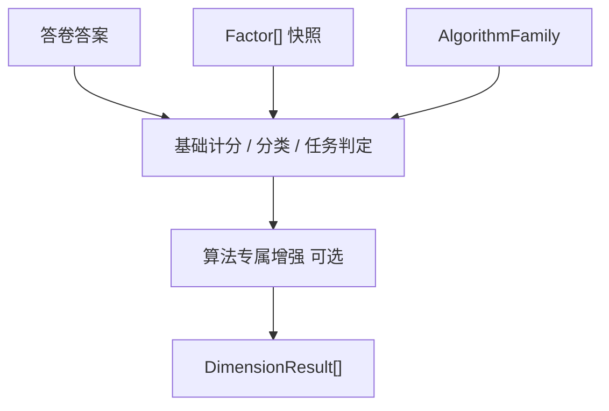

# Factor 通用构件

**本文回答**：Factor 在 ModelCatalog 中是什么、服务哪些执行算法族、与 Evaluation 输出的 Dimension 如何区分，以及当前代码落点与演进方向。

---

## 1. 结论

- **Factor 是 ModelCatalog 的通用维度构件**，不属于 `scale`，也不属于 `behavioral_rating`。
- Factor **只描述**题目归属、聚合规则、解释/分类/常模引用；**不负责执行**。
- **`AlgorithmFamily` 决定如何使用 Factor**；具体 `Algorithm`（如 `brief2`、`mbti`、`spm`）在通用 Factor 结构上叠加专属 profile。
- Evaluation 输出侧继续叫 **`DimensionResult`**，避免与 catalog 侧 Factor 混名。

---

## 2. Factor 定义

Factor 是发布态模型快照中的**稳定维度单元**，表达：

1. 哪些题目归属于这个维度（`question_codes`）；
2. 如何从题目答案聚合原始分（`scoring_strategy` / `ScoringSpec`）；
3. 是否参与总分、指数、效度、题组等语义角色（`FactorRole`）；
4. 分数区间解释、极性分类、常模查表等规则如何引用该维度。

一句话：**Factor = 模型结构；Evaluator = 执行；AlgorithmFamily = 解释路径选择器。**

---

## 3. 与模型身份双轴的关系

模型身份（已实现）与 Factor 结构层分工如下：

| 层 | 字段 / 概念 | 回答的问题 |
| ---- | ----------- | ---------- |
| 产品分类 | `ProductChannel` | 产品/运营视角这类测评属于什么频道 |
| 执行算法族 | `AlgorithmFamily` | 底层如何解释 Factor（记分/分类/常模/任务表现） |
| 具体算法 | `Algorithm` | 具体是 Brief-2、MBTI、SPM 等哪一个 |
| 结构构件 | `Factor` | 快照里有哪些维度、如何计分与引用规则 |

代码锚点：[`internal/apiserver/domain/modelcatalog/algorithm_family.go`](../../../internal/apiserver/domain/modelcatalog/algorithm_family.go)、[`product_channel.go`](../../../internal/apiserver/domain/modelcatalog/product_channel.go)。

---

## 4. AlgorithmFamily 如何使用 Factor

| AlgorithmFamily | Factor 主要用法 | 典型测评 |
| --------------- | --------------- | -------- |
| `factor_scoring` | `ScoringSpec` + 分数区间解释 | PHQ-9、GAD-7、普通医学/行为量表 |
| `factor_classification` | 维度得分 → 极性判断 → 类型组合 | MBTI、SBTI、BigFive 类型化 |
| `factor_norm` | 原始分 → 常模查表 → T 分/百分位 | BRIEF-2、Conners 等 |
| `task_performance` | 题组/任务集维度 + 能力等级（可选常模） | SPM、注意力/工作记忆任务 |

执行链路抽象：



Brief-2 是当前最典型的两层结构：**scale-like 原始分计分** + **Brief-2 profile 常模增强**（`EnrichBrief2Outcome`）。

---

## 5. FactorRole：维度的业务语义

Factor 短期继续叫 Factor，文档中视为**广义因子/维度**。用 `FactorRole` 区分同一 Factor 结构在不同测评中的语义：

| FactorRole | 含义 | 示例 |
| ---------- | ---- | ---- |
| `dimension` | 常规模型维度（默认） | PHQ-9 抑郁因子、BRIEF-2 inhibit |
| `total` | 总分维度 | 量表总分 |
| `index` | 复合指数 | BRIEF-2 BRI / ERI / CRI / GEC |
| `validity` | 效度指标 | BRIEF-2 一致性/负向作答 |
| `subtest` | 子测验 | 认知子模块 |
| `task_set` | 任务题组 | SPM Set A–E |

`task_performance` 不必强行塞进 `factor_norm` 常模模型；SPM 题组更适合 `task_set` + `SPMProfile`。

---

## 6. 目标结构（演进中的 canonical 形态）

代码尚未全部收敛到 shared 包；以下为**目标抽象**，指导后续重构：

```go
// 目标包：internal/apiserver/domain/modelcatalog/factor（待建）

type FactorSnapshot struct {
    Code           string
    Title          string
    Role           FactorRole
    IsTotalScore   bool
    QuestionCodes  []string
    Scoring        ScoringSpec
    Interpretation *InterpretationSpec   // factor_scoring
    Classification *ClassificationSpec   // factor_classification
    Norm           *NormRef              // factor_norm，只引用，不含表体
}
```

### 6.1 ScoringSpec（因子记分）

| 策略 | 说明 |
| ---- | ---- |
| `sum` | 题目分求和 |
| `avg` | 题目分平均 |
| `weighted_sum` | 加权求和 |
| `cnt` | 计数（scale 医学量表现有） |

### 6.2 InterpretationSpec（分数区间解释）

`min_score` / `max_score` → `level` / `conclusion` / `suggestion`。对应 behavioral_rating 的 `InterpretRuleSnapshot` 与 scale 的 `InterpretRuleSnapshot`（字段名略有差异，语义相同）。

### 6.3 ClassificationSpec（因子分类）

极性维度：`positive_pole` / `negative_pole` + 决策规则。服务 MBTI E/I、S/N 等。personality typology 当前用 `FactorGraphSpec` / `Dimension`，中长期可提供只读适配到 canonical Factor。

### 6.4 NormRef（常模引用）

只保存 `factor_code`、`norm_table_version` 等引用；**常模表体**仍由算法 profile 承载（如 [`behavioral_rating/brief2`](../../../internal/apiserver/domain/modelcatalog/behavioral_rating/brief2/)）。

---

## 7. 当前代码事实（2026-07）

### 7.1 共享 DefinitionBody

`behavioral_rating`、`cognitive` 与 legacy behavior scale API 的 `dimensions` / `interpret_rules` 已收敛到 [`factor.DefinitionBody`](../../../internal/apiserver/domain/modelcatalog/factor/definition_body.go)。各 family 仅在共享 body 上叠加算法 profile（`brief2` / `spm`）。

### 7.2 三处发布态 FactorSnapshot 执行视图

以下包各自定义了几乎同构的 `FactorSnapshot`：

| 包 | 文件 | 说明 |
| -- | ---- | ---- |
| `scale/snapshot` | [`payload.go`](../../../internal/apiserver/domain/modelcatalog/scale/snapshot/payload.go) | 医学量表发布 payload；含 `ScoringParams` |
| `behavioral_rating/snapshot` | [`payload.go`](../../../internal/apiserver/domain/modelcatalog/behavioral_rating/snapshot/payload.go) | 行为评定；含 `Brief2Profile` |
| `cognitive/snapshot` | [`payload.go`](../../../internal/apiserver/domain/modelcatalog/cognitive/snapshot/payload.go) | 认知测评；含 `SPMProfile` |

`behavioral_rating` 与 `cognitive` 通过 **`ToScaleSnapshot()`** 投影到 scale 形态，再复用 scale executor。这说明 Factor 本质上已是跨族共用结构，只是尚未上抽到 shared 包。

### 7.3 编辑层 vs 发布层

| 层 | 位置 | 职责 |
| -- | ---- | ---- |
| 编辑层 | [`scale/definition/factor.go`](../../../internal/apiserver/domain/modelcatalog/scale/definition/factor.go) | 医学量表草稿中的可变 `Factor` 实体、校验、`FactorCode` |
| 发布层 | 各 family `snapshot` | 冻结后的 `FactorSnapshot`，供 Evaluation 消费 |

编辑层 Factor **保留**；shared factor 包收敛的是**发布态快照**，不替代草稿治理实体。

### 7.4 personality typology

[`personality/typology/spec.go`](../../../internal/apiserver/domain/modelcatalog/personality/typology/spec.go) 使用 `FactorGraphSpec` / `FactorSpec`（图结构、composite/leaf、option scoring）。与 scoring 型 FactorSnapshot **形不同、义相近**；已通过 [`personality/typology/factor_adapter.go`](../../../internal/apiserver/domain/modelcatalog/personality/typology/factor_adapter.go) 提供只读映射到 canonical `factor.FactorSnapshot`。

### 7.5 Evaluation 输出

[`assessment/outcome.go`](../../../internal/apiserver/domain/evaluation/assessment/outcome.go) 使用 `DimensionResult` 表达执行结果。Brief-2 增强遍历 `outcome.Dimensions`，按 `dim.Code` 查常模。

**命名约定**：

| 上下文 | 名称 |
| ------ | ---- |
| ModelCatalog 快照 | Factor / FactorSnapshot |
| Evaluation 结果 | Dimension / DimensionResult |

---

## 8. 典型测评映射

| 测评 | ProductChannel（示例） | AlgorithmFamily | Factor 用法 |
| ---- | ---------------------- | --------------- | ----------- |
| PHQ-9 | `medical_scale` | `factor_scoring` | 单/多维度 + 分数区间 |
| MBTI | `personality` | `factor_classification` | E/I、S/N… 极性维度 |
| BRIEF-2 | `behavior_ability` 或 `medical_scale` | `factor_norm` | 行为维度 + index/validity + Brief-2 常模 profile |
| SPM | `cognitive` 或 `behavior_ability` | `task_performance` | `task_set` 题组 + SPM profile |

---

## 9. 演进路线（文档阶段 → 代码阶段）

| 阶段 | 内容 | 状态 |
| ---- | ---- | ---- |
| 阶段一 | 文档固化 Factor 定位与边界 | **本文** |
| 阶段二 | 新增 `modelcatalog/factor` shared 包；三处 snapshot 改引用 | **已完成** |
| 阶段三 | personality 只读适配器；清理 `ToScaleSnapshot` 重复逻辑 | **已完成** |
| 阶段四 | payload JSON 收敛、norm 上抽 | **本文** |

阶段二/三**明确不做**：不改 payload format 字符串；不搬 `brief2.NormTables`；不改 `DimensionResult`；不改 evaluator 路由。

---

## 10. 反例

| 反例 | 正确理解 |
| ---- | -------- |
| Factor 属于 scale | Factor 属于 ModelCatalog 结构层；scale 只是早期主链路 |
| Factor 会执行计分 | 执行在 Evaluation；Factor 只是快照输入 |
| 应把 Factor 全面改名为 Dimension | catalog 侧短期保留 Factor；outcome 侧已是 Dimension |
| Brief-2 常模表应塞进每个 Factor | 表体在 algorithm profile；Factor 只保留 NormRef |
| personality 必须立刻统一成 FactorSnapshot | 图结构不同，用适配器渐进对齐 |

---

## 11. 相关文档

- [02-领域模型.md](./02-领域模型.md)
- [04-模型发布与快照链路.md](./04-模型发布与快照链路.md)
- [../30-evaluation/04-计分与因子计算链路.md](../30-evaluation/04-计分与因子计算链路.md)
- [../04-术语表.md](../04-术语表.md)
