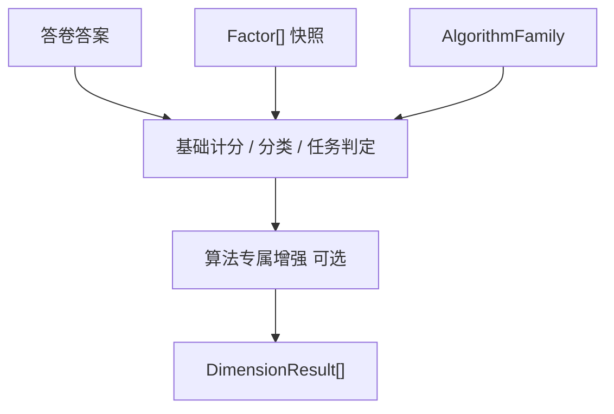
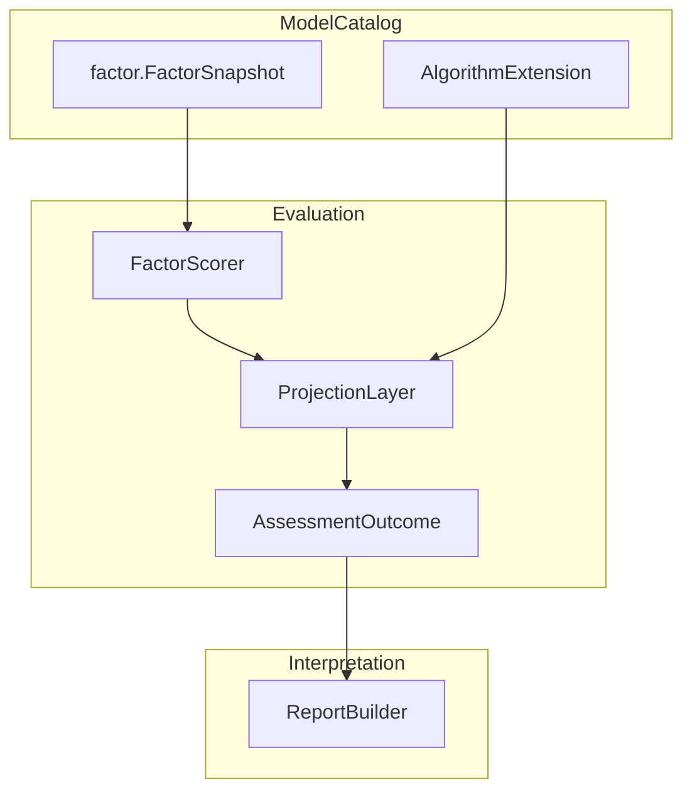
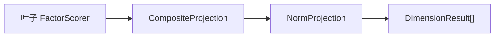

# Factor 通用构件

**本文回答**：Factor 在 ModelCatalog 中是什么、服务哪些执行算法族、与 Evaluation 输出的 Dimension 如何区分，以及当前代码落点与演进方向。

---

## 1. 结论

- **Factor 是 ModelCatalog 的通用维度构件**，不属于 `scale`，也不属于 `behavioral_rating`。
- Factor **只描述**题目归属、聚合规则、解释/分类/常模引用；**不负责执行**。
- **`AlgorithmFamily` 决定如何使用 Factor**；具体 `Algorithm`（如 `brief2`、`mbti`、`spm`）在通用 Factor 结构上叠加专属 profile。
- Evaluation 输出侧继续叫 **`DimensionResult`**，避免与 catalog 侧 Factor 混名。

---

## 2. Factor 定义

Factor 是发布态模型快照中的**稳定维度单元**，表达：

1. 哪些题目归属于这个维度（`question_codes`）；
2. 如何从题目答案聚合原始分（`scoring_strategy` / `ScoringSpec`）；
3. 是否参与总分、指数、效度、题组等语义角色（`FactorRole`）；
4. 分数区间解释、极性分类、常模查表等规则如何引用该维度。

一句话：**Factor = 模型结构；Evaluator = 执行；AlgorithmFamily = 解释路径选择器。**

---

## 3. 与模型身份双轴的关系

模型身份（已实现）与 Factor 结构层分工如下：

| 层 | 字段 / 概念 | 回答的问题 |
| ---- | ----------- | ---------- |
| 产品分类 | `ProductChannel` | 产品/运营视角这类测评属于什么频道 |
| 执行算法族 | `AlgorithmFamily` | 底层如何解释 Factor（记分/分类/常模/任务表现） |
| 具体算法 | `Algorithm` | 具体是 Brief-2、MBTI、SPM 等哪一个 |
| 结构构件 | `Factor` | 快照里有哪些维度、如何计分与引用规则 |

代码锚点：[`internal/apiserver/domain/modelcatalog/algorithm_family.go`](../../../internal/apiserver/domain/modelcatalog/algorithm_family.go)、[`product_channel.go`](../../../internal/apiserver/domain/modelcatalog/product_channel.go)。

---

## 4. AlgorithmFamily 如何使用 Factor

| AlgorithmFamily | Factor 主要用法 | 典型测评 |
| --------------- | --------------- | -------- |
| `factor_scoring` | `ScoringSpec` + 分数区间解释 | PHQ-9、GAD-7、普通医学/行为量表 |
| `factor_classification` | 维度得分 → 极性判断 → 类型组合 | MBTI、SBTI、BigFive 类型化 |
| `factor_norm` | 原始分 → 常模查表 → T 分/百分位 | BRIEF-2、Conners 等 |
| `task_performance` | 题组/任务集维度 + 能力等级（可选常模） | SPM、注意力/工作记忆任务 |

执行链路抽象：



Brief-2 是当前最典型的两层结构：**scale-like 原始分计分** + **Brief-2 profile 常模增强**（`EnrichBrief2Outcome`）。

---

## 5. FactorRole：维度的业务语义

Factor 短期继续叫 Factor，文档中视为**广义因子/维度**。用 `FactorRole` 区分同一 Factor 结构在不同测评中的语义：

| FactorRole | 含义 | 示例 |
| ---------- | ---- | ---- |
| `dimension` | 常规模型维度（默认） | PHQ-9 抑郁因子、BRIEF-2 inhibit |
| `total` | 总分维度 | 量表总分 |
| `index` | 复合指数 | BRIEF-2 BRI / ERI / CRI / GEC |
| `validity` | 效度指标 | BRIEF-2 一致性/负向作答 |
| `subtest` | 子测验 | 认知子模块 |
| `task_set` | 任务题组 | SPM Set A–E |
| `report_group` | 报告分组，不参与计分 | 人格报告章节、Brief-2 展示分组 |
| `ability_domain` | 能力域 | 认知能力模型顶层域 |

`task_performance` 不必强行塞进 `factor_norm` 常模模型；SPM 题组更适合 `task_set` + `SPMProfile`。

**命名对照（文档 vs 代码）**：设计讨论中的 `factor` ≈ 代码 `dimension`；`composite_index` ≈ 代码 `index`。新增 role 优先扩枚举，不强制重命名已有值。

---

## 6. Canonical 形态（已实现）

[`internal/apiserver/domain/modelcatalog/factor`](../../../internal/apiserver/domain/modelcatalog/factor/) 已落地：

```go
type FactorSnapshot struct {
    Code            string
    Title           string
    Role            FactorRole
    ParentCode      string            // 多级因子：父维度 code，空=根
    SortOrder       int               // 同级排序
    Level           int               // 可由 ParentCode 推导，payload 可省略
    IsTotalScore    bool
    QuestionCodes   []string
    ScoringStrategy string
    ScoringParams   *ScoringParams
    MaxScore        *float64
    InterpretRules  []ScoreRangeRule
    Classification  *ClassificationSpec
    Norm            *NormRef
    ChildrenPolicy  *ChildrenPolicy    // role=index 时必填
}
```

`ParentCode` / `ChildrenPolicy` 已入类型草案（[`hierarchy.go`](../../../internal/apiserver/domain/modelcatalog/factor/hierarchy.go)）；**执行器尚未消费**，单层模型行为不变。

### 6.1 ScoringSpec（因子记分）

| 策略 | 说明 |
| ---- | ---- |
| `sum` | 题目分求和 |
| `avg` | 题目分平均 |
| `weighted_sum` | 加权求和 |
| `cnt` | 计数（scale 医学量表现有） |

### 6.2 InterpretationSpec（分数区间解释）

`min_score` / `max_score` → `level` / `conclusion` / `suggestion`。对应 behavioral_rating 的 `InterpretRuleSnapshot` 与 scale 的 `InterpretRuleSnapshot`（字段名略有差异，语义相同）。

### 6.3 ClassificationSpec（因子分类）

极性维度：`positive_pole` / `negative_pole` + 决策规则。服务 MBTI E/I、S/N 等。personality typology 当前用 `FactorGraphSpec` / `Dimension`，中长期可提供只读适配到 canonical Factor。

### 6.4 NormRef（常模引用）

只保存 `factor_code`、`norm_table_version` 等引用；**常模表体**仍由算法 profile 承载（如 [`behavioral_rating/brief2`](../../../internal/apiserver/domain/modelcatalog/behavioral_rating/brief2/)）。

---

## 7. 当前代码事实（2026-07）

### 7.1 共享 DefinitionBody

`behavioral_rating`、`cognitive` 与 legacy behavior scale API 的 `dimensions` / `interpret_rules` 已收敛到 [`factor.DefinitionBody`](../../../internal/apiserver/domain/modelcatalog/factor/definition_body.go)。各 family 仅在共享 body 上叠加算法 profile（`brief2` / `spm`）。

### 7.2 发布态执行视图

| 包 | 角色 |
| -- | ---- |
| `factor` | canonical `FactorSnapshot` + `DefinitionBody` |
| `scale/snapshot` | 执行视图（`Min/Max/RiskLevel`）；`factor_bridge.go` 互转 |
| `behavioral_rating/snapshot` | type alias + `brief2` profile |
| `cognitive/snapshot` | type alias + `spm` profile |

`behavioral_rating` / `cognitive` 经 **`ToScaleSnapshot()`** → scale executor；Factor 语义在 canonical 层统一。

### 7.3 编辑层 vs 发布层

| 层 | 位置 | 职责 |
| -- | ---- | ---- |
| 编辑层 | [`scale/definition/factor.go`](../../../internal/apiserver/domain/modelcatalog/scale/definition/factor.go) | 医学量表草稿中的可变 `Factor` 实体、校验、`FactorCode` |
| 发布层 | 各 family `snapshot` | 冻结后的 `FactorSnapshot`，供 Evaluation 消费 |

编辑层 Factor **保留**；shared factor 包收敛的是**发布态快照**，不替代草稿治理实体。

### 7.4 personality typology

[`personality/typology/spec.go`](../../../internal/apiserver/domain/modelcatalog/personality/typology/spec.go) 使用 `FactorGraphSpec` / `FactorSpec`（图结构、composite/leaf、option scoring）。与 scoring 型 FactorSnapshot **形不同、义相近**；已通过 [`personality/typology/factor_adapter.go`](../../../internal/apiserver/domain/modelcatalog/personality/typology/factor_adapter.go) 提供只读映射到 canonical `factor.FactorSnapshot`。

### 7.5 Evaluation 输出

[`assessment/outcome.go`](../../../internal/apiserver/domain/evaluation/assessment/outcome.go) 使用 `DimensionResult` 表达执行结果。Brief-2 增强遍历 `outcome.Dimensions`，按 `dim.Code` 查常模。

**命名约定**：

| 上下文 | 名称 |
| ------ | ---- |
| ModelCatalog 快照 | Factor / FactorSnapshot |
| Evaluation 结果 | Dimension / DimensionResult |

---

## 8. 典型测评映射

| 测评 | ProductChannel（示例） | AlgorithmFamily | Factor 用法 |
| ---- | ---------------------- | --------------- | ----------- |
| PHQ-9 | `medical_scale` | `factor_scoring` | 单/多维度 + 分数区间 |
| MBTI | `personality` | `factor_classification` | E/I、S/N… 极性维度 |
| BRIEF-2 | `behavior_ability` 或 `medical_scale` | `factor_norm` | 行为维度 + index/validity + Brief-2 常模 profile |
| SPM | `cognitive` 或 `behavior_ability` | `task_performance` | `task_set` 题组 + SPM profile |

---

## 9. 演进路线（文档阶段 → 代码阶段）

| 阶段 | 内容 | 状态 |
| ---- | ---- | ---- |
| 阶段一 | 文档固化 Factor 定位与边界 | **本文** |
| 阶段二 | 新增 `modelcatalog/factor` shared 包；三处 snapshot 改引用 | **已完成** |
| 阶段三 | personality 只读适配器；清理 `ToScaleSnapshot` 重复逻辑 | **已完成** |
| 阶段四 | payload JSON 收敛、norm 上抽 | **已完成** |
| 阶段五 | Projection seam（FactorScorer + OutcomeProjection） | **已完成** |
| 阶段六 | 默认模型外迁 seed；legacy kind 冻结写入 | **已完成** |
| 阶段七 | 统一 typology executor（`EvaluatorKeyPersonalityTypology`） | **已完成** |
| 阶段八 | 统一 TypologyReportBuilder（adapter key 驱动） | **已完成** |
| 阶段九 | `classification/` / `norm/` 包上抽 | **待触发**（第二个同类算法出现时） |
| 阶段十 | 多级因子：`ParentCode` + `ChildrenPolicy` + `CompositeProjection` | **10a～10c 已完成** |

阶段二～四**明确不做**：不改 payload format 字符串；不搬 `brief2.NormTables` 表体；不改 `DimensionResult`；不改 evaluator 外部契约。

---

## 12. 三层 ModelCatalog 结构

```
ModelCatalog
├── shared model components     factor, ScoringSpec, InterpretationSpec
├── algorithm family model      FactorScoring / Classification / Norm / TaskPerformance
└── algorithm extension         Brief2Extension, MBTIExtension, SPMExtension, ...
```

**Factor 只是模型构件，不是完整模型。** 完整模型 = `Factor[]` + `AlgorithmFamilySpecificObjects`。

---

## 13. 算法族复杂度对比

| AlgorithmFamily | Factor 是否足够 | 额外领域对象 |
| --------------- | --------------- | ------------ |
| `factor_scoring` | 基本足够 | 少量全局策略（总分规则、缺答策略） |
| `factor_classification` | 不够 | Pole、DimensionDecisionRule、TypeCompositionRule、TypeProfile、TieBreakPolicy |
| `factor_norm` | 不够 | NormSubject、NormTable、CompositeIndex、ValidityScale、NormInterpretRule |
| `task_performance` | 不一定 | TaskSet、TimeLimit、AbilityLevel |

`factor_scoring` 是最薄的算法族；分类与常模的重对象分别留在 `personality/typology` 与 `behavioral_rating/brief2`，短期不上抽到独立包。

---

## 14. 执行分层：Scorer → Projection → Report



复用关系：

- `factor_classification` = `factor_scoring` + **ClassificationProjection**
- `factor_norm` = `factor_scoring` + **NormProjection**
- `task_performance` = task scoring + **AbilityLevelProjection**

代码锚点：[`domain/evaluation/projection/`](../../../internal/apiserver/domain/evaluation/projection/)、[`EnrichBrief2Outcome`](../../../internal/apiserver/application/evaluation/behavioral_rating/brief2_enricher.go)。

---

## 15. MBTI / SBTI 去硬编码原则

| 保留 | 去除 |
| ---- | ---- |
| `AlgorithmMBTI` / `AlgorithmSBTI` 枚举 | `DefaultMBTIModelCode` 等执行层常量 |
| 模型资产（seed / DB） | `if algorithm == mbti` 执行分支 |
| legacy reader（`KindMBTIMigration` 只读） | 专属 executor / report builder 路由 |
| `from_mbti.go` 迁移转换 | 新写入 `kind=mbti/sbti` |

终态：**MBTI / SBTI 是两份 `factor_classification` 模型配置**，不是代码里的特殊流程。

```
AssessmentModel
├── personality + typology + mbti/sbti
├── AlgorithmFamily = factor_classification（派生）
└── Payload = typology.v1（差异在 Factors / TypeProfiles / Decision）
```

Legacy 收口：[`domain/modelcatalog/legacy/`](../../../internal/apiserver/domain/modelcatalog/legacy/)。

---

## 16. 阶段九触发条件

当第二个 `factor_classification` 或第二个 `factor_norm` 算法落地时，再上抽：

- `domain/modelcatalog/classification/`（Pole、TypeCompositionRule、TypeProfile…）
- `domain/modelcatalog/norm/`（NormTable、CompositeIndex、ValidityScale…）

此前 classification / norm 重对象分别留在 typology / brief2 extension 中。

---

## 17. 多级因子（可选层级）

### 17.1 结论

- **需要支持多级因子**，但不是所有模型都必须用。
- 底层采用 **扁平 `Factor[]` + `ParentCode` + `Role` + `ChildrenPolicy`**，不做递归嵌套树、不允许多父节点（DAG）。
- **执行以叶子因子为主**；上级因子（`index` / `total`）通过 `ChildrenPolicy` 二阶段派生。
- **常模可挂在任意层级**（子因子、指数、总指数均可有 `NormRef`）。

一句话：层级本质是**维度组织与派生关系**，不是让每个量表都变成复杂树。

### 17.2 何时需要 / 不需要

| 模型 | 结构 | 是否需要层级 |
| ---- | ---- | ------------ |
| PHQ-9 / GAD-7 | `total` 单因子 | 否 |
| 普通多维度量表 | 一层 `dimension[]` | 否 |
| Brief-2 / Conners | GEC → BRI/ERI/CRI → 子因子 | 是（2～3 层） |
| MBTI | 类型 + EI/SN/TF/JP | 可选（顶层多为 `report_group`） |

### 17.3 推荐 payload 形态

```json
{
  "dimensions": [
    {
      "code": "gec",
      "title": "全局执行功能综合指数",
      "role": "index",
      "sort_order": 1
    },
    {
      "code": "bri",
      "title": "行为调节指数",
      "parent_code": "gec",
      "role": "index",
      "sort_order": 1,
      "children_policy": {
        "strategy": "sum",
        "children": ["inhibit", "self_monitor"]
      }
    },
    {
      "code": "inhibit",
      "title": "抑制",
      "parent_code": "bri",
      "role": "dimension",
      "question_codes": ["q1", "q2"],
      "scoring_strategy": "sum",
      "sort_order": 1
    }
  ]
}
```

**不用** `children: []Factor` 嵌套：扁平列表更易存 JSON/Mongo、校验、diff、按 `SortOrder` 排序。

### 17.4 Role 与计分职责

| Role | 绑题 | 参与计分 | 说明 |
| ---- | ---- | -------- | ---- |
| `dimension` | 是 | 是 | 叶子计分因子 |
| `total` | 可选 | 是 | 可直接绑题或由子因子聚合 |
| `index` | 通常否 | 是 | 综合指数，需 `children_policy` |
| `validity` | 是 | 是 | 效度，不一定进总分 |
| `report_group` | 否 | 否 | 仅报告树分组 |
| `task_set` / `ability_domain` | 可选 | 可选 | 认知任务模型 |

### 17.5 ChildrenPolicy（上级派生）

```go
type ChildrenPolicy struct {
    Strategy ChildrenAggregationStrategy // sum | avg | weighted_sum | lookup | custom
    Children []string
    Weights  map[string]float64
}
```

| Strategy | 用途 |
| -------- | ---- |
| `sum` / `avg` / `weighted_sum` | BRI = inhibit + self_monitor 等 |
| `lookup` | GEC 等需查表合成的指数 |
| `custom` | 算法 extension 托管（预留） |

### 17.6 执行分层（与 §14 衔接）



1. **Phase A**：只对 `role` 可绑题的叶子跑 `FactorScorer`（现有 scale executor）。
2. **Phase B**：`CompositeProjection` 按 `ChildrenPolicy` rollup 上级 `index`/`total`。
3. **Phase C**：`NormProjection` 对任意 code 查 T 分/百分位（Brief-2 首个消费者）。

执行器**不得假设**一定存在 `ParentCode`；无层级时 Phase B 为空操作。

Brief-2 指数关系通过 `brief2.composite_indexes` 迁入（替代仅靠 profile 硬编码）：

```json
"brief2": {
  "composite_indexes": [
    {"code": "bri", "strategy": "sum", "children": ["inhibit", "self_monitor"]},
    {"code": "gec", "strategy": "sum", "children": ["bri", "eri", "cri"]}
  ]
}
```

解析时 `ApplyBrief2CompositeMetadata` 写入 `ChildrenPolicy` / `ParentCode`；执行时 `CompositeProjection` → `Brief2NormProjection`。

代码锚点：[`projection/composite.go`](../../../internal/apiserver/domain/evaluation/projection/composite.go)、[`factor/brief2_composite.go`](../../../internal/apiserver/domain/modelcatalog/factor/brief2_composite.go)、[`behavioral_rating/projections.go`](../../../internal/apiserver/application/evaluation/behavioral_rating/projections.go)。

### 17.7 Evaluation 输出扩展（草案）

ModelCatalog 侧叫 Factor，输出侧继续 `DimensionResult`，建议增补：

```go
type DimensionResult struct {
    Code           string
    Name           string
    Role           string
    ParentCode     string
    HierarchyLevel int   // 树深度；与风险等级字段 Level(*OutcomeResultLevel) 区分
    SortOrder      int
    Score          *OutcomeScoreValue
    DerivedScores  []OutcomeScoreValue
    Level          *OutcomeResultLevel
    // ... Description / Suggestion
}
```

报告按 `ParentCode` + `HierarchyLevel` + `SortOrder` 重建树；[`HierarchyProjection`](../../../internal/apiserver/domain/evaluation/projection/hierarchy.go) 写入 outcome，`scaleReportInputFromOutcome` 优先读 `Dimensions` 并透传至 Mongo ReadModel / REST `DimensionItem`。

### 17.8 校验规则（已实现草案）

[`ValidateFactorHierarchy`](../../../internal/apiserver/domain/modelcatalog/factor/hierarchy_validate.go)：

| # | 规则 |
| - | ---- |
| 1 | `code` 全局唯一 |
| 2 | `parent_code` 必须存在 |
| 3 | 不允许循环引用 |
| 4 | `level` 可由 `ParentCode` 推导（`DeriveLevels`） |
| 5 | `role=index` 必须有 `children_policy` |
| 6 | `children_policy.children` 必须存在且引用有效 code |
| 7 | `report_group` 禁止 `scoring` / `question_codes` |
| 8 | 非可绑题 role 不得带 `question_codes` |
| 9 | `norm` / `interpret_rules` 引用的 `factor_code` 必须存在（发布校验扩展项） |

### 17.9 边界：树，不是 DAG

一个 Factor **最多一个** `ParentCode`（森林）。若未来需复用子因子到多个指数，用 `children_policy.children` 引用同一叶子 code，而不是多父节点。

### 17.10 落地顺序（阶段十）

| 步骤 | 内容 | 行为变更 |
| ---- | ---- | -------- |
| 10a | 本文 + 类型/校验草案 | 无 |
| 10b | 发布校验接入 `ValidateFactorHierarchy` | **已完成** |
| 10c | `CompositeProjection` + Brief-2 指数迁移 | **已完成** |
| 10d | `DimensionResult` 增层级字段 + 报告/API/ReadModel 透传 | **已完成** |

---

## 10. 反例

| 反例 | 正确理解 |
| ---- | -------- |
| Factor 属于 scale | Factor 属于 ModelCatalog 结构层；scale 只是早期主链路 |
| Factor 会执行计分 | 执行在 Evaluation；Factor 只是快照输入 |
| 应把 Factor 全面改名为 Dimension | catalog 侧短期保留 Factor；outcome 侧已是 Dimension |
| Brief-2 常模表应塞进每个 Factor | 表体在 algorithm profile；Factor 只保留 NormRef |
| personality 必须立刻统一成 FactorSnapshot | 图结构不同，用适配器渐进对齐 |

---

## 11. 相关文档

- [02-领域模型.md](./02-领域模型.md)
- [04-模型发布与快照链路.md](./04-模型发布与快照链路.md)
- [../30-evaluation/04-计分与因子计算链路.md](../30-evaluation/04-计分与因子计算链路.md)
- [../04-术语表.md](../04-术语表.md)
