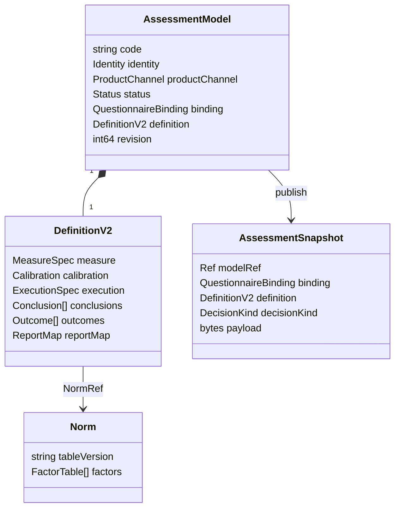
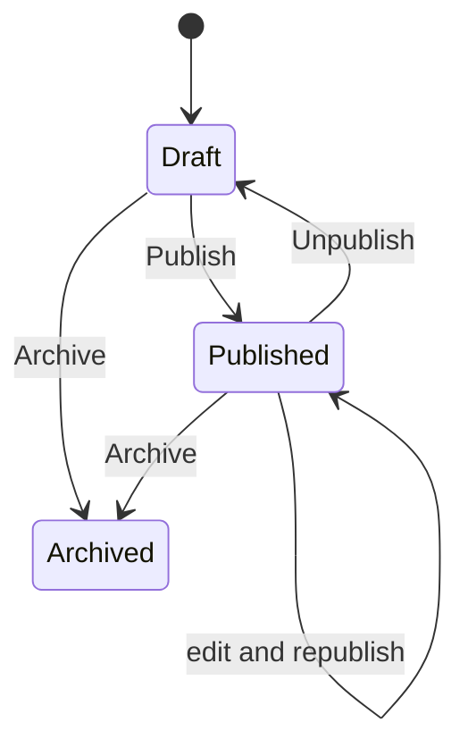

# ModelCatalog 领域模型

## 1. 本文回答

本文说明 ModelCatalog 的聚合边界、实体和值对象：为什么 `AssessmentModel` 是唯一可编辑聚合，`AssessmentSnapshot` 只是不可变运行时 read model，`Norm` 为什么独立存储，以及这些对象与 Survey、Evaluation、Interpretation 的边界。

## 2. 30 秒结论

| 对象 | 角色 | 可变性 | 稳定标识 |
| --- | --- | --- | --- |
| `AssessmentModel` | 后台可编辑模型聚合 | archived 前可修改，使用 revision 乐观锁 | model code |
| `DefinitionV2` | 模型语义主体 | 作为聚合的一部分整体替换 | 随 AssessmentModel revision 演进 |
| `Norm` | 独立版本化参考资料 | 按 table version 寻址 | table version |
| `AssessmentSnapshot` | 已发布运行时快照 | 发布后按值读取；重新发布会替换 active row | kind/code/version |



## 3. AssessmentModel 聚合

### 3.1 聚合拥有的事实

| 维度 | 主要字段 | 语义 |
| --- | --- | --- |
| 身份 | Kind、SubKind、Algorithm | 选择模型机制和算法 |
| 产品目录 | ProductChannel、Category、Tags、Stages、ApplicableAges、Reporters | 面向目录、筛选和展示，不决定 evaluator |
| 问卷绑定 | QuestionnaireCode、QuestionnaireVersion | 冻结模型所解释的问卷版本 |
| 定义 | DefinitionV2、兼容 DefinitionPayload | DefinitionV2 是语义；payload 是投影 artifact |
| 生命周期 | Status、PublishedAt、ArchivedAt | 管理模型是否可发布、下架或删除 |
| 并发控制 | Version / `Revision()` | draft 配置修订号和 Mongo 乐观锁 |

创建聚合时必须有 code、title 和合法 kind，并补齐默认 ProductChannel。创建结果为 `draft`、revision=1。模型内容变更通过聚合方法推进 revision，Repository 更新时使用旧 revision 作为 compare-and-set 条件。

### 3.2 聚合不变式

AssessmentModel 保护：

- archived 模型不可继续编辑、发布或下架；
- 绑定问卷时 code 和 version 都必须非空；
- Definition 更新必须同时保存非空兼容 payload；
- 发布前 code、title、kind、binding 和 Definition 都必须完整；
- typology 要求 `sub_kind=typology` 且 algorithm 非空；
- legacy-decode-only payload format 不能重新发布。

问卷是否存在、是否为 MedicalScale、NormRef 是否能解析等需要外部仓储的规则，不由聚合自行查询，而由 application policy/strategy 在用例边界执行。

### 3.3 生命周期



`StatusPublished` 描述管理聚合当前生命周期，不授权运行时读取 `assessment_models`。Evaluation 和 C 端目录始终读取独立 published snapshot。

## 4. DefinitionV2 及其内部对象

DefinitionV2 是 AssessmentModel 内部的组合值，包含：

- `MeasureSpec`：Factor、FactorGraph 与 Scoring；
- `Calibration`：对独立 Norm 表的版本引用；
- `ExecutionSpec`：BRIEF-2、SPM 等无法仅靠通用因子计分表达的算法契约；
- `Conclusion` 和 `Outcome`：从测量值到风险、常模、能力或类型结果的规则；
- `ReportMap`：结果到报告 section/adapter/template 的映射声明。

Factor 只保存 code、title 和 role。题目来源属于 ScoringSource，父子关系属于 FactorGraph，常模属于 Calibration，结论与文案属于 Conclusion/Outcome。把这些语义重新塞回 Factor 会破坏跨模型复用和校验边界。

完整扩展协议见 [20-核心设计-DefinitionV2与模型扩展.md](./20-核心设计-DefinitionV2与模型扩展.md)。

## 5. Norm

`Norm` 是按 `TableVersion` 寻址的独立参考资料，包含 form variant、model identity 和各 factor 的 band/lookup。Definition 只保存 `NormRef(factor_code, norm_table_version)`：

```text
Definition.Calibration.NormRefs
  -> assessment_norms[table_version]
  -> factor lookup / demographic band
```

这样同一份常模可以被多个模型修订引用，模型发布也能检查引用存在性，而无需把大表嵌进每个 AssessmentModel 文档。

## 6. AssessmentSnapshot

`AssessmentSnapshot` 定义在 port 层，兼容名称为 `PublishedModel`。它不是 domain aggregate，而是查询、缓存和 Evaluation 共享的不可变运行时值：

- identity、product channel 和 model ref；
- questionnaire code/version；
- DefinitionV2 和发布时派生的 DecisionKind；
- payload format + payload bytes 兼容 artifact；
- 目录展示元数据。

当前发布实现会将同 kind/code 的 active published row 标记为 unpublished，再 upsert 新快照。因此“快照不可变”表示消费者不能编辑已发布记录，不表示系统保存一条永不替换的 active 历史链。按旧 model version 重放是否仍可读取，取决于对应 published row 是否仍为 active；当前目录不是 append-only 模型版本仓库。

## 7. 领域服务与应用策略

| 规则 | 所在层 | 原因 |
| --- | --- | --- |
| `definition.Validate` | Domain | 纯粹检查 Definition 跨层引用和结构不变量 |
| `factor.ValidateMeasureSpecParts` | Domain | 检查 Factor、图、计分源和角色规则 |
| `AssessmentModel.ValidateForPublish` | Domain | 检查聚合自身发布完整性 |
| `DecisionKindForDefinition` | Domain | 从 canonical identity + Definition 推导发布判定方式 |
| `definition.Registry` handlers | Application | 需要按模型种类投影 payload，并可能查询 Norm/Questionnaire |
| questionnaire binding policies | Application | 需要读取或发布 Survey 问卷 |
| lifecycle effects | Application/container | 只在持久化后 best-effort 发送事件和缓存信令 |

Domain 不依赖 Mongo、REST、gRPC、Survey application service 或 Evaluation provider。

## 8. 模块所有权

| 对象/行为 | 所有者 | ModelCatalog 的边界 |
| --- | --- | --- |
| Questionnaire / AnswerSheet | Survey | 只保存问卷 code/version binding |
| AssessmentModel / Definition / Norm | ModelCatalog | 主写事实 |
| AssessmentSnapshot | ModelCatalog port/infra | 已发布运行时事实 |
| Assessment / EvaluationRun / Outcome 实例 | Evaluation | 消费 model ref 和 DefinitionV2 |
| InterpretReport | Interpretation | 消费 Evaluation 输出和 ReportMap，不回写模型聚合 |
| Plan | Plan | 只用 published scale 做存在性校验和标题投影 |
| C 端模型目录 | collection BFF | 通过通用 gRPC 投影，不拥有模型 |

## 9. 持久化边界

| Collection | 保存内容 |
| --- | --- |
| `assessment_models` | AssessmentModel、DefinitionV2、兼容 payload 和 revision |
| `published_assessment_models` | active/soft-deleted AssessmentSnapshot、DefinitionV2 与 wire payload |
| `assessment_norms` | 按 table version 保存的 Norm |

旧 `scales` collection 不是当前 ModelCatalog 生产读写路径。

BSON 字段、查询键、软删除、乐观锁和索引证据见 [22-核心设计-数据存储模型.md](./22-核心设计-数据存储模型.md)。

## 10. 事实源与验证

| 主题 | 路径 |
| --- | --- |
| 聚合 | [`assessmentmodel/model.go`](../../../internal/apiserver/domain/modelcatalog/assessmentmodel/model.go) |
| Definition / validation | [`domain/modelcatalog/definition`](../../../internal/apiserver/domain/modelcatalog/definition/) |
| Factor / Norm | [`factor`](../../../internal/apiserver/domain/modelcatalog/factor/)、[`norm`](../../../internal/apiserver/domain/modelcatalog/norm/) |
| Snapshot port | [`port/modelcatalog/catalog.go`](../../../internal/apiserver/port/modelcatalog/catalog.go) |
| Mongo | [`infra/mongo/modelcatalog`](../../../internal/apiserver/infra/mongo/modelcatalog/) |

```bash
go test ./internal/apiserver/domain/modelcatalog/...
go test ./internal/apiserver/infra/mongo/modelcatalog
```
