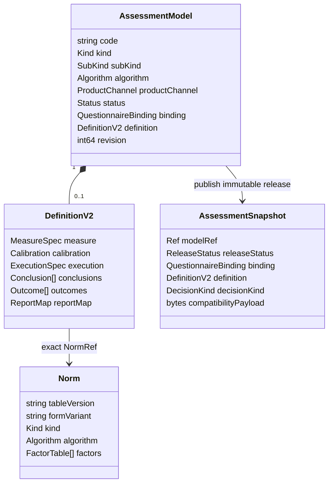
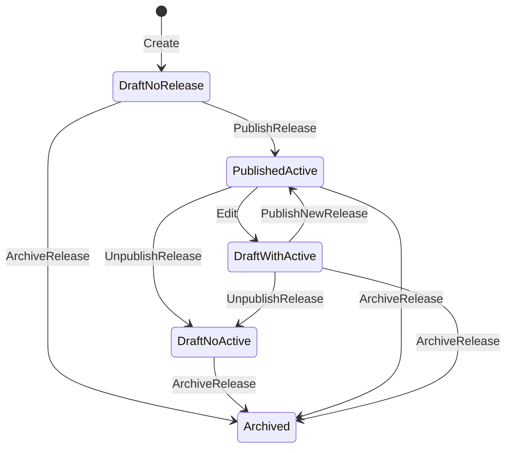

# ModelCatalog 领域模型

> 状态：已实现并按当前源码复核。本文描述当前领域对象、发布 read model 和已确认但尚未完全固化到代码的不变式；不把未来可能的 Interpretation 拆分写成现状。

## 1. 本文回答

本文集中回答 ModelCatalog 最基础、也最容易混淆的问题：

1. `AssessmentModel` 是什么，为什么它是模块中的可编辑聚合根；
2. `DefinitionV2` 为什么是聚合内部的模型语义主体，而不是任意配置 JSON；
3. Factor、可选 Norm 和 Decision 为什么构成可执行模型的核心层次；
4. 模型分类与算法分类为什么必须正交，`AlgorithmBinding` 又保护什么；
5. `Norm` 为什么需要独立版本化，不能简单嵌入模型；
6. `AssessmentSnapshot` 为什么不是第二个聚合，而是不可变发布事实；
7. 工作 head、active release 和 archived release 为什么必须分开理解；
8. ModelCatalog 与 Survey、Calculation、Evaluation、Interpretation 的领域边界在哪里。

问卷绑定、发布版本和联合发布将在 [问卷绑定与发布版本](./22-核心设计-问卷绑定与发布版本.md) 与 `30-关键链路-模型创建编辑与联合发布.md` 中展开；本文只建立后续文档共同使用的领域语言。

## 2. 30 秒结论

ModelCatalog 的第一性职责是：

> 管理可发布的测评模型规范，并建立模型语义与算法能力之间的兼容映射；它决定“模型是什么、要测什么、怎样校准、如何判定”，但不实现具体算法。

一个完整测评模型由三层核心语义构成：

```text
Measure / Factor       测量层：从题目事实形成维度值
Calibration / Norm     校准层：可选，把原始维度值放入参考人群坐标
Decision               判定层：必需，把测量或校准结果形成稳定结果事实
```

围绕这套核心模型，ModelCatalog 管理四类生命周期不同的资产或值对象：

| 对象 | 领域角色 | 标识 | 可变性 | 主要用途 |
| --- | --- | --- | --- | --- |
| `AssessmentModel` | 可编辑模型聚合根 / working head | model code | archived 前可通过命令修改，每次修改推进 revision | 运营维护下一次准备发布的模型 |
| `DefinitionV2` | 聚合内部的模型语义组合值 | 跟随 AssessmentModel | 作为一次工作修订整体替换 | 描述 Factor、可选 Norm、Decision、算法参数契约和随发布冻结的解释资产 |
| `Norm` | 独立版本化参考资产 | table version | 同一版本不可原地改变语义 | 为一个或多个模型版本提供校准资料 |
| `AssessmentSnapshot` | 不可变发布 read model / 发布事实 | kind + code + release version | 发布后不可编辑；旧版本归档保留 | 新测评准入、历史执行、缓存与跨模块读取 |

它们之间的关系是：



一句话概括：

> `AssessmentModel` 保护“下一次准备发布什么”，`AssessmentSnapshot` 保护“某次发布究竟发布了什么”，`Norm` 保护“当时引用的校准资料是什么”。

运行时责任链则是：

```text
ModelCatalog：发布模型规范和算法绑定
      ↓
Evaluation：读取精确模型与作答事实，选择能力并组织输入
      ↓
Calculation：无状态执行 Factor / Norm / Decision 算法
      ↓
Evaluation：保存 EvaluationOutcome 与执行状态
      ↓
Interpretation：解释稳定 Decision 结果并生成报告
```

Calculation 不认识 ModelCatalog、Questionnaire、Assessment 生命周期或报告。Evaluation 必须把领域资产转换为中性的计算输入，并把计算结果映射为自己的 `EvaluationOutcome`。

## 3. 先统一业务语言

### 3.1 Questionnaire 不是 AssessmentModel

`Questionnaire` 属于 Survey，定义题目、选项、显示控制、答案值和单题基础得分。它可以独立发布并收集 `AnswerSheet`，不要求一定存在测评模型。

`AssessmentModel` 定义怎样解释一份问卷产生的作答事实，包括：

- 哪些题目或子因子形成哪些 Factor；
- Factor 使用什么聚合方式；
- 是否引用常模以及引用哪个版本；
- 使用什么算法专用执行契约；
- 怎样从测量结果形成稳定 OutcomeCode；
- 当前随发布物冻结哪些解释与报告映射配置。

因此：

```text
只有 Questionnaire
  -> 可以填写
  -> 产生 AnswerSheet
  -> 链路结束

Questionnaire + AssessmentModel
  -> 可以创建 Assessment
  -> Evaluation 编排 Calculation 执行模型
  -> Interpretation 生成报告
```

两者之间不是“简单问卷”和“高级问卷”的关系，而是两种不同业务资产：

- Questionnaire 负责信息采集，最多形成答案事实和由题型规则延迟派生的单题基础分数；
- AssessmentModel 负责把这些答案事实转换成可解释、可追溯的测评结果。

因此，可发布测评模型必须同时具备 Factor 和 Decision，Norm 则按模型需要选配。只有 Factor 而没有 Decision 的配置不是完整测评模型；如果只需要收集答案或展示基础分数，应让业务链路停在 Questionnaire / AnswerSheet，而不是创建一个残缺模型。

### 3.2 AssessmentModel 不是 Assessment

二者名字接近，但性质完全不同：

| 概念 | 所属模块 | 表达的事实 |
| --- | --- | --- |
| `AssessmentModel` | ModelCatalog | 一类测评怎样执行的版本化知识资产 |
| `Assessment` | Evaluation | 某位受试者基于某份答卷执行的一次具体测评实例 |

模型可以被许多 Assessment 引用；一次 Assessment 只能冻结一个精确模型版本，不能在执行中漂移到新版本。

### 3.3 Conclusion 配置不是 InterpretReport

当前 `DefinitionV2.Conclusions` 同时包含结果判定规则和部分解释内容，但它仍然只是发布配置，不是一份患者报告：

- ModelCatalog 发布区间、score basis、极点、模式和特殊规则；Evaluation 组织输入并调用相应计算能力产生结果事实；
- Interpretation 使用结果代码、解释文案和报告映射构建 `InterpretReport`；
- ModelCatalog 不创建患者报告，也不拥有报告实例生命周期。

从目标领域语言看，Decision 只输出稳定结果事实，例如 `OutcomeCode`、`LevelCode`、分类代码或画像事实。title、summary、description、traits、strengths、suggestions 等内容属于 Interpretation-oriented Assets，不应被误称为 Decision 结果。当前结构尚未完成物理拆分，本文会一直同时标明“概念边界”和“代码现状”。

## 4. AssessmentModel 聚合

### 4.1 为什么它是聚合根

运营对测评模型的修改不能成为一组彼此独立的字段更新。模型身份、问卷绑定、Definition 和工作修订必须作为一个一致的工作单元被维护，否则很容易出现：

- identity 已切换，但 Definition 仍是旧算法结构；
- questionnaire version 已更新，但计分源仍引用旧题目；
- DefinitionV2 已保存，但兼容 payload 没有同步投影；
- 两名运营同时编辑，后一次写入静默覆盖前一次修改；
- archived 模型被重新编辑或发布。

`AssessmentModel` 通过领域方法维护这些变化，并通过 `Revision()` 与 Repository 的 compare-and-set 更新避免静默覆盖。

### 4.2 聚合拥有的事实

| 维度 | 主要字段 | 语义 |
| --- | --- | --- |
| 稳定身份 | `Code` | 同一个模型族资产的稳定业务编码 |
| 模型分类 | `Kind`、`SubKind` | 表达模型的测评语义，不应为了路由到某个算法而改变 |
| 算法绑定 | `Algorithm` 与 `DefinitionV2.ExecutionSpec` | 指定稳定代码能力及其模型参数；当前 AlgorithmFamily 由 identity 推导 |
| 产品分类 | `ProductChannel`、`Category`、`Tags` | 用于目录和展示，不参与 evaluator 路由 |
| 适用信息 | `Stages`、`ApplicableAges`、`Reporters` | 当前主要服务量表目录和运营展示 |
| 问卷绑定 | `QuestionnaireBinding` | 工作版本准备绑定的 questionnaire code/version |
| 模型语义 | `DefinitionV2` | canonical 定义主体 |
| 兼容投影 | `DefinitionPayload` | 从 DefinitionV2 产生的 wire/runtime artifact |
| 工作状态 | `Status` | draft、published、archived |
| 并发控制 | 持久化字段 `Version`，领域语义 `Revision()` | 工作配置修订号，不是业务发布版本 |

### 4.3 创建与修改

创建模型时至少需要：

- 非空 code；
- 非空 title；
- 合法 kind；
- 可以由 kind 和输入补齐的 ProductChannel。

新模型以 `draft`、revision `1` 创建。模型内容变化通过聚合方法推进 revision：

- `UpdateBasicInfo` / `UpdateScaleBasicInfo`；
- `UpdateAudienceMetadata`；
- `BindQuestionnaire`；
- `UpdateDefinitionWithV2`；
- `MarkPublished`、`MarkUnpublished`、`MarkArchived`。

修改已经发布的 head 时，应用服务会先调用 `ForkDraftFromPublished`，把工作 head 变回 draft，再执行真正的编辑命令。`ForkDraftFromPublished` 本身不增加 revision，后续实际修改只推进一次 revision，从而保持一次命令对应一次乐观锁修订。

### 4.4 聚合当前直接保护的不变式

当前聚合和 domain validation 直接保护：

- archived 模型不能继续编辑、发布或下架；
- code、title 和 kind 必须有效；
- questionnaire code/version 在绑定时都不能为空；
- Definition compatibility payload 不能为空；
- typology 必须使用 `sub_kind=typology` 并配置 algorithm；
- legacy-decode-only payload format 不能重新发布；
- 发布前必须具备完整 binding 和 Definition。

这些规则不需要访问数据库或其它模块，因此适合放在 Domain。

### 4.5 已确认但当前尚未完全固化的业务不变式

我们已经确认三组发布与演进规则。

第一组保护模型完整性：

1. QuestionnaireBinding、ModelIdentity、AlgorithmBinding、Factor / Measure 和 Decision 必需；
2. Norm 可选，但引用后必须使用存在且兼容的精确版本；
3. 只有 Factor 而没有 Decision 的配置不得发布为测评模型；
4. Interpretation-oriented Assets 按该模型的报告需求校验，但解释文案不能反过来充当 Decision 结果。

第二组保护同一 model code 的身份连续性：

1. 同一个 model code 首次发布后不应更换 Algorithm；
2. 首次发布前允许更换 questionnaire code/version，首次发布后 questionnaire code 固定，只允许升级同一问卷的 version。

第三组保护模型分类与算法分类的正交性：

1. `Kind / SubKind` 表达模型语义；`AlgorithmFamily / Algorithm` 表达执行能力；
2. 两者通过显式兼容矩阵连接，不建立永久一对一假设；
3. 当前默认映射可以演进，例如 `scale` 可以增加 `factor_norm` 能力，而不必修改成 `behavioral_rating`；
4. 发布时应冻结解析后的 AlgorithmFamily 与 DecisionKind，避免运行时重新推导发生语义漂移。

当前代码对这些规则的保护程度并不相同：

- family-specific handler 已实施一部分 Definition、Decision 和 Norm 兼容校验，但尚未形成统一的“Factor 必需、Decision 必需”发布契约；
- `AssessmentModel.UpdateBasicInfo` 和 `BindQuestionnaire` 仍允许修改 Algorithm 与 questionnaire code；现有策略没有统一读取 retained release 保护历史身份；
- `AssessmentSnapshot` 已冻结 Algorithm、DecisionKind 和 DefinitionV2，但尚未持久化 AlgorithmFamily，Evaluation 运行时仍会推导。

因此，上述规则是**已经确认的目标领域不变式**，但当前代码尚未全部固化，不能在文档中假装已经完全实现。历史身份守卫适合放在需要读取 retained release 的应用层模型演进策略；模型完整性与兼容性适合放在发布校验；AlgorithmFamily 冻结需要扩展发布快照契约。具体分别在 [问卷绑定与发布版本](./22-核心设计-问卷绑定与发布版本.md)、[DefinitionV2 与模型扩展](./20-核心设计-DefinitionV2与模型扩展.md) 与 [模型身份、算法绑定与执行路由](./21-核心设计-模型身份、算法绑定与执行路由.md) 中展开。

## 5. 发布模型语义：CoreModel 与 AlgorithmBinding

### 5.1 它是什么

`DefinitionV2` 是 `AssessmentModel` 内部的组合值，不具有独立 code、独立 Repository 或独立发布状态。它随 working head 的 revision 演进，并在发布时整体复制进 `AssessmentSnapshot`。它不是“任意 JSON 配置”；服务端以显式类型表达每层结构，并执行跨层引用校验。

但若只沿用当前字段名，很容易把模型定义、算法绑定和解释资产混成一团。更稳定的概念模型是：

```text
AssessmentModel
├── ModelIdentity
│   └── Kind / SubKind
├── AlgorithmBinding
│   ├── AlgorithmFamily
│   ├── Algorithm
│   └── ExecutionSpec
├── QuestionnaireBinding
└── DefinitionV2
    ├── CoreModel
    │   ├── Measure / Factor
    │   ├── Calibration / NormRef（可选）
    │   └── Decision
    └── Interpretation-oriented Assets
        ├── OutcomeProfile / 解释文案
        └── ReportMap
```

这是一张概念所有权图，并不是当前 Go struct 已经按此拆分。当前字段与概念职责的映射如下：

| 当前结构 | 概念角色 | 保护的语义 |
| --- | --- | --- |
| `AssessmentModel.Kind/SubKind` | ModelIdentity | 模型是什么语义类型 |
| `AssessmentModel.Algorithm` | AlgorithmBinding 的具体能力标识 | 使用哪项稳定代码能力 |
| `DefinitionV2.ExecutionSpec` | AlgorithmBinding 的参数契约 | 算法需要哪些模型专用输入；不是算法实现 |
| `DefinitionV2.MeasureSpec` | CoreModel.Measure | 题目或子因子怎样形成 Factor 测量值 |
| `DefinitionV2.Calibration` | CoreModel.Calibration | 哪些 Factor 引用哪一版 Norm；整层可选 |
| `DefinitionV2.Conclusions` | 当前混合的 Decision 与解释内容 | 测量/校准结果怎样形成稳定结果，以及当前伴随文案 |
| `DefinitionV2.Outcomes` | 稳定 OutcomeCode 空间与当前解释资料 | Decision 可输出什么，以及当前如何解释 |
| `DefinitionV2.ReportMap` | Interpretation-oriented Asset | 结果事实怎样映射为报告输入和展示结构 |

概念上，Factor 与 Decision 是测评模型必需层，Norm 是可选层。当前 `DefinitionV2` 仍然是 canonical 模型发布语义来源；概念拆分用于澄清所有权，不表示现在就要进行大规模数据结构迁移。

### 5.2 AlgorithmBinding 与两级算法结构

算法相关概念分为整体执行机制和局部策略两级：

```text
AlgorithmFamily
  整条管线怎样执行
  ├── factor_scoring
  ├── factor_norm
  ├── factor_classification
  └── task_performance

Strategy
  管线内部某一步怎样计算
  ├── Factor aggregation strategy
  ├── Norm transform strategy
  └── Decision strategy / DecisionKind
```

`Algorithm` 是一项具体、稳定的代码能力；`ExecutionSpec` 是这项能力的模型参数契约。二者都不是代码实现本身。实际实现属于 Calculation，Evaluation 负责把 ModelCatalog 的 Factor、Norm、Decision 与 ExecutionSpec 转成 Calculation 能理解的中性输入。

`Kind / SubKind` 与 `AlgorithmFamily` 相互独立，通过兼容矩阵连接：

```text
ModelIdentity ── compatibility matrix ──> AlgorithmBinding
Kind/SubKind                              Family/Algorithm/Spec
```

当前代码由 `Kind + SubKind + Algorithm` 推导 AlgorithmFamily；这只是现有兼容矩阵的实现，不是永久一对一规则。目标发布契约会冻结解析后的 AlgorithmFamily，但当前 `AssessmentSnapshot` 尚无该字段。

当前不引入 `AlgorithmVersion`。Algorithm 随服务代码发布：保持语义的重构沿用原标识，改变语义则增加新的 Algorithm 标识。只有出现算法独立生命周期、多版本并存、精确代码重放、强审计或 A/B/灰度需求时，版本字段才有实际价值。

### 5.3 Definition 内部引用必须闭合

`definition.Validate` 会检查：

- Factor code 唯一且图结构有效；
- Scoring 的 target 与 source 引用有效；
- NormRef 指向 Definition 中存在的 Factor，且 factor/version 组合不重复；
- ExecutionSpec 只能启用一个算法分支，并引用 Definition 中存在的 Factor；SPM item 的 question/option code 必须非空且题目不能重复，是否存在于绑定问卷由发布期外部校验负责；
- OutcomeCode 唯一；
- Conclusion 引用的 Factor 和 OutcomeCode 都存在；
- Report section code 唯一。

这些是纯 Definition 内部不变式，不需要访问 MongoDB。

### 5.4 DefinitionV2 与 compatibility payload

当前 `AssessmentModel` 和 `AssessmentSnapshot` 同时保存：

```text
DefinitionV2
  canonical 模型语义

DefinitionPayload / payload bytes
  从 DefinitionV2 投影出的兼容 artifact
```

保存 Definition 时，application `definition.Registry` 根据模型身份选择 handler，把 candidate Definition 投影成 family-specific payload。只有投影成功且 payload 非空，才会把 DefinitionV2 与 payload 一起写入 working head。

因此两者权威性不同：

- 领域校验、发布路由和新运行时物化以 `DefinitionV2` 为准；
- payload 用于兼容既有 wire/runtime DTO；
- 不能在 `DefinitionV2` 缺失时通过 payload 反向补齐领域语义；
- payload 的最终下线需要先迁移所有消费者，不能只删除字段。

### 5.5 Decision、Conclusion 与 ReportMap 的当前边界

从纯领域职责看，当前结构存在有意识保留的组合边界：

- Conclusion 中的分数区间、score basis、decision kind、poles 和 special rules 是 Decision 判定配置；Calculation 执行相应无状态规则，Evaluation 负责调用和结果映射；
- Outcome 的 title/summary/description，以及 TypeOutcomeProfile 的 traits、strengths、suggestions 等内容面向 Interpretation；
- ReportMap 的 section、adapter key 和 template ID 更直接服务报告组织。

Decision 的产出边界是稳定结果事实，例如：

- `OutcomeCode`、`LevelCode`；
- 类型分类代码；
- 可供解释层继续消费的画像事实或维度事实。

Decision 不负责生成 title、summary、description、suggestions，也不应该知道报告 section、template 或展示组件。这些内容即便当前仍物理保存在 `Conclusions`、`Outcomes` 或 `ReportMap` 中，概念上也属于 Interpretation-oriented Assets。

但当前系统仍把它们组合在 `DefinitionV2` 中，由 ModelCatalog 一次校验和发布。原因是一次测评发布需要冻结完整语义；现在拆成独立 Interpretation 资产会引入新的版本引用、联合发布、历史报告重建和兼容迁移问题。

因此当前最优边界是：

> ModelCatalog 组装并冻结完整配置；Calculation 拥有无状态算法实现；Evaluation 拥有能力选择、执行编排和结果持久化；Interpretation 拥有结果解释和报告生成。物理发布位置不等于运行时领域职责。

## 6. Norm：独立版本化领域资产

### 6.1 为什么不嵌入 AssessmentModel

常模通常包含按 Factor、年龄、性别或表单版本划分的大量查表数据或均值/标准差。若把常模完整复制进每个模型修订，会带来：

- 同一资料在多个模型中重复存储；
- 修订时难以判断是模型变化还是常模变化；
- 历史模型可能被原地覆盖后的常模污染；
- 发布和运行时无法清晰表达“究竟使用了哪一版参考资料”。

因此 `Norm` 以 `TableVersion` 独立寻址，`DefinitionV2.Calibration` 只保存：

```text
NormRef {
  factor_code
  norm_table_version
}
```

### 6.2 Norm 自身保护的内容

当前 Norm 包含：

- `TableVersion`；
- `FormVariant`；
- 适用的 model `Kind` 与 `Algorithm`；
- 多个 FactorTable；
- 按年龄、性别划分的 parametric bands；
- raw score 到 T score、percentile、standard score 的 lookup rows。

导入校验要求版本、表单和 identity 合法，Factor 不重复，数值有限，年龄范围有效，并拒绝相同人口学范围内存在歧义的重叠区间。

### 6.3 与模型发布的关系

Norm 可以独立导入和查询，但一个模型要成功发布，family handler 必须能够解析它引用的精确版本，并验证常模 identity、Factor 和模型执行契约相容。

这形成两个不同生命周期：

```text
Norm 发布/导入生命周期
  产生不可变 table version

AssessmentModel 发布生命周期
  通过 NormRef 选择精确 table version
```

模型发布新版本不会修改旧 Norm；常模修订也不应改变已经完成的历史测评。

## 7. AssessmentSnapshot：不可变发布事实

### 7.1 为什么不是第二个聚合

`AssessmentSnapshot` 定义在 port 层，是查询、缓存、Evaluation 和跨模块消费者共享的不可变 read model。它没有编辑命令，也不维护独立领域行为。

它由 `publication.Publisher` 从已经通过校验的 `AssessmentModel` 构建，主要包含：

- schema version 和 payload format；
- ProductChannel 与完整模型 identity；
- model code、release version、title 等元数据；
- release status 和发布时间；
- questionnaire code/version；
- Algorithm、发布时推导的 DecisionKind 与 DefinitionV2 中的 ExecutionSpec；
- DefinitionV2；
- compatibility payload。

当前快照**没有** `AlgorithmFamily` 字段。运行时会从 identity 或执行路径再次推导 family，这是需要和目标设计明确区分的当前事实。

### 7.2 发布版本从哪里来

当前默认 release version 由 working head revision 生成：

```text
revision = 12
release version = v12
```

它是系统维护的发布版本，不是运营手工维护的 SemVer。Questionnaire version 与 Norm table version 是另外两套独立版本，三者不能混用。

### 7.3 发布快照如何保留历史

Mongo Repository 以以下组合识别一条不可变 release：

```text
kind + sub_kind + algorithm + code + release_version
```

发布行为是：

1. 如果同一 release version 已存在且内容完全相同，视为幂等；
2. 如果同一 release version 已存在但内容不同，拒绝并报告版本内容冲突；
3. 新 release 插入前，将同 kind/code 的旧 active release 标记为 archived；
4. 插入新的 active release；
5. retained archived release 不删除，继续支持精确版本读取和 draft 恢复。

因此，“不可变”不是指永远 active，而是指发布后的内容不能被原地编辑。

### 7.4 已确认的快照增强目标

发布阶段已经拥有完整模型定义和兼容矩阵，最适合把下列运行时路由事实解析并冻结：

```text
AlgorithmFamily
Algorithm
ExecutionSpec
DecisionKind
```

其中 Algorithm、ExecutionSpec 与 DecisionKind 已经进入当前发布快照；AlgorithmFamily 尚未进入。目标改造完成后，Evaluation 应直接使用快照中的 AlgorithmFamily，不再根据 `Kind / SubKind / Algorithm` 或产品分类重新推导。

这个目标解决的是“发布时决定、运行时只执行”的确定性问题，并不要求引入 `AlgorithmVersion`。当前仍把 Algorithm 视为随服务发布的稳定能力标识。

## 8. 两条状态轴：working head 与 published release

只看 `AssessmentModel.Status` 无法判断线上是否仍有可用 release。当前系统存在两条状态轴：

| Working head | Published release | 典型场景 |
| --- | --- | --- |
| `draft` | 不存在 | 新建但从未发布 |
| `published` | active | 发布完成，工作版本与线上版本一致 |
| `draft` | active | 已发布模型正在编辑新版本，旧 release 继续服务 |
| `draft` | archived | 已下架，当前没有可接受新测评的 release |
| `archived` | archived | 模型族已归档，禁止继续编辑和发布 |

状态变化可以表示为：



`StatusPublished` 只表示 working head 当前与一次发布动作完成后的状态。真正决定新测评是否可受理的是 active `AssessmentSnapshot`，不是 head 状态本身。

## 9. active 读取与 exact-version 读取

发布快照有两种合法运行时读取语义：

### 9.1 ActivePublishedModelReader

只接受当前 `release_status=active` 的精确 release，用于新测评准入。即使调用方传入准确 version，只要该 release 已 archived，也必须拒绝。

它保护的是：

> 已经下架的版本不能继续产生新的测评。

### 9.2 PublishedModelReader

允许按精确 model ref 读取 retained release，包括已 archived 的历史版本，用于已经受理的测评继续执行、自动重试、人工重试和历史重放。

它保护的是：

> 已经受理的测评必须继续使用受理时冻结的模型语义，不能因为运营发布新版本或下架旧版本而改变结果。

这两种读取都不允许回退到 draft head。差别只在于是否允许读取 retained archived release。

## 10. 领域规则、应用策略与基础设施的分工

并非所有发布校验都能放进聚合。判断标准是：规则是否只依赖对象自身状态。

| 规则或行为 | 所在层 | 原因 |
| --- | --- | --- |
| `AssessmentModel` 编辑、状态变化和基础完整性 | Domain | 只依赖聚合自身字段 |
| `definition.Validate` | Domain | 只校验 Definition 内部引用闭合 |
| `factor.ValidateMeasureSpecParts` | Domain | 只校验 Factor、Graph 和 Scoring 结构 |
| `norm.ValidateImport` | Domain | 只校验常模自身版本、区间和 identity |
| `DecisionKindForDefinition` | Domain | 根据 canonical identity 与 Definition 推导 |
| ModelIdentity 与 AlgorithmFamily/Algorithm 是否兼容 | Domain/Application policy | 当前由 identity 映射和 registry 共同保护；目标是显式兼容矩阵 |
| Questionnaire 是否存在、类型是否正确 | Application binding policy | 需要查询 Survey |
| NormRef 是否能解析并与 family 相容 | Application definition handler | 需要访问 NormRepository |
| family-specific payload 构建与发布校验 | Application definition registry | 需要按身份选择策略和端口 |
| Questionnaire + AssessmentModel 联合发布 | Application release service | 跨 Survey 与 ModelCatalog，并需要 Mongo transaction |
| Factor / Norm / Decision 的无状态算法实现 | Calculation | 不拥有模型资产、执行生命周期和报告 |
| 算法选择、输入适配、执行状态与结果持久化 | Evaluation Application | 组合已发布模型、作答事实和 Calculation 能力 |
| head、release、norm 的 BSON 映射和查询 | Infrastructure | MongoDB 实现细节 |
| 事件、缓存失效和二维码等发布后动作 | Application/container effects | 只能在事务提交后执行，不是领域发布事实 |

Domain 不依赖 Mongo、Redis、REST、gRPC、Survey application service 或 Evaluation provider。

## 11. 与相邻模块的所有权关系

| 对象或行为 | 所有者 | ModelCatalog 如何参与 |
| --- | --- | --- |
| Questionnaire / Question / AnswerSheet | Survey | 保存精确 binding；联合发布时调用 Survey 应用端口 |
| AssessmentModel / DefinitionV2 / Norm | ModelCatalog | 主写事实和发布配置 |
| AssessmentSnapshot | ModelCatalog port/infra | 提供 active 与 exact-version read contract |
| Factor / Norm / Decision 算法实现 | Calculation | 接收中性输入并返回中性计算结果；不读取 ModelCatalog |
| Assessment / EvaluationRun / EvaluationOutcome | Evaluation | 消费精确 model ref 和作答事实，选择 Calculation 能力并持久化执行结果；不修改模型资产 |
| InterpretReport | Interpretation | 消费 Evaluation Outcome 和冻结解释输入；不回写模型聚合 |
| Plan | Plan | 保存测评 code，并在生成任务或准入时解析当前发布模型 |
| Statistics | Statistics | 消费测评事实形成投影，不参与模型定义 |
| C 端模型目录 | collection-server BFF | 读取 published catalog 投影，不拥有模型 |

依赖方向的核心约束是：

```text
Survey published facts ─┐
                       ├─> ModelCatalog release composition
Norm assets ───────────┘

ModelCatalog published facts
  -> Evaluation ──adapt──> Calculation
  -> Plan / collection read side

Evaluation facts
  -> Interpretation
  -> Statistics
```

Evaluation 和 Interpretation 不应为了补配置反向读取 ModelCatalog 的 draft repository。

Calculation 也不应反向依赖 ModelCatalog、Factor、Question 或 Evaluation 对象。它只提供无状态计算内核；跨领域对象转换由 Evaluation 应用层适配器承担。这一约束防止算法实现重新长成“既查配置、又管状态、又出报告”的硬编码解析模块。

## 12. 持久化概览

当前相关 Mongo collection 为：

| Collection | 保存内容 | 领域含义 |
| --- | --- | --- |
| `assessment_models` | `record_role=head` 和多条 `record_role=published_snapshot` | working model 与 retained release history 共用一个 collection，但通过 record role 严格区分 |
| `assessment_norms` | 按 table version 保存的 Norm | 独立版本化校准资产 |
| `questionnaires` | Survey 的 head 与 published snapshots | ModelCatalog 只持有 binding，不拥有这些文档 |

Redis 只缓存发布模型的 active/latest/list/exact-version 读取结果，不是发布事实源。MongoDB 才是 head、release 与 Norm 的最终事实源。

详细 BSON、索引、Mongo transaction 和一致性边界将在 [数据存储与一致性](./26-核心设计-数据存储与一致性.md) 中说明。

## 13. 当前设计取舍与待补边界

### 13.1 当前保留的设计取舍

- `DefinitionV2` 同时组合 Evaluation 判定配置与 Interpretation-oriented 配置，换取一次发布冻结完整语义；
- compatibility payload 继续随 head 和 snapshot 保存，保护既有 wire/runtime 消费者；
- Algorithm 被视为随服务发布的稳定代码能力，当前不增加没有独立生命周期价值的 AlgorithmVersion；
- 模型 Kind 与 AlgorithmFamily 通过可演进的兼容关系连接，不把当前默认映射提升为永久一对一领域定律；
- working head 与 retained releases 放在同一个 `assessment_models` collection，通过 `record_role` 区分，而不是拆成多个 collection；
- ModelCatalog、Survey、Evaluation、Interpretation 保持模块边界，但不拆成独立微服务。

### 13.2 已识别但本文不假装解决的问题

- 首次发布后 Algorithm / Questionnaire code 冻结已由 `evolution.Policy`（retained release）落地（MC-R008）；
- 四 family Questionnaire Binding Policy 已注册；Behavioral/Cognitive 对齐「已发布+有题」基线，Scale 仍含 MedicalScale/唯一绑定（MC-R009）；问卷 type 产品规则与题型深兼容仍待；
- `AssessmentSnapshot` 已冻结 AlgorithmFamily（MC-R006）；旧快照仍经显式 compatibility 推导；
- Calculation 的领域边界已经建立，但 Raven SPM 核心计算与部分 ability conclusion projection 仍留在 Evaluation application，代码职责尚未完全收敛；
- Conclusion 类型同时承载判定规则和解释内容，概念边界需要在文档中明确，但目前不启动大规模结构迁移；
- Interpretation 配置尚未独立版本化，只有出现真实独立生命周期需求时才评估拆分。

这些内容属于当前设计边界或待治理项，而不是已经实现的目标架构。

## 14. 事实源与验证

| 主题 | 事实源 |
| --- | --- |
| AssessmentModel 聚合 | [`assessmentmodel/model.go`](../../../internal/apiserver/domain/modelcatalog/assessmentmodel/model.go) |
| 状态与发布状态 | [`assessmentmodel/status.go`](../../../internal/apiserver/domain/modelcatalog/assessmentmodel/status.go)、[`release_status.go`](../../../internal/apiserver/domain/modelcatalog/assessmentmodel/release_status.go) |
| DefinitionV2 | [`domain/modelcatalog/definition`](../../../internal/apiserver/domain/modelcatalog/definition/) |
| Factor / Conclusion / Norm | [`factor`](../../../internal/apiserver/domain/modelcatalog/factor/)、[`conclusion`](../../../internal/apiserver/domain/modelcatalog/conclusion/)、[`norm`](../../../internal/apiserver/domain/modelcatalog/norm/) |
| Calculation 无状态边界 | [`domain/calculation`](../../../internal/apiserver/domain/calculation/) |
| Evaluation 运行时路由与适配 | [`application/evaluation/runtime`](../../../internal/apiserver/application/evaluation/runtime/) |
| 发布快照端口 | [`port/modelcatalog/catalog.go`](../../../internal/apiserver/port/modelcatalog/catalog.go)、[`repository.go`](../../../internal/apiserver/port/modelcatalog/repository.go) |
| 发布构建 | [`application/modelcatalog/publication`](../../../internal/apiserver/application/modelcatalog/publication/) |
| 联合发布 | [`application/modelcatalog/release`](../../../internal/apiserver/application/modelcatalog/release/) |
| Mongo release history | [`infra/mongo/modelcatalog`](../../../internal/apiserver/infra/mongo/modelcatalog/) |

最低验证命令：

```bash
go test ./internal/apiserver/domain/modelcatalog/...
go test ./internal/apiserver/domain/calculation/...
go test ./internal/apiserver/application/modelcatalog/...
go test ./internal/apiserver/application/evaluation/runtime/...
go test ./internal/apiserver/infra/mongo/modelcatalog
make docs-hygiene
git diff --check
```
