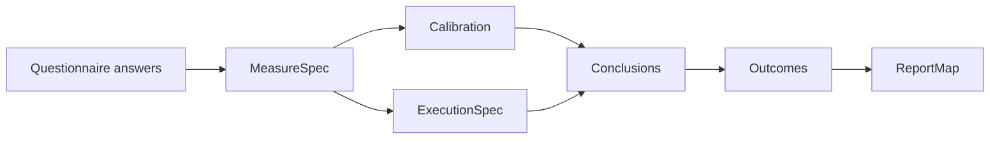
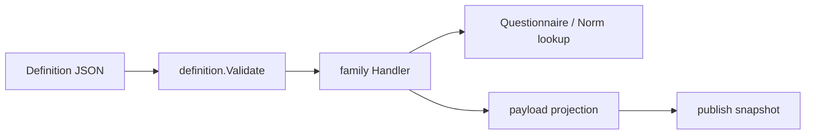

# 核心设计：DefinitionV2 与模型扩展

## 1. 本文回答

本文说明 `DefinitionV2` 如何把测量、校准、算法特有执行、结论和报告映射拆成稳定层次，发布前如何进行跨层校验，以及新增模型种类或算法时必须同步扩展哪些代码与契约。

## 2. 30 秒结论

DefinitionV2 是唯一模型语义来源，不是任意 JSON 容器：

```text
Measure
  回答“从题目或子因子怎样得到测量值”

Calibration
  回答“测量值引用哪一版常模”

Execution
  回答“哪些算法步骤不能由通用因子计分表达”

Conclusions + Outcomes
  回答“测量值怎样形成风险、常模、能力或类型结论”

ReportMap
  回答“哪些结果进入什么报告 section/adapter/template”
```

`payload` 由 DefinitionV2 在保存或发布时投影，用来兼容现有 wire/runtime DTO。payload 可以被重新生成，不能被解析为领域语义 fallback。

## 3. 五层模型



### 3.1 Measure：测什么、怎样聚合

| 对象 | 责任 |
| --- | --- |
| `Factor` | 只保存 code、title、role |
| `FactorGraph` | roots、父子边和展示顺序 |
| `Scoring` | 指定目标 Factor、输入来源、聚合策略和参数 |
| `ScoringSource` | 引用 question 或子 factor，可带 sign 和 option scores |

Scoring 支持 sum、avg、weighted sum/avg、max、min、count。FactorGraph 表达结构，Scoring 表达计算，不能根据父子边暗推计分公式。

### 3.2 Calibration：引用版本化常模

`Calibration.NormRefs` 只保存 factor code 与 norm table version。发布验证会检查：

- factor 存在；
- version 非空；
- 同一 factor/version 不重复；
- 需要常模的 family handler 能从 NormRepository 解析该版本。

常模数据留在 `assessment_norms`，不会被复制进 DefinitionV2。

### 3.3 Execution：算法特有执行契约

通用 Factor/Scoring 无法表达的执行语义进入 `ExecutionSpec`：

| 分支 | 当前内容 |
| --- | --- |
| `Brief2` | form variant、primary/index/validity factor roles |
| `SPM` | 时间限制、total factor、题组、题目与正确选项 |

同一 Definition 不能同时配置多个 execution branch。BRIEF-2 和 Raven SPM 的 handler 会要求对应分支存在。新增算法专用字段应先判断能否由通用 Measure/Conclusion 表达；只有真正的执行契约才进入 Execution。

### 3.4 Conclusions 与 Outcomes：如何判定结果

| Conclusion | 典型语义 | 关键输入 |
| --- | --- | --- |
| `RiskConclusion` | 原始分区间到风险结果 | factor + score ranges |
| `NormConclusion` | 常模分到结论 | factor + score basis + primary + ranges |
| `AbilityConclusion` | 百分位/标准分到能力等级 | factor + score basis + ranges |
| `TypeConclusion` | 极点组合、特征画像或最近模式 | factors + decision + special rules + profiles |

Outcome 是可复用的结论内容标识；Conclusion 中的 outcome code 必须指向 Definition.Outcomes。TypeConclusion 还可以声明前置/判定前/判定后的特殊规则和报告 profile。

### 3.5 ReportMap：模型到报告的声明

ReportMap 通过 section code、kind、source refs、adapter key、template ID 和 category label 声明展示映射。它不生成报告实例；Interpretation 根据 Evaluation 输出和该映射构造报告。

## 4. JSON 契约

REST definition 编辑与 gRPC `definition_json` 使用同一个 canonical Definition JSON。Conclusions 是多态接口，每项必须携带明确 `kind`：

```text
risk | norm | ability | type
```

缺少 kind 时不能根据重叠字段猜测类型。Mongo 通过显式 DefinitionPO/ConclusionPO 映射保存相同语义，同时保护 nil/empty 和 map/slice 的复制行为。

## 5. 校验责任链



| 层次 | 检查内容 |
| --- | --- |
| Domain `definition.Validate` | Factor、图、计分源、NormRef、Execution、Conclusion、Outcome、ReportMap 的内部引用 |
| Aggregate `ValidateForPublish` | code/title/kind/binding/Definition、状态和 legacy format |
| Family handler | 模型种类和算法要求、DecisionKind、payload 可投影性 |
| External lookup | Norm 表存在；typology 绑定问卷已发布且题目/选项匹配 |

`SaveDefinition` 会先执行 domain validation，再使用 handler 对候选 Definition 构造 payload；投影失败则不保存。`Publish` 会重新执行更强的 family/external 校验，避免“可保存草稿”被误认为“可以发布”。

## 6. 四类模型策略

`definition.Registry` 是 application 层唯一策略选择点，由组合根注册四个 handler：

| Kind | Definition 重点 | 发布投影 | 发布期附加校验 |
| --- | --- | --- | --- |
| `scale` | Measure + RiskConclusion | `payload/scale` | 基础 Definition 与问卷 binding |
| `typology` | Measure graph + TypeConclusion + Outcomes + ReportMap | `payload/typology` | typology runtime spec 与绑定问卷题目/选项 |
| `behavioral_rating` | Measure + Calibration，可带 Brief2 Execution | `payload/behavioral` | NormRef、BRIEF-2 execution、decision |
| `cognitive` | Measure + Calibration + SPM Execution + AbilityConclusion | `payload/cognitive` | NormRef、SPM execution、decision |

handler 负责模型差异，management/publication service 不按 code 或算法名堆积分支。生命周期事件与缓存属于独立 `EffectsRegistry`，不能塞进 definition handler。

## 7. 从编辑到发布 artifact

```text
DefinitionV2
  -> handler.BuildSnapshotPayload
  -> DefinitionPayload(format, bytes) on AssessmentModel
  -> publish validation
  -> AssessmentSnapshot.DefinitionV2
  -> AssessmentSnapshot.PayloadFormat/Payload
```

运行时 adapters 从 AssessmentSnapshot.DefinitionV2 重新构造 scale、typology、behavioral 或 cognitive execution snapshot。payload bytes 仍被持久化以维持 wire compatibility，但不是运行时 semantic read 的替代源。

## 8. 新增模型能力的完整扩展单元

实施前先定义：业务模型身份、产品目录归属、测量方式、是否需要常模、算法特有 execution、结论方式、报告映射、问卷 binding 规则和旧数据策略。

| 步骤 | 必须同步的设计面 |
| --- | --- |
| 1. Identity | Kind/SubKind/Algorithm、API 映射和目录 options |
| 2. Definition | 优先复用五层对象；必要时增加 Execution 或 Conclusion 语义 |
| 3. Domain validation | 跨层引用、不变量、DecisionKind 推导 |
| 4. Application strategy | Handler 的 Supports、ValidateForPublish、BuildSnapshotPayload，组合根注册 |
| 5. Binding/lifecycle | 问卷策略、发布前外部检查和后置 effects |
| 6. Port/payload | family projection、JSON/BSON round-trip 和兼容 wire contract |
| 7. Runtime | ExecutionPath、runtime descriptor、evaluation input provider 和失败映射 |
| 8. Transport/consumers | REST/OpenAPI、generic gRPC、collection/Plan 适配器 |
| 9. Verification | domain、strategy、Mongo、publication、runtime 与一条纵向执行测试 |

只有“可编辑、可校验、可发布、可按精确 ref 解析、可构造 Evaluation 输入、可在消费者契约中投影”都成立，才能宣布新模型能力完成。

## 9. 当前实现边界

- Registry 当前主要按 Kind 匹配 handler；同 Kind 下算法差异仍由 handler 内部处理，新增算法不能假设自动获得独立策略。
- Report preview 目前只有 typology handler 实现；其它 kind 调用 preview 会返回未配置错误。
- behavioral_rating 的 published DecisionKind 可根据 Definition 是有常模还是分数区间而变化；不能仅从 ProductChannel 推导。
- payload compatibility 字段仍存在于 draft 和 snapshot；删除前必须先迁移所有 wire consumer，不能只因 DefinitionV2 已存在就直接移除。
- DefinitionV2 已有独立 Execution 层；继续沿用旧文档的“四层定义”会漏掉 BRIEF-2/SPM 的执行契约。

## 10. 事实源与验证

| 扩展面 | 主要路径 |
| --- | --- |
| Definition / validation | [`domain/modelcatalog/definition`](../../../internal/apiserver/domain/modelcatalog/definition/) |
| Factor / Conclusion | [`factor`](../../../internal/apiserver/domain/modelcatalog/factor/)、[`conclusion`](../../../internal/apiserver/domain/modelcatalog/conclusion/) |
| Registry / handlers | [`application/modelcatalog/definition`](../../../internal/apiserver/application/modelcatalog/definition/) |
| payload projections | [`port/modelcatalog/payload`](../../../internal/apiserver/port/modelcatalog/payload/) |
| Mongo Definition mapping | [`infra/mongo/modelcatalog/definition_po.go`](../../../internal/apiserver/infra/mongo/modelcatalog/definition_po.go) |
| Runtime adapters | [`infra/evaluationinput`](../../../internal/apiserver/infra/evaluationinput/) |

```bash
go test ./internal/apiserver/domain/modelcatalog/definition ./internal/apiserver/domain/modelcatalog/factor
go test ./internal/apiserver/application/modelcatalog/definition ./internal/apiserver/application/modelcatalog/authoring
go test ./internal/apiserver/port/modelcatalog/payload/...
go test ./internal/apiserver/infra/mongo/modelcatalog ./internal/apiserver/infra/evaluationinput
```
