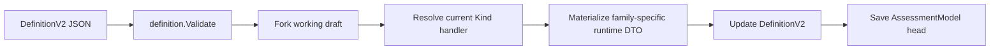
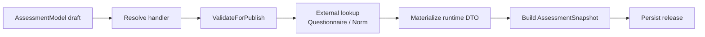
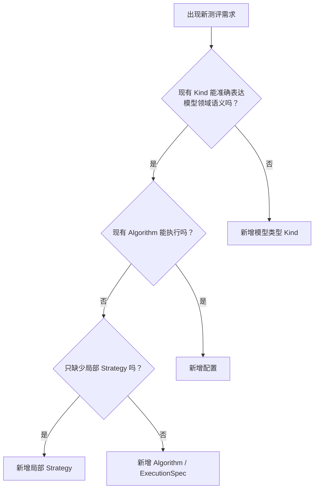

# 核心设计：DefinitionV2 与模型扩展

> 状态：当前实现与规划改造并存。本文以当前 `DefinitionV2`、authoring、publication 和 Calculation 边界为事实基础，同时明确标注已经确认但尚未完全实现的目标设计。

## 1. 本文回答

本文不逐项重复 Factor、Norm 和 Decision 的全部实现细节，而是回答 DefinitionV2 作为模型组合契约时最重要的设计问题：

1. 为什么需要 DefinitionV2，它解决了硬编码测评模型的什么问题；
2. 为什么 DefinitionV2 是当前 canonical 模型语义来源，却又不能被理解为最终纯粹的领域模型；
3. 当前六组物理字段怎样映射到 Factor、可选 Norm、Decision、AlgorithmBinding 和 Interpretation-oriented Assets；
4. ModelCatalog、Calculation、Evaluation 和 Interpretation 怎样围绕同一份发布模型分工；
5. 草稿可以保存与模型可以发布，为什么是两种强度不同的校验；
6. 新需求出现时，怎样判断是新增配置、Strategy、Algorithm，还是新的模型类型；
7. 当前按 Kind 聚合的 definition handler 为什么已经成为扩展性问题，目标边界应该怎样调整。

阅读本文前，建议先阅读 [ModelCatalog 模块总览](./README.md) 和 [领域模型](./10-领域模型.md)。

## 2. 30 秒结论

DefinitionV2 是 qs-server 当前统一的模型编辑与发布契约，也是模型发布语义的 canonical carrier。它解决的核心问题是：让不同测评共享一套稳定的模型骨架，同时把真正不同的算法能力留给显式扩展点，而不是让每份量表重新实现一套硬编码解析流程。

从目标领域语言看，一份完整模型应这样理解：

```text
AssessmentModel
├── ModelIdentity
│   └── Kind / SubKind
├── QuestionnaireBinding
├── AlgorithmBinding
│   ├── AlgorithmFamily
│   ├── Algorithm
│   └── ExecutionSpec
└── DefinitionV2
    ├── CoreModel
    │   ├── Factor / Measure
    │   ├── Norm / Calibration（可选）
    │   └── Decision
    └── Interpretation-oriented Assets
        ├── OutcomeProfile / 解释文案
        └── ReportMap
```

当前代码还没有按这张图完成物理拆分。`ExecutionSpec` 仍存放在 DefinitionV2 中，`Conclusions` 与 `Outcomes` 仍混合 Decision 规则和解释内容。这意味着：

- DefinitionV2 是当前权威发布载体；
- 但它不是一份职责已经完全纯化的最终领域结构；
- 文档必须同时说明当前字段和目标概念，不能用理想结构覆盖代码事实；
- 当前没有必要立即拆出独立 InterpretationDefinition，解释资产继续随模型发布冻结；
- 后续扩展应优先改善责任边界，而不是再向 Kind handler 中堆算法分支。

可发布模型的目标完整性规则是：

```text
QuestionnaireBinding   必需
ModelIdentity          必需
AlgorithmBinding       必需
Factor / Measure       必需
Norm / Calibration     可选
Decision               必需
InterpretationAssets   按报告需要校验
```

只有 Factor 而没有 Decision 的配置不是完整测评模型。如果业务只需要收集答案或展示问卷基础分数，应使用独立 Questionnaire，而不是发布一个不完整的 AssessmentModel。

## 3. DefinitionV2 为什么存在

### 3.1 从“表单 + 硬编码解析”到模型规范

早期 PHP 系统已经能够在线填写、自动计分和生成报告，但本质仍是：

```text
某份表单
  -> 某段专用解析代码
  -> 某份专用报告
```

问卷结构、计分规则、结果判定和报告逻辑被固化在代码中。每增加一份测评，都可能需要修改解析代码、接口和报告代码。这种方式可以快速完成第一份量表，却无法形成可扩展的测评平台。

DefinitionV2 的价值不是“把所有代码改成 JSON”，而是建立一个稳定分界：

> 让同类测评通过模型配置接入，让异类测评通过显式算法能力接入，并保护统一的发布与执行主链路不被反复修改。

它把原本散落在专用代码里的知识变成可检查的发布资产：

- 测量哪些维度；
- 题目或子因子怎样贡献给 Factor；
- 是否使用常模以及引用哪一版；
- 采用什么 Decision 形成稳定结果；
- 特殊算法需要哪些执行参数；
- 报告层需要随模型冻结哪些解释资料。

### 3.2 DefinitionV2 不是什么

DefinitionV2 不是以下任何一种东西：

- 不是允许运营编写任意程序的脚本语言；
- 不是用一个 `map[string]any` 容纳所有未来需求的万能 JSON；
- 不是 Calculation 算法实现；
- 不是一次患者测评的 EvaluationOutcome；
- 不是已经生成的 InterpretReport；
- 不是可以脱离 ModelIdentity、QuestionnaireBinding 和 AlgorithmBinding 单独执行的孤立对象。

它是一份**有类型、有引用约束、有发布语义的模型规范**。算法仍然由代码实现，只是算法需要的模型参数和策略选择通过 DefinitionV2 与 AlgorithmBinding 固化。

### 3.3 为什么不能追求“所有测评零代码接入”

同一算法语义下的新量表适合配置化，例如新增另一份风险量表，仍然采用题目基础分、Factor 聚合和区间判定。此时新模型只需要配置新的题目映射、因子和区间。

但 Raven SPM 的任务正确性、题组和限时信息，与普通量表的因子聚合并不是同一种计算语义。强行用一个万能 DSL 描述，会产生两个问题：

1. 配置逐渐变成难以验证、难以调试的编程语言；
2. Evaluation 主链路充满对特殊字段和特殊 code 的猜测。

因此，项目采用的扩展原则是：

> 稳定公共结构负责描述同类模型；显式 Algorithm 与 ExecutionSpec 负责承载真正不同的执行语义。

## 4. 当前物理结构与目标领域结构

### 4.1 当前 DefinitionV2 的真实字段

当前 Go 类型 `definition.Definition` 包含六组字段：

```go
type Definition struct {
    Measure     MeasureSpec
    Calibration Calibration
    Execution   ExecutionSpec
    Conclusions []Conclusion
    Outcomes    []Outcome
    ReportMap   ReportMap
}
```

它们目前作为一个整体：

- 被运营端编辑；
- 通过 canonical JSON 传输；
- 保存到 AssessmentModel working head；
- 在发布时复制进 AssessmentSnapshot；
- 作为 family-specific 临时运行时 DTO 的唯一物化输入。

### 4.2 当前字段与目标概念的映射

| 当前物理字段 | 目标领域角色 | 当前主要消费者 | 需要说明的边界 |
| --- | --- | --- | --- |
| `Measure` | CoreModel.Measure | Evaluation 输入适配 / Calculation | 描述测量节点和计分来源，不实现算法 |
| `Calibration` | CoreModel.Calibration | Evaluation / Calculation norm projection | 只保存精确 NormRef，整层可选 |
| `Execution` | AlgorithmBinding.ExecutionSpec | Evaluation 算法适配 | 物理上仍在 DefinitionV2，概念上属于算法绑定参数 |
| `Conclusions` | Decision 配置 + 当前混入的解释内容 | Evaluation / Calculation / Interpretation | 尚未完成职责拆分 |
| `Outcomes` | 稳定结果代码空间 + 当前解释资料 | Evaluation / Interpretation | OutcomeCode 与文案需要概念分离 |
| `ReportMap` | Interpretation-oriented Asset | Interpretation | 不参与算法判定，也不生成报告实例 |

这张映射表比“DefinitionV2 有六层”更准确。六组字段是当前存储和传输结构，并不意味着它们在领域上属于同一个层级。

### 4.3 当前选择：逻辑分责，统一冻结

当前不拆出独立 InterpretationDefinition，原因不是 Interpretation 没有独立职责，而是解释资产尚未形成独立维护和发布生命周期。

如果现在物理拆分，将立刻引入：

- 模型版本与解释版本怎样组合；
- 两种资产是否必须联合发布；
- 历史报告重建读取哪一版解释；
- 一份解释资产能否跨模型版本复用；
- 已发布 DefinitionV2 与解释资产怎样保持版本一致。

在没有独立生命周期需求前，更稳妥的选择是：

> ModelCatalog 一次发布并冻结完整配置，但运行时由 Calculation、Evaluation 和 Interpretation 分别承担算法、编排与解释职责。

物理发布位置不等于领域执行所有权。

## 5. CoreModel：Factor、可选 Norm 与 Decision

### 5.1 Factor / Measure：模型测量什么

MeasureSpec 当前由三部分组成：

| 对象 | 责任 |
| --- | --- |
| `Factor` | 定义稳定维度 code、title 和 role |
| `FactorGraph` | 定义 roots、父子关系和展示顺序 |
| `Scoring` | 定义某个 Factor 的输入来源、聚合 Strategy 和参数 |

FactorGraph 只表达层级，不隐含计分公式。父子关系不等于“父因子必然等于子因子求和”；真正的计算来源由 Scoring 显式声明。

Scoring source 可以来自：

- Questionnaire 中的题目基础分；
- 已经计算出的子 Factor。

对于题目来源，当前还可以声明：

- `question_score`：使用 AnswerSheet 中延迟派生的单题基础分；
- `option_override`：模型对特定选项提供明确覆盖分；
- `sign`：例如反向贡献；
- `weight`：该题对 Factor 的贡献权重。

这里保护的是“模型怎样使用作答事实”，不是 Survey 的答案校验。题型如何形成单题基础分仍由 Survey 负责。

### 5.2 Norm / Calibration：可选校准层

Calibration 不内嵌常模数据，只保存精确引用：

```text
NormRef
├── FactorCode
└── NormTableVersion
```

它表达的是：某个 Factor 的原始测量结果需要使用哪一版 Norm 进行校准。

Norm 是独立版本化领域资产，因此：

- 多个模型版本可以引用同一 Norm；
- 新常模以新版本导入，不覆盖旧版本；
- 模型发布必须确认精确版本存在；
- 历史测评继续使用发布时冻结的 NormRef。

Norm 对完整测评模型不是必需的。医学量表可以直接基于原始分进行风险区间判定，也可以在未来增加常模校准。是否使用 Norm 不应决定模型必须属于哪个 Kind。

### 5.3 Decision：模型如何形成稳定结果

Decision 是测评模型的必需层。它把 Factor 或校准结果转换为稳定结果事实，例如：

- `OutcomeCode`；
- `LevelCode`；
- 类型分类代码；
- 画像或维度事实。

当前代码使用多种 Conclusion 类型承载 Decision 配置：

| 当前 Conclusion | 主要判定语义 |
| --- | --- |
| `RiskConclusion` | 原始分区间形成风险结果 |
| `NormConclusion` | T score、百分位等常模分形成结果 |
| `AbilityConclusion` | 百分位或标准分形成能力等级 |
| `TypeConclusion` | 极点组合、主导因子、最近模式或连续画像形成分类结果 |

Decision 不负责生成面向用户的标题、长描述、建议或报告 section。当前这些内容仍混合在 Conclusion、Outcome 和 TypeOutcomeProfile 中，是已经识别的物理结构问题。

目标发布规则是：Factor 必需、Norm 可选、Decision 必需。`ValidateMeasureSpecParts` 已对空 Factors 返回 `measure.factors.required`；scale/cognitive 的 `DecisionKindForDefinition` 已要求对应 Conclusion；scale/behavioral/cognitive 发布时已对照已发布问卷版本校验 question/option（及 SPM CorrectOption）存在性。问卷 type 策略与 Bind/Publish 分策仍属 MC-R009。

## 6. AlgorithmBinding 与 ExecutionSpec

### 6.1 模型规范与算法实现必须分离

ModelCatalog 和 Calculation 的边界是：

```text
ModelCatalog
  定义 Factor、NormRef、Decision、Strategy 和 ExecutionSpec

Evaluation
  读取精确模型和作答事实
  选择 Calculation 能力
  把领域对象转换为中性输入

Calculation
  无状态执行计分、常模投影和结果判定
  返回中性 calculation.Result

Evaluation
  映射并持久化 EvaluationOutcome 与运行状态
```

Calculation 不读取 AssessmentModel，不查询 Questionnaire，不管理 EvaluationRun，也不生成报告。这样才能防止算法模块重新演化成“读取配置、执行流程、保存状态、生成文案”的硬编码解析器。

### 6.2 AlgorithmBinding 的组成

目标 AlgorithmBinding 由三部分组成：

| 概念 | 作用 |
| --- | --- |
| `AlgorithmFamily` | 描述整条计算管线的执行机制 |
| `Algorithm` | 标识一项稳定的具体代码能力 |
| `ExecutionSpec` | 保存该算法对模型提出的显式参数要求 |

当前 AlgorithmFamily 包括：

```text
factor_scoring
factor_norm
factor_classification
task_performance
```

AlgorithmFamily 描述整体管线；Factor 聚合、Norm 换算、DecisionKind 等 Strategy 描述管线中的局部算法。二者不能混为一层。

### 6.3 ExecutionSpec 是参数契约，不是算法代码

当前 ExecutionSpec 有两个显式分支：

| 分支 | 当前参数 |
| --- | --- |
| `Brief2Spec` | form variant、primary/index/validity Factor role |
| `SPMSpec` | time limit、total Factor、题组、题目与正确选项 |

同一份 Definition 当前只能配置一个 execution branch。该约束避免一个模型同时声明两套彼此冲突的算法专用语义。

新增算法专用字段时，应先判断：

1. 它是否只是 Factor 聚合 Strategy；
2. 它是否只是 Norm 或 Decision 的局部策略；
3. 它是否已经可以由 Questionnaire、Measure 或 Conclusion 表达；
4. 只有确实属于整体算法执行参数时，才进入 ExecutionSpec。

### 6.4 为什么不使用任意扩展 JSON

算法参数不应通过 `map[string]any`、任意 extension blob 或可执行脚本接入。测评模型是需要发布、审计和历史追溯的业务资产，显式类型能够提供：

- 明确字段含义；
- 稳定 JSON/BSON round-trip；
- 发布前结构校验；
- 前后端契约提示；
- 历史版本的可理解性；
- 对无效组合的确定拒绝。

新增真正不同的算法时，应增加明确命名的 ExecutionSpec 分支及其验证，而不是把复杂度藏进无法理解的 JSON。

### 6.5 当前为什么不需要 AlgorithmVersion

Questionnaire、AssessmentModel 和 Norm 是独立维护、发布和引用的业务资产，因此需要版本。Algorithm 当前是随服务代码发布的稳定能力，不具备独立发布生命周期。

当前规则是：

- 行为不变的实现重构沿用原 Algorithm 标识；
- 算法语义变化时增加新的 Algorithm 标识；
- 发布快照冻结 Algorithm、ExecutionSpec 和 DecisionKind；
- AlgorithmFamily 的快照冻结是已经确认但尚未完成的改造；
- 只有出现多版本并行、独立部署、精确代码重放、强审计或灰度实验时，才引入 AlgorithmVersion。

## 7. Interpretation-oriented Assets 为什么仍随模型发布

当前 DefinitionV2 中以下内容主要服务 Interpretation：

- Outcome 的 title、summary、description；
- TypeOutcomeProfile 的 traits、strengths、weaknesses、suggestions；
- commentary、image、rarity 等画像资料；
- ReportMap 的 section、adapter key、template ID 和 category label。

这些配置与 Decision 的稳定结果事实不同：

```text
Decision
  产生 OutcomeCode / LevelCode / 类型和画像事实

Interpretation
  根据稳定事实选择解释文案
  组织报告 section
  生成 InterpretReport
```

当前仍将两者统一放进 DefinitionV2，是为了保证一次模型发布冻结完整报告语义。如果运营发布新模型版本，旧 AssessmentSnapshot 中的解释资料也被保留，历史执行和重放不会读取到新文案。

只有出现下列真实需求时，才值得引入独立 InterpretationDefinition：

- 解释文案需要脱离模型独立发布；
- 同一解释资产需要跨多个模型版本复用；
- 医生端与患者端解释有独立版本生命周期；
- 法规或审计要求单独追踪解释版本；
- 报告模板需要独立灰度或回滚。

在此之前，逻辑上分责、物理上随模型统一冻结，是复杂度更低且历史一致性更强的选择。

## 8. DefinitionV2-only 与发布快照

### 8.1 唯一事实源

AssessmentModel 与发布后的 AssessmentSnapshot 都只保存 DefinitionV2。发布快照额外冻结 Model identity、AlgorithmFamily、DecisionKind、Questionnaire 引用和 Definition 内容摘要，但不保存 compatibility payload、payload format 或 projection hash。

Definition handler 的职责是验证并物化临时运行时 DTO；DTO 只存在于内存。DefinitionV2 缺失、冻结身份不完整或 family-specific 物化失败时必须 fail closed，不允许通过旧 payload 或格式推断恢复。

### 8.2 当前保存 Definition 的链路



`SaveDefinition` 先执行纯 Definition 校验，再在候选模型上尝试物化 family-specific 运行时 DTO。只有物化成功且运行身份完整，canonical DefinitionV2 才会保存；临时 DTO 不持久化。

因此，保存成功表示：

- Definition 内部结构可以解析；
- 当前 handler 能从 DefinitionV2 物化运行时 DTO；
- working head 已保存新的模型定义。

它不等于该模型已经满足全部发布条件。

### 8.3 当前发布链路



发布校验比草稿保存更强，因为它需要证明的是“这份模型现在可以被新测评使用”，包括外部资产存在性和执行契约完整性。

当前快照冻结 Algorithm、AlgorithmFamily、DecisionKind、DefinitionV2、ExecutionSpec、Questionnaire 引用和 Definition 内容摘要。Evaluation 运行时只使用冻结身份，不再重复推导。

## 9. 校验责任链

### 9.1 四种校验责任

目标校验责任应拆成四层：

| 校验层 | 依据 | 负责检查 |
| --- | --- | --- |
| 通用结构校验 | DefinitionV2 自身 | Factor、Graph、Scoring、NormRef、Decision、Outcome、ReportMap 引用闭合 |
| 模型语义校验 | Kind / SubKind | 该模型类型是否具有符合领域语义的 Factor、Decision 和必要元数据 |
| 算法绑定校验 | AlgorithmFamily / Algorithm / ExecutionSpec | 模型类型与算法是否兼容，算法参数是否完整 |
| 发布组合校验 | AssessmentModel + 外部发布资产 | Questionnaire、Norm、版本、payload 和 snapshot 是否可以共同冻结 |

### 9.2 当前已经实现的校验

当前 `definition.Validate` 会检查：

- Factor code、FactorGraph 和 Scoring 引用；
- NormRef 的 factor/version 与重复引用；
- ExecutionSpec 只能启用一个分支；
- Brief2/SPM 引用的 Factor 是否存在；
- SPM 题组、题目、正确选项和时间限制；
- OutcomeCode 唯一；
- Conclusion 引用的 Factor 与 OutcomeCode；
- Report section code 唯一。

当前 family handler 还会执行：

- AssessmentModel 发布基础完整性；
- NormRepository 外部解析；
- BRIEF-2/SPM ExecutionSpec 是否存在；
- DecisionKind 是否可推导；
- typology runtime DTO 与绑定问卷题目、选项是否匹配；
- family-specific runtime DTO 是否可以从 DefinitionV2 物化。

### 9.3 当前没有统一保护的规则

以下规则已经确认，但尚未在所有 Kind 上形成统一发布守卫：

- Factor / Measure 必须存在；
- Decision 必须存在；
- Factor-only Definition 不能发布；
- Model Kind 与 AlgorithmFamily/Algorithm 必须通过显式兼容矩阵；
- 发布快照必须冻结 AlgorithmFamily；
- 首次发布后同一 model code 不允许更换 Algorithm；
- 首次发布后 questionnaire code 固定，只允许升级 version。

这些规则涉及不同责任层，不能全部塞进 `definition.Validate`。例如历史 Algorithm 和 questionnaire code 是否变化，需要查询 retained release，更适合由应用层模型演进策略保护。

## 10. 模型扩展的四个层级

新增需求时，首先要判断变化发生在哪一层。错误分类会导致无意义的新 Kind、越来越大的 handler，或者把代码偷偷塞回 JSON。

### 10.1 第一层：新增同类模型配置

适用条件：

- 测量语义与现有 Kind 相同；
- 现有 AlgorithmFamily 和 Algorithm 可以执行；
- 只需要新的 Factor、Scoring、NormRef、Decision rule 或解释资料。

典型例子：新增另一份使用原始分区间判定的医学量表。

需要做的工作主要是：

- 维护并发布 Questionnaire；
- 创建 AssessmentModel；
- 配置 Factor、Scoring 和 Decision；
- 校验并联合发布。

这一层不应新增 handler、Algorithm 或 Evaluation execution path。

### 10.2 第二层：新增局部 Strategy

适用条件：整体执行管线不变，但某个局部计算方法尚未支持，例如：

- 新的 Factor 聚合策略；
- 新的 Norm 换算策略；
- 新的 Decision 策略。

Strategy 应进入 Calculation 的对应策略注册和中性参数契约。只要模型语义没有改变，通常不需要新增 Kind；只要整体计算机制没有改变，也不需要新增 AlgorithmFamily。

### 10.3 第三层：新增 Algorithm

适用条件：现有整体执行能力无法表达新的模型执行语义，需要新的稳定代码能力和算法专用参数。

典型工作包括：

- 定义新 Algorithm 标识；
- 声明它与哪些 Kind / SubKind 兼容；
- 必要时增加显式 ExecutionSpec；
- 在 Calculation 实现无状态能力；
- 在 Evaluation 增加输入适配和结果映射；
- 扩展发布校验和快照投影；
- 增加完整纵向执行测试。

新增 Algorithm 不等于新增 Kind。一个 scale 模型可以同时兼容 `factor_scoring` 与 `factor_norm`，不能为了路由算法而把它改成 behavioral_rating。

### 10.4 第四层：新增模型类型 Kind

只有当测量对象、领域语义或模型约束发生本质变化时，才应新增 Kind，例如：

- 它表达的是一种新的测评知识结构；
- 它对 Factor、Decision 或被试输入提出新的领域约束；
- 它无法被现有模型类型准确命名；
- 即使使用相同 Algorithm，它仍然是不同语义的模型资产。

Kind 是模型语义分类，不是算法路由枚举。不能因为一个新算法出现，就机械地增加一个新 Kind。

### 10.5 扩展判断树



## 11. 新模型能力的完整扩展单元

无论最终属于哪个层级，都不能只以“Definition 能保存”为完成标准。一个可交付的新模型能力至少需要检查以下方面：

| 扩展面 | 必须回答的问题 |
| --- | --- |
| 业务语义 | 它解决什么测评问题，是否真的需要新 Kind |
| ModelIdentity | ProductChannel、Kind、SubKind 分别是什么 |
| AlgorithmBinding | 使用哪个 Family、Algorithm 和 ExecutionSpec |
| QuestionnaireBinding | 绑定哪类问卷，发布后 code/version 怎样演进 |
| CoreModel | Factor、可选 Norm、Decision 是否完整 |
| Calculation | 复用或新增哪些无状态计算能力 |
| Evaluation | 怎样构造中性输入、选择能力、持久化结果和失败 |
| Interpretation | 哪些稳定结果需要怎样解释，是否使用 ReportMap |
| Publication | 怎样校验、生成 payload、冻结 snapshot |
| Persistence | JSON/BSON round-trip、索引和历史 release 是否兼容 |
| Transport | REST、gRPC、运营端和消费者契约是否需要扩展 |
| Verification | 是否覆盖草稿、发布、精确读取和完整执行链路 |

只有满足下面的闭环，才能宣布能力完成：

```text
可编辑
  -> 可校验
  -> 可发布
  -> 可按精确 ref 读取
  -> 可构造 Evaluation 输入
  -> 可调用 Calculation
  -> 可保存稳定结果
  -> 可生成需要的解释或报告
```

## 12. 当前 handler 扩展性问题

### 12.1 当前实现

当前 `definition.Registry` 接收完整 Identity：

```text
Kind + SubKind + Algorithm
```

但四个现有 handler 的 `Supports` 主要只判断 Kind：

```text
ScaleDefinitionHandler              -> KindScale
TypologyDefinitionHandler           -> KindTypology
BehavioralRatingDefinitionHandler   -> KindBehavioralRating
CognitiveDefinitionHandler          -> KindCognitive
```

handler 目前同时承担：

- 模型类型发布校验；
- 算法专用 ExecutionSpec 校验；
- Norm 和 Questionnaire 外部查询；
- DecisionKind 推导；
- family-specific runtime DTO 物化；
- 部分模型的报告预览。

### 12.2 为什么这是扩展性问题

当同一个 Kind 增加更多 Algorithm 时，差异只能继续堆进同一个 handler：

```text
BehavioralRatingDefinitionHandler
├── default
├── BRIEF-2
├── SPM Sensory
└── 未来更多 algorithm 分支
```

这会导致：

- 模型语义校验和算法校验无法独立演进；
- 同 Kind 支持多个 AlgorithmFamily 时分支迅速增加；
- handler 需要注入越来越多外部依赖；
- payload 兼容逻辑和新运行时逻辑继续耦合；
- 报告预览进一步扩大 handler 职责；
- 新算法容易被误实现成新的 Kind。

当前限制已经可以从源码看到：

- AlgorithmFamily 仍由 Kind/identity 推导，未冻结在 snapshot；
- scale handler 没有 NormRepository，无法直接支持未来 scale + Norm 的发布校验；
- scale 与 cognitive 的 DecisionKind 仍按 Kind 固定推导；
- typology preview 只有 TypologyDefinitionHandler 实现；
- Algorithm 差异仍在 Kind handler 内进行条件判断。

### 12.3 已确认的目标边界

目标设计不要求立即一次性拆完 handler，但后续新增能力应遵循以下责任划分：

```text
通用 DefinitionValidator
  保护 DefinitionV2 内部引用和结构

ModelSemanticValidator
  根据 Kind / SubKind 保护模型领域语义

AlgorithmBindingValidator
  根据 AlgorithmFamily / Algorithm / ExecutionSpec
  保护兼容关系和算法参数

PublicationComposer
  组合 Questionnaire、Norm、模型定义和兼容 artifact
  冻结 AssessmentSnapshot
```

registry 的目标解析依据应是完整 AlgorithmBinding 和兼容矩阵，而不是仅按 Kind 找到一个不断膨胀的 handler。

这项结论属于**规划改造**。当前文档仍保留现有 handler、payload 和 preview 行为，不把目标职责拆分写成已实现代码。

## 13. 设计原则总结

DefinitionV2 的长期价值不在于字段数量，而在于它建立了几条稳定设计原则：

1. Questionnaire 负责形成作答事实，AssessmentModel 负责解释这些事实；
2. Factor 和 Decision 构成测评模型的必需核心，Norm 按需加入；
3. ModelCatalog 配置模型，Calculation 实现算法，Evaluation 编排执行，Interpretation 解释结果；
4. 模型类型和算法类型正交，通过兼容矩阵连接；
5. 同类模型优先配置化，局部差异优先 Strategy，整体差异才新增 Algorithm；
6. 只有新的领域语义才新增 Kind；
7. Algorithm 专用参数必须显式、可校验，不能演变成任意脚本；
8. family-specific runtime DTO 只允许由 DefinitionV2 临时物化，不得成为第二事实源；
9. 当前物理结构可以统一冻结，但运行时职责必须保持分离；
10. 当前实现与目标设计存在差距时，文档必须明确标注。

## 14. 事实源与验证

| 主题 | 当前事实源 |
| --- | --- |
| DefinitionV2 结构与 JSON | [`domain/modelcatalog/definition`](../../../internal/apiserver/domain/modelcatalog/definition/) |
| Factor、Graph 与 Scoring | [`domain/modelcatalog/factor`](../../../internal/apiserver/domain/modelcatalog/factor/) |
| Conclusion、Outcome 与当前解释资料 | [`domain/modelcatalog/conclusion`](../../../internal/apiserver/domain/modelcatalog/conclusion/) |
| AssessmentModel 与 DecisionKind 推导 | [`domain/modelcatalog/assessmentmodel`](../../../internal/apiserver/domain/modelcatalog/assessmentmodel/) |
| AlgorithmFamily 与当前 identity 映射 | [`domain/modelcatalog/identity`](../../../internal/apiserver/domain/modelcatalog/identity/) |
| Definition authoring | [`application/modelcatalog/authoring`](../../../internal/apiserver/application/modelcatalog/authoring/) |
| Registry 与当前 Kind handlers | [`application/modelcatalog/definition`](../../../internal/apiserver/application/modelcatalog/definition/) |
| 发布快照构建 | [`application/modelcatalog/publication`](../../../internal/apiserver/application/modelcatalog/publication/) |
| 临时 runtime DTO assembler | [`port/modelcatalog/payload`](../../../internal/apiserver/port/modelcatalog/payload/) |
| Calculation 无状态边界 | [`domain/calculation`](../../../internal/apiserver/domain/calculation/) |
| Evaluation 运行时适配 | [`application/evaluation/runtime`](../../../internal/apiserver/application/evaluation/runtime/) |

最低验证命令：

```bash
go test ./internal/apiserver/domain/modelcatalog/definition/...
go test ./internal/apiserver/domain/modelcatalog/factor/...
go test ./internal/apiserver/domain/modelcatalog/assessmentmodel/...
go test ./internal/apiserver/domain/calculation/...
go test ./internal/apiserver/application/modelcatalog/authoring/...
go test ./internal/apiserver/application/modelcatalog/definition/...
go test ./internal/apiserver/application/modelcatalog/publication/...
go test ./internal/apiserver/application/evaluation/runtime/...
go test ./internal/apiserver/port/modelcatalog/payload/...
make docs-hygiene
make docs-facts
git diff --check
```
