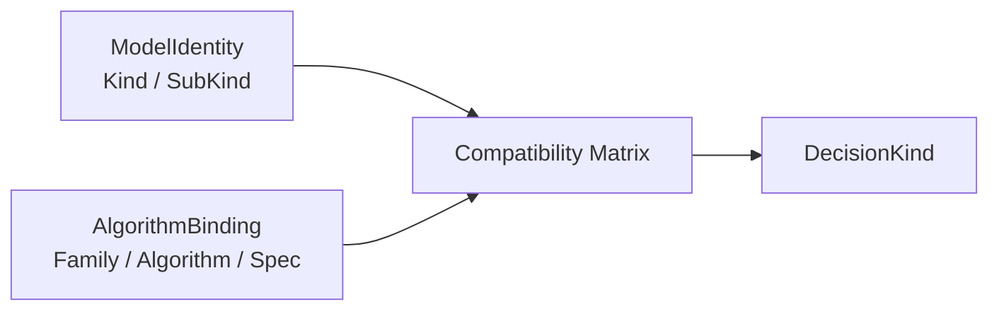
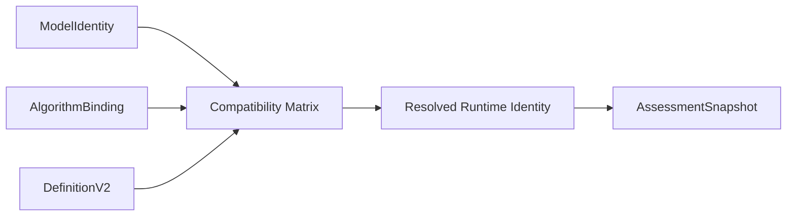

# 核心设计：模型身份、算法绑定与执行路由

> 状态：当前实现与规划改造并存。ProductChannel、Kind/SubKind、Algorithm、DecisionKind、AlgorithmFamily、ExecutionPath 和 RuntimeDescriptor 均已在代码中存在；AlgorithmFamily 随发布快照冻结、发布值直达运行时路由等内容是已经确认但尚未完成的目标设计。

## 1. 本文回答

qs-server 没有使用一个扁平 `type` 字段同时承担产品分类、模型语义和执行路由，而是逐步形成了多组身份与路由概念。本文回答：

1. ProductChannel、Kind、SubKind、AlgorithmFamily、Algorithm、Strategy 和 DecisionKind 分别解决什么问题；
2. 为什么模型分类和算法分类必须保持正交，不能把当前映射写成永久一对一关系；
3. AlgorithmBinding 保护什么发布事实，为什么当前不需要 AlgorithmVersion；
4. AssessmentSnapshot、ModelRoute、DescriptorKey、RuntimeDescriptor 怎样把发布模型连接到 Evaluation 执行管线；
5. ExecutionPath 为什么只是当前装配机制，不应上升为业务模型身份；
6. 当前运行时为什么仍会重复推导 AlgorithmFamily 和 DecisionKind，这会带来什么问题；
7. 目标设计怎样做到“发布时决定，运行时只执行”；
8. 新增模型、算法或 Decision 策略时，应该扩展哪一层，而不是新增一个混合 type。

QuestionnaireBinding 和多套版本语义将在 [问卷绑定与发布版本](./22-核心设计-问卷绑定与发布版本.md) 中展开。本文只说明它们如何参与精确模型引用，不重复发布事务细节。

## 2. 30 秒结论

模型身份和算法绑定是两组不同事实：

```text
模型身份 ModelIdentity
  Kind / SubKind
  回答“这是什么语义类型的测评模型”

算法绑定 AlgorithmBinding
  AlgorithmFamily / Algorithm / ExecutionSpec
  回答“由哪类管线、哪项代码能力、使用什么参数执行”
```

它们与其它概念的分工是：

| 概念 | 回答的问题 | 是否应参与执行路由 |
| --- | --- | --- |
| `ProductChannel` | 产品上放在哪个入口或目录 | 否 |
| `Kind / SubKind` | 这是什么语义类型的模型 | 参与兼容校验，但不应单独决定算法 |
| `AlgorithmFamily` | 整条计算管线采用哪类执行机制 | 是，目标为发布时冻结的主路由键 |
| `Algorithm` | 调用哪项稳定代码能力 | 是，用于兼容校验和算法选择 |
| `ExecutionSpec` | 该 Algorithm 需要哪些模型参数 | 是，作为执行输入契约 |
| `Strategy` | Factor、Norm 或 Decision 的局部算法是什么 | 由对应 Calculation 能力消费 |
| `DecisionKind` | 计算结果怎样形成稳定业务结果 | 是，发布时冻结 |
| `PayloadFormat` | compatibility payload 使用什么 wire 格式 | 兼容路由维度，不是领域身份 |
| `ExecutionPath` | 组合根如何装配当前 provider/descriptor | 当前实现细节，不是发布业务事实 |

目标责任链是：

```text
ProductChannel
  只服务目录和产品展示

ModelIdentity + AlgorithmBinding + DefinitionV2
  在发布阶段完成兼容校验
  冻结 AlgorithmFamily / Algorithm / DecisionKind / PayloadFormat
                         ↓
Evaluation 构造 ModelRoute
  直接使用发布快照中的运行时身份
                         ↓
RuntimeDescriptorRegistry
  选择 InputAssembler / Calculator / OutcomeAssembler
                         ↓
EvaluationOutcome
  保存模型身份和实际运行时身份
```

当前代码还没有完全做到这一点：AssessmentSnapshot 尚未保存 AlgorithmFamily，Evaluation 会从 Kind/SubKind/Algorithm 或 DecisionKind 再次推导；部分输入适配还没有完整传递发布快照的 DecisionKind 与 PayloadFormat。这些都应写成当前差距，而不是目标已经实现。

## 3. 为什么不能只有一个 type

### 3.1 一个字段无法同时表达三种分类

以“行为能力测评”为例：

- 在产品上，它属于 `behavior_ability` 通道；
- 在模型语义上，它可能是 `behavioral_rating`，也可能是 `cognitive`；
- 在算法执行上，它可能使用 `factor_norm`，也可能使用 `task_performance`；
- 在结果判定上，它可能产生 `norm_lookup` 或 `ability_level`。

如果只保存一个 `type=behavior_ability`，系统无法回答：

- 这是一份行为评定量表还是认知测验；
- 应该如何解释 Factor；
- 是否需要任务正确性输入；
- 应该选择哪条计算管线；
- 结果是常模等级还是能力等级。

反过来，如果直接把 `brief2` 或 `spm` 当成模型类型，又会把算法名称误当成领域分类。

### 3.2 多轴设计保护变化方向

多轴身份设计让不同变化各自发生：

```text
产品重新分类
  只修改 ProductChannel
  不改变模型计算语义

模型增加新的算法能力
  修改 AlgorithmBinding 和兼容矩阵
  不强迫修改 Kind

算法内部增加新的 Decision Strategy
  扩展 DecisionKind / Calculation
  不一定增加 AlgorithmFamily

同一模型发布新配置
  产生新的 AssessmentSnapshot version
  不改变稳定 model code
```

这也是本文最重要的架构原则：

> 产品分类、模型语义、算法机制和结果判定是不同变化轴，只有在发布阶段通过兼容关系组合，不能在定义阶段压缩成一个 type。

## 4. ProductChannel：产品目录分类

### 4.1 当前 canonical 产品通道

当前可配置 ProductChannel 为：

```text
medical_scale
typology
behavior_ability
```

它们分别服务医学量表、人格测评和行为能力测评产品入口。ProductChannel 主要用于：

- 运营后台目录筛选；
- collection 侧的产品展示和聚合；
- 创建模型时提供默认分类；
- 把 behavioral_rating 与 cognitive 聚合到同一个业务产品通道。

### 4.2 默认映射不是领域定律

当前 `DefaultProductChannelFor` 提供默认值：

| Kind | 默认 ProductChannel |
| --- | --- |
| `scale` | `medical_scale` |
| `typology` | `typology` |
| `behavioral_rating` | `behavior_ability` |
| `cognitive` | `behavior_ability` |

这是创建和展示默认值，不是执行约束。历史数据也可能保留较宽的产品分类，因此运行时不能使用 ProductChannel 选择 evaluator。

以下字段同样只属于目录和适用信息：

- Category；
- Tags；
- Stages；
- ApplicableAges；
- Reporters。

它们可以影响“谁看见这份模型”，不能决定“怎样执行这份模型”。

### 4.3 禁止的用法

```text
if ProductChannel == behavior_ability {
    use behavioral evaluator
}
```

这段逻辑无法区分 behavioral_rating 与 cognitive，也无法支持同一产品通道下的新模型类型。正确做法是：ProductChannel 只做查询和展示筛选，执行路由读取发布快照中的模型与算法事实。

## 5. ModelIdentity：Kind 与 SubKind

### 5.1 Kind 表达模型语义类型

当前 canonical Kind 有四种：

| Kind | 领域含义 | 它主要约束什么 |
| --- | --- | --- |
| `scale` | 医学量表模型 | 基于题目和 Factor 形成量表测量结果 |
| `typology` | 人格类型或特质模型 | 基于因子向量形成类型或画像事实 |
| `behavioral_rating` | 行为评定模型 | 基于观察量表、Factor 和可选常模形成行为评定结果 |
| `cognitive` | 认知测验模型 | 基于任务表现、正确性和可选常模形成认知能力结果 |

Kind 回答的是“这份模型表达什么测评知识”，而不是“当前用哪段代码执行”。

### 5.2 SubKind 是语义细分，不是备用 Algorithm

SubKind 用于在同一 Kind 内进一步收窄模型语义或兼容结构。当前代码定义：

```text
""
trait
typology
```

当前 typology 模型要求 `sub_kind=typology`。SubKind 不应该被滥用为 Algorithm 的别名，也不应该为每个算法再创建一个 sub kind。

判断是否需要新增 SubKind，应先问：

- 它是否表达稳定的模型语义差异；
- 这种差异是否会形成独立的校验或数据结构约束；
- 即使算法替换，这个语义分类是否仍然成立。

如果答案只是“需要调用另一个算法”，应该新增或选择 Algorithm，而不是新增 SubKind。

### 5.3 稳定 model code 与完整 Ref

Model code 标识同一个可演进模型资产，例如某一份具体量表或人格模型。它不能单独成为运行时引用，因为同一 code 会产生多个发布版本。

当前 `modelcatalog.Ref` 保存：

```text
Kind
SubKind
Algorithm
Code
Version
Title
```

其中真正的精确定位至少要求 code + version，identity 字段用于确认调用方没有把相同 code 解释为另一种模型。Title 是读取便利信息，不参与身份比较。

## 6. AlgorithmBinding：Family、Algorithm 与 ExecutionSpec

### 6.1 AlgorithmFamily 表达整体执行机制

当前 AlgorithmFamily 有四种：

| AlgorithmFamily | 整体计算语义 |
| --- | --- |
| `factor_scoring` | 题目基础分聚合为 Factor，再进行分数判定 |
| `factor_classification` | Factor 向量进入类型或画像分类 |
| `factor_norm` | Factor 分结合 Norm 形成标准分、百分位或等级 |
| `task_performance` | 按任务正确性、完成表现和校准形成能力结果 |

AlgorithmFamily 是执行机制分类，不是产品目录，也不是 Model Kind。

### 6.2 Algorithm 标识具体稳定能力

当前 Algorithm 包括：

```text
scale_default
personality_typology
bigfive
mbti
sbti
behavioral_rating_default
brief2
spm_sensory
spm
```

Algorithm 的作用不是保存代码版本，而是标识一项具有稳定输入输出语义的计算能力。例如：

- `spm_sensory` 表示感觉统合量表算法；
- `spm` 表示 Raven Standard Progressive Matrices；
- 两者名称接近，但不能复用同一个 Algorithm。

相同 Algorithm 标识下可以进行行为不变的代码重构。如果算法语义改变，应新增 Algorithm 标识，而不是让旧模型在无感知情况下得到不同结果。

### 6.3 ExecutionSpec 固化算法参数

Algorithm 只命名能力，ExecutionSpec 保存这项能力需要的模型参数，例如：

- BRIEF-2 的 form variant 和 Factor role；
- Raven SPM 的时间限制、题组、题目和正确选项。

ExecutionSpec 物理上仍位于 DefinitionV2，概念上属于 AlgorithmBinding。它不能是任意 JSON，也不能包含执行状态。

### 6.4 当前不引入 AlgorithmVersion

当前 Algorithm 随 qs-server 服务代码发布，不具备独立发布、多版本并行或灰度选择生命周期。因此没有必要增加 AlgorithmVersion。

只有出现以下需求时才重新评估：

- 同一个 Algorithm 的多个版本需要并行运行；
- 历史结果要求使用原始二进制或原始算法版本精确重放；
- 算法独立部署和回滚；
- 强审计要求记录算法构建版本；
- A/B 或灰度实验需要显式选版。

## 7. Strategy 与 DecisionKind

### 7.1 Strategy 是管线内部的局部算法

Strategy 与 AlgorithmFamily 不在同一层：

```text
AlgorithmFamily
  选择整条执行管线

Strategy
  选择管线内部某一步怎样计算
```

Strategy 可以包括：

- Factor 的 sum、avg、weighted_sum 等聚合；
- Norm 的 lookup 或 parametric transform；
- Decision 的区间判定、极点组合、最近模式、主导因子等策略。

新增局部 Strategy 通常不需要新增 Kind，也不一定需要新增 AlgorithmFamily。

### 7.2 DecisionKind 表达结果判定方式

当前 DecisionKind 包括：

| DecisionKind | 主要语义 |
| --- | --- |
| `score_range` | 原始或聚合分区间判定 |
| `pole_composition` | 极点组合形成类型 |
| `trait_profile` | 连续特质画像 |
| `nearest_pattern` | 最近模式匹配 |
| `dominant_factor` | 主导因子分类 |
| `norm_lookup` | 常模结果判定 |
| `ability_level` | 任务表现到能力等级 |

DecisionKind 是发布模型采用的判定策略标识，应从 DefinitionV2 的 Decision 语义确定并冻结。它不是报告模板，也不包含解释文案。

### 7.3 当前 DecisionKind 推导方式

当前 `AssessmentModel.DecisionKindForDefinition` 的规则是：

| Kind | 当前推导 |
| --- | --- |
| `scale` | 固定为 `score_range` |
| `typology` | 从 TypeConclusion.Decision.Kind 读取 |
| `behavioral_rating` | 有 NormRef/NormConclusion 时为 `norm_lookup`，否则为 `score_range` |
| `cognitive` | 固定为 `ability_level` |

这部分既包含真正的 Definition 语义，也包含当前 Kind 与执行机制的一对一假设。未来 scale 支持常模、cognitive 支持其它 Decision 时，固定映射会成为限制。因此目标设计要求发布校验根据 CoreModel + AlgorithmBinding 得到 DecisionKind，而不是仅按 Kind 给默认值。

## 8. 模型类型与算法类型为什么必须正交

### 8.1 当前映射只是兼容矩阵的第一版

当前代码大体形成以下默认关系：

| Model Kind | 当前常见 Algorithm | 当前 AlgorithmFamily | 当前 ExecutionPath |
| --- | --- | --- | --- |
| `scale` | `scale_default` | `factor_scoring` | `scale_descriptor` |
| `typology` | `mbti/sbti/bigfive/...` | `factor_classification` | `typology_descriptor` |
| `behavioral_rating` | `behavioral_rating_default/brief2/spm_sensory` | `factor_norm` | `behavioral_rating_descriptor` |
| `cognitive` | `spm` | `task_performance` | `cognitive_descriptor` |

这张表是当前实现支持情况，不是永久领域定律。

### 8.2 为什么一对一关系会阻碍扩展

假设医学量表增加常模校准：

```text
Kind = scale
AlgorithmFamily = factor_norm
```

模型仍然是医学量表，不应该为了走 `factor_norm` 管线被改成 behavioral_rating。

再例如人格测评可能继续使用 factor_classification，但选择新的具体 Algorithm 或新的 DecisionKind。此时 Kind 仍然是 typology。

因此，正确关系是：



兼容矩阵需要回答：

- 该 Kind 是否允许使用此 AlgorithmFamily；
- 此 Algorithm 是否实现该 Family；
- ExecutionSpec 是否符合 Algorithm 要求；
- CoreModel 是否提供算法所需的 Factor、Norm 和 Decision；
- 最终 DecisionKind 是否与算法能力兼容。

### 8.3 当前代码中的耦合点

当前仍有多处把 Kind 和 AlgorithmFamily 绑定：

- `AlgorithmFamilyFromIdentity` 主要按 Kind 推导 Family；
- `ModelFamilyCapability` 按 Kind 固定 ExecutionPath；
- `defaultPathMaterializations` 固定 ExecutionPath 与 AlgorithmFamily 的一对一映射；
- definition handler 虽接收完整 Identity，但主要只判断 Kind；
- 部分 DecisionKind 直接按 Kind 返回默认值。

这些代码保证了当前四类模型能够运行，但也构成后续多对多扩展的主要改造边界。

## 9. 发布快照中的身份事实

### 9.1 当前 AssessmentSnapshot 已冻结什么

当前 AssessmentSnapshot 已保存：

```text
ProductChannel
Kind
SubKind
Algorithm
Code
Version
DecisionKind
PayloadFormat
QuestionnaireCode / QuestionnaireVersion
DefinitionV2（包含 ExecutionSpec）
compatibility Payload
```

这已经能够证明某次模型发布使用了哪个 ModelIdentity、Algorithm、Decision 和兼容格式。

### 9.2 当前没有冻结什么

AssessmentSnapshot 当前没有 AlgorithmFamily 字段。Evaluation 运行时必须再次根据：

- Kind/SubKind/Algorithm；
- DecisionKind；
- legacy typology 兼容规则；

推导 AlgorithmFamily。

重复推导的问题在于：

- 发布和运行时可能使用不同推导规则；
- 映射代码升级后，旧 snapshot 可能被路由到另一条管线；
- Kind 与 Family 的当前一对一假设被不断复制；
- 运行时需要 fallback，无法确定哪个字段才是权威输入。

### 9.3 已确认的目标发布事实

目标快照需要冻结：

```text
ModelIdentity
  Kind / SubKind / Code / Version

AlgorithmBinding
  AlgorithmFamily / Algorithm / ExecutionSpec

Decision
  DecisionKind

Compatibility
  PayloadFormat
```

ExecutionPath 不需要进入发布快照。它是服务装配细节，可以随着内部实现重构；只要 AlgorithmFamily 对应的运行语义不变，历史模型不应该感知 provider 或 descriptor 的代码路径名称。

## 10. 当前运行时路由链路

### 10.1 从精确模型引用读取发布快照

新测评准入与已受理测评执行使用不同 reader：

| 场景 | Reader | 语义 |
| --- | --- | --- |
| 新测评准入 | `ActivePublishedModelReader` | 只允许当前 active 精确版本 |
| 已受理执行、重试、重放 | `PublishedModelReader` | 允许读取 retained archived 精确版本 |

两者都要求精确 version，都不能回退到 AssessmentModel draft head。

### 10.2 从 AssessmentSnapshot 到 InputSnapshot

当前 `infra/evaluationinput` 根据不同模型 payload 构造 `InputSnapshot`，其中 `ModelSnapshot` 主要保存：

```text
Kind
SubKind
Algorithm
ProductChannel
Code
Version
Title
ModelPayload
```

它目前没有 AlgorithmFamily、DecisionKind 和原始 PayloadFormat 字段。这意味着发布快照的部分运行时事实没有完整穿透到 Evaluation 输入。

### 10.3 ModelRoute 的当前构造

当前 ModelRoute 包含：

```text
Kind
SubKind
Algorithm
DecisionKind
PayloadFormat
```

但 `ModelRouteFromInput` 目前主要：

- 从 ModelSnapshot 读取 Kind/SubKind/Algorithm；
- 对 typology 尝试从 runtime payload 读取显式 DecisionKind；
- 根据 Kind/Algorithm 重新推导 draft PayloadFormat；
- 其它模型没有直接使用 AssessmentSnapshot 已冻结的 DecisionKind。

当 InputSnapshot 无法形成 route 时，执行服务还会从 Assessment 中冻结的 model ref 回退构造只含 Kind/SubKind/Algorithm 的 route。

### 10.4 DescriptorKey 的推导

`DescriptorKeyFromRoute` 当前生成：

```text
AlgorithmFamily
DecisionKind
PayloadFormat
```

Family 解析顺序大体为：

1. 优先从 Kind/SubKind/Algorithm 推导；
2. 兼容 legacy typology；
3. identity 无法解析时，从 DecisionKind 推导；
4. 无法解析则拒绝运行。

DecisionKind 如果与推导出的 Family 不一致，会回退为该 Family 的默认 DecisionKind。

### 10.5 RuntimeDescriptor 选择与执行

RuntimeDescriptor 描述一条可执行应用管线：

```text
RuntimeDescriptor
├── DescriptorKey
├── AlgorithmFamily
├── PayloadFormat
├── DecisionKind
├── ExecutionPath
├── InputAssembler
├── Calculator
└── OutcomeAssembler
```

Registry 依次尝试：

1. 完整 DescriptorKey；
2. AlgorithmFamily + PayloadFormat；
3. AlgorithmFamily 级默认 descriptor。

解析成功后，Evaluation 执行：

```text
InputAssembler
  -> CalculationInput
  -> Calculator
  -> calculation result
  -> OutcomeAssembler
  -> outcome.Execution
```

最终 EvaluationOutcome 会持久化两类身份：

```text
ModelIdentity
  Kind / SubKind / Algorithm / Code / Version / Title

RuntimeIdentity
  AlgorithmFamily / DecisionKind / PayloadFormat
```

这使结果能够说明“使用了哪版模型”和“实际通过哪类运行时机制产生”。

## 11. 当前路由存在的语义风险

### 11.1 发布事实没有完整穿透

AssessmentSnapshot 已经保存 DecisionKind 和 PayloadFormat，但 Evaluation InputSnapshot 没有对应字段，ModelRoute 又会重新推导。这削弱了发布快照作为运行时事实源的地位。

### 11.2 Identity 优先会覆盖发布 Decision

当前 `ExecutionFamilyFromRoute` 优先按 identity 推导 Family。`ExecutionDecisionFromRoute` 只有在 route.DecisionKind 与该 Family 相容时才采用，否则退回 Family 默认 DecisionKind。

behavioral_rating 当前存在一个典型边界：

- 发布阶段，无 Norm 的 Definition 可以推导出 `score_range`；
- identity 路由仍把 behavioral_rating 映射为 `factor_norm`；
- `score_range` 属于 `factor_scoring`，与推导 Family 不一致；
- 运行时可能回退为 `norm_lookup`。

这说明“发布时推导 DecisionKind”和“运行时根据 Kind 推导 Family”并没有完全形成同一份契约。

### 11.3 ExecutionPath 固定映射限制多对多关系

当前每个 Kind 固定一个 ExecutionPath，每个 path 又固定一个 AlgorithmFamily。未来 scale + factor_norm 将同时挑战这两层映射。

ExecutionPath 可以继续作为组合根装配工具，但不应继续承担模型分类与 AlgorithmFamily 的永久绑定关系。

### 11.4 兼容 fallback 太多会掩盖错误

兼容期允许从 identity、DecisionKind 或 legacy payload 补齐路由，有助于旧数据迁移。但如果新发布模型也依赖 fallback，就会掩盖：

- snapshot 字段缺失；
- 发布校验与运行时映射不一致；
- 输入物化丢失运行时身份；
- 错误模型被默认 descriptor 接受。

因此 fallback 应被定义为有范围、有监控、可下线的迁移机制，而不是正常发布模型的长期语义。

## 12. 目标路由：发布时决定，运行时只执行

### 12.1 发布阶段

目标发布阶段执行：



发布必须解析出唯一运行时身份：

```text
AlgorithmFamily
Algorithm
DecisionKind
PayloadFormat
```

任何缺失、冲突或不兼容都在发布阶段拒绝，而不是交给 Worker 运行时猜测。

### 12.2 Evaluation 输入物化

目标 InputSnapshot 或等价的 resolved model runtime contract 应完整携带：

```text
Kind / SubKind / Algorithm
AlgorithmFamily
DecisionKind
PayloadFormat
Code / Version
```

Evaluation 可以校验这些字段，但不重新决定它们。

### 12.3 Descriptor 路由

目标 ModelRoute 直接使用冻结值：

```text
DescriptorKey {
  AlgorithmFamily
  DecisionKind
  PayloadFormat
}
```

Registry 只负责查找已注册执行能力：

- 找到唯一 descriptor：执行；
- 未注册：以不可重试配置错误失败；
- 不再用 ProductChannel、Kind 默认值或最新模型补齐。

Kind / SubKind / Algorithm 仍保留在 route 或执行上下文中，用于兼容校验、审计和具体能力选择，但不覆盖已冻结的 AlgorithmFamily 与 DecisionKind。

### 12.4 结果审计

EvaluationOutcome 继续记录 ModelIdentity 与 RuntimeIdentity。这样即使未来 descriptor 的代码组织改变，历史结果仍然能够回答：

- 使用了哪份模型发布版本；
- 采用哪类算法管线；
- 使用哪种结果判定；
- compatibility payload 是什么格式。

## 13. 兼容矩阵应该保护什么

兼容矩阵不是简单的下拉选项列表，而是发布期规则集合。至少要保护：

| 规则 | 示例 |
| --- | --- |
| Kind 与 Family 兼容 | scale 可以允许 factor_scoring，未来也可以显式允许 factor_norm |
| Algorithm 属于 Family | brief2 必须指向其真实执行机制 |
| Algorithm 与 Kind 兼容 | spm 用于 cognitive；spm_sensory 用于 behavioral_rating |
| ExecutionSpec 完整 | AlgorithmSPM 必须具有 SPMSpec |
| CoreModel 输入完整 | factor_norm 必须能解析需要的 NormRef 和 Factor |
| DecisionKind 相容 | Decision 结果类型必须被该 Calculation 管线支持 |
| RuntimeDescriptor 已注册 | 发布前确认部署环境具备相应能力，或至少在启动时强校验 |

当前 `AlgorithmFamilyFromIdentity`、`FamilyCapabilityByKind`、definition handler 和 runtime descriptor registry 分散承担了部分矩阵职责。目标不是再增加一个重复 registry，而是逐步形成单一、可验证的兼容契约。

## 14. 新增能力时修改哪一层

### 14.1 新增产品入口

只扩展 ProductChannel、目录查询和前端展示。不要因此增加 evaluator。

### 14.2 新增模型类型

只有新的测评领域语义才新增 Kind，并补齐：

- 模型语义校验；
- 允许的 AlgorithmBinding；
- 发布与读取投影；
- 对应模型类型文档。

### 14.3 新增 Algorithm

保持现有 Kind，在兼容矩阵中声明：

- 属于哪个 AlgorithmFamily；
- 支持哪些 Kind/SubKind；
- 需要什么 ExecutionSpec；
- 使用哪些 Calculation 与 Evaluation adapter。

### 14.4 新增 Decision Strategy

如果整体管线不变，只新增 DecisionKind 和相应 Calculation strategy、发布校验与 descriptor 支持。不应机械增加新的 AlgorithmFamily。

### 14.5 内部运行时重构

可以更换 ExecutionPath、provider 或 descriptor 代码组织，只要：

- 冻结的 AlgorithmFamily 和 DecisionKind 语义不变；
- EvaluationOutcome 结果契约不变；
- 历史 snapshot 仍可执行；
- compatibility migration 有明确边界。

## 15. 禁止的捷径

- 使用 ProductChannel、Category、Tags 或页面路由选择 evaluator；
- 把 `behavior_ability` 当作领域 Kind；
- 把 MBTI、BRIEF-2 或 SPM 名称直接当成新的 Kind；
- 为了使用新的 AlgorithmFamily 修改已有模型的领域 Kind；
- 只保存 model code，不保存发布 version；
- 使用 draft head 为 Evaluation 补齐运行时身份；
- 运行时重新读取 latest active model 替换 Assessment 冻结 ref；
- 从 compatibility payload 猜测新发布模型缺失的 AlgorithmFamily；
- 让 DecisionKind 与发布快照不同，却静默使用 Family 默认值；
- 把 ExecutionPath 持久化为不可变业务身份；
- 在没有独立生命周期需求时增加 AlgorithmVersion。

## 16. 当前实现与规划改造

### 16.1 已实现

- ProductChannel 与 canonical Kind 已经分离；
- `behavior_ability` 不再作为可执行领域 Kind；
- Model Ref 保存 Kind/SubKind/Algorithm/Code/Version；
- AssessmentSnapshot 保存 Algorithm、DecisionKind、PayloadFormat 和 DefinitionV2；
- active admission reader 与 retained exact-version reader 已经分离；
- RuntimeDescriptor 以 AlgorithmFamily、DecisionKind、PayloadFormat 形成路由键；
- RuntimeDescriptor 已组合 InputAssembler、Calculator 和 OutcomeAssembler；
- EvaluationOutcome 保存 ModelIdentity 与 RuntimeIdentity；
- 运行时不允许读取 ModelRepository draft head。

### 16.2 当前不足

- AssessmentSnapshot 尚未保存 AlgorithmFamily；
- InputSnapshot 没有完整携带已发布 DecisionKind、PayloadFormat 和 AlgorithmFamily；
- ModelRoute 仍需要从 identity、payload 或默认值推导；
- Kind、ExecutionPath 和 AlgorithmFamily 仍基本一对一绑定；
- behavioral_rating 的发布 DecisionKind 与 identity family 可能出现不一致；
- definition handler 和 binding policy 虽接收完整 Identity，当前主要仍按 Kind 匹配；
- legacy fallback 与新发布模型的正常路由边界还不够明确。

### 16.3 已确认的规划改造

- 建立显式模型—算法兼容矩阵；
- 发布时解析并冻结 AlgorithmFamily 与 DecisionKind；
- 让运行时输入完整传递发布快照的 RuntimeIdentity；
- 正常模型路由不再从 Kind 或 ProductChannel重新猜测 Family；
- fallback 仅服务历史兼容，并具有监控和下线条件；
- 新算法通过 AlgorithmBinding 接入，不继续扩张 Kind handler；
- 保留 ExecutionPath 作为应用装配细节，不提升为领域身份。

## 17. 事实源与验证

| 主题 | 当前事实源 |
| --- | --- |
| Kind、SubKind、Algorithm、DecisionKind | [`domain/modelcatalog/identity`](../../../internal/apiserver/domain/modelcatalog/identity/) |
| ProductChannel、QuestionnaireBinding、ExecutionPath | [`domain/modelcatalog/binding`](../../../internal/apiserver/domain/modelcatalog/binding/) |
| 发布 DecisionKind 推导 | [`assessmentmodel/decision.go`](../../../internal/apiserver/domain/modelcatalog/assessmentmodel/decision.go) |
| AssessmentSnapshot、Ref 与 reader ports | [`port/modelcatalog`](../../../internal/apiserver/port/modelcatalog/) |
| 发布快照构建 | [`application/modelcatalog/publication`](../../../internal/apiserver/application/modelcatalog/publication/) |
| active 与 retained runtime reader | [`application/modelcatalog/runtime`](../../../internal/apiserver/application/modelcatalog/runtime/) |
| Evaluation ModelRoute 与 DescriptorKey | [`domain/evaluation/routing`](../../../internal/apiserver/domain/evaluation/routing/) |
| RuntimeDescriptor registry | [`application/evaluation/runtime`](../../../internal/apiserver/application/evaluation/runtime/) |
| Evaluation 输入快照 | [`port/evaluationinput`](../../../internal/apiserver/port/evaluationinput/) |
| 发布模型到执行输入适配 | [`infra/evaluationinput`](../../../internal/apiserver/infra/evaluationinput/) |
| EvaluationOutcome runtime identity | [`domain/evaluation/outcome`](../../../internal/apiserver/domain/evaluation/outcome/) |

最低验证命令：

```bash
go test ./internal/apiserver/domain/modelcatalog/identity/...
go test ./internal/apiserver/domain/modelcatalog/binding/...
go test ./internal/apiserver/domain/modelcatalog/assessmentmodel/...
go test ./internal/apiserver/application/modelcatalog/runtime/...
go test ./internal/apiserver/domain/evaluation/routing/...
go test ./internal/apiserver/application/evaluation/runtime/...
go test ./internal/apiserver/application/evaluation/execute/...
go test ./internal/apiserver/application/evaluation/outcome/...
go test ./internal/apiserver/infra/evaluationinput/...
make docs-hygiene
make docs-facts
git diff --check
```
