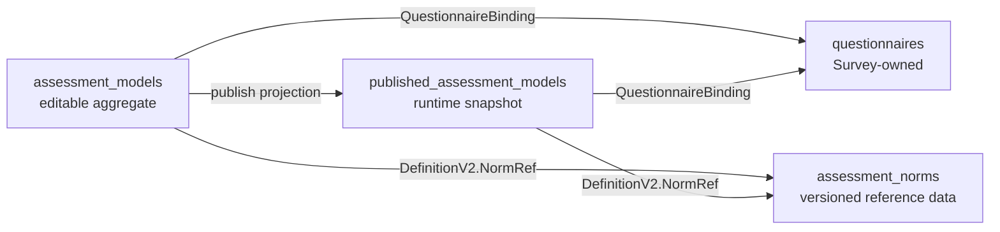

# 核心设计：数据存储模型

## 1. 本文回答

本文说明 ModelCatalog 在 MongoDB 中如何保存可编辑模型、已发布运行快照和常模资料，Domain 对象如何映射为 BSON，Repository 使用哪些查询键和版本条件，以及三个 collection 之间有哪些一致性边界。

## 2. 30 秒结论

ModelCatalog 使用三个 production collection 分离三类事实：

| Collection | 保存的事实 | 主要写入者 | 主要读取者 |
| --- | --- | --- | --- |
| `assessment_models` | 可编辑 AssessmentModel、DefinitionV2、binding 和 revision | Management / Authoring / Publication | 后台管理与发布用例 |
| `published_assessment_models` | 当前可见的 AssessmentSnapshot、DefinitionV2 和兼容 payload | Publication / seed / migration | Evaluation、Plan、gRPC、collection |
| `assessment_norms` | 按 table version 寻址的不可变 Norm | seed / migration / NormRepository | 发布校验和 Evaluation input adapter |



三个 collection 之间没有 Mongo foreign key，也不在一个跨 collection transaction 中共同维护。关系完整性由发布校验和应用编排保护。

## 3. 公共文档字段

三个 PO 都内嵌 `mongo.BaseDocument`：

| BSON 字段 | 语义 |
| --- | --- |
| `_id` | Mongo ObjectID |
| `domain_id` | 共享基础文档字段；ModelCatalog Repository 当前不以它作为业务查询键 |
| `created_at / updated_at` | 创建和最近更新时间 |
| `deleted_at` | 软删除标记；`null` 表示活动记录 |
| `created_by / updated_by` | 请求上下文可写入的审计用户 ID |
| `deleted_by` | 共享基础文档字段；ModelCatalog 当前软删除路径未显式更新 |

ModelCatalog 的 draft、published 和 norm 查询都显式要求 `deleted_at: null`。调用者不能通过 status 推断软删除状态，也不能直接查询 collection 后忽略该过滤条件。

## 4. `assessment_models`：可编辑聚合存储

### 4.1 BSON 结构

`AssessmentModelPO` 以 model code 为业务查找键：

| 字段组 | BSON 字段 | 对应领域语义 |
| --- | --- | --- |
| 身份 | `code / kind / sub_kind / algorithm` | canonical model identity |
| 产品目录 | `product_channel / category / stages / applicable_ages / reporters / tags` | 查询与展示维度 |
| 基本信息 | `title / description` | authoring metadata |
| 生命周期 | `status / published_at / archived_at` | draft、published、archived |
| 问卷绑定 | `questionnaire_code / questionnaire_version` | 精确 Survey 版本引用 |
| 语义定义 | `definition_schema_version / definition_v2` | canonical DefinitionV2 |
| 兼容 artifact | `definition_payload_format / definition_payload` | 从 DefinitionV2 投影的 wire payload |
| 并发控制 | `version` | AssessmentModel revision |

DefinitionV2 和 compatibility payload 同时保存在 draft 文档中，但权威性不同：DefinitionV2 是语义事实，payload 是派生 artifact。

### 4.2 写入协议

```text
Create
  -> insert one active document

Update
  -> filter(code, version = newRevision - 1, deleted_at = null)
  -> $set complete mapped document

Delete
  -> $set deleted_at + updated_at
```

聚合方法先推进 revision，Repository 再用 `model.Version - 1` 匹配数据库旧值。匹配数为 0 时返回 `ErrNotFound`；它同时覆盖“记录不存在、已删除、revision 冲突”三种情况，当前没有单独的 optimistic-lock conflict error。

更新会保留 `_id / created_at / created_by`，其它映射字段整体 `$set`。删除是软删除，不清理关联的 published snapshot 或 Norm；这些约束由 application service 在调用 Repository 前处理。

### 4.3 查询模型

| 用例 | 查询键 / 排序 |
| --- | --- |
| 按 code 获取 | `code + deleted_at:null` |
| 按问卷查找 | `questionnaire_code`，可附加 kind |
| 后台列表 | kind、sub-kind、status、category、algorithm、product channel、questionnaire code/version |
| 模糊搜索 | title 的大小写不敏感 regex |
| 列表排序 | `updated_at desc` |

分页默认 20，最大 100。

## 5. `published_assessment_models`：运行时快照存储

### 5.1 BSON 结构

Published PO 使用 `model_*` 前缀区分模型身份：

| 字段组 | BSON 字段 |
| --- | --- |
| schema / artifact | `schema_version / payload_format / payload` |
| identity | `model_product_channel / model_kind / model_sub_kind / model_algorithm / model_code / model_version` |
| 目录展示 | `title / description / category / stages / applicable_ages / reporters / tags` |
| 运行语义 | `decision_kind / definition_schema_version / definition_v2` |
| 问卷绑定 | `questionnaire_code / questionnaire_version` |
| 生命周期 | `status / published_at / deleted_at` |
| 兼容扩展 | `source` |

运行时依赖 identity、model version、QuestionnaireBinding、DecisionKind 和 DefinitionV2。payload format/bytes 被保留用于兼容，但不能替代 DefinitionV2。

### 5.2 活动快照键与重新发布

发布保存使用以下 upsert 匹配条件：

```text
model_kind
+ model_algorithm
+ model_code
+ model_sub_kind（非空时）
+ deleted_at = null
```

`model_version` 被刻意排除：draft 编辑会推进 revision，重新发布必须替换当前活动快照，而不是因为 version 改变自动新增另一个活动版本。

Publication 在保存新快照前执行 `DeletePublished(kind, code)`，将旧活动记录更新为：

```text
status = unpublished
deleted_at = now
updated_at = now
```

随后新快照通常以新文档插入。因此 collection 可以保留 soft-deleted 历史行，但所有 production published ports 只读取 `status=published + deleted_at:null`。它不是可直接按任意旧版本回放的 append-only catalog。

### 5.3 读取协议

| 用例 | 查询条件 / 排序 |
| --- | --- |
| 精确 model ref | kind + code + version，可附加 sub-kind/algorithm |
| 按问卷解析 | questionnaire code，可附加 questionnaire version |
| 按 model code 取当前版本 | kind + code；按 `published_at、updated_at、model_version desc` |
| C 端目录 | identity、channel、category、questionnaire、title regex |
| typology algorithm 选项 | published typology 分组 `model_algorithm` |
| 列表排序 | `model_code asc` |

精确 ref 查询要求 version；按问卷未提供 version 时 Repository 会放宽为只按 questionnaire code 查找。执行链路应始终传入 AnswerSheet 冻结的精确问卷版本。

分页默认 10，最大 100。

## 6. `assessment_norms`：不可变常模资料

### 6.1 BSON 结构

```text
table_version
form_variant
kind + algorithm
factors[]
  factor_code
  bands[]
    min/max age months + gender + mean/std_dev
  lookup[]
    raw score range + demographic scope
    t_score + percentile + optional standard_score
```

DefinitionV2 只通过 `NormRef(factor_code, norm_table_version)` 引用常模，不嵌入常模表。

### 6.2 Upsert 语义

`NormRepository.UpsertNorm` 实际提供“insert-or-confirm-identical”语义：

1. `table_version` 必填。
2. 按 `table_version + deleted_at:null` 查询。
3. 不存在则插入。
4. 已存在且领域内容完全相同则成功返回，不重复写。
5. 同 version 但内容不同则返回冲突错误。

因此 table version 是内容身份，不是可原地覆盖的普通版本号。当前 port 没有 Norm update/delete；修订常模应产生新 table version，并更新 DefinitionV2 中的 NormRef 后重新发布模型。

## 7. DefinitionV2 的 BSON 映射

draft 与 published 文档复用同一个显式 `DefinitionPO`：

| Definition 层 | BSON 子结构 |
| --- | --- |
| Measure | `measure.factors / factor_graph / scoring` |
| Calibration | `calibration.norm_refs` |
| Execution | `execution.brief2 / execution.spm` |
| Conclusions | `conclusions[]`，每项显式保存 `kind` 和对应字段 |
| Outcomes | `outcomes[]` |
| ReportMap | `report_map.sections[]` |

Mapper 不把 Definition 整体存为不透明 JSON，而是显式转换每个 slice、map、pointer 和多态 Conclusion。这样 Mongo 查询结构稳定，也能显式控制 nil/empty 归一化和防御性复制行为。

存在 DefinitionV2 时，`definition_schema_version` 写为当前 `SchemaVersionV2`；字段缺失时 mapper 返回 nil，运行时 resolver 会拒绝该 published model。

## 8. 关系与一致性边界

| 关系 | 物理形态 | 一致性保护 |
| --- | --- | --- |
| draft → published | 复制 identity、metadata、binding、DefinitionV2，并生成 payload | Publication handler + Publisher 顺序写入 |
| model → questionnaire | code/version 字符串引用 | binding policy 与 publish validation |
| Definition → Norm | factor/version 字符串引用 | definition validation + NormRepository lookup |
| published → runtime cache | snapshot 值缓存 | invalidating repository / cache signal，不改变 Mongo 事实 |

当前没有包住三个 collection 或 Survey Questionnaire 的 Mongo transaction：

- 发布 Questionnaire 成功后，model publish 仍可能失败；
- 旧 snapshot soft-delete 后，新 snapshot 写入可能失败；
- 新 snapshot 写入后，draft status 更新失败时会删除新 snapshot，但不会恢复旧 snapshot；
- Norm 写入与 model publish 之间没有事务。

具体发布补偿和排障顺序见 [30-关键链路-模型创建编辑与发布.md](./30-关键链路-模型创建编辑与发布.md)。

## 9. 逻辑约束与物理索引现状

Repository 表达了以下逻辑约束：

| 逻辑约束 | 代码中的保护 |
| --- | --- |
| active draft code 唯一 | Create 将 Mongo duplicate key 映射为 invalid argument |
| active published identity 唯一 | upsert filter + 发布前 soft-delete kind/code |
| norm table version 唯一且内容不可变 | read-compare-insert，内容冲突时报错 |
| draft 并发更新不覆盖 | code + previous revision compare-and-set |

但当前仓库中没有找到这三个 collection 的模块内索引创建或 migration 定义。因此不能仅从 Repository 行为断言生产数据库已经有对应 unique/compound indexes：

- duplicate-key 分支只有在数据库存在唯一索引时才会生效；
- Norm 的 read-then-insert 在没有唯一索引时存在并发插入竞态；
- published upsert filter 在没有活动身份唯一索引时不能独立阻止并发双写；
- 目录和 questionnaire lookup 是否命中合适索引，需要检查真实部署数据库。

索引状态当前应标记为“待部署证据”，审计时直接查看：

```javascript
db.assessment_models.getIndexes()
db.published_assessment_models.getIndexes()
db.assessment_norms.getIndexes()
```

在获得索引清单前，文档只把 code、published identity 和 table version 描述为逻辑键，不写成已经确认的物理唯一键。

## 10. 数据排查最小查询

```javascript
// authoring fact
db.assessment_models.findOne({code: "MODEL_CODE", deleted_at: null})

// active runtime fact
db.published_assessment_models.find({
  model_code: "MODEL_CODE",
  status: "published",
  deleted_at: null
})

// versioned norm material
db.assessment_norms.findOne({
  table_version: "NORM_VERSION",
  deleted_at: null
})
```

排障时先比较 draft/published 的 identity、binding、DefinitionV2 和 version，再检查 payload、缓存或消费者投影。

## 11. 事实源与验证

| 主题 | 路径 |
| --- | --- |
| Draft PO / mapper / repository | [`draft_po.go`](../../../internal/apiserver/infra/mongo/modelcatalog/draft_po.go)、[`draft_mapper.go`](../../../internal/apiserver/infra/mongo/modelcatalog/draft_mapper.go)、[`draft_repo.go`](../../../internal/apiserver/infra/mongo/modelcatalog/draft_repo.go) |
| Published PO / mapper / repository | [`po.go`](../../../internal/apiserver/infra/mongo/modelcatalog/po.go)、[`mapper.go`](../../../internal/apiserver/infra/mongo/modelcatalog/mapper.go)、[`repo.go`](../../../internal/apiserver/infra/mongo/modelcatalog/repo.go) |
| Published adapter | [`published_adapter.go`](../../../internal/apiserver/infra/mongo/modelcatalog/published_adapter.go) |
| Norm storage | [`norm_po.go`](../../../internal/apiserver/infra/mongo/modelcatalog/norm_po.go)、[`norm_repo.go`](../../../internal/apiserver/infra/mongo/modelcatalog/norm_repo.go) |
| Definition BSON mapping | [`definition_po.go`](../../../internal/apiserver/infra/mongo/modelcatalog/definition_po.go) |
| Storage ports | [`port/modelcatalog/repository.go`](../../../internal/apiserver/port/modelcatalog/repository.go)、[`catalog.go`](../../../internal/apiserver/port/modelcatalog/catalog.go) |

```bash
go test ./internal/apiserver/infra/mongo/modelcatalog
go test ./internal/apiserver/infra/modelcatalog
go test ./internal/apiserver/application/modelcatalog/publication
```
