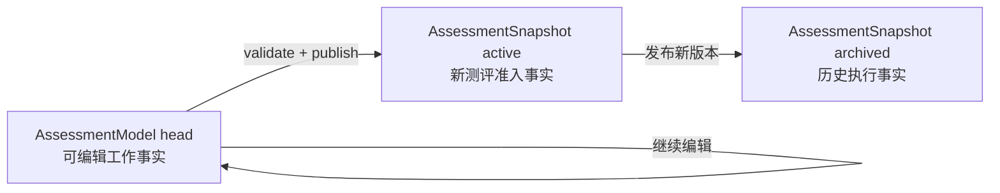
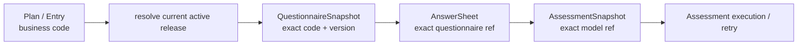

# 核心设计：问卷绑定与发布版本

## 1. 本文回答

本文讨论一个完整测评如何由两类可以独立演进的业务资产组成：

- Survey 拥有的 Questionnaire，定义“向受试者问什么、答案是否合法、单题基础分怎样产生”；
- ModelCatalog 拥有的 AssessmentModel，定义“怎样把答卷转换为因子、怎样校准、怎样判定结果”。

重点回答以下问题：

1. 为什么 Questionnaire 可以独立发布，却不能单独代表一次医学测评？
2. `QuestionnaireBinding` 为什么必须同时保存 code 和精确 version？
3. Questionnaire version、AssessmentModel revision、AssessmentSnapshot release version、Norm version 和 Algorithm 分别是什么？
4. 为什么 Plan 和门诊二维码可以只保存 code，而 AnswerSheet 与 Assessment 必须冻结精确版本？
5. 联合发布如何避免“新问卷配旧模型”或“新模型配旧问卷”的半发布状态？
6. 新测评准入与历史测评重试为什么必须使用两种不同的 published reader？
7. 首次发布后，问卷 code 与算法为什么应当成为模型族的历史身份约束？当前实现还缺什么？

本文不展开：

- DefinitionV2 内部结构，见 [DefinitionV2 与模型扩展](./20-核心设计-DefinitionV2与模型扩展.md)；
- 模型身份和算法路由，见 [模型身份、算法绑定与执行路由](./21-核心设计-模型身份、算法绑定与执行路由.md)；
- Mongo BSON、索引和事务实现细节，后续见 [数据存储与一致性](./26-核心设计-数据存储与一致性.md)；
- 运营端完整发布操作步骤，后续见 `30-关键链路-模型创建编辑与联合发布.md`；
- Evaluation 如何把精确引用物化为执行输入，见 [已发布模型准入与执行输入](./31-关键链路-已发布模型准入与执行输入.md)。

---

## 2. 30 秒结论

Questionnaire 是可以独立维护和发布的业务资产。它可以作为信息收集器独立产生 AnswerSheet；但只有 Questionnaire 与完整的 AssessmentModel 绑定并共同发布后，系统才获得一个可执行测评。

```text
独立 Questionnaire
  -> 收集答案
  -> AnswerSheet
  -> 链路结束

Questionnaire + AssessmentModel
  -> AnswerSheet
  -> Assessment
  -> Factor / Norm / Decision
  -> Outcome / Report
```

一次可执行测评发布，不是让问卷版本与模型版本使用同一个字符串，而是冻结一对精确事实：

```text
QuestionnaireSnapshot
  = questionnaire_code + questionnaire_version

AssessmentSnapshot
  = kind + sub_kind + algorithm + model_code + release_version
  + questionnaire_code + questionnaire_version
  + DefinitionV2
```

系统同时存在两类引用：

| 引用 | 典型持有者 | 语义 |
| --- | --- | --- |
| 准入指针 | Plan、Task、门诊 AssessmentEntry | 保存业务 code；实际开始时选择当前 active release |
| 执行事实 | AnswerSheet、Assessment、事件和报告链路 | 保存当次真正使用的精确 questionnaire/model version |

因此：

- “以后该用哪个版本”由 active release 决定；
- “当时到底用了哪个版本”由 AnswerSheet 和 Assessment 的精确引用回答；
- 新发布可以改变未来测评，但不能重写已经完成或已经受理的历史测评；
- active release 下架后，不能再接受新测评，但 retained snapshot 仍必须供历史执行、重试和审计读取。

---

## 3. 先区分问卷与测评

### 3.1 Questionnaire 保护的是作答语义

Questionnaire 关心：

- 题目、选项、题型和展示控制；
- 哪些答案允许提交；
- 哪些题在当前作答上下文中可见；
- 单题基础分与反向题转换；
- 提交后形成哪一版问卷下的 AnswerSheet。

它回答的是：

> 受试者看到了什么问题，提交了什么答案，这些答案在当时的问卷规则下是什么意思？

Questionnaire 不负责跨题聚合、因子计算、常模换算和结果判定。这些属于测评模型与 Evaluation。

### 3.2 AssessmentModel 保护的是测评语义

AssessmentModel 关心：

- 哪些题目贡献给哪些 Factor；
- 采用哪个 Calculation 算法实现；
- 是否以及怎样引用 Norm；
- 怎样根据因子结果执行 Decision；
- 产生什么稳定 OutcomeCode，供 Interpretation 生成解释。

它回答的是：

> 对这一份已经成立的作答事实，系统应当怎样计算、校准和判定？

### 3.3 Questionnaire 可以独立发布

业务已经确认：问卷可以脱离测评模型，作为通用信息收集器使用。

独立问卷提交成功后：

1. Survey 校验答案；
2. 保存 AnswerSheet；
3. 记录精确 questionnaire code/version；
4. 不创建 Assessment；
5. 不因为缺少 AssessmentModel 而把答卷判为失败。

这条边界很重要。否则任何信息收集表都被迫创建一个空壳测评模型，ModelCatalog 会被不属于它的业务概念污染。

### 3.4 可执行测评必须是完整组合

当产品承诺“完成后会得到测评结果”时，仅有 Questionnaire 不够。AssessmentModel 至少还要形成完整的：

```text
Factor
  -> optional Norm calibration
  -> Decision
```

只有 Factor 而没有 Decision 的配置不应发布为测评模型；如果业务只需要收集答案或展示单题基础分，应使用独立 Questionnaire，而不是创建一个不完整的 AssessmentModel。

---

## 4. QuestionnaireBinding 的领域语义

当前值对象非常小：

```go
type QuestionnaireBinding struct {
    QuestionnaireCode    string
    QuestionnaireVersion string
}
```

字段很少，但它承担了三个职责。

### 4.1 code 表示绑定哪一个问卷资产

`QuestionnaireCode` 是稳定业务身份。它让运营和模型配置讨论的是“SNAP-IV 问卷”这一资产，而不是 Mongo `_id` 或某次发布记录。

### 4.2 version 表示模型发布时使用哪一份不可变题目事实

仅保存 code 会产生严重歧义：

```text
模型发布时绑定 Q@v1
  -> 运营修改题目
  -> Q@v2 成为 active
  -> 历史模型若只保存 Q
  -> 重试时会错误读取 Q@v2
```

题目、选项编码或单题基础分的任何变化，都可能改变后续 Factor 的输入。模型发布快照必须保存精确 questionnaire version。

### 4.3 binding 是跨限界上下文引用，不是对象内嵌

ModelCatalog 不复制 Questionnaire 的全部题目。它只保存精确引用，并在发布校验或执行输入物化时通过 Survey 的 published catalog 取得问卷快照。

这样做保留了边界：

- Survey 仍然拥有题目与作答规则；
- ModelCatalog 仍然拥有因子、校准和判定规则；
- 两者通过发布版本契约协作；
- 任一方都不能读取对方的 draft 数据完成运行时执行。

---

## 5. 五套容易混淆的版本语义

系统中没有一个万能的 `version`。不同版本分别保护不同事实。

| 版本/身份 | 归属 | 产生方式 | 保护的事实 | 是否由运营直接管理 |
| --- | --- | --- | --- | --- |
| Questionnaire version | Survey | 问卷生命周期推进 | 题目、选项、展示与提交语义 | 运营感知发布，但不手填最终联合发布版本 |
| AssessmentModel revision | ModelCatalog head | 每次 draft 修改递增 | 可编辑配置的并发与修订历史位置 | 否，系统维护 |
| AssessmentSnapshot release version | ModelCatalog release | 当前由 revision 生成 `vN` | 一次不可变模型执行快照 | 否，系统维护 |
| Norm version | ModelCatalog Norm 资产 | Norm 导入/发布时确定 | 一套独立校准参考数据 | 运营感知并选择精确引用 |
| Algorithm identifier | Calculation/registry | 代码注册 | 选择哪一种稳定算法语义 | 选择 identifier；当前不设 AlgorithmVersion |

### 5.1 Questionnaire version

Questionnaire head 可以持续编辑；发布时生成 `published_snapshot`。AnswerSheet 必须引用已经发布、允许提交的精确版本。

当前问卷版本具有自己的递增规则，例如首次发布和再次发布会推进版本。它不需要与模型 release version 对齐。

### 5.2 AssessmentModel revision

`AssessmentModel.Version` 在新领域语言中应读作 `Revision()`：它描述工作头被修改了多少次，也是仓储乐观并发控制的依据。

revision 不是对外承诺的 SemVer，也不是运营手工填写的“业务版本号”。

### 5.3 AssessmentSnapshot release version

发布器默认将模型 revision 转换成：

```text
revision 12 -> release version v12
```

某些 definition handler 可以返回显式 snapshot version，但当前主语义仍是系统根据工作修订生成发布版本。

这一版本的职责是精确寻址不可变 AssessmentSnapshot，而不是向用户解释兼容级别。

### 5.4 Norm version

Norm 是独立版本化领域资产。一个模型发布版本可以精确引用某一 Norm 版本；多个模型发布版本也可以共享同一 Norm 版本。

它不应被塞进模型 revision，也不应在 Evaluation 执行时临时选择“最新 Norm”。否则历史分数会随着参考人群数据变化而漂移。

### 5.5 Algorithm 为什么当前没有独立版本号

当前已确认不引入 AlgorithmVersion：

- 不改变业务语义的代码重构沿用同一 Algorithm identifier；
- 改变计算语义的实现应注册新的 Algorithm identifier；
- 已发布 AssessmentSnapshot 冻结 identifier，执行路由据此选择 calculation 实现。

Algorithm identifier 是行为契约，不是部署构建号。把每次代码发布都变成算法版本，会让模型配置和运行路由承担不必要的复杂度。

---

## 6. 工作头、活动发布版与历史发布版

### 6.1 三类事实不能混用



| 事实 | 可以修改吗 | 主要用途 |
| --- | --- | --- |
| AssessmentModel head | 可以；归档后不可编辑 | 运营创建、编辑、校验 |
| active AssessmentSnapshot | 内容不可修改；可以被新发布版替代 | 新测评准入、目录展示 |
| retained archived AssessmentSnapshot | 不可修改、不可重新激活 | 已受理测评执行、重试、审计 |

### 6.2 发布后编辑不会立即改变线上测评

模型发布后再次编辑时，领域对象通过 `ForkDraftFromPublished` 回到 draft 工作状态并推进 revision；旧 active snapshot 继续承接新测评，直到新 draft 再次成功发布。

因此：

```text
head.status = draft
```

不等于：

```text
线上已经没有 active release
```

工作头状态与发布快照状态是两条生命周期。把它们合并，会导致运营编辑一半时线上测评突然不可用。

### 6.3 新发布不会覆盖旧发布内容

模型快照仓储以以下键识别同一次发布：

```text
kind + sub_kind + algorithm + code + release_version + record_role
```

行为是：

- 同一 release version、内容完全相同：按幂等成功处理；
- 同一 release version、内容不同：返回 release version conflict；
- 新 release version：旧 active 变为 archived，新快照成为 active；
- archived release：保留供精确版本读取，不允许重新激活。

这保证 `model@v12` 一旦成为历史事实，就不会在未来悄悄换成另一套 DefinitionV2。

---

## 7. “共同发布”究竟是什么意思

### 7.1 它是一个逻辑发布单元

业务上可以把 Questionnaire 和 AssessmentModel 共同看作一次完整测评发布版本，但当前并没有额外创建一个要求两边共用版本字符串的 `AssessmentRelease` 聚合。

逻辑发布单元由以下事实组成：

```text
AssessmentSnapshot {
  model release identity,
  questionnaire_code,
  questionnaire_version,
  DefinitionV2
}
```

也就是说，模型发布快照本身记录它绑定的精确问卷快照，从而把两套独立版本组成一份可执行契约。

### 7.2 客户端不能指定联合发布最终使用的问卷版本

当前 `release.Service.PublishRelease` 是模型关联问卷的发布入口。它先根据 draft binding 的 questionnaire code 调用：

```text
Questionnaires.PublishForRelease(code)
```

由 Survey 返回实际发布或当前已发布的精确 version，然后 ModelCatalog：

1. 使用 Binding Policy 校验该 code/version；
2. 将返回的精确 version 写回 draft binding；
3. 必要时刷新 scale 的 DefinitionV2 draft projection；
4. 构建并保存 AssessmentSnapshot；
5. 更新 AssessmentModel head。

所以，客户端只选择“绑定哪个问卷资产”，不能伪造联合发布最终冻结的 questionnaire version。

### 7.3 为什么必须放在一个 Mongo transaction 中

如果两边分别提交，会出现两种半发布状态：

```text
Questionnaire 发布成功
AssessmentSnapshot 发布失败
  -> 用户可能拿到没有可执行模型的新问卷

AssessmentSnapshot 发布成功
Questionnaire active 切换失败
  -> 模型声明绑定一个实际不可准入的问卷版本
```

当前实现把以下写入放入同一个 Mongo session transaction：

- Questionnaire head 生命周期变化；
- Questionnaire published snapshot 创建和 active 切换；
- AssessmentModel binding 精确版本回写；
- AssessmentSnapshot 创建和 active 切换；
- AssessmentModel head 状态更新。

任一步失败，整个事务回滚。

### 7.4 事务后副作用不能反过来污染事实

缓存失效和生命周期 effects 在事务提交后运行。这样 QR、缓存或其他消费者不会先看到一个最终回滚的 release。

因此需要区分：

- 事务内：决定发布事实是否成立；
- 事务后：传播已经成立的事实、失效缓存、触发非原子副作用。

### 7.5 已绑定问卷不能绕过联合发布入口

Survey 的公开发布命令会检查问卷是否已绑定 AssessmentModel。已经成为测评组成部分的问卷，必须通过 Assessment Release 操作，避免运营只更新问卷而不重新验证模型。

未绑定模型的独立 Questionnaire 仍可以由 Survey 自己发布，这是信息收集器场景所必需的能力。

---

## 8. 发布时的绑定校验

### 8.1 公共底线

发布模型至少要求：

- questionnaire code 非空；
- questionnaire version 非空；
- 精确版本存在；
- Questionnaire 可以作为 published snapshot 被读取；
- Definition handler 的发布校验通过；
- Factor、Decision 等完整性满足对应模型类型要求。

### 8.2 Scale 当前额外约束

Scale Policy 已实现：

- 绑定的问卷必须存在；
- 问卷类型必须是 `MedicalScale`；
- 指定 version 时，该精确版本必须存在且类型正确；
- 同一 MedicalScale Questionnaire 不能同时绑定给另一个 scale model。

联合发布时如果实际问卷版本发生变化，scale draft projection 会刷新，使模型定义与新问卷版本重新对齐后再发布。

### 8.3 Typology 当前额外约束

Typology Policy 已实现：

- 必须能够读取已发布问卷；
- 问卷必须包含问题；
- 指定 version 时校验精确发布版本；
- 未指定 version 的兼容绑定操作会解析当前 published version，并把精确版本写回 binding。

### 8.4 不同模型类型的校验强度仍不完全一致

Behavioral Rating 和 Cognitive 当前还没有与 Scale 同等强度的外部 Questionnaire Binding Policy。它们的一部分约束由各自 Definition handler 承担。

这属于当前扩展性问题：

- 公共不变式应由统一发布流程保证；
- 模型类型特有约束应由对应 policy/handler 扩展；
- 不能依赖运营端“正确填写”来替代服务端校验。

后续增加模型类型时，应先声明它对 Questionnaire 类型、题目结构、唯一绑定和版本兼容的约束，再注册策略，而不是在发布服务中继续增加 `if kind == ...`。

---

## 9. 准入指针与执行事实

这是本文最重要的版本边界。

### 9.1 为什么 Plan 只保存 code

Plan 的业务含义是：

> 一个患者在一段时间内，周期性完成某一种测评。

当前 `AssessmentPlan` 和 `AssessmentTask` 保存 `scaleCode`，不保存 model release version。每次任务真正进入测评时使用该 code 对应的最新 active release。

这意味着同一 Plan 的不同 Task 可能使用不同发布版本：

```text
Task 1 -> scale SNAP @ model v12 / questionnaire 2.0.1
运营发布新版本
Task 2 -> scale SNAP @ model v15 / questionnaire 3.0.1
```

这是已经确认的业务方案，而不是遗漏：量表 Factor 在稳定期极少增减，版本调整主要发生在早期微调阶段。系统优先让持续随访自动使用当前有效配置，而不是让 Plan 永久锁死旧版本。

### 9.2 门诊二维码同样是长期准入入口

AssessmentEntry 表示医生发起的一次性测评入口或门诊二维码。业务口径同样是保存测评 code，扫码时使用最新 active release。

当前代码中的 `AssessmentEntry` 仍保留可选 `targetVersion` 字段，但没有执行解析链路使用它冻结模型发布版本。因此当前事实应表述为：

- `targetCode` 构成有效准入契约；
- `targetVersion` 是兼容字段，不应据此宣称门诊入口已经支持版本钉住；
- 若未来确实需要“特定活动永远使用某一版本”，必须补齐 active/exact 解析、下架语义和前端契约，不能只写入字段。

### 9.3 准入发生后必须冻结精确版本

动态选择 latest active 只允许发生在业务准入边界。一旦用户看到问卷并正式提交，后续执行不能继续追随 latest。



AnswerSheet 的 `QuestionnaireRef` 强制包含 code 和 version；`answersheet.submitted` 事件也携带这两个值。Assessment 的 `EvaluationModelRef` 包含：

- kind；
- sub-kind；
- algorithm；
- model code；
- model version；
- title。

这两份引用共同回答“这次测评到底使用了什么”。

### 9.4 客户端未提交问卷版本时怎么办

当前 AnswerSheet 提交服务允许请求不携带 questionnaire version。此时服务端会读取当前 published questionnaire，验证其可提交性，并把解析得到的精确 version 回填到提交 DTO，最终写入 AnswerSheet。

如果请求显式携带 version，则服务端读取并验证该精确问卷快照，而不是无条件相信客户端。

无论哪种输入方式，持久化后的 AnswerSheet 都不能只剩 code。

这里存在一个当前实现缺口：显式版本路径使用 `FindByCodeVersion`，随后 `EnsureSubmittable` 只检查 Questionnaire 的业务 `status=published`，没有同时要求 `release_status=active`。retained archived snapshot 仍保留 `published` 业务状态，因此知道旧版本的调用者可能继续提交一份独立 AnswerSheet。

模型侧按 questionnaire binding 解析 AssessmentSnapshot 时已经要求 active release，所以这不会自动让 archived model 重新进入测评执行；但 Survey 独立问卷准入仍不够严格。目标契约应当是：

- 新提交无论按 code 还是 code/version，都只能进入当前 active QuestionnaireSnapshot；
- 已持久化 AnswerSheet 的历史校验、重放和审计可以读取 retained exact QuestionnaireSnapshot；
- Survey 也应像 ModelCatalog 一样显式拆分 admission reader 与 history reader。

---

## 10. active 准入与 retained exact-version 执行

### 10.1 为什么一个 `FindPublished` 不够

“已发布过”不等于“现在允许接收新测评”。发布历史中至少存在：

- `active`：当前允许新测评使用；
- `archived`：已经退出新测评准入，但仍是历史事实。

如果所有调用者共享一个模糊的 published reader，会产生两类相反错误：

- 新测评通过精确 version 绕过下架，错误使用 archived release；
- 历史 Assessment 重试时只能读取 active，错误漂移到新版本或直接失败。

### 10.2 新测评必须使用 active reader

准入阶段使用 `GetActivePublishedModelByRef` 或按 code/questionnaire 解析 active snapshot。即使调用者提供精确版本，已 archived 的 release 也必须拒绝。

适用场景：

- 门诊二维码扫码；
- Plan Task 开始测评；
- 目录选择并发起新测评；
- AnswerSheet 第一次关联 AssessmentModel。

ModelCatalog 已实现该边界；Survey 对显式 questionnaire version 的提交准入尚未完全实现同等守卫，见 9.4 节。

### 10.3 已受理执行必须使用 exact retained reader

Assessment 一旦冻结 model ref，Worker 后续执行、自动重试、人工补偿和历史重放必须使用 `GetPublishedModelByRef` 读取同一精确版本。

这个 reader 可以读取 active 或 retained archived snapshot，但 version 必填。

适用场景：

- 异步 Evaluation；
- Interpretation 补偿前重建测评结果；
- 已受理事件重放；
- 历史结果审计。

### 10.4 “下架”不等于“删除历史”

联合下架会让当前 Questionnaire/AssessmentSnapshot 对停止接收新测评；联合归档会结束该资产族的运营生命周期。但已经形成的精确发布快照必须继续保留。

否则一个配置下架动作会让队列中尚未处理的已受理测评永久无法完成，这与可靠受理原则冲突。

---

## 11. 历史结果为何不会随新版本漂移

历史稳定性来自多层冻结，而不是单一 model version 字段：

| 历史事实 | 冻结位置 | 防止什么漂移 |
| --- | --- | --- |
| 用户看见的题目与答案规则 | AnswerSheet.QuestionnaireRef | 新问卷改变历史作答含义 |
| 单次测评使用的模型 | Assessment.EvaluationModelRef | 重试时切到最新模型 |
| Factor/NormRef/Decision | retained AssessmentSnapshot.DefinitionV2 | 新模型规则改写历史分数和判定 |
| 问卷与模型的配对 | AssessmentSnapshot.QuestionnaireBinding | 新模型错误消费旧答卷或反之 |
| 解释结果 | OutcomeCode 与报告事实 | Interpretation 文案更新改写已生成报告 |

运营发布新版本后：

- 未来 Plan Task 和扫码使用新 active release；
- 已提交 AnswerSheet 仍属于原 questionnaire version；
- 已创建 Assessment 仍按原 model release 执行；
- 已生成报告不因配置更新被自动重算。

### 11.1 趋势比较必须知道版本可能不同

当前趋势是患者级趋势：同一患者在门诊扫码或不同 Plan 中完成同一种测评，结果进入同一条趋势，而不是首先按 Plan 分视图。

由于 Plan 使用最新发布版，趋势上的多个点可能来自不同 release。当前业务接受这一方案，因为量表 Factor 结构通常稳定；但文档和后续统计设计仍应保留版本信息：

- Factor code 稳定时，可以连续比较变化；
- Factor 新增、删除或语义改变时，不能假装曲线完全同口径；
- 需要在产品层展示或分析跨版本差异时，应基于每个 Assessment 的精确 model ref 做解释。

---

## 12. 首次发布后的模型演进约束

以下是已经讨论并确认的目标领域不变式。

### 12.1 首次发布前

draft 尚未形成对外历史承诺，允许：

- 更换 questionnaire code；
- 更换 questionnaire version；
- 调整 Algorithm；
- 修改 DefinitionV2；
- 重新选择 NormRef。

所有修改仍须通过发布校验，只有最终成功发布的组合进入运行时。

### 12.2 首次发布后

同一 model code 下应当：

- 固定 questionnaire code，只允许升级该问卷资产的新 version；
- 固定 Algorithm；若计算语义改变，应创建新的 Algorithm identifier，必要时创建新的 model code；
- 保持模型族身份兼容；不能把一个 scale 原地改成人格测评；
- 允许 DefinitionV2 在兼容边界内演进并形成新 release；
- 允许更新精确 NormRef，但必须形成新模型发布版本。

为什么 questionnaire code 要固定？

因为 model code 和 questionnaire code 一旦共同发布，就形成了可追溯的业务资产族。原地换成完全不同的问卷，会让同一个 model code 的历史版本不再代表同一测评。

为什么 Algorithm 要固定？

因为 Algorithm 不是普通展示属性，而是 Calculation 执行语义。原地更换会让“同一模型族”的历史含义发生根本改变。

### 12.3 当前实现缺口

当前 `BindQuestionnaire` 只校验新 binding 非空和对应 policy，并没有读取 retained release history 来阻止首次发布后更换 questionnaire code。

当前 `UpdateBasicInfo` 仍允许更新 Algorithm，也没有通过 retained release history 冻结首次发布的算法身份。

所以必须明确标注：

> “首次发布后 questionnaire code 与 Algorithm 固定”是已经确认的目标领域规则，但尚未完全由服务端代码强制执行。

建议后续治理位置：

1. 在 authoring/management 应用服务读取该 model code 的 retained release history；
2. 如果存在历史发布版，比较历史 questionnaire code 与 Algorithm；
3. 不兼容变更直接拒绝，并返回可理解的领域错误；
4. 发布校验再次执行同一守卫，防止绕过编辑接口；
5. 用测试覆盖“head 已回到 draft，但历史 release 仍存在”的情况。

不能只根据 `head.status == published` 判断是否首次发布，因为发布后编辑会把 head fork 为 draft，而历史发布承诺依然存在。

---

## 13. 幂等、并发与失败语义

### 13.1 联合发布幂等

当模型 head 已是 published，`PublishRelease` 返回当前发布结果，不重复推进版本。

问卷已经 published 时，`PublishForRelease` 返回当前 published 结果；模型侧仍以这个真实 version 完成 binding 校验。

模型快照保存还提供内容级幂等：相同 release identity 且内容完全相同可以成功，内容不同则冲突。

### 13.2 draft revision 保护并发编辑

AssessmentModel 的 revision 每次编辑推进，Repository 使用上一 revision 做乐观匹配。它保护的是工作头并发修改，不替代发布快照的不可变身份。

Questionnaire 也有自己的 head/version 生命周期。两者各自完成编辑并发控制，联合发布事务负责最终配对的一致性。

### 13.3 发布校验失败

以下情况应使整个 release 失败且不留下半发布：

- 问卷不存在、已归档或没有题目；
- binding policy 不通过；
- DefinitionV2 不完整；
- Factor/Decision 或模型类型专属约束不满足；
- snapshot identity 未注册；
- Mongo transaction 任一步写入失败；
- 同一 release version 出现不同内容。

失败后 draft 保持可修改；原 active release 继续服务，直到新版本完整发布成功。

### 13.4 下架与归档也必须成对

`UnpublishRelease` 和 `ArchiveRelease` 同样在 transaction 中协调 Questionnaire 与 AssessmentModel release，避免只下架其中一半。

下架/归档完成后：

- active reader 拒绝新准入；
- retained exact reader 仍可完成已受理执行；
- 事务后失效相关缓存并执行生命周期 effects。

---

## 14. 不应采用的替代方案

### 14.1 模型只绑定 questionnaire code

问题：历史重试读取 latest，题目和基础分语义漂移。

结论：工作入口可以保存 code，发布快照和 AnswerSheet 不可以。

### 14.2 将 Questionnaire 整体复制进 AssessmentSnapshot

问题：Survey 和 ModelCatalog 都会拥有一份题目事实，校验、修复和审计边界混乱。

结论：保存精确引用；执行时从 published Survey catalog 物化。

### 14.3 Plan 永久钉住发布版本

优点：一个 Plan 内绝对同版本。

代价：配置修复和量表更新无法自然进入后续随访；运营需要迁移大量存量 Plan。

当前选择：Plan 保存 code，每次 Task 使用最新 active release；Assessment 冻结实际执行版本。

### 14.4 所有读取都只允许 active

问题：配置下架会破坏已经可靠受理但尚未完成的测评。

结论：准入使用 active，历史执行使用 exact retained。

### 14.5 所有读取都允许 archived exact version

问题：调用者可以携带旧 version 绕过运营下架，继续创建新测评。

结论：必须把 admission port 与 execution/history port 分开。

### 14.6 引入统一 SemVer 并强制所有资产同版本

问题：Questionnaire、Model、Norm 和代码算法的生命周期并不相同，强行同号只会制造虚假一致性。

结论：分别版本化，在 AssessmentSnapshot 和运行事实中冻结精确组合。

---

## 15. 已实现、目标规则与待治理项

| 能力 | 状态 | 说明 |
| --- | --- | --- |
| Questionnaire 可独立发布并产生 AnswerSheet | 已实现 | 无模型时不应创建 Assessment |
| AnswerSheet 保存精确 questionnaire code/version | 已实现 | 提交事件也携带精确版本 |
| AssessmentSnapshot 保存精确 QuestionnaireBinding | 已实现 | 发布后成为不可变运行快照 |
| Questionnaire + Model 联合发布 | 已实现 | `release.Service` 使用 Mongo transaction |
| 客户端不能指定联合发布最终 questionnaire version | 已实现 | 由 `PublishForRelease` 返回真实版本 |
| 新 release 归档旧 active、保留历史 | 已实现 | exact retained reader 可读 |
| ModelCatalog active admission 与 exact history reader 分离 | 已实现 | 新测评和历史重试语义不同 |
| Survey 显式问卷版本只允许 active snapshot | 待治理 | 当前 exact version 提交只检查 `status=published`，未检查 `release_status=active` |
| Plan/Task 只保存 scale code | 已实现 | 每次实际测评解析当前 active release |
| AssessmentEntry 版本钉住 | 未实现/不作为当前契约 | 字段存在，但执行链路未消费 `targetVersion` |
| 首次发布后固定 questionnaire code | 目标规则，待治理 | 当前绑定服务未读取历史 release 守卫 |
| 首次发布后固定 Algorithm | 目标规则，待治理 | 当前基本信息更新仍可修改 Algorithm |
| 各模型类型统一强度的 Questionnaire Policy | 部分实现 | Scale、Typology 较明确，其余仍需补齐 |
| AlgorithmVersion | 当前不计划 | 语义变化使用新 Algorithm identifier |

---

## 16. 代码阅读入口

| 主题 | 代码入口 |
| --- | --- |
| QuestionnaireBinding 值对象 | `internal/apiserver/domain/modelcatalog/binding/questionnaire_binding.go` |
| AssessmentModel revision、binding 与 draft fork | `internal/apiserver/domain/modelcatalog/assessmentmodel/model.go` |
| 联合发布、下架、归档事务 | `internal/apiserver/application/modelcatalog/release/service.go` |
| Survey 的联合发布半边 | `internal/apiserver/application/survey/questionnaire/lifecycle_service.go` |
| Questionnaire snapshot active 切换 | `internal/apiserver/infra/mongo/questionnaire/repo.go` |
| 模型发布校验与快照构建 | `internal/apiserver/application/modelcatalog/publication/publisher.go` |
| Scale/Typology 绑定策略 | `internal/apiserver/application/modelcatalog/binding/model_policies.go` |
| 模型 active/exact reader | `internal/apiserver/infra/mongo/modelcatalog/repo.go` |
| published ports | `internal/apiserver/port/modelcatalog/catalog.go` |
| AnswerSheet 精确问卷引用 | `internal/apiserver/domain/survey/answersheet/types.go` |
| 提交时问卷版本解析 | `internal/apiserver/application/survey/answersheet/submission_questionnaire_resolver.go` |
| Assessment 精确模型引用 | `internal/apiserver/domain/evaluation/assessment/types.go` |
| Plan/Task code-only 引用 | `internal/apiserver/domain/plan/assessment_plan.go`、`assessment_task.go` |
| 门诊入口兼容字段 | `internal/apiserver/domain/actor/assessmententry/assessment_entry.go` |

---

## 17. 验证清单

修改问卷绑定或发布版本实现时，至少验证：

### 17.1 联合发布

- [ ] 未绑定 Questionnaire 的模型不能发布；
- [ ] 最终 questionnaire version 由服务端发布结果决定；
- [ ] Questionnaire 发布失败时 Model 不发布；
- [ ] Model 发布失败时 Questionnaire active 切换回滚；
- [ ] 重复发布不会产生内容不同的同版本快照；
- [ ] 发布后副作用只在 transaction commit 后执行。

### 17.2 版本冻结

- [ ] AnswerSheet 总是保存精确 questionnaire version；
- [ ] 新 AnswerSheet 不能通过显式 version 提交 archived QuestionnaireSnapshot；
- [ ] Assessment 总是保存精确 model version；
- [ ] Worker 重试使用 Assessment 精确 model ref；
- [ ] 新测评不能使用 archived release；
- [ ] 已受理测评可以读取 retained archived release；
- [ ] 新版本发布不改变历史 AnswerSheet、Assessment 和 Report。

### 17.3 演进守卫

- [ ] 首次发布前允许更换 questionnaire code 和 Algorithm；
- [ ] 存在 retained release 后禁止更换 questionnaire code；
- [ ] 存在 retained release 后禁止原地更换 Algorithm；
- [ ] 不能仅根据 head status 判断是否有发布历史；
- [ ] Scale、Typology、Behavioral Rating、Cognitive 都有明确 binding policy。

---

## 18. 本文形成的设计语言

可以用一句话概括本设计：

> Plan 和入口用 code 表达“下一次要做什么测评”，联合发布用精确 QuestionnaireBinding 组成“当前可以执行什么测评”，AnswerSheet 与 Assessment 用精确版本记录“这一次实际执行了什么测评”。

这三个问题必须由三种不同引用回答。把它们都简化成一个 `code`，会牺牲历史正确性；把它们都固定成一个 `version`，又会牺牲业务入口的持续演进能力。
