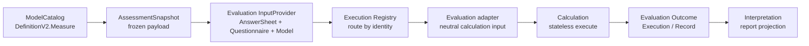

# 核心设计：因子与计分模型

> 状态：当前实现、历史兼容与待治理边界并存。本文以 DefinitionV2、Evaluation 执行机制和 Calculation 当前代码为事实源，不把枚举中存在但运行链路尚未支持的策略写成可用能力。

## 1. 本文回答

本文讨论 ModelCatalog 怎样用 Factor 描述不同测评共享的测量结构，又怎样把具体计分执行交给 Calculation。重点回答：

1. Factor 为什么是测评平台最重要的稳定领域概念之一，而不只是报告上的一个分数名称？
2. `Factor`、`FactorGraph` 和 `Scoring` 为什么要拆开，分别保护什么事实？
3. Survey 的单题基础分、ModelCatalog 的题目贡献、Calculation 的因子原始分、Norm 派生分和 Decision 结果有什么区别？
4. 题目来源与子 Factor 来源为什么不能在同一条 Scoring 中混用？
5. `question_score`、`option_override` 和历史 `legacy_implicit` 分支如何计算？
6. `sum`、`avg`、`weighted_sum`、`weighted_avg` 等 Strategy 当前究竟在哪些执行链路可用？
7. 医学量表、人格测评、行为评定和认知任务为什么共享 Factor 结果语言，却不应该被强行塞进同一套计分公式？
8. ModelCatalog、Evaluation、Calculation 和 Interpretation 在计分链路中各自拥有什么？
9. 当前通用因子模型还存在哪些发布校验和扩展性缺口？

本文不详细展开：

- Norm 资产和常模查表规则，后续见 `24-核心设计-常模资产与校准.md`；
- Decision、OutcomeCode 与解释边界，后续见 `25-核心设计-结果判定、Outcome与解释边界.md`；
- 四类模型的完整专属算法，分别见 [模型类型专题](./40-模型类型/README.md)；
- Answer 如何取得基础题分，见 [Survey 领域模型](../10-survey/10-领域模型.md)；
- 模型怎样选择执行机制，见 [模型身份、算法绑定与执行路由](./21-核心设计-模型身份、算法绑定与执行路由.md)。

---

## 2. 30 秒结论

Factor 是模型声明的稳定测量维度；Factor score 是某次 Evaluation 基于精确模型版本计算出来的事实。二者不是同一个对象。

```text
Survey
  Answer.Value
    -> Answer.Score（单题基础分）

ModelCatalog
  Factor + FactorGraph + Scoring
    -> 声明测什么、输入从哪里来、采用什么策略

Evaluation
  冻结 AnswerSheet + Questionnaire + AssessmentSnapshot
    -> 选择执行路径并构造中性输入

Calculation
  执行题目贡献、聚合、特殊任务计分和投影
    -> raw factor scores / derived scores

Evaluation
  固化 Outcome Execution / Record

Interpretation
  消费稳定结果形成报告
```

通用结构是：

```text
MeasureSpec
├── Factors       定义有哪些稳定测量节点
├── FactorGraph   定义节点之间的层级和顺序
└── Scoring       定义每个可计分节点怎样产生分数
```

但“通用 Factor”不等于“所有模型执行同一公式”：

| 模型机制 | 当前计分语义 |
| --- | --- |
| 普通医学量表 `factor_scoring` | 聚合 Answer.Score，当前执行支持 sum、avg、cnt |
| 人格类型 `typology` | 题目贡献形成叶子因子，按拓扑计算复合因子，再做类型判定 |
| 行为评定 `factor_norm` | 先复用量表原始分，再计算复合 index，并追加常模派生分 |
| 认知任务 `task_performance` | SPM 按正确答案与题组计分；非 SPM 分支可以复用量表计分 |

设计原则是：

> ModelCatalog 统一“模型如何描述”，Calculation 扩展“数学语义如何执行”，Evaluation 统一“某次测评如何选择、冻结、执行和保存”。

---

## 3. 为什么需要 Factor 抽象

### 3.1 题目不是最终业务结果

题目是采集信息的最小单元，但医生、运营和趋势分析通常不关心“Q17 得了 2 分”，而关心：

- 注意力维度是否升高；
- 执行功能总指数如何变化；
- 外向/内向倾向如何组合；
- 某项认知能力处于什么水平。

这些稳定测量维度就是 Factor。

```text
多个题目事实
  -> 一个 Factor 原始分
  -> 可选常模分
  -> 可选等级/结果判定
```

### 3.2 Factor 是跨模块引用轴

Factor code 不只被计分使用。它还会被：

- Calibration 的 `NormRef.FactorCode` 引用；
- Conclusion/Decision 的 `FactorCode` 或 `FactorCodes` 引用；
- ReportMap 的 `SourceRefs` 引用；
- Evaluation Outcome 的 `DimensionResult.Code` 保存；
- Interpretation 的因子图表、报告段落引用；
- 患者级趋势按 code 聚合多次结果。

因此 Factor code 是模型内部的稳定语义标识，不是可以随意修改的展示字段。

### 3.3 Factor 与 FactorScore 必须分开

| 概念 | 所属模块 | 性质 |
| --- | --- | --- |
| Factor | ModelCatalog | “这个模型测量什么”的发布定义 |
| Factor Scoring | ModelCatalog | “这个维度怎样得到原始分”的规则声明 |
| FactorScore / DimensionResult | Calculation / Evaluation | 某次测评实际计算出的结果事实 |
| Factor report item | Interpretation | 面向医生或患者的展示投影 |

Factor 本身没有患者、答卷和执行状态。FactorScore 必须绑定一次具体 Evaluation 和精确模型发布版本。

### 3.4 Factor code 的演进约束

当前业务趋势会把同一患者、不同入口和不同 Plan 的同一种测评结果放在一条患者级趋势中。Plan 又会在每次 Task 使用最新 active release。因此跨版本比较依赖 Factor code 的语义稳定。

应遵守：

- 同一语义维度跨 release 沿用同一 code；
- 新增维度使用新 code；
- 删除维度不会删除历史结果，但新趋势点不再产生该 code；
- 维度含义发生根本改变时，不应复用旧 code；
- title 可以演进，但 code 不应被重新解释。

当前代码保留了每次执行的精确模型版本，却没有在发布时自动检查 Factor code 的跨版本语义兼容性。因此这是重要的运营规则，也是后续可增强的 release-diff 校验能力。

---

## 4. 先统一“分数”语言

项目中多个字段都叫 score，但它们处在不同阶段。

| 名称 | 示例 | 产生者 | 是否属于 Factor 计分 |
| --- | --- | --- | --- |
| Answer.Value | 选择 `B` | 用户作答 + Survey | 输入事实，不是分数 |
| Answer.Score | `3` | Survey 题型计分 | 是 Factor 的基础输入之一 |
| contribution score | `3 × -1 × 0.5 = -1.5` | Calculation classification | 人格叶子因子的中间值 |
| raw factor score | 注意力 `18` | Calculation | Factor 的原始测量结果 |
| derived score | T 分 `65`、百分位 `90` | Calculation norm projection | 基于 raw score 的派生结果 |
| level | `high` | Decision/Projection | 对分数的分类，不是另一个原始分 |
| OutcomeCode | `moderate`、`INTJ` | Decision | 稳定结果代码，不是通用数值分 |
| report label | “中度风险” | Interpretation | 展示文案，不应反向参与计分 |

### 4.1 Answer.Score 是单题基础分

Survey 负责从题型、选项和答案值延迟派生 `Answer.Score`。它可以包含：

- 普通选项分；
- 多选项求和；
- 数值题输入；
- 题型自身定义的反向或转换规则。

它不包含跨题聚合、Factor、Norm 和 Decision。

### 4.2 raw score 是模型测量事实

raw factor score 是模型根据 Scoring 或算法专用执行规则计算出来的值。例如：

```text
INATTENTION = Q1.Score + Q2.Score + ... + Q9.Score
```

它是后续校准和判定的输入，也是趋势比较中最常见的原始事实。

### 4.3 derived score 不能覆盖 raw score

常模投影产生 T 分、百分位或标准分时，Evaluation Outcome 同时保存：

- `DimensionResult.Score`：主原始分；
- `DimensionResult.DerivedScores`：一个或多个派生分；
- `DimensionResult.NormReference`：派生所使用的精确常模事实。

不能把 T 分直接覆盖 raw score，否则无法解释常模变化前后的差异，也无法重新审计原始计算。

### 4.4 level 与 outcome 不属于本文的计分层

计分回答“数值是多少”，Decision 回答“这个数值或向量意味着什么”。两者分开后，同一份 Factor 结果可以采用不同判定机制，而计分算法不需要嵌入报告文案。

---

## 5. MeasureSpec 的三部分

### 5.1 Factors：稳定节点清单

当前 `Factor` 保持非常精简：

```go
type Factor struct {
    Code  string
    Title string
    Role  FactorRole
}
```

这种设计是有意的：Factor 只声明节点身份和业务角色，不把父子关系、题目映射或公式都塞进一个大对象。

### 5.2 FactorGraph：结构和展示顺序

```go
type FactorGraph struct {
    Roots      []string
    Edges      []FactorEdge
    SortOrders map[string]int
}
```

它表达：

- 哪些节点是根节点；
- 哪个 Factor 是另一个 Factor 的父节点；
- 报告和结果列表采用什么稳定顺序。

FactorGraph 不隐含公式。存在：

```text
GEC -> BRI
GEC -> ERI
```

只表示层级，不等于自动声明：

```text
GEC = BRI + ERI
```

父节点怎样从子节点得到分数，仍必须由 Scoring 的 factor sources 和 Strategy 声明。

### 5.3 Scoring：分数产生规则

```go
type Scoring struct {
    FactorCode    string
    Sources       []ScoringSource
    Strategy      ScoringStrategy
    Params        *ScoringParams
    MaxScore      *float64
    Weights       map[string]float64
    Constant      float64
    OptionScoring OptionScoring
}
```

Scoring 描述：

- 为哪个 Factor 计算；
- 输入来自题目还是子 Factor；
- 怎样聚合输入；
- 是否有常量项、权重或策略参数；
- MaxScore 作为结果元数据是多少；
- 历史人格 option scoring 采用 strict 还是 compat。

### 5.4 为什么结构与计分必须拆开

如果父子关系直接等同于求和公式，会产生三个问题：

1. 无法表达“结构上属于一个报告组，但不参与父级计分”；
2. 无法表达加权、平均、查表或特殊算法；
3. 调整报告层级会意外改变数学结果。

因此应保持：

```text
Factor          节点是什么
FactorGraph     节点怎样组织
Scoring         节点怎样得到分数
ReportMap       哪些节点怎样展示
```

---

## 6. FactorRole 的业务语义

当前角色集合如下：

| Role | 语义 | 典型场景 | 当前规则 |
| --- | --- | --- | --- |
| `dimension` | 普通测量维度，空 role 默认归一化到它 | 医学量表子因子、人格叶子因子 | 可以绑定题目 |
| `total` | 总分节点 | 量表总分、SPM 总分 | 可以直接绑定题目，也允许聚合子 Factor |
| `index` | 综合指数 | BRIEF-2 BRI、ERI、GEC | 发布模型应定义题目或子 Factor 来源 |
| `validity` | 有效性指标 | 不一致、异常作答等 | 可以绑定题目 |
| `subtest` | 分测验 | 认知测验的子测验 | 可以绑定题目 |
| `task_set` | 任务题组 | SPM A/B/C/D/E 题组 | 可以关联任务题目 |
| `ability_domain` | 能力域 | 认知能力维度 | 可以绑定题目 |
| `report_group` | 纯报告分组 | 报告章节归组 | 禁止配置 Scoring |

### 6.1 role 不是算法路由键

Role 决定节点的业务性质和部分校验策略，但不能独立选择 Calculation 算法。真正的执行路径由：

```text
Kind + SubKind + Algorithm
```

选择。

例如 `task_set` 说明结果节点是一组任务，但 SPM 如何判断正确答案仍由 AlgorithmSPM 的执行契约决定。

### 6.2 report_group 为什么不能计分

报告分组是展示结构，不是测量维度。如果允许它携带题目或公式，运营调整报告结构时就可能改变结果。因此当前校验明确拒绝 `report_group` 的 Scoring。

### 6.3 role 当前校验仍有缺口

`FactorRole.IsValid()` 已定义合法枚举，但 `ValidateMeasureSpecParts` 当前没有统一拒绝未知 role；部分 legacy payload 适配器会把未知值归一化为空值，再按 `dimension` 处理。

目标规则应是：

- 新 DefinitionV2 保存和发布必须拒绝未知 role；
- 历史 payload 兼容读取可以有明确归一化策略；
- 不能让拼写错误静默变成普通 dimension。

---

## 7. 两类 ScoringSource

### 7.1 question source：从作答事实形成 Factor

```yaml
FactorCode: INATTENTION
Strategy: sum
Sources:
  - Kind: question
    Code: Q1
  - Kind: question
    Code: Q2
```

question source 消费 AnswerSheet 中对应题目的作答事实。普通量表通常直接使用 `Answer.Score`；人格模型还可以声明 sign、weight 和 option override。

### 7.2 factor source：从子 Factor 形成复合节点

```yaml
FactorCode: GEC
Strategy: sum
Sources:
  - Kind: factor
    Code: BRI
  - Kind: factor
    Code: ERI

```

factor source 消费已经计算出的子节点分数，因此执行顺序必须满足“先子后父”。

### 7.3 为什么同一 Scoring 禁止混用两类 source

当前领域校验拒绝：

```yaml
Sources:
  - Kind: question
    Code: Q1
  - Kind: factor
    Code: CHILD_A
```

这是一个有价值的限制：

- 题目贡献属于叶子测量；
- 子 Factor 聚合属于复合测量；
- 混在一起会使缺失值、权重、顺序和可解释性变得含糊。

如果业务真的需要“子因子之和再加一道校正题”，应创建显式中间 Factor 或新增具有明确语义的 Algorithm/Strategy，而不是让通用 Scoring 变成任意表达式语言。

### 7.4 Factor source 禁止携带题目贡献字段

factor source 不允许携带：

- `ScoringMode`；
- `Sign`；
- 题目 contribution `Weight`；
- `OptionScores`。

复合节点的权重由 Scoring 顶层 `Weights[childCode]` 表达，不能与题目贡献权重混为一谈。

---

## 8. 题目基础分与人格题目贡献

题目贡献是当前最完整地使用 `ScoringSource` 扩展字段的模型，因此值得作为通用边界案例保留。

### 8.1 为什么问卷有分值，模型仍需要贡献配置

```text
Survey：用户选择 B，B 在这版问卷中的基础分是多少？
ModelCatalog：Q1 的基础分进入哪个 Factor，以什么方向和权重进入？
```

例如：

```yaml
question_code: Q1
answer_value: D
answer_score: 4
```

模型声明：

```yaml
FactorCode: E
Sources:
  - Kind: question
    Code: Q1
    ScoringMode: question_score
    Sign: -1
    Weight: 0.5
```

则：

```text
contribution = 4 × (-1) × 0.5 = -2
```

模型没有重新定义选项 D，只定义 Q1 如何贡献给 E。

### 8.2 `question_score`：默认新语义

```text
baseScore = Answer.Score
contribution = baseScore × sign × weight
```

约束：

- sign 只能是 `1` 或 `-1`；
- weight 必须是大于 0 的有限数字；
- Answer.Score 可以是 0、负数或小数；
- 不允许同时携带 OptionScores。

该模式让问卷成为基础题分唯一事实源，模型只维护归属、方向和权重。

### 8.3 `option_override`：显式高级覆盖

```text
baseScore = OptionScores[Answer.Value]
contribution = baseScore × sign × weight
```

只有问卷基础分不能表达特定模型的贡献语义时才应使用。当前 typology 发布校验进一步要求：

- 用于有明确选项的 Radio 题；
- 覆盖全部有效选项；
- 不包含未知选项；
- 执行时保留 Answer.Value；
- 未知选项严格失败，不回退到 Answer.Score。

### 8.4 `legacy_implicit`：历史快照兼容，不是第三种新模式

历史人格快照可能没有 `ScoringMode`：

- 有 OptionScores 时沿用历史 strict/compat option scoring；
- 无 OptionScores 时沿用历史 Likert 1–5 和 sign 语义；
- 历史 override 没有应用 sign，兼容分支仍保持原结果。

空模式只能服务 retained 历史快照。新配置应显式保存 `question_score` 或 `option_override`，不能继续制造新的隐式语义。

### 8.5 同一道题可以贡献给多个 Factor

允许：

```text
Q1 -> Factor E
Q1 -> Factor SOCIAL
```

但同一 `question_code + factor_code` 只能出现一次。题目对两个维度的贡献是两个独立规则，不能让后一次配置覆盖前一次。

---

## 9. Strategy 不是全局万能枚举

### 9.1 领域枚举中的策略

当前 `factor.ScoringStrategy` 声明：

```text
sum
avg
weighted_sum
weighted_avg
max
min
cnt
```

这个集合表达项目出现过或计划表达的聚合术语，但枚举存在不等于每个执行路径都实现。

### 9.2 当前真实支持矩阵

| 执行位置 | 当前真正支持 | 说明 |
| --- | --- | --- |
| scale question aggregation | `sum`、`avg`、`cnt` | `collectFactorValues` 先按这三种策略准备输入，其余直接失败 |
| typology leaf | `sum` + Constant | 每道题先计算 contribution，再累加 |
| typology composite | `sum`、`avg`、`weighted_avg` | 在 classification graph 内执行 |
| generic composite projection | `sum`、`average`、`weighted_sum` | BRIEF-2 等对已算子节点做投影 |
| infra ruleengine internal registry | sum、average、weighted_sum、max、min、count、first、last | 但公开 `ScaleFactorScorer` 当前只路由 sum/avg/cnt |

所以不能根据 OpenAPI 枚举或某个 registry 中存在实现，就声称 scale 模型可以直接使用 `weighted_sum`、`max` 或 `min`。

### 9.3 `avg`、`average`、`weighted_avg`、`weighted_sum` 的差异

项目当前存在多套相近命名：

- scale 使用 `avg`；
- Calculation ScoreNode 使用 `average`；
- typology composite 使用 `weighted_avg`；
- generic composite projection 使用 `weighted_sum`。

适配器负责转换，但目前并没有一个统一的 capability registry 验证“某个 execution path 接受哪些 Strategy”。这正是策略扩展时最容易产生“能保存、能发布、运行时报错”的位置。

### 9.4 当前目标边界

Strategy 应当是 AlgorithmFamily 下的受限能力，而不是全系统无条件共享的字符串：

```text
factor_scoring supports [sum, avg, cnt]
classification supports [sum, avg, weighted_avg]
composite_projection supports [sum, average, weighted_sum]
```

发布校验应根据最终 ExecutionPath 验证策略能力；只有确实实现、注册、验证并有测试的 Strategy 才能对运营暴露。

---

## 10. Scoring 的其它字段

### 10.1 Constant

`Constant` 当前主要用于人格叶子 Factor：

```text
leaf score = Constant + sum(question contributions)
```

它不是所有 scale strategy 的通用偏置项。普通 scale scorer 当前不会自动把 Scoring.Constant 加到结果中。

### 10.2 Weights

项目有两种不同权重：

```text
题目贡献权重
  ScoringSource.Weight
  -> Answer.Score × sign × weight

复合节点子因子权重
  Scoring.Weights[childCode]
  -> child score × child weight
```

二者作用阶段不同，不能复用同一字段。

### 10.3 Params

当前通用 `ScoringParams` 只明确承载：

```go
CntOptionContents []string
```

`cnt` 不是简单统计 Answer 个数，而是根据 Questionnaire 解析选项内容，统计答案命中特定内容的数量。因此执行时除了 AnswerSheet，还需要精确 QuestionnaireSnapshot。

### 10.4 MaxScore

`MaxScore` 当前是模型配置的结果元数据，可进入 FactorScore/报告展示。它不是每次根据问卷自动推导的数学证明，也不会自动阻止 raw score 超出范围。

如果 MaxScore 用于百分比、图表边界或质量校验，发布阶段应进一步验证它是有限正数，并与问卷及计分规则一致。当前通用校验尚未完整做到这一点。

### 10.5 OptionScoring

`strict/compat` 主要服务历史人格 option scoring：

- strict：未知选项失败；
- compat：历史条件下可以回退 Answer.Score。

它不是新模型应主动选择的通用容错开关。新显式 `option_override` 按 strict 执行。

---

## 11. 四类模型怎样使用 Factor

### 11.1 医学量表：题目基础分聚合

普通量表的执行路径是：

```text
Factor.QuestionCodes
  -> 从 AnswerSheet 收集 Answer.Score
  -> sum / avg / cnt
  -> raw FactorScore
  -> risk Decision
```

当前实现细节：

- sum/avg 只收集 AnswerSheet 中实际存在的答案；
- cnt 需要 QuestionnaireSnapshot，把 Answer.Value 解析为选项内容再判断是否命中；
- 存在 `role=total` 的 Factor 时，它的 raw score成为 TotalScore；
- 没有 total Factor 时，TotalScore 默认累加全部 Factor raw score。

最后一点要求模型设计者警惕重复计数：如果多个 Factor 本身存在重叠题目，又没有显式 total Factor，默认总分只是运行时兼容语义，不一定代表医学模型期望的总分。

### 11.2 人格类型：题目贡献与有向无环图

typology 将 Factor 分成：

- 叶子 Factor：从题目贡献计算；
- 复合 Factor：从已计算子因子聚合。

```text
leaf = constant + Σ(question contribution)
composite = aggregate(child factor scores)
```

运行时先对 FactorGraph 做拓扑排序，保证子节点先于父节点计算；缺少 contribution 对应答案时严格失败。得到完整 Factor 向量后，DecisionKind 再执行极点组合、最近模式、主导因子或 trait profile。

“16 人格”“九型人格”“大五人格”首先是 Factor 结构、贡献配置与 Decision 的差异，不应分别复制一套题目求和引擎。

### 11.3 行为评定：原始分、复合指标和常模投影

BRIEF-2 类模型执行：

```text
量表 factor_scoring
  -> 叶子 Factor raw scores
  -> CompositeProjection
  -> BRI / ERI / GEC 等 index raw scores
  -> Norm Projection
  -> TScore / percentile 等 derived scores
  -> HierarchyProjection
```

这里 FactorGraph 和 ScoreNode 提供共享结果结构，而 BRIEF-2 的 form variant、主因子、有效性因子和 Norm 规则仍由专属 ExecutionSpec/Algorithm 表达。

### 11.4 认知任务：任务正确性不是普通 Answer.Score 聚合

Raven SPM 根据发布快照中冻结的：

- item set；
- question code；
- correct option code；
- total factor code；

逐题判断正确性。每题正确得 1，未答或错误得 0；题组形成 `task_set` Dimension，总和形成 `total` Dimension，之后可以按 Norm 产生百分位或标准分。

SPM 证明了通用边界：Factor 可以统一描述结果节点，但“正确答案比对”不应被伪装成通用 `sum(Answer.Score)` 配置。

当前 cognitive 非 SPM payload 仍可以转换为 scale snapshot 并复用 factor_scoring，这允许同一大类下同时存在普通量表式能力测评和专用任务测评。

---

## 12. 缺失输入的语义属于算法

当前不同执行机制对缺失题目的行为不同：

| 执行机制 | 当前行为 |
| --- | --- |
| scale sum/avg | 只聚合实际存在的答案；缺失题目被跳过 |
| typology contribution | contribution 引用题目缺少答案时失败 |
| SPM | 未作答按 0 分处理 |

这些差异不必被强行统一，因为它们可能代表不同业务语义：

- 医学量表通常应由 Survey 的提交校验保证必答完整；
- 人格贡献缺失会破坏类型向量，适合严格失败；
- 认知任务未答本身就是能力表现的一部分，可以计 0。

但差异必须被显式表达。当前缺失策略主要固化在算法代码中，DefinitionV2 没有统一的 `missing_policy`。新增模型时必须回答：

1. 未答是否允许通过 Survey 提交？
2. 若允许，Factor 聚合时跳过、补零还是失败？
3. avg 的分母是配置题数还是实际作答数？
4. 缺失是否影响有效性指标？

不能由不同适配器随意猜测。

---

## 13. 从发布模型到 Calculation 的责任链



### 13.1 ModelCatalog 拥有规则，不执行规则

ModelCatalog 保存和发布：

- Factor identity 与 role；
- FactorGraph；
- Scoring source、Strategy 和参数；
- Algorithm-specific ExecutionSpec；
- Calibration ref；
- Decision 配置。

它不接收某个患者的 AnswerSheet，也不产生 FactorScore。

### 13.2 Evaluation 拥有一次执行编排

Evaluation：

1. 读取 Assessment 冻结的精确 model ref；
2. 取得 retained AssessmentSnapshot；
3. 取得同版本 AnswerSheet 与 QuestionnaireSnapshot；
4. 根据 ExecutionIdentity 选择执行 descriptor；
5. 将 ModelCatalog/Survey 对象转换为 Calculation 的中性输入；
6. 调用 Calculation；
7. 将结果映射并提交为 Evaluation Outcome。

### 13.3 Calculation 是无状态计算内核

`domain/calculation` 的边界要求它不导入 ModelCatalog、Factor 聚合或 Questionnaire 领域对象。调用方转换为：

- `Dimension`；
- `ScoreNode`；
- classification FactorGraph；
- norm table；
- algorithm-specific neutral input。

Calculation 返回 `calculation.Result` 或专属结果，由应用层 adapter 转换为 Evaluation `outcome.Execution`。

### 13.4 Interpretation 不反向决定计分

Interpretation 可以选择展示哪些 Factor、用什么图表和文案，但不能：

- 为了图表好看重算 raw score；
- 根据报告模板选择 Calculation Strategy；
- 用报告 label 替代稳定 Factor code；
- 在缺少 Factor 时从答案临时猜测分数。

---

## 14. Calculation 的统一结果契约

### 14.1 DimensionResult

四类模型最终尽量归一为：

```go
type DimensionResult struct {
    Code           string
    Name           string
    Kind           DimensionKind
    Role           string
    ParentCode     string
    HierarchyLevel int
    SortOrder      int
    Score          *ScoreValue
    DerivedScores  []ScoreValue
    Level          *ResultLevel
    NormReference  *NormReference
}
```

它让报告和趋势不必理解每个算法内部结构。

### 14.2 ScoreKind

当前统一分数类型包括：

| ScoreKind | 语义 |
| --- | --- |
| `raw_total` | 原始分或原始聚合值 |
| `match_percent` | 匹配程度 |
| `t_score` | T 分 |
| `percentile` | 百分位 |
| `standard_score` | 标准分 |

新派生分应扩展明确 ScoreKind，而不是把不同含义的数值都塞进一个无类型 `score`。

### 14.3 DimensionKind 与 FactorRole 不完全相同

`DimensionKind` 是计算结果的通用类别，如 factor、pole、trait、index、ability；`FactorRole` 是模型内节点的业务角色。

应用层 adapter 负责合理映射，不能假设两个枚举一一等价。例如：

- `role=index` 通常映射 `kind=index`；
- `task_set` 在 SPM 中映射 `kind=ability`；
- typology 的极点结果可能是 `kind=pole`，不一定对应一个普通 Measure Factor。

### 14.4 Execution 与 Record

Calculation 完成后先产生可组装的 `outcome.Execution`；只有 Evaluation commit 成功后才形成不可变、可持久化的 Outcome Record。

这保证计分函数的临时中间状态不会被误当作已经完成的测评事实。

---

## 15. 校验应该分几层

### 15.1 Definition 静态结构校验

当前已经实现的核心校验包括：

- Factor code 非空、不可重复；
- graph edge 引用存在的 parent/child；
- graph 不允许循环；
- Scoring.FactorCode 必须存在；
- 同一 Scoring 不能混用 question/factor source；
- 同一题不能重复贡献给同一 Factor；
- factor source 不能携带题目贡献字段；
- report_group 禁止 Scoring；
- index 必须有题目或子 Factor 来源；
- question contribution 的 mode、sign、weight、OptionScores 合法。

### 15.2 跨资产校验

纯 Definition 无法知道 question code 是否属于绑定 Questionnaire，也无法知道 Norm version 是否存在。发布服务或 family handler 必须检查：

- question code 存在于精确 QuestionnaireSnapshot；
- option_override 覆盖合法选项；
- NormRef 指向存在的精确 Norm；
- Conclusion 和 ReportMap 引用存在的 Factor；
- Algorithm-specific ExecutionSpec 引用合法 Factor 和题目。

当前 typology 的问卷贡献校验最完整；Scale、Behavioral Rating、Cognitive 还没有全部达到同等强度。

### 15.3 执行能力校验

发布前还应确认：

- 当前 ExecutionPath 支持配置的 Strategy；
- payload adapter 没有丢失 source、weight、constant 等字段；
- Algorithm registry 已注册；
- 所需 Calculator、Norm projector 和 Outcome assembler 已装配。

### 15.4 执行输入校验

Evaluation 运行前校验：

- Assessment 状态允许执行；
- AnswerSheet、Questionnaire 和 Model version 一致；
- 必需 Answer 存在；
- answer score/value 满足算法要求；
- 常模受试者信息满足查表条件。

### 15.5 结果校验

Calculation 提供 `ValidateResult` 检查 Dimension code 非空和不重复。应用层提交前还应确认：

- model ref 与 Assessment 一致；
- 必需 primary/level/outcome 已产生；
- derived score 携带可审计 NormReference；
- 报告输入只来自已经提交的 Outcome 事实。

---

## 16. 当前实现缺口

### 16.1 Strategy 声明空间大于执行能力

`ScoringStrategy`、OpenAPI、Calculation registry 和各 execution path 的支持集合并不一致。当前可能出现“前端能选择、Definition 能保存、通用校验不报错、运行时才失败”。

目标治理：建立按 ExecutionPath 注册的 Strategy capability，并在保存提示、发布校验和运行时使用同一事实源。

### 16.2 通用发布校验没有完整校验 question refs

typology 会读取精确 QuestionnaireSnapshot 验证 contribution；普通 scale 等通用 Measure 当前主要验证结构，没有统一验证所有 question source 都存在于绑定问卷。

目标治理：增加共享的 QuestionnaireMeasureValidator，再允许 family handler追加题型、选项或算法专属规则。

### 16.3 未知 FactorRole 可能被静默归一化

目标治理：新 DefinitionV2 严格拒绝未知 role，legacy decode 单独保留兼容策略。

### 16.4 同一 Factor 的多条 Scoring 未显式拒绝

当前校验为每条规则分别检查，但构造 `scoringByFactor` 时后写覆盖前写，没有专门的 `scoring.factor.duplicate` 错误。

目标治理：一个 Factor 至多一条 Scoring；若未来需要多阶段公式，应建模为节点或 Algorithm pipeline，而不是重复规则。

### 16.5 Graph 完整性校验还不够

当前可以检查悬空 edge 和 cycle，但通用校验没有完整保证：

- Roots 非空且都存在；
- 每个非根节点只有一个 parent；
- 所有需要执行的 Factor 都可从 root 到达；
- edge 不重复；
- Graph edge 与 factor-source children 完全一致。

部分 typology runtime 和 Calculation ScoreNode 有更强校验，但不应依赖某个 family adapter 才发现通用结构错误。

### 16.6 可计分 Factor 不一定有可执行 Scoring

当前只有 index 明确要求来源；普通 dimension/total 可能没有 Scoring 仍通过通用结构校验，之后在 runtime 因空 Strategy 或空输入失败。

目标治理：按 FactorRole + Algorithm capability 判断哪些节点必须由题目、子 Factor 或专属算法产生。

### 16.7 Weight 与 MaxScore 校验不足

generic composite 主要检查 weighted_sum 是否缺权重，但没有统一检查所有 weight 是有限正数；MaxScore 也没有通用的有限值和一致性校验。

目标治理：静态数值合法性在 ModelCatalog 校验，医学或算法语义一致性由 family policy 校验。

### 16.8 缺失值策略没有成为显式契约

scale、typology、SPM 的行为不同但主要固化在代码中。新增算法时容易无意继承错误语义。

目标治理：先在 Algorithm capability 文档和测试中固定 missing-answer policy；只有多种配置确实共享需求时，再考虑把它提升为 DefinitionV2 字段。

---

## 17. 新模型如何判断“配置化”还是“新增算法”

### 17.1 只需要新配置

满足以下条件时，优先新增 AssessmentModel：

- 输入仍是 Answer.Score；
- 题目到 Factor 的映射可以用 question sources 表达；
- Factor 聚合使用当前 execution path 已支持的 Strategy；
- Norm 与 Decision 可以用已有机制表达；
- 缺失值和结果语义与现有 Algorithm 一致。

### 17.2 需要新增 Strategy

只有聚合数学公式不同，但输入、输出和失败语义仍与现有 Factor Scoring 一致时，考虑新增 Strategy。例如确实需要一种可复用的截尾平均。

新增 Strategy 必须同时完成：

1. 稳定 strategy code；
2. Calculation 实现；
3. ExecutionPath capability 注册；
4. 参数校验；
5. payload 投影；
6. 发布校验；
7. 预览与生产一致性测试；
8. Outcome 结果测试。

### 17.3 需要新增 Algorithm

若出现以下变化，应新增 Algorithm，而不是把特殊逻辑藏入 Strategy：

- 输入不再是普通题分，如 SPM 正确答案；
- 需要题组、时限、分支或专用有效性规则；
- 输出不是简单 Factor 聚合；
- 缺失值和失败语义根本不同；
- 需要专属 ExecutionSpec。

### 17.4 需要新增 Kind/SubKind

只有业务模型的领域身份、产品生命周期和结果语义本身发生变化时，才新增模型类型。不能为了接入一个计算公式就新增 Kind。

---

## 18. 不应采用的替代方案

### 18.1 把所有计分都放进 Survey

问题：Questionnaire 会开始理解 Factor、Norm 和医学模型，无法继续作为独立信息收集器。

结论：Survey 只产出答案事实与单题基础分。

### 18.2 每个量表写一个专用 Evaluator

问题：回到 PHP 时代“form + 硬编码解析”，每增加模型都修改执行主链路。

结论：同类模型通过 Factor/Scoring 配置接入，异类数学语义通过 Algorithm 扩展。

### 18.3 用一个万能公式字符串或脚本 DSL

优点：表面上什么都能配置。

问题：类型、引用、安全、调试、测试和可追问性全部变弱，配置最终变成没有工程保护的代码。

结论：使用有限 Strategy + 明确参数 + 显式 Algorithm。

### 18.4 FactorGraph 自动决定聚合公式

问题：报告层级变化会改变分数，结构关系与数学关系耦合。

结论：Graph 与 Scoring 分离。

### 18.5 执行时回到最新问卷重新计算 Answer.Score

问题：历史答案语义和 Factor 结果随新版本漂移。

结论：使用 AnswerSheet 与精确 QuestionnaireSnapshot；历史 Evaluation 使用 retained exact model release。

### 18.6 只保存最终报告，不保存结构化 Factor 结果

问题：无法趋势比较、无法审计 Norm、无法复用 Interpretation、无法回答追问。

结论：Evaluation 持久化结构化 Outcome，报告是其下游投影。

---

## 19. 已实现、部分实现与待治理

| 能力 | 状态 | 说明 |
| --- | --- | --- |
| Factor、FactorGraph、Scoring 分离 | 已实现 | DefinitionV2 MeasureSpec 的 canonical 结构 |
| Factor role 与报告分组边界 | 已实现/部分校验 | report_group 禁止计分；未知 role 尚未统一拒绝 |
| question/factor source 分离 | 已实现 | 同一 Scoring 禁止混合 |
| `question_score` / `option_override` | 已实现 | typology 新配置显式语义 |
| retained legacy implicit scoring | 已实现 | 历史人格快照兼容 |
| typology DAG 计分 | 已实现 | 叶子贡献、复合因子、拓扑执行 |
| scale sum/avg/cnt | 已实现 | 当前 factor_scoring 有效能力 |
| BRIEF-2 composite + norm | 已实现 | factor_norm pipeline |
| SPM 正确答案和题组计分 | 已实现 | task_performance 专属算法 |
| Calculation 中性结果与 Evaluation Outcome adapter | 已实现 | raw、derived、hierarchy、norm reference |
| 按 ExecutionPath 校验 Strategy capability | 待治理 | 当前枚举与实际能力存在漂移 |
| 所有模型统一 question ref 校验 | 部分实现 | typology 较完整，其余待加强 |
| Graph roots、单 parent、连通性校验 | 部分实现 | cycle/dangling 已有，其余待加强 |
| Scoring 唯一性校验 | 待治理 | 同一 Factor 多条规则未显式拒绝 |
| 跨发布 Factor code 兼容性检查 | 待治理 | 历史版本已冻结，但趋势兼容需 release diff |
| 显式 missing-answer policy | 待治理 | 当前由不同 Algorithm 代码决定 |

---

## 20. 代码阅读入口

| 主题 | 代码入口 |
| --- | --- |
| DefinitionV2 MeasureSpec | `internal/apiserver/domain/modelcatalog/definition/definition.go` |
| Factor、Source 与 Scoring | `internal/apiserver/domain/modelcatalog/factor/model.go` |
| FactorRole | `internal/apiserver/domain/modelcatalog/factor/role.go` |
| Graph/Scoring 静态校验 | `internal/apiserver/domain/modelcatalog/factor/measure_validate.go` |
| Measure 到中性 ScoreNode | `internal/apiserver/domain/modelcatalog/factor/score_nodes.go` |
| 发布 Definition 校验 | `internal/apiserver/application/modelcatalog/definition/definition_validation.go` |
| Scale payload 投影 | `internal/apiserver/port/modelcatalog/payload/scale` |
| Typology payload 与问卷校验 | `internal/apiserver/port/modelcatalog/payload/typology` |
| Scale factor scoring | `internal/apiserver/domain/calculation/scoring` |
| Typology contribution 与 graph | `internal/apiserver/domain/calculation/classification` |
| Composite/Hierarchy projection | `internal/apiserver/domain/calculation/projection` |
| Norm projection | `internal/apiserver/domain/calculation/norm` |
| Calculation/Evaluation adapter | `internal/apiserver/application/evaluation/calculationadapter` |
| factor_scoring execution | `internal/apiserver/application/evaluation/registry/mechanisms/scoring` |
| factor_norm execution | `internal/apiserver/application/evaluation/registry/mechanisms/norming` |
| typology execution | `internal/apiserver/application/evaluation/registry/mechanisms/typology` |
| task_performance / SPM | `internal/apiserver/application/evaluation/registry/mechanisms/task_performance` |
| 统一 Evaluation Outcome | `internal/apiserver/domain/evaluation/outcome/execution.go` |

---

## 21. 验证清单

### 21.1 修改 Factor/Graph

- [ ] Factor code 非空、唯一且没有复用旧语义；
- [ ] role 合法；
- [ ] roots、edges、parent 和 children 一致；
- [ ] 图无循环、无悬空节点、无多 parent；
- [ ] SortOrder 稳定；
- [ ] Norm、Decision、ReportMap 引用仍有效；
- [ ] 跨版本趋势影响已评估。

### 21.2 修改 Scoring

- [ ] 每个 Factor 至多一条 Scoring；
- [ ] question source 与 factor source 未混用；
- [ ] question code 存在于精确绑定问卷；
- [ ] Strategy 被目标 ExecutionPath 支持；
- [ ] sign、weight、constant、MaxScore 均为合法有限数字；
- [ ] weighted strategy 覆盖全部 child；
- [ ] missing-answer policy 明确；
- [ ] 预览和生产使用同一执行机制。

### 21.3 新增 Strategy/Algorithm

- [ ] ModelCatalog 配置类型和校验已增加；
- [ ] Calculation 实现是无状态的；
- [ ] Evaluation adapter 和 registry 已装配；
- [ ] compatibility payload 没有丢字段；
- [ ] active release 与 retained release 都能解析；
- [ ] 错误具有稳定分类；
- [ ] Outcome 仍输出结构化 DimensionResult；
- [ ] Interpretation 不需要反向读取算法内部结构。

---

## 22. 本文形成的设计语言

可以用三句话概括：

> Factor 定义“测量什么”，Scoring 定义“普通测量输入怎样形成原始分”，Algorithm 定义“超出通用聚合能力的数学语义怎样执行”。

> FactorGraph 负责结构，Calculation 负责数学，Evaluation 负责一次执行，Interpretation 负责说明结果；任何一层都不应越界成为另一层的替代品。

> 四类模型共享的是稳定 Factor 结果语言，而不是一套无限扩张的万能计分器。
