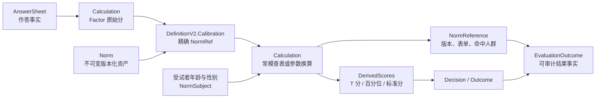
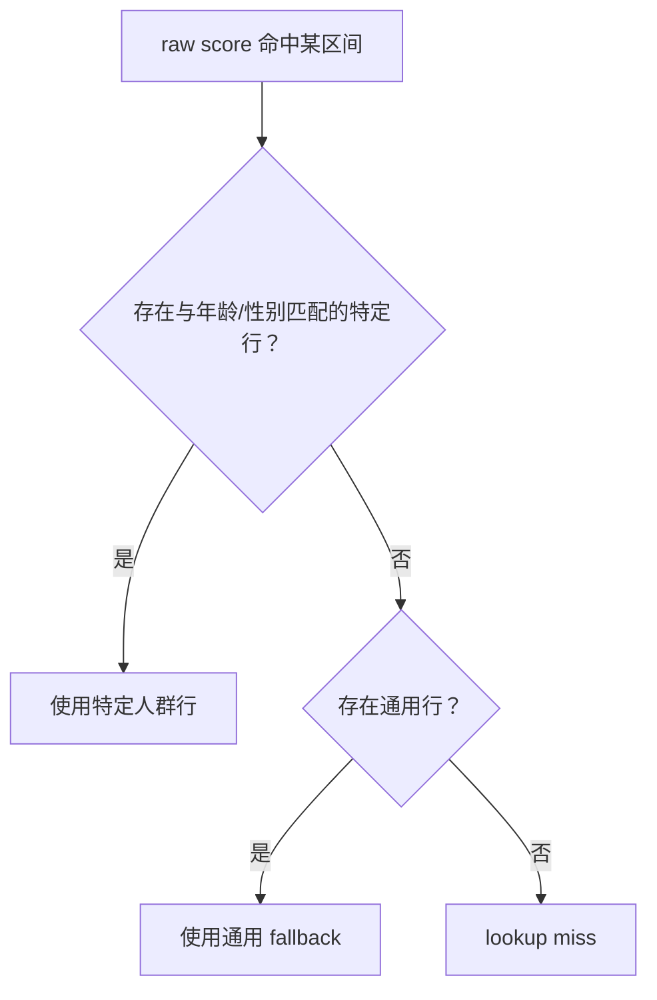
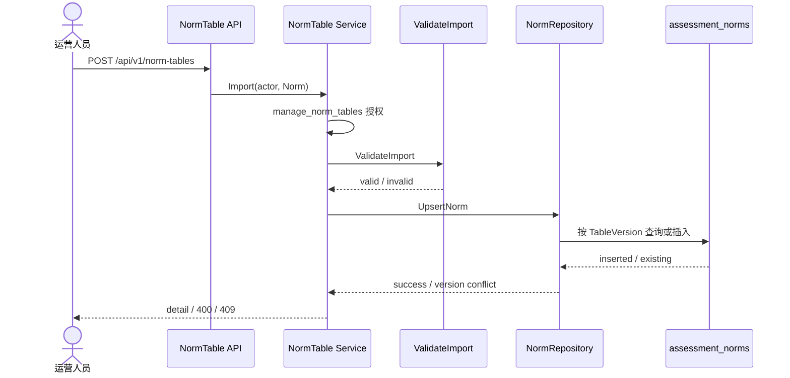
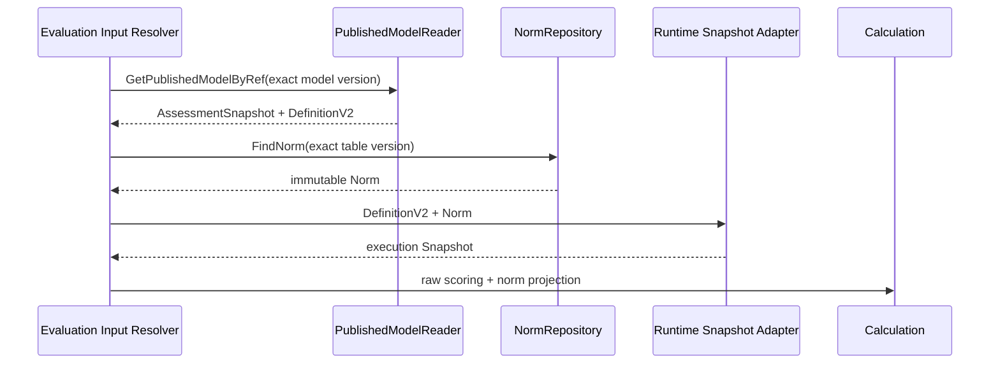

# 核心设计：常模资产与校准

> 状态：核心资产、导入校验、精确版本引用和行为评定常模执行已经实现；人口学输入装配、跨对象兼容校验、Mongo 唯一索引与认知常模接入仍存在明确缺口。本文严格区分当前实现与目标边界。

## 1. 本文回答

本文讨论 ModelCatalog 为什么把 Norm 建模为独立版本化领域资产，以及一次 Factor 原始分怎样经过常模校准形成可审计的派生分。重点回答：

1. 常模解决什么业务问题，为什么不能把它理解成一张 Evaluation 的附属查表？
2. Norm、Factor、Calibration、Decision 和 Interpretation 的职责怎样分开？
3. `TableVersion`、`FormVariant`、`Kind`、`Algorithm` 和 `FactorCode` 分别保护什么语义？
4. 为什么模型只保存精确 `NormRef`，而不保存“使用最新常模”的动态指针？
5. 当前支持哪两种常模表达：直接查表与均值/标准差换算？
6. 年龄、性别和通用兜底行怎样参与人群分层匹配？
7. T 分、百分位和标准分怎样产生，为什么不能覆盖 Factor 原始分？
8. 常模导入、模型发布、Evaluation 执行和 Outcome 留痕之间是什么关系？
9. 行为评定、医学量表和认知任务当前对常模的支持程度是否一致？
10. 当前实现中哪些能力已经可靠，哪些只是数据结构存在但端到端尚未闭环？

本文不详细展开：

- Factor 原始分如何形成，见 [因子与计分模型](./23-核心设计-因子与计分模型.md)；
- Decision 怎样把派生分转换为稳定结果，后续见 `25-核心设计-结果判定、Outcome与解释边界.md`；
- Mongo 集合、发布快照和事务的完整设计，后续见 `26-核心设计-数据存储与一致性.md`；
- BRIEF-2、SPM 感觉统合和 Raven SPM 的完整算法语义，分别见 [behavioral_rating：行为评定](./40-模型类型/30-behavioral-rating-行为评定.md) 与 [cognitive：认知测验](./40-模型类型/40-cognitive-认知测验.md)。

---

## 2. 30 秒结论

常模回答的不是“受试者得了多少原始分”，而是：

> 这个原始分放在某个明确参照人群中，处于什么相对位置？

因此，常模不是报告文案，也不是某次 Evaluation 的临时参数，而是可以被运营导入、查询，被多个模型发布精确引用，并且必须长期保留历史语义的**独立版本化领域资产**。

```text
Factor raw score
  某次测评本身算出了多少分

Norm
  某个版本、表单和参照人群下
  原始分怎样换算为 T 分、百分位或标准分

Decision
  某个派生分处于什么等级、对应哪个稳定 Outcome

Interpretation
  怎样向医生、患者或家长说明这个 Outcome
```

一次完整常模校准链路是：



当前最重要的规则是：

- Norm 按 `TableVersion` 精确寻址；
- 相同版本、相同内容可以重复导入；
- 相同版本、不同内容必须冲突，不能覆盖；
- 模型发布保存精确 `FactorCode + NormTableVersion`；
- 运行时不能选择“最新常模”；
- 常模派生分必须与 raw score 并存；
- Outcome 需要保存实际使用的常模版本、表单和命中人群；
- 更新常模必须产生新版本，并通过新的模型 release 对未来测评生效；
- 历史 Evaluation 继续使用当时冻结的模型 release 与 NormRef。

还必须区分两种“可用”：

| 层次 | 当前语义 |
| --- | --- |
| 资产可用 | Norm 导入成功后即可按版本查询和引用；当前没有独立 draft/published 状态 |
| 业务生效 | 某个 AssessmentModel 发布版本精确引用该 Norm 后，它才会参与该模型的新测评 |

所以，当前 Norm 的生命周期更准确地说是：

```text
离线整理与审核
  -> Import
  -> immutable available version
  -> 被某次 model release 引用
  -> 参与该 release 的 Evaluation
```

它是独立版本化资产，但当前还不是拥有“草稿—发布—归档”状态机的独立发布聚合。

---

## 3. 为什么常模必须是独立领域资产

### 3.1 原始分不能直接回答“处于什么水平”

假设某个行为因子原始分为 30。单看这个数字无法判断：

- 它对 6 岁儿童是否异常；
- 它对 12 岁儿童是否异常；
- 家长版与教师版是否使用同一参照分布；
- 30 分位于平均水平、临界水平还是显著偏高；
- 两个不同量表中的 30 分能否直接比较。

常模通过参照样本建立原始分与相对位置之间的转换。它把“绝对原始分”变成可解释的“相对标准位置”。

### 3.2 常模不是模型内部的一段普通配置

一份常模通常具有自己的来源、审核、适用人群和修订周期：

- 可能来自量表手册或经过授权的数据源；
- 可能按家长版、教师版、家庭版等表单区分；
- 可能按年龄、性别或其他人群特征分层；
- 同一份常模可以被多个模型 release 引用；
- 常模更新频率与问卷、模型规则更新频率不同；
- 历史结果必须能够回答“当时用了哪一版参照资料”。

如果把整张常模表内嵌在每个 AssessmentModel 中，会造成：

- 大量重复数据；
- 同一常模的多份副本可能不一致；
- 无法独立查询、校验和治理常模；
- 修订常模时难以识别影响了哪些模型；
- 历史审计只能在模型 payload 中寻找隐含副本。

因此当前领域结构采用：

```text
Norm
  独立保存完整参考数据

DefinitionV2.Calibration.NormRefs
  只保存 FactorCode + exact TableVersion
```

### 3.3 常模也不属于 Evaluation

Evaluation 拥有的是“一次执行”：

- 读取哪一个精确模型版本；
- 选择哪种执行能力；
- 组织本次输入；
- 保存本次结果与执行状态。

它不应该拥有常模内容本身。否则每次执行都在隐式定义一份参照规则，ModelCatalog 无法审核，也无法在模型发布前验证。

更准确的边界是：

| 模块 | 拥有的事实 |
| --- | --- |
| Survey | AnswerSheet、QuestionnaireSnapshot、单题基础分 |
| ModelCatalog | Norm 资产、NormRef、Factor 与 Decision 配置 |
| Calculation | 查表、参数换算和派生分算法 |
| Evaluation | 物化精确 Norm 输入、组织执行、持久化结果证据 |
| Interpretation | 消费已确定的结果与常模引用，组织报告说明 |

---

## 4. 先区分 Calibration、Norm、Decision

这三个概念经常在产品语言中都被叫作“评分规则”，但它们回答不同问题。

| 层次 | 输入 | 输出 | 示例 |
| --- | --- | --- | --- |
| Factor scoring | Answer.Score 或子 Factor | raw score | 9 道题相加得到注意力原始分 18 |
| Norm calibration | raw score + 参照人群 | derived score | 原始分 18 换算为 T=65、P=93 |
| Decision | raw/derived score 或因子向量 | level / OutcomeCode | T≥65 判为 elevated |
| Interpretation | Outcome + 模型解释资产 | 面向使用者的报告 | 说明风险含义与建议 |

### 4.1 Calibration 是模型对外部参考资产的使用声明

`DefinitionV2.Calibration` 当前主要保存 `NormRefs`。它不是常模内容，而是说明：

> 这个模型 release 的哪个 Factor，需要使用哪一个精确常模版本进行校准。

### 4.2 Norm 只拥有换算依据

Norm 拥有：

- 版本身份；
- 表单变体；
- 适用的模型 Kind 与 Algorithm；
- 每个 Factor 的参照数据；
- 人群分层；
- raw score 到派生分的映射，或均值/标准差参数。

Norm 不应该拥有：

- 医学诊断；
- OutcomeCode；
- 面向患者的报告段落；
- 某次测评的实际分数；
- Evaluation 的执行状态。

### 4.3 Decision 使用校准结果，但不应混入常模资产

例如 BRIEF-2 可能先得到 T 分，再根据 T 分区间形成等级。当前 `NormConclusion` 配置在 `DefinitionV2.Conclusions` 中，运行时被投影为 T 分判定规则。

这样拆分后：

- Norm 可以被多个模型版本复用；
- 不同模型可以针对相同常模派生分采用不同 Decision；
- 修改解释和结果分级时，不必伪造一个新的常模数据版本；
- 修改参照分布时，必须产生新的 Norm 版本。

---

## 5. Norm 领域模型

当前核心结构是：

```go
type Norm struct {
    TableVersion string
    FormVariant  string
    Kind         identity.Kind
    Algorithm    identity.Algorithm
    Factors      []FactorTable
}

type FactorTable struct {
    FactorCode string
    Bands      []Band
    Lookup     []LookupEntry
}
```

模型引用结构是：

```go
type Ref struct {
    FactorCode       string
    NormTableVersion string
}
```

### 5.1 TableVersion：当前全局寻址键

`TableVersion` 表示一份不可变常模数据的精确版本。仓储当前只通过它查找：

```text
FindNorm(tableVersion)
```

这意味着在当前物理实现中，`TableVersion` 不是“某一模型内部的局部版本号”，而是 `assessment_norms` 集合中的全局业务键。版本命名必须避免跨模型碰撞，例如：

```text
brief2-parent-cn-2026-v1
spm-sensory-home-cn-legacy-v1
```

仅使用 `v1`、`2026` 之类宽泛名称，会让不同量表、表单和算法争用同一命名空间。

### 5.2 FormVariant：表单语义，不是展示标签

`FormVariant` 区分同一测评的不同施测/报告表单，例如：

- `parent`：家长版；
- `teacher`：教师版；
- `home`：家庭场景版。

不同表单可能题目相似，却使用不同参照样本。它必须进入常模身份和结果证据，不能只作为 UI 标签。

当前仓储仍只以 `TableVersion` 作为唯一寻址条件；因此 `FormVariant` 依赖版本命名与发布校验共同保护，尚未形成复合身份。

### 5.3 Kind 与 Algorithm：声明适用的执行语义

当前 Norm 保存 `Kind + Algorithm`，用于声明它适用于哪类模型和哪项算法能力。例如：

```text
behavioral_rating + brief2
behavioral_rating + spm_sensory
behavioral_rating + behavioral_rating_default
```

这一信息不是运行路由本身，而是资产兼容性约束：BRIEF-2 常模不能被一个无关算法误用。

当前导入校验只接受上述行为评定组合。虽然领域类型看起来通用，认知 `cognitive + spm` 目前会被导入校验拒绝。这说明当前 Norm 资产的**实际可用范围主要是行为评定常模**，不能仅依据结构通用性宣称所有模型族均已支持。

### 5.4 FactorCode：常模与测量维度的连接点

每个 `FactorTable` 以 Factor code 建立常模数据与模型测量维度之间的联系。

```text
DefinitionV2.Measure.Factors[code=GEC]
  <- Calibration.NormRef[FactorCode=GEC]
  -> Norm.Factors[FactorCode=GEC]
```

三个 code 必须表达同一语义。title 可以变化，code 不能被重新解释。

### 5.5 一张 Norm 可以包含多个 FactorTable

当前行为评定模型要求同一 Definition 中的 `NormRefs` 最终指向同一个 `TableVersion`，完整 Norm 内可以包含多个 Factor：

```text
Norm brief2-parent-cn-2026-v1
├── inhibit
├── self_monitor
├── bri
├── eri
├── cri
└── gec
```

这样能保证一套相互配套的参照资料作为一个整体版本演进，而不是让同一次测评的各因子随机组合来自不同批次的数据。

---

## 6. 两种常模表达方式

当前每个 FactorTable 可以包含 `Lookup`、`Bands`，也可以两者同时存在。运行时使用可解释 resolver，并固定 direct 优先于 parametric。

```text
ResolveNormScore
  1. direct specific
  2. direct generic
  3. parametric specific
  4. parametric generic
  5. typed terminal error
```

### 6.1 直接查表 Lookup

直接查表显式保存原始分区间与派生分：

```go
type LookupEntry struct {
    RawScoreMin   float64
    RawScoreMax   float64
    MinAgeMonths  int
    MaxAgeMonths  int
    Gender        string
    TScore        float64
    Percentile    float64
    StandardScore *float64
}
```

示意：

| raw 区间 | 年龄（月） | 性别 | T 分 | 百分位 | 标准分 |
| --- | ---: | --- | ---: | ---: | ---: |
| 15–17 | 60–83 | male | 62 | 88 | - |
| 18–20 | 60–83 | male | 66 | 95 | - |

直接查表适合：

- 手册直接提供离散换算表；
- 原始分与标准分关系并非严格线性；
- 需要保留经过审核的官方取整结果；
- 某些分段存在封顶、封底或特殊百分位。

### 6.2 参数化 Bands

参数化分层保存参照人群的均值和标准差：

```go
type Band struct {
    MinAgeMonths int
    MaxAgeMonths int
    Gender       string
    Mean         *float64
    StdDev       *float64
}
```

运行时先计算 z 分，再转换为 T 分：

```text
z = (raw - mean) / stdDev

T = 50 + 10 × z
```

T 分保留一位小数。百分位由标准正态分布的累积分布函数近似计算：

```text
percentile = Φ(z) × 100
```

例如某参照人群均值为 20、标准差为 5，受试者原始分为 27.5：

```text
z = (27.5 - 20) / 5 = 1.5
T = 50 + 10 × 1.5 = 65
percentile ≈ 93.3
```

参数化方式适合原始分近似连续且参照分布可用均值/标准差表达的场景。

### 6.3 两种方式同时存在时的优先级

当前运行时规则是：

1. 先在 `Lookup` 中寻找命中行；
2. Lookup 未命中，再遍历 `Bands`；
3. 两者都未命中，返回“没有常模结果”。

因此 Lookup 可以覆盖部分特殊区间，Bands 作为其余范围的计算方式。但当前导入校验只分别校验 Lookup 内部和 Bands 内部，没有校验二者组合是否符合运营预期。

如果同时配置两种方式，必须把“Lookup 优先”当作正式数据契约，而不能依赖数组顺序猜测。

---

## 7. 人群分层与匹配规则

### 7.1 当前支持的分层维度

当前常模结构支持：

- `MinAgeMonths`；
- `MaxAgeMonths`；
- `Gender`：空、`male`、`female`。

年龄统一使用月，避免“5 岁”在生日边界和小数年龄上的歧义。

空年龄范围且空性别表示通用数据，不限定人口学条件。

### 7.2 直接查表的匹配语义

直接查表会先选择：

```text
raw score 命中
+ 人口学条件明确匹配
```

如果没有命中特定人群行，再使用相同 raw 区间下的通用行作为 fallback。



特定行要求：

- 行声明了性别时，输入必须提供性别且相等；
- 行声明了年龄范围时，输入必须提供正数年龄月份并落入范围；
- 通用行不会抢在特定行之前生效。

这是一种合理的安全语义：缺少人口学资料时，不能假装命中了某个特定分层。

### 7.3 Lookup 与参数化 Band 使用同一缺失值语义

`ResolveNormScore` 对 direct lookup 与 parametric band 使用同一条规则：

> 常模行声明了某个人口学维度时，执行输入必须提供该维度；缺失不能视为匹配。只有显式通用行才能在资料缺失时兜底。

年龄使用指针表达：`nil` 表示未知，非空指针表示已知年龄，因此已知 `0` 月龄不会再与未知年龄混淆。年龄区间上下界均包含端点。

### 7.4 为什么不能静默猜测人口学信息

年龄或性别选错，可能得到一个数值上完全合法、业务上却错误的 T 分。相比直接失败，这种错误更难发现。

因此常模执行需要区分：

| 情况 | 建议语义 |
| --- | --- |
| 模型不需要人口学分层 | 使用显式通用行 |
| 模型需要年龄，输入缺失且没有 generic | 终态 `norm_subject_missing`，不得随意匹配 |
| 输入存在，但没有适用人群 | 明确 `norm_cohort_not_found` |
| raw score 超出所有范围 | 明确 `norm_raw_score_out_of_range` |
| 特定行未命中但存在通用行 | 使用 fallback，并在 NormReference 留下通用人群证据 |

稳定解析顺序是：direct specific、direct generic、parametric specific、parametric generic。失败分类还包括表、因子或参数结构错误 `norm_invalid`；四类常模失败均不可自动重试。

---

## 8. NormRef：模型如何引用常模

`DefinitionV2` 中的引用非常小：

```json
{
  "calibration": {
    "norm_refs": [
      {
        "factor_code": "gec",
        "norm_table_version": "brief2-parent-cn-2026-v1"
      }
    ]
  }
}
```

### 8.1 为什么引用必须精确到版本

错误设计是：

```text
factor_code = gec
norm_code = brief2-parent
运行时自动取 latest
```

它会让同一模型 release 在不同时间得到不同结果：

```text
第一次执行 -> latest norm v1 -> T=63
运营导入 v2
历史重试   -> latest norm v2 -> T=66
```

正确设计是：

```text
AssessmentSnapshot v12
  -> NormRef brief2-parent-cn-2026-v1
```

新常模通过新的 AssessmentSnapshot v13 引用；v12 永远保留旧引用。

### 8.2 为什么 Ref 同时保存 FactorCode

一张 Norm 通常包含多个 FactorTable。`FactorCode` 明确模型中的哪个 Factor 需要校准，也让发布校验能够检查：

- Factor 是否存在于 Measure；
- Factor 是否在 Norm 中有对应表；
- 同一 Factor 是否重复引用；
- Decision 的 score basis 是否能取得所需派生分。

当前 Definition 核心校验已经检查 Factor 存在、版本非空和相同 `factor@version` 不重复。

### 8.3 行为评定当前要求单一常模版本

行为评定发布 payload 时，会扫描全部 `NormRefs`：

- 没有 NormRef，可以不加载 Norm；
- 有 NormRef 时，所有引用必须使用同一个 `TableVersion`；
- 多个不同版本会导致快照构建失败。

这是合理的当前约束：一套行为评定的多个因子应来自同一批次、同一表单的常模，而不是在一次结果中混用不同版本。

如果未来确实需要多常模组合，应引入显式的 Calibration profile 和兼容校验，而不是直接移除该限制。

---

## 9. 常模的生命周期

### 9.1 当前生命周期不是 draft/publish

当前应用服务提供：

- `Import`；
- `Get(tableVersion)`；
- `List(kind, algorithm, formVariant)`。

没有：

- Edit；
- Publish；
- Archive；
- Delete；
- “当前 active Norm”指针。

因此一份 Norm 一旦通过 Import：

```text
即成为 immutable available version
```

它是否用于业务，不由 Norm 自己的 active 状态决定，而由 AssessmentModel release 是否精确引用它决定。

### 9.2 重复导入的幂等语义

仓储读取相同 `TableVersion` 后执行完整领域对象比较：

| 场景 | 结果 |
| --- | --- |
| 版本不存在 | 插入新文档 |
| 版本已存在，内容完全相同 | 幂等成功 |
| 版本已存在，内容不同 | `ErrNormVersionConflict` / HTTP 409 |

这条规则保护：

> TableVersion 一旦被引用，其内容含义永远不能变化。

### 9.3 常模修订的正确方式

若发现常模数据错误或需要采用新样本：

1. 整理并审核新数据；
2. 产生新的 `TableVersion`；
3. 导入新 Norm；
4. 从已有模型创建新工作修订；
5. 将需要校准的 Factor 改为引用新版本；
6. 完成发布校验与回归对比；
7. 发布新的 AssessmentSnapshot；
8. 新测评使用新 release；
9. 历史测评继续保留旧 release 和旧 NormRef。

不能通过数据库直接更新旧 Norm 文档“修复历史”。如果历史结果确实因错误资产需要更正，应走独立的数据纠错、结果重算和审计流程，而不是篡改旧版本含义。

### 9.4 普通导入与联合种子事务

REST Import 只导入独立 Norm，模型稍后单独发布。这符合独立资产边界。

BRIEF-2 和 SPM 感觉统合的一次性初始化脚本则把：

- Norm upsert；
- Model draft；
- published snapshot

放入一个 Mongo 多文档事务。这是迁移/初始化场景的原子性保护，不代表日常 Norm 与 Model 必须永远在同一事务中维护。

---

## 10. 导入校验

导入入口先经过权限校验和领域校验，再写入 Mongo。



### 10.1 资产级必填校验

当前要求：

- Norm 非空；
- `TableVersion` 非空；
- `FormVariant` 非空；
- `Kind + Algorithm` 是已允许组合；
- 至少一个 FactorTable；
- FactorCode 非空且在表内唯一；
- 每个 Factor 至少有 Lookup 或 Bands。

### 10.2 Lookup 校验

当前要求：

- raw score 上下界是有限数字；
- `RawScoreMin <= RawScoreMax`；
- 年龄不能为负，上下界顺序合法；
- gender 只能为空、`male`、`female`；
- TScore 是有限数字；
- Percentile 是 0 到 100 的有限数字；
- 可选 StandardScore 是有限数字；
- 相同人口学范围内的 raw 区间不能重叠。

通用行可以与特定人群行覆盖相同 raw 区间，因为通用行被定义为显式 fallback。

### 10.3 Bands 校验

当前要求：

- 人口学范围合法；
- mean 与 stdDev 必须存在；
- mean 和 stdDev 必须为有限数字；
- stdDev 必须大于 0；
- 任意两个人群 Band 不能重叠。

### 10.4 为什么导入校验必须严格

常模执行位于异步测评链路中。若把歧义数据留到运行时才发现：

- 已受理 Assessment 可能失败；
- 同一输入可能因数组顺序得到不同结果；
- 自动重试无法修复确定性配置错误；
- 运营很难从结果错误反推出某个范围重叠。

因此“可静态发现的问题在导入时拒绝”比运行时容错更合理。

---

## 11. 模型发布时的校验

常模导入合法，不代表它一定与某个模型兼容。模型发布还应检查跨资产关系。

### 11.1 当前已经检查的内容

Definition 核心校验：

- NormRef.FactorCode 非空；
- NormRef.TableVersion 非空；
- FactorCode 存在于当前 Measure；
- 相同 `factor@version` 不重复。

应用发布校验：

- 配置了 NormRef 时必须存在 NormRepository；
- 每个引用版本必须能从仓储查到；
- 行为评定快照构建时只能使用一个常模版本；
- 构建 payload 时版本必须与引用一致。

### 11.2 当前尚未完整检查的内容

发布校验目前只按版本确认“存在”，没有统一确认：

- `Norm.Kind` 是否等于模型 Kind；
- `Norm.Algorithm` 是否等于模型 Algorithm；
- `Norm.FormVariant` 是否等于 ExecutionSpec 的表单；
- Norm 是否真的包含每个被引用的 FactorCode；
- Norm 中是否出现当前模型并未声明的意外 Factor；
- Decision 使用 `t_score`、`percentile` 或 `standard_score` 时，目标派生分是否必然可产生；
- 模型所需人口学字段是否能够从 Evaluation 输入获得。

这些都应成为发布门禁，而不是等测评运行后才暴露。

### 11.3 建议的兼容性校验

目标校验可以表示为：

```text
Model.Kind == Norm.Kind
Model.Algorithm == Norm.Algorithm
Execution.FormVariant == Norm.FormVariant

for each NormRef:
  ref.FactorCode exists in Definition.Measure
  ref.FactorCode exists in Norm.Factors
  referenced derived score supports Decision.ScoreBasis

all refs in one calibration profile:
  use a compatible version set
```

如果某些通用常模允许多个 Algorithm 复用，应使用显式兼容策略，而不是删除 Algorithm 校验。

---

## 12. 发布快照与运行时读取

### 12.1 发布时冻结了什么

AssessmentSnapshot 会冻结完整 `DefinitionV2`，因此精确 `NormRefs` 随模型 release 保留。

行为评定发布时还会把 Norm 投影进兼容 payload。这份 payload 主要服务兼容 wire artifact 和历史格式，不改变 canonical DefinitionV2 + NormRef 的领域边界。

### 12.2 当前 canonical 运行时会重新按精确版本读取 Norm

当前 Evaluation 输入目录读取 published model 后：

1. 从 `DefinitionV2.Calibration.NormRefs` 收集版本；
2. 通过 `NormRepository.FindNorm(exactVersion)` 加载常模；
3. 把 Definition 与 Norm 投影成运行时 Snapshot；
4. 交给 `factor_norm` 或 `task_performance` 执行。



因此历史稳定性依赖三个条件同时成立：

- AssessmentSnapshot 永久保留精确 NormRef；
- 相同 TableVersion 永不覆盖；
- 被历史 release 引用的 Norm 永不物理删除。

### 12.3 为什么运行时回查不等于“使用最新常模”

运行时回查的键是精确 `TableVersion`，不是 Norm code 或 latest 指针。回查只是按不可变引用物化外部资产，不会自动升级版本。

这种设计的优点是：

- Norm 仍然只有一份 canonical 存储；
- 模型快照不必复制大型表格；
- 多个 release 可以共享同一版本；
- 版本不可变时，历史重放仍然确定。

代价是：

- 常模仓储成为 Evaluation 的运行时依赖；
- 误删 Norm 会破坏历史重试；
- 缓存、可用性与归档策略必须保护 exact-version read；
- payload 内已有副本但 canonical runtime 仍回查外部表，形成两种表示，需要长期防止投影漂移。

---

## 13. Evaluation 中的常模执行

### 13.1 行为评定 factor_norm 管线

当前行为评定执行顺序可以概括为：

```text
Answer.Score
  -> leaf Factor raw score
  -> composite Factor raw score
  -> norm projection
  -> TScore / Percentile / StandardScore
  -> NormConclusion
  -> structured EvaluationOutcome
```

`factor_norm` 先复用 Factor Scoring 得到 raw dimensions，再由 OutcomeAssembler 应用常模投影。

### 13.2 受试者信息 NormSubject

Calculation 使用中性输入：

```go
type Subject struct {
    AgeMonths *int
    Gender    string
}
```

Evaluation port 也定义了：

```go
type NormSubjectSnapshot struct {
    AgeMonths *int
    Gender    string
}
```

生产 `BehavioralRatingModelInputProvider` 和 `CognitiveModelInputProvider` 通过 `NormSubjectReader` 从 Actor/Testee 权威事实构造快照。`AsOf` 固定为 `Assessment.SubmittedAt`；缺失时不回退 `time.Now()`，年龄保持未知。

快照身份规则是：

- 新 Assessment 写 `isn:v2`，摘要明确编码年龄是否存在、年龄值和性别；
- 已有 v1 attempt 的 automatic/manual 重试继续计算 v1，避免伪漂移；
- 资料纠正只能通过经审计的 `evaluation.force_retry` 建立新 v2，记录 previous/current ref、action request ID 和 attempt origin；
- 不持久化出生日期或完整人口学明文。

### 13.3 常模投影怎样修改结果

对每个已有 raw score 的 Dimension：

1. 按 FactorCode 找到 FactorNormTable；
2. 用 raw score 和 Subject 查找 NormScore；
3. 保留原 `DimensionResult.Score`；
4. 向 `DerivedScores` 追加 T 分和百分位；
5. 若存在 StandardScore，再追加标准分；
6. 写入 `NormReference`；
7. 用 Definition 中的 TScoreRules 形成 level、description 和 suggestion；
8. 若它是 primary dimension，把其 level 投影为整个结果的主等级。

### 13.4 必需因子失败是原子的

Behavioral 的 `Calibration.NormRefs` 会投影为 `RequiredFactorCodes`；Cognitive SPM 在 total factor 存在 NormRef 时同样把常模视为必需。

`Projection.Apply` 先解析全部必需因子，全部成功后才一次性合并结果。任一必需因子失败时：

- 返回精确常模错误；
- EvaluationRun 保存同名 FailureKind，`retryable=false`；
- 不提交部分 Outcome；
- 可选因子未命中时仍可只保留 raw score。

---

## 14. 派生分与结果证据

### 14.1 raw score 必须保留

常模转换不能覆盖原始分：

```text
DimensionResult
├── Score
│   └── raw_total = 27.5
├── DerivedScores
│   ├── t_score = 65
│   └── percentile = 93.3
└── NormReference
```

这让系统能够：

- 审核原始计分；
- 解释常模版本差异；
- 在合法的数据纠错流程中重新校准；
- 同时展示原始变化趋势和标准化位置；
- 避免把不同尺度的 score 混为一谈。

### 14.2 NormReference 保存什么

行为评定当前会保存：

```go
type NormReference struct {
    ScoreKind     string
    Benchmark     float64
    TableVersion  string
    FormVariant   string
    MinAgeMonths  int
    MaxAgeMonths  int
    Gender        string
}
```

它回答：

- 使用哪一版常模；
- 使用哪一种表单；
- 命中了哪个年龄/性别人群；
- 主要参考分类型是什么；
- T 分的基准值是什么。

这份引用会从 Calculation Result 映射到 Evaluation Outcome，再进入 Interpretation read model 和报告投影。

### 14.3 NormReference 不是完整常模副本

Outcome 不需要复制整张 Norm。它只需保存足够审计证据，并保证 exact TableVersion 仍可查询。

如果未来有强监管要求，即使外部资产损坏也必须完全自包含重放，可以考虑在 Evaluation Record 中增加校准输入摘要或内容哈希，而不是无差别复制整张表。

### 14.4 Cognitive SPM 使用同一解析与留痕契约

认知 SPM 的 total factor 通过同一个 `ResolveNormScore` 解析，写入 percentile、可选 StandardScore 和实际 `NormReference`。存在 total-factor NormRef 时，未命中是终态失败而不是静默缺少派生分。

---

## 15. 当前模型族支持矩阵

| Model Kind / Algorithm | Norm 导入 | 发布引用 | 运行时装配 | 结果留痕 | 结论 |
| --- | --- | --- | --- | --- | --- |
| `behavioral_rating + brief2` | 支持 | 支持，单一版本 | `factor_norm` 支持 | T/百分位/可选标准分 + NormReference | 主支持链路 |
| `behavioral_rating + spm_sensory` | 支持 | 支持，单一版本 | 复用行为评定 norm pipeline | 同上 | 已接入统一常模契约 |
| `behavioral_rating + default` | 历史读取兼容 | 新发布拒绝 | 历史快照可读 | 依历史载荷 | retained-read，不是新发布入口 |
| `scale + scale_default` | 导入校验不支持 | Scale handler 无 NormRepo，带 NormRef 会失败 | factor_scoring 不执行 norm | 无 | 结构可表达，端到端未支持 |
| `typology` | 不支持 | handler 无 NormRepo | typology pipeline 不执行 norm | 无 | 当前不需要 |
| `cognitive + spm` | 支持 | total factor 可引用 Norm | 共享无损 assembler + resolver | 百分位/可选标准分 + NormReference | 已闭环并有 E2E 证据 |

这里尤其要避免混淆：

```text
spm_sensory
  = behavioral_rating
  = 感觉统合行为评定
  = 当前 canonical Norm 主链路

spm
  = cognitive
  = Raven 认知任务
  = total-factor NormRef 存在时执行必需常模契约
```

---

## 16. 数据存储与一致性边界

### 16.1 当前 Mongo 文档结构

Norm 保存于：

```text
assessment_norms
```

每个文档包含：

```text
table_version
form_variant
kind
algorithm
factors[]
  factor_code
  bands[]
  lookup[]
created_at / updated_at / deleted_at
```

Mongo 适合承载这种因子数量、分层行数和字段结构可扩展的嵌套文档。

### 16.2 当前仓储将 TableVersion 当作唯一业务身份

所有读写都以：

```text
table_version + deleted_at:null
```

为条件。应用层先查后插，并处理 duplicate key。

但在当前仓库可见代码中，没有找到 `assessment_norms.table_version` 唯一索引的创建逻辑。若数据库环境也没有人工创建该索引，并发导入同一新版本时，应用层先查后插不能单独保证唯一性。

目标应增加数据库约束，例如：

```text
unique partial index:
  table_version ASC
  where deleted_at == null
```

是否继续使用全局 `TableVersion`，应在数据存储专题中正式决策。当前 API 和 Ref 都只携带版本，因此短期补唯一索引最符合现有契约。

### 16.3 为什么当前不应提供删除

运行时会按历史 NormRef 回查外部表。物理删除一个已被 release 引用的 Norm，会让历史测评重试和报告重建失败。

若未来需要下架能力，应区分：

- 禁止新模型引用；
- 保留历史 exact read；
- 最终物理清理前确认没有任何 release、Evaluation 或报告依赖。

这更接近“退役”而不是“删除”。

### 16.4 反向引用查询

当前 NormRepository 能按版本查 Norm，但没有产品化的“哪些 AssessmentSnapshot 正在引用这个版本”的 Admin/API 查询。

低频运营与退役前影响分析已可用只读 oneoff：

- [`scripts/oneoff/audit_norm_usage/`](../../../scripts/oneoff/audit_norm_usage/)（MC-R020 首切片 A）

后续若需要运营入口，可增加 Norm usage/read model，但不应把引用列表反向写入 Norm 聚合并要求强一致更新；发布快照才是引用事实源。

---

## 17. 当前实现中需要特别说明的投影损失

领域 Norm 的字段比部分运行时 adapter 当前保留的字段更完整。

### 17.1 行为评定 Definition runtime adapter

从 canonical Norm 转为 calculation tables 时：

- Bands 保留年龄、性别、mean、stdDev；
- Lookup 当前只复制 raw range、TScore、Percentile；
- Lookup 的年龄、性别和 StandardScore 没有复制。

结果是：人口学分层 Lookup 在行为评定 canonical runtime 中会退化为通用行，标准分也会丢失。

### 17.2 认知 runtime adapter

认知 `NormTablesFromCatalog`：

- 保留 Lookup 的 raw range、TScore、Percentile、StandardScore；
- 没有复制 Lookup 的年龄与性别；
- Bands 保留人口学条件。

### 17.3 为什么这是契约问题，不只是 mapper 小 bug

如果 REST 导入详情能够看到分层字段，但 Evaluation 使用时丢失，系统就出现两套不同事实：

```text
运营看到的 Norm
  !=
Calculation 实际使用的 NormTables
```

因此修复时需要增加端到端契约测试：

```text
Import DTO
  -> Domain Norm
  -> Mongo PO
  -> Published Definition + NormRef
  -> Runtime Snapshot
  -> ResolveNormScore
  -> Outcome NormReference
```

不能只给 mapper 补字段而没有完整链路测试。

---

## 18. 缓存与运行质量原则

Norm 是典型的高读低写静态资产：

- 导入频率低；
- 相同版本内容不可变；
- 多次 Evaluation 会重复读取；
- exact-version key 天然适合缓存；
- 不存在“同 key 内容更新”的普通失效问题。

因此未来若增加缓存，推荐：

```text
cache key = norm:{tableVersion}
```

并遵守：

- 成功对象可以长 TTL；
- 导入成功后可主动预热；
- 不可变版本不需要 update invalidation；
- not-found 负缓存 TTL 应较短，避免导入后长时间不可见；
- 缓存不可用时不能把无限流量直接打到 Mongo；
- 历史 exact read 的降级不能返回其他版本或固定错误常模。

对于常模计算，错误数据比暂时失败更危险。不能用“固定默认 T 分”作为降级结果。

---

## 19. 安全、隐私与审计

### 19.1 Norm 本身不应包含患者数据

Norm 保存的是分组统计或换算表，不应保存可识别个体的样本记录。导入前应确保来源数据已经聚合和脱敏。

### 19.2 人口学输入属于受试者事实

年龄、性别来自受试者上下文，不属于 AnswerSheet，也不应由客户端在提交答卷时随意声明后直接信任。

目标装配链路应从 Actor/受试者权威事实生成冻结的 NormSubjectSnapshot，并记录其来源时间点。

### 19.3 权限边界

当前应用区分：

- `read_norm_tables`；
- `manage_norm_tables`。

运营可以导入和查询常模。医生、患者和普通测评执行方不需要获得完整常模资产的管理权限。

### 19.4 当前审计边界

Mongo 基础文档保存创建/更新时间并应用审计创建信息；Evaluation Outcome 保存 NormReference。

但完整运营治理还可以补充：

- 数据来源与授权说明；
- 导入文件哈希；
- 操作人和审核人；
- 导入原因；
- 适用地区/语言/样本描述；
- 关联模型 release；
- 校验报告和对照样例。

这些元数据不必进入 Calculation DTO，但应成为 Norm 资产治理的一部分。

---

## 20. 新增或修订常模的推荐流程

### 20.1 准备阶段

- 明确量表、表单、国家/语言和适用人群；
- 明确数据来源、使用授权和版本依据；
- 确认 Factor code 与目标模型完全一致；
- 选择 Lookup 或 Bands 表达；
- 明确每个派生分的业务含义；
- 确认缺失人口学信息时是否允许通用 fallback。

### 20.2 离线验证

- 检查所有数值有限；
- 检查 raw 区间是否完整、有序、无歧义重叠；
- 检查人口学分层无重叠、无空洞或明确记录空洞；
- 检查 percentile 在 0–100；
- 使用手册样例做 golden test；
- 检查边界值、封顶值和封底值；
- 比较旧版本与新版本的结果差异。

### 20.3 导入

- 使用全局不冲突的 TableVersion；
- 先在非生产环境导入；
- 验证 Get/List 返回内容；
- 重复导入相同内容确认幂等；
- 尝试相同版本不同内容，确认返回冲突；
- 生产导入前保存原始材料与审核记录。

### 20.4 模型发布

- 创建新模型工作修订；
- 将目标 Factor 绑定到新 NormRef；
- 确认 Kind、Algorithm、FormVariant 和 Factor 兼容；
- 执行 preview/golden cases；
- 确认 Decision 使用正确 score basis；
- 发布新 AssessmentSnapshot；
- 保留旧 release 与旧 Norm。

### 20.5 发布后验证

- 新 Assessment 使用新的 model release；
- 历史 Assessment 仍读取旧 release；
- raw score 未被覆盖；
- DerivedScores 完整；
- NormReference 记录正确；
- Interpretation 展示的等级与新 Decision 一致；
- 趋势展示能区分原始分、派生分与模型版本变化。

---

## 21. 不应采用的替代方案

### 21.1 运行时总是取最新常模

问题：历史结果漂移，重试不确定，无法审计。

结论：模型 release 必须冻结 exact NormRef。

### 21.2 原地修改旧 TableVersion

问题：所有引用该版本的历史模型含义被静默改写。

结论：相同版本不同内容必须冲突；修订产生新版本。

### 21.3 把完整 Norm 复制进每个模型 Definition

问题：重复、难治理、难复用、容易产生多个不一致副本。

结论：Definition 保存 Ref，Norm 独立存储。兼容 payload 中的投影副本不能反过来成为 canonical 资产。

### 21.4 把等级文案写进 Norm

问题：参照分布与结果判定、报告表达耦合；修改文案被迫发布新常模。

结论：Norm 只做校准，Decision 形成 Outcome，Interpretation 组织说明。

### 21.5 缺少年龄或性别时选择第一行

问题：返回看似合法、实际错误的派生分。

结论：特定分层要求完整输入；只有显式通用行可以 fallback。

### 21.6 常模未命中时返回固定分数

问题：伪造医学辅助信息，掩盖配置或数据缺失。

结论：根据模型契约明确失败或明确“无派生分”，不能制造默认医学结果。

### 21.7 只保存最终等级

问题：无法确认 raw score、derived score、命中人群与常模版本。

结论：保存结构化 Dimension、DerivedScores 和 NormReference。

---

## 22. 已实现、部分实现与待治理

| 能力 | 状态 | 说明 |
| --- | --- | --- |
| Norm 独立领域对象 | 已实现 | 与 AssessmentModel 分离 |
| TableVersion 精确寻址 | 已实现 | Ref 与仓储均按精确版本读取 |
| 同版本相同内容幂等导入 | 已实现 | 完整领域对象比较 |
| 同版本不同内容冲突 | 已实现 | 保护不可变语义 |
| Norm 导入权限与 REST API | 已实现 | Import/Get/List |
| Lookup 数据校验 | 已实现 | 数值、范围、人口学作用域与重叠校验 |
| Bands 数据校验 | 已实现 | mean/stdDev 与分层重叠校验 |
| 通用 Lookup fallback | 已实现 | 特定人群优先，通用行兜底 |
| 参数化 T 分与百分位 | 已实现 | T=50+10z，百分位使用正态 CDF |
| DefinitionV2 NormRef | 已实现 | FactorCode + TableVersion |
| 发布时确认 Norm 存在 | 已实现 | 有引用即查仓储 |
| 行为评定单一 Norm 版本 | 已实现 | 多版本快照构建失败 |
| 行为评定常模投影 | 已实现 | raw + derived + NormReference |
| 历史 release 精确回查 Norm | 已实现 | canonical runtime 按 exact version 读取 |
| Outcome 到报告的 NormReference 传递 | 已实现 | Evaluation/Interpretation read model 已映射 |
| Kind/Algorithm/FormVariant 跨对象兼容校验 | **待治理** | 当前发布主要只检查版本存在 |
| NormRef Factor 必须存在于 Norm | **待治理** | 当前未统一检查 |
| 人口学 NormSubject 生产装配 | **待治理** | port 有结构，provider 未填充 |
| Parametric 缺失人口学严格匹配 | **待治理** | 当前可能误选第一个 Band |
| Lookup 人口学字段完整投影 | **待治理** | behavioral/cognitive adapter 有字段丢失 |
| 未命中稳定错误语义 | **待治理** | 行为评定当前静默保留 raw score |
| `assessment_norms` 唯一索引 | **待核实/补齐** | 当前仓库代码未发现创建逻辑 |
| Norm draft/publish/archive 生命周期 | 未实现 | 当前 Import 即 available；是否需要需产品决策 |
| Norm 使用关系查询 | oneoff 只读审计已实现；产品化 usage API 仍未做 | [`audit_norm_usage`](../../../scripts/oneoff/audit_norm_usage/) |
| Scale 常模执行 | 未实现 | handler 与 execution path 未接入 |
| Cognitive/Raven SPM canonical Norm | 部分代码/未闭环 | 导入被拒绝，留痕也不完整 |

---

## 23. 建议的治理优先级

### P0：保证当前行为评定结果正确

1. 从受试者权威事实装配 `NormSubjectSnapshot`；
2. 统一 Lookup 与 Bands 的缺失人口学匹配语义；
3. 修复 runtime adapter 对年龄、性别和 StandardScore 的字段丢失；
4. 增加 Import-to-Outcome 端到端测试；
5. 为必需常模模型定义未命中错误语义。

### P1：强化发布与存储门禁

1. 校验 Model 与 Norm 的 Kind/Algorithm；
2. 校验 Execution FormVariant 与 Norm；
3. 校验每个 NormRef Factor 在 Norm 中存在；
4. 校验 Decision score basis 可由 Norm 产生；
5. 确认并补齐 TableVersion 唯一索引；
6. 增加版本命名规范与内容哈希。

### P2：资产治理与模型扩展

1. 增加 Norm usage 查询；
2. 评估是否需要 retired 状态，而不是物理删除；
3. 评估 Scale 常模化是否应接入 `factor_norm`；
4. 单独设计 Raven SPM 的 canonical Norm 接入；
5. 若出现多常模组合需求，引入显式 CalibrationProfile。

---

## 24. 代码阅读入口

| 主题 | 代码入口 |
| --- | --- |
| Norm / Ref 领域结构 | `internal/apiserver/domain/modelcatalog/norm/norm.go` |
| 导入校验 | `internal/apiserver/domain/modelcatalog/norm/validate.go` |
| Definition Calibration 校验 | `internal/apiserver/domain/modelcatalog/definition/validate.go` |
| 发布时外部 Norm 校验 | `internal/apiserver/application/modelcatalog/definition/definition_validation.go` |
| 行为评定发布处理 | `internal/apiserver/application/modelcatalog/definition/behavioral_rating_handler.go` |
| 认知发布处理 | `internal/apiserver/application/modelcatalog/definition/cognitive_handler.go` |
| Norm 应用服务 | `internal/apiserver/application/modelcatalog/normtable/service.go` |
| REST 请求与 Handler | `internal/apiserver/transport/rest/request/norm_table.go`、`handler/norm_table.go` |
| Mongo Repository / PO | `internal/apiserver/infra/mongo/modelcatalog/norm_repo.go`、`norm_po.go` |
| 行为评定运行时目录 | `internal/apiserver/infra/evaluationinput/published_behavioral_rating_catalog.go` |
| 认知运行时目录 | `internal/apiserver/infra/evaluationinput/published_cognitive_catalog.go` |
| 行为评定 runtime adapter | `internal/apiserver/port/modelcatalog/payload/behavioral/definition_runtime.go` |
| 认知 runtime adapter | `internal/apiserver/port/modelcatalog/payload/cognitive/payload.go` |
| 常模查表与公式 | `internal/apiserver/domain/calculation/norm/tables.go` |
| 常模结果投影 | `internal/apiserver/domain/calculation/norm/projection.go` |
| factor_norm pipeline | `internal/apiserver/application/evaluation/registry/mechanisms/norming` |
| Raven SPM 计算 | `internal/apiserver/application/evaluation/registry/mechanisms/task_performance/spm_calculator.go` |
| BRIEF-2 初始化 | `scripts/oneoff/seed_brief2` |
| SPM 感觉统合初始化 | `scripts/oneoff/seed_spm_sensory` |

---

## 25. 验证清单

### 25.1 导入一份新 Norm

- [ ] TableVersion 全局唯一且命名可识别；
- [ ] FormVariant 与目标表单一致；
- [ ] Kind/Algorithm 正确；
- [ ] FactorCode 与模型稳定 code 完全一致；
- [ ] 每个 Factor 至少有 Lookup 或 Bands；
- [ ] raw 区间边界无重叠和空洞，或空洞已明确接受；
- [ ] 人口学分层无歧义；
- [ ] mean/stdDev 合法；
- [ ] percentile 与 standard score 合法；
- [ ] 手册 golden cases 通过；
- [ ] 相同内容重复导入成功；
- [ ] 相同版本不同内容被拒绝。

### 25.2 发布引用 Norm 的模型

- [ ] 每个 NormRef Factor 存在于 Measure；
- [ ] 每个 NormRef Factor 存在于 Norm；
- [ ] Model 与 Norm 的 Kind/Algorithm 兼容；
- [ ] FormVariant 一致；
- [ ] 行为评定所有 NormRef 使用同一版本；
- [ ] Decision 使用的 score basis 可以产生；
- [ ] 受试者人口学输入来源明确；
- [ ] 未命中和缺失资料语义明确；
- [ ] 新 release 与旧 release 的对照结果已审核。

### 25.3 验证运行时结果

- [ ] Evaluation 读取 exact model version；
- [ ] NormRepository 读取 exact TableVersion；
- [ ] raw score 保留；
- [ ] TScore/Percentile/StandardScore 符合 golden case；
- [ ] 命中的年龄、性别与预期一致；
- [ ] NormReference 完整；
- [ ] 无常模命中时不会伪造默认结果；
- [ ] 历史 Assessment 重试仍使用旧版本；
- [ ] Interpretation 只消费结果，不重新计算常模。

---

## 26. 本文形成的设计语言

可以用四句话概括：

> Factor 原始分描述“本次测评算出了什么”，Norm 描述“它在某个参照人群中处于什么位置”，Decision 描述“这个位置意味着什么”，Interpretation 描述“怎样把这个结果讲清楚”。
>
> Norm 是独立版本化领域资产；当前导入即成为可引用的不可变版本，而模型 release 的精确 NormRef 决定它何时真正参与业务。
>
> 常模版本不可覆盖、历史引用不可漂移、raw score 不可被派生分覆盖、实际命中人群必须进入结果证据。
>
> 数据结构能够表达人口学常模，不等于端到端已经支持；只有受试者输入、发布门禁、运行时投影、失败语义和 Outcome 留痕全部闭环，才算真正完成常模能力。
