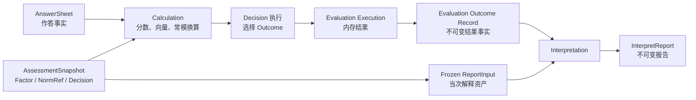
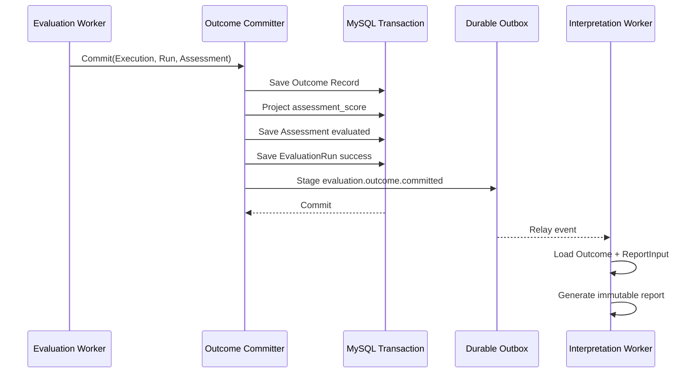

# 核心设计：结果判定、Outcome 与解释边界

> 状态：Decision 配置、Outcome code 注册、Evaluation Outcome 原子提交、纯事实持久化和基于冻结输入的报告生成已经形成主链路；不同模型族对 `OutcomeCode`、`Level` 和区间规则的使用仍不统一，发布校验、运行时路由和解释资产模型也存在明确缺口。本文严格区分当前实现与目标设计。

## 1. 本文回答

本文讨论一次测评怎样从“已经算出的分数”继续形成稳定结果事实，以及 ModelCatalog、Calculation、Evaluation 和 Interpretation 应该怎样划分职责。重点回答：

1. Decision、Conclusion、Outcome、Level、Profile 和 Report 分别是什么；
2. 为什么一个只有 Factor、没有 Decision 的配置不能发布为测评模型；
3. `OutcomeCode` 为什么必须是稳定业务编码，而不能保存中文结论；
4. 风险等级、常模等级、能力等级和人格类型怎样形成不同的 Decision 结果；
5. `DefinitionV2.Outcomes`、Conclusion 内部 `Outcomes` 和 `TypeOutcomeProfile` 当前是什么关系；
6. Calculation 负责执行什么，Evaluation 负责持久化什么，Interpretation 又可以做什么；
7. 为什么 Evaluation Outcome 应保存“结果事实”，而报告文案应来自当次模型发布冻结的解释资产；
8. `Execution`、`Outcome Record`、Assessment 结果摘要和 Interpretation Report 为什么不能混为一个对象；
9. Outcome 提交与 `evaluation.outcome.committed` 事件怎样保证报告链路可靠启动；
10. 当前代码中 `Level`、`OutcomeCode`、标题、结论和建议混用的问题怎样治理。

本文不详细展开：

- Factor 原始分与聚合规则，见 [因子与计分模型](./23-核心设计-因子与计分模型.md)；
- Norm 如何形成 T 分、百分位和标准分，见 [常模资产与校准](./24-核心设计-常模资产与校准.md)；
- Mongo、MySQL、Outbox 和发布快照的物理一致性，后续见 [数据存储与一致性](./26-核心设计-数据存储与一致性.md)；
- Interpretation 的模板、报告生成、重试与展示细节，将在 Interpretation 模块文档中展开。

---

## 2. 30 秒结论

Factor 和 Norm 只能回答“算出了什么分”。一个可执行测评还必须回答：

> 这些分数或因子向量，在当前模型规则下意味着哪个稳定、可追溯的结果？

这就是 Decision 的职责。

```text
AnswerSheet
  不可变作答事实

Factor / Norm
  raw score、T 分、百分位、标准分、因子向量

Decision
  使用发布时冻结的规则选择稳定结果

Evaluation Outcome
  保存本次计算与分类事实

Interpretation
  使用冻结的解释资产，把事实组织成报告
```

最重要的边界是：

> `Decision` 把结构化计算结果判定为稳定 `Outcome`；`Interpretation` 只解释和呈现这个结果，不能反向拥有或重新执行判定规则。

因此，模型中的内容应按下面的责任理解：

| 内容 | 领域性质 | 主要拥有者 |
| --- | --- | --- |
| `ScoreRange`、极点组合、最近模式、特殊判定规则 | 决定“结果是什么”的规则 | ModelCatalog |
| `OutcomeCode`、`LevelCode`、`TypeCode`、因子分和派生分 | 稳定计算/分类事实 | Evaluation Outcome |
| Outcome 标题、总结、详细说明、建议、图片 | 决定“结果怎样解释”的资产 | Interpretation 语义；当前随 ModelCatalog release 冻结 |
| 报告章节、适配器、模板选择 | 报告组织规则 | Interpretation 语义；当前通过 `ReportMap` 随模型冻结 |
| 最终报告实例 | 某次测评的不可变解释产物 | Interpretation |

模型最小发布结构仍然是：

```text
QuestionnaireBinding   必需
ModelIdentity          必需
AlgorithmBinding       必需
Measure / Factor       必需
Calibration / Norm     可选
Decision               必需
InterpretationAssets   按报告需求校验
```

只有 Factor 而没有 Decision 的配置不应发布为测评模型；如果业务只需要收集答案或展示基础分数，应使用独立 Questionnaire，而不是创建一个不完整的 `AssessmentModel`。

`OutcomeCode` 不是报告结论。它是一个短小、稳定、机器可读的业务编码，例如：

```text
none
low
moderate
high
severe
INTJ
low_match
above_average
```

中文标题、结论和建议可以随解释资产调整；同一模型发布中的 `OutcomeCode` 则必须稳定。数据库中的 `level_code` 也只能保存编码，不能保存长中文解释。

---

## 3. 为什么必须单独建模 Decision

### 3.1 分数不是业务结果

同一个数值在不同语境中含义不同：

- 医学量表原始分 30 可能表示中等风险，也可能仍处于正常范围；
- 行为评定 T=65 是否异常，取决于模型使用的判定规则；
- 认知任务正确数 45 可能需要结合年龄常模后再判断能力水平；
- 人格测评不是把一个总分映射为等级，而是根据多个维度的组合形成类型或连续画像。

Calculation 可以产出准确的数字，但不能仅凭数字猜测业务含义。业务含义必须来自被运营审核、随模型发布冻结的 Decision 配置。

### 3.2 Decision 是发布模型的一部分

Decision 与 Factor、Norm 一样影响最终结果。如果运营修改一个分数区间，或者修改人格类型的极点组合，即使问卷和因子算法都没有变化，相同答案也可能得到不同结果。

所以 Decision 必须：

- 在发布前经过结构和语义校验；
- 与 Questionnaire、Factor、Norm 和算法能力保持兼容；
- 进入不可变 `AssessmentSnapshot`；
- 在 Evaluation 中按精确模型版本执行；
- 在 Outcome 中留下实际结果；
- 不能被 Interpretation 的模板或展示代码偷偷替代。

### 3.3 Decision 不等于医学诊断

qs-server 的结果用于给医生判断、治疗观察和随访提供辅助信息，不能也不会形成医学诊断。

因此文档中的“判定”指：

```text
模型规则对测量结果的结构化分类
```

而不是：

```text
系统对患者作出疾病诊断
```

例如 `moderate` 表示量表规则下的中等风险等级；它不是“患者已被诊断为某种疾病”。报告中的措辞也必须保留这一边界。

---

## 4. 先统一术语

当前代码中有多套历史对象和字段。如果不先统一语言，很容易把编码、标签、结论和报告互相替代。

### 4.1 从计算到报告的对象层次

| 层次 | 典型值 | 性质 | 是否应稳定 |
| --- | --- | --- | --- |
| `RawScore` | 18 | 直接测量事实 | 是 |
| `DerivedScore` | T=65、P=93 | 常模派生事实 | 是 |
| `DecisionKind` | `score_range`、`pole_composition` | 判定机制身份 | 是，随 release 冻结 |
| `OutcomeCode` | `moderate`、`INTJ` | Decision 选择的稳定结果编码 | 是 |
| `LevelCode` | `moderate`、`above_average` | 有序等级编码 | 是 |
| `Profile facts` | 类型 code、极点偏好、匹配度、特质向量 | 非简单等级的分类事实 | 是 |
| `Title / Label` | “中等风险” | 短展示文案 | 可随新 release 调整 |
| `Summary / Description` | 结果说明 | 解释资产 | 可随新 release 调整 |
| `Suggestion` | 干预或关注建议 | 解释资产 | 可随新 release 调整 |
| `Report` | 面向医生/患者的完整报告 | 某次解释产物 | 生成后不可变 |

### 4.2 Decision

Decision 是“怎样从测量结果选择结果”的规则集合。它可以是：

- 一个分数落在哪个区间；
- 多个极点组合成哪种人格类型；
- 与哪个已知模式最接近；
- 哪个因子占主导；
- 常模派生分处于哪个等级；
- 认知任务表现处于哪个能力层级；
- 某些特殊答案是否触发特殊结果。

### 4.3 Conclusion

当前 `DefinitionV2.Conclusions` 是 Decision 配置的物理承载结构，包含：

- `RiskConclusion`；
- `NormConclusion`；
- `AbilityConclusion`；
- `TypeConclusion`。

“Conclusion” 这个名字容易让人误以为它只保存报告结论。实际上它同时混合了：

- 判定输入与规则；
- 输出 code；
- 展示标题；
- 总结和说明；
- 人格 profile 文案。

因此本文在领域语言中把“判定规则”统一称为 Decision，把当前 Go 类型 `Conclusion` 视为历史物理结构。

### 4.4 Outcome

Outcome 是 Decision 选中的稳定结果。它不是某一段中文，也不一定只有一个等级。

不同模型族的 Outcome 形态不同：

| 模型 | Outcome 形态 |
| --- | --- |
| 医学量表 | 风险等级 code，可能同时包含各因子等级 |
| 行为评定 | 基于 T 分等派生分形成的等级 code |
| 认知任务 | 能力层级 code 与各维度表现 |
| 类型人格 | 类型 code、匹配度、极点偏好和特殊触发事实 |
| 连续特质人格 | 多维特质向量，未必有唯一单值 OutcomeCode |

### 4.5 Level

Level 是 Outcome 的一种常见表达，适用于有序等级：

```text
none < low < moderate < high < severe
```

但 Level 不能代表所有 Outcome：

- `INTJ` 与 `ENFP` 是类别，不是高低等级；
- 大五人格的多个连续特质也不能压缩成一个 Level；
- 特殊结果 `low_match` 可能是分类状态，不是严重度。

所以不能把 Outcome 领域模型永远简化为 `level_code + level_label`。

### 4.6 Interpretation

Interpretation 接收已经确定的 Outcome 事实和冻结解释输入，负责：

- 把 code 映射为标题和解释；
- 组织总体结论与维度说明；
- 生成建议；
- 选择报告 builder、adapter 和 template；
- 产出不可变报告实例。

Interpretation 不应：

- 重新计算题分或因子分；
- 重新查常模并改变派生分；
- 根据报告模板重新决定 OutcomeCode；
- 因为缺少解释文案而静默改变等级；
- 回写或覆盖 canonical Evaluation Outcome。

---

## 5. 模块责任边界



| 模块 | 负责 | 不负责 |
| --- | --- | --- |
| ModelCatalog | 维护 Factor、NormRef、Decision、Outcome registry 与随发布冻结的解释配置 | 执行一次测评、保存某次结果 |
| Calculation | 无状态执行聚合、校准和分类算法 | 选择模型版本、持久化 Outcome、生成报告 |
| Evaluation | 读取精确模型、选择能力、组织输入、保存运行与结果事实 | 拥有模型定义、编辑报告文案 |
| Interpretation | 消费 Outcome 事实与冻结解释输入，生成报告 | 重新决定 Outcome 或更改 Evaluation 事实 |

这里有一个容易误解的物理事实：当前解释文案仍存放在 `DefinitionV2.Conclusions`、顶层 `Outcomes` 和 `ReportMap` 中，因此物理上属于 ModelCatalog snapshot；但从领域责任看，它们是 Interpretation-oriented assets。

当前不立即引入独立 `InterpretationDefinition`，原因是：

- 模型发布与解释资产天然需要一致版本；
- 过早拆成独立资产会引入跨聚合版本协调；
- 还需要解决联合审核、联合发布和历史精确引用；
- 当前随 `AssessmentSnapshot` 一起冻结，已经能保护历史报告语义。

因此当前最合适的边界是：

> 逻辑上分离 Decision facts 与 Interpretation assets，物理上暂时随同一个模型 release 冻结。

---

## 6. 当前 `DefinitionV2` 中的结果结构

### 6.1 顶层 Outcome registry

`DefinitionV2.Outcomes` 当前保存：

```go
type Outcome struct {
    Code        string
    Title       string
    Summary     string
    Description string
}
```

其中真正具有 Decision 身份意义的是 `Code`。其他字段属于解释或展示资产。

顶层 registry 的作用是：

- 集中声明模型允许产生哪些稳定 code；
- 让不同 Decision 规则通过 code 引用结果；
- 避免规则直接以内嵌文案作为身份；
- 为发布校验提供引用完整性基础；
- 让 Interpretation 可以使用 code 查找冻结解释。

当前 Definition 校验已经保证：

- Outcome code 非空；
- 顶层 code 不重复；
- Conclusion rule、人格特殊规则和 Profile 引用的 `OutcomeCode` 必须出现在顶层 registry。

### 6.2 Conclusion 内部 `Outcomes`

`RiskConclusion`、`NormConclusion`、`AbilityConclusion` 和 `TypeConclusion` 仍分别保留 `Outcomes` 字段。这形成了两份潜在结果表：

```text
DefinitionV2.Outcomes
Conclusion.Outcomes
```

但当前通用校验以 `DefinitionV2.Outcomes` 为引用真相。只在 Conclusion 内声明 Outcome，不能满足发布引用校验。

目标边界应明确：

- 顶层 `DefinitionV2.Outcomes` 是 canonical registry；
- Conclusion 内的 `Outcomes` 是兼容结构，应逐步停止作为独立真相；
- 所有 Decision 规则只引用顶层 code；
- 同一个 code 的展示资产不应在多个位置重复维护。

### 6.3 `ScoreRangeOutcome` 的当前混合结构

```go
type ScoreRangeOutcome struct {
    MinScore    float64
    MaxScore    float64
    Level       string
    OutcomeCode string
    Title       string
    Summary     string
    Description string
}
```

这个结构同时承载：

- 区间条件；
- 等级编码；
- Outcome 引用；
- 标题、总结与说明。

它方便兼容旧 payload，但没有形成清晰的 canonical contract。当前各执行路径的读取方式也不一致：

| 路径 | 当前主要读取 | 当前忽略或弱化 |
| --- | --- | --- |
| scale risk | 主要把 `OutcomeCode` 作为风险 code；空时兼容回退 `Title` | `Level` 没有成为统一真相 |
| norm | 主要把 `Level` 作为结果 code | `OutcomeCode` 没有进入统一运行时结果 |
| cognitive ability | 主要把 `Level` 作为能力 code，`Title` 作为 label | `OutcomeCode`、Summary、Description 未完整消费 |
| typology | 使用独立的 type Decision、Profile 和 `OutcomeCode` | 不使用通用 score range 结构 |

这意味着相同字段名在不同模型族中并不具有完全相同的运行语义。本文把它列为当前最重要的模型统一性问题之一。

### 6.4 TypeOutcomeProfile 的混合职责

人格类型 Profile 当前同时包含：

- 稳定事实：`OutcomeCode`、Pattern、特殊结果标记；
- 展示资产：traits、strengths、weaknesses、suggestions、image、rarity、commentary。

正确的概念拆分应是：

```text
Type Decision facts
  OutcomeCode / TypeCode
  Pattern
  MatchPercent / Similarity
  SpecialTrigger / IsSpecial
  Dimension preference / strength

Type Interpretation assets
  Name
  Summary
  Traits
  Strengths / Weaknesses
  Suggestions
  Image / Rarity / Commentary
```

当前代码已经在 Outcome schema v2 的持久化阶段执行了这一拆分：只保存分类事实，把展示资产留在冻结 `ReportInput` 中。

---

## 7. 四类主要结果判定

### 7.1 医学量表：风险区间判定

典型链路是：

```text
题目基础分
  -> 因子 raw score
  -> RiskConclusion.ScoreRange
  -> OutcomeCode / LevelCode
```

例如：

```yaml
factor_code: total
rules:
  - min_score: 0
    max_score: 20
    outcome_code: none
  - min_score: 20
    max_score: 40
    outcome_code: low
  - min_score: 40
    max_score: 60
    outcome_code: moderate
```

理想结果应保留：

- total raw score；
- 命中的 `OutcomeCode`；
- 各子因子分和各自等级；
- 实际模型 code/version；
- 运行时 DecisionKind。

当前 scale 计算使用左闭右开区间：

```text
score >= min && score < max
```

但当前存在兼容兜底：

- 某因子没有命中规则时，可以按绝对分数使用硬编码风险区间；
- 总因子未命中时，可能从子因子中选择最高风险；
- `OutcomeCode` 缺失时，历史适配逻辑可能回退到 `Title`。

这些行为保护了旧模型运行，却不应成为目标领域语义。任意医学量表不能共享一套无配置的绝对分数阈值。目标应是：

> 发布时保证必要风险规则完整；运行时规则缺失或未命中时产生明确配置错误，而不是制造看似合理的医学辅助结果。

### 7.2 行为评定：常模派生分判定

典型链路是：

```text
factor raw score
  -> Norm calibration
  -> TScore / Percentile / StandardScore
  -> NormConclusion
  -> Level / Outcome
```

`NormConclusion.ScoreBasis` 明确规则使用哪一种分数：

- `raw_score`；
- `t_score`；
- `percentile`；
- `standard_score`。

当前常模运行时主要把 `ScoreRangeOutcome.Level` 作为结果 code，并把解释文案暂时附加在内存计算结果中。Evaluation Outcome schema v2 会剥离这些展示文案，而 Interpretation 再从冻结规则恢复结论与建议。

这里的目标统一规则应是：

```text
rule.OutcomeCode  引用 canonical Outcome registry
rule.LevelCode    可选，表达有序等级
OutcomeCode       不能由 Title/Summary 推导
```

如果业务上的 Outcome 与 Level 相同，可以让两者使用相同 code，但字段语义仍应明确。

### 7.3 认知任务：能力层级判定

认知任务先形成正确率、总分或任务表现，再按 `AbilityConclusion.ScoreBasis` 选择 raw 或派生分并匹配区间。

当前 ability projection：

- 使用包含端点的 `MinScore <= score <= MaxScore`；
- 命中后把 `Level` 写入维度等级 code；
- 把 `Title` 写入 label；
- 尚未完整提升为报告级主 Outcome；
- `OutcomeCode`、Summary、Description 没有进入统一事实链路。

因此“有 AbilityConclusion 配置”不等于“认知 Outcome 已完整闭环”。目标应补齐：

- 明确主能力维度或总体结果；
- 使用统一 Outcome 引用；
- 统一边界语义；
- 在 Evaluation Record 中保留能力判定事实；
- 让 Interpretation 只负责解释已确定的能力 code。

### 7.4 人格类型：组合或模式判定

人格测评的 Decision 不是简单区间。当前支持的 `DecisionKind` 包括：

- `pole_composition`：极点组合；
- `trait_profile`：连续特质画像；
- `nearest_pattern`：最近模式；
- `dominant_factor`：主导因子。

类型判定还可以在多个阶段运行特殊规则：

- 计分前根据特定答案直接选择特殊 Outcome；
- Decision 前执行回退规则；
- Decision 后根据匹配阈值改写为低匹配结果。

类型人格的稳定事实包括：

- `TypeCode / OutcomeCode`；
- pattern；
- match percent / similarity；
- 是否特殊结果以及触发原因；
- 每个极点的 preference 与 strength。

而类型名称、人格说明、优势、风险点、建议、图片不属于分类事实。

连续特质模型需要特别处理：它的结果可能是一组维度分数，而不是唯一类型 code。统一 Outcome 模型必须允许：

```text
single classification outcome
或
multi-dimensional profile facts
```

不能为了统一数据库字段，强行给每个特质画像制造一个总等级。

---

## 8. ScoreRange 的边界语义

### 8.1 当前语义并不统一

当前不同执行路径分别使用：

- scale：左闭右开 `[min, max)`；
- norm：包含两端 `[min, max]`；
- ability：包含两端 `[min, max]`。

如果配置相邻区间：

```text
[0, 60]
[60, 100]
```

在包含两端的实现中，60 同时命中两条，实际结果由规则顺序决定。这是隐式优先级，而不是清晰业务规则。

### 8.2 当前发布校验不足

`definition.Validate` 当前只检查：

- `MinScore <= MaxScore`；
- Factor 引用存在；
- 非空 OutcomeCode 引用了顶层 registry；
- ScoreBasis 合法。

它还没有统一检查：

- 区间是否重叠；
- 区间之间是否有空洞；
- 最大/最小边界是否覆盖可达分数；
- 相邻边界属于前一段还是后一段；
- 是否存在两个规则同时命中；
- 是否每个规则都必须给出 OutcomeCode；
- 是否存在且仅存在一个主结论；
- Decision 使用的 ScoreBasis 是否真的可以由 Factor/Norm 产生。

### 8.3 目标契约

建议统一成显式的半开区间：

```text
[min, max)
```

最后一段可以通过显式 `max_inclusive=true`，或者使用无上界表达。无论采用哪一种，必须满足：

- 边界语义由模型契约定义，不由执行器各自决定；
- 发布时拒绝重叠；
- 是否允许空洞必须显式声明；
- 不允许依赖数组顺序解决冲突；
- 运行时 0 或 2 条规则命中都视为可定位的配置错误；
- golden cases 必须覆盖临界值。

---

## 9. OutcomeCode、LevelCode 与展示文案

### 9.1 Code 是业务身份，不是显示文本

稳定 code 应满足：

- 短小；
- 机器可读；
- 在同一模型语义中唯一；
- 不包含会频繁修改的中文文案；
- 不依赖前端本地化；
- 可以用于趋势统计、查询和规则引用。

正确示例：

```text
moderate
severe
INTJ
low_match
above_average
```

错误示例：

```text
“执行功能存在中度异常，建议结合临床表现继续观察”
```

### 9.2 `OutcomeCode` 与 `LevelCode` 的关系

二者可以相同，但不是同一个概念：

| 字段 | 回答的问题 |
| --- | --- |
| `OutcomeCode` | Decision 最终选择了哪个业务结果 |
| `LevelCode` | 这个结果在某个有序等级体系中位于哪一级 |

例如：

```text
OutcomeCode = low_match
LevelCode   = inconclusive
```

或者：

```text
OutcomeCode = moderate
LevelCode   = moderate
```

人格类型 `INTJ` 可以只有 OutcomeCode，没有严重度 LevelCode。

### 9.3 为什么数据库字段长度问题本质上是领域边界问题

项目曾出现长中文结论被写入 Assessment 的 `level_code`，触发 MySQL 字段长度错误。正确修复不是扩大 code 列，而是恢复语义：

```text
level_code  = moderate
level_label = 中度风险或相应显示结论
```

这说明数据库约束在保护一个正确设计：

- code 是短身份；
- label 是展示摘要；
- 完整说明属于 Interpretation Report；
- 不应该用一个字段同时承担三种职责。

### 9.4 历史趋势应比较 code 与数值

患者级趋势比较应优先使用：

- 同 FactorCode 的 raw/derived score；
- 同一可比模型语义下的 LevelCode；
- 精确 model version 与 NormReference；
- 必要时保留各版本解释文案用于展示。

趋势不能依赖中文 label 作为分组键。文案修订不应把同一个稳定等级拆成两条趋势。

---

## 10. DecisionKind 与运行时执行路由

### 10.1 发布时推导

当前 `AssessmentModel.DecisionKindForDefinition()` 按模型语义推导：

| Kind | 当前 DecisionKind 规则 |
| --- | --- |
| scale | `score_range` |
| behavioral_rating | 有 NormRef/NormConclusion 时为 `norm_lookup`，否则 `score_range`；常模模型要求主 NormConclusion |
| cognitive | `ability_level` |
| typology | 必须从 TypeConclusion 显式取得分类 DecisionKind |

发布处理器把推导结果保存到 `AssessmentSnapshot.DecisionKind`。这是正确方向：DecisionKind 属于已发布执行契约，而不是某次请求临时猜测。

### 10.2 当前运行时尚未完全以快照为准

当前 Evaluation 的 `ModelRouteFromInput` 主要从输入 payload 中提取显式人格 DecisionKind；其他模型经常只携带模型 identity，再由路由层按 Kind/Algorithm 推导默认执行家族与 DecisionKind。

结果是：

- 快照中虽然已有 DecisionKind，运行时并未对所有模型统一消费；
- identity 推导与发布时推导存在形成两套真相的风险；
- 不兼容的运行时 DecisionKind 可能被 family 默认值覆盖；
- 新模型扩展可能发布成功，却因运行时重推导走到另一条路径。

目标设计应是：

```text
发布阶段
  ModelIdentity + Definition
    -> 校验兼容矩阵
    -> 冻结 AlgorithmFamily
    -> 冻结 Algorithm
    -> 冻结 DecisionKind
    -> 冻结 ExecutionSpec

运行阶段
  只读取 snapshot 中的确定执行身份
  不再次根据 Kind 猜测
```

兼容推导只能用于读取旧 snapshot，不应继续成为新发布模型的运行真相。

---

## 11. Evaluation Execution 与 Outcome Record

### 11.1 Execution 是运行中的内存结果

`domain/evaluation/outcome.Execution` 是 Evaluator 返回的 canonical 内存对象，包含：

- `ModelRef`；
- `Summary`；
- `Detail`；
- `Primary`；
- `Level`；
- `Profile`；
- `Dimensions`；
- `Validity`。

它在运行过程中仍可被 projection 补充，不是最终持久化事实。

### 11.2 Record 是提交成功后的不可变事实

`domain/evaluation/outcome.Record` 只有在 Evaluation commit 成功时创建，保存：

- Outcome ID；
- org、Assessment、testee、EvaluationRun 身份；
- 精确模型 Kind/SubKind/Algorithm/code/version；
- `AlgorithmFamily`、`DecisionKind`、`PayloadFormat`；
- 输入快照引用；
- `ReportInput`；
- 版本化 Outcome payload；
- schema version；
- evaluated time。

二者的边界是：

```text
Execution
  运行中可组装
  允许包含方便当前流程使用的 label/prose

Record
  成功提交后不可变
  保存可重放、可审计的结果事实
```

### 11.3 一次 Assessment 只有一个 canonical Outcome

MySQL `evaluation_outcome` 当前对 `assessment_id` 和 `evaluation_run_id` 都有唯一约束。它表达：

- 一个 Assessment 最终只有一个 canonical 成功结果；
- 同一个 EvaluationRun 不能重复生成多份 canonical Outcome；
- 自动重试必须围绕同一业务执行状态治理，不能静默制造多个互相冲突的结果。

报告与 Outcome 不同：一个 Outcome 理论上可以生成不同 report type 或 template version 的报告，但这些报告都不能改变它的计算事实。

---

## 12. Outcome schema v2：只持久化结果事实

### 12.1 为什么要剥离展示文案

如果 Outcome payload 同时保存分数事实和所有报告文案，会带来：

- Evaluation 与 Interpretation 强耦合；
- 修改报告文案必须改变 Evaluation schema；
- code、label、description 容易再次混用；
- 人格 Profile 大量展示字段进入核心结果表；
- 无法明确回答“这是计算出来的，还是展示时拼出来的”。

当前 `MarshalRecordV2` 已主动构造纯事实表示，并移除：

- `Summary` 与 tags；
- Model title；
- score label；
- level label；
- profile name 与 traits 文案；
- dimension name、极点展示名和 model 文案；
- validity label/message；
- 人格报告中的 strengths、weaknesses、suggestions 等展示内容。

### 12.2 人格结果的纯事实投影

人格类型 detail 在 v2 中归一为：

```text
TypeCode
Pattern
MatchPercent
Similarity
SpecialTrigger
IsSpecial
```

维度保留：

```text
DimensionCode
RawScore
Preference
Strength
LevelCode（如有）
```

这意味着未来即使修改类型名称、描述、建议或图片，历史 Outcome 事实仍然稳定。

### 12.3 当前仍缺少统一的 OutcomeCode 字段

虽然 v2 已经剥离文案，但不同模型族的主结果仍分散在：

- scale/norm/ability：`Execution.Level.Code` 或 dimension level；
- type personality：`Profile.Code`、classification `TypeCode`，同时可能也映射到 Level；
- trait profile：dimension vector；
- Summary：运行时投影字段，不进入 v2 canonical payload。

因此当前没有一个适用于所有模型族的单一 `OutcomeCode` 字段。目标模型可以显式区分：

```text
DecisionResult
├── OutcomeCode?        单值分类结果，可选
├── LevelCode?          有序等级，可选
├── PrimaryScore?       主数值，可选
├── ProfileFacts?       类型或连续画像，可选
├── Dimensions[]        维度事实
├── Validity[]          有效性事实
└── EvidenceRefs        模型、常模、输入与运行身份
```

这里的 `?` 很重要：不是每种测评都必须伪造单值结果。

---

## 13. 纯事实 payload 与冻结 ReportInput 双通道

### 13.1 为什么纯事实还不够生成历史报告

只保存 `moderate`、T=65 或 `INTJ`，可以证明 Decision 结果，但不能回答：

- 当时这个 code 的中文名称是什么；
- 当时运营配置了怎样的结论和建议；
- 当时某个人格类型有哪些 strengths/weaknesses；
- 当时报告应展示哪些因子；
- 当时使用哪个 adapter/template。

如果报告生成时重新读取当前 active 模型，新发布的文案可能污染历史结果。

### 13.2 当前实现

Evaluation commit 会把本次 `InputSnapshot.ModelPayload` 序列化为 `Record.ReportInput`。于是一个 Outcome Record 同时拥有：

```text
Payload
  纯计算与分类事实

ReportInput
  本次精确模型解析得到的冻结解释输入
```

Interpretation 从 Outcome Record 读取两者：

- 从 payload 读取事实；
- 从 ReportInput 读取当次模型的解释资产；
- 使用 code 将两者连接；
- 不重新查询最新 active 模型。

### 13.3 这套设计解决的问题

- 新版本解释文案不会改变历史报告；
- 异步报告生成不依赖当前 active release；
- 报告失败后重试仍使用原始结果和原始解释资产；
- Outcome 可以保持纯事实；
- Interpretation 可以独立演进报告构建逻辑。

### 13.4 当前代价与后续优化

当前 `ReportInput` 保存的是完整 ModelPayload，而不是专门裁剪的 `InterpretationAssetsSnapshot`。它的优点是实现直接、历史信息充分；代价是：

- Outcome Record 与 ModelPayload schema 耦合；
- 保存了报告实际不需要的内容；
- 同一模型的大 payload 会在多次 Outcome 中重复；
- 解释资产边界仍然不够显式；
- payload converter 的兼容逻辑会进入报告重放链路。

未来可以演进为：

```text
ReportInput
  ModelRef
  DecisionKind
  OutcomeRegistry snapshot
  Factor display metadata
  Interpretation profiles
  ReportMap / ReportSpec
  AssetSchemaVersion
```

但在引入稳定的解释资产 schema 和精确引用仓储前，不能仅为了节省存储删除当前冻结输入。

---

## 14. Assessment 摘要、Outcome 与 Report 的区别

### 14.1 Assessment 结果摘要

Assessment 聚合需要支持状态查询、列表和趋势入口，因此 Evaluation commit 会投影最小摘要：

- result summary；
- primary score；
- level code/label/severity；
- evaluated status/time。

`assessment_score` 也保存面向查询和统计的分数投影，并关联 `evaluation_outcome_id`。

这些对象是 read/query projection，不是 canonical rich Outcome。

### 14.2 Evaluation Outcome

Outcome 回答：

> 这次精确模型执行，实际算出了什么、判定成了什么？

它必须可审计、可重放、不可被报告模板修改。

### 14.3 Interpretation Report

Report 回答：

> 应该怎样把这次结果组织成医生、患者或家长可理解的说明？

它可以包含：

- 标题与结论；
- 维度说明；
- 风险提示；
- 建议；
- 人格画像；
- 报告模板和展示结构。

### 14.4 三层对象不能互相替代

| 对象 | 优化目标 | 是否 canonical 结果 | 是否包含完整解释 |
| --- | --- | --- | --- |
| Assessment summary | 查询和列表效率 | 否，是投影 | 否 |
| Evaluation Outcome Record | 结果正确性、审计与重放 | 是 | 不保存展示文案，另带冻结 ReportInput |
| Interpretation Report | 阅读和业务使用 | 否，是解释产物 | 是 |

如果列表接口只需要 LevelCode，不应该反序列化完整报告；如果报告要重建，也不应该根据 Assessment 的短摘要推测全部事实。

---

## 15. Outcome 的可靠提交与事件边界

### 15.1 一个成功 Evaluation 的事务内容

当前 Outcome committer 在同一事务中完成：

1. 创建并保存不可变 Outcome Record；
2. 投影 `assessment_score`；
3. 保存 Assessment 的 evaluated 状态与结果摘要；
4. 保存 EvaluationRun success；
5. 写入 durable outbox 事件 `evaluation.outcome.committed`。

只有全部成功，调用方持有的 Assessment/Run 内存状态才切换到成功。



### 15.2 事件只传身份，不传完整结果

`evaluation.outcome.committed` 事件主要携带：

- organization；
- assessment；
- testee；
- outcome ID；
- run ID；
- committed time。

事件消费者根据 Outcome ID 读取 canonical Record，而不是相信事件中复制的一份分数或文案。这样避免：

- 事件 payload 与数据库结果不一致；
- 大结果进入消息系统；
- 重试时使用过时副本；
- 多处定义 Outcome schema。

### 15.3 Outcome 成功不等于报告已经生成

事务提交后：

- Evaluation Outcome 已经成立；
- Assessment 已进入 evaluated；
- 报告生成已被可靠触发；
- Interpretation 可能仍在执行、重试或等待人工处理。

因此面向用户的状态不应只使用一个模糊的“成功”：

```text
accepted
  AnswerSheet + submission outbox 已持久化

evaluated
  Outcome 已提交

interpreted / report_ready
  报告已生成
```

即使报告暂时失败，也不能回滚或覆盖已经成立的 Evaluation Outcome。

---

## 16. Interpretation 如何消费 Outcome

### 16.1 输入必须只读

InterpretationInput 是只读视图。它可以关联 Assessment、testee、模型和 Outcome，但这种关联不授予它修改 Assessment 结果的权限。

基本流程是：

```text
Outcome Record
  -> 解码 schema v2 facts
  -> 解码 frozen ReportInput
  -> 组装 InterpretationInput
  -> 选择 report builder
  -> 创建不可变 InterpretReport
```

### 16.2 报告路由

当前报告路由主要考虑：

- `AlgorithmFamily`；
- `DecisionKind`；
- `ReportType`；
- `TemplateVersion`；
- 部分人格模型还使用 adapter/template/category 配置。

当前已有：

- factor scoring report builder；
- norm profile builder；
- task performance builder；
- personality type builder；
- trait profile builder。

其中 norm/task performance 的部分构建仍复用通用 factor-scoring 组装，说明运行机制已经分开，但报告语义还未完全专业化。

### 16.3 历史解释恢复

Norm 报告会使用冻结 TScore rules 恢复：

- code 对应的 label；
- conclusion；
- suggestion。

人格报告会使用冻结 Profile 按 `TypeCode` 查找：

- 类型名称；
- 总结；
- strengths/weaknesses；
- suggestions；
- 其他展示资产。

如果 Outcome code 在冻结输入中找不到，对人格路径而言应明确失败，而不是使用最新模型或随便选择一个 Profile。

### 16.4 当前解释兜底

scale Interpretation 当前在没有命中解释规则时，可以：

- 回退到最后一条规则；
- 或根据风险等级生成通用结论与建议。

这同样属于兼容行为。它不会改变 Outcome code，但可能掩盖解释资产不完整，使报告看起来“成功”。

目标应按模型用途区分：

- 对要求正式报告的模型，发布时校验所有可达 Outcome 都有解释资产；
- 对仅内部测试或只展示数值的模型，显式声明无需完整解释；
- 运行时 fallback 必须可观测，并逐步退出正式医学量表路径；
- 不能让通用文案暗示医学诊断。

---

## 17. ReportMap 的边界

### 17.1 当前结构

`DefinitionV2.ReportMap.Sections` 可以保存：

- section code/title；
- source refs；
- section kind；
- adapter key；
- template ID；
- category label。

scale payload 当前用 `factor_scores` section 表达哪些因子分可在报告中展示；typology payload 用 ReportMap 往返转换报告 kind、adapter、template 和 category。

### 17.2 它为什么属于 Interpretation 语义

ReportMap 不改变：

- 题目得分；
- 因子分；
- 常模派生分；
- OutcomeCode；
- LevelCode；
- 人格类型分类结果。

它只决定报告如何组织这些事实。因此它在领域职责上属于 Interpretation-oriented assets。

### 17.3 当前实现程度

目前 ReportMap 的通用校验只保证 section code 非空且不重复。还没有统一保证：

- `SourceRefs` 都指向存在且允许展示的 Factor；
- adapter key 已注册；
- template ID 存在；
- report kind 与 DecisionKind 兼容；
- 每个模型 family 的必需 section 完整；
- template version 随模型发布明确冻结。

当前 Interpretation 默认模板版本仍以 `v1` 为主，ModelCatalog 尚未对通用报告模板版本形成完整发布契约。人格路径的 TemplateID/AdapterKey 配置更成熟，但不能据此认为所有 `ReportMap` 字段都已端到端消费。

### 17.4 目标边界

```text
Decision
  产生哪些事实

ReportMap
  选择哪些事实进入哪些报告章节

Template / Builder
  怎样渲染章节
```

ReportMap 不能包含改变 Outcome 的表达式，也不能在 source 缺失时重新计算结果。

---

## 18. 发布与版本语义

### 18.1 新发布不能改变历史 Outcome

一次 Assessment 执行必须冻结：

- Questionnaire code/version；
- AssessmentModel code/version；
- Algorithm/AlgorithmFamily/DecisionKind；
- Factor、NormRef 与 Decision；
- 当次报告解释输入。

运营发布新版本后：

- 新 Assessment 使用新 release；
- 已受理 Assessment 继续使用已经冻结的精确模型版本；
- 已完成 Outcome 不重新计算；
- 历史报告不读取新文案；
- 如需纠错重算，必须走显式治理流程并保留审计，而不是后台静默覆盖。

### 18.2 修改不同内容意味着什么版本变化

| 修改 | 是否需要新模型 release | 是否改变历史 Outcome |
| --- | --- | --- |
| 修改 Decision 区间 | 是 | 否 |
| 修改 OutcomeCode | 是，且需迁移/兼容评估 | 否 |
| 修改标题、结论、建议 | 是，因为当前解释资产随模型冻结 | 否 |
| 修改 ReportMap | 是 | 否 |
| 更新 Norm 数据 | 先产生新 Norm version，再发布新 model release | 否 |
| 只重构 Calculation 且语义不变 | 不一定 | 否 |
| Calculation 语义改变 | 新 Algorithm 标识或显式版本治理 + 新 release | 否 |

### 18.3 OutcomeCode 的兼容策略

对已发布并进入统计或趋势的 code：

- 优先保持不变；
- 修改显示文案不改 code；
- 合并、拆分或重命名 code 必须作为业务 schema 变化评估；
- 新旧 code 的可比关系应显式记录，不能靠中文相似度推断；
- 历史记录永远保留原 code 与 model version。

---

## 19. 失败、重试与人工补偿

### 19.1 Decision 失败是 Evaluation 失败

下面问题发生在 Outcome commit 之前，属于 Evaluation 失败：

- Decision 配置无法解析；
- 引用的 Factor 不存在；
- 必需 Norm 未命中；
- 区间 0 条或多条命中且没有显式语义；
- OutcomeCode 不在发布 registry；
- 分类结果缺少对应 Profile；
- 执行器与发布 DecisionKind 不兼容。

失败不应持久化一个伪造的成功 Outcome。

### 19.2 Interpretation 失败不改变 Outcome

下面问题发生在 Outcome commit 之后，属于 Interpretation 失败：

- 冻结 ReportInput 无法解码；
- OutcomeCode 找不到解释资产；
- report builder/adapter 未注册；
- template 不存在；
- 报告仓储暂时不可用。

此时：

- Outcome 仍然有效；
- Assessment 的计算事实不能被回滚；
- 解释任务应按重试策略重试；
- 非可重试问题进入 manual required；
- 管理员修复后可以强制重试，但需要明确确认、原因和审计结果。

### 19.3 可观测性需要按阶段区分

至少需要能够查询：

```text
AnswerSheet accepted?
Assessment created?
EvaluationRun running/failed/succeeded?
Outcome committed?
Report generation running/failed/succeeded?
Failure retryable?
Manual action required?
```

不能只用一个“测评失败”掩盖真正停在哪一步。

---

## 20. 当前模型族支持矩阵

| 能力 | scale | behavioral_rating | cognitive | typology |
| --- | --- | --- | --- | --- |
| Factor facts | 已实现 | 已实现 | 已实现 | 已实现 |
| Norm derived scores | 模型结构可表达，主链路未接入 | 已实现 | 部分实现/未完整闭环 | 不适用 |
| DecisionKind 发布推导 | 已实现 | 已实现 | 已实现 | 已实现 |
| DecisionKind 运行时完全以 snapshot 为准 | 待治理 | 待治理 | 待治理 | 部分实现 |
| 统一 OutcomeCode registry 引用 | 部分实现 | 部分实现 | 部分实现 | 已用于 Profile/特殊规则 |
| 区间边界统一 | 未实现 | 未实现 | 未实现 | 不适用 |
| 主 Outcome 完整投影 | 已实现但有兼容 fallback | 已实现但 Level/OutcomeCode 语义待统一 | **待补齐** | 类型已实现；trait 为多维事实 |
| Outcome schema v2 纯事实 | 已实现 | 已实现 | 已实现 | 已实现 |
| Frozen ReportInput | 已实现 | 已实现 | 已实现 | 已实现 |
| 专用 Interpretation builder | factor scoring | norm profile 仍有通用复用 | task performance 仍有通用复用 | personality type / trait profile |
| ReportMap 端到端校验 | 部分 | 部分 | 部分 | 部分，适配器路径更完整 |

“部分实现”不意味着不可用，而是说明当前功能依赖兼容适配或缺少统一发布门禁，不能把它描述成已经完成的通用平台能力。

---

## 21. 当前不足与风险

### 21.1 `OutcomeCode` 与 `Level` 多套真相

风险：相同 `ScoreRangeOutcome` 在 scale、norm、ability 中读取不同字段，运营很难知道哪个字段真正生效。

目标：定义统一 DecisionResult contract；新发布只允许一种 canonical code 引用方式。

### 21.2 区间重叠、空洞和端点没有统一校验

风险：临界分由数组顺序或不同 evaluator 的实现细节决定。

目标：统一区间类型、发布门禁和 golden boundary cases。

### 21.3 scale 默认风险判定可能掩盖配置错误

风险：不同量表被套用相同绝对分数阈值，产生看似正常、实际无依据的医学辅助结果。

目标：正式发布模型必须有完整 Decision；fallback 只保留在显式兼容模式并可观测。

### 21.4 ability 主 Outcome 尚未完整形成

风险：维度命中了能力等级，但报告级 Level/Summary 没有稳定事实来源。

目标：明确 primary ability dimension 或 overall Decision，并完整投影。

### 21.5 发布 DecisionKind 没有完全进入运行时

风险：发布验证与实际执行使用不同推导逻辑。

目标：快照冻结并直接提供 AlgorithmFamily + DecisionKind；运行时不重推导。

### 21.6 解释资产仍混在 Conclusion/Profile 中

风险：Decision 结构难理解，转换器容易把文案当 code，ModelCatalog 与 Interpretation schema 紧耦合。

目标：先在 Definition 内逻辑拆分 `DecisionSpec` 与 `InterpretationAssets`，暂不急于拆独立聚合。

### 21.7 完整 ModelPayload 被复制为 ReportInput

风险：存储重复、schema 耦合、历史兼容负担扩大。

目标：在不损害历史冻结语义的前提下，设计版本化最小解释输入。

### 21.8 ReportMap 的通用校验和消费不完整

风险：配置字段看起来可用，但某些 family 实际不读取；错误到报告生成阶段才暴露。

目标：按 report profile 注册 handler，发布时校验 SourceRefs、adapter、template 与 DecisionKind。

### 21.9 Interpretation 通用文案 fallback 掩盖资产缺失

风险：配置错误被包装成正常报告，且通用建议可能不适合具体量表。

目标：把 fallback 使用纳入指标与日志，对正式模型逐步改为发布失败或明确报告失败。

---

## 22. 目标领域结构

下面是目标概念结构，不是当前 Go 类型的逐字映射：

```text
DefinitionV2
├── Measure
│   └── Factors / Scoring
├── Calibration
│   └── NormRefs
├── DecisionSpec
│   ├── Kind
│   ├── InputBasis
│   ├── Rules / Poles / Patterns / SpecialRules
│   └── OutcomeRefs
├── OutcomeRegistry
│   └── Code + optional Level semantics
└── InterpretationAssets
    ├── OutcomePresentation
    │   └── Code + Title + Summary + Description + Suggestions
    ├── TypeProfiles
    └── ReportMap / ReportSpec
```

运行结果结构：

```text
EvaluationOutcome
├── ModelIdentity
├── RuntimeIdentity
├── DecisionResult
│   ├── OutcomeCode?
│   ├── LevelCode?
│   ├── PrimaryScore?
│   ├── ProfileFacts?
│   ├── Dimensions[]
│   └── Validity[]
├── NormEvidence[]
├── InputSnapshotRef
├── FactSchemaVersion
└── FrozenInterpretationInput
```

报告结构：

```text
InterpretReport
├── OutcomeID
├── ReportType
├── TemplateVersion
├── Conclusion
├── DimensionInterpretations
├── Suggestions
└── GeneratedAt
```

### 22.1 为什么先逻辑拆分，不立即拆库拆服务

这些边界首先解决的是语义和代码职责，不要求：

- 把 ModelCatalog 与 Interpretation 拆成微服务；
- 为解释资产立即创建独立数据库；
- 引入跨服务分布式事务；
- 让运营分两次发布模型和报告。

在模块化单体中，仍然可以通过独立 package、类型、validator 和 snapshot 字段形成清晰边界。只有当解释资产出现独立团队、独立发布、跨模型复用和独立权限需求时，再评估独立聚合或服务。

---

## 23. 治理优先级

### P0：保证结果正确性

1. 统一 ScoreRange 边界语义；
2. 发布时拒绝重叠、歧义和必需规则空洞；
3. 禁止正式 scale 模型依赖硬编码风险 fallback；
4. 统一规则对顶层 `OutcomeCode` registry 的引用；
5. 补齐 cognitive ability 的主 Outcome 投影；
6. 为所有 family 增加临界值与 Outcome golden cases。

### P1：统一发布与运行契约

1. 在 snapshot 中冻结 AlgorithmFamily；
2. 让运行时直接消费 snapshot DecisionKind；
3. 为旧 snapshot 保留明确兼容推导；
4. 在 Definition 内拆出清晰 `DecisionSpec` 和 `InterpretationAssets`；
5. 逐步退出 Conclusion-local Outcomes 和多字段 code fallback。

### P2：解释资产治理

1. 设计最小版本化 `InterpretationAssetsSnapshot`；
2. 完善 ReportMap source、adapter、template 校验；
3. 冻结并持久化明确 TemplateVersion；
4. 统计 Interpretation fallback 使用率；
5. 为报告重建、模板升级和多报告类型建立明确产品语义。

---

## 24. 不采用的设计

### 24.1 直接把中文结论当 OutcomeCode

问题：长度不可控、文案调整破坏统计、无法稳定引用、无法本地化。

结论：code 与 prose 必须分开。

### 24.2 让 Interpretation 根据分数重新判定等级

问题：Evaluation 与报告可能产生两个结果；模板升级会改变历史 Outcome。

结论：Interpretation 只消费已经提交的 Decision facts。

### 24.3 只有 Factor 就允许发布模型

问题：系统知道怎么算分，却不知道结果语义；最终只能依赖硬编码或报告侧猜测。

结论：完整测评必须有 Decision。只收集答案或基础题分使用独立 Questionnaire。

### 24.4 所有模型都压缩为一个 Level

问题：人格类型、连续特质和多维能力信息丢失。

结论：Outcome 支持可选单值 code、可选 level 和多维 profile facts。

### 24.5 报告生成时读取最新 active 模型

问题：历史解释漂移，异步重试结果不稳定。

结论：使用 Outcome 中冻结的精确 ReportInput 或其稳定引用。

### 24.6 为了解耦立即拆出独立 InterpretationDefinition 服务

问题：提前引入跨资产联合发布、版本协调、权限和失败补偿。

结论：先逻辑拆分、随同一 release 冻结；出现真实独立生命周期后再物理拆分。

### 24.7 通过扩大数据库字段解决 code/label 混用

问题：容纳了错误数据，却没有修复领域职责。

结论：修复投影映射和类型契约，数据库短 code 列继续保护边界。

---

## 25. 已实现、部分实现与待治理

| 能力 | 状态 | 说明 |
| --- | --- | --- |
| 四类 Conclusion 结构 | 已实现 | risk/type/norm/ability |
| 顶层 Outcome registry | 已实现 | code 非空、唯一及引用存在校验 |
| DecisionKind 发布推导 | 已实现 | 按模型定义推导并进入快照 |
| Type special rule Outcome 引用 | 已实现 | 引用顶层 registry |
| Outcome Execution/Record 分离 | 已实现 | 内存执行结果与不可变事实分开 |
| Outcome schema v2 纯事实持久化 | 已实现 | 主动剥离展示文案 |
| 人格分类事实归一 | 已实现 | TypeCode、匹配度、特殊触发等 |
| Frozen ReportInput | 已实现 | Evaluation commit 保存当次 ModelPayload |
| Outcome 原子提交 | 已实现 | Outcome、投影、Assessment、Run、Outbox 同事务 |
| `evaluation.outcome.committed` | 已实现 | durable outbox 可靠触发 Interpretation |
| Assessment code/label 正确投影 | 已修复 | code 保存稳定短值，label 保存显示说明 |
| Interpretation 从 Outcome 重建输入 | 已实现 | facts + frozen assets |
| 人格 Profile 历史解释恢复 | 已实现 | 按 TypeCode 查冻结资产，缺失失败 |
| Norm 解释规则恢复 | 已实现 | 从冻结规则恢复 conclusion/suggestion |
| Report 生成唯一性 | 已实现 | 按 Outcome、报告类型、模板版本约束 |
| Conclusion-local Outcomes 去重 | 待治理 | 与顶层 registry 重复 |
| ScoreRange 统一边界 | **待治理** | scale 与 norm/ability 语义不一致 |
| 区间重叠/空洞校验 | **待治理** | 当前只检查 min <= max |
| 规则 OutcomeCode 必填 | **待治理** | 当前只校验非空引用 |
| scale 默认风险 fallback 退出 | **待治理** | 当前仍存在硬编码兼容逻辑 |
| norm/ability 统一使用 OutcomeCode | **待治理** | 当前主要读取 Level |
| cognitive 主 Outcome | **待治理** | 当前主要停留在维度 level |
| snapshot DecisionKind 运行时直读 | **待治理** | 非 typology 路径仍可能重推导 |
| snapshot AlgorithmFamily 冻结 | **待治理** | 当前尚未保存 |
| 专用 InterpretationAssets schema | 未实现 | 当前保存完整 ModelPayload |
| ReportMap 完整发布校验 | **待治理** | 当前主要校验 section code |
| 通用解释 fallback 治理 | **待治理** | 当前 scale 可生成默认文案 |

---

## 26. 代码阅读入口

| 主题 | 代码入口 |
| --- | --- |
| Conclusion / Outcome 结构 | `internal/apiserver/domain/modelcatalog/conclusion/conclusion.go` |
| Definition 与 ReportMap | `internal/apiserver/domain/modelcatalog/definition/definition.go` |
| Definition 语义校验 | `internal/apiserver/domain/modelcatalog/definition/validate.go` |
| DecisionKind 发布推导 | `internal/apiserver/domain/modelcatalog/assessmentmodel/decision.go` |
| 发布处理器 | `internal/apiserver/application/modelcatalog/definition/*_handler.go` |
| Evaluation 运行时路由 | `internal/apiserver/domain/evaluation/routing/resolve.go` |
| 输入到 ModelRoute | `internal/apiserver/application/evaluation/outcome/routing.go` |
| Evaluation Execution | `internal/apiserver/domain/evaluation/outcome/execution.go` |
| Evaluation Outcome Record | `internal/apiserver/domain/evaluation/outcome/outcome.go` |
| Outcome schema v2 | `internal/apiserver/application/evaluation/outcome/record_payload.go` |
| Outcome 原子提交 | `internal/apiserver/application/evaluation/outcome/commit/committer.go` |
| Assessment 查询投影 | `internal/apiserver/application/evaluation/outcome/scoring_projection.go`、`internal/apiserver/application/evaluation/outcome/scoring/projector.go` |
| scale 风险判定 | `internal/apiserver/domain/calculation/scoring` |
| norm 判定投影 | `internal/apiserver/domain/calculation/norm/projection.go` |
| cognitive ability 投影 | `internal/apiserver/application/evaluation/registry/mechanisms/task_performance/projection.go` |
| typology configured evaluator | `internal/apiserver/application/evaluation/registry/mechanisms/typology/runtime/configured/evaluator.go` |
| typology special rules | `internal/apiserver/domain/calculation/classification/specialrule/engine.go` |
| Outcome 到 InterpretationInput | `internal/apiserver/application/interpretation/automation/input/outcome_record_adapter.go` |
| 报告 builder 路由 | `internal/apiserver/domain/interpretation/rendering` |
| scale 解释 fallback | `internal/apiserver/domain/interpretation/scoring/scale_interpret.go` |
| 报告领域对象 | `internal/apiserver/domain/interpretation/report` |
| 事件配置 | `configs/events.yaml` |

---

## 27. 发布检查清单

### 27.1 Decision 配置

- [ ] 模型至少包含一个与 family 兼容的 Decision；
- [ ] 所有 Decision 输入 Factor 存在；
- [ ] ScoreBasis 能由当前计算链路产生；
- [ ] 所有规则引用顶层 Outcome registry；
- [ ] code 短小、稳定、机器可读；
- [ ] code 中没有中文结论或建议；
- [ ] 区间没有重叠；
- [ ] 边界临界值语义明确；
- [ ] 规则空洞经过明确评审；
- [ ] 人格特殊规则不会产生未注册 code；
- [ ] primary outcome/primary dimension 明确；
- [ ] trait profile 不被强制压缩为伪造 Level。

### 27.2 解释资产

- [ ] 每个可达 OutcomeCode 都有需要的标题与解释；
- [ ] 文案不作医学诊断承诺；
- [ ] 建议与使用场景相符；
- [ ] Type Profile 与 OutcomeCode 一一对应；
- [ ] ReportMap source refs 存在；
- [ ] adapter/template 已注册并兼容 DecisionKind；
- [ ] 无意依赖通用 fallback；
- [ ] 新旧 release 的解释差异已审核。

### 27.3 运行与历史一致性

- [ ] Evaluation 使用 exact model version；
- [ ] 运行时 AlgorithmFamily/DecisionKind 与发布快照一致；
- [ ] Outcome payload 只保存结果事实；
- [ ] ReportInput 来自同一次精确模型解析；
- [ ] Assessment summary 的 code/label 映射正确；
- [ ] Outcome、Run、Assessment、Outbox 原子提交；
- [ ] Interpretation 失败不会改变 Outcome；
- [ ] 报告重试仍使用冻结输入；
- [ ] 新版本发布不会改变历史报告；
- [ ] 趋势以 code/score/model version 为依据，而不是中文 label。

---

## 28. 本文形成的设计语言

可以用五句话概括：

> Factor 和 Norm 负责产生可验证的测量数值；Decision 负责根据发布规则选择稳定业务结果；Interpretation 负责把这个结果解释给人看。

> OutcomeCode 是机器可读、可统计、可追溯的业务身份，不是中文标题、结论或建议；Level 只是 Outcome 的一种有序表达，不能代表所有人格与多维结果。

> Evaluation Outcome 是不可变结果事实，Assessment summary 是查询投影，Interpretation Report 是解释产物；三者服务不同目标，不能互相替代。

> 当前最有价值的边界是“纯事实 Outcome payload + 当次发布冻结的 ReportInput”：新文案不能污染历史结果，报告失败也不能推翻已经成立的 Evaluation Outcome。

> 解释资产在领域责任上属于 Interpretation，但当前继续随 AssessmentModel release 统一冻结；先把类型、校验和消费边界拆清楚，再根据真实独立生命周期决定是否物理拆分。
