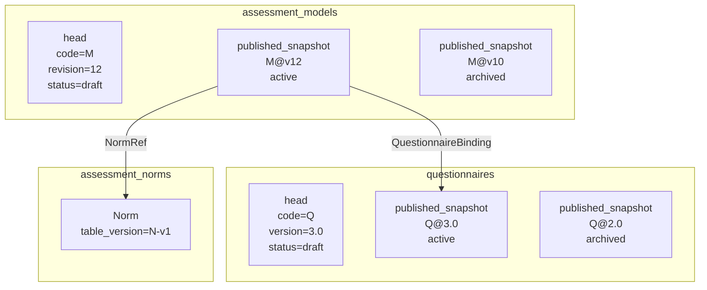
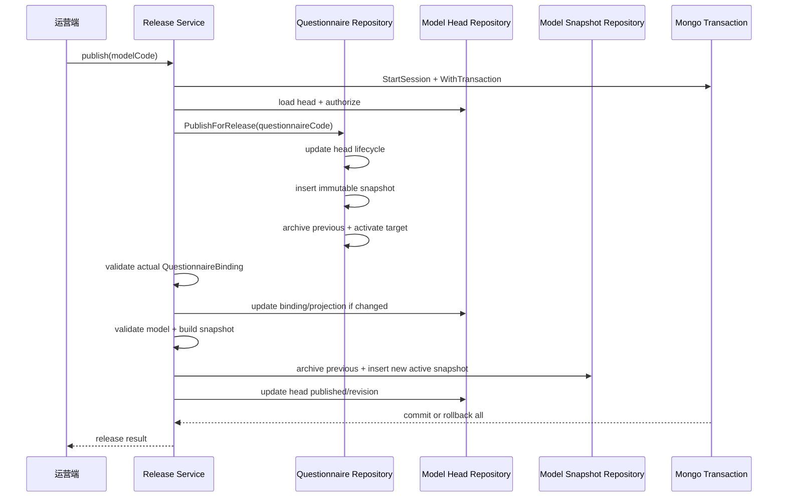

# 核心设计：数据存储与一致性

> 状态：ModelCatalog 已采用 MongoDB 文档存储、单集合双角色 head/release 结构、不可变发布快照、历史 release 保留和 Questionnaire/Model 联合发布事务；统一结构所需的新索引仍主要由一次性迁移脚本创建，常规 Mongo migration、Norm 唯一索引、Questionnaire 并发编辑和真实 Replica Set 联合发布集成测试仍存在明确缺口。本文严格区分当前事实与目标治理。

## 1. 本文回答

本文把前几篇文档中的领域版本、发布快照和运行时读取规则，落实到 MongoDB 的文档、查询、索引、事务和缓存一致性上。重点回答：

1. ModelCatalog 为什么选择 MongoDB，而不是把复杂模型拆成大量关系表？
2. 为什么 `AssessmentModel` 工作头和 `AssessmentSnapshot` 发布版放在同一个 `assessment_models` 集合？
3. `record_role=head/published_snapshot` 怎样隔离可编辑事实和不可变运行事实？
4. Questionnaire 为什么也在同一个 `questionnaires` 集合中保存 head 与所有历史 snapshot？
5. Norm 为什么独立保存到 `assessment_norms`，又如何保证相同版本不被覆盖？
6. model revision、release version、release status、业务 status 分别保存什么？
7. 新发布怎样归档旧 active release，同时保留历史执行和重试能力？
8. Questionnaire 与 AssessmentModel 的联合发布为什么需要 Mongo session transaction？
9. 乐观锁、唯一索引、内容级幂等和事务分别防止哪类并发错误？
10. 缓存失效与生命周期事件为什么放在事务后，它们是否属于强一致事实？
11. 当前统一存储迁移、常规 migration 和服务启动索引之间有哪些不一致？
12. 删除、下架、归档和历史保留在物理存储上分别意味着什么？

本文不重复展开：

- Questionnaire 与模型为什么共同组成可执行测评，见 [问卷绑定与发布版本](./22-核心设计-问卷绑定与发布版本.md)；
- Factor、Norm 和 Decision 的领域语义，见 [因子与计分模型](./23-核心设计-因子与计分模型.md)、[常模资产与校准](./24-核心设计-常模资产与校准.md)和[结果判定、Outcome 与解释边界](./25-核心设计-结果判定、Outcome与解释边界.md)；
- 运营端完整创建、编辑和发布步骤，见 [模型创建、编辑与联合发布](./30-关键链路-模型创建编辑与联合发布.md)；
- Evaluation 如何区分 active 准入与 exact-version 历史执行，见 [已发布模型准入与执行输入](./31-关键链路-已发布模型准入与执行输入.md)。

---

## 2. 30 秒结论

ModelCatalog 的存储设计不是“一条模型记录不断修改”，而是同时维护两类事实：

```text
working head
  运营正在编辑什么
  可修改
  使用 revision 保护并发

published snapshot
  某次发布实际承诺了什么
  内容不可修改
  使用 release version 精确寻址
```

当前模型与问卷都采用**单集合双角色**结构：

```text
assessment_models
├── record_role = head
│   └── 每个 model code 一个可编辑工作头
└── record_role = published_snapshot
    ├── v3 active
    ├── v2 archived
    └── v1 archived

questionnaires
├── record_role = head
│   └── 每个 questionnaire code 一个可编辑工作头
└── record_role = published_snapshot
    ├── 3.0 active
    ├── 2.0 archived
    └── 1.0 archived

assessment_norms
├── brief2-parent-cn-v1
└── brief2-parent-cn-v2
```

`record_role` 是物理隔离边界：authoring repository 只写 `head`，runtime repository 只读写 `published_snapshot`。两类文档共用集合，但不是同一个聚合实例，也不能通过一个模糊的 `FindByCode` 混用。

一次绑定模型的联合发布，在同一个 Mongo session transaction 中完成：

```text
Questionnaire head 状态变化
+ Questionnaire snapshot 写入与 active 切换
+ AssessmentModel binding/revision 更新
+ AssessmentSnapshot 写入与 active 切换
+ AssessmentModel head 发布状态更新
= 一个原子 Assessment Release
```

事务提交之后才执行：

- 本进程 Redis 目录缓存失效；
- Questionnaire 缓存失效；
- scale/typology 缓存信号；
- `assessment_model.changed` 生命周期事件。

这些事务后动作是最终一致或 best-effort，不决定 release 是否成立。真正的发布事实只以 Mongo 中已提交的 head/snapshot 状态为准。

当前一致性可以概括为：

| 范围 | 当前机制 | 一致性 |
| --- | --- | --- |
| 单个 Mongo 文档更新 | Mongo document atomicity | 强 |
| Questionnaire + Model 联合发布 | Mongo session transaction | 原子提交/回滚 |
| Model head 并发编辑 | revision 乐观匹配 | 已实现，但冲突错误语义不清 |
| Snapshot 同版本重复发布 | identity + 内容比较 + 目标唯一索引 | 幂等或冲突 |
| 同一 code 只有一个 active release | partial unique index + 事务内切换 | 设计已实现；索引部署链仍需治理 |
| Norm 相同版本不可覆盖 | 内容比较 + 预期唯一索引 | 代码已实现；唯一索引缺少仓库级事实 |
| Redis 与跨进程缓存 | 事务后失效、version token、TTL | 最终一致 |
| 生命周期事件 | `best_effort` direct publish | 可丢，不是发布事实 |

---

## 3. 为什么 ModelCatalog 使用 MongoDB

### 3.1 模型天然是嵌套文档

一份测评模型包含：

- 模型身份与目录元数据；
- 精确 QuestionnaireBinding；
- Factor 列表与 FactorGraph；
- Scoring rules；
- 可选 NormRefs；
- 多态 Conclusion/Decision；
- Outcome registry；
- ReportMap；
- family-specific ExecutionSpec；
- 兼容 runtime payload。

这些数据有明显的文档特征：

- 一次发布通常整体读取；
- 内部层级较深；
- 不同模型族拥有不同分支；
- Definition schema 会随模型能力扩展；
- 发布后需要整体冻结，而不是频繁局部更新。

如果全部关系化，会产生大量表和关联：

```text
assessment_model
factor
factor_edge
factor_scoring
norm_ref
conclusion
score_range_rule
outcome
type_profile
special_rule
report_section
...
```

一次发布读取需要大量 join，版本冻结还要给每张子表增加 release identity。对于“整体编辑、整体验证、整体发布、整体执行”的配置资产，Mongo 文档更贴合聚合边界。

### 3.2 Mongo 并不意味着没有结构

ModelCatalog 没有把 Definition 当成任意 JSON。当前仍有多层结构约束：

- Go domain types；
- `DefinitionV2` 多态 JSON/BSON mapper；
- 通用 Definition validation；
- family-specific handler validation；
- snapshot payload materialization；
- `schema_version`、`definition_schema_version`、`payload_format`；
- Mongo partial unique indexes；
- active/exact repository ports。

因此选择 Mongo 的正确表述是：

> 使用文档数据库保存结构化、版本化的复杂领域资产，而不是用 Mongo 逃避建模和约束。

### 3.3 为什么不把运行状态也放进 Mongo ModelCatalog

Assessment、EvaluationRun 和核心 Outcome 状态约束更强，主要存放在 MySQL；ModelCatalog 保存的是相对静态的配置和发布资产。

边界是：

| Mongo ModelCatalog | MySQL Evaluation |
| --- | --- |
| 模型 head | Assessment |
| 模型 release | EvaluationRun |
| Questionnaire snapshot | Evaluation Outcome metadata/payload |
| Norm asset | Assessment 查询投影 |
| 发布版本与配置 | 一次执行状态与事务提交 |

运行时通过精确引用连接两边，而不是跨数据库建立外键。

---

## 4. 当前物理数据拓扑

| 集合 | 文档角色 | 主要身份 | 可修改性 | 主要消费者 |
| --- | --- | --- | --- | --- |
| `assessment_models` | `head` | `code + record_role` | 可编辑，revision 递增 | 运营后台、authoring |
| `assessment_models` | `published_snapshot` | model identity + `release_version + record_role` | 内容不可变；只变更 release metadata | C 端目录、准入、Evaluation、历史重试 |
| `questionnaires` | `head` | `code + record_role` | 可编辑 | Survey 运营后台 |
| `questionnaires` | `published_snapshot` | `code + version + record_role` | 内容不可变；只变更 release metadata | 作答展示、提交校验、模型发布 |
| `assessment_norms` | immutable Norm | `table_version` | 同版本同内容幂等；不同内容冲突 | ModelCatalog 发布校验、Evaluation 输入物化 |

ModelCatalog 资产当前是全局内容目录，不按 `org_id` 分片。集合文档继承 `BaseDocument` 的 `_id`、`domain_id`、创建/更新时间和操作者审计字段，但 ModelCatalog 查询身份主要是稳定业务 code/version。



---

## 5. 为什么 head 与 snapshot 放在同一个集合

### 5.1 同一个资产族，两种记录角色

`AssessmentModel head` 与 `AssessmentSnapshot` 共享：

- model code；
- Kind/SubKind/Algorithm；
- 标题和目录元数据；
- QuestionnaireBinding；
- DefinitionV2。

但二者服务不同读写语义：

```text
head
  “下一次准备发布什么”

published_snapshot
  “某次已经发布了什么”
```

将它们保存在同一个 collection 可以：

- 让一个 model code 的工作头与历史 release 位于同一数据域；
- 用同一套 BSON Definition mapper；
- 简化备份、审计和模型族迁移；
- 避免 `assessment_models` 与 `published_assessment_models` 长期形成双存储真相；
- 用 `record_role` 明确表达角色，而不是用集合名字隐含角色。

Questionnaire 也采用相同选择：head 和所有 published snapshots 都在 `questionnaires` 中，不为每次发布另建集合。

### 5.2 单集合不等于单文档

当前不是：

```text
一个 document 内嵌 head + releases[]
```

而是：

```text
一个 collection 中有多个独立 document
```

这样避免单个模型长期发布后形成无限增长文档，也允许：

- exact version 点查；
- release history 分页/排序；
- active partial index；
- 单独归档某个 snapshot 的 release metadata；
- 历史 release 保持独立不可变内容。

### 5.3 `record_role` 是强制边界

模型当前使用：

```text
head
published_snapshot
```

DraftRepository 的所有过滤条件都包含：

```text
record_role = head
```

Published Repository 的所有运行时过滤条件都包含：

```text
record_role = published_snapshot
status = published
```

这保护了两个关键不变式：

- authoring update 不会覆盖已发布 snapshot；
- runtime reader 不会把 draft 当成线上模型。

如果新增查询绕过 role filter，例如只按 `code` 查第一条记录，单集合设计会立刻失去安全性。因此仓储 port 和 role-aware filter 不是实现细节，而是存储设计的一部分。

### 5.4 与旧双集合结构的关系

历史实现曾使用：

```text
assessment_models
published_assessment_models
```

当前运行时事实已经迁移为：

```text
assessment_models
  head + published_snapshot
```

`published_assessment_models` 只应作为迁移前 legacy source 或 cutover 后临时保留的回滚材料，不能继续作为新运行时真相。

---

## 6. AssessmentModel head 的物理契约

### 6.1 主要字段

`AssessmentModelPO` 保存：

```text
code
product_channel
kind / sub_kind / algorithm
title / description / category
stages / applicable_ages / reporters / tags
status
questionnaire_code / questionnaire_version
definition_payload_format / definition_payload
definition_schema_version / definition_v2
record_role = head
revision
published_at / archived_at
audit fields
```

### 6.2 head status 表示工作状态

head 的业务状态是：

- `draft`；
- `published`；
- `archived`。

它描述当前工作头的运营状态，不等价于“线上有没有 active release”。例如发布后开始下一轮编辑：

```text
head.status = draft
active snapshot = v12
```

这不是不一致，而是正常状态：线上继续运行 v12，运营正在编辑下一版。

因此查询“当前是否在线”必须读取 active snapshot；只看 head.status 会误判。

### 6.3 revision 是乐观并发令牌

领域对象每次修改调用 `touch()`，推进 revision。仓储更新使用：

```text
code = model.Code
record_role = head
revision = model.Revision - 1
```

只有数据库仍处于调用者读取的旧 revision 时才更新成功。

它防止：

```text
运营 A 读取 revision=10
运营 B 读取 revision=10
B 保存 revision=11
A 再保存 revision=11 并覆盖 B
```

当前 A 的更新会因为 filter 不匹配而失败。

### 6.4 当前乐观锁错误语义不足

`DraftRepository.Update` 在 `MatchedCount == 0` 时返回 `ErrNotFound`。但“不匹配”可能表示：

- head 确实不存在；
- head 已软删除；
- record_role 错误；
- revision 已被另一个编辑者推进。

对运营端而言，“不存在”和“并发冲突，请刷新后重试”是不同问题。目标应引入明确 `ErrRevisionConflict`，必要时补查当前 revision，返回可理解的冲突信息。

---

## 7. AssessmentSnapshot 的物理契约

### 7.1 主要字段

`PublishedAssessmentModelPO` 保存：

```text
schema_version
payload_format
record_role = published_snapshot
release_status = active | archived
product_channel
kind / sub_kind / algorithm
code
release_version
title / description / catalog metadata
status = published
decision_kind
questionnaire_code / questionnaire_version
source
payload
definition_schema_version / definition_v2
published_at / release_archived_at
audit fields
```

这里特意使用 `release_version`，而 head 使用 `revision`，避免两种版本在 BSON 层继续都叫 `version`。

### 7.2 snapshot 同时保存 DefinitionV2 与 runtime payload

一次发布会通过 family handler：

1. 校验 DefinitionV2；
2. 解析 Norm 等外部资产；
3. 推导 DecisionKind；
4. 构建 family-specific runtime payload；
5. 把 DefinitionV2 与 materialized payload 一起冻结。

两者职责不同：

| 字段 | 用途 |
| --- | --- |
| `definition_v2` | canonical 领域定义、审计和未来重新物化 |
| `payload` + `payload_format` | 当前运行时高效解析、兼容不同模型 family |

双存储会带来一致性要求：同一个 snapshot 中的 payload 必须能由 DefinitionV2 确定性产生。当前 `audit_scale_models` 一次性工具会检查发布 payload 与 DefinitionV2 的确定性投影是否一致。

### 7.3 内容不可变，release metadata 可变

“不可变 snapshot”不是说 Mongo 文档一个字段都不能更新。需要区分：

```text
immutable content
  identity
  questionnaire binding
  DefinitionV2
  payload
  decision kind
  catalog metadata

mutable release metadata
  release_status
  release_archived_at
  updated_at / updated_by
```

新 release 上线时，旧 release 的内容不改，只把 `release_status` 从 active 变成 archived。

### 7.4 受控迁移例外

仓储存在 `BackfillPublishedDefinitionV2`，允许一次性迁移在精确历史 release 上补写 DefinitionV2。它要求匹配 code、release version 和原 payload，只更新 DefinitionV2 相关字段。

这是一条迁移逃生通道，不是日常编辑 API。使用时必须：

- 只做明确审计过的 backfill；
- 保持 runtime payload 不变；
- 运行 Definition/payload 一致性检查；
- 记录脚本、影响范围和回滚方案；
- 不能把它包装成运营后台的“修改已发布模型”。

---

## 8. 发布快照身份、幂等与冲突

### 8.1 模型 release 身份

仓储识别同一模型 release 的过滤条件是：

```text
record_role = published_snapshot
kind
sub_kind（非空时）
algorithm
code
release_version
deleted_at = null
```

当前 release version 通常由 head revision 生成：

```text
revision 12 -> v12
```

### 8.2 相同身份、相同内容

重复保存时，仓储读取已有 snapshot，去除 release status、发布时间等可变元数据后比较完整发布内容。

如果内容相同且该 release 仍 active：

```text
返回成功
不插入重复文档
```

这是内容级幂等。

### 8.3 相同身份、不同内容

如果同一个 release identity 出现不同 payload、Definition、binding 或元数据：

```text
ErrReleaseVersionConflict
```

系统拒绝覆盖已有历史含义。正确做法是推进 head revision，产生新 release version。

### 8.4 archived release 不能重新激活

如果同一 release 已归档，再次提交相同内容也不会把它直接恢复为 active。仓储返回 invalid state，要求产生新 release。

这个规则避免：

- release 时间线倒退；
- 已下架版本被偶然重新用于准入；
- 缓存和目录无法区分一次新发布与旧记录复活。

### 8.5 应用级幂等仍有缺口

`PublishRelease` 当前看到 `head.status == published` 时直接返回幂等成功，不重新确认：

- 对应 Model snapshot 是否存在；
- snapshot 是否仍 active；
- Questionnaire snapshot 是否仍 active；
- 两边精确 binding 是否相同。

正常事务不会产生这种漂移，但手工改库、旧迁移或异常历史数据可能造成“head 显示 published，实际没有完整 active pair”。

目标幂等语义应是：

> 重复命令在数据库已满足完整后置条件时返回成功；如果状态只满足一半，应报告一致性错误或执行受控修复，而不是无条件成功。

---

## 9. active release 与 retained history

### 9.1 两种 release status

发布 snapshot 的 release status 是：

- `active`：允许新测评准入；
- `archived`：不允许新准入，但继续保留历史读取。

`status=published` 表示它曾经是有效发布内容；`release_status` 表示它现在是否对新准入可见。两者不能合并。

### 9.2 新发布怎样切换 active

模型仓储在同一外层事务中：

1. 查找新 release identity 是否已经存在；
2. 将相同 model code 的旧 active snapshots 更新为 archived；
3. 插入新的 active snapshot。

Questionnaire 仓储采用稍有不同的顺序：

1. 先把新 snapshot 以 archived 状态插入；
2. 将该 questionnaire code 的所有 snapshots 归档；
3. 把目标 version 更新为 active。

Questionnaire 先插 archived 的原因是：如果 active unique index 已生效，切换过程中不会短暂同时存在两个 active。

### 9.3 为什么中间状态仍需要事务

在事务内部可能短暂出现：

```text
旧 active 已归档
新 active 尚未写入
```

或者：

```text
新 Questionnaire active 已完成
Model snapshot 尚未写入
```

事务外读者不能看到这些中间状态。只有整个事务 commit 后，新 active pair 才同时可见；失败则全部回滚。

### 9.4 active 与 exact reader 分离

运行端口明确分成：

```text
GetActivePublishedModelByRef
  admission 使用
  exact version 也必须处于 active

GetPublishedModelByRef
  execution/retry/history 使用
  version 必填
  active 或 archived 都可读
```

缓存层还做了关键处理：active exact read 绕过 immutable exact-version cache，直接回 Mongo 检查当前 release status，防止已归档 snapshot 仍因旧缓存被用于新准入。

---

## 10. Questionnaire 的单集合版本化

### 10.1 当前物理结构

`QuestionnairePO` 同时表示 head 和 snapshot，核心字段包括：

```text
code / version
title / description / image
status / type
record_role
release_status
published_at / release_archived_at
questions[]
question_count
audit fields
```

题目、选项、校验规则、计算规则和 ShowController 都嵌套在一个 Questionnaire document 中。

### 10.2 为什么不拆 `published_questionnaires`

Questionnaire 与 Model 一样，最重要的是角色隔离，而不是集合名字：

- head 是工作事实；
- snapshot 是不可变发布事实；
- code + version 精确寻址历史；
- role-aware repository 防止混读；
- active release status 决定新提交是否可用。

把 head 和所有 snapshots 放在 `questionnaires` 中，能够保留一个问卷资产族的完整时间线，同时避免两个集合长期同步。

### 10.3 Questionnaire 的历史兼容读取

Questionnaire 仓储仍兼容旧文档：

- `record_role` 缺失或空字符串可视为 head；
- 没有 active snapshot 时，published 查询可以回退到 `status=published` 的 legacy head；
- canonical active snapshot 优先级高于 legacy published head。

这是迁移兼容策略，不是新写入规则。新写入必须明确 `record_role` 和 `release_status`。

ModelCatalog runtime repository 更严格，只读取 `record_role=published_snapshot`。这说明统一迁移后，模型运行时不再容忍未迁移 head 充当 snapshot。

### 10.4 Questionnaire 并发编辑当前是 last-write-wins

Questionnaire `Update` 当前按 head code 执行 `UpdateOne(..., upsert=true)`，没有像 AssessmentModel 一样把旧 version/revision 放入更新 filter。

因此两个运营人员同时编辑同一问卷时，后保存者可能覆盖先保存者。Questionnaire version 是业务生命周期版本，当前没有同时承担可靠 CAS token。

目标应增加：

- 明确的 head revision 或 ETag；
- update filter 中的 expected revision；
- 冲突错误；
- 前端刷新和差异提示。

不能仅凭 published snapshot 不可变，就认为 draft 编辑也具备并发安全。

---

## 11. Norm 的独立存储与不可变语义

### 11.1 物理结构

`assessment_norms` 中每个 document 保存一份完整 Norm：

```text
table_version
form_variant
kind
algorithm
factors[]
  factor_code
  bands[]
  lookup[]
audit fields
```

Model snapshot 的 DefinitionV2 只保存精确 NormRef，不复制整张常模。

### 11.2 Upsert 的实际语义

`UpsertNorm` 不是普通覆盖更新：

```text
table_version 不存在
  -> insert

table_version 已存在且完整内容相同
  -> success，幂等

table_version 已存在但内容不同
  -> ErrNormVersionConflict
```

所以“Upsert”在这里更准确地说是：

> insert immutable version or assert identical existing content。

### 11.3 并发安全依赖唯一索引

实现采用“先读、再插入；duplicate key 后读取并比较”的模式。这种模式只有在数据库存在：

```text
unique(table_version) where deleted_at = null
```

时，才能在两个并发导入者都先读不到的情况下阻止重复版本。

当前仓库中没有发现常规 migration 或服务启动 index manager 为 `assessment_norms.table_version` 创建唯一索引。生产库可能通过人工或历史脚本已经存在，但这不是仓库可证明事实。

因此当前状态必须描述为：

- 领域与 repository 已表达不可变语义；
- 并发闭环依赖唯一索引；
- 仓库级索引迁移仍需补齐；
- 上线前必须通过 `getIndexes()` 验证真实数据库。

### 11.4 Norm 不参与联合创建事务

Norm 是预先导入的独立资产。模型发布只在事务中读取并校验精确 NormRef，然后把引用和派生 payload 冻结到 snapshot。

发布事务不会：

- 自动创建 Norm；
- 修改 Norm；
- 切换“最新 Norm”；
- 将模型发布失败解释为需要覆盖旧 Norm。

这使 Norm 生命周期和模型 release 生命周期保持独立。

---

## 12. 联合发布事务

### 12.1 canonical 入口

绑定模型的公开生命周期入口是：

```text
POST /api/v1/assessment-releases/{code}/publish
POST /api/v1/assessment-releases/{code}/unpublish
POST /api/v1/assessment-releases/{code}/archive
```

旧的 model-only publication service 仍存在于应用层和组合结构中，但 REST 的 `assessmentModelPublicationRoutes` 当前为空。对绑定问卷的可执行测评，`release.Service` 才是 canonical 外部入口。

### 12.2 PublishRelease 的事务步骤



事务内的主要写入包括：

1. Questionnaire head；
2. Questionnaire published snapshot；
3. Questionnaire active switch；
4. 必要时更新 Model head 的精确 binding；
5. AssessmentSnapshot active switch 与插入；
6. Model head 的 published 状态、revision 和 published time。

### 12.3 为什么不能拆成两个事务

如果 Survey 和 ModelCatalog 分别提交，可能产生：

```text
Q@3 active
M@v12 仍绑定 Q@2
```

或者：

```text
M@v12 active 并绑定 Q@3
Q@3 snapshot 写入失败
```

第一种使新答卷与旧模型规则错配；第二种使运行时引用不存在的问卷。两者都不能靠缓存失效修复。

### 12.4 下架和归档同样原子

`UnpublishRelease` 在一个 transaction 中：

- 清除 Questionnaire active snapshot；
- 归档 Model active snapshot；
- 把 published Model head 切回 draft。

`ArchiveRelease` 在一个 transaction 中：

- 归档 Questionnaire head 和 active snapshot；
- 归档 Model active snapshot；
- 把 Model head 标记为 archived。

即使 head 已经因为新编辑回到 draft，归档仍会独立查找并归档旧 active release。

---

## 13. Mongo transaction 的运行前提

### 13.1 事务运行器

当前 `NewMongoRunner`：

1. 从 `mongo.Database` 取得 client；
2. `StartSession()`；
3. 调用 `session.WithTransaction()`；
4. 把 `mongo.SessionContext` 传入所有 repository；
5. callback 或 commit 失败时返回错误。

Repository 使用收到的 context 调用 Mongo driver，因此同一 callback 内跨 `questionnaires` 和 `assessment_models` 的操作参加同一个 transaction。

### 13.2 standalone Mongo 不支持这套保证

Mongo 多文档 transaction 要求 Replica Set 或满足事务条件的集群。单进程、单节点部署也必须以 single-node Replica Set 运行，普通 standalone 模式不能提供联合发布原子性。

因此部署验证至少包括：

```text
setName 非空
isWritablePrimary = true
应用连接串支持 session/transaction
事务 callback 真正 commit/rollback
```

不能因为 Mongo 只有一个节点，就把它误认为无需 Replica Set。

### 13.3 当前 runner 没有显式 transaction options

Runner 当前使用 driver 默认的 read concern、write concern 和 read preference，没有在代码中显式声明发布事务的 durability options。

这不等于事务无效，但意味着生产保证还依赖：

- Mongo client 配置；
- Replica Set 默认 write concern；
- 驱动版本和集群设置；
- 运维对 journaling/ack 的配置。

对于“发布成功后必须长期可恢复”的资产，建议在基础设施文档中明确 production client/transaction concern，并通过故障测试验证，而不是只依赖默认值。

### 13.4 缺少专用联合发布 Replica Set 集成测试

当前 release service 有应用层 transaction rollback 单元测试，证明 commit 失败时不执行事务后 effects；但仓库中没有发现一条使用真实 `QS_SERVER_TEST_MONGO_URI`、同时写 `questionnaires` 与 `assessment_models` 并验证 rollback/unique indexes 的联合发布集成测试。

这意味着：

- 业务编排有测试；
- repository 单元契约有测试；
- 真实 Mongo session + 两集合 + 索引的组合仍缺独立证据。

目标测试应使用独立测试数据库，不能直接对生产库执行。

---

## 14. 一致性不是只有“有事务/没事务”

系统当前至少有四层一致性机制。

### 14.1 单文档原子性

适用于：

- 更新一个 Model head；
- 插入一个 snapshot；
- 导入一份 Norm；
- 更新一个 Questionnaire head。

Mongo 保证单文档 update/insert 原子，但不能自动保护多个 document 之间的关系。

### 14.2 乐观并发控制

适用于 Model head：

```text
expected revision
  -> compare in update filter
  -> only one writer succeeds
```

它防止丢失更新，不保证 Questionnaire/Model pair 一起发布。

### 14.3 唯一索引

适用于：

- 一个 model code 一个 head；
- 一个 release identity 一份 snapshot；
- 一个 model code 一个 active snapshot；
- 一个 questionnaire code 一个 head；
- 一个 questionnaire code/version 一份 snapshot；
- 一个 questionnaire code 一个 active snapshot；
- 一个 Norm table version 一份内容。

它是并发情况下最后的数据库守卫，不能只依靠“先查再写”。

### 14.4 多文档事务

适用于：

- 旧 active 归档 + 新 active 插入；
- Questionnaire head/snapshot + Model head/snapshot 联合切换；
- 下架/归档 pair。

事务保护一组写入的全有或全无，不替代内容级校验、唯一索引和幂等。

---

## 15. 当前统一结构所需索引

### 15.1 `assessment_models`

一次性统一迁移脚本为新 canonical collection 创建：

| 索引 | 类型 | 保护/服务的语义 |
| --- | --- | --- |
| `idx_assessment_models_head_code` | partial unique | 每个 code 只有一个未删除 head |
| `idx_assessment_models_snapshot_identity_version` | partial unique | 每个模型 identity/release version 只有一份 snapshot |
| `idx_assessment_models_active_code` | partial unique | 每个 model code 最多一个 active snapshot |
| `idx_assessment_models_active_questionnaire` | partial unique | 一个精确 QuestionnaireBinding 最多绑定一个 active model snapshot |
| `idx_assessment_models_active_catalog` | compound | active 目录按状态、kind、category、algorithm、code 查询 |
| `idx_assessment_models_release_history` | compound | 按 code + published_at 查询历史 release |

### 15.2 `questionnaires`

统一迁移脚本创建：

| 索引 | 类型 | 保护/服务的语义 |
| --- | --- | --- |
| `idx_questionnaires_head_code` | partial unique | 每个 code 一个 head |
| `idx_questionnaires_snapshot_version` | partial unique | 每个 code/version 一份 snapshot |
| `idx_questionnaires_active_code` | partial unique | 每个 code 最多一个 active snapshot |
| `idx_questionnaires_release_history` | compound | 发布历史排序读取 |

### 15.3 partial filter 为什么重要

如果简单创建：

```text
unique(code)
```

同一个 code 的 head、v1、v2 会互相冲突。正确唯一性必须限定角色：

```text
head only
snapshot only
active snapshot only
deleted_at = null
```

这也是 role-based 单集合设计能成立的物理基础。

### 15.4 跨集合引用不能由索引完全保护

Mongo 索引无法保证：

```text
active model.questionnaire_code/version
  必须对应 active questionnaires snapshot
```

也无法保证：

```text
DefinitionV2.NormRefs[*]
  必须对应存在的 assessment_norms.table_version
```

这些引用由：

- 发布前 application validation；
- 联合发布 transaction；
- 一次性 audit；
- 运行时 exact read failure；

共同保护。后续应增加周期性只读一致性审计，而不是期待数据库外键自动完成。

---

## 16. 当前索引迁移存在的事实缺口

### 16.1 常规 migration 仍是旧结构

当前 `internal/pkg/migration/migrations/mongodb` 中：

- `000009` 创建旧 `published_assessment_models`；
- `000010` 创建旧 `assessment_models`，并对 `code` 建立不区分 role 的 unique index；
- 后续 migration 尚未把两者升级为统一 role-based collection；
- 没有为 `assessment_norms.table_version` 创建 canonical unique index。

如果一个全新环境只执行这些 migration，旧 `unique(code)` 会阻止同一个 code 同时保存 head 与 snapshots。

### 16.2 服务启动 IndexManager 也没有完整覆盖

`internal/pkg/mongodb/indexes.go` 当前主要管理：

- questionnaires；
- answersheets；
- legacy scales。

它没有创建统一 `assessment_models` 索引，也没有创建 `assessment_norms` 索引；Questionnaire 的启动索引仍偏向旧 `is_active_published` 查询，不等同于统一迁移脚本中的 partial unique release indexes。

### 16.3 当前新索引主要来自一次性迁移脚本

`scripts/oneoff/unify_assessment_model_records` 在 staging collection 上创建正确的新索引，然后通过 collection rename cutover 成为 canonical collection。

这对已经执行过 cutover 的环境有效，但存在两个问题：

- 新环境不能只靠标准 migration 重建当前 schema；
- 运维无法仅凭 migration version 判断索引是否完整。

### 16.4 目标治理

应新增不可变的后续 migration，而不是回改已经执行过的历史 migration：

1. 审计并删除/替换冲突的旧 unique index；
2. 创建 role-based model indexes；
3. 创建 role-based questionnaire indexes；
4. 创建 Norm table version unique index；
5. 明确 legacy collection 的保留/删除策略；
6. 增加 index contract tests；
7. 服务启动时至少验证关键唯一索引存在，缺失时拒绝写流量或产生高优先级告警。

---

## 17. 缓存一致性

### 17.1 为什么写仓储不能直接使用缓存 decorator

组合根把写入端绑定到原始 Mongo repository，把读取端包装为 `CachedPublishedModelStore`。原因是：

- Mongo write 必须留在 transaction 的 SessionContext 内；
- 如果写到一半就失效缓存，事务最终回滚，读者会提前观察到不存在的新状态；
- 缓存失效不是事务资源，不能参加 Mongo commit。

所以当前顺序是：

```text
transaction commit
  -> lifecycle effect
  -> invalidate mutable visibility caches
```

### 17.2 exact-version cache 为什么可以保留

`GetPublishedModelByRef` 的 payload 是不可变的。一个 release 从 active 变为 archived 时，内容没有变化，因此 exact-version object cache 可以继续保留，供已受理 Assessment 执行和重试。

但准入必须检查 active 状态，所以：

```text
GetActivePublishedModelByRef
  bypass exact-version cache
  read Mongo release status
```

这是“内容不可变”与“可见性可变”的直接体现。

### 17.3 mutable visibility caches

发布、下架或归档后需要失效：

- latest-by-code；
- published catalog list；
- typology algorithms list；
- code-filtered `GetPublished` page；
- Questionnaire release cache；
- collection-server 等跨进程热缓存信号。

列表缓存使用全局 version token：每次变更 bump token，新查询使用新 cache key，不需要 Redis pattern delete 所有过滤组合。

### 17.4 缓存失效失败的语义

缓存 invalidator 当前主要记录 warning，不回滚已经提交的 Mongo release。这样做是正确的，因为：

- 数据库是事实源；
- 回滚数据库并不能撤回已经被部分缓存看到的状态；
- 缓存应通过 TTL、version token、主动失效和降级读源恢复。

但这意味着目录查询可能在失效失败后短暂返回旧 active 状态。需要：

- 指标统计 invalidation failure；
- 明确 TTL 上限；
- 管理员提供按 model code 或全局 catalog token 的修复动作；
- 准入路径继续绕过可能陈旧的 active cache；
- 不把 cache hit 当作发布审计证据。

---

## 18. 生命周期事件的一致性边界

### 18.1 当前事件语义

`configs/events.yaml` 把：

```text
questionnaire.changed
assessment_model.changed
```

定义为 `best_effort`。ModelCatalog 在 transaction commit 后 direct publish `assessment_model.changed`。

### 18.2 它们不是发布事实

事件丢失时：

- Mongo release 仍然有效；
- runtime reader 仍可读取；
- active snapshot 不应回滚；
- 缓存和次级投影可能延迟或需要修复。

这些事件当前主要服务：

- 生命周期通知；
- 非关键投影；
- 跨进程缓存辅助失效；
- 运维可观测性。

### 18.3 何时需要升级为 durable outbox

如果未来某个消费者满足以下任一条件：

- 缺事件会导致 active release 永久不可用；
- 缺事件会造成不可恢复的业务数据缺失；
- 发布完成必须等待消费者确认；
- 需要逐事件审计和自动重放；

则不能继续依赖 best-effort，应把相应事件作为事务内 outbox 写入。

当前不能仅因为“有事件”就宣称发布链路拥有 outbox 可靠性。ModelCatalog 的强一致核心来自 Mongo transaction，而不是生命周期事件。

---

## 19. 删除、下架、归档与历史保留

### 19.1 四种动作

| 动作 | head | active snapshot | archived snapshots | 新准入 |
| --- | --- | --- | --- | --- |
| 编辑 | fork/保持 draft | 保持原 active | 保留 | 继续使用旧 active |
| 下架 | published head 回 draft | 归档 | 保留 | 拒绝 |
| 归档 | head 变 archived | 归档 | 保留 | 拒绝 |
| 删除 Model head | 仅 archived head 可软删除 | 必须没有 active | 保留 | 拒绝 |

### 19.2 Model 删除不删除历史 snapshot

Model 管理服务要求：

- head 已 archived；
- 当前不存在 active published model；

然后 `DraftRepository.Delete` 只软删除 head。retained published snapshots 继续存在，供：

- 历史 Assessment exact read；
- Evaluation retry；
- 报告重建；
- 审计和 release history。

所以“删除模型”在当前业务 API 中不是彻底抹除模型族历史。

### 19.3 Questionnaire 删除策略

独立 Questionnaire：

- 没有任何 published snapshots 时，draft family 可以物理删除；
- 已有 snapshots 时，删除 draft 后会从最新 published snapshot 恢复工作 head，历史 snapshots 保留。

已绑定模型的 Questionnaire 会被公开生命周期 guard 拦截，要求通过 Assessment Release 操作。

### 19.4 Questionnaire draft 删除/恢复不是事务

`deleteDraftAndRestoreLatestPublished` 当前依次：

1. 读取 latest snapshot；
2. hard delete head；
3. clone snapshot；
4. upsert 恢复 head。

这些步骤没有包在 Mongo transaction 中。如果删除成功、恢复失败，会暂时缺失 head，虽然历史 snapshot 仍在。

这是 Survey 生命周期的当前一致性缺口。目标可以：

- 把删除与恢复放入 transaction；
- 或直接用单次 replacement/upsert 还原 head，避免先删后建；
- 增加故障注入测试。

---

## 20. 统一存储迁移与 cutover

### 20.1 迁移目标

`unify_assessment_model_records` 把：

```text
assessment_models draft rows
+ published_assessment_models runtime snapshots
```

转换成：

```text
assessment_models
  record_role=head
  record_role=published_snapshot
```

同时把 Questionnaire 转换为明确 head/snapshot/active release 结构。

### 20.2 为什么使用 staging collection

迁移没有直接修改线上 canonical collection，而是：

```text
dry-run
  只分析

apply
  写 staging collections

verify
  检查 staging 完整性和可运行性

cutover
  rename old canonical -> legacy timestamp
  rename staging -> canonical

finalize
  最终删除 legacy collections
```

这种方式提供：

- 原数据保留；
- cutover 前完整验证；
- 失败时可以重新生成 staging；
- 新索引在 staging 上提前构建；
- finalize 前仍能回滚 collection name。

### 20.3 迁移会拒绝或跳过什么

工具会报告缺少以下关键字段的不可运行历史记录：

- code/version；
- payload/payload format；
- DecisionKind；
- DefinitionV2；
- 精确 QuestionnaireBinding；
- canonical model identity；
- Questionnaire code/version。

不能为了让数量对齐，就把缺少执行契约的数据伪装成 canonical snapshot。

### 20.4 cutover 不是普通在线写操作

两个 collection 的 rename 是按顺序执行，并带有限回滚尝试，不是一个应用层 Mongo transaction。工具 README 因此明确要求维护窗口：

- 停止旧进程写入；
- 验证备份可恢复；
- 审核 dry-run/apply/verify 输出；
- cutover 后部署新二进制；
- 清理 Redis 与 collection-server 热缓存；
- 完成四类代表性模型冒烟；
- 最后才执行不可逆 finalize。

旧进程不能在新 role-based schema 上继续服务。

### 20.5 finalize 是不可逆动作

`finalize` 删除 legacy collections。它只有在以下证据齐全时才允许：

- 新 collection 数量与 identity 审计通过；
- active model/questionnaire pair 一致；
- exact history 可读；
- Scale、Typology、Behavioral Rating、Cognitive 冒烟通过；
- Redis 缓存已清理并重新预热；
- 回滚窗口已经明确结束。

---

## 21. 典型失败场景与系统行为

### 21.1 Questionnaire snapshot 写入成功，Model snapshot 失败

在 canonical `PublishRelease` 中：整个 transaction rollback，两边都不发布。

如果绕过 release service 分别调用低层 API：可能产生半发布，所以已绑定 Questionnaire 的公开 standalone lifecycle 会被拒绝。

### 21.2 旧 active 已归档，新 snapshot 插入失败

在 transaction 中：旧 active 归档也会回滚，继续服务。

没有 transaction 时：会出现 active 空窗，这正是不能只靠 UpdateMany + InsertOne 顺序的原因。

### 21.3 两个运营人员同时编辑 Model head

revision 乐观匹配使一个成功、一个失败。当前失败可能表现为 not found，目标应返回 revision conflict。

### 21.4 两个请求同时发布相同 revision

正确索引存在时：

- 一个插入成功；
- 如果另一个请求在预读时已经看到该 snapshot，会按内容比较得到幂等成功；
- 如果两个请求都在插入前读到“不存在”，唯一索引会让其中一个插入失败；调用方重试后才会进入内容级幂等分支；
- 相同 identity 的不同内容最终必须表现为 release version conflict，而不能覆盖；
- active unique index 防止同 code 两个 active。

没有正确 partial unique indexes 时，应用层“先查再插”仍可能竞态产生重复记录。

当前 Model snapshot repository 不会像 Norm repository 那样在 duplicate-key 后重新读取并比较内容；上述“同时预读不存在”的输家会直接收到 Mongo 写错误。后续可把它翻译为稳定的并发/版本冲突错误，同时保留调用方重试后的幂等语义。

### 21.5 Redis 在 transaction commit 后不可用

- 发布事实已经成立；
- invalidation 记录 warning；
- active admission 直接检查 Mongo；
- 目录/list 可能在 TTL 或 token 修复前短暂陈旧；
- 不回滚数据库。

### 21.6 生命周期事件发布失败

- release 仍成立；
- best-effort 消费者可能缺一次通知；
- 关键消费者若不能容忍丢失，应升级 durable outbox；
- 当前不能依赖该事件修复数据库主事实。

### 21.7 archived snapshot 被精确读取

- 新准入 active reader：拒绝；
- 已受理 Assessment exact reader：允许；
- 历史管理查询：允许；
- exact cache：允许保留 immutable payload。

这不是数据泄漏，而是 retained history 的设计目标。

---

## 22. 一致性模型总结

```text
Authoring consistency
  Model head: optimistic revision
  Questionnaire head: current last-write-wins, needs CAS

Publication consistency
  Questionnaire + Model: Mongo transaction
  one active per code: partial unique index
  same release identity: immutable content comparison

Runtime consistency
  admission: active reader
  execution/retry: exact retained reader
  cache: immutable exact object + mutable visibility invalidation

History consistency
  old snapshots archived, not overwritten
  release version and binding retained
  deletes do not erase execution history

Propagation consistency
  cache invalidation: post-commit eventual
  lifecycle events: post-commit best-effort
```

系统选择的是：

> 数据库发布事实强一致，历史内容不可变；缓存和通知最终一致，并且不能反向成为事实源。

---

## 23. 当前不足与风险

### 23.1 标准 migration 无法完整重建当前 unified schema

风险：新环境只有旧 `unique(code)`，head 与 snapshot 无法共存；旧 published collection 可能被误当真相。

目标：新增 canonical role-based migration，并验证 fresh install。

**进展（MC-R005）**：`000013_unified_modelcatalog_schema` + `IndexManager` + 启动 `VerifyUnifiedModelCatalogIndexes` + contract/integration 测试已落地；生产索引清单与联合发布 Replica Set rollback 仍待部署核验。

### 23.2 Norm 唯一索引缺少仓库级闭环

风险：并发首次导入同一 TableVersion 时可能产生重复文档。

目标：`table_version` partial unique index + index contract test。

**进展**：`idx_assessment_norms_table_version` 已进入 000013 与 IndexManager。

### 23.3 Questionnaire head 没有 CAS

风险：多人编辑出现 last-write-wins 和静默丢失更新。

目标：独立 revision、expected revision update 和 conflict UX。

### 23.4 Model revision 冲突被报告为 not found

风险：运营误以为模型丢失，无法正确刷新和合并。

目标：明确 `ErrRevisionConflict`。

### 23.5 发布幂等只看 head.status

风险：历史漂移下返回虚假成功，掩盖缺失 active pair。

目标：幂等分支验证完整 postcondition。

### 23.6 跨集合引用没有周期审计

风险：手工改库、旧脚本或迁移错误造成 active model 引用不存在/非 active Questionnaire，或 NormRef 缺失。

目标：只读 consistency auditor + 运维告警 + 明确修复手册。

### 23.7 DefinitionV2 与 payload 双存储可能漂移

风险：runtime 执行 payload 与运营看到的 Definition 不一致。

目标：发布时 deterministic projection hash、存储 hash、周期 audit；受控 backfill 后强制复核。

### 23.8 缓存失效与生命周期事件不可重放

风险：目录或非关键投影短暂/长期陈旧。

目标：先强化 TTL、指标和 repair action；真正关键消费者升级 outbox。

### 23.9 缺少真实 Mongo 联合发布集成测试

风险：单元测试无法覆盖 session context、partial unique index、跨集合 rollback 和实际驱动行为。

目标：独立 Replica Set 测试库 + fault cases；不能使用生产库。

### 23.10 transaction concern 依赖默认配置

风险：文档无法仅凭源码说明发布 ack 的精确 durability 等级。

目标：在 Mongo client/ops 文档中固化 read/write concern，并做部署验证。

---

## 24. 治理优先级

### P0：让任何环境都能得到正确存储约束

1. 新增 unified `assessment_models` 后续 migration；
2. 新增 canonical `questionnaires` partial unique indexes；
3. 新增 `assessment_norms.table_version` unique index；
4. 增加 fresh database migration test；
5. 启动时验证关键索引；
6. 增加真实 Replica Set 联合发布 commit/rollback 集成测试。

### P1：强化并发与一致性诊断

1. Questionnaire head 引入 revision CAS；
2. Model optimistic-lock conflict 使用专用错误；
3. PublishRelease 幂等验证 active pair；
4. 增加 model/questionnaire/norm 跨集合 auditor；
5. 为 Definition/payload 保存 hash 并做确定性校验；
6. 提供缓存 version token 修复命令和指标。

### P2：长期资产治理

1. 为 release migration/backfill 建立统一审计记录；
2. 明确 legacy collections 的保留周期；
3. 为大历史量模型设计 release history 分页与归档策略；
4. 评估是否需要独立 Release aggregate document；
5. 只有生命周期真正独立时，再评估物理拆分 Interpretation assets。

---

## 25. 不采用的设计

### 25.1 只保留一个 Model document，发布时原地覆盖

问题：历史 Assessment 重试和报告重建无法取得当时规则，新版本改变旧结果语义。

结论：head 与不可变 snapshots 必须分离。

### 25.2 运行时直接读取 head

问题：运营编辑一半的 draft 进入生产执行。

结论：runtime 只读 `published_snapshot`。

### 25.3 所有 snapshot 都永远 active

问题：新准入无法确定版本，下架无法生效。

结论：每个资产族最多一个 active，旧版 retained archived。

### 25.4 下架时删除历史 snapshot

问题：已受理测评无法继续执行，历史结果无法审计。

结论：下架改变可见性，不删除内容。

### 25.5 用缓存分布式锁代替唯一索引

问题：锁过期、Redis 故障或绕过应用写入后仍可能产生重复主数据。

结论：唯一性必须由 Mongo index 最终保护，锁只能优化竞争。

### 25.6 只靠唯一索引，不做 transaction

问题：索引能防两个 active，却不能保证 Questionnaire 和 Model 同时切换，也不能避免 active 空窗。

结论：索引与 transaction 解决不同问题，二者都需要。

### 25.7 把生命周期事件作为发布提交依据

问题：当前事件 best-effort 可丢，事件成功也不能证明四份文档都已提交。

结论：Mongo transaction 是发布事实；事件只传播事实。

### 25.8 为了减少重复删除 DefinitionV2 或 payload 之一

问题：直接删除会破坏运营审计、兼容读取或当前 runtime 物化链路。

结论：先建立确定性投影和 schema 演进方案，再决定是否只保留一种 canonical representation。

### 25.9 因为使用单集合就让所有代码直接按 code 查询

问题：head 和 snapshot 混读，结果依赖 Mongo 返回顺序。

结论：所有查询必须通过 role-specific repository/port。

---

## 26. 已实现、部分实现与待治理

| 能力 | 状态 | 说明 |
| --- | --- | --- |
| Mongo 文档化 Model 定义 | 已实现 | DefinitionV2、payload 和元数据整体保存 |
| Model head/snapshot 单集合双角色 | 已实现 | `assessment_models` + `record_role` |
| Questionnaire head/snapshot 单集合双角色 | 已实现 | `questionnaires` + `record_role` |
| Authoring/runtime role filter 隔离 | 已实现 | DraftRepository 与 Published Repository 分离 |
| Model head revision | 已实现 | 每次变更递增 |
| Model head optimistic update | 已实现 | expected previous revision 匹配 |
| 明确 optimistic conflict error | 待治理 | 当前 MatchedCount=0 返回 not found |
| Questionnaire head CAS | 未实现 | 当前 code upsert，last-write-wins |
| 不可变 Model snapshot 内容比较 | 已实现 | 同 identity 同内容幂等，不同内容冲突 |
| 不可变 Questionnaire snapshot 内容比较 | 已实现 | 同 code/version 不允许题目变化 |
| archived release 禁止重激活 | 已实现 | 必须产生新 release |
| active 与 exact retained reader | 已实现 | 准入和执行语义分开 |
| Model release history | 已实现 | retained snapshot 列表 |
| Questionnaire release history | 已实现 | retained snapshot 列表 |
| Questionnaire + Model 发布 transaction | 已实现 | Mongo session transaction |
| 联合下架/归档 transaction | 已实现 | pair 一起离线 |
| transaction 后缓存失效 | 已实现 | commit 后 lifecycle effects |
| exact immutable cache 保留 | 已实现 | active admission 绕过 exact cache |
| catalog list version token | 已实现 | 全过滤组合失效 |
| 生命周期事件 best-effort 边界 | 已实现/明确 | 不是发布事实 |
| Norm 同版本内容幂等/冲突 | 已实现 | repository 比较完整内容 |
| Norm table_version unique index | **待补证据/治理** | 常规 migration/index manager 未发现 |
| Unified model/questionnaire indexes | 脚本已实现 | 主要由 one-off cutover 创建 |
| 标准 migration 对齐 unified schema | **未完成** | 仍保留旧双集合/旧 unique(code) 结构 |
| 服务启动关键索引验证 | 未实现 | 当前 IndexManager 覆盖不完整 |
| Definition/payload audit | 部分实现 | 有 scale audit 工具，未形成全 family 持续门禁 |
| active pair 周期一致性审计 | 未实现 | 无 Mongo foreign key |
| 真实 Replica Set release integration test | 未实现 | 当前主要是单元测试 |
| Questionnaire draft 删除/恢复原子性 | 待治理 | 当前先删 head 再恢复 |

---

## 27. 代码阅读入口

| 主题 | 代码入口 |
| --- | --- |
| Model head PO | `internal/apiserver/infra/mongo/modelcatalog/draft_po.go` |
| Model head repository/optimistic update | `internal/apiserver/infra/mongo/modelcatalog/draft_repo.go` |
| Published snapshot PO/role filter | `internal/apiserver/infra/mongo/modelcatalog/po.go` |
| Published snapshot repository | `internal/apiserver/infra/mongo/modelcatalog/repo.go` |
| Model BSON mapper | `internal/apiserver/infra/mongo/modelcatalog/mapper.go`、`draft_mapper.go` |
| Definition BSON mapper | `internal/apiserver/infra/mongo/modelcatalog/definition_po.go` |
| Norm PO/repository | `internal/apiserver/infra/mongo/modelcatalog/norm_po.go`、`norm_repo.go` |
| Published ports | `internal/apiserver/port/modelcatalog/catalog.go`、`repository.go` |
| Model revision/lifecycle | `internal/apiserver/domain/modelcatalog/assessmentmodel/model.go` |
| Release status | `internal/apiserver/domain/modelcatalog/assessmentmodel/release_status.go` |
| Snapshot 构建与保存 | `internal/apiserver/application/modelcatalog/publication/publisher.go` |
| 联合发布事务 | `internal/apiserver/application/modelcatalog/release/service.go` |
| Mongo transaction runner | `internal/apiserver/container/internal/transaction/runner.go` |
| Questionnaire PO/repository | `internal/apiserver/infra/mongo/questionnaire/po.go`、`repo.go` |
| Questionnaire role-aware query | `internal/apiserver/infra/mongo/questionnaire/command_query.go`、`readmodel_query.go` |
| Questionnaire 发布 snapshot | `internal/apiserver/application/survey/questionnaire/publication_workflow.go` |
| Questionnaire 下架/归档 | `internal/apiserver/application/survey/questionnaire/status_workflow.go` |
| Questionnaire draft 删除/恢复 | `internal/apiserver/application/survey/questionnaire/deletion_workflow.go` |
| Published model cache | `internal/apiserver/cache/modelcatalog/published_model.go` |
| 事务后 lifecycle effects | `internal/apiserver/container/modules/modelcatalog/lifecycle_wiring.go` |
| 事件交付级别 | `configs/events.yaml`、`internal/pkg/eventing/catalog/spec.go` |
| Unified one-off migration | `scripts/oneoff/unify_assessment_model_records/main.go`、`README.md` |
| 当前 Mongo migrations | `internal/pkg/migration/migrations/mongodb` |
| 启动索引管理器 | `internal/pkg/mongodb/indexes.go` |
| Scale canonical audit | `scripts/oneoff/audit_scale_models/main.go` |

---

## 28. 验证清单

### 28.1 新环境建库

- [ ] `assessment_models` 没有冲突的旧 `unique(code)`；
- [ ] head code partial unique index 存在；
- [ ] snapshot identity/version partial unique index 存在；
- [ ] active model code partial unique index 存在；
- [ ] active QuestionnaireBinding partial unique index 存在；
- [ ] Questionnaire head/snapshot/active indexes 存在；
- [ ] Norm table_version unique index 存在；
- [ ] fresh migration 后能够创建 head 并发布两个历史 versions；
- [ ] repository explain 使用预期索引；
- [ ] standalone Mongo 被部署检查拒绝或明确告警。

### 28.2 联合发布

- [ ] Questionnaire 与 Model 写入使用同一个 SessionContext；
- [ ] Questionnaire 失败时 Model 不变；
- [ ] Model snapshot 失败时 Questionnaire active 切换回滚；
- [ ] head update 失败时 snapshots 回滚；
- [ ] 旧 active 只在 commit 成功后变 archived；
- [ ] 同 code 不会出现两个 active snapshots；
- [ ] 发布后缓存才失效；
- [ ] commit 失败不执行 lifecycle effects；
- [ ] 幂等返回前验证完整 active pair；
- [ ] 真实 Replica Set integration test 通过。

### 28.3 不可变历史

- [ ] 相同 release identity、相同内容幂等；
- [ ] 相同 release identity、不同内容冲突；
- [ ] archived release 不能重新激活；
- [ ] 新 release 不覆盖旧 Definition/payload；
- [ ] exact reader 可以读取 archived snapshot；
- [ ] active reader 拒绝 archived snapshot；
- [ ] 删除 head 不删除历史 snapshots；
- [ ] backfill 后运行 Definition/payload audit。

### 28.4 并发与缓存

- [ ] 两个 Model editor 只有一个 revision update 成功；
- [ ] 冲突返回 conflict 而不是误导性 not found；
- [ ] Questionnaire editor 有 CAS 或产品明确接受覆盖语义；
- [ ] concurrent publish 由 unique index 收口；
- [ ] exact cache 不影响 active admission；
- [ ] list cache token 在发布后 bump；
- [ ] Redis 失败不会把流量用错误旧 active 放行；
- [ ] invalidation failure 有指标、TTL 和修复动作。

### 28.5 运维迁移

- [ ] dry-run 输出人工审核；
- [ ] staging apply 不修改 canonical collection；
- [ ] verify `issues=0`；
- [ ] 备份恢复经过演练；
- [ ] cutover 在维护窗口执行；
- [ ] 旧进程全部停止；
- [ ] Redis/collection-server 缓存清理；
- [ ] 四类模型冒烟；
- [ ] legacy collection 名称和回滚步骤记录；
- [ ] finalize 延后且明确不可逆。

---

## 29. 本文形成的设计语言

可以用五句话概括：

> ModelCatalog 使用 MongoDB，不是因为模型“没有结构”，而是因为 Questionnaire、Definition、Norm 和发布快照都是需要整体验证、整体冻结和整体读取的嵌套版本化资产。
>
> head 回答“下一次准备发布什么”，published snapshot 回答“某次已经承诺了什么”；它们可以位于同一 collection，但必须由 `record_role`、专用 repository 和 partial unique index 严格隔离。
>
> 联合发布的强一致核心是 Mongo transaction：Questionnaire head/snapshot 与 Model head/snapshot 必须全有或全无；唯一索引、乐观锁和内容比较分别保护不同并发边界，不能互相替代。
>
> active release 决定未来准入，retained archived release 保护历史执行；下架和删除只能改变可见性与工作头，不能抹掉已经被 AnswerSheet、Assessment 和 Report 引用的历史语义。
>
> 数据库是发布事实源；Redis 缓存失效和生命周期事件都发生在 commit 之后，只提供最终一致传播。当前最急迫的治理不是再设计一套存储模型，而是让标准 migration、关键唯一索引和真实 Replica Set 集成测试与已经运行的 unified schema 完全对齐。
