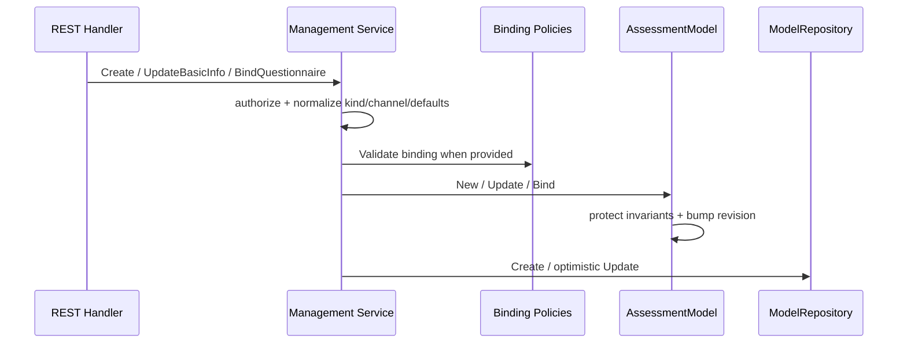
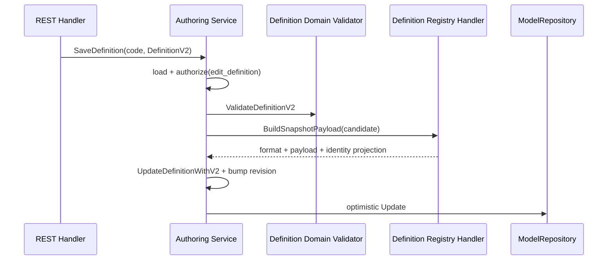
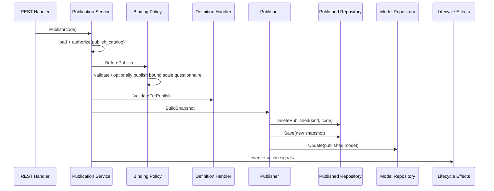

# 关键链路：模型创建、编辑与发布

## 1. 本文回答

本文从后台 REST 入口开始，说明 AssessmentModel 如何创建、绑定问卷、保存 DefinitionV2、校验和预览，再发布为 AssessmentSnapshot；同时明确 snapshot、draft、事件和缓存之间的顺序与失败边界。

## 2. 30 秒结论

```text
Create
  -> AssessmentModel draft

BindQuestionnaire + SaveDefinition
  -> revisioned authoring fact

Publish
  -> binding policy
  -> family publish validation
  -> build payload + AssessmentSnapshot
  -> replace active published row
  -> persist AssessmentModel status/revision
  -> best-effort event/cache effects
```

发布不是单个事务：published snapshot 与 draft aggregate 分属顺序写入，问卷发布还可能先于它们发生。失败排查必须分别核对 Questionnaire、`published_assessment_models` 和 `assessment_models`。

## 3. 入口、能力与应用服务

后台路由统一位于 `/api/v1/assessment-models`：

| 用例 | 代表入口 | Action / capability |
| --- | --- | --- |
| 目录管理 | create、basic-info、questionnaire、archive、delete | `manage_catalog` |
| Definition 编辑 | definition、validate、codes/apply、preview-report | `edit_definition` |
| 发布生命周期 | publish、unpublish | `publish_catalog` |
| 查询 | draft/published/options/hot/qrcode | `read_catalog` |

Transport 把 IAM snapshot、Principal 和 OrgScope 转成 `ActorContext`。Application service 再用 `Authorizer` 校验行为，不依赖 REST handler 已经做过的 capability middleware。

应用层按用例拆分：

| Service | 责任 |
| --- | --- |
| `management.Service` | 创建、元数据、问卷绑定、归档、删除、问卷版本同步 |
| `authoring.Service` | DefinitionV2 读写、结构校验、code 申请和报告预览 |
| `publication.Service` | 发布/下架与 snapshot 生命周期 |
| `query.Service` | draft/published 目录、选项、热榜和二维码 |

根 `application/modelcatalog` 只保留共享 contract、DTO、授权和 projection，不承载具体 use case。

## 4. 创建与目录编辑



### 4.1 创建

`management.Create`：

1. 将 API kind 映射为 canonical domain kind。
2. 校验新模型 ProductChannel。
3. 校验 `manage_catalog` 权限。
4. scale 未提供 code 时生成 code；其它 kind 要求请求提供 code。
5. 补齐默认 SubKind/Algorithm：scale_default、typology sub-kind、brief2 或 spm。
6. 创建 draft AssessmentModel。
7. scale 初始化 audience metadata 和基础 Definition projection。
8. 请求携带 binding 时先执行对应 policy，再写入聚合。
9. `ModelRepository.Create` 写入 `assessment_models`。

### 4.2 元数据与问卷绑定

更新基本信息和绑定都会推进 revision，并由 Mongo `code + previous version` 做乐观锁。scale 变更 audience/binding 后会刷新兼容 draft payload projection。

Binding policy：

- scale 校验 MedicalScale 类型和一问卷一 scale；
- typology 解析已发布、非空问卷，并写回精确 version；
- 其它 kind 当前只使用聚合的 code/version 完整性守卫。

## 5. Definition 编辑、校验与预览



保存 Definition 时，服务先做纯领域校验，再复制模型作为 candidate 交给 family handler 构造 payload。只有投影非空才同时保存：

```text
DefinitionV2
+ DefinitionPayload(format, bytes)
+ new revision
```

这保证 authoring 阶段已经能投影 wire artifact，但不替代发布校验。发布还会检查问卷、Norm 和算法特有条件。

`ValidateDefinition` 当前只返回 Definition 内部结构问题；`PreviewReport` 通过 Registry 分派，当前只有 typology handler 提供端到端报告预览，并会校验绑定问卷、答案和模型运行规格。

## 6. 发布链路



实际顺序：

1. 加载 AssessmentModel 并授权。
2. 执行 binding `BeforePublish`；scale 可能先发布/同步绑定 Questionnaire。
3. scale 刷新 draft compatibility projection。
4. Registry 按 identity 选择 handler，执行 aggregate、Definition、Norm/Questionnaire 和 family 校验。
5. `MarkPublished` 推进 status/revision。
6. handler 从 DefinitionV2 构建 payload、DecisionKind 和 snapshot identity。
7. soft-delete 同 kind/code 的 active published row。
8. 保存新的 AssessmentSnapshot。
9. 乐观更新 `assessment_models` 中的 status/revision。
10. 持久化成功后 best-effort 发布 `assessment_model.changed`，并发送 scale/typology 缓存信令。

`assessment_model.changed` 在 [`configs/events.yaml`](../../../configs/events.yaml) 中是 `best_effort`，不构成发布事实源。

## 7. 下架、归档与删除

| 动作 | 当前顺序与约束 |
| --- | --- |
| Unpublish | 聚合标记 draft → soft-delete active snapshot → 更新 model → effects |
| Archive | 若已发布先 soft-delete snapshot → 聚合标记 archived → 更新 model → effects |
| Delete | 只允许 archived；确认不存在 active published row 后删除 model |
| Questionnaire version sync | 仅可信服务 actor；只更新绑定该问卷的 draft 模型 |

Archive 是终态；Delete 不负责删除 Norm，因为 Norm 可以被其它模型引用。

## 8. 一致性与失败边界

| 失败位置 | 已可能成立的事实 | 当前恢复/风险 |
| --- | --- | --- |
| scale `BeforePublish` 发布问卷后，模型发布失败 | Questionnaire 新版本已发布，模型仍未发布 | 修复模型配置后重试；无跨模块回滚 |
| 删除旧 snapshot 后，新 snapshot 保存失败 | 当前没有 active snapshot | 旧 row 已 soft-delete，需要重新发布 |
| 新 snapshot 保存后，ModelRepository 更新失败 | Publisher 会 soft-delete刚保存的 snapshot | model DB 仍保持旧状态；旧 snapshot 不自动恢复 |
| Unpublish/Archive 删除 snapshot 后，model 更新失败 | snapshot 已不可见，model 可能仍显示 published | 需分别修复两 collection 的状态 |
| event/cache effect 失败 | model 与 snapshot 已成功提交 | effect 不反转发布结果；以 Mongo 为事实源 |

Publisher 对“新 snapshot 已写、model 更新失败”做了删除补偿，但整个链路仍不是事务，也不能恢复此前被替换的 active snapshot。

## 9. 排障顺序

1. 检查 `assessment_models` 的 code、status、revision、binding 和 DefinitionV2。
2. 检查 `published_assessment_models` 是否有 active kind/code/version，DefinitionV2 是否存在。
3. 检查绑定 Questionnaire 的 code/version 和发布状态。
4. 涉及常模时检查 `assessment_norms` 的 table version。
5. 最后检查 `assessment_model.changed`、cache signal 和读侧缓存。

API 返回值、事件日志或缓存命中都不能单独证明发布事实完整。

## 10. 事实源与验证

| 环节 | 路径 |
| --- | --- |
| REST 路由与 Handler | [`routes_assessment_model.go`](../../../internal/apiserver/transport/rest/routes_assessment_model.go)、[`handler/assessment_model.go`](../../../internal/apiserver/transport/rest/handler/assessment_model.go) |
| Management / Authoring | [`application/modelcatalog/management`](../../../internal/apiserver/application/modelcatalog/management/)、[`authoring`](../../../internal/apiserver/application/modelcatalog/authoring/) |
| Publication / Publisher | [`application/modelcatalog/publication`](../../../internal/apiserver/application/modelcatalog/publication/) |
| Binding policies | [`application/modelcatalog/binding`](../../../internal/apiserver/application/modelcatalog/binding/) |
| Registry / effects wiring | [`container/modules/modelcatalog`](../../../internal/apiserver/container/modules/modelcatalog/) |
| Mongo repositories | [`infra/mongo/modelcatalog`](../../../internal/apiserver/infra/mongo/modelcatalog/) |

```bash
go test ./internal/apiserver/application/modelcatalog/management ./internal/apiserver/application/modelcatalog/authoring ./internal/apiserver/application/modelcatalog/publication
go test ./internal/apiserver/infra/mongo/modelcatalog
go test ./internal/apiserver/container/modules/modelcatalog/...
go test ./internal/apiserver/transport/rest/handler -run AssessmentModel
```
