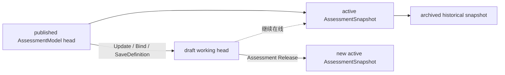
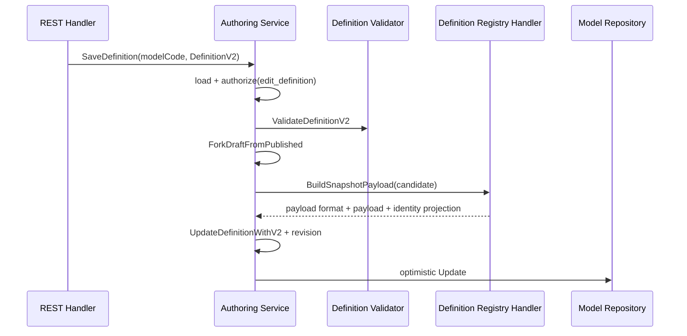
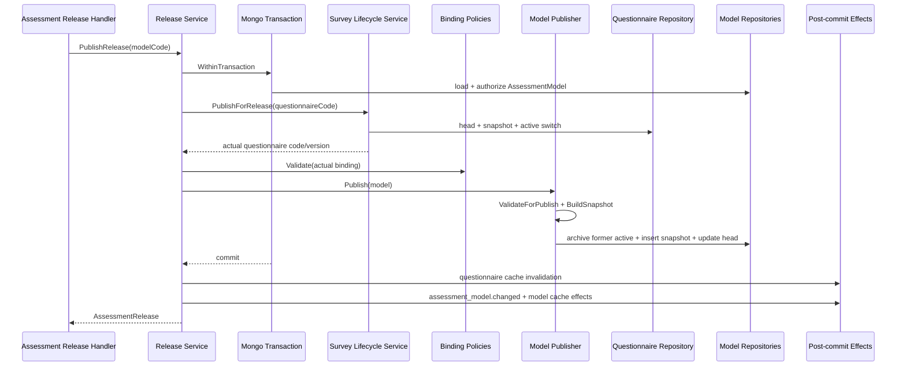

# 关键链路：模型创建、编辑与发布

## 1. 本文回答

本文从运营后台的模型编辑流程出发，说明 AssessmentModel 如何创建、绑定 Questionnaire、维护 DefinitionV2、校验和预览，最终通过 Assessment Release 与精确问卷版本共同发布。

本文重点回答：

1. AssessmentModel head 与运行时 snapshot 为什么必须分离？
2. Questionnaire 和 AssessmentModel 分属两个模块，为什么发布时却要进入一个 MongoDB 事务？
3. DefinitionV2、DefinitionPayload 与 AssessmentSnapshot 各自是什么性质？
4. 新版本发布失败时，系统保证了什么，又没保证什么？

## 2. 30 秒结论

```text
Create
  -> AssessmentModel draft head

BindQuestionnaire + SaveDefinition
  -> 可编辑、带 revision 的 authoring fact

POST /assessment-releases/:modelCode/publish
  -> 一个 Mongo session transaction
     -> 发布或复用精确 Questionnaire snapshot
     -> 校验并更新 QuestionnaireBinding
     -> 校验 DefinitionV2 与模型家族规则
     -> 生成 AssessmentModel published snapshot
     -> 更新 AssessmentModel head
  -> commit
  -> event / cache post-commit effects
```

当前对外发布单元不是孤立 AssessmentModel，而是：

```text
Questionnaire snapshot
  + exact QuestionnaireBinding
  + AssessmentModel snapshot
  = Assessment Release
```

Assessment Release 是跨 Survey 与 ModelCatalog 的**应用一致性边界**：它负责事务编排，但不夺走 Survey 对 Questionnaire 规则的所有权，也不把两个聚合强行合并。

## 3. 核心对象与记录角色

| 对象 | 性质 | 主要职责 |
| --- | --- | --- |
| AssessmentModel head | 可变编辑事实 | 保存身份、元数据、QuestionnaireBinding、DefinitionV2、revision 和工作状态 |
| QuestionnaireBinding | 模型内的精确引用 | 冻结 questionnaire code/version，使执行期知道模型针对哪份问卷定义 |
| DefinitionV2 | canonical 模型语义 | 定义测量、校准、执行、结论、Outcome 和 ReportMap |
| DefinitionPayload | 由 DefinitionV2 投影的 wire artifact | 服务历史运行时与兼容代码，不能反向取代 DefinitionV2 |
| AssessmentSnapshot | 不可变发布快照 | 为 Evaluation、Plan 和 collection 提供只读 published-only 模型 |
| AssessmentRelease | 应用层发布结果和一致性边界 | 协调 Questionnaire 和 AssessmentModel 共同生效，不是新聚合或微服务 |

`AssessmentModel.status`、head revision、snapshot release version 和 release status 是不同概念。head 可以已因新编辑变成 draft，而旧 active snapshot 仍继续在线服务。

## 4. REST 入口、权限与应用服务

### 4.1 两组对外资源

| 资源 | 用例 | 代表入口 | 权限 |
| --- | --- | --- | --- |
| `/api/v1/assessment-models` | 创建、基本信息、问卷绑定、删除 | `POST /assessment-models`、`PUT /:code/basic-info`、`PUT /:code/questionnaire` | manage catalog |
| `/api/v1/assessment-models` | Definition 编辑、校验、code 申请、报告预览 | `PUT /:code/definition`、`POST /:code/validate`、`POST /:code/preview-report` | edit definition |
| `/api/v1/assessment-models` | head、published catalog、options、hot、qrcode 查询 | `GET /:code`、`GET /published/:code` | read catalog |
| `/api/v1/assessment-releases` | 联合发布、下架、归档 | `POST /:code/{publish\|unpublish\|archive}` | publish catalog |
| `/api/v1/assessment-releases` | 历史发布版本 | `GET /:code/versions` | read catalog |

Transport 把 IAM snapshot、Principal 和 OrgScope 转成 `ActorContext`。Application service 仍会使用 `Authorizer` 校验 action，不依赖 REST capability middleware 作为唯一权限守卫。

### 4.2 当前应用服务分工

| Service | 当前职责 |
| --- | --- |
| `management.Service` | 创建、元数据、问卷绑定、删除和内部问卷版本同步 |
| `authoring.Service` | DefinitionV2 读写、结构校验、code 申请和报告预览 |
| `release.Service` | 对外 Assessment Release 发布、下架和归档，统一事务边界 |
| `publication.Publisher` | 在 release transaction 内执行模型校验、快照构建和持久化 |
| `query.Service` | head/published 目录、发布历史、选项、热榜和二维码查询 |

> **当前兼容残留：** `publication.Service` 仍被组合根装配并导出为 `PublicationService`，它保留 `Bindings.BeforePublish` 和旧模型独立发布流程；但当前 `assessmentModelPublicationRoutes` 返回空路由集，没有公开 REST 入口。对外当前主链路必须以 `release.Service` 为准，不应再用旧 `publication.Service.Publish` 解释运营发布。

## 5. 创建 AssessmentModel head

`management.Create` 的当前流程是：

1. 将 API kind 映射为 canonical domain kind。
2. 校验 ProductChannel 与 kind 的组合。
3. 校验 `manage_catalog` 权限。
4. Scale 未提供 code 时生成 code；其它 kind 要求请求提供 code。
5. 补齐家族的默认 SubKind/Algorithm。
6. 创建 draft AssessmentModel head。
7. Scale 初始化 audience metadata 和基础 Definition projection。
8. 如请求已带 binding，先经过对应 Binding Policy 校验，再写入聚合。
9. `ModelRepository.Create` 写入 `assessment_models` head。

AssessmentModel head 是运营编辑事实，创建成功不表示模型已进入 published-only 运行时目录。

## 6. 编辑 head 不下架当前 snapshot



`UpdateBasicInfo`、`BindQuestionnaire`、`SaveDefinition` 和报告图片编辑等用例，在修改已发布 head 时会先调用 `ForkDraftFromPublished`：

- head 从 published 派生为 draft；
- 派生操作本身不额外推进 revision，后续真实编辑命令负责一次 revision 变更；
- 旧 active snapshot 不被删除，运行时仍然可用；
- 查询结果可以通过 `ReleaseState.HasUnpublishedChanges` 表达“工作 head 已有未发布修改”。

Repository 使用 head 的 code 和 previous revision 执行乐观并发控制。这保护的是多个运营编辑者不要静默相互覆盖，不是用 revision 代替业务发布版本。

## 7. QuestionnaireBinding 策略

QuestionnaireBinding 冻结 `questionnaire_code + questionnaire_version`，但不同模型家族的校验规则不同。`binding.Policies` 按 `Kind + SubKind + Algorithm` 选择 policy：

| 模型家族 | 当前 binding 规则 |
| --- | --- |
| Scale | questionnaire code 必填；问卷必须存在且类型为 `MedicalScale`；同一问卷不能绑定到另一个 Scale；如指定 version，该版本必须存在 |
| Typology | questionnaire code 必填；指定版本时读精确 published snapshot，未指定时解析 active published snapshot；问卷必须包含题目 |
| Cognitive / BehavioralRating | 当前没有专用 Binding Policy，`Policies.Validate` 原样返回 binding；完整发布条件仍可由家族 Definition handler 校验 |

在 Assessment Release 中，客户端不决定最终 questionnaire version。Release service 先调用 Survey `PublishForRelease`，再使用实际返回的 code/version 执行 Binding Policy；如该版本与 head 中旧 binding 不同，在同一事务中更新 binding。

详细的问卷发布所有权见 [Survey：问卷维护与发布](../10-survey/30-关键链路-问卷维护与发布.md)。

## 8. DefinitionV2 编辑、校验与预览



SaveDefinition 不是把一段任意 JSON 原样保存到模型，而是：

1. 对 DefinitionV2 做纯结构和跨层校验。
2. 从已发布 head 派生 draft。
3. 复制 AssessmentModel 为 candidate，交给 identity 对应的 Registry handler 构建快照 payload。
4. 只有投影成功且 payload 非空时，才在 head 上同时保存 DefinitionV2、DefinitionPayload 和新 revision。

这保证 authoring 阶段已能发现部分结构和投影问题，但不替代发布校验。`ValidateDefinition` 会调用 family handler 的 `ValidateForPublish`，而真正发布时 `publication.Publisher` 仍会再执行一次。

`PreviewReport` 通过 Registry 分派到家族预览能力。预览是编辑期辅助能力，不生成 published snapshot，也不代表 Assessment Release 已成功。

## 9. Assessment Release 联合发布

### 9.1 入口与主链路

```http
POST /api/v1/assessment-releases/:modelCode/publish
```



### 9.2 事务内执行顺序

1. 按 model code 加载 AssessmentModel head，并校验 `publish_catalog`。
2. 如 model head 已是 published，幂等返回当前 release，不重复执行提交后 effects。
3. 要求 model 已绑定 questionnaire code。
4. 调用 Survey `PublishForRelease`；Questionnaire head 已是 published 时幂等复用当前版本，否则在事务中生成新快照并切换 active version。
5. 用 Survey 返回的精确 code/version 执行 Binding Policy。
6. 如 binding 变化，更新 AssessmentModel；Scale 同时刷新 draft projection。
7. `publication.Publisher` 通过 Registry handler 执行 aggregate、Definition、Questionnaire/Norm 和家族特有发布校验。
8. `MarkPublished` 推进 model status/revision，handler 从 DefinitionV2 构建 payload、DecisionKind 和 snapshot identity。
9. 将旧 active AssessmentSnapshot 标记为 archived，插入新 active snapshot，再更新 AssessmentModel head。
10. 提交 Mongo session transaction。
11. 提交后删除问卷查询缓存，再执行 AssessmentModel lifecycle effects。

当只编辑了已绑定 Questionnaire，但 AssessmentModel head 仍是 published 时，重复调用 PublishRelease 会幂等返回当前 release，不会单独发布这份 Questionnaire draft。要形成新的联合发布版本，Model head 也必须先通过元数据、binding 或 Definition 编辑进入 draft。

### 9.3 事务与提交后 effects

Mongo transaction 内只确立发布事实。如任一问卷、binding、Definition 或模型快照步骤失败，本次 Questionnaire 与 AssessmentModel 变更共同回滚。

提交成功后才执行：

- cached Questionnaire Repository 已装配时的问卷缓存删除；
- published model 缓存失效；
- best-effort `assessment_model.changed`；
- Scale 或 Typology 对应的 ephemeral cache signal。

`assessment_model.changed` 和缓存信令不是发布事实源，不反转已提交的 Mongo 事实。当前 Assessment Release 不另外发布 `questionnaire.changed`，也不发送 `questionnaire_cache_changed`；该差异留给缓存与事件基础设施文档进一步评估。

## 10. 发布快照、历史版本与运行时读

`assessment_models` 同时保存 head 和 published snapshot，通过 record role 与 release status 区分：

| 记录 | 用途 |
| --- | --- |
| head | 作者持续编辑、乐观锁更新和当前工作状态 |
| active published snapshot | 新 Assessment intake、运行时目录和对外查询的当前版本 |
| archived published snapshot | 历史 Assessment 精确版本执行、故障重放和审计追溯 |

Publisher 写入新 snapshot 时：

1. 先按 `kind + code` 将旧 active release 标记为 archived；
2. 插入新 active snapshot；
3. 同一 release version 内容完全相同时幂等返回；
4. 同版本内容不同或尝试重新激活已归档 release 时拒绝。

`GET /api/v1/assessment-releases/:code/versions` 列出保留的 model version、questionnaire code/version、release status 和发布/归档时间。

必须区分两类读取：

- 新测评受理只能读 active published snapshot；
- 历史 worker 重放可以按精确 model version 读保留 snapshot。

如果所有读取都只解析 active snapshot，模型发布新版本后，旧 Assessment 的重试将无法重现原始计分和结论。

## 11. 下架、归档与删除

| 动作 | 当前公开入口 | 当前语义 |
| --- | --- | --- |
| Unpublish Release | `POST /assessment-releases/:code/unpublish` | 在同一 Mongo transaction 中下架 Questionnaire/AssessmentModel active snapshot，将两边工作状态转回 draft |
| Archive Release | `POST /assessment-releases/:code/archive` | 在同一 Mongo transaction 中归档 Questionnaire 和 AssessmentModel family，保留历史 snapshot |
| Delete Model | `DELETE /assessment-models/:code` | 只允许 archived model，且必须已无 active published row；不删除 Questionnaire 或 Norm |

下架和归档只改变“是否可以继续发起新测评”，不销毁“已完成测评当时使用了什么”。

## 12. 一致性与失败边界

| 失败位置 | 当前保证 | 排查重点 |
| --- | --- | --- |
| Questionnaire 发布失败 | Model binding/snapshot 不提交 | Questionnaire 发布校验和 Mongo 错误 |
| Binding Policy 失败 | 本次 Questionnaire 变更随事务回滚 | 问卷类型、唯一性、精确版本 |
| Definition/family 校验失败 | Questionnaire、binding 和 model 本次变更共同回滚 | Definition issues、Norm、Questionnaire 与 handler 日志 |
| snapshot 或 head 写入失败 | 不出现只有一边新 release 成为 active 的提交结果 | `transaction_result=rolled_back` 与两边 active rows |
| 事务 commit 失败 | 不执行 post-commit effects | transaction 日志 |
| event/cache effect 失败 | 已提交 release 不回滚 | Mongo 事实与读侧收敛分开核对 |

Assessment Release 使用 Mongo session transaction，因此部署环境必须是支持 transaction 的 Replica Set 或分片集群。这是联合发布保证成立的运行前提，不只是测试环境优化项。

## 13. 为什么选择 Assessment Release

| 方案 | 优点 | 主要问题 | 结论 |
| --- | --- | --- | --- |
| 先发布 Questionnaire，再发布 AssessmentModel | 两个模块各自接口简单 | 第二步失败会产生部分发布 | 已绑定测评不采用 |
| 用事件异步促成两边最终一致 | 跨库和拆服务能力强 | 发布期存在中间态，需要 saga、补偿、可见性隔离和更复杂运营流程 | 当前无独立服务/数据库驱动，不采用 |
| 把 Questionnaire 合并进 AssessmentModel 聚合 | 单聚合事务直观 | 问卷不再能独立作为信息收集器，题型边界与模型边界混合 | 不采用 |
| 保留聚合边界，由 Assessment Release 统一 Mongo 事务 | 保留模块独立性，又保证发布原子性 | 应用服务需要同时协调两个模块 | **当前方案** |

这里的关键不是“一个事务可以跨几个目录”，而是：

> 业务上必须共同生效的事实，需要一个明确的一致性边界；模块仍通过自己的应用端口与领域规则参与，不因为共享事务就失去所有权。

## 14. 排障顺序

1. 查看 Assessment Release 日志中的 `model_code`、`questionnaire_code`、`questionnaire_version`、`transaction_result` 和耗时。
2. 检查 AssessmentModel head 的 kind/subkind/algorithm、status、revision、binding 和 DefinitionV2。
3. 检查 Questionnaire head、本次目标 snapshot 和 active version。
4. 检查 `assessment_models` 的新 active snapshot，其 DefinitionV2、payload 和 questionnaire code/version 是否完整。
5. 涉及常模时检查 `assessment_norms` 及其精确 table version。
6. 只在 Mongo 发布事实正确后，继续检查 `assessment_model.changed`、cache signal、二维码后置动作和读侧缓存。

API 返回、事件日志或缓存命中都不能单独证明 Assessment Release 完整。最终应同时核对 Questionnaire snapshot、AssessmentModel binding 和 AssessmentSnapshot。

## 15. 事实源与验证

| 环节 | 事实源 |
| --- | --- |
| REST 路由与 Handler | [`routes_assessment_model.go`](../../../internal/apiserver/transport/rest/routes_assessment_model.go)、[`handler/assessment_release.go`](../../../internal/apiserver/transport/rest/handler/assessment_release.go) |
| Management / Authoring | [`application/modelcatalog/management`](../../../internal/apiserver/application/modelcatalog/management/)、[`authoring`](../../../internal/apiserver/application/modelcatalog/authoring/) |
| Assessment Release | [`application/modelcatalog/release`](../../../internal/apiserver/application/modelcatalog/release/) |
| Snapshot Publisher / Definition Registry | [`application/modelcatalog/publication`](../../../internal/apiserver/application/modelcatalog/publication/)、[`definition`](../../../internal/apiserver/application/modelcatalog/definition/) |
| Binding policies | [`application/modelcatalog/binding`](../../../internal/apiserver/application/modelcatalog/binding/) |
| 组合根与 lifecycle effects | [`container/modules/modelcatalog`](../../../internal/apiserver/container/modules/modelcatalog/) |
| Model Mongo repositories | [`infra/mongo/modelcatalog`](../../../internal/apiserver/infra/mongo/modelcatalog/) |
| Questionnaire 联合发布协作者 | [`application/survey/questionnaire`](../../../internal/apiserver/application/survey/questionnaire/) |
| 事件与信令 | [`configs/events.yaml`](../../../configs/events.yaml)、[`configs/signals.yaml`](../../../configs/signals.yaml) |

```bash
go test ./internal/apiserver/application/modelcatalog/management
go test ./internal/apiserver/application/modelcatalog/authoring
go test ./internal/apiserver/application/modelcatalog/release
go test ./internal/apiserver/application/modelcatalog/publication
go test ./internal/apiserver/infra/mongo/modelcatalog
go test ./internal/apiserver/container/modules/modelcatalog/...
go test ./internal/apiserver/transport/rest -run 'AssessmentModel|AssessmentRelease|OpenAPI'
```
