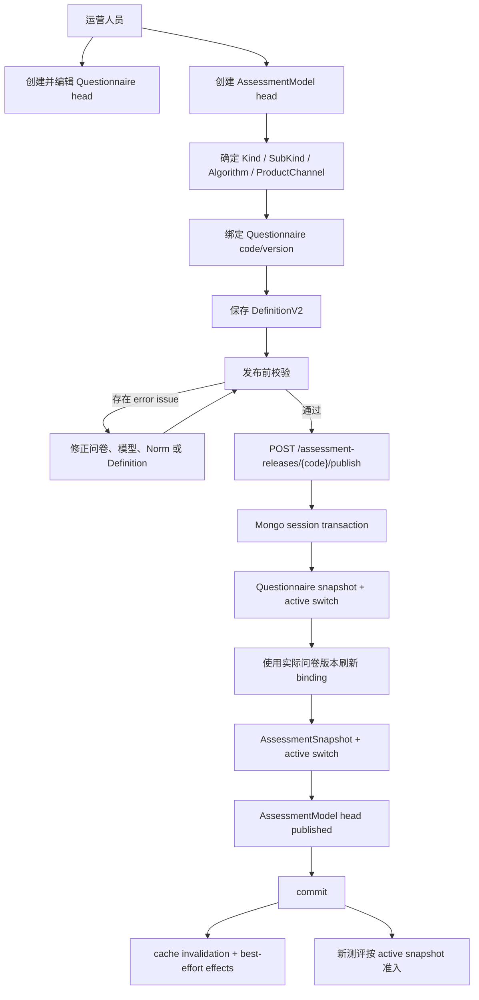
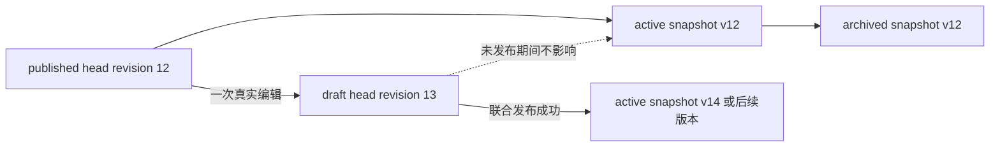
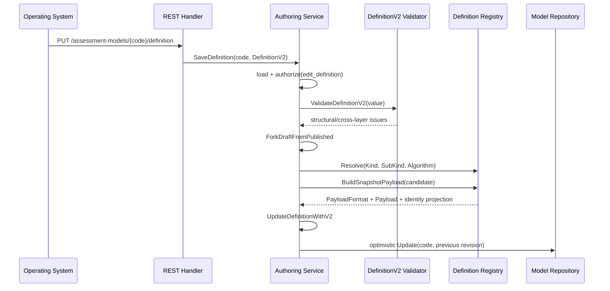
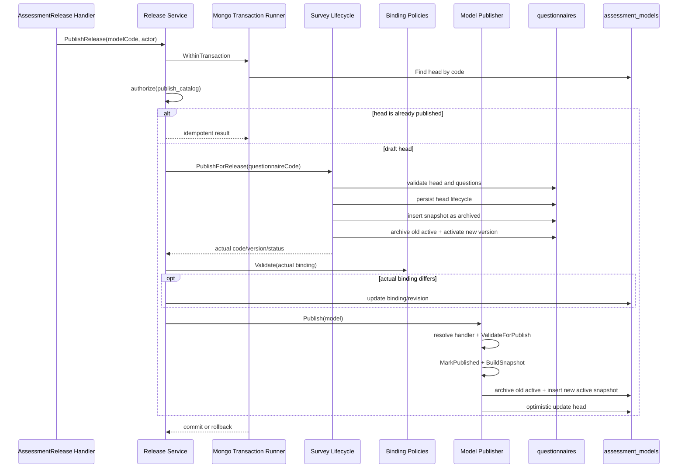

# 关键链路：模型创建、编辑与联合发布

> 状态：主链路已实现。AssessmentModel 与绑定 Questionnaire 已通过同一个 Mongo session transaction 联合发布，发布快照与工作 head 已分离，发布后编辑不会改写历史快照。首次发布后的模型身份锁定、发布幂等后置条件、类型学图片上传的 revision 处理和真实 Replica Set 集成验证仍有明确缺口。

## 1. 本文回答

本文站在运营人员维护一份测评模型的视角，把前面几篇文档中的静态设计串成一条真实命令链，重点回答：

1. 创建一个 AssessmentModel 时，系统会补齐哪些默认身份和初始定义？
2. 基本信息、QuestionnaireBinding 与 DefinitionV2 为什么要分开编辑？
3. 已发布模型再次编辑时，为什么旧版本仍然可以继续在线服务？
4. 编辑期校验、报告预览与正式发布校验有什么区别？
5. 为什么运营发布的不是一条 Model 记录，而是一对 QuestionnaireSnapshot + AssessmentSnapshot？
6. 联合发布事务内具体执行哪些步骤，任一步失败会留下什么？
7. model revision、model release version 与 questionnaire version 怎样变化？
8. 重复发布、并发发布、下架、归档和删除分别是什么语义？
9. 当前实现还有哪些不能被文档掩盖的边界缺口？

本文不重复讲解 DefinitionV2、问卷版本和 Mongo 存储结构的全部细节：

- 模型定义与扩展机制见 [DefinitionV2 与模型扩展](./20-核心设计-DefinitionV2与模型扩展.md)；
- 模型身份与算法绑定见 [模型身份、算法绑定与执行路由](./21-核心设计-模型身份、算法绑定与执行路由.md)；
- QuestionnaireBinding 与发布版本语义见 [问卷绑定与发布版本](./22-核心设计-问卷绑定与发布版本.md)；
- 数据文档、索引、乐观锁和事务底座见 [数据存储与一致性](./26-核心设计-数据存储与一致性.md)。

---

## 2. 30 秒结论

一份可执行测评不是“保存一段模型 JSON”就完成了。当前真实主链路是：

```text
运营创建 Questionnaire head
  -> 编辑题目与答案规则

运营创建 AssessmentModel head
  -> 选择 Kind / SubKind / Algorithm / ProductChannel
  -> 绑定 Questionnaire code/version
  -> 编辑 DefinitionV2
  -> 校验完整性与家族规则
  -> 可选：预览报告

POST /api/v1/assessment-releases/{modelCode}/publish
  -> Mongo session transaction
     1. 发布或复用 Questionnaire 的精确版本
     2. 用实际发布版本刷新 QuestionnaireBinding
     3. 按 Kind + SubKind + Algorithm 解析 Definition handler
     4. 校验完整模型
     5. 从 DefinitionV2 生成运行时 payload
     6. 保存不可变 AssessmentSnapshot
     7. 切换 Questionnaire 与 Model 的 active release
     8. 更新 AssessmentModel head
  -> commit
  -> 事务后失效缓存、发送 best-effort 生命周期信号
```

因此，对绑定了测评模型的问卷而言，真正的发布单元是：

```text
Assessment Release
  = 精确 QuestionnaireSnapshot
  + 精确 QuestionnaireBinding
  + 不可变 AssessmentSnapshot
```

Assessment Release 是跨 Survey 与 ModelCatalog 的**应用一致性边界**。它没有把 Questionnaire 和 AssessmentModel 合并为一个聚合，也没有夺走两个模块各自的规则所有权；它只保证业务上必须共同生效的两个发布事实原子提交。

发布后的编辑遵循另一条重要规则：

> 工作 head 可以继续变成 draft，旧 active snapshot 仍然在线；只有下一次联合发布成功，新快照才替换旧 active 版本。

---

## 3. 先建立正确的状态语言

排查运营发布问题时，最容易犯的错误是只看一个 `status`。当前至少要同时观察四类状态或版本：

| 名称 | 回答的问题 | 当前载体 |
| --- | --- | --- |
| AssessmentModel working status | 运营正在编辑的 head 是 draft、published 还是 archived？ | `AssessmentModel.Status` |
| AssessmentModel revision | head 被修改了多少次，用什么值保护并发更新？ | `AssessmentModel.Version`，领域代码称 `Revision()` |
| AssessmentSnapshot release version | 某次模型发布快照的精确标识是什么？ | 由发布时 revision 自动生成，如 `v12` |
| Questionnaire version | 这次测评使用哪一份精确问卷语义？ | `QuestionnaireBinding.QuestionnaireVersion` |
| Release status | 某个模型快照当前是否接受新测评？ | `active` 或 `archived` |

它们不能相互替代。例如：

```text
AssessmentModel head
  status = draft
  revision = 13

active AssessmentSnapshot
  release_version = v12
  release_status = active

QuestionnaireBinding
  questionnaire_version = 3.0
```

这不是异常，而是“v12 仍在线，运营正在编辑 revision 13”的正常状态。

查询层会把这种组合投影为 `ReleaseState`：

| 字段 | 含义 |
| --- | --- |
| `working_status` | head 当前状态 |
| `working_version` | 当前 head revision 的 `vN` 表示 |
| `online_status` | 是否存在 active snapshot |
| `active_version` | 当前 active model release version |
| `has_unpublished_changes` | head 是否为 draft，或 working version 与 active version 不同 |

所以，运营界面判断“是否存在未发布修改”不能只写成 `status == draft`，也不能只比较 Questionnaire version。

---

## 4. 参与者、入口与权限

### 4.1 谁可以维护模型

按照当前业务口径：

- Questionnaire 与 AssessmentModel 只能由运营人员维护和发布；
- 医生只选择已经发布的测评并发起测评；
- 患者和家长只消费已发布的问卷与报告；
- 运行时 Evaluation/Worker 不读取运营草稿。

REST 层从 IAM principal、organization scope 等身份事实组装 `ActorContext`。Capability middleware 是第一层入口保护，Application service 的 `Authorizer` 是第二层用例保护。即使未来增加 gRPC、内部任务或新的适配器，也不能绕过应用层授权。

### 4.2 对外 REST 资源

| 能力 | 入口 | Capability | Application service |
| --- | --- | --- | --- |
| 创建模型 | `POST /api/v1/assessment-models` | `manage_assessment_models` | `management.Service.Create` |
| 编辑基本信息 | `PUT /api/v1/assessment-models/{code}/basic-info` | `manage_assessment_models` | `management.Service.UpdateBasicInfo` |
| 绑定问卷版本 | `PUT /api/v1/assessment-models/{code}/questionnaire` | `manage_assessment_models` | `management.Service.BindQuestionnaire` |
| 删除已归档模型 | `DELETE /api/v1/assessment-models/{code}` | `manage_assessment_models` | `management.Service.Delete` |
| 读取/保存 DefinitionV2 | `GET/PUT /api/v1/assessment-models/{code}/definition` | `edit_assessment_model_definitions` | `authoring.Service` |
| 申请定义编码 | `POST /api/v1/assessment-models/{code}/codes/apply` | `edit_assessment_model_definitions` | `authoring.Service.ApplyCodes` |
| 发布前校验 | `POST /api/v1/assessment-models/{code}/validate` | `edit_assessment_model_definitions` | `authoring.Service.ValidateDefinition` |
| 报告预览 | `POST /api/v1/assessment-models/{code}/preview-report` | `edit_assessment_model_definitions` | `authoring.Service.PreviewReport` |
| 上传人格 Outcome 图片 | `POST /api/v1/assessment-models/{code}/outcomes/{outcome_code}/image` | `edit_assessment_model_definitions` | `assets.Service.UploadOutcomeImage` |
| 联合发布 | `POST /api/v1/assessment-releases/{code}/publish` | `publish_assessment_models` | `release.Service.PublishRelease` |
| 联合下架 | `POST /api/v1/assessment-releases/{code}/unpublish` | `publish_assessment_models` | `release.Service.UnpublishRelease` |
| 联合归档 | `POST /api/v1/assessment-releases/{code}/archive` | `publish_assessment_models` | `release.Service.ArchiveRelease` |
| 发布历史 | `GET /api/v1/assessment-releases/{code}/versions` | `read_assessment_models` | `query.Service.ListReleaseVersions` |

当前 `assessmentModelPublicationRoutes` 返回空路由集。也就是说，对外没有“只发布 AssessmentModel”的 REST 操作；公开生命周期入口已经收敛到 `/assessment-releases`。

### 4.3 应用服务为什么拆开

| Service | 拆分理由 |
| --- | --- |
| `management.Service` | 管理模型身份、目录元数据、问卷绑定和删除 |
| `authoring.Service` | 管理 DefinitionV2、编码申请、发布校验与预览 |
| `assets.Service` | 管理私有对象存储中的不可变图片，不把二进制塞进 Definition |
| `release.Service` | 建立 Questionnaire + AssessmentModel 的联合事务边界 |
| `publication.Publisher` | 在事务内完成模型校验、payload 物化和 snapshot 持久化 |
| `query.Service` | 分离工作 head、active catalog 和历史 release 的读取语义 |

这不是为了制造更多“Service”名称，而是为了让每类命令的事务范围与权限边界清晰。尤其是 `release.Service` 与 `publication.Publisher` 的关系：前者负责跨模块协调，后者只负责 ModelCatalog 一侧的发布物化。

---

## 5. 全链路总图



主链路里有三个不同的“验证时点”：

1. **命令输入验证**：字段是否存在、枚举是否支持、图片是否合法；
2. **编辑保存验证**：DefinitionV2 是否结构正确，能否投影成当前模型家族 payload；
3. **正式发布验证**：问卷、模型身份、Factor、可选 Norm、Decision、执行规格和家族规则是否共同构成可执行测评。

前一个时点通过，不代表后一个时点必然通过。

---

## 6. 第一步：创建 AssessmentModel head

### 6.1 创建请求表达什么

`POST /api/v1/assessment-models` 接受的核心信息包括：

- `code`；
- `kind`、`sub_kind`、`algorithm`；
- `product_channel`；
- `title`、`description`、`category`、`tags`；
- Scale 使用的 `stages`、`applicable_ages`、`reporters`；
- 可选的 `questionnaire_code`、`questionnaire_version`。

创建请求可以同时带问卷绑定，但这只是操作便利，不代表 Questionnaire 已被 ModelCatalog 吞并。绑定仍会经过 family-specific policy。

### 6.2 创建服务的真实顺序

`management.Service.Create` 当前按以下顺序执行：

1. 将 API `kind` 映射为 canonical domain `Kind`；
2. 校验新模型的 `ProductChannel`；
3. 按模型族执行 `manage_catalog` 授权；
4. 决定 model code；
5. 补齐默认 `SubKind` 与 `Algorithm`；
6. 调用 `NewAssessmentModel` 创建 `draft` head；
7. Scale 写入 audience metadata，并初始化空的 canonical DefinitionV2 与兼容投影；
8. 请求带问卷绑定时，先执行 Binding Policy，再写入聚合；
9. 通过 `ModelRepository.Create` 保存到 `assessment_models` 的 head 记录。

创建后的模型只回答：

> 运营已经开始维护一份怎样的测评模型？

它不回答：

> 这份模型是否已经允许患者发起测评？

后一个问题只能由 active published snapshot 回答。

### 6.3 当前默认值

| Kind | 默认 SubKind | 默认 Algorithm | 默认 ProductChannel | code 行为 |
| --- | --- | --- | --- | --- |
| `scale` | 空 | `scale_default` | `medical_scale` | 未传时由服务生成 |
| `typology` | `typology` | `personality_typology` | `typology` | 当前要求请求提供 |
| `behavioral_rating` | 空 | `brief2` | `behavior_ability` | 当前要求请求提供 |
| `cognitive` | 空 | `spm` | `behavior_ability` | 当前要求请求提供 |

这些默认值是创建便利和当前兼容矩阵，不是永远不变的领域定律。尤其是 `behavioral_rating` 还支持 `spm_sensory`，不能把默认 `brief2` 理解成该模型族只有一种算法。

### 6.4 创建成功仍可能不具备发布条件

创建只建立合法 head，不要求一开始就完整。以下状态都可能正常存在于草稿期：

- 尚未绑定 Questionnaire；
- DefinitionV2 只有空结构；
- Factor 尚未完成；
- NormRef 尚未选择；
- Decision 尚未配置；
- 报告解释资料尚未完成。

但发布边界更严格：QuestionnaireBinding、模型身份、算法绑定、可计算 Factor/Measure 和 Decision 都必须成立；Norm 按模型需要可选。只有 Factor 而没有 Decision 的配置不能发布为完整测评模型。

---

## 7. 第二步：编辑工作 head

### 7.1 为什么发布后编辑不直接改在线记录

当前系统采用 head/snapshot 分离：



当编辑命令加载到 published head 时，会先调用 `ForkDraftFromPublished`：

- head 的 `status` 改为 `draft`；
- `published_at` 清空；
- 不删除、不修改旧 active snapshot；
- 分叉动作本身不推进 revision；
- 随后的真实编辑动作负责一次 revision 递增。

“分叉不加 revision、真实编辑只加一次”是为了兼容 `DraftRepository.Update` 的乐观锁：仓储用 `code + previous revision` 匹配旧 head。如果一个命令无意中推进两次 revision，或状态变化后一次也不推进，都会破坏这一约定。

### 7.2 编辑命令矩阵

| 命令 | 修改内容 | 是否可能把 published head 转为 draft | revision 语义 | 是否直接影响 active snapshot |
| --- | --- | --- | --- | --- |
| `UpdateBasicInfo` | 标题、描述、分类、标签、SubKind、Algorithm、ProductChannel；Scale 还包括人群元数据 | 是 | 一次命令推进一次 | 否 |
| `BindQuestionnaire` | Questionnaire code/version | 是 | 一次命令推进一次 | 否 |
| `SaveDefinition` | DefinitionV2 + 兼容 DefinitionPayload | 是 | 一次命令推进一次 | 否 |
| `ApplyCodes` | 从 Codes 服务申请 factor/outcome/rule 编码 | 否，只返回编码 | 不修改 model head | 否 |
| `ValidateDefinition` | 对当前 head 执行发布校验 | 否 | 只读 | 否 |
| `PreviewReport` | 用当前草稿与样例答案执行预览 | 否 | 只读 | 否 |
| `UploadOutcomeImage` | 将不可变图片写入对象存储，返回 URL | 当前会尝试转 draft | 见 7.6 的当前缺口 | 否 |

### 7.3 基本信息更新并不只是展示字段

`UpdateBasicInfo` 当前允许修改 `SubKind`、`Algorithm` 和 `ProductChannel`。这些字段会参与 handler 解析、运行时路由和产品目录，因此不能把该接口理解成单纯修改标题。

我们已经确认的目标规则是：

- 首次发布前：可以调整 Algorithm；
- 首次发布后：同一 model code 下不允许更换 Algorithm；
- 首次发布前：可以更换 Questionnaire code/version；
- 首次发布后：Questionnaire code 固定，只允许发布同一 Questionnaire 的新 version。

**当前源码尚未统一执行这两条首次发布身份锁定规则。** `UpdateBasicInfo` 和 `BindQuestionnaire` 只阻止 archived model 编辑，没有查询历史 release 判断是否已经首次发布。因此这是待实现不变式，不能在接口文档中写成现状保证。

### 7.4 QuestionnaireBinding 的编辑校验

`BindQuestionnaire` 先按模型 identity 选择 binding policy，再分叉 draft 并写入绑定。

| 模型家族 | 当前专用校验 |
| --- | --- |
| Scale | 问卷必须存在；类型必须是 `MedicalScale`；指定 version 必须存在；同一 Questionnaire code 不能绑定给另一 Scale |
| Typology | 解析指定或 active published Questionnaire；必须存在发布版本且至少包含一道题 |
| BehavioralRating | 当前没有专用 Binding Policy，通用 registry 原样返回 binding |
| Cognitive | 当前没有专用 Binding Policy，通用 registry 原样返回 binding |

需要注意两个时点：

1. 编辑期绑定的是运营当前选择的 code/version；
2. 正式发布时，Release service 会先让 Survey 确定实际发布版本，再用该实际版本重新执行 Binding Policy。

因此，编辑期绑定不是绕过联合发布直接指定最终线上版本。

### 7.5 DefinitionV2 保存链路



保存 DefinitionV2 不是原样存一段任意 JSON。当前会：

1. 做 DefinitionV2 结构与跨层校验；
2. 解析当前 `Kind + SubKind + Algorithm` 对应的 Definition handler；
3. 在 candidate 副本上尝试构建运行时 payload；
4. 拒绝空 payload 或无法投影的定义；
5. 同时保存 canonical DefinitionV2 和由其产生的兼容 DefinitionPayload；
6. 推进一次 revision 并乐观更新 head。

canonical 事实是 DefinitionV2。兼容 payload 是派生 artifact，不能由客户端直接上传，也不能在 DefinitionV2 缺失时反向猜测领域语义。

### 7.6 Outcome 图片上传是“两步编辑”

类型学结果图片上传当前按内容 hash 生成不可变对象路径，接受 PNG、JPEG、WebP，并限制文件大小。接口只返回 `image_url`，不会直接改写 DefinitionV2：

```text
上传图片
  -> object store 保存不可变对象
  -> 返回 image_url
  -> 运营编辑器把 URL 写入 Outcome 定义
  -> 再调用 SaveDefinition
```

这种设计让对象存储与模型定义解耦，但也意味着：

- 上传成功不等于图片已被模型引用；
- 用户取消编辑后可能留下未引用对象，需要独立垃圾回收策略；
- 真正进入发布快照的是后续 SaveDefinition 保存的 URL。

**当前实现缺口：** published head 上传图片时会调用 `ForkDraftFromPublished` 后直接执行 `Models.Update`，但该分叉不推进 revision，而 Mongo `DraftRepository.Update` 用 `model.Version - 1` 匹配旧记录。内存 stub 测试可以通过，真实 Mongo 路径可能因 revision 不匹配返回 not found。这里应由真实的可持久化编辑动作推进一次 revision，或不在上传阶段更新 head，把分叉完全交给后续 SaveDefinition。

---

## 8. 第三步：校验与预览

### 8.1 保存成功不等于可以发布

`SaveDefinition` 主要证明：

- DefinitionV2 自身结构基本合法；
- 当前 identity 能解析到 handler；
- 当前定义能够投影成非空 payload。

`ValidateDefinition` 与正式发布则进一步调用 family handler 的 `ValidateForPublish`，检查完整模型。例如：

- 基础字段、QuestionnaireBinding 和 Definition 是否完整；
- payload format 是否仍是只能读取、禁止新发布的 legacy format；
- Factor、Decision 和 DefinitionV2 跨层引用是否有效；
- Typology runtime spec 是否与绑定问卷题目、算法和 Outcome 匹配；
- BehavioralRating 使用 BRIEF-2 时是否提供相应 ExecutionSpec；
- BehavioralRating 的 NormRef 是否能解析到一致的 Norm table version；
- Cognitive 使用 SPM 时是否提供相应 ExecutionSpec；
- DecisionKind 能否从 Definition 推导。

校验返回结构化 issue：`field`、`code`、`message`、`level`。只有 error issue 会阻断发布；warning 用于提示但不应被误报为发布失败。

### 8.2 为什么正式发布仍要再次校验

编辑后到发布前可能发生：

- Questionnaire head 又被修改；
- 目标 Questionnaire 发布版本发生变化；
- Norm 资产不可用或引用错误；
- 多个运营人员并发编辑；
- 服务部署后兼容矩阵或 handler 校验规则变化。

因此 `POST /validate` 只是交互反馈，不是可以跨请求复用的“发布许可证”。`publication.Publisher.Publish` 必须在联合事务内对实际将要发布的 model 再校验一次。

### 8.3 报告预览的边界

当前 Registry 只有实现了 `PreviewHandler` 的模型家族才能预览；类型学模型已经实现较完整的预览链路：

1. 校验预览 answers；
2. 校验当前模型可发布性；
3. 精确读取绑定 Questionnaire snapshot；
4. 校验答案 code、选项值和基础分是否匹配问卷；
5. 从当前草稿构建 payload；
6. 调用报告预览器；
7. 返回 Outcome、score detail 和 report sections。

预览不创建 Assessment、Evaluation 或正式报告记录，也不保存 published snapshot。它证明“这份草稿在给定样例下能形成预期结果”，不证明联合发布事务一定成功。

---

## 9. 第四步：联合发布

### 9.1 为什么不能分别点两次发布

如果先发布 Questionnaire，再发布 AssessmentModel：

```text
Questionnaire 3.0 已 active
AssessmentModel 仍指向 Questionnaire 2.0
```

如果先发布 AssessmentModel，再发布 Questionnaire：

```text
AssessmentSnapshot 已声明 Questionnaire 3.0
Questionnaire 3.0 尚不可读取
```

两种中间态都可能使新测评受理、问卷展示和 Evaluation 输入发生版本不一致。因此，对已绑定模型的 Questionnaire，Survey 的公开 standalone lifecycle 会检查绑定关系并拒绝单独发布，要求通过 Assessment Release 操作。

### 9.2 唯一公开发布入口

```http
POST /api/v1/assessment-releases/{modelCode}/publish
```

客户端只提交 model code，不提交最终 questionnaire version。最终版本必须由事务中的 Survey lifecycle 根据 Questionnaire head 确定，防止客户端绕过当前工作事实拼出不存在的 release pair。

### 9.3 事务内完整顺序



展开后，发布事务执行：

1. 按 model code 读取 AssessmentModel head；
2. 校验 `publish_catalog` 权限；
3. head 已是 published 时进入当前幂等短路；
4. 要求至少存在 `questionnaire_code`；
5. 调用 `Questionnaires.PublishForRelease`；
6. Questionnaire 已 published 时复用当前版本，否则校验题目、推进生命周期、保存 snapshot 并切换 active；
7. 使用 Survey 返回的实际 code/version 重新执行 Binding Policy；
8. binding 变化时更新模型；Scale 还会刷新 draft payload projection；
9. `publication.Publisher` 按 identity 解析 Definition handler；
10. 在实际发布内容上再次执行 `ValidateForPublish`；
11. `MarkPublished` 推进模型 status、publishedAt 和 revision；
12. handler 从 DefinitionV2 构建 snapshot payload、PayloadFormat、DecisionKind 和模型 identity；
13. Published repository 归档旧 active model snapshot，并插入新 active snapshot；
14. 乐观更新 AssessmentModel head；
15. Mongo transaction commit。

只要第 5—14 步任意一步失败，本次 Questionnaire 和 AssessmentModel 变更都应回滚。

### 9.4 发布版本怎样产生

AssessmentSnapshot version 由发布时的 model revision 自动产生，不由运营输入：

```text
model revision = 12
-> snapshot release version = v12
```

但发布命令可能推进一次或两次 revision：

#### 绑定版本没有变化

```text
draft revision 12
  -> MarkPublished
  -> revision 13
  -> AssessmentSnapshot v13
```

#### Questionnaire 实际发布版本与 head binding 不同

```text
draft revision 12
  -> BindQuestionnaire(actual version)
  -> revision 13
  -> MarkPublished
  -> revision 14
  -> AssessmentSnapshot v14
```

所以 model release version 是系统维护的发布标识，不是运营感知和管理的业务版本，也不要求连续无缺口。Questionnaire version 才表达本次测评绑定的问卷业务版本。

### 9.5 不同模型族如何物化 snapshot

| Model kind | handler 的关键发布工作 |
| --- | --- |
| Scale | 从 DefinitionV2 构建 Scale snapshot payload，补齐默认 `scale_default`，推导 score-range 等 DecisionKind |
| Typology | 构建人格 runtime spec，结合精确 Questionnaire 校验题目贡献、算法与 Outcome，生成 typology payload |
| BehavioralRating | 解析 DefinitionV2 和可选 NormRef；BRIEF-2 等算法校验专用 ExecutionSpec；将所需 Norm 数据物化进 payload |
| Cognitive | 校验 SPM 等任务执行规格，生成 cognitive payload 并推导 ability-level DecisionKind |

这就是 Registry/handler 的价值：联合发布主链不需要写四套大分支；异类模型通过稳定 handler 扩展，统一事务与快照流程保持不变。

---

## 10. commit 之后发生什么

Mongo transaction 只负责发布事实。commit 成功后，Release service 才执行：

1. Questionnaire release cache invalidation；
2. AssessmentModel published cache invalidation；
3. best-effort `assessment_model.changed` 生命周期事件；
4. Scale/Typology 等 identity-specific cache signal。

这些动作不能放进事务内，原因是：

- 事务内发事件可能让消费者看到最终回滚的 release；
- 外部消息或 Redis 操作不能参与 Mongo 原子提交；
- 缓存只是发布事实的派生读模型，不应反向决定发布是否成立。

但 post-commit 也意味着它们是最终一致或 best-effort：

| 失败 | 是否回滚 release | 后果 |
| --- | --- | --- |
| Mongo commit 失败 | 是 | 不执行 post-commit effects |
| Questionnaire cache invalidation 失败 | 否 | 旧缓存可能在 TTL/后续信号前短暂存在 |
| Model cache invalidation 失败 | 否 | 读侧可能短暂陈旧 |
| `assessment_model.changed` 发送失败 | 否 | 生命周期观察者可能漏掉通知，Mongo 事实仍成立 |

当前 `assessment_model.changed` 在 `configs/events.yaml` 中是 `best_effort`。它不是发布事实日志，更不能拿事件是否成功作为 API 发布成功的判据。

---

## 11. 幂等、并发与重复操作

### 11.1 当前重复发布语义

`PublishRelease` 读到 `model.IsPublished()` 时直接返回当前 head 中的 release 信息：

- 不重复发布 Questionnaire；
- 不重复创建 AssessmentSnapshot；
- 不重复执行 post-commit effects；
- API 返回成功。

这对客户端超时重试很友好，但当前幂等判断只检查 head status，没有重新验证：

- 对应 QuestionnaireSnapshot 是否仍 active；
- 对应 AssessmentSnapshot 是否存在且 active；
- 两边 active pair 是否与 head binding 完全一致。

因此，当前属于“命令状态幂等”，还不是“发布后置条件幂等”。更稳健的目标是：

> 重复发布可以不重复写入，但返回成功前必须确认 Questionnaire active snapshot、Assessment active snapshot 与 head binding 构成同一完整 release pair；不完整时进入修复或明确失败，而不是只看 status。

### 11.2 Questionnaire-only 编辑的边界

绑定问卷发布后可以从 published head 派生新的 Questionnaire draft，而 AssessmentModel head 仍可能保持 published。此时直接调用 `PublishRelease` 会命中 model published 短路，不会发布这份 Questionnaire draft。

当前可操作规避是：同时对模型执行一次真实编辑，使 model head 进入 draft，再发起联合发布。但从“问卷和模型共同构成一个测评发布版本”的业务口径看，这仍是一个待治理边界：release service 应根据 pair 的工作状态判断是否存在未发布变更，而不是仅根据 model head status 判断。

### 11.3 head 并发编辑

Model head repository 采用：

```text
filter:
  code = model.code
  record_role = head
  revision = model.revision - 1
```

第一个编辑者成功后，第二个基于旧 revision 的更新不能静默覆盖新内容。当前 `MatchedCount == 0` 返回 `domain.ErrNotFound`，会把“并发冲突”和“模型不存在”混在一起；目标上应返回明确的 conflict/revision mismatch，便于运营界面提示刷新后重试。

### 11.4 snapshot 重复写入

Published repository 对相同 code/version 的 snapshot 做内容比较：

- 同版本、不可变内容一致：幂等成功；
- 同版本、内容不同：冲突；
- 同版本已 archived：不能重新激活；
- 新版本：归档旧 active，再插入新 active。

唯一索引是并发发布的最后防线，应用层内容比较提供可理解的幂等/冲突语义。两者不能互相取代。

---

## 12. 下架、归档与删除

### 12.1 三个动作不是同义词

| 动作 | 入口 | Questionnaire | AssessmentSnapshot | AssessmentModel head | 历史版本 |
| --- | --- | --- | --- | --- | --- |
| Unpublish | `POST /assessment-releases/{code}/unpublish` | active 下架，head 回到 draft | active 标记 archived | published 时转 draft | 保留 |
| Archive | `POST /assessment-releases/{code}/archive` | family 归档 | active 标记 archived | 转 archived | 保留 |
| Delete model | `DELETE /assessment-models/{code}` | 不删除 | 要求已无 active snapshot | 只允许 archived head 物理删除 | 已发布 snapshots 仍按 repository 规则保留 |

Unpublish 和 Archive 也通过同一个 Mongo transaction 同时处理 Questionnaire 与 AssessmentModel，不允许只让其中一边下线。

### 12.2 head 已是 draft 也可能存在 active release

发布后进行编辑时，head 会变成 draft，但旧 active snapshot 仍在线。因此下架/归档不能写成：

```text
if head.status != published:
    nothing to do
```

当前 `ArchiveRelease` 已显式按 published snapshot 状态归档 active release，即使 head 正处于 draft，也会正确下线旧版本。这正是 working status 与 online status 必须分开的原因。

### 12.3 历史结果不随下架或归档消失

下架与归档只改变“能否继续发起新测评”，不能破坏：

- 历史 Assessment 保存的 model code/version；
- 历史 AnswerSheet 保存的 questionnaire code/version；
- Worker 重试时精确读取旧 AssessmentSnapshot；
- 已生成报告及其解释语义。

运行时 active/exact-version 读取差异将在 [已发布模型准入与执行输入](./31-关键链路-已发布模型准入与执行输入.md) 中继续展开。

---

## 13. 失败语义与排查矩阵

| 失败位置 | API 结果 | Mongo 发布事实 | post-commit effects | 首要排查对象 |
| --- | --- | --- | --- | --- |
| kind/product channel/input 非法 | 失败 | 无变更 | 不执行 | request、identity |
| 无权限 | 失败 | 无变更 | 不执行 | IAM capability、ActorContext、Authorizer |
| binding policy 失败 | 失败 | 编辑命令不提交；发布事务回滚 | 不执行 | 问卷类型、版本、唯一绑定 |
| DefinitionV2 保存校验失败 | 失败 | head 不更新 | 不执行 | issue field/code、handler |
| Questionnaire 发布失败 | 失败 | 联合事务回滚 | 不执行 | 问卷题目、状态、snapshot 写入 |
| Norm/Decision/family 发布校验失败 | 失败 | 联合事务回滚 | 不执行 | DefinitionV2、NormRef、ExecutionSpec |
| Model snapshot 保存失败 | 失败 | 联合事务回滚 | 不执行 | duplicate key、release conflict、索引 |
| head 乐观更新失败 | 失败 | 联合事务回滚 | 不执行 | revision、并发编辑 |
| transaction commit 失败 | 失败 | 整体回滚 | 不执行 | Replica Set、Mongo session/commit 日志 |
| cache/event effect 失败 | 发布仍成功 | 已提交 | 部分失败 | Redis、signal/event publisher、TTL |

发布日志当前包含：

- `release_action`；
- `model_code`；
- 成功时的 `questionnaire_code`、`questionnaire_version`；
- `transaction_result=committed/rolled_back`；
- `duration_ms`；
- 失败错误。

排查时不要只看 HTTP 200 或事件日志。完整发布至少要核对：

```text
Questionnaire head
+ Questionnaire active snapshot
+ AssessmentModel head binding/status/revision
+ Assessment active snapshot
= 同一 release pair
```

---

## 14. 当前实现不足与治理优先级

### 14.1 P0：发布事务运行前提与索引事实

联合发布依赖 Mongo transaction，因此运行环境必须是 Replica Set 或分片集群。单节点进程也可以配置成“单节点 Replica Set”，但普通 standalone Mongo 不能提供本链路要求的事务语义。

此外，统一 `assessment_models` 与 `questionnaires` 的 head/snapshot 唯一索引必须由可重复部署的标准 migration 或启动索引管理保证。当前详细缺口见 [数据存储与一致性](./26-核心设计-数据存储与一致性.md)。没有索引事实，代码中的“单 active release”仍缺少数据库最终防线。

### 14.2 P1：首次发布后的身份不变式尚未实现

已确认但尚未完整落码的规则：

- 首次发布后 Algorithm 不可更换；
- 首次发布后 Questionnaire code 不可更换，只允许同 code 新 version；
- Model code、Kind 本身一直不可变。

建议在领域聚合或专门的 identity policy 中统一校验，并基于历史 release 事实判断“是否首次发布过”，不能只看当前 head status，因为发布后编辑会使 head 重新变成 draft。

### 14.3 P1：发布幂等需要校验完整 pair

当前 `model.IsPublished()` 短路应升级为 release postcondition 检查：

1. 精确 QuestionnaireSnapshot 存在且 active；
2. 精确 AssessmentSnapshot 存在且 active；
3. model snapshot 的 questionnaire code/version 等于 head binding；
4. 两个 active 版本符合唯一性；
5. 若不完整，返回可治理错误或执行受控修复。

### 14.4 P1：Questionnaire-only draft 需要进入 release dirty-state 判断

Assessment Release 的“有无未发布修改”应综合：

- model working revision 与 active model version；
- questionnaire working version/status 与 active questionnaire version；
- head binding 与实际 active pair。

不能只看 AssessmentModel head status。

### 14.5 P1：Outcome 图片上传 revision 不匹配

图片上传在真实 Mongo repository 上的 published-to-draft 更新需要补集成测试，并选择清晰语义：

- 方案 A：上传只写对象存储，不修改 model head；后续 SaveDefinition 统一分叉和推进 revision；
- 方案 B：上传作为模型编辑命令，显式推进一次 revision，再持久化 draft head。

当前“两步上传”更适合方案 A，因为只有 URL 真正保存进 DefinitionV2 后才构成模型语义变化。

### 14.6 P2：Binding Policy 覆盖不完整

Scale 与 Typology 有专用问卷约束，BehavioralRating 与 Cognitive 当前没有。应按真实业务补齐：

- 允许绑定的 Questionnaire type；
- 题目/答案能力要求；
- 是否允许复用同一 Questionnaire；
- ExecutionSpec 与题目结构的匹配规则。

### 14.7 P2：并发冲突错误语义

乐观锁冲突应与资源不存在区分，并返回适合运营界面处理的 conflict。否则用户只会看到“找不到模型”，无法知道应刷新工作版本。

---

## 15. 为什么选择当前联合发布方案

| 方案 | 优点 | 主要问题 | 当前判断 |
| --- | --- | --- | --- |
| Questionnaire、Model 分别发布 | 接口简单 | 会出现一边成功、一边失败的部分发布 | 不采用 |
| 事件驱动最终一致发布 | 适合跨服务、跨数据库 | 需要 Saga、补偿、可见性隔离和运营恢复界面 | 当前没有独立服务/数据库驱动力，不采用 |
| 把 Questionnaire 合并进 AssessmentModel | 单聚合事务直观 | 问卷无法继续独立作为信息收集器，Survey/ModelCatalog 边界被破坏 | 不采用 |
| 共享 Mongo 事务的 Assessment Release | 保留两个模块所有权，同时原子生效 | 应用编排和部署前提更明确 | **当前方案** |

这条链路也是“模块化单体不等于没有边界”的典型例子：

- Survey 仍拥有 Questionnaire 生命周期与题目规则；
- ModelCatalog 仍拥有模型身份、Definition 与快照；
- Release application service 只协调共同生效；
- Mongo transaction 是当前同库部署条件下最直接的一致性机制。

如果未来两个模块真正拆成独立服务和独立数据库，才需要重新评估 Outbox + Saga 等跨服务发布机制；不能为了看起来像微服务，提前引入当前业务不需要的复杂度。

---

## 16. 一条完整示例

假设运营维护一份 ADHD 医学量表：

```text
Questionnaire code = SNAP-IV-PARENT
Questionnaire working version = 3.0

AssessmentModel code = SNAP-IV
Kind = scale
Algorithm = scale_default
Model working revision = 11
Current active model version = v10
Current active questionnaire version = 2.0
```

运营完成：

1. 修改 Questionnaire，形成 3.0 工作版本；
2. 在 DefinitionV2 中调整题目到 Factor 的映射；
3. 配置 Factor score-range Decision；
4. 执行校验并修正 issue；
5. 发起 `POST /assessment-releases/SNAP-IV/publish`。

事务内可能发生：

```text
Questionnaire 3.0
  -> 保存 snapshot
  -> Questionnaire 2.0 archived
  -> Questionnaire 3.0 active

AssessmentModel revision 11
  -> binding 2.0 -> 3.0
  -> revision 12
  -> MarkPublished
  -> revision 13

AssessmentSnapshot v13
  -> questionnaire = SNAP-IV-PARENT@3.0
  -> DefinitionV2 = 本次发布定义
  -> payload = 从本次定义投影
  -> DecisionKind = score_range

旧 AssessmentSnapshot v10
  -> archived，但保留精确读取
```

commit 后：

- 新门诊扫码、Plan Task 生成测评时使用 active v13 + Questionnaire 3.0；
- 旧测评如果冻结的是 v10 + Questionnaire 2.0，重试时仍按旧版本执行；
- 缓存逐步失效并收敛到 v13；
- 生命周期事件即使发送失败，也不改变 v13 已发布的事实。

这正是版本化发布的核心价值：**新业务使用新语义，历史业务保留旧语义，两者互不改写。**

---

## 17. 代码入口与事实源

| 环节 | 事实源 |
| --- | --- |
| REST 路由与 capability | [`routes_assessment_model.go`](../../../internal/apiserver/transport/rest/routes_assessment_model.go) |
| REST 请求与 handler | [`request/assessment_model.go`](../../../internal/apiserver/transport/rest/request/assessment_model.go)、[`handler/assessment_model.go`](../../../internal/apiserver/transport/rest/handler/assessment_model.go)、[`handler/assessment_release.go`](../../../internal/apiserver/transport/rest/handler/assessment_release.go) |
| 创建、基本信息、绑定、删除 | [`management/service.go`](../../../internal/apiserver/application/modelcatalog/management/service.go) |
| Definition 保存、校验、预览 | [`authoring/service.go`](../../../internal/apiserver/application/modelcatalog/authoring/service.go) |
| Outcome 图片 | [`assets/service.go`](../../../internal/apiserver/application/modelcatalog/assets/service.go) |
| 联合发布事务 | [`release/service.go`](../../../internal/apiserver/application/modelcatalog/release/service.go) |
| Model snapshot 物化 | [`publication/publisher.go`](../../../internal/apiserver/application/modelcatalog/publication/publisher.go) |
| family Definition handlers | [`application/modelcatalog/definition`](../../../internal/apiserver/application/modelcatalog/definition/) |
| QuestionnaireBinding policies | [`application/modelcatalog/binding`](../../../internal/apiserver/application/modelcatalog/binding/) |
| AssessmentModel 状态转换 | [`domain/modelcatalog/assessmentmodel`](../../../internal/apiserver/domain/modelcatalog/assessmentmodel/) |
| Questionnaire release half | [`application/survey/questionnaire`](../../../internal/apiserver/application/survey/questionnaire/) |
| Model head/snapshot Mongo | [`infra/mongo/modelcatalog`](../../../internal/apiserver/infra/mongo/modelcatalog/) |
| Questionnaire head/snapshot Mongo | [`infra/mongo/questionnaire`](../../../internal/apiserver/infra/mongo/questionnaire/) |
| 事件和信令契约 | [`configs/events.yaml`](../../../configs/events.yaml)、[`configs/signals.yaml`](../../../configs/signals.yaml) |

最低源码验证命令：

```bash
go test ./internal/apiserver/domain/modelcatalog/...
go test ./internal/apiserver/application/modelcatalog/...
go test ./internal/apiserver/application/survey/questionnaire
go test ./internal/apiserver/infra/mongo/modelcatalog
go test ./internal/apiserver/infra/mongo/questionnaire
go test ./internal/apiserver/container/modules/modelcatalog/...
go test ./internal/apiserver/transport/rest -run 'AssessmentModel|AssessmentRelease|OpenAPI'
make docs-hygiene
git diff --check
```

真实原子性验收还需要连接支持 transaction 的 Mongo Replica Set，覆盖：

- Questionnaire 成功、Model snapshot 失败时两边共同回滚；
- Model head 乐观锁冲突时两边共同回滚；
- commit 失败时不执行缓存和 lifecycle effects；
- 并发发布时只有一个 active release pair；
- 重复请求返回同一完整 release pair；
- 发布后编辑不改变旧 exact-version snapshot。

---

## 18. 设计结论

这条链路的核心不是 CRUD，而是把“运营正在编辑什么”和“系统已经承诺执行什么”分离：

1. AssessmentModel head 允许持续编辑，并用 revision 保护并发；
2. Questionnaire 与 AssessmentModel 分属不同领域模块；
3. DefinitionV2 是模型语义事实，payload 是发布时派生物；
4. QuestionnaireSnapshot 与 AssessmentSnapshot 共同构成 Assessment Release；
5. 联合发布用 Mongo transaction 保证两边原子生效；
6. 发布快照不可变，旧版本为历史测评和重试保留；
7. cache/event 是事务后派生效果，不是发布事实；
8. 首次发布后的身份锁定与完整 pair 幂等仍需继续治理。

最终可以用一句话概括：

> 运营编辑的是可变工作模型，系统发布的是由精确问卷版本和精确模型快照组成的不可变测评版本；只有联合事务提交成功，这份测评才真正对新业务生效。
