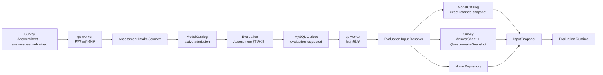
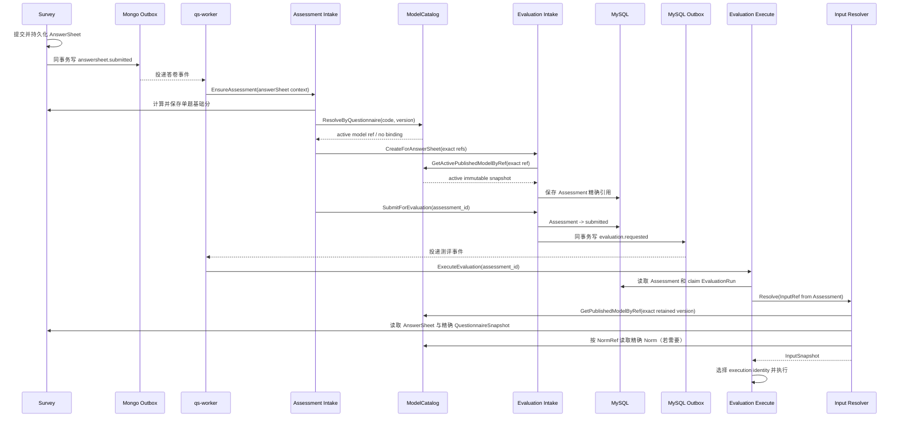

# 关键链路：已发布模型准入与执行输入

> 状态：已按当前源码重写。本文描述从 `answersheet.submitted` 到 Assessment 模型准入，再到 Evaluation 精确物化执行输入的真实链路；同时标明独立问卷、统一输入不变式、常模受试者信息和执行审计方面的当前缺口。

## 1. 本文回答

上一篇 [模型创建、编辑与联合发布](./30-关键链路-模型创建编辑与联合发布.md) 以不可变 `AssessmentSnapshot` 发布成功为终点。本文继续回答：一个发布模型怎样真正进入一次测评执行？

重点包括：

1. AnswerSheet 已可靠受理后，由谁判断它是否绑定测评模型？
2. 为什么新测评准入只能使用 active release，而历史执行和重试必须读取 exact-version retained release？
3. Assessment 在什么时刻冻结 questionnaire ref、model identity 和 algorithm binding？
4. 为什么 Worker 只携带 Assessment ID 触发执行，而不把完整模型配置塞进事件？
5. Evaluation 怎样把 Assessment 中的精确引用物化为 `InputSnapshot`？
6. scale、typology、behavioral_rating、cognitive 四个模型族分别需要装载哪些资料？
7. `DefinitionV2`、临时 runtime DTO、QuestionnaireSnapshot、AnswerSheet、Norm 在执行输入中各自扮演什么角色？
8. 模型下架、发布新版本或执行重试时，为什么已经受理的测评不会漂移到最新配置？
9. 缓存为什么可以加速历史精确读取，却不能决定一个 release 现在是否仍允许受理新测评？
10. 当前实现在哪些地方已经形成了可靠边界，哪些地方仍需要继续治理？

本文不展开具体因子计算、常模换算和 Outcome 提交算法。它们分别属于 ModelCatalog 的 [因子与计分模型](./23-核心设计-因子与计分模型.md)、[常模资产与校准](./24-核心设计-常模资产与校准.md)以及 Evaluation 模块。

---

## 2. 30 秒结论

这条链路最重要的设计不是“从 MongoDB 读一个模型 JSON”，而是先后建立两个语义完全不同的边界：

```text
新测评准入
  使用 questionnaire code + version 查找当前 active release
  再用精确 model identity + version 复核 active 状态
  通过后把引用冻结进 Assessment

已受理测评执行
  从 Assessment 读取已经冻结的 model ref
  按 exact version 读取 retained AssessmentSnapshot
  同时读取精确 AnswerSheet、QuestionnaireSnapshot 和 Norm
  物化为 InputSnapshot
  再按 execution identity 进入对应执行机制
```

一句话概括：

> active 决定“今天还能不能新建这次测评”，exact version 决定“已经受理的测评究竟按哪套历史语义执行”。

如果两个阶段都读取 latest active，会出现严重的历史漂移：用户提交时绑定 v10，Worker 执行前运营发布 v11，那么同一份答案就可能按 v11 计算。反过来，如果新测评只要知道精确版本就允许准入，下架版本仍然可以继续产生新业务，发布治理也就失去意义。

因此当前系统形成了下面的核心规则：

| 场景 | 读取语义 | 是否允许 archived release | 是否允许 latest 替代 |
| --- | --- | --- | --- |
| AnswerSheet 绑定模型 | active by questionnaire code/version | 否 | 否 |
| 新建 Assessment 前复核 | active by exact model ref | 否 | 否 |
| Evaluation 首次执行 | exact retained model ref | 是 | 否 |
| Evaluation 自动重试 | exact retained model ref | 是 | 否 |
| 管理员人工重试 | exact retained model ref | 是 | 否 |
| 新目录展示或 Plan 选择 | active/latest published projection | 否 | 可以，但不能替代 Assessment ref |

---

## 3. 链路在整体架构中的位置



模块职责必须保持清晰：

| 模块 | 本链路中的职责 | 不负责什么 |
| --- | --- | --- |
| Survey | 保存最终 AnswerSheet、精确问卷版本和单题基础分 | 不选择测评算法，不计算 Factor/Norm/Decision |
| ModelCatalog | 根据已发布绑定做准入；提供精确历史模型和 Norm 资产 | 不创建 Assessment，不控制 EvaluationRun |
| Assessment Intake Journey | 协调基础分、模型绑定、Plan、Assessment 幂等创建和自动提交 | 不实现模型算法 |
| Evaluation | 冻结一次测评引用、组织执行输入、控制运行和持久化 Outcome | 不允许用最新模型覆盖已冻结引用 |
| qs-worker | 消费事件、调用内部入口、承接重放和重试唤醒 | 不拥有模型选择和计算规则 |
| Calculation | 对已物化的中性输入执行无状态算法 | 不查询 ModelCatalog、Survey 或 Actor |

---

## 4. 整条时序



这个时序中有三次看似重复、实际目的不同的模型身份处理：

1. **按问卷发现模型**：回答这份问卷现在是否对应一个可执行测评；
2. **创建 Assessment 前复核 active**：防止发现和持久化之间模型已经下架；
3. **执行时按精确版本加载 retained snapshot**：确保历史语义可重放。

---

## 5. 起点：AnswerSheet 已经是可靠作答事实

本文的起点不是 HTTP 请求刚到达 collection-server，而是：

```text
AnswerSheet 已持久化
+ answersheet.submitted 已进入 Mongo durable outbox
```

`answersheet.submitted` 携带的主要引用包括：

- AnswerSheet ID；
- questionnaire code/version；
- testee ID；
- filler ID 与 filler type；
- org ID；
- 可选 task ID；
- request ID；
- submitted_at。

它不携带完整 Questionnaire、模型定义或常模表。原因有三个：

1. 事件应该表达“发生了什么”，而不是复制所有查询数据；
2. 大配置进入消息会放大传输、重试和兼容成本；
3. 真正需要冻结的事实应该落在各自聚合与发布快照中，而不是只存在于某个事件 payload。

答卷可靠受理的 Mongo 事务、幂等和 Outbox 细节见 Survey 的 [答卷校验与可靠受理](../10-survey/31-关键链路-答卷校验与可靠受理.md)。

---

## 6. Worker 只负责唤醒，不决定模型

`qs-worker` 的答卷事件处理器解析 `answersheet.submitted`，然后调用内部 `EnsureAssessment`。它没有根据问卷编码写 `switch`，也没有自己查询某个 scale 表决定模型。

这是一个刻意的边界：

```text
Worker 知道：
  有一份答卷需要继续推进

Worker 不知道：
  它属于哪一种模型
  应使用哪个算法
  是否需要常模
  怎样计算因子
```

Worker 侧还有一个以 AnswerSheet ID 为键的 Redis 重复处理门。它用于减少并发重复调用，但不是最终业务幂等：

- 获取到锁：正常执行；
- 发现重复：跳过本次并发处理；
- Redis 不可用或加锁失败：降级放行，继续调用应用服务。

之所以可以降级放行，是因为真正的业务唯一性由 MySQL `assessment.answer_sheet_id` 唯一约束和 Intake 的“按 AnswerSheet ID 查找或复用”保护。Redis 只减少重复工作，不能成为“有它才正确”的事实源。

---

## 7. 先计算并保存单题基础分

`Assessment Intake Journey.Ensure` 收到答卷上下文后，首先调用 Survey 的 `AnswerSheetScoringService.CalculateAndSave`。

这里的分数是：

- 单题基础分；
- 选项或题型自身定义的转换；
- 反向题等题目局部规则；
- AnswerSheet 的延迟派生属性。

它不是：

- 跨题聚合；
- Factor 得分；
- Norm 转换；
- Decision；
- Outcome 或报告。

这样排序有两个价值：

1. 模型执行拿到的是已经标准化的题目级作答输入；
2. 独立 Questionnaire 即使没有测评模型，也仍可形成完整 AnswerSheet 和单题基础分事实。

---

## 8. 第一道准入：按精确问卷版本发现 active 模型

### 8.1 查询条件

模型绑定解析使用：

```text
questionnaire_code
+ questionnaire_version
+ record_role = published_snapshot
+ release_status = active
```

也就是说，`Q-ADHD@v3` 和 `Q-ADHD@v4` 是两个不同的运行绑定输入。系统不会因为 code 相同，就用 v4 模型处理 v3 AnswerSheet。

### 8.2 为什么必须带 questionnaire version

Questionnaire 内容、选项值、题型和单题分值都可能随发布变化。模型 Factor 又按问题编码和题目值定义贡献关系。如果只按 questionnaire code 绑定：

```text
AnswerSheet 使用 Q@v3
Model 实际绑定 Q@v4
```

即使问题编码碰巧相同，答案含义和计分契约也可能已经变化。因此，一次可执行测评的发布身份必须同时冻结 QuestionnaireSnapshot 和 AssessmentSnapshot。

### 8.3 查不到绑定意味着什么

领域目标已经确认：

```text
没有绑定测评模型的独立 Questionnaire
  -> AnswerSheet 提交成功
  -> 保存单题基础分
  -> 链路结束
  -> 不创建 Assessment
```

但当前代码的真实行为是：

```text
没有绑定模型
  -> 仍创建不带 ModelRef 的 pending Assessment
  -> 不自动 Submit
  -> 不产生 evaluation.requested
```

这是**当前实现与已确认业务边界之间的差距**。它不会误执行模型，但会制造一个没有后续业务意义的 pending Assessment，并可能污染列表或统计语义。目标改造应让 unbound AnswerSheet 在 Journey 层明确结束，而不是借助 `NeedsEvaluation=false` 兜底。

---

## 9. Binding 结果：从目录事实转换为 Assessment 命令

找到 active `AssessmentSnapshot` 后，Binding Resolver 返回一个精确 `Ref`。Journey 将它写入 Evaluation 的 `CreateCommand`：

| 字段 | 来源 | 含义 |
| --- | --- | --- |
| `ModelKind` | published ref | 模型语义族 |
| `ModelSubKind` | published ref | 族内子类型 |
| `ModelAlgorithm` | published ref | 稳定代码能力标识 |
| `ModelCode` | published ref | 模型族身份 |
| `ModelVersion` | published ref | 系统生成的精确 release version |
| `ModelTitle` | published ref | 本次 Assessment 的展示快照 |
| `QuestionnaireCode` | AnswerSheet event | 作答使用的问卷身份 |
| `QuestionnaireVersion` | AnswerSheet event | 作答使用的精确问卷版本 |

当前还保留 `LegacyKindMapping` 和少量默认 Algorithm 兼容逻辑。它们是迁移期适配，不应被理解为“运行时可以缺少正式身份”。目标状态仍是：发布快照给出完整且可验证的 `Kind + SubKind + Algorithm + Code + Version`。

---

## 10. 第二道准入：创建 Assessment 前复核 active release

只在 Binding 阶段查一次 active 不够。考虑下面的并发：

```text
T1  Journey 查询到 v10 active
T2  运营下架 v10
T3  Journey 保存新 Assessment(v10)
```

如果 T3 不复核，就会在下架之后继续产生新测评。因此 `CreateForAnswerSheet` 在真正保存 Assessment 前调用 `PublishedEvaluationModelValidator`，用完整精确 ref 再执行一次：

```text
GetActivePublishedModelByRef(
  kind,
  sub_kind,
  algorithm,
  code,
  version,
)
```

校验内容包括：

- model version 必须存在；
- 精确模型必须仍是 active release；
- snapshot questionnaire code 必须与 Assessment questionnaire ref 一致；
- snapshot questionnaire version 必须与 Assessment questionnaire ref 一致。

校验失败时不能：

- 回退到 head；
- 自动换成最新 release；
- 忽略 version；
- 仅凭 code 创建 Assessment；
- 从旧 payload 猜测问卷绑定。

### 10.1 为什么 active 复核绕过精确版本缓存

精确发布快照的内容不可变，但 `release_status` 会从 active 变成 archived。某个 v10 payload 缓存在 Redis 中时，v10 被归档并不意味着 payload 内容变了；然而它已经不能再接受新测评。

因此当前缓存层明确区分：

```text
GetPublishedModelByRef
  可以 read-through cache
  用于历史精确执行

GetActivePublishedModelByRef
  绕过 exact payload cache
  直接回 Mongo 复核当前 active 状态
```

这不是“缓存不可信”的泛化结论，而是不可变内容和可变准入状态具有不同一致性要求。

---

## 11. Assessment 冻结了什么

准入通过后，Evaluation 在 MySQL `assessment` 保存：

```text
questionnaire_code
questionnaire_version

evaluation_model_kind
evaluation_model_sub_kind
evaluation_model_algorithm
evaluation_model_code
evaluation_model_version
evaluation_model_title

answer_sheet_id
testee_id
org_id
origin_type / origin_id
status
```

这些字段共同表达：

> 这一次 Assessment 是谁、基于哪份答卷、使用哪一版问卷、按哪一种模型身份和哪一个精确发布版本执行。

Assessment 不复制完整 DefinitionV2、QuestionnaireSnapshot 或 Norm 内容。它冻结的是稳定引用；各资产仓储负责保留精确历史版本。

### 11.1 为什么 AnswerSheet ID 有唯一约束

`assessment.answer_sheet_id` 是唯一键。一份最终 AnswerSheet 只能对应一次 Assessment。Journey 同时执行：

1. 创建前按 AnswerSheet ID 查已有 Assessment；
2. 命中则复用；
3. 并发创建发生唯一键冲突时，再读已有 Assessment；
4. 如果已有 Assessment 是 bound + pending，则重放负责补做自动提交。

这形成了“缓存锁降低重复工作，数据库唯一约束保护业务事实，应用服务负责幂等恢复”的三层关系。

---

## 12. Plan 匹配发生在模型绑定之后

Journey 在解析出 model code 后才尝试匹配 Plan Task：

- 事件带 task ID 时，按 task/org/testee 和内容身份解析；
- 没有 task ID 但存在 model code 时，可以匹配打开中的测评任务；
- 匹配成功后，Assessment origin 改为 `plan` 并保存 plan ID；
- Assessment 创建后，Task 完成采用 best-effort，不参与测评核心事务。

这与 Plan 的业务定义一致：Plan 保存测评 code，患者加入后周期性生成 Task，每次任务使用当时最新发布版本。真正提交后，Assessment 再冻结本次命中的精确 release version。

Plan 选择“最新可用版本”与 Assessment 执行“冻结精确版本”并不冲突，它们分别发生在任务发起和测评受理两个时间点。

---

## 13. 自动提交与 `evaluation.requested`

只有成功绑定模型的 pending Assessment 才会自动 `SubmitForEvaluation`。

领域状态转换为：

```text
pending
  -> submitted
  -> raise evaluation.requested
```

Assessment 更新和 `evaluation.requested` Outbox 事件在同一个 MySQL 事务中提交：

```text
transaction {
  save assessment(status=submitted, exact refs)
  stage evaluation.requested
}
```

这保证：

- 不会出现 Assessment 已 submitted、事件却永久丢失；
- 不会出现事件已经可消费、Assessment 状态和引用尚未持久化；
- Worker 重放可以重新调用同一个执行入口；
- Outbox 重试不需要重新决定模型绑定。

事件虽然包含 model kind/code/version 等便于日志和治理的字段，但执行服务仍以数据库中的 Assessment 为业务真相。消息只负责唤醒，不取代聚合状态。

---

## 14. Worker 执行阶段只传 Assessment ID

`qs-worker` 消费 `evaluation.requested` 后：

1. 解析 Assessment ID 和事件元数据；
2. 判断事件是否 `NeedsEvaluation`；
3. 应用自动重试暂停开关；
4. 调用内部 `ExecuteEvaluation(assessmentID)`；
5. 根据执行回执决定 ACK、重试或治理动作。

它不会把事件中的 model ref 直接拼成执行输入。这样可以避免两个事实源：

```text
事件 payload 只用于唤醒、观测与重试授权
Assessment 聚合才是执行输入引用的 canonical source
```

如果事件重放时模型已经发布了 v11，Worker 仍然传同一个 Assessment ID，执行服务仍会从 Assessment 读取 v10。

---

## 15. Evaluation 首先建立运行 claim

执行服务加载 Assessment 后先处理运行控制：

- 已 evaluated：直接跳过重复执行；
- 非 submitted 且非允许恢复的 failed：拒绝执行；
- failed：只有最新 EvaluationRun 可重试，或旧 running lease 已过期，才允许恢复；
- 为本次尝试原子 claim 一个 EvaluationRun；
- 已有有效 claim：跳过并发重复执行。

输入物化发生在 claim 之后。这样昂贵的 Mongo、Questionnaire 和 Norm 查询不会在多个并发消费者中同时重复执行，运行失败也可以归属到明确的 EvaluationRun。

重试治理的自动预算、人工强制重试和审计属于运行基础设施专题；本文只强调：任何重试都必须继续使用 Assessment 已冻结的精确输入引用。

---

## 16. 从 Assessment 构造 InputRef

Evaluation 不重新按 questionnaire 查询 active 模型，而是从 Assessment 构造：

```text
InputRef
├── AssessmentID
├── ModelRef
│   ├── Kind
│   ├── SubKind
│   ├── Algorithm
│   ├── Code
│   ├── Version
│   └── Title
├── AnswerSheetID
├── QuestionnaireCode
└── QuestionnaireVersion
```

这里最重要的是 `ModelRef.Version`。没有版本的运行请求不应被解释成“取 latest”，而应作为输入不完整失败。

当前 `InputRef.QuestionnaireCode/Version` 会被构造，但各 provider 实际先读 AnswerSheet，再以 AnswerSheet 中的 questionnaire ref 加载 QuestionnaireSnapshot。scale 的执行校验会再把它们与 Assessment 逐项比较；其它模型族的校验完整度并不完全一致，后文会单独说明。

---

## 17. Provider Registry：先按执行身份选择输入适配器

`evaluationinput.RepositoryResolver` 不根据 model code 写业务分支，而是使用：

```text
ExecutionIdentity = Kind + SubKind + Algorithm
```

从 `ModelInputProviderRegistry` 选择 provider。provider 集合由 Evaluation runtime descriptor registry 中已注册且可执行的 `ExecutionPath` 物化，而不是手工维护第二份随意列表。

当前映射是：

| ExecutionPath | AlgorithmFamily | Input Provider |
| --- | --- | --- |
| `scale_descriptor` | `factor_scoring` | `ScaleModelInputProvider` |
| `typology_descriptor` | `factor_classification` | `ConfiguredTypologyModelInputProvider` |
| `behavioral_rating_descriptor` | `factor_norm` | `BehavioralRatingModelInputProvider` |
| `cognitive_descriptor` | `task_performance` | `CognitiveModelInputProvider` |

如果 execution identity 没有已注册 provider，输入解析返回 `unsupported_model`。禁止根据 `ProductChannel` 猜测 evaluator，因为产品入口不是模型语义或算法能力。

当前 registry 仍保留 typology 和 behavioral_rating 的兼容 alias/default 匹配。这是历史迁移辅助；新增模型接入应补齐正式身份、兼容矩阵和 provider 注册，而不是继续扩大模糊匹配。

---

## 18. 第二种模型读取：exact-version retained snapshot

执行 provider 使用 `GetPublishedModelByRef`，查询条件本质是：

```text
record_role = published_snapshot
+ exact kind/code/version（以及可用的 sub-kind/algorithm identity）
```

它与准入查询的关键差异是：**不要求 release_status=active**。

原因是 archived 只表示：

> 这个发布版本不再接受新的 Assessment。

它不表示：

> 这个版本的历史含义可以删除，或已经受理的测评应改用别的版本。

因此，active 与 archived release 都属于 retained published history。只要 Assessment 已冻结精确 ref，首次延迟执行、自动重试、人工重试和故障恢复都应继续读到同一个不可变 snapshot。

### 18.1 为什么 exact read 可以缓存

`AssessmentSnapshot` 内容不可变。v10 从 active 变成 archived 后：

- DefinitionV2 不变；
- Questionnaire binding 不变；
- Algorithm identity 不变；
- NormRef 不变；
- Decision 和解释资产不变。

因此 exact-version payload 可以安全 read-through Redis；缓存不可用时回源 Mongo。这个缓存只加速事实读取，不决定准入资格。

---

## 19. InputSnapshot 的结构

provider 最终物化统一 `InputSnapshot`：

```text
InputSnapshot
├── Model
│   ├── identity / code / version / title
│   └── typed payload
├── ModelPayload
├── AnswerSheet
│   ├── questionnaire code/version
│   └── answers: question code / value / score
├── Questionnaire
│   ├── code/version
│   └── questions/options
└── NormSubject（可选，当前生产链路尚未填充）
```

它不是一个新的持久化聚合，而是一次 EvaluationRun 内的内存执行输入。各部分仍由各自事实源提供：

| 输入部分 | canonical source | 读取方式 |
| --- | --- | --- |
| Model | `assessment_models` published snapshot | Assessment exact model ref |
| AnswerSheet | Mongo AnswerSheet | Assessment answer_sheet_id |
| Questionnaire | `questionnaires` published snapshot | AnswerSheet exact questionnaire ref |
| Norm | `assessment_norms` | DefinitionV2 exact NormRef |
| NormSubject | Actor/Testee 人口学资料 | 以 Assessment.SubmittedAt 冻结年龄并生成 v2 subject digest |

---

## 20. DefinitionV2 是唯一执行语义源

所有 family catalog 都从 published model 的 `DefinitionV2` 重建 typed runtime snapshot：

- scale：`DecodeScaleFromPublished`；
- typology：从 DefinitionV2 重建统一 typology payload；
- behavioral_rating：加载 NormRefs 后，从 DefinitionV2 重建评分快照；
- cognitive：从 DefinitionV2 重建 task-performance/SPM 快照，并挂载所需 Norm。

PublishedModel 不保存 Payload 或 PayloadFormat。family catalog 只允许从 published DefinitionV2 临时物化运行时 DTO；DefinitionV2 缺失时直接失败。

运行时要求：

```text
published snapshot exists
+ version is exact
+ DefinitionV2 exists
+ execution identity is registered
+ family-specific definition can be decoded
```

任何一步失败都应暴露为配置或输入错误，而不是：

- 回旧 `scales` 集合；
- 回静态 seed catalog；
- 读取 draft head；
- 用 payload bytes 猜 Definition；
- 换成 latest release。

生产架构测试已经显式阻止 legacy Mongo ruleset、`LayeredCatalog` 或默认静态 catalog 重新进入正式运行路径。

---

## 21. 四个模型族怎样物化执行输入

### 21.1 scale：因子计分

scale provider：

1. 用 Assessment model code/version 精确读取 retained `AssessmentSnapshot`；
2. 从 DefinitionV2 重建 `ScaleSnapshot`；
3. 按 AnswerSheet ID 读取答卷；
4. 按 AnswerSheet 的 questionnaire code/version 读取精确 QuestionnaireSnapshot；
5. 形成 scale `ModelPayload`。

执行前 `DefaultInputValidator` 还会检查：

- Assessment 必须 submitted；
- scale 必须 published 且有 Factor；
- scale questionnaire code 与 Assessment 一致；
- scale version 与 Assessment model version 一致；
- AnswerSheet questionnaire code/version 与 Assessment 一致；
- QuestionnaireSnapshot code/version 与 Assessment 一致；
- scale 绑定的 questionnaire version 与 AnswerSheet、QuestionnaireSnapshot 一致。

这是当前四个模型族中最完整的跨对象一致性校验。

### 21.2 typology：因子分类

typology provider：

1. 精确读取 retained typology release；
2. 校验冻结身份与 DefinitionV2；
3. 物化统一 typology runtime DTO；
4. 读取 AnswerSheet；
5. 显式检查模型绑定问卷与 AnswerSheet 的 code/version；
6. 读取 AnswerSheet 指向的精确 QuestionnaireSnapshot。

随后 runtime 根据 Algorithm/ExecutionSpec 进入极点组合、主导因子、最近模式或连续特质等分类能力。

### 21.3 behavioral_rating：因子计分 + 常模校准

behavioral_rating provider：

1. 精确读取 retained behavioral release；
2. 遍历 `DefinitionV2.Calibration.NormRefs`；
3. 按 `NormTableVersion` 精确加载所有引用常模；
4. 用 DefinitionV2 + Norm tables 重建 behavioral snapshot；
5. 读取 AnswerSheet 与精确 QuestionnaireSnapshot；
6. 进入 `factor_norm` 管线。

常模不是“找当前最新表”，而是按模型发布时冻结的 NormRef 精确装载。否则同一原始分在重试时可能得到不同 T 分或百分位。

### 21.4 cognitive：任务表现 + 可选常模

cognitive provider：

1. 精确读取 retained cognitive release；
2. 从 DefinitionV2 重建 task-performance/SPM snapshot；
3. 如果 SPM total factor 引用 Norm，按精确版本加载并挂载；
4. 读取 AnswerSheet 与精确 QuestionnaireSnapshot；
5. 进入 `task_performance` 管线。

cognitive 与 behavioral_rating 都属于产品上的行为能力测评，但它们的领域语义和执行机制不同，因此不能共用一个模糊的 `behavior_ability` evaluator。

---

## 22. 精确 QuestionnaireSnapshot 为什么不可省略

AnswerSheet 已经保存了答案和值，为什么还要读 QuestionnaireSnapshot？因为执行仍可能需要：

- 问题类型；
- 选项编码与内容；
- 选项基础分；
- 题目顺序或元数据；
- 题目值与模型贡献规则之间的解释上下文。

Questionnaire head 不能替代 snapshot。执行必须调用 `FindByCodeVersion`，而不是读取 active/current questionnaire。

正确关系是：

```text
Assessment.QuestionnaireRef
  == AnswerSheet.QuestionnaireRef
  == QuestionnaireSnapshot.Ref
  == AssessmentSnapshot.QuestionnaireBinding
```

只要其中任意一项不同，这份输入就不再能证明“模型处理的正是用户回答的那版问卷”。

---

## 23. 当前跨对象不变式校验并不完全统一

目标上，所有模型族在进入计算前都应执行同一组公共校验：

| 不变式 | 目标要求 |
| --- | --- |
| Assessment 状态 | submitted 或受治理允许的 retry 状态 |
| Model identity | Input model ref 与 Assessment model ref 完全一致 |
| Model version | 精确一致且非空 |
| AnswerSheet identity | ID 与 Assessment answer_sheet_id 一致 |
| Questionnaire identity | Assessment、AnswerSheet、QuestionnaireSnapshot、Model binding 四方一致 |
| Definition | DefinitionV2 存在且 family 校验通过 |
| Norm | 所有必需 NormRef 均能精确加载 |
| Execution path | identity 已注册并与 family 兼容 |

当前事实是：

- scale 有较完整的统一 validator；
- typology provider 显式校验 Model 与 AnswerSheet 的问卷版本；
- behavioral_rating 进入基于 scoring 的管线后可复用一部分校验；
- cognitive 尤其 SPM 直接路径尚未看到同等完整的公共四方一致性守卫；
- provider 普遍以 AnswerSheet ref 加载 Questionnaire，而没有在 provider 公共层先比较 `InputRef.QuestionnaireRef`。

这意味着主链路设计正确，但防御式校验分散在 provider 和 mechanism 中。建议后续在 `RepositoryResolver` 物化完成后、descriptor routing 之前增加一个模型族无关的 `InputSnapshotInvariantValidator`，再保留 family-specific validator 检查各自细节。

---

## 24. NormSubject：接口已预留，生产输入尚未闭环

`InputSnapshot` 已定义：

```go
type NormSubjectSnapshot struct {
    AgeMonths int
    Gender    string
}
```

`factor_norm` 和 SPM 计算也会读取它，用于年龄、性别等分层常模匹配。但当前生产 provider 只装载：

- Model；
- AnswerSheet；
- Questionnaire；
- 模型引用的 Norm tables。

没有从 Actor/Testee 模块把受试者年龄和性别填进 `NormSubject`。目前只有测试 fixture 显式构造该字段。

因此文档必须区分：

```text
已实现
  模型可以精确引用并装载分层 Norm 数据
  计算层可以接收 NormSubject

尚未闭环
  生产输入物化没有把 Testee 人口学资料接入 NormSubject
```

对于依赖年龄/性别分层的常模，这不是展示问题，而是执行正确性问题。后续应明确：

1. 哪个 Actor/Testee 字段是人口学事实源；
2. 以测评发生时间还是当前时间计算年龄；
3. 性别枚举怎样归一；
4. 缺失人口学资料时拒绝、使用通用常模还是产生“不可校准”结果；
5. 是否需要把实际命中的 norm row/band 记录进 Outcome 审计证据。

---

## 25. 从输入身份到执行路由

InputSnapshot 物化成功后，Evaluation runtime 再解析：

```text
ExecutionIdentity
  -> RuntimeDescriptor
  -> AlgorithmFamily
  -> InputAssembler
  -> Calculator
  -> OutcomeAssembler
```

路由优先从已物化的 `InputSnapshot.Model` 取得身份，并与 Assessment model ref 协调。当前仍存在少量 Algorithm 缺失时使用输入 payload 补齐的兼容逻辑，但目标设计应是 Assessment 已冻结完整身份，执行期不再猜测。

ModelCatalog 在这里贡献的是：

- 已发布 ModelIdentity；
- AlgorithmBinding；
- DefinitionV2；
- Decision/ExecutionSpec；
- 精确 NormRef。

Evaluation 负责：

- 选择已注册 descriptor；
- 组织中性输入；
- 调用 Calculation；
- 管理 EvaluationRun；
- 保存 EvaluationOutcome。

Calculation 只执行算法，不读取发布目录。

---

## 26. 一个版本演进示例

假设运营发布：

```text
Questionnaire Q-ADHD@3.0
AssessmentModel ADHD-SCALE@v10 active
```

患者提交后，系统建立：

```text
AnswerSheet AS-100
  questionnaire = Q-ADHD@3.0

Assessment A-200
  answer_sheet = AS-100
  questionnaire = Q-ADHD@3.0
  model = scale / ADHD-SCALE@v10
  algorithm = scale_default
```

在 Worker 执行前，运营编辑并发布：

```text
Questionnaire Q-ADHD@3.1
AssessmentModel ADHD-SCALE@v11 active
ADHD-SCALE@v10 archived
```

此时：

- 新 AnswerSheet 只能绑定 v11 对应的新问卷版本；
- A-200 仍读取 retained v10；
- A-200 仍读取 Q-ADHD@3.0；
- v10 引用的 Norm 仍按精确版本加载；
- 自动重试和人工重试仍执行 v10；
- 已有 Outcome 和报告不被 v11 改写。

这就是“发布版本用于新准入，冻结版本用于历史执行”的完整含义。

---

## 27. 失败语义

### 27.1 准入阶段

| 失败 | 当前语义 | 是否创建 Assessment | 禁止的恢复方式 |
| --- | --- | --- | --- |
| 无 active questionnaire binding | 当前会创建 unbound pending；目标应结束于 AnswerSheet | 当前是 | 用 draft 或 archived 模型补绑定 |
| model version 缺失 | invalid argument / not published | 否 | 自动读 latest |
| exact release 已 archived | create failed / model not published | 否 | 绕过 active 校验 |
| model 与 questionnaire 不匹配 | create failed | 否 | 只比较 code 或忽略 version |
| MySQL 唯一键冲突 | 重读已有 Assessment | 复用已有 | 新建第二条 Assessment |
| 自动 Submit 失败 | 保留 pending Assessment，事件重放补提交 | 已创建 | 改绑另一个模型版本 |

### 27.2 输入物化阶段

`evaluationinput` 当前区分：

| FailureKind | 含义 |
| --- | --- |
| `model_not_found` | 精确模型版本无法读取或解码 |
| `unsupported_model` | execution identity 没有 provider |
| `scale_not_found` | scale snapshot 无法构造 |
| `answersheet_not_found` | Assessment 指向的答卷不存在 |
| `questionnaire_not_found` | 精确问卷读取失败 |
| `questionnaire_version_mismatch` | 模型、答卷或问卷版本不一致 |

这些输入解析错误会以 EvaluationRun validation failure 结束本次运行。它们通常不是瞬时计算故障，不应无限自动重试；应先修复配置、历史数据或迁移问题，再通过受审计的人工重试恢复。

相比之下，算法执行失败和结果提交失败在当前服务中会被标记为可重试故障，由 retry governance 决定自动、人工或终止。

---

## 28. 可靠性、不漂移与幂等分别由什么保护

| 风险 | 保护机制 |
| --- | --- |
| 答卷 HTTP 成功后丢失 | AnswerSheet + Mongo durable outbox 原子提交 |
| 答卷事件重复消费 | Redis 重复门降低并发；Assessment 唯一键最终兜底 |
| 模型下架后仍创建新测评 | active by questionnaire + create 前 active exact validator |
| 新版本发布导致历史执行漂移 | Assessment 冻结 model/questionnaire exact refs |
| archived 版本无法重试 | exact retained snapshot reader |
| Assessment submitted 但执行事件丢失 | Assessment + MySQL outbox 原子提交 |
| 同一 Assessment 并发执行 | EvaluationRun claim 与 lease |
| 旧问卷被当前 head 替换 | Questionnaire exact snapshot reader |
| 常模更新改变历史分数 | DefinitionV2 冻结 exact NormRef |
| 缓存中的旧 active 状态误准入 | active reader 绕过 exact payload cache |

这些机制不是互相替代的。唯一键不能保证模型不漂移，exact ref 不能保证事件不丢，Outbox 也不能判断模型是否仍允许新准入。

---

## 29. 执行审计的当前边界

EvaluationRun 当前会记录一个可读的 `input_snapshot_ref`，优先形式为：

```text
model:{code}@{version}
```

没有模型时才可能退化为：

```text
answersheet:{id}
```

它有助于快速定位模型版本，但它还不是一个完整的“复合输入快照证明”。当前没有在同一个审计引用中冻结或哈希：

- AnswerSheet ID/内容摘要；
- Questionnaire code/version；
- 所有 NormRef；
- 实际命中的 norm band/row；
- DefinitionV2 内容摘要；
- 运行时 descriptor/Calculation 实现标识。

考虑到项目当前不引入 AlgorithmVersion，近期可先把 `input_snapshot_ref` 扩展为结构化的输入证据，例如：

```text
assessment_id
model_ref
questionnaire_ref
answersheet_id
norm_refs
definition_hash
descriptor_key
```

这样能增强“为什么得到这个 Outcome”的可解释性，但不应把整个 Model/Questionnaire 再复制一份到 EvaluationRun。

---

## 30. 当前不足与演进优先级

### P0：独立 Questionnaire 不应创建空壳 Assessment

已确认的业务边界是：没有模型绑定时，AnswerSheet 链路结束。当前 `Ensure` 仍创建 unbound pending Assessment。应在基础分保存和 binding 查询后明确分流。

验收条件：

- 独立 Questionnaire 提交成功；
- AnswerSheet 和基础分存在；
- 不创建 Assessment；
- 不产生 `evaluation.requested`；
- 事件重放保持幂等。

### P0：为分层常模补齐 NormSubject

从 Testee/Actor 获取人口学资料，以测评发生时间构造年龄和性别，并定义缺失资料语义。对依赖分层常模的模型，在未闭环前不能宣称已经完整支持年龄/性别校准。

### P1：增加跨模型族统一输入不变式校验

在 provider 物化之后统一比较 Assessment、Model、AnswerSheet、Questionnaire 四方身份，再交给 family-specific validator。

### P1：增强结构化执行输入审计

把当前 `model:code@version` 升级为可查询的复合引用或内容摘要，尤其记录 NormRef 和实际选择结果。

### P2：继续收敛迁移期身份默认值

消除 Algorithm 缺失时的 family default、typology/behavioral alias 和旧 kind mapping，让发布阶段产生完整身份，运行时只做严格解析。

### P2：修正文档性命名与注释歧义

少量 runtime catalog 注释仍把所有读取概括为 active-only，但具体接口已经区分 active admission 与 retained exact history。应让端口命名、注释和测试术语保持一致。

---

## 31. 为什么不采用其它方案

### 31.1 所有执行都查 latest active

优点是实现简单，缺点是历史测评不可复现，新版本会改变排队中或重试中的结果。对医疗辅助测评不可接受。

### 31.2 在 AnswerSheet 上复制完整模型

可以减少运行时查询，但会让 Survey 拥有 ModelCatalog 事实，放大文档体积，并造成模型、问卷、常模多份副本的一致性问题。

### 31.3 把完整 DefinitionV2 放进事件

会让事件 payload 变成新的模型存储，增加消息尺寸、Schema 演进和重试成本，也无法自然表达 Norm 等独立资产。

### 31.4 下架时物理删除旧 release

会直接破坏排队测评、自动重试、人工补偿、历史解释和审计。下架应该停止新准入，不应该删除历史事实。

### 31.5 active 状态完全依赖缓存失效

缓存失效是 best-effort 基础设施动作，不能作为医疗测评准入的唯一正确性条件。当前 active exact validator 回 Mongo 复核更稳妥。

---

## 32. 设计评审检查表

当新增模型族、provider 或运行时读取接口时，应逐项确认：

### 准入

- [ ] 是否按精确 questionnaire code/version 找 active release？
- [ ] 创建 Assessment 前是否再次验证 exact ref 仍 active？
- [ ] 是否检查模型绑定问卷与 AnswerSheet 一致？
- [ ] 无模型绑定时是否正确结束于 AnswerSheet？
- [ ] 是否没有读取 draft/head？

### 冻结

- [ ] Assessment 是否保存完整 ModelIdentity 和 release version？
- [ ] 是否保存精确 QuestionnaireRef 和 AnswerSheetRef？
- [ ] 是否避免把 latest 查询留到 Worker 执行期？
- [ ] Assessment 与 `evaluation.requested` 是否同事务？

### 输入物化

- [ ] provider 是否由注册的 ExecutionPath 物化？
- [ ] 是否读取 exact retained model snapshot？
- [ ] 是否从 DefinitionV2 重建 typed payload？
- [ ] 是否读取 AnswerSheet 指向的精确 QuestionnaireSnapshot？
- [ ] 是否按精确 NormRef 读取常模？
- [ ] 是否执行统一身份不变式和 family-specific 校验？

### 历史与重试

- [ ] archived release 是否仍可被已有 Assessment 读取？
- [ ] 重试是否继续使用原 model/questionnaire/norm refs？
- [ ] 输入缺失是否形成明确 validation failure？
- [ ] 人工重试是否要求原因、确认和审计？

### 缓存

- [ ] exact immutable payload 可以缓存；
- [ ] active admission 不依赖可能残留的 exact payload cache；
- [ ] Redis 不可用时不会把 draft/legacy data 当作 fallback；
- [ ] 缓存 key 包含足够的模型身份与 version。

---

## 33. 面试与宣讲口径

### 33.1 为什么要区分 active 和 exact-version 两种读取？

可以回答：

> active 是准入规则，解决“这个版本现在还允许不允许产生新测评”；exact-version 是历史执行规则，解决“已经受理的测评必须按当时哪一套规则执行”。新测评先通过 active release 绑定，Assessment 再冻结模型和问卷精确版本。Worker 重试只按 Assessment 的 exact ref 读取保留快照，不会取最新版本，因此发布、下架和异步延迟都不会改变历史结果语义。

### 33.2 为什么 Worker 不直接处理模型配置？

可以回答：

> Worker 只负责事件消费和执行控制。模型选择属于 ModelCatalog 与 Assessment Intake，执行引用属于 Assessment，算法属于 Evaluation/Calculation。Worker 只传 Assessment ID，既缩小事件契约，也避免消息和数据库形成两个业务真相。

### 33.3 为什么发布快照归档后还要保留？

可以回答：

> 归档只终止新准入，不能抹掉历史语义。异步执行、自动重试、人工补偿和历史报告都可能需要精确读取旧版本。物理删除旧 release 会使已经受理的测评无法重现，也会破坏审计。

### 33.4 如何证明系统不会因为缓存而使用已下架模型？

可以回答：

> immutable exact payload 可以缓存，因为内容不变；但 active 状态会变化，所以新 Assessment 的 active exact validator 绕过精确 payload cache，直接回 Mongo 复核 release_status。缓存负责性能，Mongo 中的发布状态负责准入正确性。

### 33.5 当前设计还缺什么？

可以回答：

> 主链路已经形成 active 准入、Assessment 冻结、exact history 执行和 Outbox 可靠唤醒，但仍有几个明确缺口：独立问卷会留下 unbound pending Assessment；NormSubject 尚未从 Testee 资料进入生产输入；跨模型族不变式校验不统一；EvaluationRun 目前只记录 model:code@version，而不是完整复合输入证据。这些问题都有清晰的改造边界。

---

## 34. 事实源

| 环节 | 当前源码 |
| --- | --- |
| AnswerSheet 事件消费与重复处理门 | [`internal/worker/handlers/answersheet_handler.go`](../../../internal/worker/handlers/answersheet_handler.go) |
| AnswerSheet 到 Assessment Journey | [`internal/apiserver/application/journey/assessmentintake/service.go`](../../../internal/apiserver/application/journey/assessmentintake/service.go) |
| 模型 Binding Resolver | [`internal/apiserver/infra/ruleset/binding_resolver.go`](../../../internal/apiserver/infra/ruleset/binding_resolver.go)、[`runtime_catalog.go`](../../../internal/apiserver/infra/ruleset/runtime_catalog.go) |
| active/exact Mongo 查询 | [`internal/apiserver/infra/mongo/modelcatalog/repo.go`](../../../internal/apiserver/infra/mongo/modelcatalog/repo.go) |
| active 准入校验 | [`internal/apiserver/application/evaluation/intake/typology_model_validator.go`](../../../internal/apiserver/application/evaluation/intake/typology_model_validator.go) |
| Assessment 创建、提交与事务 Outbox | [`internal/apiserver/application/evaluation/intake`](../../../internal/apiserver/application/evaluation/intake/) |
| Assessment MySQL 持久化 | [`internal/apiserver/infra/mysql/evaluation`](../../../internal/apiserver/infra/mysql/evaluation/) |
| 受信任发布模型解析 | [`internal/apiserver/application/modelcatalog/runtime/resolver.go`](../../../internal/apiserver/application/modelcatalog/runtime/resolver.go) |
| 发布模型缓存语义 | [`internal/apiserver/cache/modelcatalog/published_model.go`](../../../internal/apiserver/cache/modelcatalog/published_model.go) |
| Evaluation Worker 事件入口 | [`internal/worker/handlers/assessment_handler.go`](../../../internal/worker/handlers/assessment_handler.go) |
| Evaluation 执行编排 | [`internal/apiserver/application/evaluation/execute`](../../../internal/apiserver/application/evaluation/execute/) |
| InputSnapshot port | [`internal/apiserver/port/evaluationinput/input.go`](../../../internal/apiserver/port/evaluationinput/input.go) |
| 四族输入 provider | [`internal/apiserver/infra/evaluationinput`](../../../internal/apiserver/infra/evaluationinput/) |
| 执行路径物化 | [`internal/apiserver/application/evaluation/runtime/materialization_specs.go`](../../../internal/apiserver/application/evaluation/runtime/materialization_specs.go) |
| scale 输入不变式 | [`internal/apiserver/application/evaluation/registry/mechanisms/scoring/input_validator.go`](../../../internal/apiserver/application/evaluation/registry/mechanisms/scoring/input_validator.go) |
| EvaluationRun 输入引用 | [`internal/apiserver/application/evaluation/execute/input_snapshot_ref.go`](../../../internal/apiserver/application/evaluation/execute/input_snapshot_ref.go) |

---

## 35. 建议验证

```bash
go test ./internal/apiserver/application/journey/assessmentintake
go test ./internal/apiserver/application/evaluation/intake
go test ./internal/apiserver/application/modelcatalog/runtime
go test ./internal/apiserver/infra/mongo/modelcatalog
go test ./internal/apiserver/cache/modelcatalog
go test ./internal/apiserver/infra/evaluationinput
go test ./internal/apiserver/application/evaluation/execute
go test ./internal/apiserver/application/evaluation/registry/mechanisms/scoring
go test ./internal/apiserver/infra/modelcatalog
go test ./internal/worker/handlers
```

链路级回归还应覆盖：

1. v10 active 时提交 AnswerSheet，v11 发布并归档 v10 后，原 Assessment 仍执行 v10；
2. v10 已归档后，不能再新建绑定 v10 的 Assessment；
3. exact payload cache 中仍有 v10 时，active validator 仍能拒绝新准入；
4. AnswerSheet 与 Model 绑定的 questionnaire version 不一致时，执行失败且不回退 latest；
5. NormRef 指向旧版本时，模型发布新 Norm 后重试仍读取旧 Norm；
6. Redis 重复门不可用时，并发答卷事件仍只形成一条 Assessment；
7. Assessment 保存后自动提交失败，事件重放能够补提交并产生 `evaluation.requested`；
8. 独立 Questionnaire 提交后不创建 Assessment——这是目标行为，当前测试仍固化了相反的 pending Assessment 行为，改造时需要同步更新。

---

## 36. 小结

已发布模型进入执行，不是一次简单查询，而是一条由准入、冻结、可靠唤醒和精确物化组成的契约链：

```text
AnswerSheet 作答事实
  -> active questionnaire binding
  -> active exact model validation
  -> Assessment 冻结 model/questionnaire/answersheet refs
  -> transactional evaluation.requested
  -> Worker 按 Assessment ID 唤醒
  -> exact retained model + exact questionnaire + exact norm
  -> InputSnapshot
  -> execution identity / descriptor / algorithm family
```

这条链路保护了三个关键性质：

1. **准入可治理**：下架版本不再产生新测评；
2. **历史不漂移**：已受理测评始终使用当时冻结的模型、问卷和常模；
3. **执行可恢复**：事件重放和运行重试只重新物化同一组精确引用，不重新做业务选择。

接下来阅读具体模型族时，应始终带着这个边界：模型族可以拥有不同的输入适配和算法机制，但它们必须共享同一套 active 准入、exact-version 历史执行和跨资产一致性原则。
