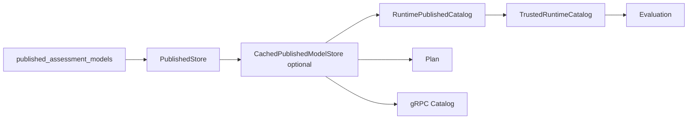
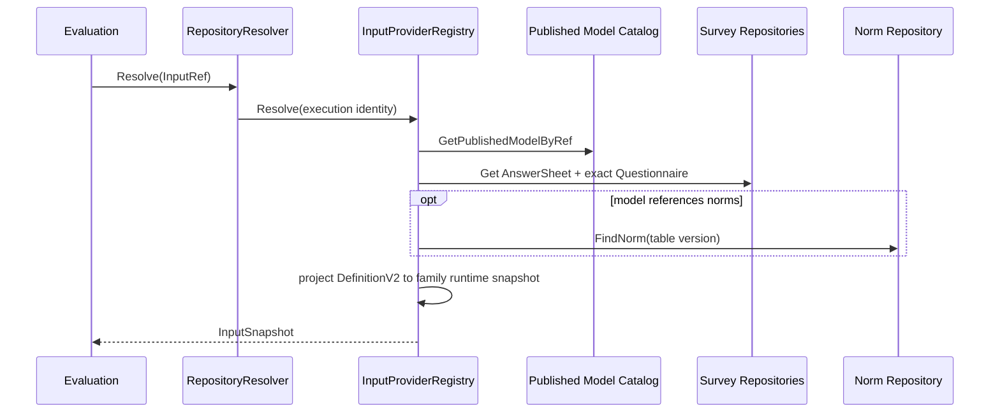

# 关键链路：已发布模型解析与消费

## 1. 本文回答

本文说明 AssessmentSnapshot 如何从 Mongo 经 published-only catalog 提供给 Evaluation、Plan、gRPC 和 collection BFF；重点解释精确 model ref、Questionnaire binding、DefinitionV2 materialization、缓存边界和运行时失败语义。

## 2. 30 秒结论

```text
published_assessment_models
  -> optional cache
  -> RuntimePublishedCatalog
  -> TrustedRuntimeCatalog
  -> family adapter / consumer projection

Evaluation
  -> exact model ref + AnswerSheet + exact Questionnaire + Norm

Plan / collection
  -> published-only list/detail projection
```

所有消费者共享一个规则：draft 不能参与运行时。缺少 DefinitionV2、精确 version、Norm 或已注册 ExecutionPath 时必须失败，不能回退到 `assessment_models`、旧 `scales` 或 payload bytes。

## 3. Published 存储与目录装配



组合根的真实路径：

1. Mongo `Repository` 读写 `published_assessment_models`。
2. `PublishedStore` 实现 PublishedModelReader/Lister。
3. 配置 Redis 时增加 cached store，写 Repository 同时负责失效。
4. `ruleset.RuntimePublishedCatalog` 只暴露 published ports。
5. `runtime.TrustedRuntimeCatalog` 使用可信 service actor，并拒绝缺少 DefinitionV2 的记录。

缓存只是 published store 的加速层，不是模型事实源。缓存不可用或内容可疑时应回到 Mongo snapshot，而不是读取 draft。

## 4. 三种解析方式

| 方式 | 输入 | 适用场景 | 约束 |
| --- | --- | --- | --- |
| by ref | kind/sub-kind/algorithm/code/version | Assessment 已冻结模型引用后的执行 | version 必填，应精确匹配 snapshot |
| by questionnaire | questionnaire code/version | AnswerSheet 到模型 binding | 应携带精确问卷版本 |
| latest by code | kind/code | 目录、Plan 标题或非执行查询 | 不能代替历史 Assessment ref |

`Resolver` 会执行 `resolve_published` 授权并要求 DefinitionV2。受信任的 container adapter 固定使用 mTLS service actor；普通用户不能通过该路径绕过管理端权限。

## 5. Evaluation 输入物化



`evaluationinput.RepositoryResolver` 从 Evaluation runtime descriptor registry 取得已注册 ExecutionPaths，并装配：

| ExecutionPath | Input provider / adapter |
| --- | --- |
| `scale_descriptor` | PublishedScaleCatalog + AnswerSheet + Questionnaire |
| `typology_descriptor` | PublishedTypologyCatalog |
| `behavioral_rating_descriptor` | PublishedBehavioralRatingCatalog + NormRepository |
| `cognitive_descriptor` | PublishedCognitiveCatalog + NormRepository |

family adapters 检查 kind/format/DefinitionV2，然后从 DefinitionV2 重建执行 snapshot：

- scale 重建 ScaleSnapshot；
- typology 重建 RuntimeSpec/typed payload；
- behavioral_rating 解析所有 NormRef 并重建评分 snapshot；
- cognitive 重建 SPM/task-performance snapshot，并为 total factor 加载常模。

它们不会反序列化 `PublishedModel.Payload` 来补齐语义。

## 6. Plan 消费边界

Plan 注入 `PublishedModelLister`，通过 `NewPublishedScaleCatalog` 只做：

- scale code 是否存在；
- model kind 是否为 scale；
- DefinitionV2 是否存在；
- code 到 title 的展示投影。

Plan 不读取 draft，也不解释 Definition。当前 Plan 主要保存 scale code；长期模型版本锁定属于 Plan/Evaluation 数据模型演进，不能通过读取 latest draft 伪造。

## 7. gRPC 与 collection BFF

`AssessmentModelCatalogService` 是唯一通用模型目录 gRPC，使用可信 service actor 调用 CatalogQueryService：

| RPC | 语义 |
| --- | --- |
| GetPublishedModel | 读取已发布模型详情，可指定 version |
| ListPublishedModels | 按 kind/algorithm/category/questionnaire 等筛选 |
| ListHotPublishedModels | 返回当前 hot read model 对应的已发布 scale |
| GetCatalogOptions | 返回 kind、channel、family、algorithm 等目录选项 |

gRPC 把 DefinitionV2 编码为 canonical `definition_json`，不暴露 draft Definition，也不提供 family-specific RPC。

collection-server 的通用 `/api/v1/assessment-models` 直接投影该 gRPC；保留的 `/api/v1/typology-models` 是 BFF/ACL：它读取 generic catalog 的 Definition JSON，再投影为既有 typology REST response。它不是第二个模型目录。

## 8. 热榜与其它读侧

`answersheet.submitted` 可以驱动 ModelCatalog hot-rank read model。查询热榜时再用 published lister 解析对应 scale；没有已发布模型的条目会被跳过。

hot rank、二维码、目录 options 和缓存都是读侧能力，不改变 AssessmentModel、AssessmentSnapshot 或 DefinitionV2。

## 9. 失败语义

| 失败 | 对外/运行时语义 | 禁止的恢复方式 |
| --- | --- | --- |
| model ref 无 version | `ErrVersionRequired` / invalid argument | 自动改读 latest draft |
| published row 不存在或已 soft-delete | not found | 查询 `assessment_models` 继续执行 |
| DefinitionV2 缺失 | runtime configuration error | 解析 payload 补 Definition |
| NormRef 无对应 table | model input resolution error | 使用任意其它 norm version |
| ExecutionPath/provider 未注册 | unsupported model | 根据 ProductChannel 猜 evaluator |
| questionnaire version 不存在 | input resolution error | 使用 active questionnaire 替代 |
| gRPC definition_json 编码失败 | internal/failed precondition | 返回空 Definition 的“成功”模型 |

运行时错误首先按 model ref 查 snapshot，再查 DefinitionV2/DecisionKind，随后查 questionnaire 和 Norm。只有事实层正确后才检查 cache、gRPC 或 BFF projection。

## 10. 存储与契约边界

| 层 | canonical 契约 |
| --- | --- |
| Mongo runtime | `published_assessment_models` 的 AssessmentSnapshot |
| Internal Go | PublishedModelReader/Lister/Catalog ports |
| Internal gRPC | `AssessmentModelCatalogService` + `definition_json` |
| C 端 REST | generic assessment-model catalog；typology 为 BFF projection |
| Runtime family DTO | 从 DefinitionV2 物化的 payload/scale、typology、behavioral、cognitive snapshot |

新增消费者应优先依赖 generic catalog 或 narrow published port，不能新增旧 scale service、专用 typology gRPC 或 payload semantic fallback。

## 11. 事实源与验证

| 环节 | 路径 |
| --- | --- |
| Published store | [`infra/modelcatalog/published_store.go`](../../../internal/apiserver/infra/modelcatalog/published_store.go)、[`infra/mongo/modelcatalog`](../../../internal/apiserver/infra/mongo/modelcatalog/) |
| Trusted runtime catalog | [`application/modelcatalog/runtime/resolver.go`](../../../internal/apiserver/application/modelcatalog/runtime/resolver.go) |
| Evaluation materialization | [`infra/evaluationinput`](../../../internal/apiserver/infra/evaluationinput/) |
| Plan adapter | [`application/plan/published_scale_catalog.go`](../../../internal/apiserver/application/plan/published_scale_catalog.go) |
| gRPC catalog | [`transport/grpc/service/assessment_model_catalog.go`](../../../internal/apiserver/transport/grpc/service/assessment_model_catalog.go) |
| collection ACL | [`collection-server/port/grpcbridge`](../../../internal/collection-server/port/grpcbridge/) |

```bash
go test ./internal/apiserver/application/modelcatalog/runtime ./internal/apiserver/infra/modelcatalog ./internal/apiserver/infra/ruleset
go test ./internal/apiserver/infra/evaluationinput
go test ./internal/apiserver/application/plan -run PublishedScaleCatalog
go test ./internal/apiserver/transport/grpc/service -run AssessmentModelCatalog
go test ./internal/collection-server/application/modelcatalog ./internal/collection-server/port/grpcbridge
```
