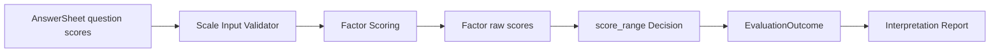

# scale：医学量表

> 状态：`scale + scale_default + factor_scoring` 已形成完整发布与执行链路，适合以题目基础分聚合因子并按原始分区间形成结果的医学量表。当前运行时 ScaleSnapshot 仍偏向扁平题目—因子结构，DefinitionV2 中更丰富的 FactorGraph、权重和 Factor 来源尚未完整投影到 scale 执行 DTO。

## 1. 本文回答

1. 医学量表模型解决什么业务问题；
2. Questionnaire、AnswerSheet 基础题分和 scale Factor 分别属于谁；
3. 怎样从多道题得到一个或多个因子分；
4. `score_range` 怎样产生稳定风险或等级结果；
5. 新医学量表什么时候只需配置，什么时候需要新增算法；
6. scale 与带常模行为评定有什么边界；
7. 当前 scale 执行 DTO 还存在哪些扩展性限制。

---

## 2. 30 秒结论

scale 的核心不是“它是一份问卷”，而是：

```text
AnswerSheet 中已经形成的单题基础分
  -> 按 Factor 配置收集题目
  -> 使用 sum/avg/weighted/cnt 等策略聚合
  -> 得到因子原始分
  -> 按 score_range 选择 OutcomeCode/Level
  -> EvaluationOutcome
```

它适合 SNAP-IV、ADHD 相关医学量表以及其它“题目得分—因子分—区间结果”模型。

scale 不负责医学诊断。结果只能为医生判断、治疗观察和随访提供辅助信息。

正式边界：

> 如果结果必须先根据年龄、性别或特定人群常模转换为 T 分、百分位或标准分，再进行解释，应使用 `behavioral_rating`，而不是把常模逻辑隐藏进 scale。

当前身份：

| 维度 | 值 |
| --- | --- |
| Kind | `scale` |
| ProductChannel | 默认 `medical_scale` |
| Algorithm | `scale_default` |
| AlgorithmFamily | `factor_scoring` |
| ExecutionPath | `scale_descriptor` |
| PayloadFormat | `assessmentmodel.scale.v1` |
| DecisionKind | `score_range` |

---

## 3. 它解决的业务问题

纸质量表的典型流程是：

1. 医生开检查项；
2. 患者领取纸质量表；
3. 患者或家长填写；
4. 医护人员逐题换算；
5. 人工求和或计算分量表；
6. 对照区间形成结论；
7. 医生再结合问诊做判断。

早期 PHP 系统虽然实现了在线填写和自动计分，但“每增加一份量表就修改代码”。scale 模型要解决的是：

> 将量表中稳定的测量知识发布为数据资产，让同类医学量表不再复制一套执行代码。

可配置的部分包括：

- 量表绑定哪一版问卷；
- 有哪些因子；
- 每个因子由哪些问题贡献；
- 使用什么聚合策略；
- 最大分或计数参数；
- 不同分数区间对应什么稳定结果代码；
- 哪些因子进入报告。

---

## 4. 什么时候选择 scale

适合 scale 的模型通常同时满足：

- 作答可以转换为题目基础分；
- 多道题聚合为因子原始分；
- 一个模型可以有多个并列因子；
- 结果主要由原始分或直接派生分区间决定；
- 不依赖人口学常模才能解释；
- 最终结果是风险、程度或量表等级，而不是人格类型或任务能力。

不应选择 scale 的情况：

| 业务语义 | 正确类型 |
| --- | --- |
| 根据多个极点组合人格类型 | `typology` |
| 原始分必须查年龄/性别常模 | `behavioral_rating` |
| 题目存在客观正确答案和题组能力 | `cognitive` |
| 只收集信息，不做跨题测量 | 独立 Questionnaire |

---

## 5. Survey 与 scale 的边界

### 5.1 Survey 拥有题目和基础分

Survey 定义：

- 题目内容；
- 题型；
- 选项值；
- 选项基础分；
- 反向题等单题局部转换；
- AnswerSheet 最终作答事实。

AnswerSheet 的 Score 是延迟派生属性，但仍属于 Survey 对单题语义的解释。

### 5.2 scale 拥有跨题测量

ModelCatalog scale 定义：

- 哪些题属于同一 Factor；
- 多题如何聚合；
- 哪个 Factor 是主结果；
- Factor 分如何进入区间 Decision；
- OutcomeCode 的稳定代码空间。

因此：

```text
Question score
  属于 Survey

Factor score / risk outcome
  属于 ModelCatalog + Evaluation/Calculation
```

把反向题写在 ModelCatalog 会让同一问卷的基础答案语义随模型变化；把 Factor 聚合写进 Survey 又会让问卷无法独立复用。

---

## 6. 领域结构

一个 scale DefinitionV2 可以概念化为：

```text
Scale Definition
├── Measure
│   ├── Factors
│   │   ├── SNAP_INATTENTION
│   │   ├── SNAP_HYPERACTIVITY
│   │   └── SNAP_TOTAL
│   ├── FactorGraph
│   └── Scoring
│       ├── FactorCode
│       ├── Sources(question/factor)
│       ├── Strategy
│       ├── Params
│       └── MaxScore
├── Calibration
│   └── 当前 scale 为空
├── Conclusions
│   └── RiskConclusion[]
├── Outcomes
└── ReportMap
```

### 6.1 Factor

Factor 是医学量表真正测量的维度，例如注意力、冲动、多动或总分。它不是前端页面分组，也不是数据库统计字段。

每个 Factor 至少需要：

- 稳定 code；
- 可展示 title；
- 在测量结构中的 role；
- 对应 Scoring 规则。

### 6.2 Scoring

通用 Factor Scoring 支持：

- `sum`；
- `avg`；
- `weighted_sum`；
- `weighted_avg`；
- `max`；
- `min`；
- `cnt`。

Source 可以在领域模型中指向题目或子 Factor，并携带 sign、weight、option override 等信息。

### 6.3 RiskConclusion

`RiskConclusion` 指定：

```text
FactorCode
+ ScoreRangeOutcome[]
+ Outcome definitions
```

它把连续分数映射成稳定结果，例如：

```text
0..12   -> low
13..17  -> moderate
18..27  -> high
```

真正持久化到 Outcome 的核心应是 `low/moderate/high` 等代码和计算证据；title、summary、description 属于解释资产，当前结构仍有混合，详见 [结果判定、Outcome 与解释边界](../25-核心设计-结果判定、Outcome与解释边界.md)。

---

## 7. 一个简化配置示例

以下只表达概念，不是 REST wire schema：

```yaml
identity:
  kind: scale
  algorithm: scale_default
binding:
  questionnaire_code: SNAP-IV-PARENT
  questionnaire_version: "3.0"
definition_v2:
  measure:
    factors:
      - code: inattentive
        title: 注意力不足
      - code: hyperactive
        title: 多动冲动
    scoring:
      - factor_code: inattentive
        strategy: sum
        sources: [q1, q2, q3, q4]
      - factor_code: hyperactive
        strategy: sum
        sources: [q5, q6, q7, q8]
  conclusions:
    - kind: risk
      factor_code: inattentive
      ranges:
        - min: 0
          max: 13
          outcome_code: low
        - min: 13
          max: 18
          outcome_code: moderate
        - min: 18
          max: 28
          outcome_code: high
```

配置重点不是具体分值，而是三个不变式：

1. Source question code 必须存在于绑定 QuestionnaireSnapshot；
2. 每个可执行 Factor 必须有明确 Scoring；
3. 每个需要产生结果的 Factor 必须有完整 Decision 区间。

---

## 8. 发布校验

ScaleDefinitionHandler 发布前执行：

- AssessmentModel 基础字段校验；
- 精确问卷绑定校验；
- DefinitionV2 通用结构校验；
- Factor、FactorGraph、Scoring 引用校验；
- Conclusion 与 Outcome 引用校验；
- DecisionKind 必须能解析为 `score_range`；
- 将 DefinitionV2 投影为 ScaleSnapshot；
- 生成 `assessmentmodel.scale.v1` 兼容 payload。

发布后：

```text
AssessmentSnapshot
  kind = scale
  algorithm = scale_default
  version = v{revision}
  questionnaire = exact code/version
  definition_v2 = immutable
  decision_kind = score_range
```

---

## 9. 执行输入

scale provider 按 Assessment 冻结引用加载：

```text
exact AssessmentSnapshot
+ exact AnswerSheet
+ exact QuestionnaireSnapshot
```

并物化：

```text
InputSnapshot
├── ModelSnapshot(scale)
├── ScaleModelPayload
├── AnswerSheetSnapshot
└── QuestionnaireSnapshot
```

执行前 Scale `DefaultInputValidator` 会比较：

- Assessment 已 submitted；
- scale 已 published；
- Factor 非空；
- Model version 与 Assessment ref 一致；
- Model、Assessment、AnswerSheet、QuestionnaireSnapshot 的问卷 code/version 一致。

这是四个类型中当前跨对象校验最完整的一条。

---

## 10. 执行机制



`factor_scoring` 的职责是无状态计算：

1. 按 Source 收集题目基础分；
2. 使用 Strategy 聚合；
3. 生成 Factor Result；
4. 使用区间规则形成结果等级；
5. 转换为统一 `domain/evaluation/outcome.Execution`。

Evaluation 负责加载、运行状态、失败和 Outcome 持久化；Calculation 不直接访问 Mongo 或 MySQL。

---

## 11. EvaluationOutcome

scale 的 Outcome 应至少能够表达：

- 精确 ModelRef；
- Primary score；
- 各 Factor score；
- score kind；
- max score；
- LevelCode；
- OutcomeCode；
- 供趋势读取的 Factor 结果。

趋势比较的对象应是稳定 FactorCode，而不是 title。模型新版本可以修改文案，但不能无治理地改变同一 FactorCode 的测量含义。

---

## 12. Interpretation 边界

scale Decision 只产生稳定结果事实。Interpretation 再负责：

- 展示因子名称；
- 组织风险说明；
- 选择建议文案；
- 构建医生、患者或家长可读报告；
- 展示免责声明。

报告必须明确：测评结果不能替代医学诊断。

---

## 13. 同类模型如何扩展

新增一份普通医学量表时，通常只需要：

1. 创建并发布 Questionnaire；
2. 创建 `kind=scale` 模型；
3. 使用 `algorithm=scale_default`；
4. 绑定精确问卷版本；
5. 配置 Factor 和 Scoring；
6. 配置 RiskConclusion/Outcome；
7. 配置 ReportMap 和解释资产；
8. 联合发布；
9. 使用样例答案做边界分回归。

不应因为“量表名字不同”新增 Algorithm。

只有出现当前 factor_scoring 无法表达的稳定计算语义时，才增加 Algorithm，例如：

- 需要跨时间窗计算；
- 需要复杂缺失题插补；
- 需要非线性变换；
- 需要专有评分程序且不能用可组合策略表达。

---

## 14. 当前实现限制

### 14.1 ScaleSnapshot 仍是扁平结构

DefinitionV2 支持 FactorGraph、Factor Source、sign、weight 和 option override，但当前 `ScaleSnapshot` 主要保存：

- Factor code/title；
- QuestionCodes；
- ScoringStrategy；
- ScoringParams；
- MaxScore；
- InterpretRules。

`ScaleSnapshotFromDefinition` 只把直接 Question Source 投影成 `QuestionCodes`，没有完整保留 Factor Source、层级边、权重和 sign。运行时又从 DefinitionV2 投影为该 DTO，因此不能把通用领域结构的全部表达力都写成 scale 已支持。

目标选择有两个：

1. 扩展 ScaleSnapshot，使其完整承载通用 MeasureSpec；
2. 让 factor_scoring 直接消费中性 DefinitionV2/Calculation DTO，逐步弱化旧 ScaleSnapshot。

第二种更符合“模型配置与算法 DTO 分离”的长期方向。

### 14.2 capability 元数据不一致

`FamilyCapability` 中 scale 的部分 authoring 字段仍为 false，但 `management.Service`、ScaleDefinitionHandler 和 publication 已支持创建、编辑与发布。当前这些字段没有实际阻断管理服务，属于需要收敛的设计债务。

### 14.3 scale 暂不支持常模

这不是所有医学量表永远不需要常模，而是当前类型边界和运行能力的事实。如果未来某医学量表必须常模化，可以：

- 先评估其业务语义是否属于 behavioral_rating；
- 或让 `scale` 在保持 Kind 不变时绑定新的 AlgorithmFamily；
- 不能直接在现有 `scale_default` 中偷偷增加常模行为。

---

## 15. 失败语义

| 失败 | 应归类为 | 处理 |
| --- | --- | --- |
| 问卷题目不存在 | 发布校验失败 | 修正 Source，不允许发布 |
| Factor 无 Scoring | 发布校验失败 | 补齐测量定义 |
| 区间重叠或缺失 | Decision 配置失败 | 修正规则并做边界测试 |
| AnswerSheet 问卷版本不一致 | 输入校验失败 | 不回退 latest |
| exact model 不存在 | 输入解析失败 | 修复历史资产，不自动换版本 |
| 计算策略未注册 | calculation failure | 判断配置错误或代码能力缺失 |
| Interpretation 文案缺失 | 报告配置失败 | 不改写 Outcome 事实 |

---

## 16. 设计检查表

- [ ] 这是原始分区间模型，而不是常模型或人格模型；
- [ ] Questionnaire 题目基础分已经正确；
- [ ] 每个 Source question code 存在；
- [ ] FactorCode 稳定且可用于历史趋势；
- [ ] Scoring strategy 与业务公式一致；
- [ ] 最大分、缺失题和零分语义明确；
- [ ] Decision 区间覆盖所有合法分数且不冲突；
- [ ] OutcomeCode 是稳定代码，不直接保存长文案；
- [ ] 样例答卷覆盖最低分、边界分和最高分；
- [ ] 报告声明结果仅用于辅助判断。

---

## 17. 面试追问

### 为什么基础题分不直接在 scale 中计算？

因为选项值、反向题和题型是问卷自身语义。Survey 先把作答转换成稳定题目基础分，scale 再进行跨题测量，这样同一问卷可以独立收集，也可以被不同模型复用。

### 如何支持新增医学量表而不改代码？

复用 `scale_default` 和 `factor_scoring`，只发布新的 Questionnaire、Factor、Scoring、Decision 和解释配置。只有计算范式变化才新增 Algorithm。

### 如何避免历史报告被新版本改变？

Assessment 冻结 model version 和 questionnaire version，执行和重试读取 exact retained snapshot；FactorCode 和 OutcomeCode 是稳定结果标识，新 release 不改写历史 Outcome。

---

## 18. 事实源与验证

| 主题 | 源码 |
| --- | --- |
| ScaleDefinitionHandler | [`application/modelcatalog/definition/scale_handler.go`](../../../../internal/apiserver/application/modelcatalog/definition/scale_handler.go) |
| Scale Definition 投影 | [`port/modelcatalog/payload/scale`](../../../../internal/apiserver/port/modelcatalog/payload/scale/) |
| Scale 输入 provider | [`infra/evaluationinput/published_scale_catalog.go`](../../../../internal/apiserver/infra/evaluationinput/published_scale_catalog.go) |
| 输入校验 | [`application/evaluation/registry/mechanisms/scoring/input_validator.go`](../../../../internal/apiserver/application/evaluation/registry/mechanisms/scoring/input_validator.go) |
| factor_scoring executor | [`application/evaluation/registry/mechanisms/scoring`](../../../../internal/apiserver/application/evaluation/registry/mechanisms/scoring/) |
| Calculation scoring | [`domain/calculation/scoring`](../../../../internal/apiserver/domain/calculation/scoring/) |
| Scale 完整性审计 | [`scripts/oneoff/audit_scale_models`](../../../../scripts/oneoff/audit_scale_models/) |

```bash
go test ./internal/apiserver/application/modelcatalog/definition -run Scale
go test ./internal/apiserver/port/modelcatalog/payload/scale
go test ./internal/apiserver/infra/evaluationinput -run Scale
go test ./internal/apiserver/application/evaluation/registry/mechanisms/scoring
go test ./internal/apiserver/domain/calculation/scoring
```
