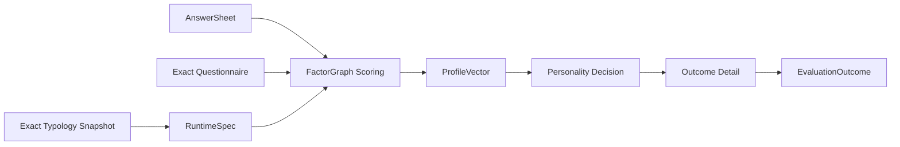

# typology：人格测评

> 状态：人格测评已经形成统一的 `factor_classification` 运行机制，支持极点组合、最近模式、连续特质画像和主导因子四类 Decision，并支持发布前问卷映射校验和草稿报告预览。代码中的 `KindTypology` 是历史名称，本文统一按广义“人格测评模型”解释。

## 1. 本文回答

1. 为什么人格测评不能直接复用医学量表的 score range；
2. 为什么 MBTI、SBTI、大五和九型可以属于同一个 Kind；
3. 人格因子、题目贡献、极点、模式和画像是什么关系；
4. 四种 DecisionKind 分别怎样选择结果；
5. 特殊答案触发规则位于什么边界；
6. Algorithm、DecisionKind 和报告 adapter 为什么不能混为一谈；
7. 怎样通过配置新增同类人格模型；
8. 当前统一运行时仍保留哪些迁移兼容面。

---

## 2. 30 秒结论

人格测评的共同主链是：

```text
AnswerSheet
  -> 题目对人格因子的贡献
  -> FactorGraph 形成 ProfileVector
  -> Decision 选择类型或构造特质画像
  -> 稳定 OutcomeCode + 人格明细事实
  -> Interpretation 组织人格报告
```

它与 scale 的关键差异是：

- scale 主要回答“某因子得了多少分，落在哪个风险区间”；
- typology 主要回答“多个因子共同形成什么类型、模式或特质画像”。

当前身份：

| 维度 | 值 |
| --- | --- |
| Kind | `typology` |
| SubKind | `typology` |
| ProductChannel | `typology` |
| AlgorithmFamily | `factor_classification` |
| ExecutionPath | `typology_descriptor` |
| Algorithm | `personality_typology` |
| DecisionKinds | `pole_composition`、`nearest_pattern`、`trait_profile`、`dominant_factor` |

正式定义：

> `typology` 是代码中的模型类型名称，业务语义覆盖所有“人格因子向量 + 类型/画像决策”的人格测评，不要求最终结果一定是离散类型。

---

## 3. 为什么人格模型独立成一个类型

医学量表常用单个因子分区间形成风险等级，但人格测评通常存在以下结构：

- 因子有左右极点；
- 多个维度共同组成类型代码；
- 结果可能取最接近的模式；
- 结果可能是多个连续特质，而不是唯一等级；
- 可能选择最高的一个或多个主导因子；
- 特定答案组合可能形成特殊结果。

例如，四个二元维度不能各自单独输出风险等级后简单拼报告。它们需要先形成一个有顺序的 ProfileVector，再由统一 Decision 选择结果。

因此人格测评的稳定抽象不是“每种人格理论一个 evaluator”，而是：

```text
FactorGraph
+ QuestionContribution
+ PersonalityDecision
+ OutcomeProfile
```

---

## 4. 为什么 MBTI、SBTI、大五和九型可以共享 Kind

它们的理论和输出不同，但计算过程存在稳定共性：

| 模型 | Factor 结果 | Decision | 输出形态 |
| --- | --- | --- | --- |
| MBTI | E/I、S/N、T/F、J/P 维度 | `pole_composition` | 组合类型代码 |
| SBTI/模式型测评 | 多维等级向量 | `nearest_pattern` | 最相近人格模式 |
| Big Five | O/C/E/A/N 连续维度 | `trait_profile` | 连续特质画像 |
| 九型/主导特质模型 | 多个类型因子分 | `dominant_factor` 或最近模式 | 主导类型或 TopK |

它们共享：

- 题目对维度的贡献；
- 因子图计算；
- ProfileVector；
- 稳定 Outcome/Profile；
- 人格报告明细。

差异集中在 Decision 和 Outcome 结构，可由 DefinitionV2 表达，因此没有必要为每种理论新增 Kind。

---

## 5. 模型身份的三层含义

### 5.1 Kind 表示人格测量范式

```text
Kind = typology
SubKind = typology
```

`SubKindTypology` 是当前发布校验要求。即使业务上是连续特质，仍使用该 SubKind，因为它目前表达的是“进入统一人格运行时”，而不是“结果必须是离散类型”。

### 5.2 Algorithm 表示稳定代码能力或历史身份

领域枚举仍保留：

- `personality_typology`；
- `mbti`；
- `sbti`；
- `bigfive`。

当前管理端 options 更倾向于对新模型暴露统一 `personality_typology`，但历史发布和初始化脚本仍会保存 MBTI、SBTI、Big Five 的具体 Algorithm。运行时 provider 对这些身份做统一适配。

文档不能把两者写成完全收敛：

```text
目标方向
  一个可配置人格运行时

当前事实
  发布数据和兼容路径仍保留多个具体 Algorithm identity
```

### 5.3 DecisionKind 决定结果选择

Algorithm 不是 DecisionKind。一个统一人格运行时可以按 Definition 选择不同 Decision；具体 Algorithm identity 也不能代替 Definition 中显式 Decision。

发布时 typology 必须从 TypeConclusion 读到明确 DecisionKind，不允许仅根据 Algorithm 猜测。

---

## 6. DefinitionV2 结构

人格模型在 DefinitionV2 中可以概念化为：

```text
Typology Definition
├── Measure
│   ├── Factors
│   ├── FactorGraph
│   └── Scoring/Contributions
├── Calibration
│   └── 当前为空
├── Conclusions
│   └── TypeConclusion
│       ├── FactorCodes
│       ├── Decision
│       ├── SpecialRules
│       ├── OutcomeMapping
│       └── Profiles
├── Outcomes
└── ReportMap
```

运行时会投影成统一 typology payload：

```text
RuntimeSpec
├── FactorGraph
├── Decision
├── SpecialRules
├── OutcomeMapping
└── Report
```

DefinitionV2 是领域创作事实，RuntimeSpec 是执行 DTO。两者不应形成两套可独立编辑的真相。

---

## 7. 人格 FactorGraph

### 7.1 Leaf Factor

叶子因子直接接收题目贡献：

```text
Question answer
  -> question score 或 option override
  -> sign
  -> weight
  -> leaf factor
```

例如某题对 E/I 维度可能正向或反向贡献。

### 7.2 Composite Factor

显式 FactorGraph 支持 composite factor：

- 子 Factor；
- sum/avg/weighted_avg 等聚合；
- 权重；
- root 顺序。

这样人格模型不必永远停留在“每个维度直接挂题”的扁平结构。

### 7.3 ProfileVector

Calculation 将图计算结果组织为稳定向量：

```text
ProfileVector {
  factor_1: score,
  factor_2: score,
  ...
}
```

Decision 消费向量，不重新读取 AnswerSheet。

---

## 8. 四种 Decision

### 8.1 pole_composition：极点组合

适合 MBTI 类模型。每个决策 Factor 定义：

- LeftPole；
- RightPole；
- Threshold；
- 可选 Model/MaxDeviation。

运行时按 Factor 分选择左右极点，再按固定顺序组合：

```text
E + N + F + P -> ENFP
```

关键不变式：

- 极点 Factor 顺序稳定；
- 每个极点结果都有定义；
- 组合 OutcomeCode 存在；
- 阈值边界有测试。

### 8.2 nearest_pattern：最近模式

适合将多维等级向量匹配到预定义模式：

```text
实际向量
  -> 按 LevelRule 离散化
  -> 与 Outcome.Pattern 比较
  -> 选择相似度最高者
```

可配置：

- PatternOrder；
- 低/高阈值；
- fallback similarity threshold；
- fallback outcome code。

### 8.3 trait_profile：连续特质画像

适合 Big Five。它不强制把五个连续维度压成唯一人格类型，而是保留每个 Factor 的连续结果。

输出重点是：

- 各特质得分；
- 维度等级；
- Profile detail；
- 对应解释资产。

这也是为什么 `KindTypology` 不能按中文直译成狭义“类型学”。

### 8.4 dominant_factor：主导因子

适合按最高 Factor 选择结果的模型：

- FactorOrder 提供稳定并列规则；
- TopK 决定保留几个主导因子；
- Outcome code 通常与 FactorCode 对齐。

它与 `nearest_pattern` 的区别是：前者选择高分主导维度，后者比较完整向量模式。

---

## 9. 特殊规则

人格模型支持在不同阶段应用特殊规则：

| Phase | 作用 |
| --- | --- |
| `before_score` | 特定答案命中后可跳过普通评分 |
| `before_decision` | 在结果选择前干预 |
| `after_decision` | 根据相似度或普通结果改写选择 |

当前主要规则类型：

- `answer_match`；
- `fallback_threshold`。

特殊规则必须输出稳定 OutcomeCode，不能直接生成整份报告。它也不能成为绕过 FactorGraph 的任意脚本入口。

---

## 10. OutcomeProfile 与解释边界

TypeOutcomeProfile 当前可携带：

- OutcomeCode；
- Pattern；
- Traits；
- Strengths；
- Weaknesses；
- Suggestions；
- Image；
- Rarity；
- Trigger/Commentary。

从领域目标看，应分成：

```text
Decision-owned facts
  OutcomeCode
  Pattern
  Similarity
  FactorVector
  SpecialMatch

Interpretation-owned assets
  Summary
  Strengths/Weaknesses
  Suggestions
  Image
  Rarity 文案
```

当前 Definition/typology payload 仍把两类内容放得较近，这是 [结果判定、Outcome 与解释边界](../25-核心设计-结果判定、Outcome与解释边界.md) 中已经标记的重构方向。

---

## 11. 发布校验

TypologyDefinitionHandler 的发布校验比普通 scale 更依赖问卷上下文：

1. 校验 AssessmentModel 基础身份；
2. 要求 `sub_kind=typology`；
3. 要求 Algorithm；
4. 校验 DefinitionV2；
5. 从 Definition 构造统一 typology payload/RuntimeSpec；
6. 读取绑定的已发布 QuestionnaireSnapshot；
7. 校验 QuestionMapping 中所有问题存在；
8. 校验 option score 与题目选项兼容；
9. 校验 FactorGraph；
10. 校验 Decision 所需极点、pattern、TopK 和 Outcome；
11. 校验 OutcomeMapping 和 Report adapter；
12. 验证 DefinitionV2 能物化为 canonical typology runtime DTO；该 DTO 不持久化。

缺少显式 DecisionKind 时发布失败，不使用 Algorithm 默认推断。

---

## 12. 草稿报告预览

人格模型支持在发布前提供样例 answers 预览报告：

```text
draft AssessmentModel
+ published QuestionnaireSnapshot
+ preview answers
  -> 校验答案
  -> MaterializeSnapshot
  -> 临时 InputSnapshot
  -> ReportPreviewer
  -> preview outcome/report
```

预览会检查：

- question_code 存在且不重复；
- 有选项题的 value 合法；
- 客户端传 score 时必须与选项分一致；
- 无选项题必须提供有限 score；
- 模型达到发布校验要求。

预览不创建正式 AnswerSheet、Assessment 或 Report，不能替代发布后端到端验证。

---

## 13. 执行输入与运行时



输入 provider：

1. 按 Assessment exact model ref 读取 retained release；
2. 从 DefinitionV2 重建 typology payload；
3. 读取 AnswerSheet；
4. 比较模型绑定与 AnswerSheet questionnaire code/version；
5. 读取精确 QuestionnaireSnapshot；
6. 形成 InputSnapshot。

Configured Evaluator：

1. 应用 before-score 特殊规则；
2. 构建 FactorGraph 和 DecisionSpec；
3. 计算 ProfileVector；
4. 选择 OutcomeCandidate；
5. 应用 after-decision 特殊规则；
6. 按 DetailAdapter 组装类型或特质明细。

---

## 14. EvaluationOutcome

人格 Outcome 需要保留比一个结果代码更丰富的事实：

- ModelIdentity；
- ProfileVector；
- SelectedOutcomeCode；
- MatchSimilarity；
- DecisionKind；
- 特殊规则命中事实；
- 类型明细或 TraitProfile 明细。

不能只保存“ENFP”或“开放性高”。否则无法解释结果如何从因子向量得到，也无法支撑细粒度报告和趋势。

---

## 15. 新人格模型怎样接入

### 15.1 只需配置

满足以下条件时复用统一人格运行时：

- 题目可以映射到人格 Factor；
- FactorGraph 能表达组合；
- 四种 Decision 之一能够产生结果；
- 结果可由现有 personality_type 或 trait_profile detail 表达。

步骤：

1. 发布 Questionnaire；
2. 创建 `kind=typology, sub_kind=typology` 模型；
3. 选择正式 Algorithm identity；
4. 配置 FactorGraph/QuestionMappings；
5. 选择 DecisionKind；
6. 配置 Outcomes、SpecialRules 和 OutcomeMapping；
7. 配置解释资产；
8. 使用代表性答案预览；
9. 联合发布。

### 15.2 需要新 Algorithm

当新人格模型需要：

- 新的因子计算方式；
- 现有四种 Decision 无法表达的匹配算法；
- 新的稳定 detail structure；
- 特有但可复用的代码能力；

才新增 Algorithm/Decision/adapter。只改变维度数量、极点名称或 Outcome 文案不需要新算法。

---

## 16. 当前实现不足

### 16.1 Algorithm identity 已收敛

API、领域枚举、发布快照与 Assessment 都只使用 `personality_typology`。MBTI、SBTI、Big Five 等差异放入 canonical DefinitionV2 与 Interpretation template identity，不再作为 Algorithm alias。

### 16.2 RuntimeSpec 只从 DefinitionV2 物化

DimensionOrder、Dimensions、QuestionMappings、MatchingSpec 等 runtime 字段由 DefinitionV2 临时物化，不持久化第二份投影。

### 16.3 解释资产仍与结果定义混合

OutcomeProfile 中大量报告文案仍随模型发布。发布一致性有价值，但领域所有权需要逐步向 Interpretation 收敛。

### 16.4 公共输入不变式尚未统一

typology provider 已检查 model 与 AnswerSheet 的问卷版本，但四方统一校验仍应上移到公共 InputSnapshot validator。

---

## 17. 失败语义

| 失败 | 阶段 | 处理 |
| --- | --- | --- |
| sub_kind 缺失 | 发布 | 拒绝发布 |
| DecisionKind 缺失 | 发布 | 拒绝，不能按 Algorithm 猜 |
| QuestionMapping 指向不存在题目 | 发布 | 拒绝 |
| option score 与问卷不一致 | 发布/预览 | 拒绝 |
| 极点、Pattern、TopK 不完整 | 发布 | 拒绝 |
| OutcomeCode 不存在 | 发布 | 拒绝 |
| AnswerSheet 问卷版本不同 | 输入物化 | validation failure |
| execution identity 没有 provider | 运行时 | unsupported model |
| special rule 指向未知结果 | 发布 | 拒绝 |
| detail adapter 不支持 | 运行时/报告 | 显式失败，不返回空报告 |

---

## 18. 设计检查表

- [ ] 结果确实是人格类型、模式或连续特质画像；
- [ ] FactorCode 和顺序稳定；
- [ ] 每道题的贡献方向、权重和选项映射明确；
- [ ] Composite Factor 无环；
- [ ] DecisionKind 显式配置；
- [ ] 极点阈值或 pattern level 边界已测试；
- [ ] 每个可能结果都有 OutcomeCode；
- [ ] fallback 和特殊规则不会产生未知结果；
- [ ] DetailAdapter 与结果形态匹配；
- [ ] 报告文案不被当作计算事实；
- [ ] 使用典型、边界和特殊答案做预览。

---

## 19. 面试追问

### 为什么 MBTI 和 Big Five 可以共用执行主链？

因为两者都先把作答转换成人格因子向量。MBTI 再做极点组合，Big Five 保留连续特质画像。差异位于 Decision 和 detail assembler，不需要复制输入加载、因子图计算、运行状态和 Outcome 提交主链。

### 为什么 typology 不直接按 Algorithm 选择结果？

Algorithm 表示稳定代码能力，DecisionKind 表示本次发布模型怎样把向量转换成结果。发布模型必须显式冻结 Decision，执行时不能根据一个宽泛 Algorithm 猜测。

### 特殊规则会不会破坏配置化设计？

特殊规则被限制为有阶段、有类型、有稳定 OutcomeCode 的声明式规则，并由统一 engine 执行。它不是任意脚本，也不拥有报告生成能力。

---

## 20. 事实源与验证

| 主题 | 源码 |
| --- | --- |
| TypologyDefinitionHandler/预览 | [`application/modelcatalog/definition/typology_handler.go`](../../../../internal/apiserver/application/modelcatalog/definition/typology_handler.go) |
| Typology payload/RuntimeSpec | [`port/modelcatalog/payload/typology`](../../../../internal/apiserver/port/modelcatalog/payload/typology/) |
| Typology input provider | [`infra/evaluationinput/typology_catalog.go`](../../../../internal/apiserver/infra/evaluationinput/typology_catalog.go) |
| Configured evaluator | [`application/evaluation/registry/mechanisms/typology/runtime/configured`](../../../../internal/apiserver/application/evaluation/registry/mechanisms/typology/runtime/configured/) |
| Classification calculation | [`domain/calculation/classification`](../../../../internal/apiserver/domain/calculation/classification/) |
| Personality seed/migration | [`scripts/oneoff/seed_personality_typology`](../../../../scripts/oneoff/seed_personality_typology/) |

```bash
go test ./internal/apiserver/application/modelcatalog/definition -run Typology
go test ./internal/apiserver/port/modelcatalog/payload/typology
go test ./internal/apiserver/infra/evaluationinput -run Typology
go test ./internal/apiserver/application/evaluation/registry/mechanisms/typology/...
go test ./internal/apiserver/domain/calculation/classification/...
```
