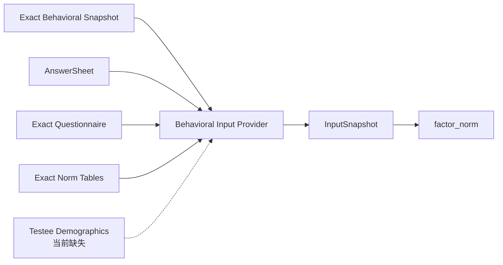

# behavioral_rating：行为评定

> 状态：`behavioral_rating + factor_norm` 已支持 BRIEF-2 和感觉统合 SPM 的因子、复合指数、精确常模、T 分/百分位和等级投影。正式发布已强制 NormRef、Primary NormConclusion 与 `norm_lookup`（见 `MC-R003`）。历史 default/`score_range` snapshot 的兼容读取与下线仍属后续治理。

## 1. 本文回答

1. 行为评定与医学量表有什么区别；
2. 为什么行为原始分必须经过常模才能解释；
3. BRIEF-2 和感觉统合 SPM 为什么属于同一模型类型；
4. Dimension、Index、Validity、Total 等 FactorRole 怎样协作；
5. NormRef、NormSubject、T 分和 percentile 怎样形成完整校准链；
6. `brief2` 和 `spm_sensory` Algorithm 分别表达什么；
7. 当前实现为什么还不能宣称人口学常模已经完整闭环；
8. 怎样新增同类行为评定模型。

---

## 2. 30 秒结论

行为评定的核心链路是：

```text
观察者/受测者填写行为题目
  -> 单题基础分
  -> 行为 Dimension 原始分
  -> Composite Index / Total / Validity
  -> 按 NormSubject 选择精确常模层
  -> T 分 / 百分位 / 标准分
  -> NormConclusion
  -> 行为等级 Outcome
```

它和 scale 都会先聚合 Factor，但决定性差异是：

```text
scale
  原始因子分本身即可进入 score_range

behavioral_rating
  原始因子分必须放进参考人群常模后才能解释
```

正式领域规则：

> `behavioral_rating` 必须绑定精确 Norm；没有 Norm，只按原始分区间判定的配置应使用 `scale`。

当前身份：

| 维度 | 值 |
| --- | --- |
| Kind | `behavioral_rating` |
| ProductChannel | `behavior_ability` |
| AlgorithmFamily | `factor_norm` |
| ExecutionPath | `behavioral_rating_descriptor` |
| Algorithms | `brief2`、`spm_sensory` |
| DecisionKind | `norm_lookup` |

---

## 3. 它解决的业务问题

公司在 ADHD 业务之外扩展了线下行为干预治疗，需要观察儿童在执行功能、感觉处理或日常行为方面的表现。此类测评常由：

- 家长；
- 教师；
- 治疗师；
- 本人；

根据一段时间内的行为进行评定。

原始分不能直接解释。例如同样的 20 分，在不同年龄、性别、表单版本和参考人群中可能代表不同偏离程度。行为评定真正回答的是：

> 受测者的行为表现相对于适用参考人群处在什么位置？

因此常模不是性能优化数据，也不是可选报告附件，而是模型语义的一部分。

---

## 4. 什么时候选择 behavioral_rating

应同时满足：

- 测量对象是可观察行为或执行功能表现；
- 作答通常来自本人或观察者评价；
- 题目可以形成行为维度原始分；
- 存在综合指数、总分或有效性指标；
- 原始分需要转换为 T 分、百分位或标准分；
- 常模至少按表单版本，可能按年龄和性别分层；
- 最终等级依据校准分，而不是原始分。

不适合：

| 场景 | 类型 |
| --- | --- |
| 无常模、只做原始分区间 | `scale` |
| 人格类型或特质画像 | `typology` |
| 客观正确答案任务 | `cognitive` |
| 只记录观察信息、不计算 | 独立 Questionnaire |

---

## 5. BRIEF-2 与感觉统合 SPM

### 5.1 BRIEF-2

BRIEF-2 是执行功能行为评定。当前模型身份：

```text
Kind      = behavioral_rating
Algorithm = brief2
Family    = factor_norm
```

DefinitionV2 的 `Execution.Brief2` 冻结：

- FormVariant；
- PrimaryFactorCode；
- IndexFactorCodes；
- ValidityFactorCodes。

Norm table body 仍作为独立资产，通过 `Calibration.NormRefs` 精确引用。

### 5.2 感觉统合 SPM

感觉统合领域的 Sensory Processing Measure 当前身份：

```text
Kind      = behavioral_rating
Algorithm = spm_sensory
Family    = factor_norm
```

它同样是观察行为因子 + 常模校准，不是客观认知题目。

### 5.3 不要与 Raven SPM 混淆

```text
spm_sensory
  Sensory Processing Measure
  behavioral_rating
  行为观察 + 常模

spm
  Raven Standard Progressive Matrices
  cognitive
  正确答案 + 题组表现
```

缩写相同不意味着模型类型或算法相同。

---

## 6. 领域结构

```text
Behavioral Rating Definition
├── Measure
│   ├── Factors
│   │   ├── dimension
│   │   ├── index
│   │   ├── validity
│   │   └── total
│   ├── FactorGraph
│   └── Scoring
├── Calibration
│   └── NormRefs[]（必需）
├── Execution
│   └── Brief2Spec（algorithm=brief2 时必需）
├── Conclusions
│   └── NormConclusion[]
├── Outcomes
└── ReportMap
```

### 6.1 Dimension

直接由题目聚合形成的行为维度，例如抑制、工作记忆或感觉域。

### 6.2 Index

由多个 Dimension 进一步聚合形成综合指数。它必须在 FactorGraph 中声明子节点和聚合策略，不能在报告层临时相加。

### 6.3 Validity

有效性因子用于提示答卷一致性或特殊作答模式。它是测量事实的一部分，但不一定是 Primary outcome。

### 6.4 Total

总分或总执行功能指数。它可以是 PrimaryFactorCode，但必须由模型明确配置，而不是默认选择第一个 Factor。

---

## 7. Norm 是独立版本化资产

DefinitionV2 不内嵌完整常模表，只保存：

```text
NormRef {
  FactorCode
  NormTableVersion
}
```

独立 `Norm` 保存：

- TableVersion；
- FormVariant；
- Kind；
- Algorithm；
- Factor tables；
- demographic Bands；
- direct Lookup rows。

这样可以：

- 多个模型 release 引用同一常模；
- 新常模发布为新版本；
- 历史 Assessment 重试仍读取旧 Norm；
- 发布时校验 Kind/Algorithm 兼容性。

---

## 8. 两种常模转换方式

### 8.1 Direct Lookup

```text
factor raw score
+ age scope
+ gender scope
  -> TScore
  -> Percentile
  -> optional StandardScore
```

同一 raw range 可以同时存在人口学专用行和 generic fallback，但相同人口学范围不能产生歧义重叠。

### 8.2 Parametric Band

常模提供 mean/stddev 时：

```text
T = 50 + 10 * ((raw - mean) / stddev)
```

随后根据标准正态近似计算 percentile。

### 8.3 NormConclusion

`NormConclusion` 指定：

- FactorCode；
- ScoreBasis；
- 是否 Primary；
- 校准分区间；
- 稳定 OutcomeCode/Level。

behavioral_rating 至少需要一个 Primary NormConclusion，才能确定 Assessment 的主等级。

---

## 9. NormSubject

```text
NormSubject {
  AgeMonths
  Gender
}
```

它决定具体选择哪一人口学常模层。年龄不应简单使用“当前年龄”，而应以测评发生时间和可靠出生日期计算。

目标输入关系：

```text
Assessment.TesteeID
  -> Actor/Testee demographic snapshot
  -> AgeMonths at assessment time
  -> normalized Gender
  -> InputSnapshot.NormSubject
```

缺失资料必须有明确业务策略：

- 拒绝执行；
- 使用显式 generic norm；
- 产生“无法校准”结果；
- 绝不能随机命中某个分层。

---

## 10. 当前 NormSubject 没有生产闭环

当前 `InputSnapshot` 已有 NormSubject，Calculation 也会消费它，但生产 behavioral provider 没有从 Testee/Actor 加载人口学资料。只有测试 fixture 显式填充。

影响分两类：

### 10.1 Direct lookup

人口学专用 lookup 在 subject 缺失时无法匹配；如果配置了 generic row，会退回 generic。

### 10.2 Parametric band

当前 `bandMatchesSubject` 在 subject 的 gender/age 为空时，不会严格拒绝带人口学范围的 band，可能选择遍历顺序中的第一个可用 band。

因此这不仅是“常模精度不足”，而是潜在的确定性与正确性风险。目标改造应同时：

1. 补齐 NormSubject；
2. subject 缺失时只允许显式 generic band；
3. 记录实际选中的 NormReference；
4. 增加无 subject、多 band 的回归测试。

---

## 11. 发布校验

BehavioralRatingDefinitionHandler 当前执行：

- 基础模型校验；
- DefinitionV2 通用校验；
- NormRef 指向的表存在；
- BRIEF-2 必须存在 Execution.Brief2；
- DecisionKind 可以从 Definition 解析；
- 构建 behavioral runtime payload；
- 加载并投影引用常模。

已经确认的目标还应增加：

- 至少一个 NormRef；
- 每个需要校准的 Factor 都有 NormRef；
- 至少一个 `Primary=true` 的 NormConclusion；
- Primary Factor 存在；
- Norm.Kind 必须是 behavioral_rating；
- Norm.Algorithm 与 Model.Algorithm 完全一致；
- Norm.FormVariant 与 ExecutionSpec/模型表单一致；
- 没有 Norm 时拒绝发布，而不是退化成 score_range。

---

## 12. 输入物化



provider 按 exact model ref：

1. 读取 retained AssessmentSnapshot；
2. 遍历 DefinitionV2.Calibration.NormRefs；
3. 按 TableVersion 精确加载 Norm；
4. 从 DefinitionV2 + Norm 构造 Behavioral Snapshot；
5. 读取 AnswerSheet；
6. 读取精确 QuestionnaireSnapshot；
7. 形成 InputSnapshot。

当前缺少第八步：加载并冻结 NormSubject。

---

## 13. factor_norm 执行机制

```text
factor scoring
  -> composite projection
  -> norm projection
  -> hierarchy projection
  -> primary level
  -> EvaluationOutcome
```

### 13.1 复用 factor_scoring

behavioral runtime 将 Behavioral Snapshot 投影为 scale-compatible scoring input，复用题目到因子原始分的通用计算。

### 13.2 Composite projection

根据 FactorGraph/ScoreNodes 形成 Index 与 Total，而不是由报告层计算。

### 13.3 Norm projection

对每个存在 Norm table 的 Factor：

- 查人口学 direct lookup 或 parametric band；
- 附加 TScore/Percentile/StandardScore；
- 记录 NormReference；
- 应用 TScore interpretation rules。

### 13.4 Primary result

从配置的 PrimaryDimensionCode 选择 Assessment 主等级。不能以最大 T 分或第一个 Factor 隐式决定主结果。

---

## 14. EvaluationOutcome 与趋势

行为评定 Outcome 至少需要保留：

- raw Factor score；
- composite/index score；
- derived TScore；
- percentile；
- optional standard score；
- level code；
- Norm table version；
- form variant；
- 实际人口学 NormReference；
- validity factor；
- Primary factor。

趋势比较应明确比较什么：

- 原始分受表单和题数影响；
- T 分更适合跨时间观察相对位置；
- 不同 NormVersion 之间是否直接可比需要医学/数据治理判断；
- FactorCode 变化会断开历史序列。

---

## 15. Interpretation 边界

Calculation/Evaluation 产生：

- 原始分；
- T 分/百分位；
- NormReference；
- 等级代码；
- validity facts。

Interpretation 再负责：

- 行为维度说明；
- 临床辅助提示；
- 家长/医生友好文案；
- 治疗建议组织；
- 报告章节与图表。

报告不能把“偏离常模”直接写成医学诊断。

---

## 16. 新行为评定模型怎样接入

若新模型仍是“行为因子 + 常模校准”，通常复用 factor_norm：

1. 创建并发布 Questionnaire；
2. 导入不可变 Norm；
3. 创建 `kind=behavioral_rating` 模型；
4. 选择既有或新增 Algorithm；
5. 配置 Dimension/Index/Validity/Total；
6. 配置 Scoring 与 FactorGraph；
7. 配置精确 NormRefs；
8. 配置 Primary NormConclusion；
9. 配置解释资产；
10. 联合发布；
11. 使用不同年龄/性别和边界原始分验证。

新增 Algorithm 的条件：

- 需要特有 ExecutionSpec；
- 需要不同的 validity 计算；
- 需要不同于通用 lookup/band 的稳定常模算法；
- 需要新的 Outcome detail，但仍属于行为评定。

---

## 17. 当前实现不足

### P0：发布没有强制 Norm

当前 `behavioralDecisionKind` 在无 Norm 时可返回 score_range，与已确认类型边界和固定 factor_norm 路由不一致。

### P0：NormSubject 未填充

生产输入无法可靠选择人口学常模层，parametric band 的空 subject 行为尤其需要修复。

### P1：只支持一个 NormTableVersion 的物化假设

BehavioralRatingDefinitionHandler 的 payload 构建会拒绝 Definition 同时引用多个不同 Norm table version。长期如果不同 Factor 合理引用不同常模，需要扩展 runtime profile，而不是依赖单表假设。

### P1：解释文案混入 norm rule

TScoreRange 仍携带 Conclusion/Suggestion，Calculation projection 会写进结果描述。目标上 LevelCode 属于 Decision，长文案应由 Interpretation 管理。

### P2：default Algorithm 兼容

运行时和 payload 仍保留 `behavioral_rating_default` 兼容。BRIEF-2 和 SPM sensory 的 Assessment 必须保存真实 Algorithm，不能用 default 代替业务身份。

---

## 18. 失败语义

| 失败 | 阶段 | 处理 |
| --- | --- | --- |
| 无 NormRef | 目标发布校验 | 拒绝发布 |
| Norm 不存在 | 发布/输入 | 拒绝，不换 latest |
| Norm Kind/Algorithm 不匹配 | 导入/发布 | 拒绝 |
| FactorCode 不在 Norm | 发布/执行 | 拒绝或 validation failure |
| Primary NormConclusion 缺失 | 目标发布校验 | 拒绝 |
| NormSubject 缺失 | 目标执行策略 | 只允许显式 generic 或失败 |
| 原始分查不到常模 | 执行 | 显式不可校准，不静默返回原始等级 |
| BRIEF-2 无 ExecutionSpec | 发布 | 拒绝 |
| AnswerSheet 版本不匹配 | 输入 | validation failure |

---

## 19. 设计检查表

- [ ] 业务解释确实依赖常模；
- [ ] 表单版本与 Norm.FormVariant 对齐；
- [ ] Model.Algorithm 与 Norm.Algorithm 对齐；
- [ ] 每个常模 FactorCode 在 Measure 中存在；
- [ ] FactorGraph 无环；
- [ ] Index/Total 的 children 和策略明确；
- [ ] 有且仅有明确 Primary result；
- [ ] 年龄按测评时间计算；
- [ ] 性别枚举已归一；
- [ ] 缺失人口学资料有明确语义；
- [ ] lookup/band 无歧义重叠；
- [ ] Outcome 保存实际 NormReference；
- [ ] 边界 raw score、年龄边界和性别分层均有测试。

---

## 20. 面试追问

### 为什么行为评定不能直接使用 scale？

两者共享因子原始分计算，但行为评定的结果语义来自参考人群位置。相同原始分在不同年龄或表单中含义不同，因此必须显式建模 Norm、NormSubject 和 norm_lookup，而不能把常模当成报告层附加逻辑。

### 为什么 Norm 要独立版本化？

常模可以被多个模型引用，也可能独立修订。模型只冻结精确 NormRef，既避免大表重复，又保证历史执行和重试不漂移。

### BRIEF-2 和感觉统合 SPM 为什么共用 family？

它们都先聚合行为因子，再经过常模校准。具体 Factor 和常模不同，但执行范式相同，因此复用 factor_norm，仅保留不同 Algorithm identity 和配置。

---

## 21. 事实源与验证

| 主题 | 源码 |
| --- | --- |
| Behavioral handler | [`application/modelcatalog/definition/behavioral_rating_handler.go`](../../../../internal/apiserver/application/modelcatalog/definition/behavioral_rating_handler.go) |
| Behavioral payload | [`port/modelcatalog/payload/behavioral`](../../../../internal/apiserver/port/modelcatalog/payload/behavioral/) |
| Norm domain/import validation | [`domain/modelcatalog/norm`](../../../../internal/apiserver/domain/modelcatalog/norm/) |
| Behavioral input catalog/provider | [`infra/evaluationinput/published_behavioral_rating_catalog.go`](../../../../internal/apiserver/infra/evaluationinput/published_behavioral_rating_catalog.go)、[`behavioral_rating_provider.go`](../../../../internal/apiserver/infra/evaluationinput/behavioral_rating_provider.go) |
| factor_norm pipeline | [`application/evaluation/registry/mechanisms/norming`](../../../../internal/apiserver/application/evaluation/registry/mechanisms/norming/) |
| Norm calculation | [`domain/calculation/norm`](../../../../internal/apiserver/domain/calculation/norm/) |
| BRIEF-2/SPM sensory seed | [`scripts/oneoff/seed_brief2`](../../../../scripts/oneoff/seed_brief2/)、[`seed_spm_sensory`](../../../../scripts/oneoff/seed_spm_sensory/) |

```bash
go test ./internal/apiserver/application/modelcatalog/definition -run Behavioral
go test ./internal/apiserver/port/modelcatalog/payload/behavioral
go test ./internal/apiserver/domain/modelcatalog/norm
go test ./internal/apiserver/infra/evaluationinput -run Behavioral
go test ./internal/apiserver/application/evaluation/registry/mechanisms/norming
go test ./internal/apiserver/domain/calculation/norm
```
