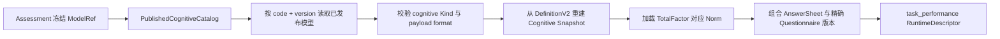
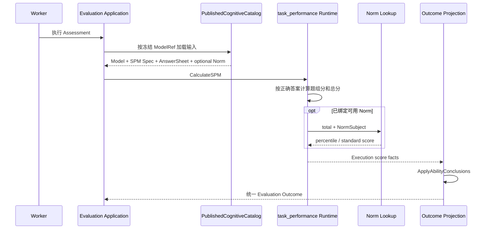

# cognitive：认知测验

> 状态：`cognitive + task_performance` 当前只有 Raven Standard Progressive Matrices（Raven SPM）一个完整执行实现。系统已能冻结题组、正确答案、总分因子、可选常模引用和能力等级规则；但认知常模导入、受试者人口学资料、服务端计时与更广泛的认知任务扩展尚未闭环。

## 1. 本文回答

1. 认知测验与医学量表、行为评定有什么根本区别；
2. 为什么 Raven SPM 属于 `cognitive`，感觉统合 SPM 属于 `behavioral_rating`；
3. `task_performance` 如何通过客观答案键计算任务表现；
4. ItemSet、TotalFactor、Norm 和 AbilityConclusion 怎样协作；
5. `TimeLimitSeconds` 当前究竟是服务端约束，还是客户端提示；
6. 一次已发布认知模型如何变成 Evaluation 可执行输入；
7. 新增同类认知任务时，哪些信息应配置化，什么时候应引入新算法；
8. 当前实现距离完整认知测验平台还有哪些缺口。

---

## 2. 30 秒结论

认知测验不是让用户主观评价自己，而是让受试者完成有客观计分规则的任务，再从任务表现推导能力水平。

Raven SPM 当前的执行链路是：

```text
受试者完成图形推理题
  -> 按发布版本的 CorrectOptionCode 判分
  -> 按 ItemSet 统计答对数
  -> 聚合 Total raw score
  -> 可选：按 NormSubject 查询百分位/标准分
  -> AbilityConclusion
  -> 稳定 OutcomeCode 与能力等级
```

当前身份：

| 维度 | 值 |
| --- | --- |
| Kind | `cognitive` |
| ProductChannel | `behavior_ability` |
| AlgorithmFamily | `task_performance` |
| ExecutionPath | `cognitive_descriptor` |
| Algorithm | `spm` |
| PayloadFormat | 新发布统一为 `assessmentmodel.cognitive.default.v1` |
| DecisionKind | `ability_level` |

本文的最重要边界是：

> `cognitive` 是模型类型，`task_performance` 是算法族，`spm` 是当前已实现的具体算法。当前代码证明系统能执行 Raven SPM，不等于已经形成了通用认知任务平台。

---

## 3. 它解决的业务问题

量表和行为评定主要依赖受试者或观察者的选择。认知测验则通过完成任务来观察表现，例如：

- 图形推理的答对数；
- 记忆任务的正确率；
- 注意任务的命中、遗漏与误报；
- 执行功能任务的正确性和反应时；
- 不同题组或难度层的表现差异。

因此，认知测验的核心问题不是“用户选了什么”，而是：

> 在一个冻结的任务、答案键和计分契约下，受试者展现出什么任务表现，这些表现对应什么能力水平？

与其他测评结果一样，这些结果只能为医生判断、治疗观察和随访提供辅助信息，不是医学诊断。

---

## 4. 什么时候选择 cognitive

适合 `cognitive`：

- 作答存在可重复执行的客观判分契约；
- 结果是正确数、正确率、反应时或其他任务表现指标；
- 题目需要组织为题组、任务集或能力域；
- 执行结果可能需要常模校准；
- 最终需要映射到能力等级或稳定 Outcome。

不适合：

| 场景 | 应选择 |
| --- | --- |
| 主观症状频率、程度填报 | `scale` |
| 人格类型或连续特质画像 | `typology` |
| 观察者对日常行为进行评定，并依赖行为常模 | `behavioral_rating` |
| 只收集信息，无测评执行 | 独立 Questionnaire |

---

## 5. Raven SPM 与感觉统合 SPM 必须分开

`SPM` 在当前业务中可能指两个完全不同的测评：

```text
spm
  Raven Standard Progressive Matrices
  瑞文标准推理测验
  cognitive + task_performance
  客观正确答案 + 题组表现

spm_sensory
  Sensory Processing Measure
  感觉统合行为评定
  behavioral_rating + factor_norm
  行为观察因子 + 常模
```

代码层已通过 `AlgorithmSPM` 与 `AlgorithmSPMSensory` 分离两者。文档、配置、运营界面和排障信息都应带上完整名称，不应只写“SPM”。

---

## 6. 领域结构

```text
Cognitive Definition
├── Measure
│   ├── Factors
│   │   ├── task_set
│   │   ├── total
│   │   └── ability_domain（可选）
│   └── FactorGraph / Scoring（通用测量定义）
├── Calibration
│   └── NormRefs[]（可选）
├── Execution
│   └── SPMSpec
│       ├── TimeLimitSeconds
│       ├── TotalFactorCode
│       └── ItemSets[]
│           └── Items[]
│               ├── QuestionCode
│               └── CorrectOptionCode
├── Conclusions
│   └── AbilityConclusion[]
├── Outcomes
└── ReportMap
```

这个结构刻意区分三件事：

- `Measure` 声明测量结果的因子语义；
- `Execution.SPM` 声明 Raven 任务怎样客观判分；
- `Conclusions` 声明任务表现怎样进入可稳定解释的能力等级。

---

## 7. SPMSpec 是发布后不可变的执行契约

对 Raven SPM，模型不能只声明“算总分”，还必须冻结：

- 题组编码；
- 每个题组包含的题目；
- 每道题的正确选项；
- 汇总结果对应的 TotalFactorCode；
- 客户端展示的时间限制。

这些信息不应在 Evaluation 运行时按最新问卷或最新配置重新推导。一旦模型发布，它们就是该次 release 的不可变事实。

这样可以保证：

- 历史答卷按当时正确答案重放；
- 新版本更换题目或答案时不改变旧结果；
- 题组分和总分的来源可追溯；
- 运营配置与运行时计算使用同一份契约。

---

## 8. 题组、答案键与原始分

### 8.1 ItemSet

ItemSet 是当前 Raven 执行结果的最小分组维度。每个题组形成一个 `task_set` DimensionResult：

```text
set raw score = 该题组答对数
set max score = 该题组题目数
```

### 8.2 CorrectOptionCode

当前每道题只配置一个 `CorrectOptionCode`。运行时将 AnswerSheet 中的答案值转成字符串，与冻结答案键做精确比较。

当前语义：

| 作答情况 | 计分 |
| --- | --- |
| 答案等于 CorrectOptionCode | 1 |
| 答案不等 | 0 |
| 未作答 | 0 |

它还不支持：

- 多个正确答案；
- 部分得分；
- 选项权重；
- 错误答案扣分；
- 根据作答路径动态计分。

如果新测验只是“题组 + 单一正确答案 + 答对数”，应优先扩展配置；如果需要新的任务状态、时序指标或计分机制，则应评估新 Algorithm。

### 8.3 Total

```text
total raw score = 所有 ItemSet 答对数之和
total max score = 所有 ItemSet 题数之和
```

Total 同时写入：

- Execution.Primary；
- Execution.Summary.Score；
- `TotalFactorCode` 对应的 total DimensionResult。

---

## 9. TimeLimitSeconds 的当前语义

DefinitionV2 要求 Raven SPM 配置正数 `TimeLimitSeconds`，但当前服务端不根据答卷耗时拒绝提交，也不在计分时扣除超时题目。

因此，现阶段它的准确语义是：

> 发布给测试客户端的作答时限元数据，而不是 qs-server 已经强制的服务端业务规则。

文档不应宣称“服务端保证限时作答”。如果未来限时影响有效性或计分，至少需要：

- 可信的任务开始时间；
- 服务端可验证的提交时间；
- 暂停、断网恢复与重进语义；
- 超时后是拒绝、标记还是降分的业务决策；
- 对上述事实的审计。

---

## 10. Norm 对 cognitive 是可选校准资产

认知任务可以只输出原始任务表现，也可以将总分放到参考人群中解释。因此它与 `behavioral_rating` 的正式边界不同：

```text
behavioral_rating
  Norm 是必需领域资产

cognitive
  Norm 是可选校准资产
  无 Norm 时仍可以得到原始任务表现
```

当前 PublishedCognitiveCatalog 只会查找与 `TotalFactorCode` 匹配的 NormRef，然后将该常模载入 Raven 运行时快照。命中常模后，当前可以产生：

- Percentile；
- 可选 StandardScore。

### 10.1 当前不完整之处

1. `norm.ValidateImport` 目前只允许 `behavioral_rating` 的几种算法身份，会拒绝 `cognitive + spm`。
2. 生产输入链路尚未稳定填充年龄、性别等 NormSubject。
3. 当前只加载总分因子常模，不支持每个 ItemSet 或多能力域各自校准。

所以，当前代码表明“运行时已预留 Raven 常模查询”，但不应宣称“Raven 常模管理与执行已经完整闭环”。

---

## 11. AbilityConclusion 从表现进入能力等级

AbilityConclusion 指定：

- FactorCode；
- ScoreBasis；
- 分数区间；
- Level；
- OutcomeCode；
- 可选的标题、摘要和说明。

当前可用 ScoreBasis：

| ScoreBasis | 语义 | 当前 Raven 可用性 |
| --- | --- | --- |
| `raw_score` | 原始答对数 | 可用 |
| `percentile` | 常模百分位 | 绑定且命中 Norm 时可用 |
| `standard_score` | 标准分 | Norm 提供时可用 |
| `t_score` | T 分 | 通用结论类型允许，当前 Raven 计算器未写入 T 分 |

这里必须区分：

```text
raw task performance
  计算事实

derived norm score
  校准事实

AbilityConclusion
  结果判定

Outcome
  稳定的业务语义编码与文案资产
```

计算器不应硬编码“中等”、“优秀”等文案；它只产生分数事实，再由 AbilityConclusion 对当时发布的规则做判定。

---

## 12. 创建与发布校验

运营创建 Raven SPM 模型时，应至少完成：

1. 选择 `cognitive` Kind；
2. 选择 `spm` Algorithm；
3. 绑定已发布 Questionnaire 版本；
4. 定义题组和 Total Factor；
5. 为每道题冻结 QuestionCode 与 CorrectOptionCode；
6. 配置正数 TimeLimitSeconds；
7. 可选引用总分 Norm；
8. 配置 AbilityConclusion 与 Outcomes；
9. 完成 ReportMap。

当前发布处理器已经明确校验：

- DefinitionV2 必须存在；
- `algorithm=spm` 时 Execution.SPM 必须存在；
- TimeLimitSeconds 必须大于 0；
- TotalFactorCode 必须存在；
- 题组、题目、题目编码和正确选项必须完整；
- AbilityConclusion 引用的 Factor、ScoreBasis 和 Outcome 必须合法；
- NormRef 指向的资产需要通过通用发布校验。

发布成功后，DefinitionV2 投影为当次 AssessmentSnapshot 的 cognitive payload。新发布统一使用 family payload format；历史 `assessmentmodel.cognitive.spm.v1` 只保留解码兼容，不应再作为新建模型的格式选项。

---

## 13. 已发布模型如何变成执行输入



这条链路必须保持版本精确性：

- Assessment 必须引用完整 ModelRef；
- 已发布模型必须按精确 version 读取；
- AnswerSheet 必须属于模型冻结的 Questionnaire code/version；
- 计分使用当时模型中的答案键；
- Norm 必须按 NormTableVersion 精确读取。

当前 cognitive provider 已经要求精确模型版本，但 Raven 直接计算链尚应继续向通用的“Model–Assessment–AnswerSheet–Questionnaire 四方一致性”校验收敛。

---

## 14. task_performance 执行链



当前 RuntimeDescriptor 仍遵循统一三段式结构：

1. InputAdapter；
2. Calculator；
3. OutcomeAssembler。

Worker 只负责异步消费和执行控制，不拥有 Raven 的答案键、计分规则或能力等级规则。

---

## 15. Outcome 应保留哪些计算事实

对当前 Raven SPM，统一 Evaluation Outcome 应能表达：

- 每个 ItemSet 的 raw score 和 max score；
- Total raw score 和 max score；
- 可选 percentile；
- 可选 standard score；
- 匹配的 AbilityConclusion Level；
- 稳定 OutcomeCode；
- 完整 ModelRef。

未来如果增加其他认知任务，Outcome 可能还需要：

- 正确率；
- 反应时分布；
- 遗漏数与误报数；
- 任务阶段表现；
- 速度–准确性权衡；
- 有效性标记。

但这些是扩展方向，不是当前 Raven 实现已有的能力。

---

## 16. ModelCatalog、Calculation、Evaluation 与 Interpretation 的边界

### 16.1 ModelCatalog 拥有

- `cognitive + spm` 模型身份；
- 问卷版本绑定；
- 题组和正确答案键；
- TotalFactorCode；
- NormRef；
- AbilityConclusion；
- Outcomes；
- ReportMap；
- 已发布不可变快照。

### 16.2 Calculation 应拥有

- 客观答案比较；
- 题组分和总分计算；
- 常模数学转换；
- 未来的正确率、反应时和其他纯计算机制。

当前 Raven 纯计算仍位于 Evaluation application 的 `task_performance/spm_calculator.go`。按已确认的边界，未来应考虑将纯计算向 `domain/calculation` 收敛，Evaluation 只编排输入、算法和结果。

### 16.3 Evaluation 拥有

- 按 Assessment 冻结引用组装执行输入；
- 选择 `task_performance` RuntimeDescriptor；
- 调用计算机制；
- 应用 AbilityConclusion；
- 产生统一 Outcome；
- 管理执行状态、重试与失败。

### 16.4 Interpretation 拥有

- 根据稳定 OutcomeCode 选择解读资产；
- 组织题组、总分、校准分和能力等级的报告；
- 表达适用范围、局限性和辅助判断属性。

Interpretation 不应重新判分，也不应用报告文案反推能力等级。

---

## 17. 新增一个认知测验时怎样决策

### 17.1 可以继续使用 spm 算法的情况

新测验与 Raven 共享以下契约时，可以优先考虑配置化接入：

- 题目只有一个正确选项；
- 未答与答错均计 0 分；
- 每题答对计 1 分；
- 题目可分组；
- 总分是所有题组答对数之和；
- 可选对总分做常模转换；
- 最终按分数区间得到能力等级。

此时不需要为每张新问卷新增 Go 分支。

### 17.2 应评估新 Algorithm 的情况

- 依赖刺激呈现和响应时序；
- 需要命中、遗漏、误报等状态；
- 需要速度–准确性复合指标；
- 存在自适应选题或动态终止；
- 需要部分得分、权重或扣分；
- 必须在服务端强制任务时限；
- 产生现有 Outcome 结构无法表达的任务详情。

判断原则是：

> 同类题组与答案键变化应由配置解决；执行语义、计分机制或输出结构发生根本变化时，才引入新 Algorithm 或新执行扩展点。

---

## 18. 当前已知缺口与治理顺序

| 优先级 | 缺口 | 影响 | 建议 |
| --- | --- | --- | --- |
| P0 | Norm 导入校验拒绝 `cognitive + spm` | Raven 常模无法通过正式资产入口闭环 | 扩展 Norm 身份兼容矩阵并增加回归测试 |
| P0 | NormSubject 生产输入未闭环 | 人口学分层常模可能无法正确选择 | 明确 Actor 信息来源、缺失语义和审计 |
| P1 | 四方版本一致性尚未统一收敛 | 错误输入可能被带入计分 | 复用统一 InputInvariantValidator |
| P1 | TimeLimitSeconds 仅是客户端元数据 | 不能宣称服务端强制限时 | 产品先决定限时语义，再设计可信时间契约 |
| P1 | Raven 纯计算位于 Evaluation application | 领域算法边界不够清晰 | 行为保护下逐步下沉 `domain/calculation` |
| P2 | 只支持总分常模 | 无法对多能力域分别校准 | 等真实模型需求出现后扩展 |
| P2 | 只有 Raven SPM 一种任务契约 | 不能覆盖更广泛认知任务 | 不预先设计空泛用引擎，由第二个真实模型驱动抽象 |

---

## 19. 失败语义

| 失败场景 | 应当语义 | 可否自动重试 |
| --- | --- | --- |
| ModelRef 缺少 version | 无法确定执行契约 | 否，需要修复数据 |
| 快照 Kind 不是 cognitive | 路由或引用错误 | 否 |
| payload format 不支持 | 版本或兼容性错误 | 否 |
| DefinitionV2 / SPMSpec 缺失 | 发布事实不完整 | 否 |
| QuestionCode 未作答 | 当前按 0 分处理 | 不是系统失败 |
| NormRef 存在但 NormRepository 未配置 | 运行组装错误 | 修复配置后可重试 |
| Norm 资产暂时读取失败 | 依赖失败 | 可，受重试预算约束 |
| NormSubject 缺失 | 当前可退化为 generic 查询，但不能默认人口学校准正确 | 需产品/领域规则决定 |
| AbilityConclusion 无匹配区间 | 保留计算事实，不伪造等级 | 配置修复后人工重试 |

`retryable=false` 只应阻止无意义的系统自动重试，不应永久阻断管理员在修复配置或数据后强制重试。人工重试应要求明确确认、操作原因和审计结果；具体治理机制在基础设施文档详述。

---

## 20. 发布前检查清单

- [ ] Kind 是 `cognitive`；
- [ ] Algorithm 是明确支持的认知算法；
- [ ] 问卷 code/version 已精确绑定；
- [ ] SPMSpec 与当前 Algorithm 匹配；
- [ ] TimeLimitSeconds 为正数，且运营理解其仅是客户端元数据；
- [ ] TotalFactorCode 引用已定义 Factor；
- [ ] ItemSet code 不重复；
- [ ] 每个 QuestionCode 存在于绑定问卷版本；
- [ ] 每个 CorrectOptionCode 存在于对应题目；
- [ ] 题目没有被错误放入多个互斥题组；
- [ ] 需要校准时，NormRef 精确引用已发布资产；
- [ ] AbilityConclusion 使用运行时真正可产生的 ScoreBasis；
- [ ] 分数区间连续、无歧义；
- [ ] OutcomeCode 稳定且全部有定义；
- [ ] ReportMap 只引用实际产生的结果；
- [ ] 发布预览结果与运营预期一致。

---

## 21. 面试追问：为什么不把 Raven 直接写成一段硬编码？

可以从四层回答：

1. **业务资产层**：问卷、认知模型、常模和 Outcome 都有自己的版本生命周期；
2. **模型层**：题组、正确答案和能力等级是模型定义，应由发布快照冻结；
3. **算法层**：“比较答案、统计题组与总分”是可复用机制，不应与某一张问卷绑死；
4. **历史不变层**：发布后的答案键、常模版本和结论规则必须保留，才能重放历史测评。

同时也要说明当前边界：

> 系统已经将 Raven 的模型身份、发布契约和运行时路由抽离出来，但现在只有一种成熟认知任务。因此我们保留稳定扩展点，而不预先设计一个没有真实需求验证的“万能认知引擎”。

---

## 22. 源码与测试索引

### 22.1 领域身份与定义

- [模型类型与算法身份](../../../../internal/apiserver/domain/modelcatalog/identity/types.go)
- [算法族路由](../../../../internal/apiserver/domain/modelcatalog/identity/identity.go)
- [产品通道](../../../../internal/apiserver/domain/modelcatalog/binding/product_channel.go)
- [家族能力矩阵](../../../../internal/apiserver/domain/modelcatalog/binding/family_capability.go)
- [DefinitionV2 与 SPMSpec](../../../../internal/apiserver/domain/modelcatalog/definition/definition.go)
- [DefinitionV2 发布校验](../../../../internal/apiserver/domain/modelcatalog/definition/validate.go)
- [AbilityConclusion](../../../../internal/apiserver/domain/modelcatalog/conclusion/conclusion.go)

### 22.2 发布与运行时输入

- [CognitiveDefinitionHandler](../../../../internal/apiserver/application/modelcatalog/definition/cognitive_handler.go)
- [cognitive payload 投影](../../../../internal/apiserver/port/modelcatalog/payload/cognitive/payload.go)
- [DefinitionV2 到运行时快照](../../../../internal/apiserver/port/modelcatalog/payload/cognitive/definition_runtime.go)
- [PublishedCognitiveCatalog](../../../../internal/apiserver/infra/evaluationinput/published_cognitive_catalog.go)
- [CognitiveModelInputProvider](../../../../internal/apiserver/infra/evaluationinput/cognitive_provider.go)

### 22.3 执行与结果投影

- [Raven SPM 计算器](../../../../internal/apiserver/application/evaluation/registry/mechanisms/task_performance/spm_calculator.go)
- [task_performance pipeline](../../../../internal/apiserver/application/evaluation/registry/mechanisms/task_performance/pipeline_components.go)
- [AbilityConclusion 投影](../../../../internal/apiserver/application/evaluation/registry/mechanisms/task_performance/projection.go)
- [Norm 导入校验](../../../../internal/apiserver/domain/modelcatalog/norm/validate.go)

### 22.4 关键回归测试

- [SPMSpec 验证](../../../../internal/apiserver/domain/modelcatalog/definition/execution_test.go)
- [cognitive payload 投影测试](../../../../internal/apiserver/port/modelcatalog/payload/cognitive/definition_projection_test.go)
- [PublishedCognitiveCatalog 测试](../../../../internal/apiserver/infra/evaluationinput/published_cognitive_catalog_test.go)
- [Raven SPM 计算测试](../../../../internal/apiserver/application/evaluation/registry/mechanisms/task_performance/spm_calculator_test.go)
- [AbilityConclusion 测试](../../../../internal/apiserver/application/evaluation/registry/mechanisms/task_performance/ability_conclusion_test.go)
- [Norm 身份校验测试](../../../../internal/apiserver/domain/modelcatalog/norm/validate_test.go)

---

## 23. 相关文档

- [模型类型导航](README.md)
- [ModelCatalog 领域模型](../10-领域模型.md)
- [模型身份、算法绑定与执行路由](../21-核心设计-模型身份、算法绑定与执行路由.md)
- [问卷绑定与发布版本](../22-核心设计-问卷绑定与发布版本.md)
- [常模资产与校准](../24-核心设计-常模资产与校准.md)
- [结果判定、Outcome 与解释边界](../25-核心设计-结果判定、Outcome与解释边界.md)
- [已发布模型准入与执行输入](../31-关键链路-已发布模型准入与执行输入.md)
