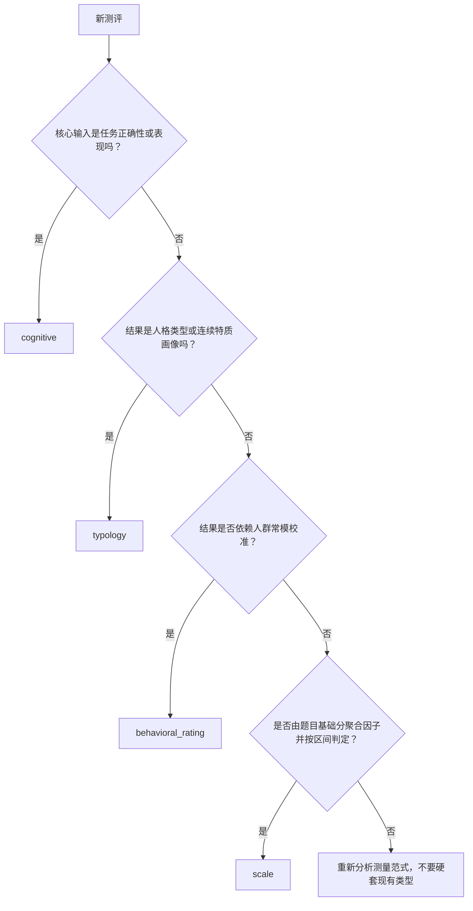

# ModelCatalog 模型类型

> 状态：已按当前源码重建。本文把 `scale`、`typology`、`behavioral_rating`、`cognitive` 定义为四种模型类型，建立产品分类、模型身份、算法家族、具体算法和结果判定之间的统一认知；各类型的实现细节见本目录四篇专题。

## 1. 本文回答

ModelCatalog 为什么需要四种模型类型？它们究竟是在区分业务产品、数据结构，还是算法？本文重点回答：

1. `ProductChannel`、`Kind`、`AlgorithmFamily`、`Algorithm`、`DecisionKind` 分别表示什么；
2. 为什么“行为能力测评”不是第五种模型类型；
3. 一种新测评应配置到既有类型，还是新增 Algorithm，或者新增 Kind；
4. 四类模型共享哪些 DefinitionV2 结构，又在哪些地方必须分开；
5. 怎样根据真实测量问题选择正确模型类型；
6. 四类模型的当前实现范围和主要不足是什么。

本文不重复 ModelCatalog 的通用版本、发布和执行链路，阅读前建议先了解：

- [DefinitionV2 与模型扩展](../20-核心设计-DefinitionV2与模型扩展.md)；
- [模型身份、算法绑定与执行路由](../21-核心设计-模型身份、算法绑定与执行路由.md)；
- [因子与计分模型](../23-核心设计-因子与计分模型.md)；
- [常模资产与校准](../24-核心设计-常模资产与校准.md)；
- [已发布模型准入与执行输入](../31-关键链路-已发布模型准入与执行输入.md)。

---

## 2. 30 秒结论

四种模型类型不是四套孤立系统，而是对四种测量问题的稳定分类：

```text
scale
  题目基础分 -> 因子原始分 -> 分数区间结果

typology
  题目贡献 -> 人格因子向量 -> 类型或特质画像

behavioral_rating
  题目基础分 -> 行为因子/指数 -> 常模校准 -> 行为等级

cognitive
  任务答案/正确性 -> 题组表现 -> 总能力分 -> 能力等级
```

选择模型类型的依据不是页面放在哪里，也不是报告长什么样，而是：

> 受测者在完成什么性质的任务，系统怎样从作答事实得到测量值，又怎样把测量值转换成稳定结果。

当前四类模型的核心对照如下：

| 模型类型 `Kind` | 业务名称 | 默认产品通道 | 当前 AlgorithmFamily | 当前代表算法 | 主要 DecisionKind |
| --- | --- | --- | --- | --- | --- |
| `scale` | 医学量表 | `medical_scale` | `factor_scoring` | `scale_default` | `score_range` |
| `typology` | 人格测评 | `typology` | `factor_classification` | `personality_typology`、`mbti`、`sbti`、`bigfive` | `pole_composition`、`nearest_pattern`、`trait_profile`、`dominant_factor` |
| `behavioral_rating` | 行为评定 | `behavior_ability` | `factor_norm` | `brief2`、`spm_sensory` | `norm_lookup` |
| `cognitive` | 认知测验 | `behavior_ability` | `task_performance` | `spm` | `ability_level` |

这里已经确认两个正式边界：

1. `behavioral_rating` 必须具有常模校准；只有原始因子分和区间判定时应使用 `scale`；
2. `typology` 是当前代码 `Kind` 的名称，但业务含义是广义人格测评，既包括离散类型，也包括连续特质画像。

---

## 3. 五层分类不能混用

### 3.1 ProductChannel：产品从哪里展示

`ProductChannel` 面向产品导航、运营分类和聚合列表：

| ProductChannel | 产品含义 | 可包含的模型类型 |
| --- | --- | --- |
| `medical_scale` | 医学量表测评 | 当前主要是 `scale` |
| `typology` | 人格测评 | 当前是 `typology` |
| `behavior_ability` | 行为能力测评 | `behavioral_rating` 与 `cognitive` |

`behavior_ability` 不能成为运行时路由键。它同时容纳观察评定和认知任务，而两者的输入、常模和算法完全不同。

### 3.2 Kind：模型是什么

`Kind` 是 `AssessmentModel` 的稳定模型类型身份：

```text
scale
typology
behavioral_rating
cognitive
```

它回答的是“这个模型在测量语义上属于哪一类”，而不是“具体调用哪段算法”。

### 3.3 AlgorithmFamily：整条执行机制是什么

`AlgorithmFamily` 连接 ModelCatalog 与 Evaluation/Calculation：

| AlgorithmFamily | 核心机制 |
| --- | --- |
| `factor_scoring` | 从题目基础分聚合因子，并做原始分区间判定 |
| `factor_classification` | 计算人格因子向量，并做类型/画像选择 |
| `factor_norm` | 先计算因子，再用常模转换和分层规则校准 |
| `task_performance` | 根据正确性、题组或任务表现形成能力结果 |

当前代码根据模型身份推导 AlgorithmFamily；长期目标是发布时冻结确定的兼容结果，执行时不重新猜测。

### 3.4 Algorithm：具体代码能力

同一 Kind 可以包含多个 Algorithm：

```text
typology
  -> mbti
  -> sbti
  -> bigfive
  -> personality_typology

behavioral_rating
  -> brief2
  -> spm_sensory

cognitive
  -> spm
```

Algorithm 不是业务版本。当前没有独立 `AlgorithmVersion`；语义变化明显时应增加新 Algorithm 标识。

### 3.5 DecisionKind：计算结果如何选择稳定 Outcome

DecisionKind 位于测量结果与 Outcome 之间：

```text
Factor/Task Result
  -> Decision
  -> OutcomeCode / LevelCode / Profile fact
  -> Interpretation
```

它不负责生成长篇报告文案。

---

## 4. 为什么不是“医学、人格式、行为、认知”四套硬编码

PHP 简易系统的问题是每增加一个测评都修改代码。ModelCatalog 的目标不是把四种业务重新写成四个巨型 `switch`，而是建立两类扩展：

| 扩展 | 例子 | 处理方式 |
| --- | --- | --- |
| 同类模型 | 新增另一份医学量表、新的人格问卷 | 复用 Kind、AlgorithmFamily 和 Algorithm，通过 DefinitionV2 配置 |
| 新算法能力 | Raven SPM 引入正确答案和题组语义 | 在既有 Kind 下增加或完善 Algorithm、ExecutionSpec 与运行适配 |
| 新测量范式 | 未来出现四类均不能表达的实验任务 | 论证新的 Kind 与 AlgorithmFamily |

判断是否需要新增 Kind，至少要满足：

- 输入事实与现有四类不同；
- 测量过程不能由现有 Factor/Norm/Task 结构表达；
- 结果事实结构不同；
- 需要独立发布校验和执行机制；
- 强行复用现有 Kind 会产生大量特殊分支。

仅仅因为业务名称不同、报告模板不同或题目数量不同，不足以新增 Kind。

---

## 5. 模型类型选择树



### 5.1 选择 scale

适合：

- 问题有基础得分；
- 多题聚合为一个或多个因子；
- 结果主要依据原始分或派生分区间；
- 不需要人口学常模才能解释结果。

### 5.2 选择 typology

适合：

- 结果是类型、模式、主导特质或连续人格画像；
- 需要因子极点、模式相似度或主导因子决策；
- 可能存在特殊答案触发规则。

### 5.3 选择 behavioral_rating

适合：

- 由本人、家长、教师或治疗师观察行为并评分；
- 原始因子分必须进入年龄、性别、版本等常模；
- 最终解释依据 T 分、百分位或标准分。

正式边界：没有 Norm 的原始分区间模型使用 `scale`。

### 5.4 选择 cognitive

适合：

- 受测者完成能力任务，而不是表达态度或观察行为；
- 题目有正确答案或客观表现标准；
- 需要题组、正确数、耗时或其它任务指标；
- 最终形成能力等级或常模位置。

---

## 6. 四种模型共享的 DefinitionV2 骨架

```text
DefinitionV2
├── Measure
│   ├── Factors
│   ├── FactorGraph
│   └── Scoring
├── Calibration
│   └── NormRefs
├── Execution
│   ├── Brief2（可选）
│   └── SPM（可选）
├── Conclusions
├── Outcomes
└── ReportMap
```

共享结构不等于每个类型都必须填满所有分支：

| Definition 层 | scale | typology | behavioral_rating | cognitive |
| --- | --- | --- | --- | --- |
| Measure/Factor | 必需 | 必需，投影为人格因子图 | 必需 | 必需或由任务题组形成 |
| Calibration/NormRef | 当前不用 | 当前不用 | 必需 | 可选 |
| ExecutionSpec | 通常不需要 | typology runtime 有专用投影 | Algorithm 需要时使用，如 Brief2 | 当前 Raven SPM 必需 |
| Conclusion | RiskConclusion | TypeConclusion | NormConclusion | AbilityConclusion |
| Outcome | 风险/等级代码 | 类型或画像代码 | 行为等级代码 | 能力等级代码 |

DefinitionV2 是统一领域骨架，不是所有算法细节都必须塞进通用 Factor。无法由通用结构自然表达的语义进入显式 ExecutionSpec。

---

## 7. 共享生命周期

四类模型都遵循：

```text
AssessmentModel head
  -> 绑定精确 QuestionnaireSnapshot
  -> 编辑 DefinitionV2
  -> family-specific 发布校验
  -> 联合发布 Questionnaire + AssessmentSnapshot
  -> active 准入
  -> Assessment 冻结精确引用
  -> exact-version 执行
```

共享规则包括：

- 模型发布前必须绑定问卷；
- Factor 和 Decision 必须完整；
- 只有 Factor 没有 Decision 不能发布；
- 新 release 不改变历史 Assessment；
- draft 不能进入运行时；
- archived release 不能接受新测评，但必须保留历史执行；
- Worker 不拥有任何模型类型的核心规则。

---

## 8. 四种模型的执行对照

| 阶段 | scale | typology | behavioral_rating | cognitive |
| --- | --- | --- | --- | --- |
| 基础输入 | AnswerSheet question score | answer value/score | AnswerSheet question score | answer value 与正确答案 |
| 中间结果 | Factor raw score | personality vector | Factor/index raw score | item-set/total score |
| 校准 | 无 | 无 | Norm lookup | 可选 Norm lookup |
| Decision | score range | pole/pattern/trait/dominant | norm range | ability range |
| Primary result | 风险等级/量表主分 | 类型或特质画像 | T 分及行为等级 | 原始总分、百分位、能力等级 |
| 当前 ExecutionPath | `scale_descriptor` | `typology_descriptor` | `behavioral_rating_descriptor` | `cognitive_descriptor` |

---

## 9. 当前实现成熟度

| 类型 | 当前成熟度 | 主要已实现 | 主要不足 |
| --- | --- | --- | --- |
| scale | 高 | 创建、编辑、发布、因子计分、区间判定、报告 | capability 元数据部分字段与真实管理入口不一致；暂不支持常模型 scale |
| typology | 高但兼容面较多 | 统一运行时、四种决策、预览、类型/特质报告 | Algorithm 选项和历史发布身份并未完全统一，兼容 alias 较多 |
| behavioral_rating | 中高 | BRIEF-2、感觉统合 SPM、复合因子、常模投影、NormSubject 装配 | 目前只支持单 NormTableVersion 物化；多常模生命周期尚未产品化 |
| cognitive | 中 | Raven SPM 正确答案、题组、总分、能力结论与可选常模投影 | 仅一个成熟 Algorithm；服务端不执行限时；新认知任务尚未产品化 |

这里的成熟度是源码能力评估，不是医学有效性评价。量表和常模是否经过专业验证仍属于运营、医学和数据资产治理责任。

---

## 10. 已确认的设计约束与当前代码差距

### 10.1 behavioral_rating 必须有 Norm

目标领域规则：

```text
behavioral_rating
  = factor scoring + required norm calibration + norm decision
```

当前 `DecisionKindForDefinition` 在没有 NormRef/NormConclusion 时仍可能返回 `score_range`，但执行身份仍映射到 `factor_norm`。这是当前代码的边界不一致，后续应在发布校验中强制 NormRef、Primary NormConclusion 和可用 Norm table。

### 10.2 typology 是广义人格测评

代码名保留 `KindTypology`，但业务定义为：

```text
人格测评
├── 离散类型：MBTI
├── 最近模式：SBTI/九型等
├── 连续特质：Big Five
└── 主导因子：按高分特质选结果
```

只要它们共享“人格因子向量 + 分类/画像决策”机制，就不需要为每一种人格理论新增 Kind。

### 10.3 scale capability 元数据需要收敛

`FamilyCapability` 当前把 scale 的部分创建、列表、发布能力标为 false，但管理、定义和发布服务实际上已经支持 scale。运行时只使用其 `RuntimeExecutable/ExecutionPath`，所以没有阻断现有功能，但这张能力表不能被文档写成完整事实。后续应让 capability 成为真正的统一约束，或删掉没有消费者的字段。

---

## 11. 新增模型的决策规则

### 11.1 只增加配置

满足以下条件时不写新算法：

- 输入结构相同；
- Factor/Graph 能表达测量关系；
- 已有 DecisionKind 能产生结果；
- 现有 Outcome 结构足够；
- 只改变问卷、因子、规则、常模或解释文案。

### 11.2 增加 Algorithm

满足以下条件时考虑新增 Algorithm：

- 仍属于既有 Kind；
- 但需要新的稳定代码能力；
- 通用 Definition 无法完整表达算法专属输入；
- 需要新的 ExecutionSpec、Calculator 或明细组装器。

### 11.3 增加 Kind

只有测量对象、输入结构、执行机制和结果事实整体不同，才新增 Kind。新增 Kind 必须同时补齐：

- domain identity；
- ProductChannel 映射；
- Definition handler；
- DefinitionV2 runtime assembler；
- family capability；
- input provider；
- runtime descriptor；
- Calculation 能力；
- Outcome assembler；
- Interpretation adapter；
- 发布与跨模块测试。

---

## 12. 文档地图

| 顺序 | 文档 | 核心问题 |
| --- | --- | --- |
| 10 | [scale：医学量表](./10-scale-医学量表.md) | 怎样从题目基础分得到因子原始分和风险区间结果 |
| 20 | [typology：人格测评](./20-typology-人格测评.md) | 怎样从人格因子向量形成类型、模式或连续特质画像 |
| 30 | [behavioral_rating：行为评定](./30-behavioral-rating-行为评定.md) | 怎样将观察行为因子放进精确常模并形成行为等级 |
| 40 | [cognitive：认知测验](./40-cognitive-认知测验.md) | 怎样根据任务正确性、题组和能力规则形成认知结果 |

建议阅读方式：

- 第一次了解四类模型：`README → 四篇的 30 秒结论`；
- 设计医学量表：`10 → ../23 → ../25`；
- 设计人格模型：`20 → ../21 → ../25`；
- 设计常模型行为评定：`30 → ../24 → ../31`；
- 设计认知任务：`40 → ../20 → ../31`。

---

## 13. 面试追问

### 为什么行为能力测评拆成两个 Kind？

因为产品入口相同不等于测量机制相同。行为评定来自本人或观察者对行为的评分，需要因子聚合和人群常模；认知测验来自客观任务正确性和表现，需要题组与能力计算。把二者合并会让同一个 evaluator 同时理解两套完全不同的输入。

### 为什么 Big Five 没有单独 Kind？

Big Five 与 MBTI 的 Decision 不同，但都可以先形成稳定人格因子向量，再由 `factor_classification` 选择类型或构造特质画像。差异可以由 DecisionKind 和配置表达，尚未达到新增 Kind 的门槛。

### 为什么没有 Norm 的行为评定要归入 scale？

如果一个模型只聚合题目原始分并按区间判定，它的执行机制就是 `factor_scoring`。把它标成 behavioral_rating 却没有常模，会让模型名称、运行时 family 和实际计算语义互相矛盾。

---

## 14. 事实源与验证

| 主题 | 源码 |
| --- | --- |
| Kind/Algorithm/DecisionKind | [`internal/apiserver/domain/modelcatalog/identity`](../../../../internal/apiserver/domain/modelcatalog/identity/) |
| ProductChannel 与 capability | [`internal/apiserver/domain/modelcatalog/binding`](../../../../internal/apiserver/domain/modelcatalog/binding/) |
| DefinitionV2 | [`internal/apiserver/domain/modelcatalog/definition`](../../../../internal/apiserver/domain/modelcatalog/definition/) |
| 四类发布 handler | [`internal/apiserver/application/modelcatalog/definition`](../../../../internal/apiserver/application/modelcatalog/definition/) |
| 输入 provider | [`internal/apiserver/infra/evaluationinput`](../../../../internal/apiserver/infra/evaluationinput/) |
| runtime descriptor | [`internal/apiserver/application/evaluation/runtime`](../../../../internal/apiserver/application/evaluation/runtime/) |
| 计算机制 | [`internal/apiserver/application/evaluation/registry/mechanisms`](../../../../internal/apiserver/application/evaluation/registry/mechanisms/) |

```bash
go test ./internal/apiserver/domain/modelcatalog/...
go test ./internal/apiserver/application/modelcatalog/definition
go test ./internal/apiserver/application/evaluation/runtime/...
go test ./internal/apiserver/infra/evaluationinput
go test ./internal/apiserver/application/evaluation/registry/mechanisms/...
```
