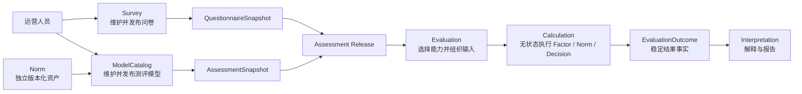

# ModelCatalog 模块

> 状态：重建中。模块边界、核心对象、发布快照和运行时读取规则已经按当前源码复核；其余专题将按照本文确定的目录逐篇重写。

## 1. 本文回答

本文是 ModelCatalog 文档的总入口，主要回答六个问题：

1. ModelCatalog 解决什么业务问题，为什么它不是一个普通的“量表配置表”；
2. ModelCatalog 为什么只定义模型与算法的兼容关系，而不实现具体算法；
3. 医学量表测评、人格测评和行为能力测评，如何映射为当前四种模型语义和四类执行机制；
4. Survey、ModelCatalog、Calculation、Evaluation、Interpretation 各自拥有哪部分事实；
5. 可编辑的 `AssessmentModel`、已发布的 `AssessmentSnapshot` 和独立版本化的 `Norm` 有什么区别；
6. 新测评准入与历史测评执行，为什么必须使用不同的发布模型读取语义。

## 2. 30 秒结论

问卷只定义“问什么、怎样形成作答事实”。问卷可以独立发布并作为信息收集器使用，提交后只产生 `AnswerSheet`。只有当问卷与一个完整测评模型绑定后，系统才知道：

- 哪些题目贡献给哪些因子；
- 因子分怎样聚合；
- 是否需要常模转换；
- 使用什么算法能力执行这些规则；
- 怎样形成稳定的 Decision 结果；
- 如何为 Interpretation 准备与本次模型发布一致的解释配置。

ModelCatalog 管理的正是这套**可维护、可校验、可发布、可追溯、可执行的测评知识资产**，并建立模型结构与算法能力之间的兼容关系。它描述“要算什么、允许怎样算”，但不拥有算法实现。

```text
QuestionnaireSnapshot
  定义问什么、答案如何表达

AssessmentModel
  定义怎样把答案转换为测量结果
  + 模型身份
  + 算法绑定
  + 精确问卷绑定
  + Factor / Measure
  + 可选 NormRef
  + Decision
  + 随发布冻结的解释配置

Assessment Release
  冻结精确 QuestionnaireSnapshot
  + 冻结精确 AssessmentSnapshot

Evaluation
  读取精确发布模型与作答事实
  + 选择 Calculation 能力
  + 组织中性计算输入

Calculation
  无状态执行 Factor、Norm、Decision 算法

EvaluationOutcome
  由 Evaluation 持久化计算结果与执行状态

Interpretation
  把稳定 Decision 结果解释并组织为报告
```

模型的最小可发布结构是：

```text
QuestionnaireBinding   必需
ModelIdentity          必需
AlgorithmBinding       必需
Measure / Factor       必需
Calibration / Norm     可选
Decision               必需
InterpretationAssets   按报告需求校验
```

因此，只有 Factor 而没有 Decision 的配置不能发布为测评模型。如果业务只需要收集答案或展示问卷的单题基础分数，应使用独立 Questionnaire，而不是创建一个不完整的 `AssessmentModel`。

ModelCatalog 不是 Calculation、Evaluation 或 Interpretation。它负责维护和发布模型规范；Calculation 实现无状态算法；Evaluation 选择能力、编排执行并保存结果；Interpretation 解释稳定结果事实。

## 3. 它解决的核心业务问题

PHP 简易系统的本质是“表单填写 + 硬编码解析”。每增加一种测评，就要新增或修改代码。ModelCatalog 的目标不是把所有算法改写成配置，而是建立清晰的模型—算法边界：

> 让同类测评配置化接入，让异类测评通过稳定扩展点接入，并保护统一执行主链路不被反复修改。

这里有两种不同的扩展：

| 扩展类型 | 例子 | ModelCatalog 的处理方式 |
| --- | --- | --- |
| 同类模型扩展 | 新增另一份医学量表、16 人格或九型人格配置 | 复用既有 Factor、Norm、Decision 结构和 Calculation 能力，通过配置与发布完成接入 |
| 异类执行机制扩展 | BRIEF-2、Raven SPM 引入既有计算能力无法表达的语义 | 增加新的 Algorithm 能力、ExecutionSpec、Definition handler 和 Evaluation 执行适配 |

因此，`DefinitionV2` 不是任意 JSON，也不是一个企图描述所有测评的万能 DSL。它提供稳定的公共模型结构，并为真正不同的算法保留显式执行契约；具体计算过程交给 Calculation，而不是塞进 ModelCatalog。

## 4. 三种业务测评与四个模型族

业务产品层目前有三种测评：医学量表测评、人格测评、行为能力测评。ModelCatalog 当前有四个 `Kind`。这是因为“行为能力测评”是产品通道，内部包含行为评定与认知测验两种模型语义。

| 业务测评类型 | `ProductChannel` | ModelCatalog `Kind` | 主要执行语义 |
| --- | --- | --- | --- |
| 医学量表测评 | `medical_scale` | `scale` | 题目得分聚合为因子分，再按分数区间形成风险结果 |
| 人格测评 | `typology` | `typology` | 因子向量通过极点组合、主导因子、最近模式或连续特质形成类型/画像 |
| 行为能力测评 | `behavior_ability` | `behavioral_rating` | 因子分结合常模形成标准分、百分位或行为评定结果 |
| 行为能力测评 | `behavior_ability` | `cognitive` | 按任务正确性、完成表现和常模形成认知能力结果 |

模型分类和算法分类必须保持正交。当前需要区分六个概念：

| 概念 | 回答的问题 | 例子或说明 |
| --- | --- | --- |
| `ProductChannel` | 业务上把它放在哪个产品入口 | `medical_scale`、`typology`、`behavior_ability` |
| `Kind / SubKind` | 它是什么语义类型的测评模型 | `scale`、`typology`、`behavioral_rating`、`cognitive` |
| `AlgorithmFamily` | 整条计算管线采用哪类执行机制 | `factor_scoring`、`factor_norm`、`factor_classification`、`task_performance` |
| `Algorithm` | 调用哪项稳定的具体代码能力 | 当前由 model identity 持有并参与兼容校验 |
| `Strategy` | Factor、Norm 或 Decision 局部怎样计算 | 聚合、常模换算、区间判定、极点组合等 |
| `DecisionKind` | 发布模型采用哪种结果判定策略 | 由模型定义推导并在当前快照中冻结 |

`Kind` 与 `AlgorithmFamily` 之间不是永久的一对一领域定律，而是由兼容矩阵连接。例如，一份医学量表未来完全可能增加常模校准并使用 `factor_norm`；不能为了执行路由而把它错误改成 `behavioral_rating`。

当前实现仍根据 `Kind + SubKind + Algorithm` 推导 `AlgorithmFamily` 和 `ExecutionPath`。文档把这种映射视为**当前兼容矩阵**，而不是不可改变的模型分类规则。

`behavior_ability` 不是领域 `Kind`。同样，产品页面上的“人格测评”“医学量表”也不能直接代替运行时身份。

### 4.1 为什么当前不引入 AlgorithmVersion

`AssessmentModel`、Questionnaire 和 Norm 是可独立维护、发布和引用的业务资产，因此需要业务版本。`Algorithm` 则是随服务发布的稳定代码能力，当前没有独立发布、并存多版本或灰度选择的生命周期。

当前规则是：

- 不改变业务语义的代码重构继续使用原 Algorithm 标识；
- 会改变相同输入输出语义的实现，新增 Algorithm 标识，而不是静默替换旧能力；
- 发布快照需要冻结 Algorithm、AlgorithmFamily、ExecutionSpec 和 DecisionKind，其中 AlgorithmFamily 的冻结仍是待完成改造；
- 只有出现算法独立部署、同算法多版本并行、历史代码精确重放、强审计或 A/B/灰度需求时，才引入 `AlgorithmVersion`。

## 5. 模块边界

| ModelCatalog 负责 | ModelCatalog 不负责 |
| --- | --- |
| `AssessmentModel` 的身份、元数据、生命周期和工作修订 | Questionnaire、Question、Answer 与 AnswerSheet |
| 精确 `QuestionnaireBinding` 和联合发布时的版本协调 | 问卷内容编辑、题型扩展和答卷校验 |
| `DefinitionV2` 的维护、结构校验和 family-specific 发布校验 | 一次 Assessment 的状态、EvaluationRun 和执行重试 |
| Factor、FactorGraph、NormRef、Decision 和 ExecutionSpec 配置 | Calculation 中的因子计算、常模换算与结果判定算法实现 |
| 模型语义与 AlgorithmFamily/Algorithm 的兼容关系 | Evaluation 的能力选择、输入物化、运行状态和结果持久化 |
| 独立版本化 Norm 的导入、查询和精确引用 | 报告实例的生成、持久化和查看权限 |
| 发布不可变 `AssessmentSnapshot`，提供 active 与 exact-version 读取端口 | Plan 生命周期、Statistics 投影和 C 端页面编排 |
| 随模型统一冻结解释文案和 `ReportMap` 配置 | Interpretation 对结果事实的解释和报告构建 |

边界可以概括为：



## 6. 三类核心资产

### 6.1 AssessmentModel：可编辑工作聚合

`AssessmentModel` 是运营后台编辑的聚合根。它维护当前工作版本，包括模型身份、目录元数据、问卷绑定、`DefinitionV2` 和工作修订号。

它回答的是：

> 如果下一次发布，这个模型准备以什么配置上线？

修改已上线模型时，系统会从 published head 派生出 draft head；原有 active release 仍然可以继续服务。工作 head 的状态不等于线上 release 的状态。

### 6.2 AssessmentSnapshot：不可变发布事实

`AssessmentSnapshot` 是一次模型发布产生的不可变运行时值，也使用兼容名称 `PublishedModel`。当前源码中的快照冻结：

- 模型身份与系统生成的发布版本；
- 精确 questionnaire code/version；
- `DefinitionV2`；
- `Algorithm`、发布时推导的 `DecisionKind` 和 `ExecutionSpec`；
- 兼容 wire payload；
- 运行时目录需要的展示元数据。

新发布会新增一条 release，并将旧 active release 标记为 archived。旧 release 不再接受新测评，但仍可被已经冻结了精确 model ref 的历史测评读取。

当前 `AssessmentSnapshot` 尚未保存 `AlgorithmFamily`，运行时仍从 identity 推导。我们已经确认的目标设计是：发布时解析兼容矩阵并把 `AlgorithmFamily` 与 `DecisionKind` 一起冻结，运行时只使用快照中的确定值，不再重新猜测。这是**规划改造**，不是当前代码事实。

### 6.3 Norm：独立版本化参考资产

`Norm` 不是 `AssessmentModel` 内部的一大段内嵌数据。它按 `TableVersion` 独立导入和寻址，`DefinitionV2.Calibration` 只保存精确 `NormRef`。

这种设计允许：

- 一份常模被多个模型版本引用；
- 常模修订产生新版本，而不是原地覆盖历史含义；
- 发布校验确认引用存在且身份兼容；
- Evaluation 根据冻结引用重建当时的校准输入。

## 7. 发布模型的概念结构与当前物理结构

从领域职责看，一个发布模型应按下面的结构理解：

```text
AssessmentModel
├── ModelIdentity
│   └── Kind / SubKind
├── AlgorithmBinding
│   ├── AlgorithmFamily
│   ├── Algorithm
│   └── ExecutionSpec
├── QuestionnaireBinding
└── DefinitionV2
    ├── CoreModel
    │   ├── Measure / Factor
    │   ├── Calibration / NormRef（可选）
    │   └── Decision
    └── Interpretation-oriented Assets
        ├── OutcomeProfile / 解释文案
        └── ReportMap
```

这是一张**概念所有权图**，不是当前 Go struct 的逐字段复刻。当前物理结构仍然是：

| 当前字段 | 概念角色 | 主要消费者 |
| --- | --- | --- |
| `AssessmentModel.Kind/SubKind/Algorithm` | ModelIdentity 与 AlgorithmBinding 的一部分 | ModelCatalog / Evaluation |
| `DefinitionV2.MeasureSpec` | Factor 测量层 | Evaluation 适配为 Calculation 输入 |
| `DefinitionV2.Calibration` | 可选 Norm 校准层 | Evaluation 解析精确 Norm 并适配输入 |
| `DefinitionV2.ExecutionSpec` | Algorithm 专用参数契约，不是算法实现 | Evaluation / Calculation adapter |
| `DefinitionV2.Conclusions` | 当前混合了 Decision 规则和部分解释内容 | Evaluation / Interpretation |
| `DefinitionV2.Outcomes` | 稳定结果代码空间与当前解释资料 | Evaluation / Interpretation |
| `DefinitionV2.ReportMap` | 报告组织与展示映射 | Interpretation |

`Decision` 的输出只应是稳定结果事实，例如 `OutcomeCode`、`LevelCode`、分类代码或画像事实，不应包含 title、summary、description、suggestions 等解释文案。当前 `Conclusion` 结构仍混合两类内容，文档会如实标明，不把概念拆分写成已经完成的代码重构。

这里要区分“配置发布位置”和“领域执行职责”：

- ModelCatalog 配置并发布 Factor、可选 Norm、Decision 与 AlgorithmBinding；
- Calculation 提供无状态算法实现，不认识 ModelCatalog、Questionnaire、Evaluation 生命周期或报告；
- Evaluation 读取精确发布模型与作答事实，选择 Calculation 能力、组织中性输入并保存 `EvaluationOutcome`；
- Interpretation 消费稳定 Decision 结果，生成面向医生、患者或家长的解释与报告；
- 当前没有独立的 `InterpretationDefinition`，解释文案和 `ReportMap` 仍随模型统一冻结，以避免引入跨资产版本协调和联合发布复杂度；
- 只有出现独立维护、独立发布或跨模型复用的真实需求时，才重新评估是否拆分解释资产。

这是一项明确的当前设计选择，不应把理想化的领域拆分写成已经实现的系统事实。

## 8. 发布完整性与读取契约

发布校验要证明的是“这是一份可执行测评模型”，而不只是 JSON 结构合法。目标完整性规则为：

- 必须绑定精确的已发布 Questionnaire；
- 必须有合法 ModelIdentity 和 AlgorithmBinding；
- 必须至少定义可计算的 Factor / Measure；
- Norm 可选，但一旦引用就必须解析到精确版本并与模型兼容；
- 必须存在可执行 Decision，Factor-only 模型不得发布；
- Interpretation-oriented Assets 按报告需求校验，但不会反向成为 Decision 的业务结果。

其中“Factor 必需、Norm 可选、Decision 必需”是已经确认的领域规则；若当前 family handler 尚未统一强制执行，后续应在发布校验中固化，而不能把未实现的保护写成现状。

ModelCatalog 不是只有一种“已发布读取”。当前至少存在三种语义：

| 场景 | 应读取什么 | 为什么 |
| --- | --- | --- |
| 运营编辑和管理查询 | `AssessmentModel` head | 需要看到尚未发布的工作修改 |
| 新测评准入、目录展示、按问卷发起测评 | active `AssessmentSnapshot` | 新业务只能使用当前允许受理的发布版本 |
| 已受理测评执行、异步重试和历史重放 | exact-version retained `AssessmentSnapshot` | 必须保持受理时冻结的模型语义，不能漂移到最新版本 |

因此，以下做法都属于边界错误：

- Evaluation 为补配置而读取 draft head；
- Worker 重试时只按 model code 读取 latest active release；
- 新测评使用已 archived 的精确版本绕过下架；
- `DefinitionV2` 缺失时从兼容 payload 反向猜测领域语义；
- 从 `ProductChannel` 选择 evaluator。

## 9. 文档地图

ModelCatalog 按“领域模型 → 核心机制 → 关键链路 → 模型类型”阅读。

| 顺序 | 文档 | 状态 | 核心问题 |
| --- | --- | --- | --- |
| 10 | [领域模型](./10-领域模型.md) | 已重写 | AssessmentModel、DefinitionV2、Norm、AssessmentSnapshot 各自保护什么事实 |
| 20 | [DefinitionV2 与模型扩展](./20-核心设计-DefinitionV2与模型扩展.md) | 已重写 | Factor、可选 Norm、Decision、AlgorithmBinding 与解释资产如何协作 |
| 21 | [模型身份、算法绑定与执行路由](./21-核心设计-模型身份、算法绑定与执行路由.md) | 已重写 | ProductChannel、Kind、AlgorithmFamily、Algorithm、Strategy、DecisionKind 如何分工 |
| 22 | [问卷绑定与发布版本](./22-核心设计-问卷绑定与发布版本.md) | 已重写 | 问卷 code/version、模型 release version 和历史语义如何冻结 |
| 23 | [因子与计分模型](./23-核心设计-因子与计分模型.md) | 已重写 | Factor、FactorGraph、Scoring 与 Calculation 如何形成可扩展测量机制 |
| 24 | [常模资产与校准](./24-核心设计-常模资产与校准.md) | 已重写 | Norm 如何独立版本化、校验、引用、执行并保留校准证据 |
| 25 | [结果判定、Outcome 与解释边界](./25-核心设计-结果判定、Outcome与解释边界.md) | 已重写 | Decision、OutcomeCode、纯事实 Outcome 与 Interpretation 解释资产如何划分 |
| 26 | [数据存储与一致性](./26-核心设计-数据存储与一致性.md) | 已重写 | Mongo 单集合双角色、联合发布事务、索引、并发、缓存一致性和历史保留 |
| 30 | [模型创建、编辑与联合发布](./30-关键链路-模型创建编辑与联合发布.md) | 已重写 | 运营编辑怎样形成 Questionnaire + AssessmentModel 原子发布 |
| 31 | [已发布模型准入与执行输入](./31-关键链路-已发布模型准入与执行输入.md) | 已重写 | active 准入、Assessment 引用冻结与 exact-version 执行怎样共同构造测评输入 |
| 40 | [模型类型总览](./40-模型类型/README.md) | 已重写 | 四种模型类型共享什么、各自扩展什么 |
| 41 | [scale：医学量表](./40-模型类型/10-scale-医学量表.md) | 已重写 | 题目基础分、因子计分与风险区间 |
| 42 | [typology：人格测评](./40-模型类型/20-typology-人格测评.md) | 已重写 | 人格因子贡献、离散类型与连续特质画像 |
| 43 | [behavioral_rating：行为评定](./40-模型类型/30-behavioral-rating-行为评定.md) | 已重写 | 行为因子、综合指数、精确常模与等级投影 |
| 44 | [cognitive：认知测验](./40-模型类型/40-cognitive-认知测验.md) | 已重写 | Raven SPM 题组、客观答案、可选常模与能力等级 |
| 90 | [设计问题与重构清单](./90-设计问题与重构清单.md) | 规划改造 | 已确认设计缺口、稳定编号、优先级、实施顺序与验收门槛 |

推荐阅读路线：

- 第一次了解模块：`README → 10 → 20 → 30 → 31`；
- 设计新模型或算法：`20 → 21 → 23 → 对应模型类型`；
- 分析版本漂移或历史重试：`22 → 26 → 31`；
- 分析常模问题：`24 → behavioral_rating/cognitive → 31`。
- 规划后续重构：`90 → 对应专题文档 → 当前源码和数据审计`。

## 10. 事实源与验证

| 主题 | 当前事实源 |
| --- | --- |
| 领域对象与不变式 | [`internal/apiserver/domain/modelcatalog`](../../../internal/apiserver/domain/modelcatalog/) |
| 编辑、查询、发布和运行时用例 | [`internal/apiserver/application/modelcatalog`](../../../internal/apiserver/application/modelcatalog/) |
| Published 与 Norm ports | [`internal/apiserver/port/modelcatalog`](../../../internal/apiserver/port/modelcatalog/) |
| Mongo head/release/norm 存储 | [`internal/apiserver/infra/mongo/modelcatalog`](../../../internal/apiserver/infra/mongo/modelcatalog/) |
| Evaluation 输入物化 | [`internal/apiserver/infra/evaluationinput`](../../../internal/apiserver/infra/evaluationinput/) |
| Calculation 无状态算法边界 | [`internal/apiserver/domain/calculation`](../../../internal/apiserver/domain/calculation/) |
| Evaluation 运行时路由 | [`internal/apiserver/application/evaluation/runtime`](../../../internal/apiserver/application/evaluation/runtime/) |
| 组合根 | [`internal/apiserver/container/modules/modelcatalog`](../../../internal/apiserver/container/modules/modelcatalog/) |
| REST 契约 | [`api/rest/apiserver.yaml`](../../../api/rest/apiserver.yaml) |
| gRPC 投影 | [`assessment_model_catalog.go`](../../../internal/apiserver/transport/grpc/service/assessment_model_catalog.go) |

最低验证命令：

```bash
go test ./internal/apiserver/domain/modelcatalog/...
go test ./internal/apiserver/domain/calculation/...
go test ./internal/apiserver/application/modelcatalog/...
go test ./internal/apiserver/application/evaluation/runtime/...
go test ./internal/apiserver/infra/mongo/modelcatalog
go test ./internal/apiserver/container/modules/modelcatalog/...
make docs-hygiene
git diff --check
```
