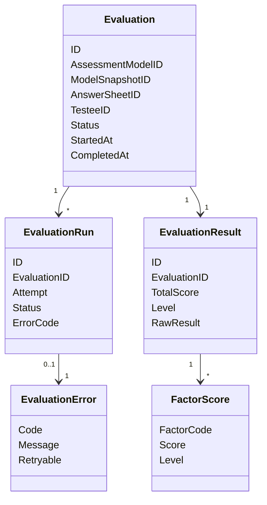

# Evaluation 领域模型

## 1. 模块核心概念

Evaluation 围绕“一次测评执行”建模。它把 `AnswerSheet`、`AssessmentModelSnapshot` 和受试者上下文组合成可执行实例，产出结构化结果。

---

## 2. 领域模型图

---

## 3. 聚合根与实体

| 类型 | 对象 | 说明 |
| ---- | ---- | ---- |
| 聚合根 | `Assessment` / `Evaluation` | 一次测评执行实例 |
| 实体 | `EvaluationRun` | 执行尝试 |
| 实体 | `EvaluationResult` | 结构化结果 |
| 实体 | `FactorScore` | 因子分 |

---

## 4. 值对象

| 值对象 | 说明 |
| ------ | ---- |
| `EvaluationStatus` | Pending、Running、Completed、Failed 等 |
| `EvaluatorKey` | 执行器识别键 |
| `RiskLevel` / `Level` | 等级或风险层级 |
| `EvaluationError` | 错误和可重试语义 |

---

## 5. 领域服务

| 服务 | 职责 |
| ---- | ---- |
| 输入解析 | 解析答卷、模型快照和上下文 |
| 执行器选择 | 按模型 Kind / 算法身份选择执行能力 |
| 计分引擎 | 计算总分、因子分、等级 |
| 失败补偿 | 记录失败、重试或进入 dead 状态 |

---

## 6. 领域事件

| 事件 | 语义 |
| ---- | ---- |
| `assessment.submitted` | 测评已提交或进入执行链路 |
| `assessment.interpreted` | 测评已完成结构化解读 |
| `assessment.failed` | 测评执行失败 |

---

## 7. 模型边界与反例

| 反例 | 说明 |
| ---- | ---- |
| `AnswerSheet` 不是 `Evaluation` | 答卷是输入，Evaluation 是执行实例 |
| `EvaluationResult` 不是 `InterpretReport` | 结果是机器结构，报告是用户解释 |
| `AssessmentModel` 不是 `EvaluationRun` | 模型是资产，Run 是执行尝试 |
| `Statistics` 不是执行状态 | 统计滞后不影响 Evaluation 主状态 |
