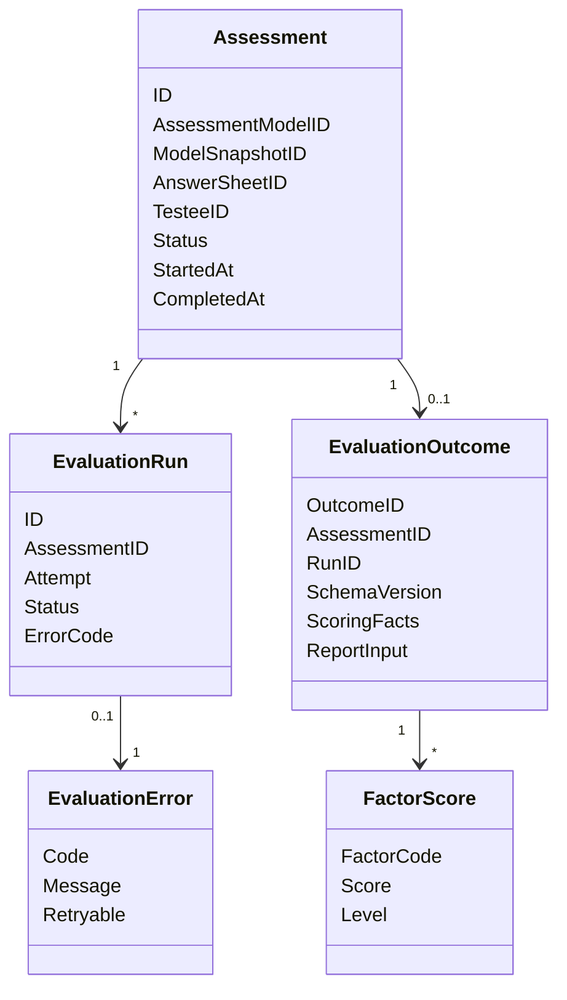

# Evaluation 领域模型

## 1. 模块核心概念

Evaluation 围绕“一次测评执行”建模。它把 `AnswerSheet`、`AssessmentModelSnapshot` 和受试者上下文组合成可执行实例，产出结构化结果。

---

## 2. 领域模型图

---

## 3. 聚合根与实体

| 类型 | 对象 | 说明 |
| ---- | ---- | ---- |
| 聚合根 | `Assessment` | 一次测评执行实例；成功终态为 `evaluated` |
| 独立领域对象 | `EvaluationRun` | 有 claim/CAS/lease 的执行尝试；状态只能经领域方法推进 |
| 不可变事实 | `EvaluationOutcome Record` | 成功提交后的 canonical 评分事实；schema v2 新写、v1 只读 |
| 值对象 | `Execution` | Evaluator 的进程内执行结果，不等同于已提交 Record |
| 值对象 | `FactorScore` | Outcome 的维度评分事实 |

---

## 4. 值对象

| 值对象 | 说明 |
| ------ | ---- |
| `AssessmentStatus` | `pending / submitted / evaluated / failed`；不包含目标态的 `interpreted` |
| `EvaluationRunStatus` | `pending / running / succeeded / failed`，描述单次执行尝试 |
| `EvaluatorKey` | 执行器识别键 |
| `RiskLevel` / `Level` | 等级或风险层级 |
| `EvaluationError` | 错误和可重试语义 |

---

## 5. 领域服务

| 服务 | 职责 |
| ---- | ---- |
| 路由规则 | 从 ModelRoute 纯推导算法家族与 DecisionKind；不持有 Registry 或 context-aware Calculator |
| Assessment 生命周期 | 校验 `pending → submitted → evaluated/failed` 及评分投影写入规则 |
| EvaluationRun 生命周期 | 校验 claim、lease、输入快照绑定、成功和失败迁移 |

输入组装、RuntimeDescriptor Registry、Calculator、OutcomeAssembler 与事务编排属于应用层机制，不是领域服务。

---

## 6. 领域事件

| 事件 | 语义 |
| ---- | ---- |
| `evaluation.requested` | 测评已具备执行条件 |
| `evaluation.outcome.committed` | Evaluation 已形成并可靠提交结构化事实，Interpretation 可以继续生成报告 |
| `evaluation.failed` | 测评执行失败 |

---

## 7. 模型边界与反例

| 反例 | 说明 |
| ---- | ---- |
| `AnswerSheet` 不是 `Evaluation` | 答卷是输入，Evaluation 是执行实例 |
| `EvaluationResult` 不是 `InterpretReport` | 结果是机器结构，报告是用户解释 |
| `AssessmentModel` 不是 `EvaluationRun` | 模型是资产，Run 是执行尝试 |
| `Statistics` 不是执行状态 | 统计滞后不影响 Evaluation 主状态 |
| `Report` 不是 Assessment 子状态 | 报告有独立生命周期，失败不反向否定评估事实 |

---

## 8. 跨模块 Journey 状态

客户端需要的完整进度由读模型组合，而不是继续扩张 Assessment 状态机：

| Assessment | EvaluationRun | Report | Journey |
| ---------- | ------------- | ------ | ------- |
| `submitted` | `running` | 不存在 | `evaluating` |
| `evaluated` | `succeeded` | `pending` | `evaluated` |
| `evaluated` | `succeeded` | `generating` | `interpreting` |
| `evaluated` | `succeeded` | `generated` | `completed`（兼容投影可输出 `interpreted`） |
| `failed` | `failed` | 不存在 | `evaluation_failed` |
| `evaluated` | `succeeded` | `failed` | `interpretation_failed` |
