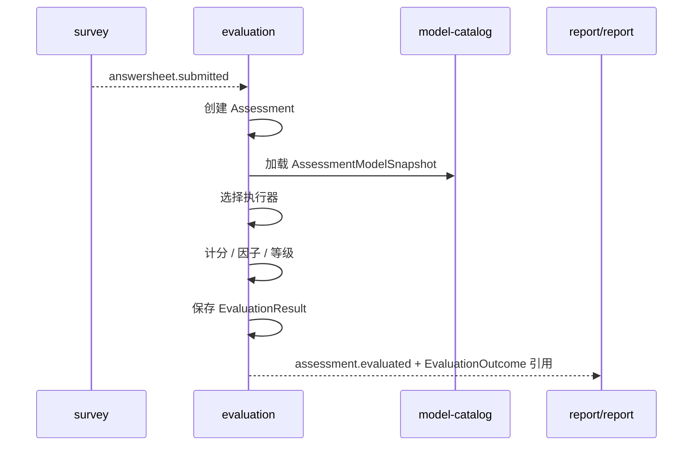

# 测评执行链路

## 1. 业务目标

消费答卷提交事实，创建并执行一次测评，产出结构化结果和执行事件。

---

## 2. 参与对象

| 对象 | 角色 |
| ---- | ---- |
| `AnswerSheet` | 作答事实输入 |
| `AssessmentModelSnapshot` | 执行规则输入 |
| `Assessment` | 测评实例 |
| `EvaluationResult` | 执行产出 |

---

## 3. 前置条件

- `AnswerSheet` 已提交。
- 能解析受试者和问卷上下文。
- 能找到可用模型快照或绑定规则。

---

## 4. 流程图



---

## 5. 关键规则

- 执行必须引用模型快照。
- 执行完成只产出结构化结果。
- Assessment 成功终态是 `evaluated`。
- 报告生成属于 `interpretation`。
- Interpretation 只消费持久化结果，不修改 Assessment，也不重新计分。
- 下游统计失败不影响执行成功事实。

---

## 6. 幂等与异常处理

| 场景 | 处理 |
| ---- | ---- |
| 重复消费答卷事件 | 按答卷和模型上下文保持幂等 |
| 快照不存在 | 记录执行失败 |
| 执行器不支持 Kind | 失败并暴露错误原因 |
| 临时错误 | 进入重试或补偿流程 |

---

## 7. 同步与异步模式决策

当前 `asyncInterpretation=false` 时，`Evaluate` 会在同一调用栈依次写评分并调用 Interpretation 生成报告；这里的“同步”不是小程序 HTTP 等待报告，而是 Evaluation worker 内联执行下游模块。

目标生产链路只保留分阶段模式：

```text
Evaluate
  → 持久化 EvaluationOutcome
  → Assessment evaluated
  → EvaluationRun succeeded
  → assessment.evaluated

Interpretation
  → 独立生成 Report
```

Preview 和测试可以同步组合 Calculation 与 ReportBuilder，但它们是无生产状态迁移的独立用例，不构成保留生产同步模式的理由。

---

## 8. 产出结果

- `Assessment` 状态变化。
- `EvaluationResult`。
- `assessment.evaluated` 或 `assessment.failed`。
