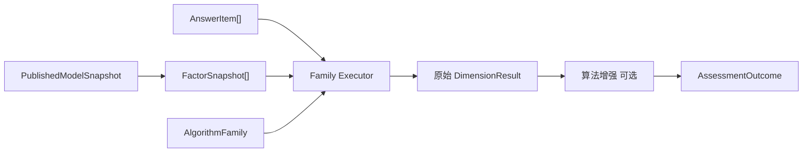

# 计分与因子计算链路

## 1. 业务目标

把答卷答案和**发布态模型快照**中的 Factor 规则结合，计算维度原始分、总分、等级和结构化结果。

Evaluation **读取** ModelCatalog 快照里的 Factor，**写出** `AssessmentOutcome.Dimensions`（`DimensionResult`）。不在此层重新定义维度结构。

---

## 2. 参与对象

| 对象 | 层 | 角色 |
| ---- | -- | ---- |
| `AnswerItem` | survey | 单题答案输入 |
| `FactorSnapshot` | model-catalog | 快照中的维度定义（题目归属、计分策略、解释/常模引用） |
| `AlgorithmFamily` | model-catalog（派生） | 决定 Factor 如何被解释（记分/分类/常模/任务表现） |
| `AssessmentOutcome` | evaluation | 结构化执行结果 |
| `DimensionResult` | evaluation | 单维度得分、等级、派生分（T 分、百分位等） |

命名对照见 [../04-术语表.md](../04-术语表.md)：catalog 侧 **Factor**，输出侧 **Dimension**。

---

## 3. 流程图

典型路径（**包名** / **`AlgorithmFamily` 枚举**）：

- **scoring** / `factor_scoring`：题目分 → Factor 聚合 → 分数区间解释 → `DimensionResult`
- **norming** / `factor_norm`（Brief-2）：先走 scale-like 原始分，再由 `EnrichBrief2Outcome` 按 `dim.Code` 查常模补 T 分/百分位
- **typology** / `factor_classification`：维度分 → 极性/类型组合 → `ProfileResult` + `DimensionResult`
- **task_performance** / `task_performance`（SPM）：任务/题组判定 → 能力等级（可选常模）

---

## 4. 关键规则

- 题目分计算依赖**发布态快照**中的 Factor，不依赖可变问卷配置或草稿模型。
- **Factor 分是输入规则的结构化结果**，不是报告文案；报告由 `interpretation` 生成。
- 等级、T 分、百分位等应保存在 `DimensionResult` / `DerivedScores`，便于追溯。
- `behavioral_rating` / `cognitive` 由已发布 `DefinitionV2` 构造各自执行 DTO，并复用共享因子计分机制；payload 只保留 wire/runtime DTO 职责。

---

## 5. 代码锚点

| 环节 | 路径 |
| ---- | ---- |
| Scale payload DTO | [`payload/scale/payload.go`](../../../internal/apiserver/port/modelcatalog/payload/scale/payload.go) |
| Behavioral payload DTO | [`payload/behavioral/payload.go`](../../../internal/apiserver/port/modelcatalog/payload/behavioral/payload.go) |
| Brief-2 常模投影 | [`mechanisms/norming/projections.go`](../../../internal/apiserver/application/evaluation/registry/mechanisms/norming/projections.go) |
| 执行结果 | [`evaluation/assessment/outcome.go`](../../../internal/apiserver/domain/evaluation/assessment/outcome.go) |
| Factor 概念文档 | [../20-model-catalog/02-领域模型设计.md](../20-model-catalog/02-领域模型设计.md) |
| 配置模型文档 | [../20-model-catalog/05-目标设计草案.md](../20-model-catalog/05-目标设计草案.md) |

---

## 6. 异常处理

| 场景 | 处理 |
| ---- | ---- |
| 答案无法映射规则 | 执行失败或记录不可计分项 |
| 快照中 Factor 定义缺失 | 执行失败，不生成半成品报告 |
| 规则版本不匹配 | 使用执行记录引用的模型快照排查 |
| 常模表与 Factor 代码不匹配 | Brief-2 增强跳过该维度或记录无效 |
