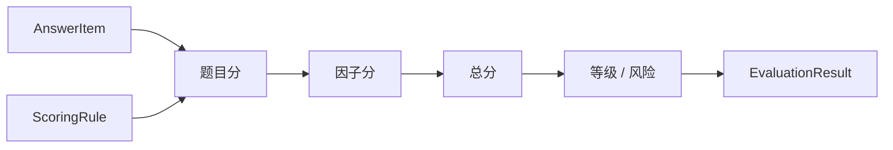

# 计分与因子计算链路

## 1. 业务目标

把答卷答案和模型快照中的规则结合，计算总分、因子分、等级和原始结果。

---

## 2. 参与对象

| 对象 | 角色 |
| ---- | ---- |
| `AnswerItem` | 单题答案输入 |
| `ScoringRule` | 计分规则 |
| `FactorDefinition` | 因子定义 |
| `EvaluationResult` | 结果承载 |
| `FactorScore` | 因子分结果 |

---

## 3. 流程图

---

## 4. 关键规则

- 题目分计算依赖模型快照，不依赖可变问卷配置。
- 因子分是结构化结果的一部分，不是报告文案。
- 等级判定应保存为可追溯结果。
- 原始结果应保留足够上下文，便于报告层解释和问题排查。

---

## 5. 异常处理

| 场景 | 处理 |
| ---- | ---- |
| 答案无法映射规则 | 执行失败或记录不可计分项 |
| 因子定义缺失 | 执行失败，不生成半成品报告 |
| 规则版本不匹配 | 使用执行记录引用的模型快照排查 |
