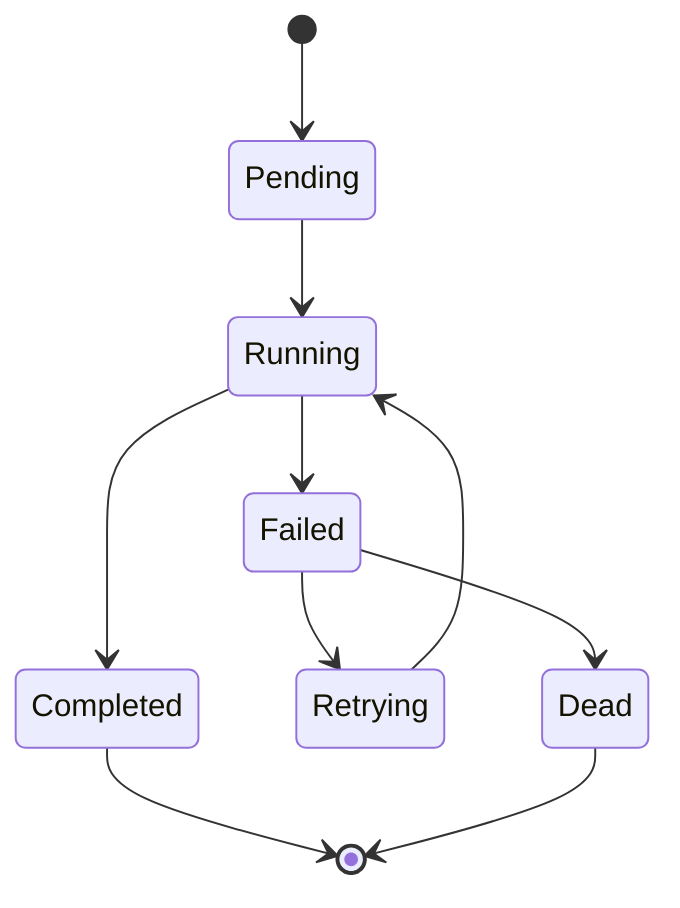

# 状态机与失败重试

## 1. 业务目标

明确一次测评执行从待处理到完成或失败的状态边界，并保证失败可观测、可补偿。

---

## 2. 状态机

---

## 3. 状态含义

| 状态 | 含义 |
| ---- | ---- |
| `Pending` | 已创建，等待执行 |
| `Running` | 正在执行 |
| `Completed` | 已生成结构化结果 |
| `Failed` | 执行失败，可判断是否重试 |
| `Retrying` | 正在补偿重试 |
| `Dead` | 不再自动重试，需要人工或专项修复 |

---

## 4. 失败分类

| 类型 | 示例 | 处理 |
| ---- | ---- | ---- |
| 输入错误 | 答卷结构无法映射 | 不重试，暴露数据问题 |
| 配置错误 | 模型快照缺失 | 修复配置后补偿 |
| 临时错误 | 下游超时、数据库短暂失败 | 可重试 |
| 代码缺陷 | 执行器 panic 或不支持 Kind | 修复代码后重放 |

---

## 5. 事件

- 完成：`assessment.interpreted`。
- 失败：`assessment.failed`。

报告事件 `report.generated` 不属于 Evaluation 状态机。
