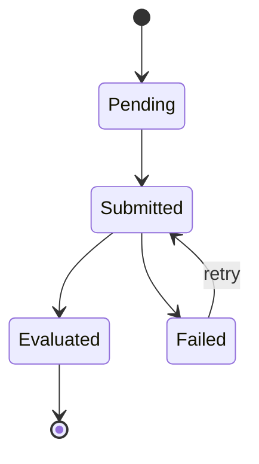
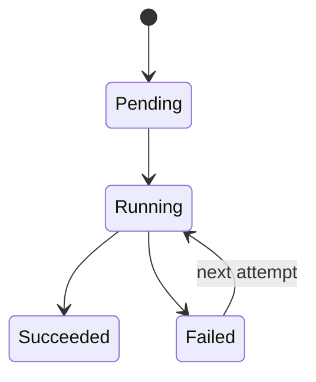

# 状态机与失败重试

## 1. 业务目标

明确一次测评执行从待处理到完成或失败的状态边界，并保证失败可观测、可补偿。

---

## 2. Assessment 状态机

---

## 3. 状态含义

| 状态 | 含义 |
| ---- | ---- |
| `pending` | Assessment 已创建，尚未提交执行 |
| `submitted` | 已提交，等待或正在执行；运行细节由 EvaluationRun 表达 |
| `evaluated` | 结构化评估结果已经可靠落库，是 Assessment 成功终态 |
| `failed` | Evaluation 执行失败，可根据最新 EvaluationRun 判断是否重试 |

`running / succeeded / retryable failed` 属于 `EvaluationRun`，不重复塞入 Assessment。`interpreted` 属于当前兼容实现；目标态由 Report 与 Journey 投影表达。

---

## 4. EvaluationRun 状态机

`succeeded` 的正式语义不是“内存中算出了一个分数”，也不是“评分和报告全部完成”，而是：

1. 本次 AlgorithmFamily 机制执行成功；
2. canonical EvaluationOutcome 已可靠持久化；
3. Assessment 已进入 `evaluated`；
4. `evaluation.outcome.committed` 已与结果提交可靠衔接，可以触发 Interpretation。

该定义覆盖 scoring、typology、norming 和 task performance。Report 生成不属于 EvaluationRun；Report failed 时 EvaluationRun 仍保持 `succeeded`。

---

## 5. 失败分类

| 类型 | 示例 | 处理 |
| ---- | ---- | ---- |
| 输入错误 | 答卷结构无法映射 | 不重试，暴露数据问题 |
| 配置错误 | 模型快照缺失 | 修复配置后补偿 |
| 临时错误 | 下游超时、数据库短暂失败 | 可重试 |
| 代码缺陷 | 执行器 panic 或不支持 Kind | 修复代码后重放 |

---

## 6. 跨模块失败语义

| 失败 | Assessment | Report | 重试边界 |
| ---- | ---------- | ------ | -------- |
| Evaluation 输入、计算或结果持久化失败 | `failed` | 不创建 | EvaluationRun / Assessment 重试 |
| Interpretation 构建或报告持久化失败 | 保持 `evaluated` | `failed` | 只重试报告生成，不重新执行 Calculation |
| Statistics 投影失败 | 保持 `evaluated` | 保持原状态 | Statistics 独立补偿 |

报告重试不得创建新的 EvaluationRun，也不得重新执行 Calculation。只有 EvaluationOutcome 本身不存在、无效或需要明确重算时，才进入新的 EvaluationRun；这类重算必须留下新的 attempt 与输入快照引用。

---

## 7. 事件

- Evaluation 请求：`evaluation.requested`。
- Evaluation 成功提交：`evaluation.outcome.committed`。
- Evaluation 失败：`evaluation.failed`。

报告事件 `interpretation.report.generated / interpretation.report.failed` 不属于 Evaluation 状态机。
