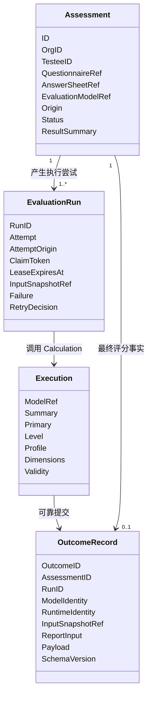
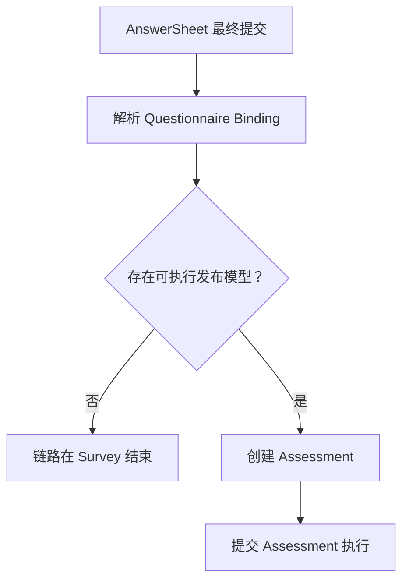
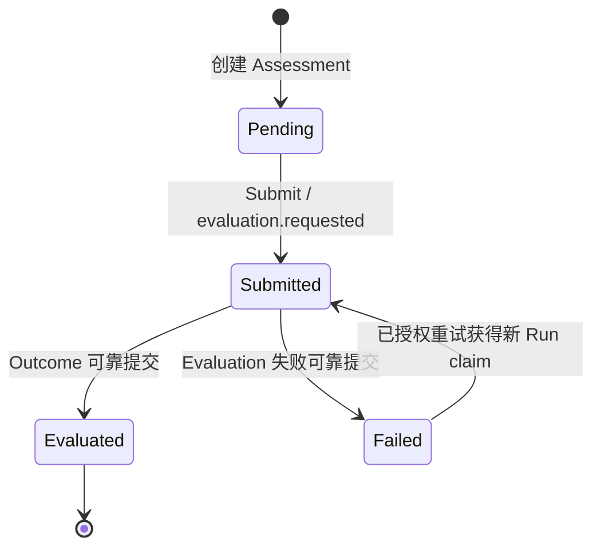
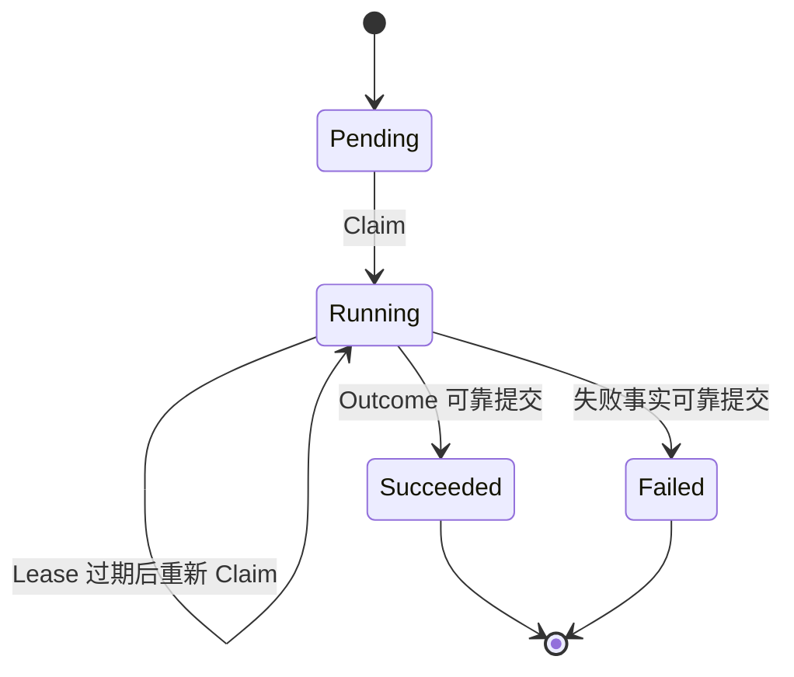
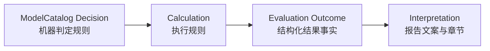
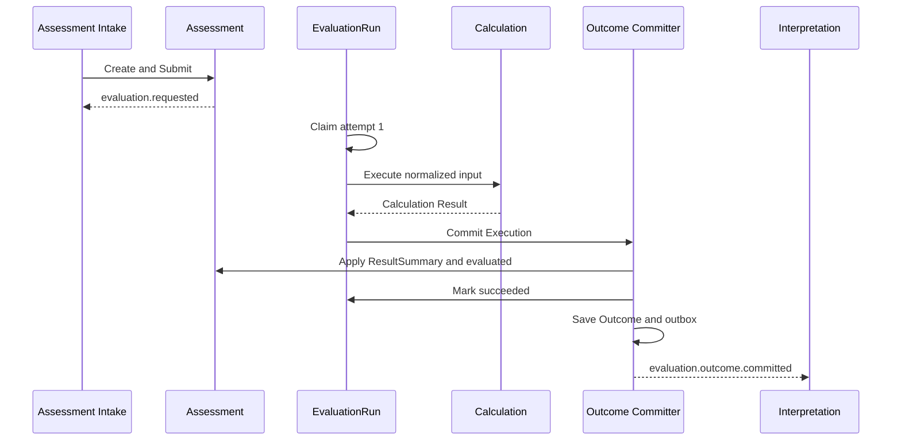
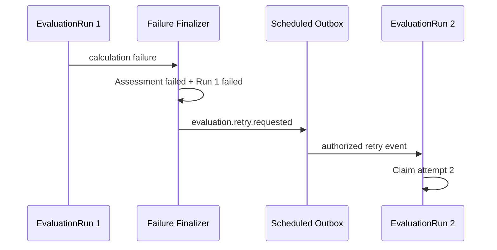

# Evaluation 领域模型

## 1. 本文回答

本文回答以下问题：

- 一次 AnswerSheet 在什么条件下成为 Assessment；
- Assessment 与 EvaluationRun 为什么不能合并；
- Calculation 返回的 Execution 为什么还不是业务事实；
- Outcome 为什么是 Interpretation 可以依赖的唯一成功输入；
- Decision、Outcome 和 Interpretation 分别处在什么边界；
- Evaluation 的业务状态、执行状态和报告状态为什么必须分开。

## 2. 30 秒结论

Evaluation 由四个职责不同的核心对象组成：

| 对象 | 回答的问题 | 生命周期 | 稳定身份 |
| --- | --- | --- | --- |
| `Assessment` | 这一次测评是什么，最终是否形成结果 | pending → submitted → evaluated/failed | Assessment ID；AnswerSheet ID 唯一 |
| `EvaluationRun` | 第几次执行尝试发生了什么 | pending → running → succeeded/failed | `<assessmentID>:<attempt>` |
| `Execution` | 本次计算刚刚得到了什么 | 仅存在于执行进程内 | 无独立持久化身份 |
| `Outcome Record` | 哪些测评结果已经成为不可变事实 | 创建后只读 | Outcome ID；Assessment ID、Run ID 唯一 |



这四个对象不能合并：Assessment 是业务实例，EvaluationRun 是执行治理实体，Execution 是暂态计算结果，Outcome 才是成功事实。

## 3. 统一语言

在深入对象之前，需要先统一几个容易混用的术语。

| 术语 | 本文定义 |
| --- | --- |
| 作答事实 | Survey 已可靠保存的最终 AnswerSheet |
| 测评模型 | ModelCatalog 发布的 AssessmentModel 版本 |
| 测评 | 一个受试者基于一份 AnswerSheet 和一个发布模型完成的一次 Assessment |
| 执行尝试 | 针对同一 Assessment 发起的一次 EvaluationRun |
| 计算 | Calculation 根据中性输入执行计分、分类、常模或任务表现规则 |
| 判定 | Decision 将计算值映射为等级、类型、能力水平等机器可判定结果 |
| 测评结果事实 | 成功 Run 可靠提交后形成的 Outcome Record |
| 解释报告 | Interpretation 根据 Outcome 和冻结报告输入生成的展示内容 |

因此，“答卷已提交”“测评已经算完”“Outcome 已提交”“报告已经生成”是四个不同事实，不能使用一个 `completed` 状态笼统表达。

## 4. Assessment：一次测评业务实例

### 4.1 为什么需要 Assessment

AnswerSheet 只能说明某个填写人针对某个问卷版本提交了什么答案，它不能独立回答：

- 这些答案是否参与测评；
- 受试者是谁；
- 使用哪个发布模型解释；
- 测评来自门诊临时发起还是 Plan；
- 测评结果是否已经可靠形成；
- 如果失败，失败的是哪条测评链路。

Assessment 将这些事实组织成一次明确的测评业务实例。它是 Evaluation 对外最重要的业务标识，也是报告、趋势和运维排查关联结果的起点。

### 4.2 Assessment 的创建边界

目标业务语义是：

> 只有最终 AnswerSheet 已经提交，并且 Questionnaire 已经绑定可执行的已发布 AssessmentModel 时，才创建 Assessment。



这条边界意味着：

- 独立 Questionnaire 可以作为信息收集器使用；
- 它产生 AnswerSheet，但不产生测评结果；
- 没有模型不是 Evaluation 失败，而是根本没有进入 Evaluation；
- 不应为了表示“只有答卷”而创建一个不完整 Assessment。

当前代码仍允许 `EvaluationModelRef` 为空，并可能留下无模型的 pending Assessment。这是兼容性实现和已确认的重构项，不应成为领域定义。

### 4.3 Assessment 固化哪些事实

| 字段或值对象 | 业务语义 | 为什么只保存引用 |
| --- | --- | --- |
| `OrgID` | 测评所属组织 | 用于数据隔离和治理范围 |
| `TesteeID` | 真正接受测评的人 | 与填写人身份不同，填写人属于 AnswerSheet 事实 |
| `QuestionnaireRef(code, version)` | 本次作答所依据的问卷版本 | 问卷内容由 Survey 所有 |
| `AnswerSheetRef` | 本次测评使用的最终作答事实 | 答案由 Survey 所有，不应复制进聚合 |
| `EvaluationModelRef` | 本次执行使用的模型身份和发布版本 | 完整模型快照由 ModelCatalog 所有 |
| `Origin` | adhoc 或 plan 业务来源 | 说明测评为什么发生 |
| `ResultSummary` | 便于列表和工作台读取的主结果摘要 | 只是 Outcome 投影，不替代 Outcome |

Assessment 通过引用协作，而不是把 Questionnaire、AnswerSheet 和 AssessmentModel 全部内嵌进自身。这样可以保持聚合边界清晰，同时通过精确版本保护历史语义。

### 4.4 EvaluationModelRef 不是算法实现

`EvaluationModelRef` 固化：

- kind；
- subKind；
- algorithm；
- model code；
- model version；
- model title。

这些字段用于确认“本次执行的是哪个发布模型”并解析运行时路由，但 Assessment 不持有 Factor、Norm、Decision 细节，也不持有算法实现。

模型发布之后，即使运营继续编辑或发布新版本，历史 Assessment 仍引用原来的精确版本。

### 4.5 Origin：测评为什么发生

当前支持两种来源：

| Origin | 含义 |
| --- | --- |
| `adhoc` | 门诊扫码、医生临时推送等一次性测评 |
| `plan` | 患者加入 Plan 后，由周期 Task 触发的持续测评 |

Origin 不改变 Evaluation 的执行方式。无论测评来自门诊还是 Plan，只要最终绑定同一种模型，就进入同一条执行主链路。

这正是统一执行模型的价值：业务入口可以不同，测评执行不需要复制。

### 4.6 Assessment 状态机



| 状态 | 语义 | 是否终态 |
| --- | --- | --- |
| `pending` | Assessment 已创建，但执行请求尚未可靠形成 | 否 |
| `submitted` | 已具备执行条件，正在等待或执行 Evaluation | 否 |
| `evaluated` | Outcome、成功 Run 和 committed 事件已经可靠提交 | 是，针对 Evaluation |
| `failed` | 最近一次 Evaluation 尝试已经可靠失败 | 条件终态，可经治理后重试 |

`pending` 应被理解为内部过渡和恢复状态，而不是医生或患者需要理解的业务阶段。正常链路中它应非常短暂；长期 pending 表示创建与提交之间的流程没有继续完成，需要重放或运维排查。

Assessment 不保存 `running`，因为运行属于 EvaluationRun；也不保存 `interpreted`，因为报告属于 Interpretation。

### 4.7 Assessment 不变式

Assessment 应保护以下规则：

1. 组织、受试者、问卷引用和答卷引用必须完整；
2. 一份 AnswerSheet 最多对应一个 Assessment；
3. 目标模型下，Assessment 必须绑定已发布模型的精确身份和版本；
4. 只有 pending Assessment 可以 Submit；
5. 只有 submitted Assessment 可以接受成功结果或 Evaluation 失败；
6. Execution 的模型身份必须与 Assessment 的模型引用一致；
7. evaluated 表示 Outcome 已可靠提交，不表示报告已生成；
8. 已经 evaluated 的 Assessment 不因 Interpretation 失败而回退。

其中“一份答卷最多创建一个 Assessment”不仅是应用层查询约定，还由 `assessment.answer_sheet_id` 唯一索引提供物理保护。

### 4.8 ResultSummary 是投影，不是事实源

Assessment 会保存主分、等级等摘要字段，方便列表、工作台和兼容接口读取。这些字段是 Outcome 在 Assessment 上的查询投影。

必须坚持：

- Outcome 是完整结果事实；
- ResultSummary 是读取优化；
- 摘要不能表达所有模型的完整结果；
- 不应通过修改摘要字段来修改历史 Outcome；
- 投影异常时应从 Outcome 核对或重建，而不是反向推导 Outcome。

## 5. EvaluationRun：一次执行治理实体

### 5.1 为什么不能只在 Assessment 上记录失败次数

Assessment 只需要回答最终业务状态。如果把 attempt、trace、claim token、lease 和每次失败都放进 Assessment，会产生两个问题：

1. 业务状态和运行状态相互污染；
2. 新一次重试会覆盖旧尝试，导致历史失败证据丢失。

EvaluationRun 因此作为独立执行治理实体和一致性边界存在。它有独立身份、仓储和状态机，但服务于 Assessment，不代表一个独立医疗业务。

### 5.2 Run 身份与 attempt

Run ID 使用：

```text
<assessmentID>:<attempt>
```

例如：

```text
89231:1    第一次业务执行尝试
89231:2    第一次失败后的第二次业务执行尝试
```

attempt 表示业务计算尝试次数，不等于消息投递次数：

- 同一事件被重复投递，但已有有效 claim，不产生新 attempt；
- Worker 在 Lease 过期后接管未完成的 running Run，仍使用原 attempt；
- 一个失败 Run 获得自动或人工重试授权后，才创建下一个 attempt。

### 5.3 Run 状态机



| 状态 | 含义 |
| --- | --- |
| `pending` | Run 已形成，尚未被执行者占有 |
| `running` | 某个 Worker 在 Lease 时间内拥有执行权 |
| `succeeded` | 本 Run 对应的 Outcome 已经可靠提交 |
| `failed` | 本 Run 的 Failure 和 RetryDecision 已经可靠提交 |

Run 终态不回退。重试通过创建下一 attempt 表达，而不是把 failed Run 改回 running。

### 5.4 Claim、Lease 与 fencing token

异步事件可能重复投递，也可能有多个 Worker 同时尝试执行同一个 Assessment。EvaluationRun 使用三项机制保护唯一执行权：

| 机制 | 作用 |
| --- | --- |
| Claim | 原子决定哪个 Worker 获得当前 Run |
| Lease | 防止 Worker 永久占有执行权，允许崩溃后恢复 |
| ClaimToken | 作为 fencing token，阻止旧 Worker 在失去 Lease 后覆盖新 Worker |

`SaveClaimed` 更新终态时必须同时匹配 Run、attempt、running 状态和 claim token。即使旧 Worker 恢复执行，它也不能提交已经被其他 Worker 接管的结果。

这些机制属于运行可靠性实现，但它们保护的是一个明确的 Evaluation 不变式：

> 同一个 Assessment 的同一个 attempt，在任意时刻最多只有一个合法结果提交者。

### 5.5 Failure 与 RetryDecision

Run 失败时保存：

- FailureKind；
- 错误信息；
- retryable；
- attempt origin；
- retry disposition；
- next attempt time；
- 策略版本和最大尝试次数；
- retry event ID；
- 人工治理 action request ID。

FailureKind 当前包括：

| 类型 | 含义 |
| --- | --- |
| `validation` | 答卷、问卷、模型或运行时路由不满足执行条件 |
| `calculation` | Calculation 或结果组装失败 |
| `timeout` | 执行超时；领域类型已定义，主链仍需按具体实现映射 |
| `internal` | 可靠提交或系统内部机制失败 |

`retryable` 只回答“这种失败是否可能通过再次执行恢复”，并不等于“现在立即允许重试”。真正的下一步由 RetryDecision 决定：

- `automatic`：系统已经安排下一次自动尝试；
- `manual_required`：自动预算耗尽，需要人工确认；
- `terminal`：普通重试不允许，只有明确的 Force 治理才可能重新授权。

### 5.6 Lease 恢复与失败重试的区别

| 场景 | 是否产生新 attempt | 原因 |
| --- | --- | --- |
| Worker 崩溃，running Run 的 Lease 过期 | 否 | 原尝试没有形成成功或失败事实 |
| Calculation 失败且策略允许自动重试 | 是 | 原 attempt 已经形成 failed 事实 |
| 人工确认 manual retry | 是 | 原 attempt 保留，新增一次授权尝试 |
| Force retry terminal failure | 是 | 需要额外治理授权，不篡改原失败事实 |

这个区别保证了 attempt 表示真实业务执行次数，而不是基础设施抖动次数。

## 6. Execution：尚未提交的规范化计算结果

### 6.1 Execution 的位置

Evaluation 不实现所有算法。它先把模型、答卷和问卷转换成 Calculation 能理解的中性输入，调用 Calculation，再把结果映射为统一 Execution。

```text
InputSnapshot
  -> Evaluation mechanism adapter
  -> Calculation input
  -> Calculation Result
  -> Evaluation Execution
```

Execution 是运行机制无关的结果容器，使医学量表、人格测评、行为评定和认知测验可以共享可靠提交逻辑。

### 6.2 Execution 表达什么

| 字段 | 语义 |
| --- | --- |
| `ModelRef` | 实际执行模型的身份与版本 |
| `Summary` | 主结果标签、分数、等级和 tags |
| `Primary` | 主分及其分数类型 |
| `Level` | 机器判定的结果编码、标签和严重度 |
| `Profile` | 人格类型、人格特质或能力 profile |
| `Dimensions` | factor、pole、trait、index、ability 等维度结果 |
| `Validity` | 效度、数据质量或结果可用性判定 |
| `Detail` | 特定机制的进程内详细结果 |

统一结构不意味着抹平模型差异。不同模型可以使用不同的 DimensionKind、ScoreKind、ProfileKind 和 Detail，但可靠提交层只依赖统一外壳。

### 6.3 为什么 Execution 不是事实

Calculation 返回 Execution 时，以下事情可能仍未完成：

- Outcome 尚未插入数据库；
- Assessment 尚未变为 evaluated；
- Run 尚未变为 succeeded；
- score projection 尚未更新；
- committed 事件尚未写入 Outbox。

因此 Execution 只能用于：

- 当前调用链中的后续组装；
- 事务提交前的校验；
- ModelCatalog 的预览场景。

它不能直接作为 Interpretation、趋势查询或历史审计的数据源。

## 7. Outcome Record：不可变测评结果事实

### 7.1 Outcome 成立的条件

Outcome 不是“把 Execution JSON 写进一张表”这么简单。一个成功 Outcome 成立时，应同时满足：

1. Outcome Record 已保存；
2. Assessment 已应用结果摘要并变为 evaluated；
3. 当前 EvaluationRun 已变为 succeeded；
4. 可用的查询投影已经写入；
5. `evaluation.outcome.committed` 已进入可靠 Outbox。

这些写入通过同一个 MySQL 事务完成。任意一步失败，都不能对外宣称测评已经 evaluated。

### 7.2 Outcome 固化哪些事实

| 字段组 | 内容 |
| --- | --- |
| 业务归属 | OrgID、TesteeID、AssessmentID |
| 执行证据 | 成功 EvaluationRun ID、InputSnapshotRef、evaluatedAt |
| 模型身份 | kind、subKind、algorithm、code、version、title |
| 运行时身份 | AlgorithmFamily、DecisionKind |
| 结果事实 | schema version 和 canonical payload |
| 报告输入 | 提交时冻结的 ReportInput |

`assessment_id` 和 `evaluation_run_id` 都具有唯一约束。这意味着：

- 一个 Assessment 只拥有一份 canonical Outcome；
- 一个成功 Run 不会产生多份 Outcome；
- 重复事件和重复 Worker 不会合法提交第二份结果。

### 7.3 Outcome 为什么不可变

Outcome 描述“当时使用指定问卷、模型和规则，得到了什么结果”。运营之后发布新模型版本，不得改变已经完成的历史测评。

如果历史数据确实需要重新计算，应创建显式的重算或迁移流程，保留操作原因、原结果和新结果关系，而不是原地修改 Outcome。

### 7.4 InputSnapshot、InputSnapshotRef 与 ReportInput

这三个概念不能混用：

| 概念 | 当前性质 | 能否独立重放完整执行 |
| --- | --- | --- |
| `InputSnapshot` | 执行时从 Survey、ModelCatalog 等事实源组装的内存 DTO | 否，执行结束后不单独持久化 |
| `InputSnapshotRef` | `model:<code>@<version>` 等可读审计引用 | 否，只能定位身份 |
| `ReportInput` | Outcome 提交时冻结的报告所需模型 payload | 支持 Interpretation 稳定读取，但不等于完整 Evaluation 输入 |

因此，`InputSnapshotRef` 的“Snapshot”不能被理解为系统已经存储了 AnswerSheet、Questionnaire、Model 和人口学输入的完整副本。它当前只是稳定引用。

### 7.5 Outcome Payload 与查询投影

Outcome Payload 是完整、带 schema version 的规范结果。为了高频查询，系统还会生成若干投影：

- Assessment 上的主分和等级摘要；
- `assessment_score` 中的因子得分；
- 趋势、风险和工作台使用的下游读模型。

投影服务于查询性能，不能取代 Outcome。尤其人格类型或认知能力结果不一定能完整映射为传统的 `assessment_score` 行结构。

## 8. Decision、Outcome 与 Interpretation

这三个概念处在连续链路上，但职责不同：



| 概念 | 示例 | 所有者 |
| --- | --- | --- |
| Decision | 0～10 为低风险；四个极点组合成某人格类型 | ModelCatalog |
| Outcome | level_code=low；profile_code=INTJ；某维度 T 分为 65 | Evaluation |
| Interpretation | 对结果的说明、注意事项、建议和展示章节 | Interpretation |

Evaluation 可以保存 level label 等结构化展示字段，但不负责撰写针对医生、患者或家长的完整解释文本。

报告失败也不会推翻 Outcome。两者具有不同的失败边界和重试生命周期。

## 9. 四个对象如何协作

### 9.1 正常执行



### 9.2 可重试失败



Run 1 永远保留 failed；系统通过 Run 2 表达新尝试。Assessment 在获得合法新 Run claim 后重新进入 submitted，最终由新尝试决定 evaluated 或再次 failed。

## 10. 领域事件

| 事件 | 产生边界 | 语义 |
| --- | --- | --- |
| `evaluation.requested` | Assessment 从 pending 进入 submitted | 已经具备异步执行条件 |
| `evaluation.retry.requested` | 自动或人工重试已经获得明确授权 | 允许针对 expected attempt 创建下一次尝试 |
| `evaluation.outcome.committed` | Outcome、Assessment、成功 Run 和 Outbox 同时提交 | 评分事实已经成立，Interpretation 可以开始 |
| `evaluation.failed` | Assessment、失败 Run 和 Outbox 同时提交 | 当前 Evaluation 尝试已经形成失败事实 |

这四类事件在当前事件目录中均采用 `durable_outbox`。事件是模块间事实通知，不是用来绕开聚合状态和持久化约束的命令捷径。

## 11. 模块所有权

| 领域对象或能力 | 所有者 | Evaluation 的使用边界 |
| --- | --- | --- |
| Questionnaire | Survey | 按 code/version 精确读取 |
| AnswerSheet | Survey | 按 ID 读取最终作答事实 |
| AssessmentModel / Norm / Decision | ModelCatalog | 按发布身份和版本读取 |
| 计分、分类、常模和任务表现算法 | Calculation | 输入中性数据，读取 Calculation Result |
| Assessment / EvaluationRun / Outcome | Evaluation | 主写并保护状态与一致性 |
| Report / InterpretationRun | Interpretation | 只读 Outcome，不回写 Evaluation 成功状态 |
| Plan / Task | Plan | 作为 Assessment Origin，不改变执行语义 |
| Statistics / Journey | 对应读模型模块 | 消费事实和事件，不成为 Outcome 事实源 |

## 12. 当前实现与目标模型的差距

本文以已确认的目标业务语义为主，同时明确记录当前实现差距：

| 差距 | 当前实现 | 目标语义 |
| --- | --- | --- |
| 独立问卷进入 Evaluation | 未绑定模型时仍可能创建 pending Assessment | 无模型 Binding 时链路在 Survey 结束 |
| `EvaluationModelRef` 可空 | Domain 构造器支持无模型 Assessment | 正常 Assessment 必须引用发布模型 |
| `InputSnapshotRef` 命名 | 名称容易让人误解为完整快照 | 明确其只是稳定审计引用，或后续调整命名/存储 |
| timeout 失败分类 | Domain 已定义，主执行分支尚未形成完整独立映射 | 在真正需要超时治理时建立一致分类和观测 |

这些问题在 [设计问题与重构清单](./90-设计问题与重构清单.md) 中统一维护。正文不会为了贴合当前缺陷而改变业务定义，也不会把尚未实现的目标描述成已经完成。

## 13. 事实源与验证

| 主题 | 路径 |
| --- | --- |
| Evaluation 包边界 | [`domain/evaluation/doc.go`](../../../internal/apiserver/domain/evaluation/doc.go) |
| Assessment | [`domain/evaluation/assessment`](../../../internal/apiserver/domain/evaluation/assessment/) |
| EvaluationRun | [`domain/evaluation/run`](../../../internal/apiserver/domain/evaluation/run/) |
| Execution / Outcome | [`domain/evaluation/outcome`](../../../internal/apiserver/domain/evaluation/outcome/) |
| Calculation | [`domain/calculation`](../../../internal/apiserver/domain/calculation/) |
| 执行输入 | [`port/evaluationinput`](../../../internal/apiserver/port/evaluationinput/) |
| Outcome 可靠提交 | [`application/evaluation/outcome/commit`](../../../internal/apiserver/application/evaluation/outcome/commit/) |
| Run 仓储 | [`infra/mysql/checkpoint`](../../../internal/apiserver/infra/mysql/checkpoint/) |
| Outcome 仓储 | [`infra/mysql/evaluation`](../../../internal/apiserver/infra/mysql/evaluation/) |
| 事件目录 | [`configs/events.yaml`](../../../configs/events.yaml) |

```bash
go test ./internal/apiserver/domain/evaluation/...
go test ./internal/apiserver/domain/calculation/...
go test ./internal/apiserver/application/evaluation/execute
go test ./internal/apiserver/application/evaluation/outcome/commit
go test ./internal/apiserver/infra/mysql/evaluation ./internal/apiserver/infra/mysql/checkpoint
```
