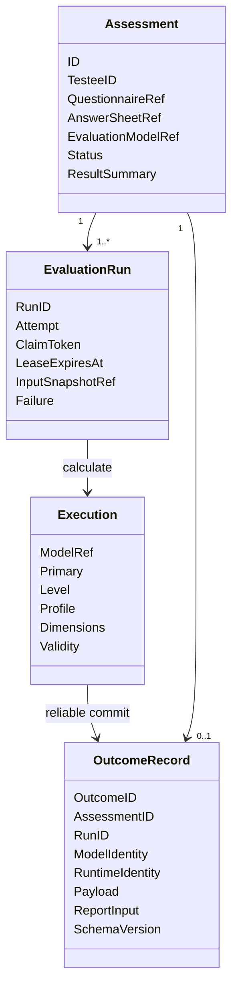
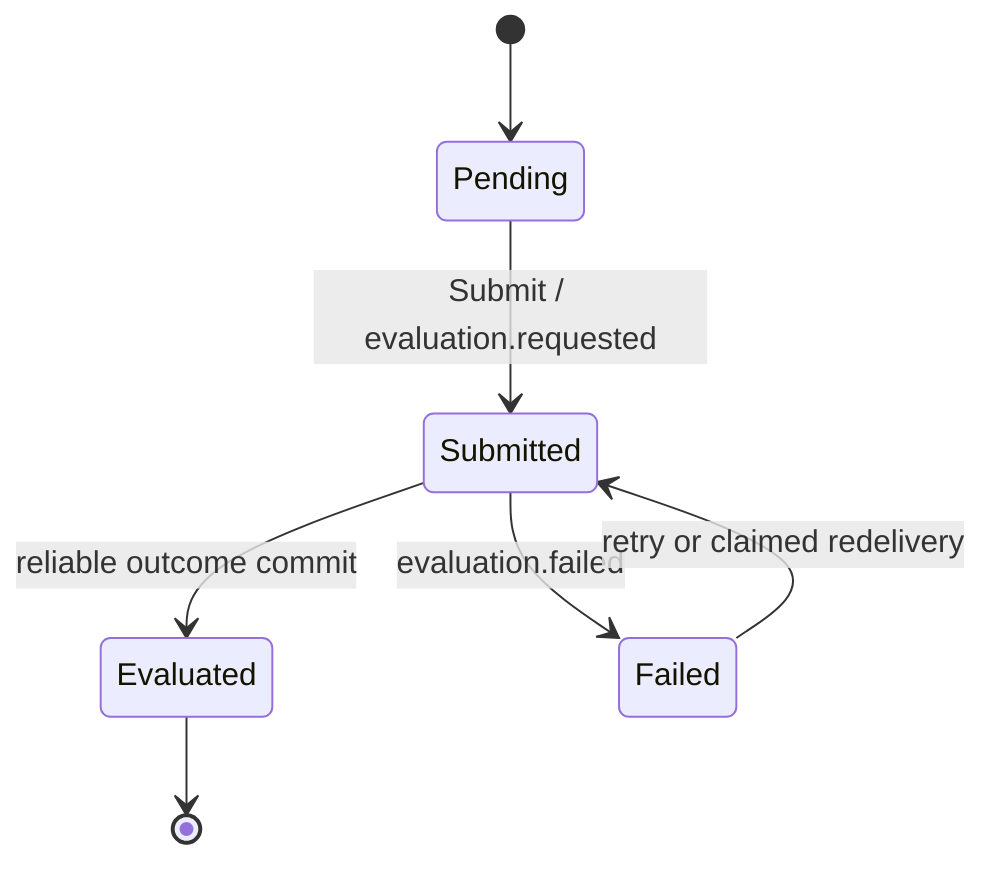
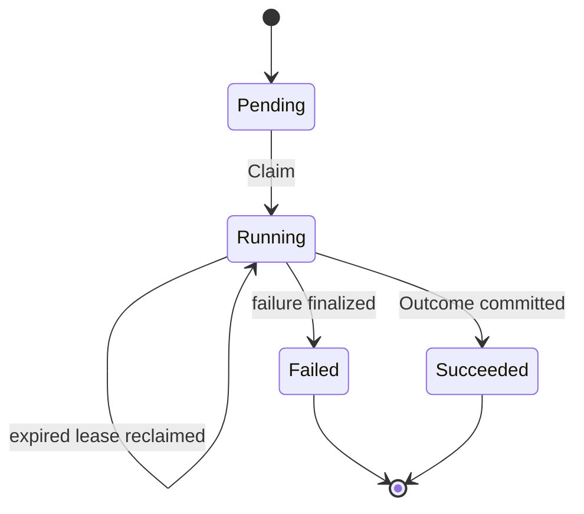

# Evaluation 领域模型

## 1. 本文回答

本文说明 Evaluation 的领域拆分：`Assessment` 保护一次测评的业务生命周期，`EvaluationRun` 保护每次执行尝试，`Execution` 表示尚未提交的计算结果，`Outcome Record` 才是不可变的持久化事实。

## 2. 30 秒结论

| 对象 | 角色 | 可变性 | 稳定身份 |
| --- | --- | --- | --- |
| `Assessment` | 一次测评业务实例 | 按状态机修改 | Assessment ID；AnswerSheet ID 物理唯一 |
| `EvaluationRun` | 一次可 claim 的执行尝试 | pending/running 期可推进，终态不回退 | `assessmentID:attempt` |
| `Execution` | Evaluator 返回的进程内结果 | 可在计算期组装 | 无独立持久化身份 |
| `Outcome Record` | 成功 Run 提交的 canonical 事实 | 创建后只读 | Outcome ID；Assessment ID 和 Run ID 均唯一 |
| `assessment_score` | 量表型分数查询投影 | 由 Outcome 重建/替换 | Assessment + factor |



## 3. Assessment 聚合

Assessment 记录“谁针对哪个问卷版本、用哪份答卷和哪个模型执行了一次测评”。它持有引用而不内嵌上游完整对象：

| 引用/事实 | 语义 |
| --- | --- |
| `TesteeID` | 被测评人 |
| `QuestionnaireRef(code, version)` | 本次作答契约 |
| `AnswerSheetRef` | 不可替换的作答事实引用 |
| `EvaluationModelRef(kind, subKind, algorithm, code, version)` | 执行期模型身份；纯问卷场景可为空 |
| `Origin(adhoc/plan)` | 临时测评或计划任务来源 |
| `ResultSummary` | 便于列表查询的主分、等级摘要，不替代 Outcome |

聚合保护的主要不变式：

- org、testee、questionnaire ref 和 answer sheet ref 必须完整；
- 只有 `pending` 能通过 `Submit` 进入 `submitted`；
- 只有 `submitted` 能接受评分投影或标记 Evaluation 失败；
- 应用评分时必须已绑定模型，且 Execution 模型身份不得与 Assessment 引用冲突；
- `evaluated` 是 Evaluation 成功终态，没有 `interpreted` 领域状态。



## 4. EvaluationRun

Assessment 表示业务结果，Run 表示执行过程。同一 Assessment 可以因可重试失败产生多个 Run，但每个 Run 的 attempt 、trace、输入快照引用和失败分类必须保留。



Run 领域方法限定：

- `Claim` 设置独占 token、trace ID 和 lease deadline；
- `AttachInputSnapshot` 只允许第一次绑定，不允许同一 Run 切换输入；
- `Succeed` 和 `Fail` 只能从 running 进入终态；
- `Failure` 分为 validation、calculation、timeout 和 internal，并显式携带 `Retryable`。

claim、lease 和下一 attempt 如何落库见 [21-核心设计-状态幂等与可靠提交.md](./21-核心设计-状态幂等与可靠提交.md)。

## 5. Execution 与 Outcome Record

`Execution` 是机制无关的计算结果容器：

- `Primary` 表示主分；
- `Level` 表示结果等级或严重度代码；
- `Profile` 表示类型或能力 profile；
- `Dimensions` 统一表达 factor、pole、trait、index 和 ability 维度；
- `Validity` 表达效度或质量判定事实。

Execution 只有通过 Committer 才会变成 Outcome Record。Record 固化 Outcome ID、Assessment/Run 引用、模型身份、运行时身份、schema 版本、纯评分 payload 和冻结 ReportInput。

两者不能混用：

| 场景 | 正确对象 |
| --- | --- |
| Preview 或计算中间态 | `Execution` |
| 事务提交前的待写结果 | `Execution` |
| Interpretation、Worker 回执、评分查询 | `Outcome Record` |
| 历史重放和运维核对 | `Outcome Record + InputSnapshotRef + ReportInput` |

## 6. 领域服务与应用机制的边界

| 规则/机制 | 层 | 原因 |
| --- | --- | --- |
| identity → AlgorithmFamily / DecisionKind 纯推导 | Domain routing | 不需要 I/O，是稳定业务规则 |
| Assessment / Run 状态迁移 | Domain | 保护聚合与尝试不变式 |
| InputProvider、RuntimeDescriptor Registry | Application / infra | 需要仓储、注册和执行组件 |
| Outcome 序列化、score projection、MySQL 事务 | Application / infra | 是持久化与编排责任 |
| 报告 builder 和 Report 状态 | Interpretation | 不属于 Evaluation |

## 7. 领域事件

| 事件 | 产生时机 | 业务语义 |
| --- | --- | --- |
| `evaluation.requested` | Assessment 从 pending 进入 submitted | 已具备异步执行条件 |
| `evaluation.outcome.committed` | Outcome、Run 和 Assessment 成功事务提交 | 评分事实已成立，Interpretation 可开始 |
| `evaluation.failed` | Assessment 和 Run 失败事务提交 | 本次 Evaluation 已失败，是否重试由 Run Failure 决定 |

三个事件均是 `durable_outbox`，具体事务边界见 `21`。

## 8. 模块所有权

| 对象 | 所有者 | Evaluation 的边界 |
| --- | --- | --- |
| Questionnaire / AnswerSheet | Survey | 只通过精确版本引用读取 |
| AssessmentModel / Published Snapshot / Norm | ModelCatalog | 只消费发布态模型和执行 payload |
| Assessment / EvaluationRun / Outcome | Evaluation | 主写事实 |
| ReportGeneration / InterpretReport | Interpretation | 通过只读 `evaluationfact` port 消费 Outcome |
| Workbench / Statistics | 各读模型模块 | 消费投影或事件，不回写 Outcome |

## 9. 事实源与验证

| 主题 | 路径 |
| --- | --- |
| Assessment | [`domain/evaluation/assessment`](../../../internal/apiserver/domain/evaluation/assessment/) |
| EvaluationRun | [`domain/evaluation/run`](../../../internal/apiserver/domain/evaluation/run/) |
| Execution / Outcome | [`domain/evaluation/outcome`](../../../internal/apiserver/domain/evaluation/outcome/) |
| Routing | [`domain/evaluation/routing`](../../../internal/apiserver/domain/evaluation/routing/) |
| 跨模块只读事实 | [`port/evaluationfact`](../../../internal/apiserver/port/evaluationfact/) |

```bash
go test ./internal/apiserver/domain/evaluation/...
go test ./internal/apiserver/port/evaluationfact/...
```
