# 核心设计：执行身份与运行时扩展

## 1. 本文回答

本文说明 Evaluation 如何不依赖“问卷 code 大 switch”扩展计分能力：模型身份先选择输入 Provider，已发布模型再物化为 `InputSnapshot`，`ModelRoute` 推导 `DescriptorKey`，最后由 `RuntimeDescriptor` 中的三段 pipeline 产出统一 `Execution`。

## 2. 30 秒结论

```mermaid
flowchart LR
    Ref["Assessment ModelRef"]
    ProviderRegistry["ModelInputProviderRegistry<br/>ExecutionIdentity"]
    Inputs["InputSnapshot<br/>Model + AnswerSheet + Questionnaire"]
    Route["ModelRoute"]
    DescriptorRegistry["RuntimeDescriptorRegistry<br/>DescriptorKey"]
    Assemble["InputAssembler"]
    Calculate["Calculator"]
    Outcome["OutcomeAssembler"]
    Execution["Execution"]

    Ref --> ProviderRegistry --> Inputs --> Route --> DescriptorRegistry
    DescriptorRegistry --> Assemble --> Calculate --> Outcome --> Execution
```



扩展点分两层：

1. `ModelInputProvider` 负责“从哪里取出精确的模型、答卷和问卷快照”。
2. `RuntimeDescriptor` 负责“这类模型用什么计算机制以及如何映射结果”。

模型 code 是资产身份，不是 evaluator 注册键。运行时以机制类型注册，因此同一机制可以服务多个模型资产。

## 3. 三类身份不能混用

| 身份 | 字段 | 用途 |
| --- | --- | --- |
| `ExecutionIdentity` | kind + subKind + algorithm | 在 `ModelInputProviderRegistry` 中选择输入物化方式 |
| `ModelRoute` | identity + DecisionKind + PayloadFormat | 一次已解析模型的最小运行时路由信息 |
| `DescriptorKey` | AlgorithmFamily + DecisionKind + PayloadFormat | 在 `RuntimeDescriptorRegistry` 中选择执行 pipeline |

`AlgorithmFamily` 回答“怎么算”，`DecisionKind` 回答“如何从计算值得到结果”，`PayloadFormat` 回答“执行 payload 按什么 wire 契约解析”。它们都不等于 ProductChannel 或 model code。

路由规则在 `domain/evaluation/routing` 中是纯函数：

```text
ModelRoute
  -> ExecutionFamilyFromRoute
  -> ExecutionDecisionFromRoute
  -> DescriptorKey
```

若 published 路由提供了与家族匹配的 DecisionKind，保留它；否则使用家族默认 DecisionKind。不支持的 identity/family 必须失败，不得默认落到某个通用 evaluator。

## 4. InputSnapshot：执行期输入契约

`evaluationinput.InputSnapshot` 是 port 层 DTO，不是 Evaluation 聚合。它把一次计算需要的外部事实组合到一起：

| 部分 | 来源 | 约束 |
| --- | --- | --- |
| `Model` / `ModelPayload` | ModelCatalog published-only catalog | 按 Assessment 中 code/version/identity 读取，不读 draft |
| `AnswerSheet` | Survey AnswerSheet Repository | 按 AnswerSheet ID 读取已提交事实 |
| `Questionnaire` | Survey Questionnaire Repository | 使用答卷记录的 code + version 精确读取 |
| `NormSubject` | 可选人口学输入 | 当前 `RepositoryResolver` 不自动填充；缺失时机制接收空/零值 subject |

`InputSnapshotRef` 是 Run 的稳定审计引用，当前优先记录 `model:<code>@<version>`，没有模型快照时才回退到 `answersheet:<id>`。它不代替 Outcome 中冻结的 ReportInput。

## 5. 输入 Provider 注册表

当前组合根根据 RuntimeDescriptor Registry 导出 ExecutionPath，再物化同序的 InputProvider：

| ExecutionPath | Provider 身份 | 主要输入 |
| --- | --- | --- |
| `scale_descriptor` | scale / scale_default | Scale snapshot + AnswerSheet + Questionnaire |
| `typology_descriptor` | typology / typology / personality algorithm | Typology payload + AnswerSheet + Questionnaire |
| `behavioral_rating_descriptor` | behavioral_rating default provider | Behavioral snapshot（含常模资料）+ 作答快照 |
| `cognitive_descriptor` | cognitive / spm | Cognitive snapshot（可含常模资料）+ 作答快照 |

`AssertExecutionPathParity` 保证 descriptor 导出的 path 和 provider 的 path 数量、顺序一致。这个护栏防止“运行时声明了能力，但输入层没有物化”。

Provider Registry 以 `ExecutionIdentity` 查找。typology 的不同 personality algorithm 可共用 configured provider；behavioral_rating 的多个算法由统一 provider 加载具体 published snapshot。这是输入物化共用，不是把算法身份丢掉。

## 6. RuntimeDescriptor 三段 pipeline

`RuntimeDescriptor` 不是一个大型 Evaluator 接口，而是三个窄组件的组合：

```text
InputAssembler.Assemble(ModelRoute)
  -> CalculationInput

Calculator.Calculate(ctx, CalculationInput)
  -> mechanism-specific raw result

OutcomeAssembler.Assemble(raw result)
  -> canonical Evaluation Execution
```

| AlgorithmFamily | 默认 DecisionKind | 当前机制包 |
| --- | --- | --- |
| `factor_scoring` | `score_range` | `registry/mechanisms/scoring` |
| `factor_classification` | `pole_composition` | `registry/mechanisms/typology` |
| `factor_norm` | `norm_lookup` | `registry/mechanisms/norming` |
| `task_performance` | `ability_level` | `registry/mechanisms/task_performance` |

Registry 解析顺序为：完整 DescriptorKey → family + payload format → family。当前默认注册是 family-level descriptor，具体 DecisionKind 仍会记入本次 Outcome 的 RuntimeIdentity。

## 7. 新模型/算法的扩展步骤

不要从 `execute.Service` 加 switch。按以下责任链判断需要扩展哪一层：

1. 在 ModelCatalog 定义 canonical identity、DefinitionV2 语义、DecisionKind 和 ExecutionPath。
2. 若是新的输入物化方式，增加 `ModelInputProvider` 并纳入 `MaterializeInputProviders`。
3. 若是新 AlgorithmFamily，增加 path materialization 和 family-level RuntimeDescriptor；同家族新算法优先复用现有 descriptor。
4. 提供 InputAssembler、Calculator、OutcomeAssembler，并在 `AttachNativePipelines` 中组装。
5. 将机制结果映射为 canonical `Execution`；若扩展持久化事实形状，同步更新 schema/codec 和回归测试。
6. 通过 descriptor/provider parity、registry contract、机制测试和组合根测试。

只改 payload DTO 而不更新 Provider 或 descriptor，会导致“发布成功但运行时不可执行”；只注册 descriptor 而不增加 codec，会导致结果能计算但无法稳定重放。

## 8. 事实源与验证

| 主题 | 路径 |
| --- | --- |
| 纯路由规则 | [`domain/evaluation/routing`](../../../internal/apiserver/domain/evaluation/routing/) |
| 输入契约 | [`port/evaluationinput`](../../../internal/apiserver/port/evaluationinput/) |
| Provider 物化 | [`infra/evaluationinput`](../../../internal/apiserver/infra/evaluationinput/) |
| Descriptor 契约/注册 | [`application/evaluation/runtime`](../../../internal/apiserver/application/evaluation/runtime/) |
| 机制实现 | [`application/evaluation/registry/mechanisms`](../../../internal/apiserver/application/evaluation/registry/mechanisms/) |
| 组合根一致性 | [`container/modules/evaluation`](../../../internal/apiserver/container/modules/evaluation/) |

```bash
go test ./internal/apiserver/domain/evaluation/routing
go test ./internal/apiserver/infra/evaluationinput
go test ./internal/apiserver/application/evaluation/runtime/... ./internal/apiserver/application/evaluation/registry/...
go test ./internal/apiserver/container/modules/evaluation/...
```
