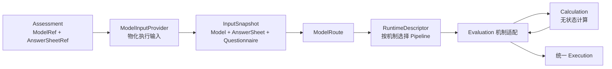
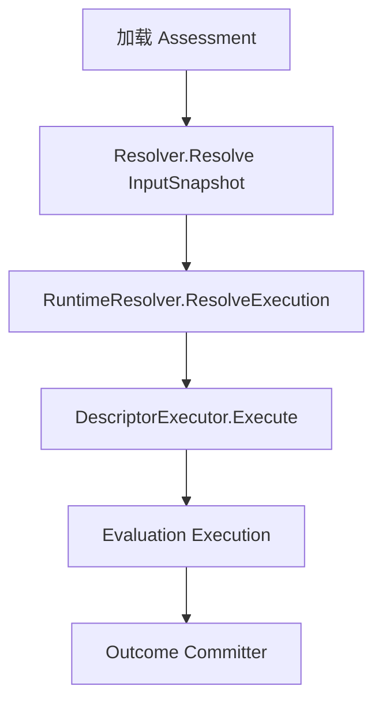
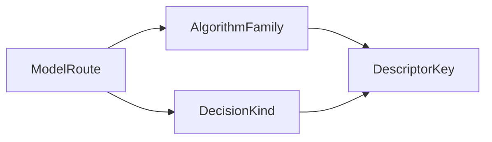
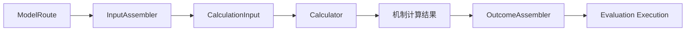

# 核心设计：统一测评执行模型

## 1. 本文回答

本文重点回答：

- 为什么医学量表、人格测评、行为评定和认知测验可以共享同一条 Evaluation 主链路；
- Assessment 中的模型引用怎样变成一次可执行输入；
- 模型身份、AlgorithmFamily、DecisionKind 和 ExecutionPath 分别解决什么问题；
- ModelInputProvider 与 RuntimeDescriptor 为什么是两层不同的扩展点；
- Evaluation 如何调用 Calculation，而不把算法重新收回自己；
- 增加新模型、新算法和新机制时，分别需要修改哪些位置；
- 当前统一执行模型还存在哪些扩展性问题。

状态、Claim、Lease、重试和事务提交只在本文中作为主链路前后条件出现，详细设计由后续文档负责。

## 2. 30 秒结论

Evaluation 不是按测评模型 code 注册一组 Evaluator，而是把一次执行拆成三段：

1. 根据 Assessment 中的发布模型身份，物化精确执行输入；
2. 根据模型的执行机制身份，选择 RuntimeDescriptor；
3. 通过机制适配器调用 Calculation，并组装统一 Execution。



这套设计希望达到的核心目标是：

> 新增一个使用已有机制的模型，只需要完成模型配置和发布；新增一种真正不同的计算机制时，通过稳定扩展点接入，但不修改 `execute.Service` 的通用编排顺序。

模型 code 回答“这是哪项业务资产”，AlgorithmFamily 回答“采用哪一类计算机制”。两者不能混用。

## 3. 统一执行模型要解决什么问题

### 3.1 最容易出现的错误设计：按模型编码分支

系统早期只有少数量表时，很容易把执行逻辑写成：

```text
if modelCode == SNAP_IV:
    calculateSnapIV()
else if modelCode == MBTI:
    calculateMBTI()
else if modelCode == BRIEF_2:
    calculateBrief2()
```

这种设计把“业务资产身份”和“计算机制身份”混在一起：

- 同一种计分机制被多个模型重复实现；
- 增加模型就要修改 Evaluation 主流程；
- 输入加载、算法执行和结果组装相互耦合；
- 模型发布成功不代表运行时真的具备执行能力；
- 测评类型逐渐增加后形成大 switch 和霰弹式修改。

统一执行模型不否认模型差异，而是把差异限制在正确的扩展点中。

### 3.2 同类模型与异类模型的扩展方式不同

我们在 ModelCatalog 中已经确定：

> 让同类测评配置化接入，让异类测评通过稳定扩展点接入，并保护统一执行主链路不被反复修改。

在 Evaluation 中，这句话具体表现为：

| 扩展场景 | 示例 | Evaluation 的预期变化 |
| --- | --- | --- |
| 同一种机制下新增模型 | 增加一份新的医学量表 | 主流程和运行组件不变 |
| 同一家族下增加模型算法 | 增加一种人格分类算法 | 复用家族 Pipeline，必要时增加 payload/结果适配 |
| 增加新的输入形态 | 模型需要新的任务数据或人口学数据 | 增加或扩展 InputProvider |
| 增加新的计算机制 | 出现现有四种 AlgorithmFamily 都无法表达的模型 | 增加 ExecutionPath、Descriptor 和 Calculation 能力 |

## 4. 通用编排：什么保持不变

`application/evaluation/execute.Service` 对所有模型执行相同的步骤：

```text
1. 加载 Assessment
2. 判断是否已经完成或不需要执行
3. Claim 一个合法 EvaluationRun
4. 解析 InputSnapshot
5. 记录 InputSnapshotRef
6. 解析一次 RuntimeDescriptor
7. 执行已解析 Descriptor
8. 将 Execution 交给可靠提交器
```

其中第 3、5、8 步涉及运行可靠性，但不改变模型扩展方式。对于统一执行模型，最重要的是第 4、6、7 步：输入物化、机制路由和计算适配。



`execute.Service` 不应知道当前处理的是 SNAP-IV、MBTI、BRIEF-2 还是 SPM，也不应直接依赖这些模型的 payload DTO。

## 5. 第一层扩展：执行输入物化

### 5.1 InputRef：从 Assessment 出发

Evaluation 首先从 Assessment 形成最小输入引用：

| 引用 | 来源 | 用途 |
| --- | --- | --- |
| Assessment ID | Assessment | 关联执行和审计 |
| ModelRef | Assessment.EvaluationModelRef | 精确读取已发布模型 |
| AnswerSheet ID | Assessment.AnswerSheetRef | 读取最终作答事实 |
| Questionnaire code/version | Assessment.QuestionnaireRef | 校验历史作答语义 |

这一步只传递身份，不加载完整领域对象。实际 I/O 由 `evaluationinput.Resolver` 和具体 Provider 完成。

### 5.2 为什么必须读取精确版本

一次执行依赖三个已经确定的事实：

- AnswerSheet 记录的最终答案；
- AnswerSheet 对应的 Questionnaire code/version；
- Assessment 固化的 AssessmentModel code/version。

执行时不能使用：

- Questionnaire 当前 active version 替代历史版本；
- AssessmentModel 当前 latest version 替代 Assessment 中的版本；
- ModelCatalog draft 替代发布快照。

否则，即使用户答案没有变化，同一个 Assessment 也可能在不同时间得到不同结果。

### 5.3 ModelInputProvider 的职责

`ModelInputProvider` 回答：

> 这一类模型需要从哪些事实源读取什么数据，才能组成一次可执行输入？

Provider 的核心接口是：

```text
ExecutionIdentity() -> provider key
ResolveInput(InputRef) -> InputSnapshot
```

当前 InputSnapshot 主要包含：

| 内容 | 事实来源 | 说明 |
| --- | --- | --- |
| `Model` | ModelCatalog 发布快照 | 统一模型元数据和执行身份 |
| `ModelPayload` | ModelCatalog 发布快照 | 机制需要的 DefinitionV2 物化结果 |
| `AnswerSheet` | Survey | 最终答案和基础题分 |
| `Questionnaire` | Survey | 精确题目、题型、选项和版本 |
| `NormSubject` | 受试者人口学信息 | 可选；用于年龄、性别等常模匹配 |

InputSnapshot 是跨模块的执行期 DTO，不属于 Assessment 聚合，也不是一份已经持久化的完整审计快照。

### 5.4 当前四类 Provider

| ExecutionPath | Provider 物化内容 | 面向机制 |
| --- | --- | --- |
| `scale_descriptor` | Scale snapshot、AnswerSheet、Questionnaire | factor scoring |
| `typology_descriptor` | Typology payload、AnswerSheet、Questionnaire | factor classification |
| `behavioral_rating_descriptor` | Behavioral snapshot、Norm 资产、AnswerSheet、Questionnaire | factor norm |
| `cognitive_descriptor` | Cognitive snapshot、Norm 资产、AnswerSheet、Questionnaire | task performance |

行为评定和认知测验的 Provider 会在加载发布模型时解析 Norm 引用；Norm 仍由 ModelCatalog 所有，Evaluation 只获得执行所需的物化结果。

### 5.5 Provider Registry 为什么使用 ExecutionIdentity

Provider Registry 使用 `kind + subKind + algorithm` 形成的 ExecutionIdentity，而不是 model code。

这意味着：

- 多份医学量表可以共用 Scale Provider；
- 多份人格模型可以共用 Typology Provider；
- Provider 扩展发生在输入形态变化时，而不是每增加一份模型时；
- 模型资产数量不会直接增加 Provider 数量。

## 6. 从模型身份到执行机制

统一执行链路中存在多种“身份”，它们回答的问题不同。

| 概念 | 典型字段 | 回答的问题 |
| --- | --- | --- |
| Model identity | kind、subKind、algorithm、code、version | 这是哪个发布模型 |
| `ExecutionIdentity` | kind、subKind、algorithm | 使用哪类输入 Provider |
| `AlgorithmFamily` | factor_scoring 等 | 采用哪种计算机制 |
| `DecisionKind` | score_range、pole_composition 等 | 如何将计算值判定为结果 |
| `ExecutionPath` | scale_descriptor 等 | 组合根要物化哪套 Provider 和 Pipeline |
| `DescriptorKey` | family + decision | 运行时选择哪份 Descriptor |

### 6.1 model code 不是执行路由键

Model code 需要保存在 Assessment 和 Outcome 中，因为它是业务资产身份和历史证据。但执行路由不应依赖它。

例如两份不同医学量表可以具有不同的：

- model code；
- Questionnaire；
- Factor；
- Decision 区间。

只要它们都采用因子计分与区间判定，就可以路由到同一个 `factor_scoring` 机制。

### 6.2 ProductChannel 也不是执行路由键

ProductChannel 用于产品入口和运营分类，例如医学量表、人格或行为能力产品通道。它不能精确说明计算方式。

同一个产品通道未来可能包含不同机制；不同产品通道也可能复用相同的基础计分能力。因此运行时使用模型身份和 AlgorithmFamily，而不是产品导航分类。

### 6.3 ModelRoute

InputSnapshot 解析完成后，Evaluation 提取最小运行时路由：

```text
ModelRoute {
  Kind
  SubKind
  Algorithm
  AlgorithmFamily
  DecisionKind
}
```

RuntimeResolver 只从 InputSnapshot 的冻结身份构造 ModelRoute。AlgorithmFamily 或 DecisionKind 缺失时 fail closed，不回退 Assessment ModelRef，也不从 Kind/Algorithm 推导。

### 6.4 从 ModelRoute 推导 DescriptorKey



路由规则是：

1. 读取发布快照冻结并进入 InputSnapshot 的 AlgorithmFamily 与 DecisionKind；
2. 两者都必须非空且与模型身份契约相容；
3. 直接形成 `AlgorithmFamily + DecisionKind`；
4. 缺失、冲突或未注册时 validation failure，不使用默认值。

当前默认关系为：

| AlgorithmFamily | 默认 DecisionKind |
| --- | --- |
| `factor_scoring` | `score_range` |
| `factor_classification` | `pole_composition` |
| `factor_norm` | `norm_lookup` |
| `task_performance` | `ability_level` |

该表是发布契约的合法组合，不是运行时兜底。新 DecisionKind 必须显式注册精确 descriptor。

## 7. 第二层扩展：RuntimeDescriptor

### 7.1 RuntimeDescriptor 的职责

RuntimeDescriptor 描述某种执行机制如何完成一次 Evaluation：

```text
RuntimeDescriptor {
  DescriptorKey
  AlgorithmFamily
  DecisionKind
  ExecutionPath
  InputAssembler
  Calculator
  OutcomeAssembler
}
```

它不是模型资产，也不属于运营发布内容。它是应用运行时注册的机制描述符。

### 7.2 Descriptor Registry 的解析顺序

Registry 只按完整 `(AlgorithmFamily, DecisionKind)` 查找。不存在格式级或 family 级 fallback；当前七种合法组合均显式注册并装配 Pipeline 三件套。

### 7.3 三段 Pipeline

每个 Descriptor 由三个窄组件组成：



| 组件 | 目标职责 |
| --- | --- |
| `InputAssembler` | 将执行期模型和作答事实转换为 Calculation 中性输入 |
| `Calculator` | 调用 Calculation 执行无状态规则 |
| `OutcomeAssembler` | 将机制结果映射为统一 Evaluation Execution |

Descriptor 使 `execute.Service` 只依赖一套稳定协议，不需要认识每个模型的 DTO 和算法入口。

## 8. Evaluation 与 Calculation 的边界

### 8.1 Calculation 拥有什么

Calculation 是无状态计算内核，负责：

- 因子聚合和计分策略；
- 维度分类和类型组合；
- 常模查表与标准分投影；
- 任务表现计算；
- 将数值映射为机器可判定结果。

Calculation 不应读取数据库，不应知道 Assessment 生命周期，也不应发布 Evaluation 事件。

### 8.2 Evaluation 机制适配器拥有什么

Evaluation 机制适配器负责：

- 从 InputSnapshot 提取当前机制需要的数据；
- 校验输入是否满足机制前置条件；
- 转换为 Calculation 的中性类型；
- 调用 Calculation；
- 将 Calculation Result 映射为统一 Execution；
- 保留模型身份和运行时身份。

因此，`application/evaluation/registry/mechanisms/*` 虽然按机制组织，但不应成为第二套算法领域。它们是 ModelCatalog payload、Calculation 和 Evaluation Outcome 之间的防腐层。

### 8.3 当前四种执行机制

| 机制 | 当前主要过程 | 统一输出 |
| --- | --- | --- |
| `factor_scoring` | 校验量表输入，调用 Calculation Scoring，根据 Factor 和 Decision 形成结果 | 主分、Factor Dimensions、Level |
| `factor_classification` | 读取人格 payload 和作答，执行分类运行时与类型组装 | Profile、Pole/Trait Dimensions、Level |
| `factor_norm` | 先完成基础因子计分，再按 Norm 和 NormSubject 投影标准分、百分位和等级 | Index/Factor Dimensions、NormReference、Level |
| `task_performance` | 计算任务表现；SPM 使用专用计算，其他路径可复用基础计分再形成能力结论 | Ability Dimensions、Profile、Level |

四种机制最终都返回 `domain/evaluation/outcome.Execution`，因此后续可靠提交不需要按模型类型分支。

## 9. 组合根如何保证能力成套出现

Evaluation 启动时先创建 RuntimeDescriptor Registry，再根据 Registry 中支持的 ExecutionPath 物化 InputProvider：

```text
RuntimeDescriptor Registry
  -> ExecutionPathsFromRegistry
  -> FilterExecutablePaths
  -> MaterializeInputProviders
  -> RepositoryResolver
```

这样做是为了避免两种不完整状态：

- 已注册运行机制，但没有对应输入 Provider；
- 已经可以读取某类模型，却没有对应 Descriptor Pipeline。

当前代码还提供 `AssertExecutionPathParity` 检查 Provider 与 ExecutionPath 的数量和顺序，并由组合根契约测试保护；生产 Wire 主要依靠同一组 `executionPaths` 直接物化 Provider，而不是再次调用该断言。

启动时还会把四套 native Pipeline 组件装配进 family-level Descriptor。缺少 InputAssembler、Calculator 或 OutcomeAssembler 的 Descriptor 在执行时会立即失败，不会部分执行后伪造结果。

## 10. 三类扩展场景

### 10.1 新增同机制模型

例如增加一份新的医学量表，并继续使用 factor scoring：

1. 在 Survey 创建并发布 Questionnaire；
2. 在 ModelCatalog 创建模型，配置 Factor 和 Decision；
3. 绑定并联合发布 Questionnaire 与 AssessmentModel；
4. 由现有 Scale Provider 读取发布快照；
5. 复用 factor scoring Descriptor 和 Calculation。

Evaluation 主流程、Provider 类型、Descriptor 和 Outcome Committer 都不需要修改。

### 10.2 同家族增加算法或 DefinitionV2 变体

如果新算法仍属于现有 AlgorithmFamily，需要判断差异发生在哪一层：

| 差异 | 修改位置 |
| --- | --- |
| 只是模型配置不同 | 只修改 ModelCatalog 配置 |
| DefinitionV2 结构新增字段 | ModelCatalog validator、runtime assembler 和对应 InputProvider |
| Calculation 输入转换不同 | 机制 InputAssembler/Adapter |
| 计算规则不同但结果语义相同 | Calculation 增加策略或算法实现 |
| Outcome Detail 不同 | OutcomeAssembler 或 detail adapter |
| 新 DecisionKind 需要独立 Pipeline | 注册精确 RuntimeDescriptor |

无论是哪一种，都不应在 `execute.Service` 中增加 model code 判断。

### 10.3 增加全新执行机制

只有现有 AlgorithmFamily 无法表达新模型时，才需要增加全新机制。完整工作包括：

1. 在 ModelCatalog 定义新的模型身份、AlgorithmFamily/DecisionKind 映射；
2. 定义新的 ExecutionPath 和模型家族运行能力；
3. 增加 DefinitionV2 的解析、验证和临时物化；
4. 增加 ModelInputProvider；
5. 在 Calculation 增加中性输入、算法和 Result；
6. 增加 RuntimeDescriptor Pipeline；
7. 将结果映射为统一 Execution，必要时演进 Outcome schema；
8. 在组合根注册并补齐契约测试。

这是一项跨模块扩展，但 `execute.Service` 的八步编排仍然保持不变。

## 11. 失败语义与快速失败

统一执行模型不会通过宽松 fallback 隐藏配置错误。

| 失败位置 | 典型原因 | Evaluation 语义 |
| --- | --- | --- |
| Provider 解析 | 模型不存在、不是发布态、问卷版本不匹配 | validation failure |
| ModelRoute 推导 | 模型身份或 Decision 无法映射到机制 | validation failure |
| Descriptor 解析 | 没有注册对应 AlgorithmFamily/DecisionKind | validation failure |
| Pipeline 完整性 | 缺少三段组件之一 | internal/configuration failure |
| Calculation | 输入有效但计算过程失败 | calculation failure |
| Outcome 组装 | 机制结果无法映射为统一 Execution | calculation/internal failure |

原则是：

> 发布模型能够被找到，不等于它一定具备运行能力；只有输入 Provider、运行路由、Calculation 和 Outcome 组装全部闭合，模型才真正可执行。

ModelCatalog 发布准入应尽量提前发现这些问题，Evaluation 运行时仍必须保留最终防线。

## 12. 设计模式与架构思想

| 设计方式 | 在本模块中的体现 | 解决的问题 |
| --- | --- | --- |
| Strategy | AlgorithmFamily 对应不同计算策略 | 避免模型 code switch |
| Registry | Provider Registry、Descriptor Registry | 将扩展能力集中注册和校验 |
| Adapter / 防腐层 | InputProvider、calculationadapter、OutcomeAssembler | 隔离不同领域的数据模型 |
| Pipeline | Assemble → Calculate → Assemble Outcome | 将输入转换、计算和结果映射分开 |
| Ports and Adapters | `port/evaluationinput`、`port/ruleengine` | 让应用编排不依赖具体数据库和规则引擎 |
| Stable Core | `execute.Service` 固定八步编排 | 新模型接入时保护主流程 |

这些模式不是为了增加抽象层数，而是为了建立一个明确判断标准：变化究竟属于模型配置、计算规则、输入物化，还是执行编排。

## 13. 当前设计的不足

统一执行方向已经形成，但当前实现仍有几个需要继续改进的地方。

### 13.1 InputAssembler 的接口与实际职责不一致

当前 `InputAssembler.Assemble` 只接收 ModelRoute，生成的 CalculationInput 也主要只包含 Route。真正的 Assessment 和 InputSnapshot 通过 context 注入，再由 Calculator 取出。

这导致：

- 从接口签名看不出 Calculator 实际依赖完整执行输入；
- InputAssembler 没有真正完成“业务输入到 Calculation 输入”的组装；
- context 被用作隐式参数通道；
- 不同机制更容易绕过统一的输入契约。

目标上应让 CalculationInput 显式承载计算所需的中性输入，Calculator 不再从 context 获取业务 DTO。具体重构边界见 [EV-R013](./90-设计问题与重构清单.md#ev-r013让-inputassembler-真正组装-calculationinput)，本文只记录事实和方向。

### 13.2 冻结路由已经收口

发布快照中的 AlgorithmFamily 与 DecisionKind 通过 InputSnapshot、ModelRoute 和 Outcome RuntimeIdentity 原样贯穿。Descriptor Registry 只做精确查找，不再存在 identity、format、family 或 Assessment ModelRef fallback。

### 13.3 NormSubject 已进入主解析链路

RepositoryResolver 从 Actor/Testee 人口学事实生成 NormSubject，并使用 Assessment.SubmittedAt 冻结年龄。年龄未知与已知 0 月龄显式区分，资料缺失由常模 resolver 给出稳定终态错误。

### 13.4 能力注册仍需多处同步

增加全新 AlgorithmFamily 时仍需同步 ModelCatalog capability、ExecutionPath、runtime materialization、Provider 和 Pipeline。主流程虽然不变，但扩展注册点较多。

后续可以继续收敛成更单一的 capability/descriptor 声明源，再从中派生 Provider 与 Pipeline 装配，降低漏注册风险。

## 14. 事实源与验证

| 主题 | 路径 |
| --- | --- |
| 通用执行服务 | [`application/evaluation/execute/service.go`](../../../internal/apiserver/application/evaluation/execute/service.go) |
| RuntimeResolver | [`application/evaluation/execute/runtime_resolver.go`](../../../internal/apiserver/application/evaluation/execute/runtime_resolver.go) |
| 纯路由规则 | [`domain/evaluation/routing`](../../../internal/apiserver/domain/evaluation/routing/) |
| 模型身份与能力 | [`domain/modelcatalog`](../../../internal/apiserver/domain/modelcatalog/) |
| InputSnapshot 契约 | [`port/evaluationinput`](../../../internal/apiserver/port/evaluationinput/) |
| InputProvider | [`infra/evaluationinput`](../../../internal/apiserver/infra/evaluationinput/) |
| RuntimeDescriptor | [`application/evaluation/runtime/descriptor`](../../../internal/apiserver/application/evaluation/runtime/descriptor/) |
| Pipeline 装配 | [`application/evaluation/runtime`](../../../internal/apiserver/application/evaluation/runtime/) |
| 机制适配器 | [`application/evaluation/registry/mechanisms`](../../../internal/apiserver/application/evaluation/registry/mechanisms/) |
| Calculation | [`domain/calculation`](../../../internal/apiserver/domain/calculation/) |
| Evaluation 组合根 | [`container/modules/evaluation`](../../../internal/apiserver/container/modules/evaluation/) |

```bash
go test ./internal/apiserver/domain/modelcatalog/...
go test ./internal/apiserver/domain/evaluation/routing
go test ./internal/apiserver/domain/calculation/...
go test ./internal/apiserver/infra/evaluationinput
go test ./internal/apiserver/application/evaluation/runtime/...
go test ./internal/apiserver/application/evaluation/registry/mechanisms/...
go test ./internal/apiserver/application/evaluation/execute
go test ./internal/apiserver/container/modules/evaluation/...
```
