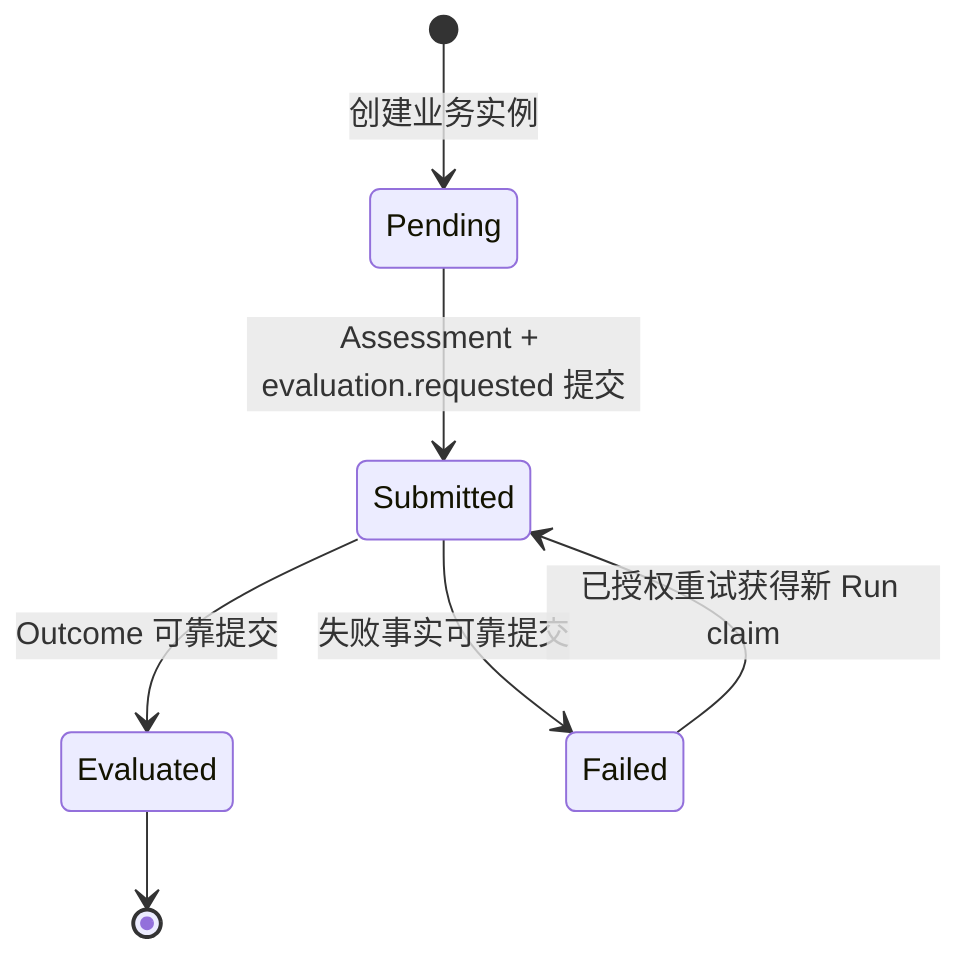
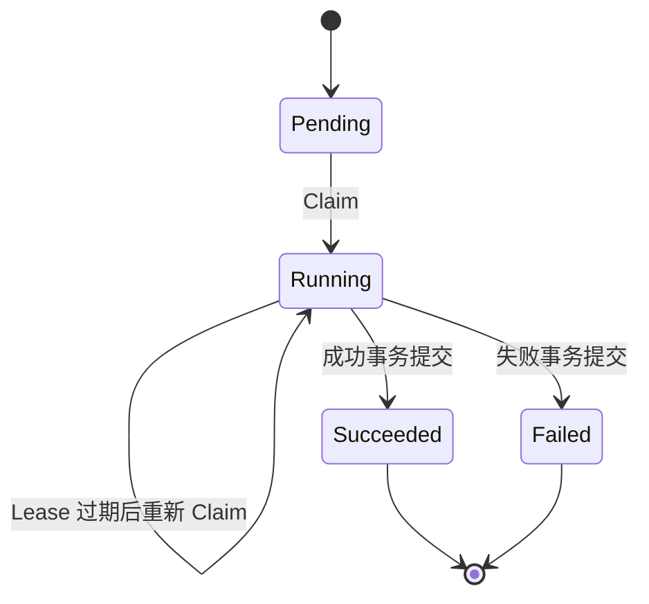
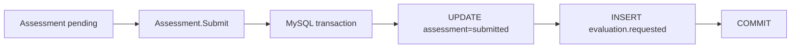
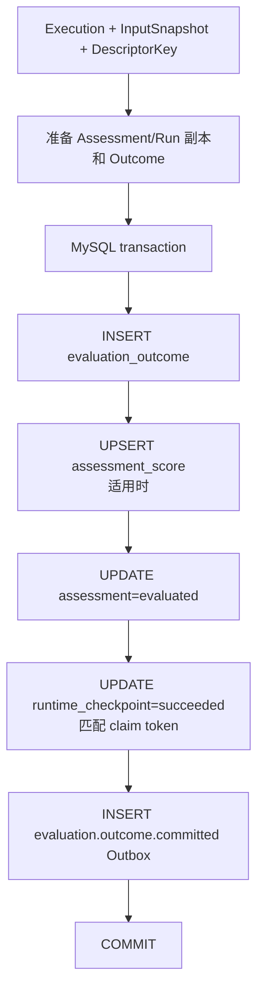
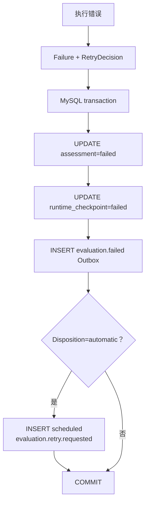
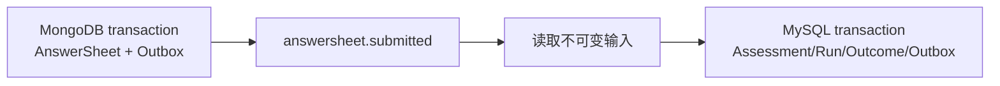

# 核心设计：状态、幂等与可靠提交

## 1. 本文回答

本文重点回答：

- Assessment 与 EvaluationRun 为什么需要两套状态机；
- 在消息至少投递一次的前提下，重复事件为什么不会重复形成测评结果；
- Claim、Lease 和 fencing token 分别保护什么；
- Assessment 提交、Evaluation 成功和 Evaluation 失败分别在哪个事务边界成立；
- 为什么计算成功仍不能立即把 Assessment 标记为 evaluated；
- 自动重试、人工重试和 Worker ACK 为什么必须依赖持久化事实；
- MongoDB 中的作答与模型事实怎样和 MySQL 中的 Evaluation 结果协作，而不引入分布式事务。

本文只解释 Evaluation 依赖这些机制保护了什么业务语义。Outbox Relay、消息中间件 settlement、治理操作台等通用实现将在 `03-基础设施` 中展开。

## 2. 30 秒结论

Evaluation 不追求消息和函数调用层面的“绝对只执行一次”，而是实现：

> 事件可以重复到达，Worker 可以重复调用，进程可以中途崩溃，但一个 Assessment 最多形成一份合法 Outcome，每次执行尝试都有明确所有者和可追溯终态。

它通过多层约束共同实现这一目标：

| 边界 | 保护机制 | 防止的问题 |
| --- | --- | --- |
| AnswerSheet → Assessment | `assessment.answer_sheet_id` 唯一约束 | 同一答卷创建多个测评实例 |
| Assessment → EvaluationRun | Assessment 状态检查、latest attempt | 已完成或无效状态继续执行 |
| 同一 Run 的执行权 | row lock、Claim、Lease、claim token | 多个 Worker 同时提交结果 |
| Run → Outcome | Outcome 对 Run ID 唯一 | 一个成功 Run 产生多份结果 |
| Assessment → Outcome | Outcome 对 Assessment ID 唯一 | 多次尝试各自形成一份 canonical 结果 |
| 成功提交 | Outcome、投影、Assessment、Run、Outbox 同一事务 | 结果与状态部分成功 |
| 失败提交 | Assessment、Run、失败事件、可选重试事件同一事务 | 失败不可追踪或重试丢失 |
| Worker settlement | 重新读取持久化 Receipt | 根据临时异常误判 ACK/NACK |

Assessment 回答“这次测评最终处于什么业务状态”，EvaluationRun 回答“第几次执行尝试发生了什么”。

## 3. 为什么不能依赖 Exactly Once

Evaluation 由 Outbox、消息中间件、qs-worker、内部 gRPC、apiserver 和数据库共同完成。任意两个组件之间都可能发生：

- 生产者写入成功，但响应在网络中丢失；
- 消息已经执行成功，但 Worker 在 ACK 前崩溃；
- gRPC 调用超时，但服务端实际上已经提交；
- Consumer 重启后重新收到尚未确认的事件；
- 同一事件因人工重放再次进入消费链路。

因此，系统不能把“消息只会来一次”作为正确性前提。更可行的设计是：

```text
At-least-once delivery
  + durable state machine
  + idempotent admission
  + exclusive Run claim
  + unique Outcome constraints
  + atomic commit
  = effectively-once business result
```

这里的 effectively-once 指“业务结果只成立一次”，不代表底层消息、HTTP/gRPC 调用或计算代码在物理上绝不会重复进入。

## 4. 双状态机

### 4.1 Assessment：业务状态机



| 状态 | 业务语义 | 允许的下一步 |
| --- | --- | --- |
| `pending` | Assessment 已创建，尚未可靠发出执行请求 | Submit |
| `submitted` | 已具备执行条件，正在等待或执行 Evaluation | evaluated / failed |
| `evaluated` | canonical Outcome 已经可靠成立 | Evaluation 终态 |
| `failed` | 最近一次执行已经形成失败事实 | 等待自动、人工或 Force 治理 |

Assessment 不保存 `running`，因为同一个业务实例可能有多个执行尝试；也不保存 `interpreted`，因为报告生成属于 Interpretation。

### 4.2 EvaluationRun：执行状态机



| 状态 | 执行语义 |
| --- | --- |
| `pending` | Run 已存在但尚未被执行者占有 |
| `running` | 某个 claim token 在 Lease 内拥有执行权 |
| `succeeded` | 此 Run 对应的 Outcome 已经提交 |
| `failed` | 此 Run 的 Failure 与 RetryDecision 已经提交 |

失败 Run 不会改回 running。业务重试通过创建下一 attempt 表达；Lease 恢复则继续原 attempt。

### 4.3 两套状态怎样对齐

| Assessment | 最新 Run | Outcome | 解释 |
| --- | --- | --- | --- |
| submitted | 无 Run | 无 | 等待第一次 Worker claim |
| submitted | running | 无 | 正在执行 |
| evaluated | succeeded | 有且唯一 | Evaluation 成功闭环 |
| failed | failed | 无 | Evaluation 失败已闭环 |
| failed | failed + automatic | 无 | 已安排后续自动尝试 |
| failed | failed + manual_required | 无 | 等待人工治理 |

正常情况下不应出现：

- Assessment evaluated，但不存在 Outcome；
- Outcome 已存在，但最新成功 Run 未提交；
- Run succeeded，但 Assessment 仍然 submitted；
- Assessment failed，但最新 Run 仍然 running。

这些组合属于一致性漂移，需要审计和修复，而不是让查询层自行猜测。

## 5. 第一层幂等：Assessment 受理

### 5.1 业务幂等键是 AnswerSheet ID

一份最终 AnswerSheet 只能进入一次测评执行，因此 Assessment 的业务幂等身份来自 AnswerSheet ID，而不是请求 ID 或消息 ID。

`assessment.answer_sheet_id` 具有唯一约束：

```text
AnswerSheet 501
  -> Assessment 9001

重复 answersheet.submitted
  -> 仍然解析到 Assessment 9001
```

应用层 Journey 会先按 AnswerSheet ID 查找已有 Assessment；并发请求即使同时未查到，数据库唯一约束仍会让其中一个创建失败，失败方再回读已经创建的 Assessment。

“先查后写”提供常见路径性能，唯一索引提供最终正确性。两者不能只保留其一。

### 5.2 创建和提交为什么分开

当前 Assessment Intake 分成两个动作：

1. `CreateForAnswerSheet`：保存 pending Assessment；
2. `SubmitForEvaluation`：把 Assessment 改为 submitted，并写入 `evaluation.requested` Outbox。

创建本身不产生 `evaluation.requested`。这使 pending 成为一个明确的恢复点：如果创建成功而提交失败，`answersheet.submitted` 重放可以找到已有 pending Assessment，再继续 Submit，而不是创建第二个实例。

### 5.3 提交事务边界

`SubmitForEvaluation` 的持久化契约是：



只有 Assessment 状态和 `evaluation.requested` Outbox 同时提交成功，系统才能认为执行请求已经可靠形成。

事务提交后的 immediate/post-commit dispatch 只是降低事件可见延迟的优化；即使即时发布失败，Outbox Relay 仍可以继续投递。可靠性不能依赖进程内回调。

## 6. 第二层幂等：EvaluationRun Claim

### 6.1 为什么状态检查还不够

下面的写法不能防止并发重复执行：

```text
if assessment.status == submitted:
    execute()
```

两个 Worker 可以同时读取 submitted，然后同时执行。Assessment 状态只能判断“是否有资格执行”，不能决定“谁拥有执行权”。

EvaluationRun Claim 才是并发准入点。

### 6.2 Claim 的决策过程

`runtime_checkpoint` Repository 在数据库事务中锁定该 Assessment 的最新 Run，再根据持久化状态决定：

| 最新 Run | 额外条件 | 处理结果 |
| --- | --- | --- |
| 不存在 | 初始请求 | 创建 attempt 1 并 Claim |
| pending | 尚未被占有 | Claim 当前 attempt |
| running | Lease 仍有效 | `Claimed=false`，重复调用安全跳过 |
| running | Lease 已过期 | 使用新 token 接管同一 attempt |
| failed | 重试事件、expected attempt、origin、event ID 和 action request 全部匹配已持久化授权 | 创建 attempt + 1 并 Claim |
| failed | 缺少授权或授权已过期 | `Claimed=false` |
| succeeded | 任意重复请求 | `Claimed=false` |

当前实现不会因为 `retryable=true` 就允许任意消息创建下一 attempt。Run 必须已经具有 `automatic` RetryDecision，并且本次请求携带的治理授权与持久化记录完全一致。

### 6.3 Lease 的语义

Claim 不是永久锁。每个 running Run 记录 `lease_expires_at`：

- Lease 有效时，其他 Worker 不得接管；
- Lease 过期时，新的 Worker 可以接管同一个 attempt；
- 接管原因记录为 `lease_recovery`；
- Lease 恢复不新增业务尝试次数，因为原 Run 尚未形成成功或失败事实。

当前默认 Lease 为 2 分钟。它适合当前短时计算任务，但目前没有在长任务执行期间持续续租的通用机制。如果未来单次 Evaluation 可能稳定超过 Lease，必须增加续租或重新评估时长，否则仍存在计算重叠窗口。

### 6.4 claim token 是 fencing token

Lease 过期后，旧 Worker 可能并没有真正停止。仅靠“新 Worker 已接管”无法阻止旧 Worker稍后写入数据库。

因此 `SaveClaimed` 更新 Run 时同时匹配：

- scope；
- run/resource ID；
- attempt；
- running 状态；
- claim token；
- 未删除条件。

匹配不到时返回 `ErrClaimLost`。这使旧 Worker 即使继续执行，也失去合法提交权。

## 7. 第三层幂等：Outcome 唯一事实

### 7.1 两个唯一约束

`evaluation_outcome` 使用两个关键唯一约束：

| 唯一约束 | 保护语义 |
| --- | --- |
| `assessment_id` unique | 一个 Assessment 最多一份 canonical Outcome |
| `evaluation_run_id` unique | 一个成功 Run 最多形成一份 Outcome |

Run Claim 是并发控制，Outcome 唯一约束是最终事实防线。即使应用层出现缺陷，数据库也拒绝第二份合法结果。

### 7.2 为什么不能先更新 Assessment 再保存 Outcome

如果按下面顺序分别提交：

```text
1. Assessment = evaluated
2. 保存 Outcome
3. Run = succeeded
4. 发布 committed 事件
```

那么任何一步失败都会留下难以解释的中间状态。例如第 1 步成功、第 2 步失败，查询看到 evaluated，却找不到结果事实。

因此 Outcome 不是 Assessment 更新后的附属记录，而是成功提交事务中的核心事实。

## 8. 成功的可靠提交边界

### 8.1 提交内容

Calculation 返回 Execution 后，`outcome/commit.Committer` 在同一个 MySQL 事务中完成：



事务中任意一步失败，整个成功事实都不成立。

### 8.2 为什么使用隔离副本准备终态

Committer 不会先原地修改调用方持有的 Assessment 和 Run，而是：

1. 复制 running Run；
2. 在 Assessment 副本上应用评分投影；
3. 在 Run 副本上准备 succeeded；
4. 用副本参与数据库事务；
5. 事务成功后，再替换调用方内存对象。

如果事务失败，调用方仍然持有 submitted Assessment 和 running Run，失败 Finalizer 可以继续把它们原子地转成 failed。

这种方式保护了“内存状态不得领先于持久化事实”。

### 8.3 `assessment_score` 的地位

`assessment_score` 是从 Outcome/Execution 派生的查询投影：

- 量表型结果可以投影因子分；
- 并非所有算法都会产生这种表结构；
- 投影在适用时必须与 Outcome 同事务提交；
- Outcome 才是完整事实，投影不是第二事实源。

不能为了让事务“看起来成功”而在无法投影时伪造空因子分。

### 8.4 `evaluation.outcome.committed` 的语义

这个事件不是“Calculator 返回了结果”，而是：

> Outcome、Assessment、成功 Run 和必要投影已经处于一致持久化状态，Interpretation 可以按照 Outcome ID 开始工作。

Interpretation 不应在该事件之前读取临时 Execution，也不应通过 Assessment evaluated 之外的猜测提前生成报告。

## 9. 失败的可靠提交边界

### 9.1 失败也必须形成事实

输入解析、运行路由、Calculation 或成功提交均可能失败。失败不能只写日志然后 NACK，因为系统还需要知道：

- 哪个 Assessment 失败；
- 哪个 attempt 失败；
- 失败类型和错误信息；
- 是否可重试；
- 下一次尝试由系统还是人工决定；
- 原消息是否可以 ACK。

### 9.2 失败事务内容

Failure Finalizer 使用隔离副本，在同一个 MySQL 事务中提交：



如果自动重试已经获准，scheduled retry event 与失败事实一起提交。这样不会出现“数据库显示可以自动重试，但实际没有任何后续事件”的状态。

### 9.3 当前失败分类

| 失败阶段 | FailureKind | 当前 retryable |
| --- | --- | --- |
| AnswerSheet、Questionnaire、Model 输入无效 | `validation` | false |
| RuntimeDescriptor 无法解析 | `validation` | false |
| Calculator 或 OutcomeAssembler 失败 | `calculation` | true |
| Outcome 可靠提交失败 | `internal` | true |

`timeout` 已在领域模型定义，但当前主执行分支尚未形成独立 timeout 映射。不能因为枚举存在，就描述成已经具备完整超时治理。

### 9.4 可重试不等于自动重试

Run 失败时，BusinessPolicy 根据 retryable、当前 attempt 和策略快照形成 RetryDecision。

当前默认策略为：

- policy version：`business-retry/v1`；
- 自动业务尝试预算上限为 3 个 attempt，其中包含初始 attempt；
- 第一次 retryable 失败后默认等待 30 秒；
- 第二次 retryable 失败后默认等待 1 分钟；
- 自动预算耗尽后进入 `manual_required`；
- 不可重试失败进入 `terminal`。

策略版本、最大次数和下一执行时间都会进入持久化 Run，后续配置变化不会重写历史决定。

## 10. Worker Receipt 与消息 Settlement

### 10.1 为什么不能直接根据 Engine error 决定 NACK

Engine 返回 error 只说明本次调用过程中观察到了错误。错误可能已经被 Failure Finalizer 可靠保存，并且自动重试事件已经进入 Outbox。

如果 Worker 此时仍然 NACK 原消息，会形成两条并行重试路径：

```text
原消息重新投递
    +
evaluation.retry.requested
```

这会破坏 attempt 治理并增加重复执行压力。

### 10.2 Receipt 来自持久化重读

`application/evaluation/worker.Service` 在 Engine 返回后重新读取：

- Assessment；
- latest EvaluationRun；
- Outcome（Assessment evaluated 时）。

然后形成包含以下内容的 Receipt：

- status；
- run ID 和 attempt；
- retryable；
- FailureKind 和 message；
- RetryDisposition；
- NextAttemptAt；
- RetryEventID；
- ActionRequestID；
- 成功时的 Outcome ID。

因此 settlement 依据的是已经提交的业务状态，而不是瞬时函数返回值。

### 10.3 当前 ACK 语义

| 持久化 Receipt | 原消息处理 | 原因 |
| --- | --- | --- |
| `evaluated` | ACK | Outcome 已可靠成立 |
| `already_evaluated` | ACK | 重复事件已经幂等命中 |
| failed + `automatic` | ACK | scheduled retry event 已可靠形成 |
| failed + `manual_required` | ACK | 已转入人工治理，不应无限重投 |
| failed + `terminal` | ACK | 永久输入错误或不可重试失败 |
| retryable 但没有持久化 disposition | 返回错误，由消息层处理 | 可靠重试决定尚未闭合 |

这是一个重要原则：

> ACK 表示当前消息已经得到持久化处置，不等于业务一定成功。

## 11. 跨 MongoDB 与 MySQL 的一致性边界

### 11.1 为什么没有分布式事务

Evaluation 的执行输入主要来自 MongoDB：

- AnswerSheet；
- Questionnaire 发布版本；
- AssessmentModel 发布版本；
- Norm 资产。

Evaluation 的状态和结果主要写入 MySQL：

- Assessment；
- runtime checkpoint；
- EvaluationOutcome；
- score projection；
- MySQL Outbox。

系统没有使用 MongoDB 与 MySQL 的分布式事务。它依靠三个边界降低跨库一致性问题：

1. Survey 先可靠提交 AnswerSheet 和 `answersheet.submitted`；
2. Evaluation 只读取精确且不可变的发布版本和最终答卷；
3. Evaluation 的所有写侧成功或失败事实集中在一个 MySQL 事务中。



### 11.2 这种设计依赖什么前提

它依赖以下不变式：

- 已提交 AnswerSheet 不被原地改写；
- 已发布 Questionnaire 版本不可变；
- 已发布 AssessmentModel 版本不可变；
- Assessment 保存精确 code/version；
- Outcome 冻结 Interpretation 所需的 ReportInput。

如果上游发布版本可以原地修改，仅靠引用就无法保证历史重放语义。

### 11.3 跨库读取失败怎样处理

MongoDB 输入读取失败不会产生半份 Outcome。Evaluation 会：

1. 保持 Outcome 不存在；
2. 将 Assessment 和当前 Run 可靠标记为 failed；
3. 根据失败分类形成 terminal、automatic 或 manual_required 决定；
4. 通过治理链路处理后续恢复。

Evaluation 不能通过写入空模型、空答卷或使用 latest 版本来“绕过”跨库读取失败。

## 12. 一致性审计

Scheduler 当前会扫描 submitted Assessment，检测：

```text
Outcome 已存在，但 Assessment 仍然 submitted
```

检测到后记录 Prometheus 指标和告警，但不会自动把 Assessment 改为 evaluated。

原因是：Outcome 存在只证明一项事实，不能单独证明以下内容也完整：

- Run 是否 succeeded；
- score projection 是否提交；
- committed Outbox 是否存在；
- Outcome 与 Assessment 身份是否完全匹配。

自动修复可能把一个部分迁移状态伪装成成功闭环。因此当前选择“检测并延后人工/迁移处置”。

当前审计只覆盖有限的不一致模式，不应描述为已经具备全量自动对账能力。

## 13. 关键不变量与验证场景

| 不变量 | 最关键验证场景 |
| --- | --- |
| 一份 AnswerSheet 最多一个 Assessment | 并发处理同一个 `answersheet.submitted` |
| 同一 attempt 同时最多一个合法执行者 | 两个 Worker 并发 Claim |
| 旧 Worker 不能覆盖 Lease 接管者 | Lease 过期后使用旧 token 提交 |
| 一个 Assessment 最多一份 Outcome | 重复执行成功提交 |
| 成功事实不能部分提交 | Outcome、投影、Run 或 Outbox 任一步注入失败 |
| 失败与自动重试不能分离 | scheduled Outbox 写入失败时回滚失败事务 |
| ACK 必须基于持久化处置 | Engine error 但 Receipt 已是 automatic/manual/terminal |
| 历史输入不能漂移 | 新版本发布后执行旧 Assessment |

这些验证比“正常请求返回 200”更重要，因为它们直接覆盖并发、崩溃和重复投递条件下的业务正确性。

## 14. 设计方式

| 设计方式 | 当前体现 | 作用 |
| --- | --- | --- |
| 双状态机 | Assessment + EvaluationRun | 分离业务结果与执行过程 |
| Idempotent Consumer | AnswerSheet 唯一约束、Claim、Outcome 唯一约束 | 适应至少一次投递 |
| Transactional Outbox | 状态与领域事件同事务 | 避免数据库提交与消息发布双写 |
| Lease + Fencing Token | lease expiry + claim token CAS | 支持崩溃恢复并阻止旧执行者提交 |
| Copy-on-write Finalization | Assessment/Run 副本 | 防止内存状态领先于事务 |
| Durable Receipt | Worker 执行后回读持久化事实 | 正确决定 ACK/NACK |
| Audit without blind repair | consistency scheduler | 发现漂移但不伪造成功闭环 |

## 15. 当前设计限制

### 15.1 Assessment 创建与提交是两个事务

这使 pending 成为可恢复状态，但也意味着系统必须持续保证 `answersheet.submitted` 重放能够推进已有 pending Assessment。若未来改为单事务创建并提交，需要重新审视 pending 是否仍有存在价值。

### 15.2 Run Lease 没有通用续租

默认两分钟适合当前短时计算，但真正长任务可能在尚未结束时被接管。后续应在“限制最大执行时长、增加 heartbeat 续租、按机制配置 Lease”之间做明确选择。

### 15.3 一致性审计覆盖面有限

当前主要检测 Outcome 已存在但 Assessment 未 evaluated，尚未形成覆盖 Assessment、Run、Outcome、Projection 和 Outbox 的完整一致性矩阵。

### 15.4 post-commit 与 Outbox 的职责容易混淆

post-commit dispatch 用于降低本进程内的事件可见延迟；Outbox 才是可靠性依据。后续文档和代码命名需要继续避免把 immediate dispatch 描述成可靠发布本身。

这些问题已进入 [设计问题与重构清单](./90-设计问题与重构清单.md)，而不是通过放宽状态语义来掩盖。

## 16. 事实源与验证

| 主题 | 路径 |
| --- | --- |
| Assessment 状态 | [`domain/evaluation/assessment`](../../../internal/apiserver/domain/evaluation/assessment/) |
| EvaluationRun | [`domain/evaluation/run`](../../../internal/apiserver/domain/evaluation/run/) |
| Assessment Intake | [`application/evaluation/intake`](../../../internal/apiserver/application/evaluation/intake/) |
| Run Claim 仓储 | [`infra/mysql/checkpoint`](../../../internal/apiserver/infra/mysql/checkpoint/) |
| Outcome 可靠提交 | [`application/evaluation/outcome/commit`](../../../internal/apiserver/application/evaluation/outcome/commit/) |
| 失败提交 | [`application/evaluation/execute/evaluation_workflows.go`](../../../internal/apiserver/application/evaluation/execute/evaluation_workflows.go) |
| Worker Receipt | [`application/evaluation/worker`](../../../internal/apiserver/application/evaluation/worker/) |
| Worker settlement | [`worker/handlers/evaluation_response.go`](../../../internal/worker/handlers/evaluation_response.go) |
| 一致性审计 | [`application/evaluation/scheduler/audit.go`](../../../internal/apiserver/application/evaluation/scheduler/audit.go) |
| Retry Policy | [`pkg/retrygovernance`](../../../internal/pkg/retrygovernance/) |
| MySQL migrations | [`pkg/migration/migrations/mysql`](../../../internal/pkg/migration/migrations/mysql/) |
| 事件目录 | [`configs/events.yaml`](../../../configs/events.yaml) |

```bash
go test ./internal/apiserver/domain/evaluation/assessment
go test ./internal/apiserver/domain/evaluation/run
go test ./internal/apiserver/application/evaluation/intake
go test ./internal/apiserver/application/evaluation/execute
go test ./internal/apiserver/application/evaluation/outcome/commit
go test ./internal/apiserver/application/evaluation/worker
go test ./internal/apiserver/infra/mysql/checkpoint
go test ./internal/apiserver/infra/mysql/evaluation
go test ./internal/worker/handlers
go test ./internal/pkg/retrygovernance
```
