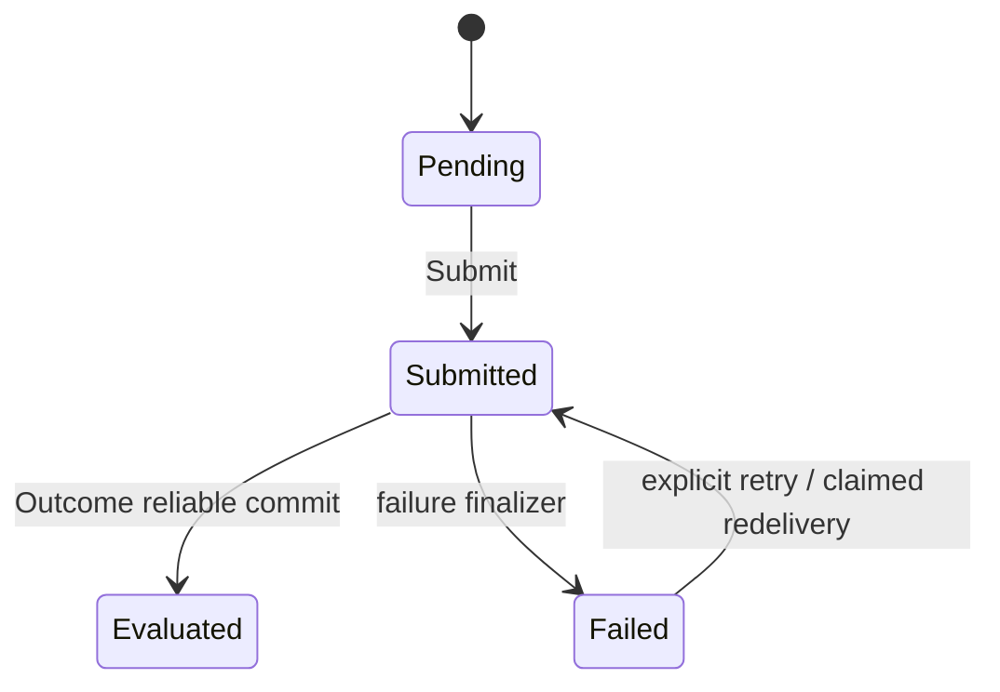
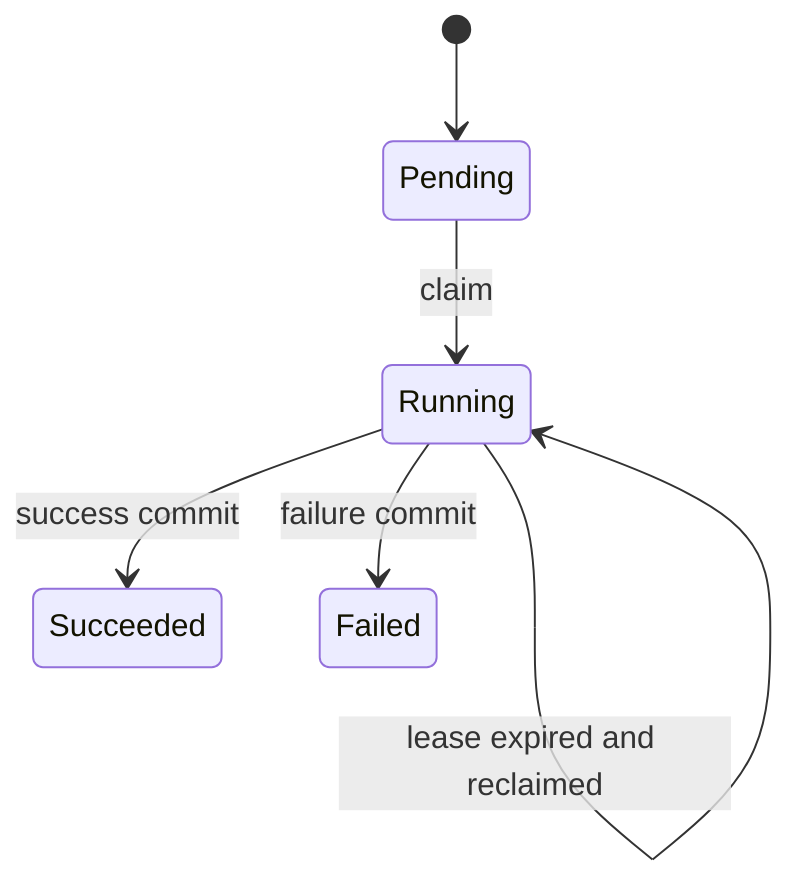
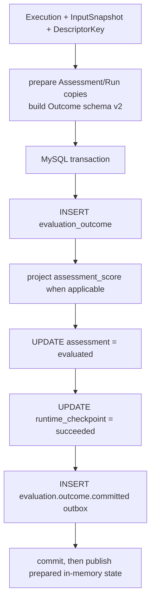

# 核心设计：状态、幂等与可靠提交

## 1. 本文回答

本文说明 Evaluation 如何同时解决四个问题：业务状态与执行尝试不混用，重复消费不并发重算，失败是否可重试有可追溯事实，Outcome、状态和 Outbox 不出现部分提交。

## 2. 30 秒结论

Evaluation 不靠“查一下状态再执行”保证幂等，而是通过多层物理约束：

| 边界 | 保护机制 |
| --- | --- |
| 一份答卷只建一个 Assessment | `assessment.answer_sheet_id` unique index |
| 同一 attempt 只有一个活动执行者 | Run claim token + lease + row lock/CAS |
| 一个 Assessment 只有一份 canonical Outcome | `evaluation_outcome.assessment_id` unique index |
| 一个成功 Run 不会对应多份 Outcome | `evaluation_outcome.evaluation_run_id` unique index |
| Outcome、投影、Assessment、Run、事件同成同败 | 单一 MySQL 可靠提交事务 |

`Assessment` 回答“这次测评成功了吗”，`EvaluationRun` 回答“第几次尝试发生了什么”。不能为了省一张表而把 attempt、lease 和 failure 塞进 Assessment。

## 3. 双状态机

### 3.1 Assessment 业务状态



| 状态 | 语义 | 允许的下一步 |
| --- | --- | --- |
| `pending` | 已创建，尚未请求执行 | 绑定模型的场景可 Submit |
| `submitted` | 已发出执行请求，等待或正在计分 | evaluated / failed |
| `evaluated` | canonical Outcome 已可靠提交 | Evaluation 终态 |
| `failed` | Evaluation 执行已失败 | 仅通过明确重试路径重新 submitted |

Assessment 不保存 running/retrying，因为它们是 Run 的执行状态。Assessment 也不保存 interpreted/completed，因为那是 Assessment + Report 的 Journey 投影。

### 3.2 EvaluationRun 尝试状态



Run ID 按 `<assessmentID>:<attempt>` 构造。当失败可重试时创建下一 attempt，不覆盖旧 Run；当 running Run 只是 lease 过期时，重新 claim 同一 attempt，不伪造新的失败记录。

## 4. Run claim 与 lease

`runtime_checkpoint` Repository 在事务中锁定某 Assessment 的最新 attempt，再根据状态决定：

| 最新 Run | 处理 |
| --- | --- |
| 不存在 | 创建 attempt 1 并 claim |
| `pending` | claim 当前 attempt |
| `running` 且 lease 有效 | 返回 `Claimed=false`，重复 worker 跳过 |
| `running` 且 lease 过期 | 替换 token，重新 claim 同一 attempt |
| `failed` 且 retryable | 创建 attempt + 1 并 claim |
| `failed` 且不可重试 | 不执行 |
| `succeeded` | 不执行 |

默认 lease 为 2 分钟。`SaveClaimed` 更新时同时匹配 scope、resource、attempt、claim token 和 running status；匹配失败返回 `ErrClaimLost`，防止旧 worker 在 lease 被接管后覆盖新 worker 状态。

## 5. 成功的可靠提交边界

Evaluator 返回 Execution 后，`outcome/commit.Committer` 先在隔离副本上准备 `Assessment=evaluated` 和 `Run=succeeded`，再开启 MySQL 事务：



事务中的任意一步失败，都不会把调用方持有的 Assessment/Run 提前变成终态。事务成功后才用副本替换调用方对象，并触发 post-commit dispatcher。

`assessment_score` 投影只在 Execution 能投影为量表因子分时写入；它缺失不能通过伪造空分数补齐。canonical 事实始终是 Outcome。

## 6. 失败的可靠提交边界

输入解析、运行时路由、计算或成功提交失败后，`evaluationFailureFinalizer` 使用另一个 MySQL 事务同时写入：

```text
Assessment = failed + reason + failed_at
EvaluationRun = failed + Failure(kind/message/retryable) + finished_at
outbox = evaluation.failed
```

失败也在隔离副本上准备，事务失败不污染调用方对象。

| 失败阶段 | FailureKind | 当前 Retryable |
| --- | --- | --- |
| 答卷/问卷/模型输入无效 | `validation` | false |
| RuntimeDescriptor 无法解析 | `validation` | false |
| Calculator / OutcomeAssembler 失败 | `calculation` | true |
| Outcome 可靠提交失败 | `internal` | true |

timeout 类型已在领域模型中定义，但当前 `execute.Service` 上述主分支未单独映射 timeout。文档不把可用枚举误写成已有生产分支。

## 7. 重试与消息 settlement

有两条不同的重试路径：

### 7.1 Worker 红交付

retryable 失败后，Worker 回执携带 `Retryable=true`，MQ handler 返回 error 使消息 NACK/重投。红交付后 Engine 先证明最新 Run 可重试，原子 claim 下一 attempt，再用 `ResumeForExecutionRetry` 恢复 Assessment。此路径不再发一个 `evaluation.requested`，因为当前消息就是触发器。

### 7.2 操作者显式重试

Operator Recovery 对组织和受试者可见性授权后，将 failed Assessment 改回 submitted，并在同一事务发出新的 `evaluation.requested`。这是新一次业务触发，不是 MQ 红交付。

不可重试的 `failed` 回执会被 Worker 视为终态并 ACK，防止永久输入错误形成无限重投。

## 8. 一致性审计不是自动修复

Scheduler `AuditOnce` 使用 Assessment ID keyset cursor 扫描 submitted 候选，检测“Outcome 已存在但 Assessment 仍为 submitted”的历史漂移，记录指标和告警。

它故意不自动推进 Assessment：Outcome、Run、score projection 和 outbox 是一个整体证据，仅凭 Outcome 存在无法证明其他事实完整。漂移需要审计后迁移，不能把定时任务变成隐式业务写入器。

## 9. 事实源与验证

| 主题 | 路径 |
| --- | --- |
| Assessment 状态 | [`domain/evaluation/assessment`](../../../internal/apiserver/domain/evaluation/assessment/) |
| Run 状态 | [`domain/evaluation/run`](../../../internal/apiserver/domain/evaluation/run/) |
| Run claim 仓储 | [`infra/mysql/checkpoint`](../../../internal/apiserver/infra/mysql/checkpoint/) |
| 成功提交 | [`application/evaluation/outcome/commit`](../../../internal/apiserver/application/evaluation/outcome/commit/) |
| 失败提交 | [`execute/evaluation_workflows.go`](../../../internal/apiserver/application/evaluation/execute/evaluation_workflows.go) |
| 一致性审计 | [`application/evaluation/scheduler/audit.go`](../../../internal/apiserver/application/evaluation/scheduler/audit.go) |
| 事件 delivery | [`configs/events.yaml`](../../../configs/events.yaml) |

```bash
go test ./internal/apiserver/domain/evaluation/assessment ./internal/apiserver/domain/evaluation/run
go test ./internal/apiserver/application/evaluation/execute ./internal/apiserver/application/evaluation/outcome/commit
go test ./internal/apiserver/infra/mysql/checkpoint ./internal/apiserver/infra/mysql/evaluation
```
