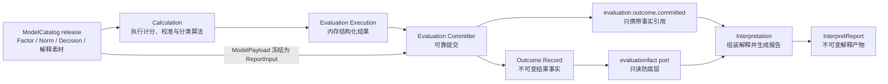
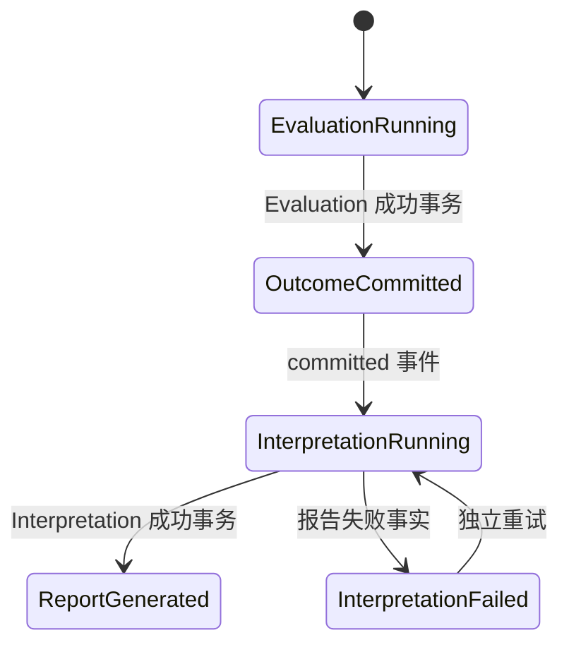

# 核心设计：Outcome 事实与解释边界

> 状态：Outcome schema v2、不可变 Record、只读 `evaluationfact` 端口、冻结 `ReportInput` 和 `evaluation.outcome.committed` 驱动的 Interpretation 主链路已经实现。历史 schema 兼容、报告输入缺少独立版本标识，以及部分展示语义仍混在模型快照中，是当前需要继续治理的边界。

## 1. 本文回答

本文从 Evaluation 的视角说明一次计算结果怎样成为可长期信任的 Outcome 事实，以及 Evaluation 到哪里结束、Interpretation 从哪里开始。重点回答：

1. `Execution`、`Outcome Record`、Assessment 摘要、`assessment_score` 和 Report 分别是什么；
2. 为什么计算函数已经返回成功，仍不能直接生成报告或把临时对象当成业务事实；
3. Outcome 为什么必须保存模型身份、运行时身份、输入引用和版本化 payload；
4. schema v2 为什么只保存计分与分类事实，不保存可展示的长文案；
5. `ReportInput` 冻结了什么，为什么不能在生成历史报告时重新读取最新模型；
6. ModelCatalog 的 Decision、Calculation 的算法、Evaluation 的 Outcome 和 Interpretation 的 Report 如何分工；
7. Interpretation 为什么只能通过只读 `evaluationfact` 端口消费 Outcome；
8. `evaluation.outcome.committed` 为什么只传递事实引用，而不把完整结果塞进事件；
9. 报告生成失败为什么不能回滚或否定已经成功的 Evaluation；
10. 查询详情、患者趋势和报告生成分别应该读取哪个事实源。

本文不重复展开双状态机、Claim、Lease 和成功事务，见 [状态、幂等与可靠提交](./21-核心设计-状态、幂等与可靠提交.md)；Decision 的领域含义和发布规则，见 ModelCatalog 的 [结果判定、Outcome 与解释边界](../20-model-catalog/25-核心设计-结果判定、Outcome与解释边界.md)。

---

## 2. 30 秒结论

一次测评从计算到报告，不是“算出一个分数后顺手拼一段文案”，而是经过三个不同性质的结果层次：

```text
Calculation / Decision execution
  -> Execution：本次调用的内存计算结果

Evaluation reliable commit
  -> Outcome Record：不可变、版本化、可追溯的测评结果事实

Interpretation
  -> InterpretReport：面向医生和受测者的解释产物
```

最重要的边界是：

> ModelCatalog 定义 Decision；Calculation 提供执行算法；Evaluation 固化 Decision 实际产生的结构化 Outcome；Interpretation 只能解释已经成立的 Outcome，不能重新判定、覆盖或修正它。

各类数据的权威性不同：

| 对象 | 性质 | 是否是 canonical Outcome |
| --- | --- | --- |
| `Execution` | Evaluator 返回的内存结果 | 否，事务尚未提交 |
| `evaluation_outcome` Record | 一次成功 Evaluation 的不可变结果事实 | **是** |
| Assessment 结果摘要 | 列表、状态和兼容查询投影 | 否，信息不完整 |
| `assessment_score` | 量表因子分与患者趋势投影 | 否，只覆盖特定查询形态 |
| `ReportInput` | 当次报告所需模型素材的冻结输入 | 否，它不是计算结果 |
| `InterpretReport` | 对 Outcome 的一次面向用户解释 | 否，它不能反向改变 Outcome |

因此：

- `Assessment=evaluated` 表示 Outcome 已可靠提交，不表示报告已经生成；
- 报告失败属于 Interpretation 失败，不应把 Assessment 改回 failed；
- 报告重试必须继续读取同一 Outcome，而不是重新执行 Evaluation；
- 趋势查询可以读取 `assessment_score`，但不能用投影反向伪造完整 Outcome；
- Outcome 中的风险等级、类型和能力层级是模型规则的结构化结果，不是医学诊断。

---

## 3. 五种结果对象为什么必须分开

### 3.1 Execution：计算期结果

`outcome.Execution` 是统一 Evaluator 返回的内存对象，可以表达：

- 模型引用 `ModelRef`；
- 主结果 `Primary`；
- 等级 `Level`；
- 人格或能力画像 `Profile`；
- 因子、极点、特质、指标、能力等 `Dimensions`；
- 效度判断 `Validity`；
- 机制特有的 `Detail`；
- 为调用期展示准备的 `Summary`。

它解决的是“不同计算机制怎样返回一个统一结果”，并不代表结果已经被系统受理。计算返回之后仍可能发生：

- payload 序列化失败；
- Outcome 持久化失败；
- Assessment 或 EvaluationRun 状态更新失败；
- `assessment_score` 投影失败；
- Outbox 写入失败；
- Worker 已失去 Run 的 claim token。

所以：

> Execution 是可靠提交的输入，不是可靠提交的证明。

Preview 可以产生 transient Execution，但 Preview 不创建 Outcome、不迁移 Assessment 状态，也不触发 Interpretation。

### 3.2 Outcome Record：提交后的不可变事实

只有 `Committer` 在同一个 MySQL 事务中完成以下操作后，Execution 才被提升为 Outcome Record：

1. 保存 `evaluation_outcome`；
2. 写入适用的 score projection；
3. 把 Assessment 更新为 evaluated；
4. 把当前 EvaluationRun 更新为 succeeded；
5. 写入 `evaluation.outcome.committed` Outbox。

Outcome Record 因而表达：

> 对指定 Assessment、指定模型版本和指定执行尝试，系统已经可靠承诺这就是本次测评的正式结构化结果。

Repository 只提供 `Save`、`FindByID` 和 `FindByAssessmentID`，不提供 Update/Delete；数据库同时以 Assessment ID 和 EvaluationRun ID 建立唯一约束。这让“不可变”既是领域接口约束，也是数据库的最终防线。

### 3.3 Assessment 摘要：业务状态与列表投影

Assessment 保存生命周期、输入引用、模型引用，以及主分、等级等有限摘要。它适合回答：

- 测评是否已经提交、完成或失败；
- 列表上应该显示哪个主分或等级；
- 这次测评对应哪个受测者、答卷和模型版本。

它不保存完整 Dimensions、NormReference、Validity 或模型特有 Detail，所以不能作为完整评分事实源，也不能据此重建报告。

### 3.4 assessment_score：趋势查询投影

`assessment_score` 把适合因子趋势查询的内容展开成行，服务：

- 某次量表测评的各因子得分；
- 同一患者、同一 factor code 的多次变化趋势；
- 面向查询的排序、分页和索引优化。

它不是通用 Outcome 模型：

- 类型人格需要 profile、极点偏好和匹配度；
- 连续特质人格可能是一组向量；
- 行为评定可能需要常模派生分和常模引用；
- 认知测验可能需要任务表现和能力维度；
- 效度事实和机制特有 Detail 也不完整存在于该表。

新投影通过 `evaluation_outcome_id` 指向来源 Outcome。正确的依赖方向是：

```text
Outcome -> assessment_score projection
```

而不是：

```text
assessment_score -> reconstruct Outcome
```

### 3.5 InterpretReport：面向人的解释产物

Report 负责把结构化事实转成医生、患者或家长能理解的内容，例如：

- 结果标题与概要；
- 因子解释；
- 人格类型描述；
- 风险提示和建议；
- 报告章节、模板和展示结构。

同一个 Outcome 理论上可以形成不同产品渠道、模板或受众视角的报告，但它们都必须忠于同一结构化事实。报告是 Interpretation 的聚合和生命周期，不是 Evaluation Outcome 的一个可变字段。

---

## 4. Outcome Record 保存什么

Outcome Record 不只是一个 `payload_json`。它把“结果是什么”和“结果怎样产生”所需的关键身份一起固化。

| 字段组 | 主要字段 | 解决的问题 |
| --- | --- | --- |
| 事实身份 | Outcome ID | 下游事件、报告和排障引用哪一份事实 |
| 业务归属 | org ID、assessment ID、testee ID | 事实属于哪个组织、测评和受测者 |
| 执行归属 | EvaluationRun ID | 哪一次受控执行提交了结果 |
| 模型身份 | kind、subKind、algorithm、code、version、title | 当时执行的是哪个已发布模型 |
| 运行时身份 | AlgorithmFamily、DecisionKind | 当时由哪类计算和判定机制处理 |
| 输入审计 | InputSnapshotRef | 关联本次执行组装出的输入快照引用 |
| 结果事实 | Payload、SchemaVersion | 用哪个 schema 解码正式结果 |
| 解释输入 | ReportInput | 报告所需模型素材的冻结 JSON |
| 时间 | EvaluatedAt | 事实何时正式成立 |

这里有三个容易混淆的版本：

| 版本 | 表达什么 | 示例 |
| --- | --- | --- |
| Model version | 运营发布的 AssessmentModel 快照版本 | `v12` |
| Outcome schema version | `payload_json` 的技术结构版本 | `2` |
| Report template version | Interpretation 选择的模板契约版本 | 当前默认 `v1` |

三者不能互相替代。模型版本变化代表业务配置变化；Outcome schema 变化代表持久化事实结构变化；模板版本变化代表解释呈现契约变化。

---

## 5. schema v2：只持久化结果事实

### 5.1 为什么不能把完整 Execution 原样保存

Execution 中既有稳定事实，也可能带有显示标签和计算期临时结构。如果全部原样保存，会产生三个问题：

1. Evaluation 开始拥有大量报告文案，领域边界重新混合；
2. 同一个 code 既可能被当成稳定业务身份，也可能被中文 label 替代；
3. 报告生成容易直接复用 payload 中的旧展示字段，绕过冻结的解释资产。

因此新写入统一使用 `SchemaVersion=2`，`MarshalRecordV2` 会复制 Execution，再删除不应进入 canonical fact 的展示内容。它不会修改 Evaluator 返回的原对象。

### 5.2 v2 保留的事实

v2 主要保留：

- 精确 `ModelRef`，但 payload 内不重复保留模型标题；
- 主分的 kind、value、max；
- Level 的 code 与 severity；
- Profile 的 kind、code 和必要 traits；
- Dimension 的 code、kind、role、层级与排序；
- 原始分、T 分、百分位、标准分等 ScoreValue；
- 实际使用的 NormReference；
- 人格极点 preference、strength 等分类事实；
- Validity 的 code 与 passed；
- typology 的 TypeCode、Pattern、MatchPercent、Similarity 和特殊触发事实。

### 5.3 v2 清除的展示内容

v2 不把下列内容作为正式结果事实保存：

- Summary 和 Tags；
- 模型标题的 payload 副本；
- Score label；
- Level label；
- Profile name；
- Dimension name、左右极点展示名和展示模型名；
- Validity label/message；
- 人格结果的总结、优势、弱项、建议、图片和稀有度文案。

这不是说这些内容不重要，而是说它们应该作为当次解释素材冻结在 `ReportInput` 中，再由 Interpretation 选择和组织。

### 5.4 code 与文案的边界

以医学量表为例：

```text
level.code     = moderate       -> Outcome 事实
level.label    = 中等风险        -> 解释/展示素材
conclusion     = ……             -> 解释素材
suggestion     = ……             -> 解释素材
```

以类型人格为例：

```text
type_code      = INTJ           -> Outcome 事实
match_percent  = 87.5           -> Outcome 事实
type_name      = 建筑师型人格     -> 解释素材
strengths      = [...]          -> 解释素材
suggestions    = [...]          -> 解释素材
```

稳定 code 可以用于查询、统计、趋势和跨版本比较；中文文案可以随新模型 release 改进，但不能反向改变已经提交的 code。

---

## 6. ReportInput：冻结当次解释素材

### 6.1 当前究竟冻结了什么

Evaluation 成功提交时会序列化：

```text
InputSnapshot.ModelPayload
```

并写入 Outcome Record 的 `ReportInput`。它不是完整 `InputSnapshot`，当前不重复保存：

- 完整 AnswerSheet；
- 完整 Questionnaire；
- testee/actor 的完整业务对象；
- EvaluationRun 的状态数据。

`evaluationfact/codec.DecodeReportInput` 根据 Outcome 的 Model kind，把 JSON 恢复为：

- `ScaleModelPayload`；
- `TypologyModelPayload`；
- `BehavioralRatingModelPayload`；
- `CognitiveModelPayload`。

再组装出只含 Model 与 ModelPayload 的解释输入快照。

### 6.2 为什么必须冻结，而不能查询最新模型

假设患者使用 `model=v12` 完成测评，之后运营发布 `v13` 并修改了：

- 风险等级标题；
- 人格类型介绍；
- 因子结论；
- 建议内容；
- 报告 adapter 或 outcome mapping。

如果历史报告生成或重试时读取“当前最新发布版本”，同一 Outcome 可能在不同时间得到不同解释，历史语义就会漂移。

正确关系是：

```text
Outcome facts from model v12
  + frozen report assets from the same execution input
  -> report for model v12
```

不是：

```text
Outcome facts from model v12
  + current model v13
  -> semantically mixed report
```

### 6.3 ReportInput 不是第二份 Outcome

ReportInput 保存“怎样解释”的素材；Payload 保存“本次得到什么结果”的事实。Interpretation 仍必须以 Payload 中的 code、score、profile 和 dimensions 为准，再从 ReportInput 中查找对应标题与文案。

例如类型人格 v2 路径会：

1. 从 Outcome payload 读取 `TypeCode=INTJ`；
2. 从冻结 Typology payload 中查找 code 为 INTJ 的 outcome asset；
3. 使用其中的名称、总结、图片和建议生成解释输入；
4. 如果冻结素材中不存在 INTJ，直接报错，而不是选择另一个类型兜底。

这保证 Interpretation 可以补充文案，但不能改变判定结果。

---

## 7. Decision、Outcome 与 Interpretation 的责任划分

### 7.1 完整责任链



### 7.2 模块职责表

| 模块 | 负责 | 不负责 |
| --- | --- | --- |
| ModelCatalog | 定义并发布 Factor、Norm、Decision、Outcome registry 与当前随 release 冻结的解释素材 | 执行某次测评、保存某次结果 |
| Calculation | 无状态执行题分聚合、因子计分、常模换算和分类算法 | 选择模型版本、持久化结果、生成报告 |
| Evaluation | 选择精确输入与能力，组织执行，可靠保存结构化 Outcome | 编辑解释文案、维护报告生命周期 |
| Interpretation | 读取 Outcome 与冻结素材，选择报告规则并生成报告 | 重算分数、重新跑 Decision、修改 Outcome |

### 7.3 Interpretation 不能做什么

Interpretation 不得因为展示需要而：

- 重新读取答卷计算总分；
- 重新查询当前 Norm 并改变 T 分；
- 根据模板条件改写 OutcomeCode；
- 把缺失文案解释成另一个等级；
- 回写 `evaluation_outcome`；
- 把报告生成失败转换成 Evaluation 失败。

如果 Outcome 本身错误，应通过明确的数据治理或重评流程处理，而不是让报告模块静默“修正”。

### 7.4 医疗语义边界

Outcome 中的 `moderate`、`high` 或某个行为能力等级，是发布模型规则对测量结果的结构化判定。它用于给医生判断、治疗观察和随访提供辅助信息，不等于疾病诊断。

因此 Evaluation 不应写入“已确诊”等临床诊断状态；Interpretation 也不能把风险等级改写成确定性诊断结论。

---

## 8. evaluationfact：跨模块只读防腐层

Interpretation 没有直接依赖 Evaluation 的可写 Repository 或 application service，而是依赖 `port/evaluationfact.Repository`：

```go
type Repository interface {
    FindByID(ctx context.Context, id meta.ID) (*Record, error)
    FindByAssessmentID(ctx context.Context, assessmentID meta.ID) (*Record, error)
}
```

这个端口有三个作用：

1. **只读**：下游没有修改 Outcome 的能力；
2. **复制隔离**：Evaluation-owned Record 被转换为独立的 immutable read contract，JSON 读取也返回副本；
3. **版本解码集中化**：Interpretation 不直接理解数据库 payload，而是通过 codec 解码 schema。

Interpretation automation 的真实入口是：

```text
OutcomeID
  -> evaluationfact.Repository.FindByID
  -> DecodeExecution
  -> DecodeReportInput
  -> InterpretationInput
  -> Interpretation execution and commit
```

它不会根据 Assessment 摘要猜测结果，也不会重新构造 Evaluation application 对象。

这是一个典型的 Published Language + Anti-Corruption Layer：Evaluation 对外发布稳定事实语言，Interpretation 把它转换为自己的领域输入，而不是共享内部聚合。

---

## 9. committed 事件与失败隔离

### 9.1 为什么事件只携带引用

`evaluation.outcome.committed` 事件当前携带：

- org ID；
- assessment ID；
- testee ID；
- outcome ID；
- evaluation run ID；
- committed at。

它不携带完整 Outcome payload 或报告素材。Worker 收到事件后，以 Outcome ID 调用 Interpretation automation，再由 apiserver 读取 canonical Record。

这样设计可以避免：

- 大 payload 在消息系统中重复复制；
- 事件结构与每一种模型结果强耦合；
- Consumer 使用事件中的过时或不完整副本；
- Outcome schema 每次扩展都迫使事件契约同步膨胀。

事件表达的是：

> 一份可读取的 Outcome 已经可靠成立，请下游以它为事实源继续工作。

### 9.2 为什么必须先提交 Outcome，再驱动报告

事件和 Outcome 在同一事务中写入；Worker 只有在 Outbox 对外投递后才会驱动 Interpretation。因此不存在“报告任务已经收到，但 Outcome 还没提交”的正常时间窗口。

即时 post-commit dispatch 只优化延迟；即使即时投递失败，Outbox Relay 仍会继续投递。

### 9.3 Evaluation 成功与 Interpretation 成功是两个终点



OutcomeCommitted 之后：

- Assessment 已经是 evaluated；
- EvaluationRun 已经是 succeeded；
- Outcome 已经不可变；
- Interpretation 可以成功、处理中、失败或重试；
- 任一报告状态都不应反向修改 Evaluation 终态。

这使“计分成功但报告暂时失败”成为可表达、可恢复的正常中间状态，而不是把两套生命周期压进一个字段。

---

## 10. 不同读取场景应该相信谁

| 场景 | 首选事实源 | 原因 |
| --- | --- | --- |
| 判断测评业务状态 | Assessment | 它拥有 Evaluation 业务生命周期 |
| 判断某次执行尝试 | EvaluationRun | 它拥有 attempt、claim、lease、failure 与 retry decision |
| 读取某次完整结构化结果 | Outcome Record + versioned codec | 唯一 canonical 结果 |
| 读取一次量表因子详情 | Outcome 解码；投影只作查询优化 | 避免把不完整投影当成事实 |
| 读取患者因子变化趋势 | `assessment_score` | 为跨 Assessment 查询优化的 read model |
| 生成或重试报告 | Outcome + frozen ReportInput | 保持结果和解释版本一致 |
| 判断报告是否生成 | Interpretation Generation/Run/Report | 报告生命周期不在 Assessment 中 |
| 审计事件是否交付 | domain event Outbox | Outbox 证明交付进度，不备份 Outcome |

### 10.1 一致性异常的判断

| 观察到的组合 | 结论 |
| --- | --- |
| Assessment=evaluated，Outcome 存在 | Evaluation 正常完成 |
| Assessment=evaluated，Outcome 缺失 | 一致性故障，不能返回“空成功” |
| Outcome 存在，Assessment 仍 submitted | 一致性漂移，需要审计修复 |
| Outcome 存在，Report 缺失或失败 | Interpretation 链路问题，不否定 Evaluation |
| `assessment_score` 缺失，Outcome 存在 | 投影缺失或该模型不适用该投影 |
| Report 存在，Outcome 缺失 | 严重事实链断裂，报告不应被视为可信来源 |

---

## 11. 历史 schema 的兼容边界

`evaluationfact/codec` 当前支持：

| SchemaVersion | 读取政策 | 特点 |
| --- | --- | --- |
| `0` | legacy 只读兼容 | 早期未显式标版本的数据 |
| `1` | legacy 只读兼容 | Execution 中仍可能包含展示字段和机制特有旧 detail |
| `2` | 当前生产写入 | 纯事实 payload + 独立冻结 ReportInput |
| 其他 | 拒绝 | 不猜测未知结构 |

兼容读取不是继续写旧格式的理由。新写入只使用 v2；删除 v0/v1 decoder 前，必须先审计生产 Outcome 的 schema 分布并完成必要迁移。

当前有一个明确的历史例外：部分旧量表 Outcome 缺少 `ReportInput`。量表评分查询会记录告警，并可能从当前 catalog 补充 factor name/max score。这是为了历史数据可读而保留的兼容降级，不是新链路可以依赖的正确语义，也不应扩展到新模型类型。

---

## 12. 当前设计限制与后续治理

### 12.1 ReportInput 没有独立 schema identity

Outcome 有 `SchemaVersion`，但当前该字段主要描述 Outcome payload；`ReportInput` 依靠 Model kind 选择 Go 类型，没有独立的 `report_input_schema` 或版本号。

这意味着未来 ModelPayload 发生不兼容演进时，解码兼容逻辑容易与 Outcome schema 混在一起。后续可以评估引入：

```text
report_input_format
report_input_schema_version
```

但在确实出现第二种不兼容 ReportInput 结构前，不必为版本号本身过度设计。

### 12.2 解释资产逻辑归属与物理归属尚未完全一致

当前结论、建议、人格文案、Outcome mapping 和 ReportMap 仍随 ModelCatalog release 冻结。从领域语义看它们面向 Interpretation；从发布一致性看，与模型共同冻结又能避免跨资产版本协调。

当前合理边界是：

> 逻辑上区分 Decision facts 与 Interpretation assets，物理上暂时随同一个模型 release 联合发布，并在 Outcome 中冻结当次 ReportInput。

是否进一步抽出独立 InterpretationDefinition，应由独立审核、独立发布、复用和模板版本管理等真实需求驱动。

### 12.3 assessment_score 仍是量表形状的投影

当前趋势模型主要服务 factor score。随着人格、行为评定和认知测验查询能力增加，不应继续把所有结果硬塞进 `assessment_score`。可选择：

- 为不同查询需求建立专用 read model；
- 从 Outcome payload 异步构建投影；
- 保持 Outcome 为唯一事实源，允许投影删除后重建。

### 12.4 不可变主要由应用接口与唯一约束保护

Repository 不提供 Update/Delete，但数据库管理员或直接 SQL 仍能修改 longtext payload。若未来合规和审计要求提高，可以评估：

- payload hash；
- 变更审计；
- 数据库权限隔离；
- append-only 约束；
- Outcome 与 Report 的定期一致性校验。

### 12.5 模板版本当前仍是默认值

Interpretation adapter 当前使用默认 `TemplateVersionV1`，代码注释也明确等待 ModelCatalog 发布显式 report-template version。未来如需同一模型支持多模板演进，应把模板身份纳入可冻结、可审计的发布契约，而不是依赖运行时默认值。

---

## 13. 设计价值与面试表达

可以把这一设计概括为：

> qs-server 没有把“计算返回值”“数据库结果”“查询表”和“报告”混成一个对象，而是用不可变 Outcome 建立 Evaluation 的事实边界。Evaluation 在一个事务里提交 Outcome、状态、执行终态、查询投影和 Outbox；Interpretation 再通过只读端口消费 Outcome 与冻结解释素材。这样评分和报告可以独立失败、独立重试，同时历史结果不会因为模型文案更新而漂移。

进一步追问时，可以从四个方向展开：

- **DDD 边界**：Decision 定义、算法执行、结果事实和报告解释属于不同职责；
- **可靠性**：Outcome 成立和 committed 事件同事务，避免丢失下游驱动；
- **历史一致性**：模型身份、Outcome schema 和 ReportInput 一起保留当次语义；
- **查询架构**：Outcome 是写侧事实，Assessment 摘要和 `assessment_score` 是可替换的读侧投影。

---

## 14. 事实源与验证

| 主题 | 代码路径 |
| --- | --- |
| Execution / Outcome Record | [`domain/evaluation/outcome`](../../../internal/apiserver/domain/evaluation/outcome/) |
| v2 payload writer | [`application/evaluation/outcome/record_payload.go`](../../../internal/apiserver/application/evaluation/outcome/record_payload.go) |
| 成功事务 | [`application/evaluation/outcome/commit`](../../../internal/apiserver/application/evaluation/outcome/commit/) |
| 只读事实端口与 codec | [`port/evaluationfact`](../../../internal/apiserver/port/evaluationfact/) |
| Interpretation 输入适配 | [`application/interpretation/automation/input`](../../../internal/apiserver/application/interpretation/automation/input/) |
| Interpretation automation | [`application/interpretation/automation`](../../../internal/apiserver/application/interpretation/automation/) |
| committed 事件 | [`domain/evaluation/event`](../../../internal/apiserver/domain/evaluation/event/)、[`pkg/eventing/payload`](../../../internal/pkg/eventing/payload/) |
| Worker 驱动报告 | [`worker/handlers/assessment_evaluated_handler.go`](../../../internal/worker/handlers/assessment_evaluated_handler.go) |
| Outcome MySQL Repository | [`infra/mysql/evaluation/outcome_repository.go`](../../../internal/apiserver/infra/mysql/evaluation/outcome_repository.go) |
| score projection | [`application/evaluation/outcome/scoring`](../../../internal/apiserver/application/evaluation/outcome/scoring/) |

建议验证：

```bash
go test ./internal/apiserver/domain/evaluation/outcome
go test ./internal/apiserver/application/evaluation/outcome/...
go test ./internal/apiserver/port/evaluationfact/...
go test ./internal/apiserver/application/interpretation/automation/...
go test ./internal/apiserver/infra/mysql/evaluation
go test ./internal/worker/handlers
```
