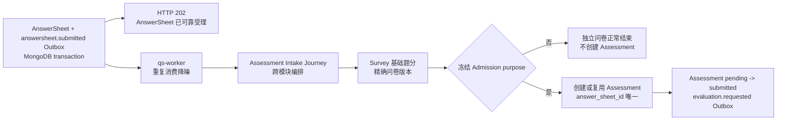
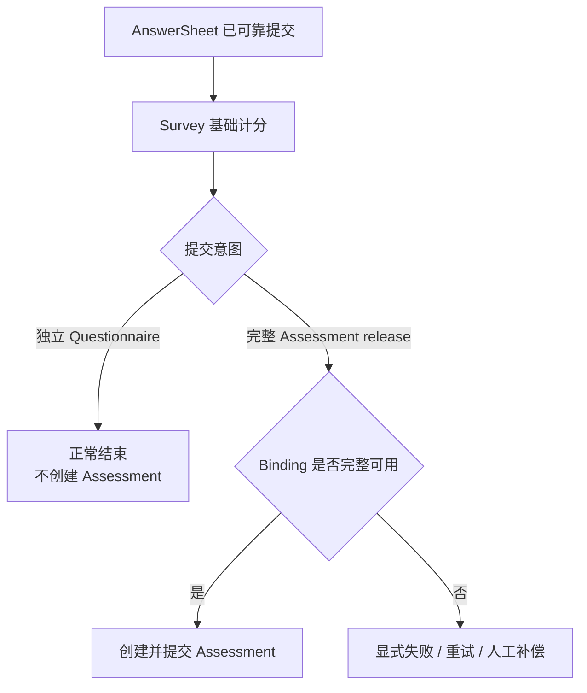
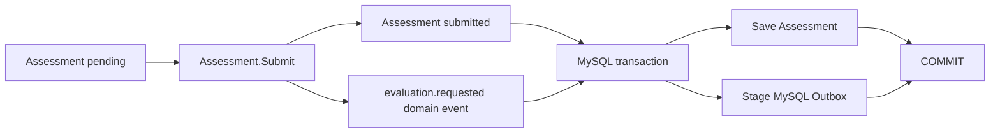
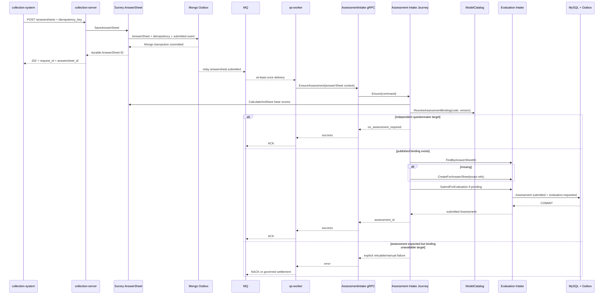

# 关键链路：从 AnswerSheet 到 Assessment

> 状态：AnswerSheet 可靠受理、durable Outbox、Worker 单一入口、基础题分派生、提交时冻结 Admission、Assessment 幂等创建和 `evaluation.requested` 事务提交已经形成主链路。无 Admission 的历史事件仍保留 live binding 兼容入口。

## 1. 本文回答

本文从一份已经可靠提交的 AnswerSheet 出发，说明它怎样在异步事件链中成为一个可执行的 Assessment。重点回答：

1. HTTP 返回 `202 Accepted` 时已经承诺什么，尚未承诺什么；
2. 为什么 collection-server 不同步创建 Assessment；
3. `answersheet.submitted` 怎样从 MongoDB Outbox 到达 qs-worker；
4. Worker 为什么可以重复消费，而不会重复创建 Assessment；
5. Survey 基础题分、ModelCatalog Binding、Plan 来源和 Evaluation Intake 怎样协作；
6. Questionnaire code/version 在什么时候解析为 AssessmentModel 身份；
7. 哪些 AnswerSheet 应进入 Evaluation，哪些应当在 Survey 结束；
8. Assessment 为什么采用“先创建 pending，再提交 submitted”的两阶段动作；
9. `assessment.answer_sheet_id` 唯一约束如何提供最终幂等；
10. `evaluation.requested` 在什么条件下才算可靠形成；
11. 客户端怎样从 AnswerSheet ID 观察 Assessment 是否就绪；
12. 当前实现在哪些地方仍偏离已经确认的业务边界。

Survey 如何校验并可靠保存 AnswerSheet，见 [答卷校验与可靠受理](../10-survey/31-关键链路-答卷校验与可靠受理.md)；Survey 视角的跨模块交接见 [从作答事实到测评执行](../10-survey/32-关键链路-从作答事实到测评执行.md)。本文重点放在 Evaluation 的准入和 Assessment 成立过程。

---

## 2. 30 秒结论



这条链路可以概括为：

> AnswerSheet 表示“这份最终作答已经成立”；Assessment 表示“系统决定使用一个已发布测评模型执行这份作答”。两者通过已发布 Binding 连接，但不是同一个聚合，也不在同一个数据库事务中创建。

最重要的六个结论是：

1. `202` 只表示 AnswerSheet、提交幂等事实和 `answersheet.submitted` Outbox 已经可靠持久化，不表示 Assessment、Outcome 或 Report 已完成。
2. Worker 是正常创建和恢复 Assessment 的唯一入口；collection-server 不在 HTTP 请求中同步调用 `EnsureAssessment`。
3. Redis lease 只用于重复消费降噪；最终幂等依靠 AnswerSheet ID、Journey 可重入逻辑和 MySQL 唯一索引。
4. Survey 先按 AnswerSheet 冻结的 Questionnaire version 派生单题基础分；跨题因子、常模、Decision 和报告不属于这一步。
5. 只有绑定了已发布 AssessmentModel 的 Questionnaire 才应创建 Assessment 并发出 `evaluation.requested`。
6. 冻结 Admission 为独立问卷时 Journey 正常结束且不创建 Assessment；测评型 Admission 使用冻结的精确 release。

---

## 3. 先区分 AnswerSheet 与 Assessment

### 3.1 AnswerSheet 是作答事实

AnswerSheet 回答：

- 使用了哪个 Questionnaire code/version；
- 谁是受试者；
- 谁是填写人；
- 在哪个组织和可选 Task 下提交；
- 每道题最终提交了什么答案；
- 何时完成最终提交。

AnswerSheet 一经提交就没有服务端草稿状态，也不允许修改原始答案。基础题分可以稍后派生，但不能改变原始作答事实。

### 3.2 Assessment 是测评执行实例

Assessment 回答：

- 哪个受试者的哪一份 AnswerSheet 要进入测评；
- 使用哪个 Questionnaire 精确版本；
- 使用哪个 AssessmentModel kind/subKind/algorithm/code/version；
- 来源是一次性 `adhoc` 还是某个 Plan；
- 当前处于 pending、submitted、evaluated 还是 failed；
- 最终 Outcome 摘要是什么。

因此并不是每一份 AnswerSheet 都天然等于 Assessment：

```text
独立 Questionnaire
  -> AnswerSheet
  -> 结束

Questionnaire + published AssessmentModel Binding
  -> AnswerSheet
  -> Assessment
  -> Evaluation
```

### 3.3 为什么不能把两者合成一个聚合

如果 AnswerSheet 与 Assessment 合并：

- 独立信息收集问卷会被迫携带测评状态；
- Survey 必须知道 ModelCatalog、Plan 和 Evaluation 规则；
- 一个 MongoDB 作答事务需要跨到 MySQL 执行状态；
- 题型扩展与测评模型扩展重新发生双向耦合；
- “答卷已保存”和“测评已建立”无法独立失败和恢复。

当前拆分让 Survey 对作答事实负责，Evaluation 对测评执行事实负责，Journey 只负责跨模块协调。

---

## 4. 三组身份不能混用

这条链路同时出现 request ID、idempotency key、AnswerSheet ID、event ID 和 Assessment ID。它们保护的语义不同。

| 身份 | 产生位置 | 作用 | 能否作为业务幂等键 |
| --- | --- | --- | --- |
| `request_id` | HTTP / middleware | 追踪一次网络请求与日志链 | 否，同一业务重试会产生新请求 |
| `idempotency_key` | 客户端业务提交 | 识别填写人发起的同一次提交意图 | 是，用于 AnswerSheet 受理 |
| `answersheet_id` | Survey | 标识一份已经成立的最终作答事实 | 是，用于 Assessment intake |
| `event_id` | Domain Event | 标识一次事件事实和投递 | 否，事件可能重建或重放 |
| `assessment_id` | Evaluation | 标识一次测评业务实例 | 是，用于后续执行、Outcome 和报告 |

正确的幂等链是：

```text
(writer_id, idempotency_key)
  -> one effective AnswerSheet

AnswerSheetID
  -> at most one Assessment
```

不能使用 request ID 代替业务幂等键，也不能使用 MQ message ID 判断一份 AnswerSheet 是否已经创建 Assessment。

---

## 5. 起点：202 之前已经可靠成立什么

### 5.1 collection-server 的受理边界

collection-server 的 `AcceptDurably` 在进入持久化前完成：

- idempotency key 格式校验；
- 精确 Questionnaire version 和 published 状态校验；
- 答案值、选项、显示控制和提交规格校验；
- writer 身份校验；
- writer 对 testee 的 ProfileLink 权限校验；
- REST DTO 到 internal gRPC DTO 的转换。

随后调用 apiserver `SaveAnswerSheet`。collection-server 只有拿到可靠保存后的 AnswerSheet ID，才返回：

```json
{
  "status": "accepted",
  "request_id": "...",
  "answersheet_id": "..."
}
```

### 5.2 MongoDB 本地事务

当前可靠提交事务共同写入：

1. AnswerSheet document；
2. 提交幂等记录；
3. `answersheet.submitted` Outbox record。

任一步失败都回滚事务，不返回 `202`。若 Mongo commit 结果因超时而未知，应用会在短暂、脱离原取消上下文的只读窗口中按幂等键查询 completed 结果；只有确实读到持久化 AnswerSheet，才允许把请求视为成功。

当前幂等元数据仍物理存放在独立的 `answersheet_submit_idempotency` 集合。这一实现细节属于 Survey 数据模型，Evaluation 只依赖“一个幂等意图最终解析为一个 AnswerSheet ID”的契约。

### 5.3 202 没有承诺什么

`202 Accepted` 不表示：

- 单题基础分已经写回；
- 已经找到 AssessmentModel Binding；
- Assessment 已经创建；
- `evaluation.requested` 已经产生；
- Evaluation 已经计分；
- Outcome 或 Report 已经生成。

这里选择异步边界，是为了让 AnswerSheet 可靠受理不依赖 ModelCatalog、Plan、MySQL Evaluation 和 Interpretation 的即时可用性。

---

## 6. 第一跳：answersheet.submitted 进入 Worker

### 6.1 事件契约

`configs/events.yaml` 将 `answersheet.submitted` 定义为：

| 属性 | 当前值 | 语义 |
| --- | --- | --- |
| domain | `survey/answersheet` | 事件由 Survey 拥有 |
| aggregate | `AnswerSheet` | 描述一份作答事实已经提交 |
| topic | `assessment-lifecycle` | 进入测评生命周期异步通道 |
| delivery | `durable_outbox` | 不允许只依赖进程内发布 |
| handler | `answersheet_submitted_handler` | qs-worker 正常消费入口 |
| priority | P0 | 属于核心业务链路 |
| settlement | handler error NACK | 未完成业务交接时不得误 ACK |

事件携带：

- AnswerSheet ID；
- Questionnaire code/version；
- testee、filler 和 org；
- 可选 TaskID；
- request ID；
- submitted at。

它只携带路由和关联上下文，不携带完整 Answers，也不携带 AssessmentModel 身份。后续仍需要回源持久化事实和 ModelCatalog。

### 6.2 Outbox 与 MQ 各自解决什么

Outbox 解决：

> AnswerSheet 已提交后，即使进程崩溃或 MQ 暂时不可用，后续处理意图也不会永久丢失。

MQ 和 Worker 提供：

- 跨进程交接；
- 流量缓冲；
- 失败重投；
- 消费并发；
- ACK/NACK settlement。

它们都不承诺消息物理上只出现一次，因此 Assessment 创建必须支持 at-least-once。

---

## 7. Worker 只拥有消费控制

### 7.1 Handler 的真实职责

`handleAnswerSheetSubmitted` 只做：

1. 解析事件 envelope；
2. 校验 AnswerSheet ID；
3. 把 request ID 传入 internal gRPC metadata；
4. 通过 AnswerSheet ID 级 duplicate suppression gate 执行；
5. 调用 `EnsureAssessment`；
6. 根据返回值决定 handler 成功或错误。

Worker 不应：

- 读取 Questionnaire 计算题分；
- 解析模型定义；
- 判断 Plan 业务规则；
- 直接构造 Assessment 聚合；
- 写 MySQL；
- 把某种量表算法硬编码进 handler。

### 7.2 Redis lease 只是降噪

| gate 结果 | Worker 行为 | 正确性依据 |
| --- | --- | --- |
| 获取 lease | 调用 Ensure，结束后释放 | 正常路径 |
| 未获取 lease | 认为已有消费者处理中，本条重复消息跳过 | 原消费者或后续重投继续收敛 |
| Redis 不可用 | degraded-open，照常调用 Ensure | Journey + MySQL unique index |
| acquire 报错 | degraded-open，照常调用 Ensure | 正确性不能依赖缓存 |

如果 Redis 是唯一锁，那么 Redis 故障时 degraded-open 会产生重复 Assessment。当前之所以可以放行，是因为后面还有 AnswerSheet ID 级数据库唯一约束。

### 7.3 ACK/NACK

- `EnsureAssessment` 成功：handler 返回 nil，消息 ACK；
- Journey 返回错误：handler 返回错误，消息 NACK；
- 事件格式无效：进入无效消息 settlement，不进入 Journey；
- 进程在 ACK 前崩溃：消息可能重投，Journey 必须可重入。

可靠性来自“持久事件 + 可重放动作 + 数据库约束”，不是 Worker 内部无限重试。

---

## 8. internal gRPC 与 Assessment Intake Journey

### 8.1 gRPC 是进程边界，不是业务边界

Worker 调用 `AssessmentIntakeService.EnsureAssessment`，传入：

- AnswerSheet ID；
- Questionnaire code/version；
- testee、filler、org；
- 可选 TaskID；
- origin 提示。

gRPC service 负责 transport 校验、org 上下文、日志和返回 DTO。真正的业务编排在：

```text
application/journey/assessmentintake.Service.Ensure
```

### 8.2 为什么需要 Journey

这条流程横跨五个模块：

| 模块 | 提供的能力 |
| --- | --- |
| Survey | 按 AnswerSheet 的精确问卷版本派生基础题分 |
| ModelCatalog | 解析 Questionnaire → published AssessmentModel Binding |
| Plan | 识别 Task/Plan 来源并完成 Task |
| Evaluation | 查询、创建和提交 Assessment |
| report-status | 写入面向客户端的 queued 投影 |

没有任何一个领域模块应该拥有完整跨模块规则。Journey 是 Application Service / Process Manager：它组织调用顺序和恢复点，但不把五个模块合成一个大聚合。

### 8.3 当前调用顺序

```text
1. Validate command
2. Survey.CalculateAndSave(answerSheetID)
3. ResolveAssessmentBinding(questionnaire code, version)
4. Resolve Plan context
5. FindByAnswerSheetID
6. CreateForAnswerSheet if missing
7. SubmitForEvaluation if bound and pending
8. Complete Plan Task best-effort
9. Set report-status queued projection for newly created Assessment
```

这一顺序中的每一步都有独立失败语义，不能用一个布尔值“处理成功”掩盖中间状态。

---

## 9. Survey 先派生基础题分

### 9.1 为什么发生在 Binding 之前

Journey 首先调用 `CalculateAndSave(answerSheetID)`。因为基础题分由 Question、Option 和 AnswerValue 决定，不依赖 AssessmentModel：

```text
Question + submitted AnswerValue
  -> single-question base score
```

即使 Questionnaire 被独立用作信息收集器，题目自身定义的基础分仍可以派生。

### 9.2 它不负责什么

Survey 基础计分不负责：

- 跨题聚合；
- Factor score；
- Norm 转换；
- Decision；
- Outcome；
- Interpretation Report。

这些属于 Calculation、Evaluation 和 Interpretation。

### 9.3 精确版本与重放

计分服务从 AnswerSheet 读取冻结的 Questionnaire code/version，再回读精确 published snapshot。因此运营发布新版本不会改变历史作答的基础计分规则。

Worker 每次重放都会再次进入基础计分。当前原始答案不可变、问卷版本精确、计算结果确定，所以重复计算应得到相同结果，并覆盖相同派生字段。

当前 AnswerSheet 没有独立的 `scoring_status`、`scored_at` 或 scoring rule version。这意味着系统不能直接区分“尚未计分的零值”和“真实得分为 0”，属于 Survey 可观测性问题。

---

## 10. Binding 决定是否进入 Evaluation

### 10.1 当前 Binding 键

Journey 使用：

```text
Questionnaire code + Questionnaire version
```

调用 `ResolveAssessmentBinding`。命中后得到：

- model kind；
- subKind；
- algorithm；
- code；
- version；
- title。

legacy kind 会先归一为 canonical kind/subKind/algorithm，再进入 Evaluation `CreateCommand`。

### 10.2 双重校验

Binding Resolver 负责找到候选已发布模型；Evaluation `CreateForAnswerSheet` 在 CreateCommand 携带 ModelRef 时，还必须通过 `EvaluationModelValidator` 验证：

- 模型引用有效；
- 模型与 QuestionnaireRef 匹配；
- 当前模块已装配相应校验能力。

缺失 validator 会返回 ModuleNotConfigured，而不是绕过验证。

### 10.3 提交时冻结 Admission，Worker 按来源选择验证边界

当前 AnswerSheet 的可靠提交事务同时冻结 Questionnaire code/version 与 Admission。Worker 稍后消费时不重新选择新 release：

```text
T1  可靠受理解析 active binding，冻结 purpose + exact release
T2  AnswerSheet + Admission + Outbox commit
T3  HTTP 返回 202
T4  Worker 消费冻结 Admission
T5  frozen assessment -> retained_exact
    legacy no-admission -> active_release
```

两种模式都校验 model identity、version 与 QuestionnaireRef。`retained_exact` 只读取保留的精确版本，允许冻结后 release 已归档；`active_release` 仍拒绝归档版本。选中 reader 未装配或 mode 非法时 fail closed，不跨模式降级。

无 Admission 的历史事件仍通过 live binding 解析当前 active release；该兼容入口不改变新提交必须冻结意图与精确版本的要求。

---

## 11. 业务分流：独立问卷还是完整测评

### 11.1 目标业务语义



独立问卷不应：

- 因缺少模型而提交失败；
- 创建 unbound Assessment；
- 产生 `evaluation.requested`；
- 进入报告等待页；
- 长期显示为 Assessment pending。

### 11.2 当前实现

| 场景 | 当前实现 |
| --- | --- |
| 冻结 `assessment + exact release` | 使用 `retained_exact` 校验，创建/复用并自动提交 Assessment |
| 冻结 `independent_questionnaire` | 基础计分后成功结束，返回 `no_assessment_required` |
| Admission model identity 不完整 | fail closed |
| 历史事件无 Admission | 走 live binding，并使用 `active_release` |

Plan Task 和 queued report-status 只在真正创建 Assessment 后进入后续处理。独立问卷不产生 `evaluation.requested`。

---

## 12. Plan 与 adhoc 在这里汇流

### 12.1 来源解析

Journey 的 Plan 匹配顺序是：

1. 事件携带 TaskID 时，按 TaskID、org、testee、model code 和 questionnaire code 解析；
2. 没有 TaskID但存在 model code 时，尝试匹配已打开的 Task；
3. 匹配成功后将 Assessment origin 改为 `plan`，OriginID 保存 Plan ID；
4. 未匹配时使用 `adhoc`。

由此，门诊二维码、医生临时发起和 Plan 周期任务进入同一 Assessment 模型：

```text
门诊扫码 / 医生临时推送 -> adhoc Assessment
Plan Task                    -> plan Assessment
```

### 12.2 Plan 完成是 best-effort

Assessment 创建或复用后，Journey best-effort 调用 PlanCommand 完成 Task。Plan 更新失败不回滚 Assessment，因为 Plan Task 生命周期不是 Assessment 成立的强一致前提。

但 best-effort 不等于可以忽略失败：它仍需要日志、巡检或补偿。尤其在当前 unbound Assessment 偏差下，还要避免“只创建了不可执行的 pending Assessment，却把 Plan Task 标记完成”。

---

## 13. Assessment 幂等创建

### 13.1 业务幂等键是 AnswerSheet ID

一份最终 AnswerSheet 最多对应一个 Assessment：

```text
AnswerSheet 71001
  -> Assessment 92001
```

重复 `answersheet.submitted`、Worker 重启、gRPC 超时或人工重放，都必须解析到同一个 Assessment。

### 13.2 三层保护

| 层次 | 机制 | 作用 |
| --- | --- | --- |
| Worker | AnswerSheet ID Redis lease | 降低并发重复工作 |
| Journey | Find → Create → duplicate then read | 应用动作可重入 |
| MySQL | `uk_answer_sheet_id` | 最终拒绝第二份 Assessment |

Journey 的正常流程：

1. `FindByAnswerSheetID`；
2. 已存在则复用；
3. 不存在则 `CreateForAnswerSheet`；
4. 并发创建命中 `ErrAssessmentDuplicate`；
5. 再按 AnswerSheet ID 读取胜出记录。

数据库唯一索引不能由 Redis 锁替代。Redis 可能过期、故障或被绕过；MySQL 才是业务结果唯一性的最终事实。

### 13.3 当前查询错误分类不足

当前 Journey 只有在 `findErr == nil && existing != nil` 时认为 Assessment 已存在；其它错误会继续进入 Create。也就是说，它没有显式区分：

```text
AssessmentNotFound
```

与：

```text
database unavailable / timeout / corrupted result
```

虽然后续 Create 通常也会失败或由唯一索引兜底，但正确的应用语义应是：只有明确 NotFound 才进入 Create，其它查询错误直接返回，让 Worker 重投。

---

## 14. 创建 pending 与提交 submitted

### 14.1 为什么分成两个动作

Evaluation Intake 暴露：

```text
CreateForAnswerSheet
SubmitForEvaluation
FindByAnswerSheetID
```

`CreateForAnswerSheet` 建立 pending Assessment，但不产生 `evaluation.requested`；`SubmitForEvaluation` 才把它变成可执行状态。

这个拆分形成了可恢复中间点：

```text
Assessment 已创建
但 evaluation.requested 尚未可靠形成
```

Worker 重放时找到 bound + pending Assessment，会再次调用 Submit，而不是创建第二个 Assessment。

### 14.2 创建时冻结什么

一个正常进入 Evaluation 的 Assessment 固化：

- org ID；
- testee ID；
- Questionnaire code/version；
- AnswerSheet ID；
- Model kind/subKind/algorithm/code/version/title；
- origin type/origin ID；
- 初始 pending 状态。

如果 CreateCommand 包含 ModelRef，EvaluationModelValidator 必须确认模型与问卷引用可用。

### 14.3 提交事务

`SubmitForEvaluation` 执行：



只有 submitted 状态和 `evaluation.requested` Outbox 一起提交成功，系统才能认为 Assessment 已进入 Evaluation 执行链。

post-commit dispatch 和列表缓存失效不属于成立条件。即时发布失败仍由 Outbox Relay 恢复；缓存失效失败也不能回滚 Assessment 事实。

### 14.4 重放如何恢复提交失败

如果 Assessment 创建成功而 Submit 失败：

- Journey 返回错误；
- Worker NACK 当前消息；
- Assessment 保持 pending；
- 下一次重放按 AnswerSheet ID 找到它；
- 仅在 bound + pending 时重新 Submit。

如果 Submit 已经事务成功，但 ACK 丢失：

- Assessment 已经 submitted；
- `evaluation.requested` Outbox 已存在；
- 重放看到非 pending，不再次 Submit；
- 后续 Evaluation 由已有 Outbox 驱动。

---

## 15. 端到端顺序图



图中独立问卷与测评型 Admission 已按冻结 purpose 分流；无 Admission 的历史事件仍由 legacy live binding 兼容处理。

---

## 16. 客户端怎样观察 Assessment 就绪

HTTP `202` 只返回 AnswerSheet ID。已知本次提交属于完整测评时，客户端调用：

```text
GET /api/v1/answersheets/{answersheet_id}/assessment-readiness?testee_id=...
```

collection-server 会：

1. 读取 AnswerSheet；
2. 校验 AnswerSheet 的 testee 归属；
3. 重新校验 writer 对 testee 的 ProfileLink；
4. 按 AnswerSheet ID 查询 Assessment；
5. 未找到时结合冻结 Admission：独立问卷返回 `no_assessment_required`，应有 Assessment 的请求返回 `pending + next_poll_after_ms=2000`；
6. Assessment 为 `pending` 时返回 `pending`，为 `submitted|evaluated` 时返回 `ready + assessment_id`，为 `failed` 时返回 `failed + failure_reason`。

四种 phase 的客户端行为是：

- `pending`：继续按服务端建议间隔轮询；
- `ready`：停止 readiness，使用真实 `assessment_id` 进入 report-status/WS；
- `no_assessment_required`：停止轮询，回到 AnswerSheet 详情；
- `failed`：停止自动轮询并展示明确原因，允许用户主动重新查询。

`ready` 表示 Assessment 已进入可等待报告的状态，不表示 Outcome 或 Report 已完成。独立问卷正常流程不应进入报告等待页；若兼容路径已经查询 readiness，也必须将 `no_assessment_required` 作为正常终态。

---

## 17. 失败与重放矩阵

| 失败位置 | 已成立事实 | 当前处理 | 预期收敛 |
| --- | --- | --- | --- |
| Mongo transaction 失败 | 无新的 AnswerSheet | 不返回 202，同 idempotency key 重试 | 重新可靠提交 |
| Mongo commit 结果未知 | 可能已提交 | detached read-only recovery | 查到 completed 才返回成功 |
| Outbox 尚未发布 | AnswerSheet + Outbox | Relay 后续重试 | Worker 最终收到事件 |
| MQ 重复投递 | AnswerSheet | lease 降噪，Journey 可重入 | 一个 Assessment |
| Redis 不可用 | AnswerSheet | degraded-open | MySQL unique index 保证唯一 |
| 基础计分失败 | AnswerSheet | handler error，NACK | 重放后重新计分 |
| Binding 查询返回错误 | AnswerSheet，基础分可能已写 | handler error，NACK | 再次解析 Binding |
| Binding 明确缺失 | AnswerSheet | 当前创建 unbound pending 并 ACK | 目标按提交意图分流 |
| Assessment 查询暂时失败 | AnswerSheet | 当前可能继续 Create | 目标直接失败并重投 |
| 并发 Create duplicate | 一个胜出 Assessment | duplicate then read | 复用胜出记录 |
| Assessment 已创建，Submit 失败 | pending Assessment | handler error，NACK | 重放后再次 Submit |
| Submit 成功，Worker ACK 丢失 | submitted + MySQL Outbox | 消息重投 | 非 pending，不重复 Submit |
| Plan Complete 失败 | Assessment 已存在 | best-effort | Plan 独立补偿 |
| report-status 写失败 | Assessment 已存在 | 不回滚 | 查询事实或重建投影 |

核心恢复原则是：

> 已提交事实不回滚；未完成动作可以重放；重复动作最终收敛到唯一业务结果。

---

## 18. 设计取舍

### 18.1 为什么不在 HTTP 请求里创建 Assessment

同步创建会让 `202` 依赖：

- MongoDB AnswerSheet；
- ModelCatalog Binding；
- Survey 基础计分；
- Plan 查询；
- MySQL Assessment；
- Evaluation Outbox。

这会拉长提交延迟、扩大故障面，并让峰值流量直接穿透到后续模块。当前设计把 HTTP 成功边界收敛为最小可靠事实，再由持久事件异步推进。

### 18.2 为什么不把完整 AnswerSheet 塞入事件

完整 Answers 进入事件会：

- 放大消息体；
- 复制敏感作答数据；
- 让事件成为第二份事实副本；
- 使 AnswerSheet schema 演进影响所有消费者。

事件只传递身份和路由上下文，业务模块按 ID 回源自己的事实。

### 18.3 为什么不追求消息 exactly-once

跨 Mongo Outbox、MQ、Worker、gRPC 和 MySQL 实现物理 exactly-once 成本高，也不能消除“服务端提交成功但客户端超时”这类结果未知。

项目选择：

```text
at-least-once delivery
+ durable local transactions
+ deterministic replay
+ business idempotency
+ database uniqueness
= effectively-once Assessment
```

### 18.4 为什么创建与提交不合并

两步动作暴露了一个有意义的恢复点：pending Assessment。只要 pending 具有完整 ModelRef，它就表示“测评实例已建立，但执行请求尚未可靠提交”，Worker 可以安全补提交。

问题不在 pending 本身，而在当前允许没有模型身份的 pending Assessment 长期存在。

---

## 19. 当前设计问题与重构边界

### 19.1 独立问卷仍创建 Assessment

这是最高优先级业务边界偏差。应在 Binding/提交意图分流后、调用 Evaluation Intake 前结束独立问卷链路。

### 19.2 测评提交没有在 202 时冻结 Assessment release

Worker 延迟解析 Binding 会留下发布状态竞态。目标不是把完整 Assessment 创建重新塞回 HTTP，而是在可靠受理事实中冻结足以恢复同一 Assessment release 的精确引用。

### 19.3 `bound=false` 混合三种含义

合法独立问卷、Binding 缺失和 resolver 未装配必须成为不同结果。否则系统无法选择 ACK、NACK、人工补偿或正常结束。

### 19.4 FindByAnswerSheetID 未严格区分 NotFound

只有明确 NotFound 才应该 Create；数据库错误应直接返回。这样既减少无意义写入，也让可观测性与重试原因更准确。

### 19.5 Assessment.Submit 的领域前置条件还不够强

Journey 当前只对 `bound + pending` 调用 Submit，但 Assessment 聚合的 `Submit()` 本身没有强制 `HasEvaluationModel()`。目标领域约束应防止任何调用方提交 unbound Assessment，而不只依赖 Journey 的 if 条件。

### 19.6 readiness 把“存在”当成“就绪”

当前查询只要按 AnswerSheet ID 找到 Assessment 就返回 ready，没有要求 status 至少为 submitted，也没有区分 independent questionnaire。后续应根据客户端真正需要的阶段定义更准确的 readiness contract。

### 19.7 Plan 与 report-status 可能继承错误分流

当前新建 unbound Assessment 后仍可能 best-effort 完成 Plan Task，并写入 queued report-status。修复独立问卷分流时必须一并调整这些下游副作用，不能只停止自动 Submit。

这些问题已按优先级和验收边界进入 [设计问题与重构清单](./90-设计问题与重构清单.md)。

---

## 20. 排查方法

客户端长时间停在 assessment pending 时，按事实因果顺序检查：

1. AnswerSheet 是否存在，questionnaire code/version、testee、org 和 TaskID 是否正确；
2. Mongo Outbox 是否存在对应 `answersheet.submitted`；
3. Relay 是否已经发布；
4. Worker 是否收到事件，lease mode 是 locked、duplicate skip 还是 degraded；
5. internal gRPC `EnsureAssessment` 是否成功；
6. Survey 基础计分是否能读取精确 Questionnaire version；
7. Binding 日志中的 `bound`、model kind/code/version；
8. 按 AnswerSheet ID 查询 Assessment；
9. Assessment 若为 pending，检查是否有 ModelRef 以及自动 Submit 错误；
10. Assessment 若为 submitted，检查 MySQL `evaluation.requested` Outbox；
11. 从此处转入下一篇 Evaluation Worker 执行链排查。

关键关联字段：

| 字段 | 用途 |
| --- | --- |
| request ID | 关联 HTTP、Mongo Outbox、Worker 和 gRPC 日志 |
| event ID | 关联一次事件投递、重投和 settlement |
| idempotency key | 确认同一业务提交是否复用 AnswerSheet |
| AnswerSheet ID | 贯穿 Survey 到 Assessment intake |
| Assessment ID | 进入 Evaluation 后的业务实例标识 |
| Questionnaire code/version | 定位精确作答和 Binding 契约 |
| Model kind/code/version | 定位实际执行模型 |
| org/testee/TaskID | 定位组织、受试者与 Plan 来源 |

---

## 21. 事实源与验证

| 环节 | 代码或契约 |
| --- | --- |
| REST 202 契约 | [`collection-server/transport/rest/handler/answersheet_handler.go`](../../../internal/collection-server/transport/rest/handler/answersheet_handler.go) |
| collection 可靠受理 | [`collection-server/application/answersheet/submission_service.go`](../../../internal/collection-server/application/answersheet/submission_service.go) |
| Survey reliable submit | [`application/survey/answersheet`](../../../internal/apiserver/application/survey/answersheet/) |
| Mongo AnswerSheet 事务写入 | [`infra/mongo/answersheet/durable_submit.go`](../../../internal/apiserver/infra/mongo/answersheet/durable_submit.go) |
| 事件目录 | [`configs/events.yaml`](../../../configs/events.yaml) |
| AnswerSheet Worker | [`worker/handlers/answersheet_handler.go`](../../../internal/worker/handlers/answersheet_handler.go) |
| Assessment Intake gRPC | [`transport/grpc/service/assessment_intake.go`](../../../internal/apiserver/transport/grpc/service/assessment_intake.go) |
| 跨模块 Journey | [`application/journey/assessmentintake/service.go`](../../../internal/apiserver/application/journey/assessmentintake/service.go) |
| Binding Resolver | [`infra/ruleset/binding_resolver.go`](../../../internal/apiserver/infra/ruleset/binding_resolver.go) |
| Evaluation Intake | [`application/evaluation/intake`](../../../internal/apiserver/application/evaluation/intake/) |
| Assessment 聚合 | [`domain/evaluation/assessment`](../../../internal/apiserver/domain/evaluation/assessment/) |
| Assessment MySQL Repository | [`infra/mysql/evaluation`](../../../internal/apiserver/infra/mysql/evaluation/) |
| 消息 settlement | [`worker/integration/messaging/runtime.go`](../../../internal/worker/integration/messaging/runtime.go) |

建议验证：

```bash
go test ./internal/collection-server/application/answersheet
go test ./internal/collection-server/transport/rest/handler
go test ./internal/apiserver/application/survey/answersheet
go test ./internal/apiserver/infra/mongo/answersheet
go test ./internal/worker/handlers
go test ./internal/worker/integration/messaging
go test ./internal/apiserver/application/journey/assessmentintake
go test ./internal/apiserver/application/evaluation/intake
go test ./internal/apiserver/infra/mysql/evaluation
make docs-hygiene
```
