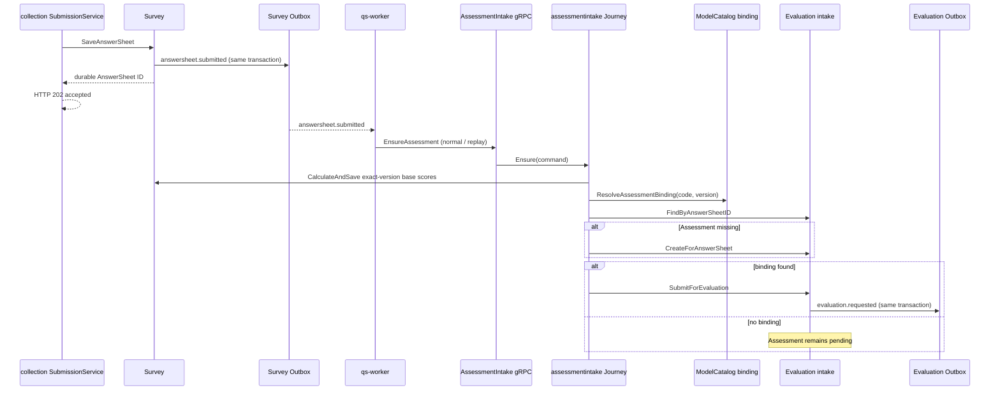

# 关键链路：答卷入站与测评请求

## 1. 本文回答

本文说明一份已可靠持久化的 AnswerSheet 如何由 `answersheet.submitted` Worker 唯一正常入口进入 Evaluation，Journey 如何解析模型 binding 和 Plan，以及 Assessment 在什么条件下发出 `evaluation.requested`。

## 2. 30 秒结论

```text
AnswerSheet durable commit
  + answersheet.submitted Outbox
  -> Outbox Relay -> MQ
  -> EnsureAssessment(answerSheetID)       Worker 事件路径
  -> exact-version base scoring
  -> questionnaire binding / Plan match
  -> find-or-create Assessment by AnswerSheet ID
  -> bound ? Submit : keep pending
  -> assessment + evaluation.requested Outbox
```

Worker 调用 `application/journey/assessmentintake.Service.Ensure`。Redis lease 只对 Worker 重复降噪；最终正确性由 `assessment.answer_sheet_id` 唯一约束和 duplicate-then-read 保证。collection 不再同步调用 `EnsureAssessment`。

## 3. 参与者与边界

| 参与者 | 责任 |
| --- | --- |
| collection `SubmissionService` | 仅在 AnswerSheet、幂等记录和 Outbox 可靠提交后返回 AnswerSheet ID |
| Survey | 保存 AnswerSheet、发出 `answersheet.submitted`、按精确问卷版本保存基础题分 |
| Worker | 消费 `answersheet.submitted`，以事件路径重放 `EnsureAssessment` |
| AssessmentIntake Journey | 跨 Survey、ModelCatalog、Plan 和 Evaluation 编排 |
| Evaluation intake | 创建 Assessment，校验已绑定模型，提交 Assessment 并暂存事件 |
| ModelCatalog binding resolver | 按 questionnaire code + version 解析 published model ref |

Evaluation 不拥有 AnswerSheet 提交事务，Journey 也不是 Evaluation 聚合的一部分。跨模块编排位于 `application/journey`，避免让 Evaluation service 反向控制 Survey 或 Plan。

## 4. 全链路



HTTP `202` 只表示 AnswerSheet 与 Outbox 已可靠持久化，不表示 Assessment 已生成。客户端通过 `assessment-readiness` 区分 pending/ready，Journey 必须在数据库约束下可重入。

## 5. 阶段一：单一正常入口与重放

### 5.1 collection 可靠受理路径

`SubmissionService.AcceptDurably` 完成问卷规格和 ProfileLink 前置校验，调用 Survey `SaveAnswerSheet`，且只在 AnswerSheet、幂等记录和 `answersheet.submitted` Outbox 同事务提交后返回 `202 accepted + answersheet_id`。这条路径不创建 Assessment。

### 5.2 Worker 事件路径

`answersheet_submitted_handler` 尝试获取 AnswerSheet ID 级 Redis lease：

- 抢到 lease：调用 `EnsureAssessment`；
- 未抢到：认为重复处理并跳过；
- Redis 不可用或 acquire 失败：degraded-open，继续调用 Journey。

这个 lease 不是业务唯一锁。降级时仍然安全，因为 Journey 和 MySQL 唯一约束承担最终幂等。

## 6. 阶段二：精确输入与模型 Binding

Journey 的顺序是：

1. 调用 Survey `CalculateAndSave(answerSheetID)` 保存基础题分；
2. 以 questionnaire code + version 解析 Assessment binding；
3. 将 legacy kind 归一为 canonical kind/subKind/algorithm；
4. 如有 TaskID，按任务匹配 Plan；否则对已绑定模型尝试匹配 open task；
5. 组装 Evaluation `CreateCommand`。

创建未绑定模型的 Assessment 是允许的，用于纯问卷场景。一旦 CreateCommand 携带 ModelRef，Evaluation intake 必须配置 `EvaluationModelValidator`，并确认模型与 questionnaire ref 可用；缺失 validator 是模块配置错误，不允许绕过。

## 7. 阶段三：Assessment 幂等创建

Journey 先按 AnswerSheet ID 查找 Assessment：

- 已存在：直接返回既有 ID，并 best-effort 完成 Plan task；
- 不存在：创建 `pending` Assessment；
- 并发创建命中 duplicate key：重新按 AnswerSheet ID 读取胜出者。

Assessment 创建本身不发 `evaluation.requested`。这使“建立业务实例”与“请求执行”可以明确分离。

## 8. 阶段四：提交与 Outbox

找到 binding 且新建 Assessment 时，Journey 调用 `SubmitForEvaluation`：

1. Assessment `pending -> submitted`；
2. 领域对象产生 `evaluation.requested`；
3. MySQL 事务中保存 Assessment 并 Stage `domain_event_outbox`；
4. 提交后清空聚合内事件，执行 post-commit dispatch 与列表缓存失效。

`evaluation.requested` payload 携带 org、assessment、testee、questionnaire、answer sheet 和 model identity，但 Worker 仍以 Assessment ID 回源持久化对象，不把事件 payload 当成完整执行快照。

## 9. 成功和失败语义

| 情况 | 当前结果 | 恢复边界 |
| --- | --- | --- |
| 纯问卷，无 binding | Assessment 已创建且保持 pending | 不发 Evaluation 事件 |
| 有 binding 且提交成功 | Assessment=submitted + Outbox | Worker 继续执行 |
| 自动提交失败 | Journey 当前仍返回已创建 Assessment，`AutoSubmitted=false` | 需状态查询/运维恢复；不得误写成已进入 Worker |
| Plan 完成失败 | 不回滚 Assessment | Plan best-effort 补偿 |
| ReportStatus 写入失败 | 不回滚 Assessment | 它是 Journey 投影，不是 Evaluation 事实 |
| Assessment Intake 暂时失败 | AnswerSheet 仍是已受理，readiness 保持 pending | `answersheet.submitted` Worker 重放 Ensure |

当前 Journey 对自动提交错误采用“保留 Assessment，不上抛”策略，这是必须明确监控的现状，不是一个已提交保证。

## 10. 事实源与验证

| 环节 | 路径 |
| --- | --- |
| collection 可靠受理 | [`collection-server/application/answersheet/submission_service.go`](../../../internal/collection-server/application/answersheet/submission_service.go) |
| answersheet Worker | [`worker/handlers/answersheet_handler.go`](../../../internal/worker/handlers/answersheet_handler.go) |
| Journey | [`application/journey/assessmentintake/service.go`](../../../internal/apiserver/application/journey/assessmentintake/service.go) |
| Evaluation intake | [`application/evaluation/intake`](../../../internal/apiserver/application/evaluation/intake/) |
| Assessment gRPC | [`transport/grpc/service/assessment_intake.go`](../../../internal/apiserver/transport/grpc/service/assessment_intake.go) |
| 唯一约束 | [`infra/mysql/evaluation/po.go`](../../../internal/apiserver/infra/mysql/evaluation/po.go) |

```bash
go test ./internal/collection-server/application/answersheet
go test ./internal/worker/handlers
go test ./internal/apiserver/application/journey/assessmentintake
go test ./internal/apiserver/application/evaluation/intake
go test ./internal/apiserver/infra/mysql/evaluation
```
