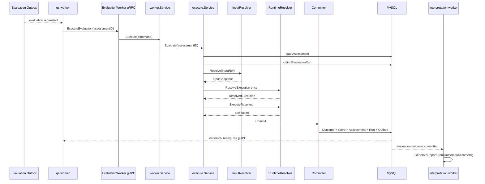

# 关键链路：Worker 执行与报告驱动

## 1. 本文回答

本文跟踪 `evaluation.requested` 从 qs-worker 进入内部 gRPC，通过 `execute.Service` 解析输入、claim Run、选择 RuntimeDescriptor、计算并可靠提交 Outcome，最后由 `evaluation.outcome.committed` 驱动 Interpretation 的完整链路。

## 2. 30 秒结论

```text
evaluation.requested
  -> qs-worker evaluation_requested_handler
  -> EvaluationWorkerService.ExecuteEvaluation
  -> worker.Service.Execute
  -> execute.Engine.Evaluate
       load Assessment
       claim EvaluationRun
       resolve InputSnapshot
       resolve RuntimeDescriptor once
       execute descriptor pipeline
       commit Outcome + projections + states + outbox
  -> reload canonical receipt
  -> ACK or NACK by Run.Retryable

evaluation.outcome.committed
  -> InterpretationAutomation.GenerateReportFromOutcome(outcomeID)
```

生产链路固定为分阶段执行。Evaluation 不内联 ReportBuilder，`Run=succeeded` 和 `Assessment=evaluated` 都不包含报告成功。

## 3. 全链路



## 4. 阶段一：Worker 入口与回执契约

`evaluation_requested_handler` 解析事件并检查 `NeedsEvaluation`。对于无模型的纯问卷事件直接返回；有模型时通过独立 `EvaluationWorkerService` gRPC 调用，不复用受试者查询或后台操作者入口。

gRPC 不直接暴露 Engine，而是调用 `application/evaluation/worker.Service`。该服务在 Engine 返回后重新读取：

- Assessment 最终状态；
- latest EvaluationRun 的 attempt、failure、trace 和 InputSnapshotRef；
- Assessment=evaluated 时对应的 canonical Outcome。

因此 Worker 回执是已持久化事实的重读，不是把 Engine 的内存结果原样返回。Assessment 已 evaluated 但 Outcome 缺失时返回一致性错误，不伪造空 Outcome ID。

## 5. 阶段二：加载 Assessment 与 claim Run

Engine 先根据 Assessment 状态决定是否需要执行：

| Assessment | 处理 |
| --- | --- |
| `evaluated` | 幂等跳过，后续由 Worker Service 读回 canonical receipt |
| `submitted` 且无模型 | questionnaire-only 跳过 |
| `submitted` 且有模型 | 进入 Run claim |
| `failed` | 只有 latest Run 可重试或 running lease 过期时继续 |
| 其他 | invalid status 失败 |

Run claim 成功后才解析输入。如果另一 worker 持有有效 lease，Repository 返回 `Claimed=false`，Engine 跳过重复计算。这个顺序避免多个 Worker 并发加载大型模型快照。

failed Assessment 的红交付会在新 Run claim 成功后调用 `ResumeForExecutionRetry`，确保不是先恢复 Assessment 再争抢执行权。

## 6. 阶段三：精确解析执行输入

Engine 从 Assessment 构造 `InputRef`：

```text
assessment ID
model kind/subKind/algorithm/code/version/title
answer sheet ID
questionnaire code/version
```

`RepositoryResolver` 先用 ExecutionIdentity 选择 Provider，再同时读取：

1. ModelCatalog published-only model snapshot；
2. Survey AnswerSheet；
3. AnswerSheet 记录的精确 Questionnaire code + version。

任一对象不存在、问卷版本不匹配或 identity 没有 Provider，都是 validation 失败。解析成功后，Engine 把 `model:<code>@<version>` 写入 claimed Run 的 InputSnapshotRef；同一 Run 不允许后续切换快照引用。

## 7. 阶段四：只解析一次运行时路由

`RuntimeResolver.ResolveExecution` 从 InputSnapshot 构造 ModelRoute，推导 DescriptorKey 并查找 RuntimeDescriptor，返回 `ResolvedExecution`：

```text
ResolvedExecution
  DescriptorKey
  RuntimeDescriptor
  canonical ExecutionIdentity
```

Engine 后续将同一个 ResolvedExecution 用于日志、计算和 Outcome RuntimeIdentity，不在提交阶段重新猜测家族或 DecisionKind。

Descriptor pipeline 依次执行：

```text
InputAssembler -> Calculator -> OutcomeAssembler -> Execution
```

详细注册和扩展契约见 [20-核心设计-执行身份与运行时扩展.md](./20-核心设计-执行身份与运行时扩展.md)。

## 8. 阶段五：Outcome 可靠提交

Calculation 成功只得到内存 Execution。`Committer` 将以下内容放入同一 MySQL 事务：

1. schema v2 EvaluationOutcome Record；
2. 可投影时的 `assessment_score` 因子分；
3. Assessment 的 evaluated 状态与摘要；
4. EvaluationRun 的 succeeded 终态；
5. `evaluation.outcome.committed` Outbox。

Assessment、Run 和 Outcome 共用同一 `EvaluatedAt`。事务失败后 Engine 不会暴露半成功 Record，而是进入可重试 internal failure 最终化。

具体事务和 schema 见 [21-核心设计-状态幂等与可靠提交.md](./21-核心设计-状态幂等与可靠提交.md) 与 [22-核心设计-评估事实与数据存储.md](./22-核心设计-评估事实与数据存储.md)。

## 9. 阶段六：消息 settlement

Worker 使用持久化回执决定 ACK/NACK：

| 回执 | Handler 行为 | 后续 |
| --- | --- | --- |
| `status=evaluated` | ACK | 等待 outcome committed 事件驱动报告 |
| `status=failed, retryable=true` | 返回 error / NACK | MQ 红交付，新 attempt |
| `status=failed, retryable=false` | ACK | 终态失败，不无限重投 |
| `status=already_evaluated` | ACK | 幂等成功 |
| nil/未知回执 | error / NACK | 防止不确定状态被误 ACK |

gRPC transport 将 application error 映射为 Internal，但 Worker Service 会在 Engine 返回失败后尽量读取已持久化 Run，从而把 Retryable、FailureKind 和 RunID 交给 handler 做 settlement。

## 10. 阶段七：驱动 Interpretation

`evaluation.outcome.committed` payload 携带 Outcome ID 和 EvaluationRun ID。对应 Worker handler：

1. 校验 Assessment ID 和 Outcome ID；
2. 把当前 event ID 写入 `x-event-id` gRPC metadata；
3. 调用 `InterpretationAutomation.GenerateReportFromOutcome(outcomeID)`；
4. 根据 Interpretation 回执的 Retryable 决定 ACK/NACK。

Interpretation 从只读 `evaluationfact.Repository` 获取 Outcome，使用 Record 中的纯事实 payload 和冻结 ReportInput 生成 Report。

报告链路的成功、失败或重试都不会：

- 修改 Assessment 为 failed；
- 覆盖 Outcome；
- 新建 EvaluationRun；
- 重新执行 Calculator。

Evaluation 和 Interpretation 之间通过“不可变 Outcome + 可靠事件”解耦，而不是共享可写 Assessment 聚合。

## 11. 失败排查矩阵

| 现象 | 先查 | 不要首先归因 |
| --- | --- | --- |
| evaluation.requested 积压 | `domain_event_outbox` 与 MQ handler settlement | Calculator 速度 |
| 同一 Assessment 长时间 running | latest `runtime_checkpoint` lease/token | 盲目新建 Assessment |
| model/questionnaire not found | Assessment ModelRef、AnswerSheet 版本、published catalog | 数据库连接一定故障 |
| unsupported descriptor/provider | ExecutionIdentity、ExecutionPath parity、descriptor registry | 加问卷 code switch |
| Assessment=evaluated 但 Worker 返错 | `evaluation_outcome` 是否存在并可解码 | 直接返回 Assessment 摘要 |
| Outcome 已有但报告没有 | outcome committed Outbox + Interpretation Generation/Run | 重新 Evaluation |

## 12. 事实源与验证

| 环节 | 路径 |
| --- | --- |
| evaluation.requested Worker | [`worker/handlers/assessment_handler.go`](../../../internal/worker/handlers/assessment_handler.go) |
| gRPC | [`transport/grpc/service/evaluation_worker.go`](../../../internal/apiserver/transport/grpc/service/evaluation_worker.go) |
| Worker 应用回执 | [`application/evaluation/worker/service.go`](../../../internal/apiserver/application/evaluation/worker/service.go) |
| Engine 编排 | [`application/evaluation/execute/service.go`](../../../internal/apiserver/application/evaluation/execute/service.go) |
| Runtime resolver | [`execute/runtime_resolver.go`](../../../internal/apiserver/application/evaluation/execute/runtime_resolver.go) |
| Outcome committer | [`application/evaluation/outcome/commit`](../../../internal/apiserver/application/evaluation/outcome/commit/) |
| Interpretation 驱动 | [`worker/handlers/assessment_evaluated_handler.go`](../../../internal/worker/handlers/assessment_evaluated_handler.go) |

```bash
go test ./internal/apiserver/application/evaluation/execute
go test ./internal/apiserver/application/evaluation/worker
go test ./internal/apiserver/application/evaluation/outcome/commit
go test ./internal/apiserver/transport/grpc/service
go test ./internal/worker/handlers
```
