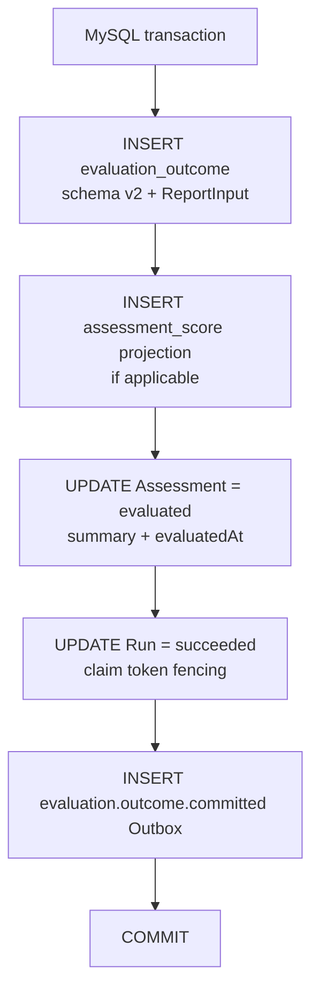
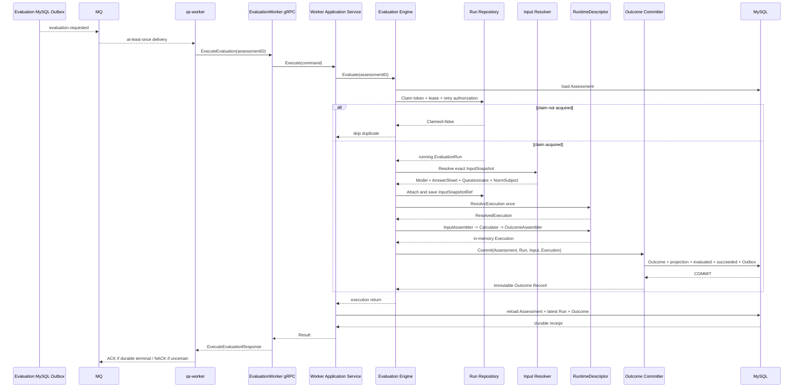

# 关键链路：从执行请求到 Outcome 提交

> 状态：`evaluation.requested` durable Outbox、Worker internal gRPC、EvaluationRun Claim/Lease、精确输入解析、RuntimeDescriptor 统一执行、Outcome 成功事务、失败事务和持久化回执 settlement 已形成完整主链。输入错误分类、Lease 续租和 InputSnapshotRef 审计强度仍有改进空间。

## 1. 本文回答

本文从一个已经可靠提交的 `evaluation.requested` 事件出发，跟踪 qs-worker 与 qs-apiserver 怎样共同形成一份不可变 Outcome。重点回答：

1. `evaluation.requested` 表示什么，它为什么必须来自 Outbox；
2. Worker handler、internal gRPC、Worker Application Service 和 Evaluation Engine 怎样分工；
3. 为什么事件只用于唤醒执行，Assessment 才是执行身份的事实源；
4. 重复消息、并发 Worker 和进程崩溃时，谁拥有一次执行权；
5. EvaluationRun 的 Claim、Lease 和 claim token 分别保护什么；
6. 模型、AnswerSheet、Questionnaire 和 NormSubject 怎样组成精确 InputSnapshot；
7. ExecutionIdentity、ModelRoute、DescriptorKey 和 RuntimeDescriptor 怎样确定唯一执行路径；
8. `InputAssembler -> Calculator -> OutcomeAssembler` 怎样统一四类模型；
9. 内存 Execution 在什么条件下才能升级为不可变 Outcome；
10. Outcome、Assessment、Run、score projection 和 committed event 为什么必须同事务提交；
11. 失败怎样形成 RetryDecision，为什么业务重试不依赖 MQ 盲目重投；
12. Worker 为什么在 Engine 返回后重新读取持久化回执；
13. 哪些结果应该 ACK，哪些不确定状态必须 NACK；
14. `evaluation.outcome.committed` 为什么是本文终点，而不是 Report 生成成功。

运行时扩展模型见 [统一测评执行模型](./20-核心设计-统一测评执行模型.md)，状态机与可靠性约束见 [状态、幂等与可靠提交](./21-核心设计-状态、幂等与可靠提交.md)，Outcome 内容及解释边界见 [Outcome 事实与解释边界](./22-核心设计-Outcome事实与解释边界.md)。

---

## 2. 30 秒结论

```text
evaluation.requested durable event
  -> qs-worker evaluation_requested_handler
  -> EvaluationWorkerService.ExecuteEvaluation(assessment_id)
  -> application/evaluation/worker.Service.Execute
  -> execute.Engine.Evaluate
       load canonical Assessment
       claim one EvaluationRun
       resolve exact InputSnapshot
       resolve one RuntimeDescriptor
       execute descriptor pipeline
       atomically commit Outcome
  -> reload durable Assessment + Run + Outcome receipt
  -> ACK / NACK according to persisted result
```

成功事务是：

```text
EvaluationOutcome schema v2
+ optional assessment_score projection
+ Assessment = evaluated
+ EvaluationRun = succeeded
+ evaluation.outcome.committed Outbox
= one reliable Evaluation success
```

失败事务是：

```text
Assessment = failed
+ EvaluationRun = failed
+ Failure + RetryDecision
+ evaluation.failed Outbox
+ optional scheduled evaluation.retry.requested Outbox
= one reliable Evaluation failure
```

这条链路最重要的结论是：

> Worker 可以重复收到事件，Engine 可以再次进入，计算函数甚至可能执行多次；但只有持有合法 Run claim 的执行者，才能把一份 Outcome 与 Assessment、Run 和 Outbox 原子提交为正式结果。

因此：

- MQ 的 at-least-once 不等于产生多份 Outcome；
- Engine 计算成功不等于 Assessment 已 evaluated；
- Engine 返回错误也不等于当前消息必须 NACK；
- 失败若已形成持久化 RetryDecision，当前消息应 ACK，后续由治理事件驱动；
- Assessment evaluated 但 Outcome 缺失属于一致性故障；
- 本文终点是 Outcome committed，不是报告生成。

---

## 3. 本文的起点和终点

### 3.1 起点：执行请求已经可靠形成

上一篇 [从 AnswerSheet 到 Assessment](./30-关键链路-从AnswerSheet到Assessment.md) 的成功终点是：

```text
Assessment = submitted
+ evaluation.requested stored in MySQL Outbox
```

两者在同一个 MySQL transaction 中提交。因此正常情况下不会出现：

- Assessment 已 submitted，但执行请求永久丢失；
- Worker 收到有效执行事件，但 Assessment 提交事务尚未完成。

即时 post-commit dispatch 只降低消息可见延迟；真正的恢复能力来自 Outbox Relay。

### 3.2 终点：Outcome 已可靠提交

本文的正常成功终点是：

```text
Assessment = evaluated
EvaluationRun = succeeded
Outcome exists and is immutable
evaluation.outcome.committed is durable
```

此时 Interpretation 尚未必开始，更不代表 Report 已生成。报告链路是 Outcome 提交后的独立业务过程。

### 3.3 为什么不把 Report 纳入同一终点

评分、结果判定与报告生成：

- 属于不同模块；
- 使用不同聚合和状态机；
- 有不同失败原因和重试策略；
- 不应组成一个跨 MySQL/MongoDB 的大事务。

如果报告失败就把 Assessment 从 evaluated 改为 failed，系统会丢失“评分已经成功、只是解释暂时失败”这一真实状态。

---

## 4. evaluation.requested 是唤醒事件，不是执行快照

### 4.1 事件契约

`configs/events.yaml` 将 `evaluation.requested` 定义为：

| 属性 | 当前值 | 语义 |
| --- | --- | --- |
| domain | `evaluation` | 事件由 Evaluation 拥有 |
| aggregate | `Evaluation` | 描述一次测评已经请求执行 |
| topic | `assessment-lifecycle` | 进入测评执行通道 |
| delivery | `durable_outbox` | 执行请求不能依赖内存通知 |
| handler | `evaluation_requested_handler` | qs-worker 的消费入口 |
| priority | P0 | 核心业务事件 |
| idempotency | `evaluation-run-state-claim` | 由持久化 Run Claim 控制执行 |

事件 payload 包含：

- org、assessment、testee；
- Questionnaire code/version；
- AnswerSheet ID；
- Model kind/subKind/algorithm/code/version；
- requested at；
- 重试场景下的 expected attempt、origin、action request ID 和 mode。

### 4.2 为什么执行仍要回读 Assessment

事件中的模型字段主要用于：

- 日志；
- 基本路由判断；
- 运维排查；
- retry authorization 传递。

Worker 最终只把 `assessment_id` 传给 apiserver 的 EvaluationWorkerService。Engine 再从 MySQL 读取 canonical Assessment，并从它构造 InputRef。

这样可以避免：

- 旧事件 payload 覆盖最新持久化状态；
- Consumer 使用缺字段的消息直接计算；
- 事件结构变成第二份 Assessment；
- 每次模型字段扩展都强迫 Worker 拥有领域规则。

正确依赖方向是：

```text
event -> wake up assessment execution
assessment -> authoritative execution identity
```

而不是：

```text
event payload -> reconstruct full assessment
```

### 4.3 当前 NeedsEvaluation 前置门禁

Worker handler 当前先调用 `EvaluationRequestedData.NeedsEvaluation()`。只要事件 payload 没有 `model_code` 或 legacy `scale_code`，handler 就直接成功返回，不调用 apiserver。

这为历史 questionnaire-only 事件提供兼容跳过，但也意味着 handler 在进入 canonical Assessment 之前信任了一次 payload 判断。目标系统不再创建和提交 unbound Assessment 后，这一兼容门禁应重新评估：

- 正常 `evaluation.requested` 是否应强制要求完整 Model identity；
- payload 缺失是可 ACK 的旧事件，还是应进入无效事件治理；
- 是否应回读 Assessment 后再决定跳过。

---

## 5. Worker handler 只负责异步执行控制

### 5.1 正常处理步骤

`handleEvaluationRequested` 执行：

1. 解码 event envelope 和 payload；
2. 记录 Assessment、Questionnaire、AnswerSheet 和 Model identity；
3. 根据 emergency switch 判断是否暂停 automatic retry；
4. best-effort 写入 report-status processing 投影；
5. 把 retry authorization 写入 outgoing gRPC metadata；
6. 调用 `EvaluationWorkerClient.ExecuteEvaluation(assessmentID)`；
7. 根据持久化回执决定 handler 成功或错误；
8. 将 status、run ID 和 outcome ID 写入日志。

Worker 不负责：

- 加载 AnswerSheet 或模型快照；
- 计算题分、因子分或常模；
- 选择具体 Calculator；
- 创建或更新 EvaluationRun；
- 直接写 Outcome；
- 自己决定业务下一 attempt。

### 5.2 初始事件与重试事件复用同一 Handler

`evaluation.requested` 和 `evaluation.retry.requested` 在 Registry 中使用同一个 handler，但契约不同：

| 事件 | 作用 | 额外字段 |
| --- | --- | --- |
| `evaluation.requested` | 第一次唤醒 submitted Assessment | 通常没有 retry authorization |
| `evaluation.retry.requested` | 唤醒已经获得持久化授权的下一 attempt | expected attempt、origin、event ID、action request ID |

Worker 不仅传 assessment ID，还把重试授权转换为 gRPC metadata：

```text
x-retry-event-id
x-retry-expected-attempt
x-retry-origin
x-retry-mode
x-retry-action-request-id
```

apiserver transport 再把它恢复为 `retrygovernance.Authorization` 放入 context。Run Repository Claim 最终核对这些字段，而不是信任 Worker 的一个 `retry=true` 布尔值。

### 5.3 自动重试紧急开关

当 `DisableAutomaticRetry=true` 且事件 origin 为 automatic 时，handler 返回 `ErrAutomaticRetryPaused`。消息 runtime 会把该消息交给 hold recorder，成功记录后 ACK held，而不是持续 NACK 消耗 transport attempt。

manual 和 force origin 不受 automatic emergency switch 直接阻断，因为它们代表显式治理授权。

---

## 6. internal gRPC 与持久化回执

### 6.1 gRPC 输入为什么只有 Assessment ID

`ExecuteEvaluationRequest` 只有：

```proto
uint64 assessment_id
```

这是有意收窄的进程边界。模型、答卷、问卷和重试状态都由 apiserver 自己读取，避免 Worker 成为执行事实源。

### 6.2 gRPC response 返回什么

`ExecuteEvaluationResponse` 包含：

- Assessment status；
- Outcome ID 与简要 Model/Score/Level；
- Run ID；
- Failure kind/message；
- trace ID 和 InputSnapshotRef；
- retryable；
- RetryDisposition；
- attempt origin；
- current/max/remaining attempts；
- next attempt time；
- retry event ID；
- action request ID。

这些字段用于 Worker settlement 和观测，不代替完整 Outcome 查询。

### 6.3 Worker Application Service 为什么重新读取数据库

`application/evaluation/worker.Service.Execute` 的顺序是：

```text
executionErr = Engine.Evaluate(assessmentID)
result       = readReceipt(assessmentID)
```

`readReceipt` 重新读取：

1. Assessment 当前状态；
2. latest EvaluationRun；
3. RetryDecision 与 Failure；
4. Assessment evaluated 时的 canonical Outcome。

这意味着回执回答的是：

> 数据库最终已经承诺什么？

而不是：

> Engine 函数刚才返回了什么？

### 6.4 Engine 返回错误为什么仍可能得到成功 gRPC response

假设计算失败，但 failure finalizer 已经成功提交：

```text
Assessment = failed
Run = failed
RetryDecision = automatic
retry event = scheduled
```

Engine 会返回原始 calculation error；Worker Service 重新读取后却得到一份完整、持久化、可执行的失败回执。此时 Service 返回 Result 而不是 transport error，gRPC 正常响应 `status=failed, retry_disposition=automatic`。

业务失败已经被可靠接管，不需要用 gRPC error 或 MQ NACK 继续猜测。

### 6.5 一致性防线

如果 Assessment 已是 evaluated，但 `FindByAssessmentID` 找不到 Outcome，Worker Service 返回一致性错误：

```text
canonical evaluation outcome is missing
```

它不会从 Assessment 摘要伪造一个 Outcome，也不会返回空 Outcome ID 的成功回执。

---

## 7. Engine 第一阶段：加载 Assessment

### 7.1 状态门禁

`LoadForEvaluation` 按 Assessment 状态处理：

| Assessment 状态 | Engine 行为 |
| --- | --- |
| evaluated | 幂等跳过，Worker Service 稍后读回已有 Outcome |
| submitted + 有 ModelRef | 进入 Run Claim |
| submitted + 无 ModelRef | questionnaire-only 兼容跳过 |
| failed | 交给后续持久化 retry/lease 条件判断 |
| pending 或其它状态 | 返回 invalid status |

正常新链路只应把“submitted + 完整 ModelRef”交给 Engine。questionnaire-only 跳过属于当前 unbound Assessment 兼容逻辑，目标业务应在 Assessment 创建前分流。

### 7.2 为什么先加载 Assessment，再 Claim

Engine 需要先确认：

- Assessment 存在；
- 没有已经 evaluated；
- 状态允许执行；
- 具有执行模型。

随后才有必要竞争 Run。这样无效、重复或已完成请求不会创建多余 runtime checkpoint。

### 7.3 failed Assessment 的前置判断

failed Assessment 只有在以下情况之一成立时继续尝试 Claim：

- latest Run 存在 retryable failure；
- latest Run 仍是 running，但 lease 已过期。

否则 Engine 直接跳过终态失败。真正能否创建下一 attempt，仍由 Repository 在事务和持久化授权下裁决。

---

## 8. Engine 第二阶段：Claim EvaluationRun

### 8.1 Claim Request

Engine 为每次进入生成新的 UUID claim token，并提交：

- Assessment ID；
- claim token；
- claimed at；
- lease until；
- trace ID；
- 可选 RetryEventID；
- expected attempt；
- origin；
- action request ID。

当前默认 Lease 为 2 分钟。

### 8.2 Repository 在事务里做什么

`runtime_checkpoint` Repository 使用 MySQL transaction 和 `SELECT ... FOR UPDATE` 锁定该 Assessment 的 latest Run：

| latest Run | 条件 | 结果 |
| --- | --- | --- |
| 不存在 | 初始请求 | 创建 attempt 1，状态 running |
| pending | 尚未执行 | Claim 当前 attempt |
| running | Lease 有效 | `Claimed=false`，重复执行跳过 |
| running | Lease 过期 | 新 token 接管同一 attempt |
| failed | RetryDecision 与授权全部匹配且到期 | 创建 attempt + 1 |
| failed | 授权缺失、过早或不匹配 | `Claimed=false` |
| succeeded | 任意重复请求 | `Claimed=false` |

并发首次插入命中唯一键时，Repository 会重新读取 latest Run；胜出者的新鲜 Lease 让失败方安全变成 duplicate skip。

### 8.3 为什么 Retryable 不等于可以直接重试

failed Run 创建下一 attempt 时必须同时满足：

- Failure 标记为 retryable，或是经过 force 语义；
- RetryDecision disposition 已经是 automatic；
- `next_attempt_at <= now`；
- request expected attempt 等于 latest attempt；
- event ID 等于持久化 RetryEventID；
- origin 合法且不是 initial/lease_recovery；
- action request ID 与持久化值一致。

所以任意旧消息、伪造消息或重复初始事件都不能仅凭 `retryable=true` 创建下一 attempt。

### 8.4 Lease Recovery 不增加业务 attempt

running Run 的 Lease 过期时，新执行者接管同一个 Run ID 和 attempt number，并把 origin 记为 `lease_recovery`。

原因是原 attempt 尚未形成成功或失败事实。进程崩溃恢复不是一次新的业务重试，不应消耗自动重试预算。

### 8.5 claim token 是 fencing token

旧 Worker 在 Lease 过期后可能仍继续执行。`SaveClaimed` 更新 Run 时必须匹配：

- scope；
- resource/run ID；
- attempt；
- claim token；
- 当前 running 状态；
- 未删除条件。

若更新行数不是 1，返回 `ErrClaimLost`。这阻止旧 Worker 在失去所有权后提交成功或失败终态。

---

## 9. Engine 第三阶段：恢复 failed Assessment

如果 Assessment 原来是 failed，并且 Claim 已成功获得一个新 attempt，Engine 才调用：

```text
Assessment.ResumeForExecutionRetry()
```

它执行：

- failed → submitted；
- 清除 failedAt 和 failureReason；
- 不产生新的 `evaluation.requested`。

不产生事件是因为当前 Worker 已经在处理那条获得授权的 retry event。如果这里再次产生 requested event，会制造重复唤醒。

顺序必须是：

```text
claim next Run successfully
  -> resume Assessment in memory
  -> execute
```

不能先把 Assessment 改回 submitted，再去竞争 Run，否则多个执行者会同时打开业务状态。

---

## 10. Engine 第四阶段：解析精确 InputSnapshot

### 10.1 InputRef 来自 Assessment

Engine 从 Assessment 构造：

```text
assessment ID
model kind/subKind/algorithm/code/version/title
answer sheet ID
questionnaire code/version
```

Input Resolver 先按 ExecutionIdentity 选择 ModelInputProvider，再由 Provider 读取对应事实。

### 10.2 InputSnapshot 包含什么

统一输入可以包含：

| 内容 | 来源 | 用途 |
| --- | --- | --- |
| ModelSnapshot | published ModelCatalog | Factor、Norm、Decision 和执行配置 |
| ModelPayload | published model payload | 具体模型机制输入；成功时冻结为 ReportInput |
| AnswerSheetSnapshot | Survey AnswerSheet | 原始答案与基础题分 |
| QuestionnaireSnapshot | Survey published version | 题目、选项与精确版本语义 |
| NormSubjectSnapshot | Actor/模型输入扩展 | 年龄、性别等常模匹配信息 |

不同模型族的 Provider 可以装配不同 payload，但都返回同一 `InputSnapshot` 契约。

### 10.3 为什么必须回读精确版本

Provider 不能使用“当前最新问卷”或“当前最新模型”。它必须读取 Assessment 已保存的：

- Model code/version；
- Questionnaire code/version；
- AnswerSheet ID。

任一对象缺失、Questionnaire version 不匹配或 Model identity 没有 Provider，都不能进入计算。

### 10.4 输入错误怎样映射

当前 resolver 能区分：

- model not found；
- unsupported model；
- scale not found；
- AnswerSheet not found；
- Questionnaire not found；
- Questionnaire version mismatch；
- unknown。

Engine 当前把输入解析失败统一最终化为：

```text
FailureKind = validation
Retryable   = false
```

这对稳定配置错误合理，但对底层数据库或远程依赖的瞬时故障可能过于严格，后文会列为分类改进项。

---

## 11. InputSnapshotRef：Run 的审计锚点

输入解析成功后，Engine 生成可读引用：

```text
model:<code>@<version>
```

如果没有模型引用，则兼容退化为：

```text
answersheet:<id>
```

它被附加到 running EvaluationRun，并立即通过 `SaveClaimed` 持久化。`AttachInputSnapshot` 不允许同一 Run 后续切换到另一个非空引用。

这提供了三个价值：

- 失败排查可以知道本次 Run 解析到哪个模型；
- 回执可以带回 InputSnapshotRef；
- 重试不会在同一 Run 内悄悄改写引用。

但它目前只是可读引用，不是完整 snapshot ID、内容 hash 或 release digest。它可以证明“声称使用哪个 code/version”，不能单独证明当时读取内容的字节级完整性。

---

## 12. Engine 第五阶段：解析唯一运行时路由

### 12.1 四层身份

| 对象 | 示例 | 回答的问题 |
| --- | --- | --- |
| ExecutionIdentity | kind + subKind + algorithm | 这是哪一类模型执行身份 |
| ModelRoute | identity + AlgorithmFamily + DecisionKind | 这次模型要求什么机制 |
| DescriptorKey | AlgorithmFamily + DecisionKind | 应选择哪个运行时能力 |
| RuntimeDescriptor | assembler + calculator + outcome assembler | 实际怎样执行 |

### 12.2 ResolveExecution

RuntimeResolver：

1. 从 InputSnapshot 的冻结身份构造 ModelRoute；
2. 要求 AlgorithmFamily 与 DecisionKind 均存在；
3. 生成精确 DescriptorKey；
4. 从 Registry 选择 descriptor；
5. 返回 `ResolvedExecution`。

Descriptor Registry 的查找顺序是：

```text
exact AlgorithmFamily + DecisionKind
```

缺少精确注册时直接 validation failure，不做 family 或格式级 fallback。

### 12.3 为什么只解析一次

Engine 后续日志、执行和 Outcome RuntimeIdentity 共用同一个 `ResolvedExecution`。Commit 时不会再次根据 code 猜算法家族。

否则可能发生：

- 计算选择 descriptor A；
- 持久化阶段重新推导为 descriptor B；
- Outcome 声称的 RuntimeIdentity 与实际计算不一致。

---

## 13. Engine 第六阶段：执行 Descriptor Pipeline

统一执行管线是：

```text
InputAssembler
  -> CalculationInput
Calculator
  -> mechanism-specific raw result
OutcomeAssembler
  -> canonical Execution
```

### 13.1 InputAssembler

负责把 ModelRoute 和当前 execution context 转换为 Calculator 需要的输入。它可以读取 context 中的：

- Assessment；
- InputSnapshot；
- ModelPayload；
- AnswerSheet；
- Questionnaire；
- NormSubject。

### 13.2 Calculator

负责无状态执行：

- 因子聚合；
- 常模换算；
- 人格分类；
- 认知任务表现计算；
- Decision 规则执行。

Calculator 不保存 Assessment、Run 或 Outcome，也不发布事件。

### 13.3 OutcomeAssembler

把机制特有 raw result 转成统一 `outcome.Execution`：

- Primary；
- Level；
- Profile；
- Dimensions；
- Validity；
- mechanism-specific Detail。

Descriptor 缺少 InputAssembler、Calculator 或 OutcomeAssembler 时直接失败；OutcomeAssembler 返回非 `*Execution` 也被视为无效结果。

### 13.4 Calculation 失败

当前 Calculation 或 Outcome assembly 返回错误时，Engine 形成：

```text
FailureKind = calculation
Retryable   = true
```

这不代表一定立即重试。Run.Fail 仍要根据 attempt 和业务 RetryPolicy 形成最终 disposition。

---

## 14. Engine 第七阶段：Outcome 可靠提交

### 14.1 计算成功仍只是内存结果

Descriptor pipeline 返回 `Execution` 后，还没有任何正式 Outcome。此时不能：

- 对外返回 evaluated；
- 触发 Interpretation；
- ACK 消息并丢弃恢复能力；
- 把 Assessment 摘要当成完整结果。

Engine 必须调用唯一 `EvaluationCommitter`。

### 14.2 Commit 前准备

Committer：

1. 校验 Assessment、running Run 和 Execution；
2. 为 Assessment 和 Run 创建隔离副本；
3. 从 Execution 生成 Assessment summary projection；
4. 将 Execution 编码为 schema v2 pure-fact payload；
5. 将 InputSnapshot.ModelPayload 冻结为 ReportInput；
6. 创建带 ModelIdentity、RuntimeIdentity 和 InputSnapshotRef 的 Outcome Record；
7. 把 Run 副本转换为 succeeded；
8. 在 Assessment 副本中产生 `evaluation.outcome.committed`。

先操作副本的原因是：事务失败后，调用方仍保留 submitted Assessment 和 running Run，能够继续执行 failure finalizer，而不会被内存中的半成功状态污染。

### 14.3 成功事务包含什么



任一步失败，整个事务回滚。特别是 `SaveClaimed` 仍要匹配 claim token；如果当前 Worker 已失去 claim，Outcome 和 Assessment 更新也会一起回滚。

### 14.4 同一个完成时间

Assessment、EvaluationRun、Outcome 和 committed event 使用同一个 `EvaluatedAt`。这避免不同对象各自调用 `time.Now()` 后产生难以解释的时间顺序。

### 14.5 Outcome 唯一约束

数据库还提供两条最终防线：

- Assessment ID unique：一份 Assessment 最多一个 canonical Outcome；
- EvaluationRun ID unique：一个成功 Run 最多一个 Outcome。

Run Claim 防并发提交，唯一索引防应用缺陷，两者作用不同。

### 14.6 post-commit 不是可靠性前提

事务提交后可以立即 dispatch committed event 以降低延迟。如果即时发布失败，Outbox Relay 仍会继续发布。

所以成功定义是“Outcome 与 Outbox committed”，不是“post-commit 回调执行成功”。

---

## 15. 失败最终化与 RetryDecision

### 15.1 哪些失败进入 failure finalizer

| 阶段 | FailureKind | 当前 Retryable |
| --- | --- | --- |
| InputSnapshot 解析 | validation | false |
| Runtime route/descriptor 解析 | validation | false |
| Calculation / Outcome assembly | calculation | true |
| Outcome commit | internal | true |

Claim 本身失败、Run snapshot ref 持久化失败等发生在尚未具备安全 failure ownership 的位置，通常直接返回错误，由持久化回执和 MQ settlement 决定恢复，而不是强行写失败终态。

### 15.2 失败事务

failure finalizer：

1. 在副本上把 Assessment submitted → failed；
2. 把 running Run → failed；
3. 记录 Failure kind/message/retryable；
4. 使用当前业务 RetryPolicy 形成 RetryDecision；
5. 产生 `evaluation.failed`；
6. disposition=automatic 时产生 scheduled `evaluation.retry.requested`；
7. 在同一个 MySQL transaction 中保存 Assessment、Run 和 Outbox。

事务成功后才把副本状态发布回调用者。

### 15.3 RetryDisposition

| Disposition | 含义 | 下一步 |
| --- | --- | --- |
| automatic | 系统已经安排下一次受控业务 attempt | 等待 scheduled retry event |
| manual_required | 自动预算已耗尽，但允许人工授权 | 等待治理操作 |
| terminal | 当前错误不可自动重试 | 保持终态；Force 需显式治理 |

当前 `apiserver.prod.yaml` 与默认配置中的业务策略是：

- max automatic attempts：3；
- base delay：30 秒；
- max delay：5 分钟；
- policy version：`business-retry/v1`。

这里的 3 表示最多形成 3 个自动治理范围内的业务 attempts，不是“第一次之外再重试 3 次”。attempt 1 和 attempt 2 失败可以安排后续自动 attempt；attempt 3 的 retryable failure 进入 manual_required。

### 15.4 为什么失败后要 ACK 当前消息

当失败事务已经提交 `RetryDecision=automatic` 和 scheduled retry event 时，当前 `evaluation.requested` 的责任已经完成：

- 本次 attempt 有终态；
- 失败原因可查询；
- 下一 attempt 有明确时间和事件 ID；
- 重试预算已经扣减。

如果仍让 MQ NACK 当前消息，会把 transport redelivery 与 business retry 混在一起，绕开 next_attempt_at、expected attempt 和审计授权。

---

## 16. Worker settlement：相信持久化回执

### 16.1 回执矩阵

| 持久化回执 | Handler | MQ settlement | 原因 |
| --- | --- | --- | --- |
| status=evaluated + Outcome | success | ACK | Evaluation 已可靠成功 |
| failed + automatic | success | ACK | scheduled retry event 已接管 |
| failed + manual_required | success | ACK | 等待人工治理，不消耗 transport attempt |
| failed + terminal | success | ACK | 业务终态已形成 |
| already_evaluated 兼容状态 | success | ACK | 重复事件不应再次执行 |
| nil response | error | NACK | 无法判断持久化结果 |
| 未知 status 且无 disposition | error | NACK | 状态不确定，不能误 ACK |
| retryable=true 但无持久化 disposition | error | NACK | 兼容保护，避免丢失恢复机会 |
| gRPC 不可达 | error | NACK | apiserver 是否处理未知 |
| receipt read 失败 | gRPC error | NACK | 无法确认数据库最终状态 |

### 16.2 active claim 的重复消息

如果另一个 Worker 持有有效 Lease：

- Engine `Claimed=false` 后跳过；
- Worker Service 读到 Assessment 通常仍是 submitted、Run running；
- 回执没有 evaluated 或 durable failure disposition；
- handler 会返回不确定错误并 NACK。

这保证重复消息不会被永久丢弃，但在高并发重复投递时可能产生短期 NACK 噪声。正常情况下原持有者完成后，后续重投会读到 evaluated 或 failed 终态并 ACK。

### 16.3 transport retry 与 business retry 分离

```text
transport NACK
  用于：不知道业务是否已经形成持久化结果

business retry event
  用于：已经知道某次业务 attempt 失败，并授权下一 attempt
```

这一分离是重试治理的核心。Transport 最大投递次数、Outbox 发布次数和 Evaluation business attempts 是三个不同预算。

---

## 17. Lease 过期后的主动恢复

除了 MQ redelivery，apiserver governed scheduler 也会扫描：

```text
scope=evaluation_run
status=running
lease_expires_at <= now
```

对过期项直接调用 Evaluation Worker Service。Repository 重新 Claim 同一 attempt，并将 origin 记录为 lease_recovery。

这种恢复解决：

- Worker 进程在计算中崩溃；
- gRPC 调用永久中断；
- 消息已 ACK/状态异常但 Run 仍悬挂；
- MQ redelivery 没有及时到达。

Scheduler 不创建新的业务 attempt，也不自行修改 Outcome。它只重新进入同一个受控 Engine。

---

## 18. committed 事件是 Interpretation 的起点

成功事务中的 `evaluation.outcome.committed` 携带：

- org ID；
- Assessment ID；
- testee ID；
- Outcome ID；
- EvaluationRun ID；
- committed at。

本文到此结束。后续 Worker 使用 Outcome ID 驱动 Interpretation，但不会：

- 重新执行 Calculator；
- 修改 EvaluationRun；
- 覆盖 Outcome；
- 因报告失败把 Assessment 改为 failed。

Outcome 与 Interpretation 的详细边界见 [Outcome 事实与解释边界](./22-核心设计-Outcome事实与解释边界.md)。

---

## 19. 完整顺序图



---

## 20. 失败与恢复矩阵

| 失败位置 | 已成立事实 | 当前处理 | 恢复方式 |
| --- | --- | --- | --- |
| Outbox 暂未发布 | submitted Assessment + Outbox | Relay 重试 | Worker 最终收到事件 |
| Worker 解码失败 | 原事件仍在 MQ | invalid settlement | 按 poison-message 治理 |
| gRPC 不可达 | 是否执行未知 | NACK | transport redelivery |
| Assessment 已 evaluated | Outcome 应已存在 | Engine 跳过，receipt 回读 | ACK 已有结果 |
| 有效 Run Lease 已被持有 | running Run | duplicate skip，回执通常不确定 | NACK 后重读终态 |
| Lease 过期 | running Run | 接管同一 attempt | MQ 或 scheduler recovery |
| InputSnapshot 解析失败 | running Run | validation failure transaction | 当前为 terminal |
| RuntimeDescriptor 缺失 | running Run | validation failure transaction | 当前为 terminal |
| Calculation 失败 | running Run | calculation retryable failure | scheduled business retry |
| Outcome commit 失败 | running Run；成功事务回滚 | internal retryable failure | scheduled business retry |
| failure finalizer 失败 | 可能仍 submitted/running | 无可靠 failure receipt | gRPC/MQ error，NACK |
| Outcome committed，gRPC response 丢失 | evaluated + succeeded + Outcome + Outbox | 消息重投 | receipt 读回并 ACK |
| Assessment evaluated，Outcome 缺失 | 不一致状态 | receipt error | NACK + 一致性治理 |
| automatic retry 暂停 | retry event 已存在 | hold record + ACK held | 恢复开关后治理释放 |

---

## 21. 当前设计限制与后续治理

### 21.1 Worker 在回读 Assessment 前使用 NeedsEvaluation

事件 payload 缺少 model code 会被直接 ACK。随着 unbound Assessment 退出目标模型，应考虑把缺失模型身份定义为明确的 legacy、invalid 或治理状态，而不是静默跳过。

### 21.2 输入错误统一为非重试 validation

模型或问卷确实不存在时 terminal 合理；但 Repository timeout、MongoDB 暂时不可用等基础设施错误不应自动等同于不可重试配置错误。需要让 resolver failure 同时表达：

- semantic kind；
- retryability；
- safe message；
- underlying dependency category。

### 21.3 默认 Lease 没有执行中续租

当前 Lease 默认 2 分钟，Engine 在长计算中没有通用 heartbeat/renew。若未来认知任务或复杂模型稳定超过 Lease，另一个执行者可能接管同一 attempt，虽然 fencing token 能阻止旧执行者提交，但会产生重复计算。

应由真实执行耗时分布决定：延长 Lease、增加续租，或拆分长任务。

### 21.4 InputSnapshotRef 只是可读引用

`model:code@version` 便于排查，但不等于内容寻址快照。若未来需要更强审计，可引入：

- published snapshot ID；
- release digest；
- model/questionnaire/norm content hash；
- 可验证的 composite input reference。

### 21.5 gRPC 错误码仍较粗

`EvaluationWorkerService` 当前把 Worker Service 返回的多数 error 统一映射为 gRPC Internal。Worker 最终仍会 NACK，但运维难以仅靠 transport code 区分 invalid request、dependency unavailable、claim lost 和 consistency failure。

### 21.6 active claim 重复消息会形成 NACK 噪声

这是当前“宁可重投，不误 ACK 不确定状态”的保守选择。若观测证明大量重复消息造成压力，可以增加明确的 `processing` 持久化回执和受控 requeue delay，但不能简单 ACK 后丢弃恢复机会。

### 21.7 运行时日志仍有报告导向措辞

`persistEvaluationOutcome` 当前日志写作“评估结果已持久化并投递报告生成事件”。更准确的边界应是“Outcome committed event 已可靠暂存”；报告是否生成由 Interpretation 决定。后续可在不改变行为的前提下修正文案。

这些问题已按优先级和验收边界进入 [设计问题与重构清单](./90-设计问题与重构清单.md)。

---

## 22. 排查方法

当 Assessment 长时间没有 Outcome 时，按以下顺序排查：

1. Assessment 是否存在且 status=submitted；
2. ModelRef 是否包含 kind/subKind/algorithm/code/version；
3. MySQL Outbox 是否存在 `evaluation.requested`；
4. Relay 是否发布，Worker 是否收到 event ID；
5. Worker 是否因 NeedsEvaluation=false 跳过；
6. automatic retry 是否被 emergency switch hold；
7. internal gRPC 是否可达；
8. latest `runtime_checkpoint(scope=evaluation_run)` 是否存在；
9. Run status、attempt、origin、claim token 和 lease expiry；
10. InputSnapshotRef 是否已写入；
11. Input Resolver 失败属于 model、AnswerSheet、Questionnaire 还是 version mismatch；
12. DescriptorKey 是否已注册；
13. latest Run 是否有 Failure 与 RetryDecision；
14. automatic 时 scheduled retry event 是否存在且到期；
15. Assessment evaluated 时 `evaluation_outcome` 是否存在；
16. committed event 是否已写入 Outbox。

关键关联字段：

| 字段 | 用途 |
| --- | --- |
| event ID | 关联 Outbox、MQ、Worker 和 retry authorization |
| Assessment ID | 整条 Evaluation 链的业务主键 |
| EvaluationRun ID | 定位某个 attempt |
| attempt / origin | 区分 initial、automatic、manual、force、lease recovery |
| claim token | 判断谁拥有最终提交权 |
| lease_expires_at | 判断运行中还是可接管 |
| trace ID | 关联 gRPC 与 Engine 日志 |
| InputSnapshotRef | 确认声明使用的模型版本 |
| DescriptorKey | 定位运行时能力 |
| Outcome ID | 进入 committed 和 Interpretation 链路 |
| RetryEventID / ActionRequestID | 验证下一 attempt 的治理授权 |

---

## 23. 事实源与验证

| 环节 | 代码或契约 |
| --- | --- |
| 事件配置 | [`configs/events.yaml`](../../../configs/events.yaml) |
| evaluation Worker handler | [`worker/handlers/assessment_handler.go`](../../../internal/worker/handlers/assessment_handler.go) |
| response settlement | [`worker/handlers/evaluation_response.go`](../../../internal/worker/handlers/evaluation_response.go) |
| 消息运行时 settlement | [`worker/integration/messaging/runtime.go`](../../../internal/worker/integration/messaging/runtime.go) |
| internal gRPC proto | [`api/grpc/proto/evaluation/evaluation.proto`](../../../api/grpc/proto/evaluation/evaluation.proto) |
| EvaluationWorker gRPC service | [`transport/grpc/service/evaluation_worker.go`](../../../internal/apiserver/transport/grpc/service/evaluation_worker.go) |
| 持久化回执 Service | [`application/evaluation/worker/service.go`](../../../internal/apiserver/application/evaluation/worker/service.go) |
| Engine | [`application/evaluation/execute/service.go`](../../../internal/apiserver/application/evaluation/execute/service.go) |
| Input Resolver | [`infra/evaluationinput`](../../../internal/apiserver/infra/evaluationinput/) |
| RuntimeDescriptor | [`application/evaluation/runtime/descriptor`](../../../internal/apiserver/application/evaluation/runtime/descriptor/) |
| EvaluationRun | [`domain/evaluation/run`](../../../internal/apiserver/domain/evaluation/run/) |
| Run checkpoint Repository | [`infra/mysql/checkpoint`](../../../internal/apiserver/infra/mysql/checkpoint/) |
| Outcome Committer | [`application/evaluation/outcome/commit`](../../../internal/apiserver/application/evaluation/outcome/commit/) |
| Retry governance | [`pkg/retrygovernance`](../../../internal/pkg/retrygovernance/) |
| Lease scheduler recovery | [`application/evaluation/scheduler`](../../../internal/apiserver/application/evaluation/scheduler/) |

建议验证：

```bash
go test ./internal/worker/handlers
go test ./internal/worker/integration/messaging
go test ./internal/apiserver/transport/grpc/service
go test ./internal/apiserver/application/evaluation/worker
go test ./internal/apiserver/application/evaluation/execute
go test ./internal/apiserver/application/evaluation/outcome/commit
go test ./internal/apiserver/domain/evaluation/run
go test ./internal/apiserver/infra/mysql/checkpoint
go test ./internal/apiserver/application/evaluation/scheduler
make docs-hygiene
make docs-facts
```
