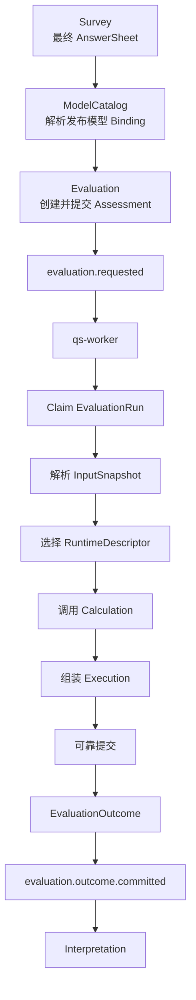

# Evaluation 模块

> 状态：已实现，当前 canonical 文档已完成本轮重构。本文负责说明 Evaluation 为什么存在、稳定主链路是什么，以及它和 Survey、ModelCatalog、Calculation、Interpretation 的边界。

## 1. 30 秒结论

Evaluation 是 qs-server 的统一测评执行模块：

> 它接收已经绑定发布模型的作答事实，解析本次执行所需的问卷、模型和答卷输入，调用 Calculation 完成计算，并将结果可靠地提交为与具体模型类型无关的 Outcome。

```text
AnswerSheet + Published AssessmentModel
  -> Assessment           一次测评业务实例
  -> EvaluationRun        一次可治理的执行尝试
  -> Calculation          无状态计算内核
  -> Execution            尚未提交的进程内结果
  -> EvaluationOutcome    不可变测评结果事实
  -> evaluation.outcome.committed
```

Evaluation 的价值不在于集中实现所有算法，而在于让不同测评模型共享同一条执行主链路：

- ModelCatalog 收敛模型结构、模型身份和执行路由差异；
- Calculation 收敛计分、分类、常模映射和任务表现算法差异；
- Evaluation 收敛执行编排、状态推进和结果提交差异；
- Interpretation 消费 Outcome，生成面向医生、患者和家长的报告。

因此，接入一个使用已有执行机制的新模型时，Evaluation 主链路不应随 model code 改动。

## 2. 为什么需要独立的 Evaluation

如果系统只有一种固定量表，可以在 AnswerSheet 提交后直接调用一段计分代码，再拼装一份报告。但当系统同时支持医学量表、人格测评、行为评定和认知测验后，这种实现会迅速产生三个问题。

### 2.1 业务实例与计算过程混在一起

一次测评不仅是一次函数调用，还需要回答：

- 谁是受试者；
- 使用了哪份答卷；
- 答卷对应哪个问卷版本；
- 使用了哪个已发布模型版本；
- 测评来自门诊临时发起还是 Plan；
- 当前正在执行、已经成功，还是已经失败；
- 失败发生在哪一次尝试，是否允许重试。

这些事实不能只存在于 Worker 日志或临时函数参数中，需要由 Assessment 和 EvaluationRun 显式承载。

### 2.2 模型差异容易侵入执行主流程

如果 Evaluation 按模型编码分支，主流程最终会变成：

```text
if model == SNAP_IV ...
else if model == MBTI ...
else if model == BRIEF_2 ...
else if model == SPM ...
```

这种设计会让每次增加模型都修改核心链路。当前架构改为根据已发布模型的执行身份解析运行机制：模型 code 是业务资产身份，不是执行器注册键；多个模型可以复用同一种 AlgorithmFamily。

### 2.3 计算成功不等于结果事实已经成立

Calculation 返回结果以后，系统仍需要保证：

- Outcome 已经持久化；
- Assessment 已经进入 `evaluated`；
- EvaluationRun 已经进入 `succeeded`；
- 必要的得分查询投影已经更新；
- `evaluation.outcome.committed` 已经进入可靠 Outbox。

只有这些事实处于同一个可靠提交边界，Interpretation 才能安全开始报告生成。Evaluation 因此也是 ModelCatalog、Calculation 与 Interpretation 之间的事实边界。

## 3. 统一执行主链路



这条链路有两个准入条件：

1. AnswerSheet 已经是 Survey 认可的最终作答事实；
2. 问卷已经绑定一个可执行的已发布 AssessmentModel。

没有绑定模型的独立 Questionnaire 仍然可以收集 AnswerSheet，但其业务链路应在 Survey 结束，不应进入 Evaluation。当前实现仍可能为这类答卷创建无模型的 pending Assessment，这是已识别的设计债务，不是目标业务语义。

## 4. Evaluation 负责什么

| 职责 | Evaluation 要保护的内容 |
| --- | --- |
| 创建测评实例 | 将受试者、答卷、问卷版本、模型版本和业务来源固化到 Assessment |
| 管理业务生命周期 | 区分 pending、submitted、evaluated、failed |
| 管理执行尝试 | 记录 attempt、claim、lease、失败分类和重试决定 |
| 解析执行输入 | 精确读取答卷、问卷版本和已发布模型版本 |
| 选择执行机制 | 从模型身份推导 AlgorithmFamily、DecisionKind 和 RuntimeDescriptor |
| 编排计算 | 将模型输入适配为 Calculation 输入，再映射为统一 Execution |
| 提交结果事实 | 原子提交 Outcome、Assessment、Run、查询投影和 Outbox 事件 |
| 提供结果读取 | 提供 Assessment、Run、Outcome 和得分趋势等只读能力 |

Evaluation 中的“可靠执行”是重要职责，但 Claim、Lease、Outbox 和消息投递的通用实现细节将在 `03-基础设施` 中展开。本模块文档只解释这些机制保护了什么 Evaluation 语义。

## 5. Evaluation 不负责什么

| 不属于 Evaluation 的内容 | 所有者 | Evaluation 如何使用 |
| --- | --- | --- |
| Questionnaire、Question、AnswerSheet 的维护与校验 | Survey | 只读取精确版本和最终作答事实 |
| AssessmentModel 草稿、DefinitionV2、发布与模型版本 | ModelCatalog | 只读取已发布模型 |
| Factor 计分、分类、常模映射、任务表现算法 | Calculation | 通过稳定接口调用无状态计算能力 |
| 报告文案、章节、建议和 Report 生命周期 | Interpretation | 发布 Outcome committed 事件并提供只读事实 |
| Plan 周期和 Task 调度 | Plan | 只记录 Assessment 的业务来源 |
| 跨测评统计聚合和工作台组合视图 | Statistics / Journey | 提供事实或事件，不维护组合进度 |

## 6. 三个必须守住的边界

### 6.1 Decision 不等于 Interpretation

ModelCatalog 中的 Decision 是机器可执行的结果判定规则，例如：

- 某个分数区间对应哪个等级；
- 多个因子怎样组合为人格类型；
- 原始分在特定常模中对应哪个标准分和等级；
- 任务表现对应哪个能力水平。

Evaluation 执行这些规则后，可以在 Outcome 中形成 `level_code`、severity、profile 和维度等级等结构化事实，但不生成面向读者的报告文案。把这些事实组织成解释、建议和报告章节，是 Interpretation 的职责。

### 6.2 Execution 不等于 Outcome

Execution 是 Calculation 返回并由适配器组装的进程内结果。在可靠事务提交前，它随进程失败而消失，下游不能依赖它。

Outcome 是成功 EvaluationRun 产生的不可变持久化事实。只有 Outcome、Assessment、Run 和 Outbox 同时提交成功，Assessment 才能成为 `evaluated`。

### 6.3 evaluated 不等于报告已生成

`Assessment=evaluated` 只表示测评结果事实已经可靠提交。报告生成可能仍在等待、执行或失败。

Interpretation 失败不得把已经 `evaluated` 的 Assessment 改回 `failed`。面向客户端的“测评是否全部完成”应由跨模块 Journey/Read Model 组合 Assessment 与 Report 状态，而不是向 Assessment 增加 `interpreted` 状态。

## 7. 设计原则

### 7.1 按机制扩展，不按模型编码扩展

模型 code 标识一项业务资产；AlgorithmFamily 标识一种可复用的计算机制。同一机制可以服务多个发布模型。

增加同类模型时，优先通过配置和发布完成接入；只有出现新的输入形态或计算机制时，才增加 InputProvider、RuntimeDescriptor 或 Calculation 能力。

### 7.2 业务结果与执行过程分离

Assessment 回答“这次测评最终怎样”，EvaluationRun 回答“某次执行尝试发生了什么”。这样既避免将 claim、lease 等运行字段塞进业务聚合，也保留了失败和重试证据。

### 7.3 结果事实先于报告生成

Interpretation 不读取 Evaluation 的临时对象，也不依赖 Worker 内存返回值。它只消费已经可靠提交的 Outcome，从而让评分成功与报告生成可以独立失败、独立重试。

### 7.4 历史执行使用精确版本

Assessment 固化 Questionnaire 与 AssessmentModel 的发布版本。运营发布新版本后，已经创建的 Assessment 和已经提交的 Outcome 不随之漂移。

## 8. 文档地图

本模块采用精简结构。当前正在按照下列顺序逐篇重构：

| 顺序 | 文档 | 状态 | 核心问题 |
| --- | --- | --- | --- |
| 10 | [领域模型](./10-领域模型.md) | 已重写 | Assessment、EvaluationRun、Execution 与 Outcome 为什么分开 |
| 20 | [核心设计：统一测评执行模型](./20-核心设计-统一测评执行模型.md) | 已重写 | 输入解析、运行时路由和 Calculation 边界如何保持主链路稳定 |
| 21 | [核心设计：状态、幂等与可靠提交](./21-核心设计-状态、幂等与可靠提交.md) | 已重写 | 双状态机和可靠提交保护什么业务语义 |
| 22 | [核心设计：Outcome 事实与解释边界](./22-核心设计-Outcome事实与解释边界.md) | 已重写 | Outcome、查询投影、Decision 和 Interpretation 如何分工 |
| 30 | [关键链路：从 AnswerSheet 到 Assessment](./30-关键链路-从AnswerSheet到Assessment.md) | 已重写 | 哪些答卷进入 Evaluation，Assessment 如何幂等受理 |
| 31 | [关键链路：从执行请求到 Outcome 提交](./31-关键链路-从执行请求到Outcome提交.md) | 已重写 | Worker 如何执行并形成可靠 Outcome |
| 90 | [设计问题与重构清单](./90-设计问题与重构清单.md) | 已编写 | 已确认的实现偏差、优先级和后续验收边界 |

后续改造应从 `90-设计问题与重构清单.md` 的稳定编号进入；代码、机器契约、配置和 migration 仍然是更高优先级事实源。

## 9. 事实源与验证

| 主题 | 事实源 |
| --- | --- |
| Assessment | [`domain/evaluation/assessment`](../../../internal/apiserver/domain/evaluation/assessment/) |
| EvaluationRun | [`domain/evaluation/run`](../../../internal/apiserver/domain/evaluation/run/) |
| Execution / Outcome | [`domain/evaluation/outcome`](../../../internal/apiserver/domain/evaluation/outcome/) |
| Calculation | [`domain/calculation`](../../../internal/apiserver/domain/calculation/) |
| 执行编排 | [`application/evaluation/execute`](../../../internal/apiserver/application/evaluation/execute/) |
| 执行输入 | [`port/evaluationinput`](../../../internal/apiserver/port/evaluationinput/)、[`infra/evaluationinput`](../../../internal/apiserver/infra/evaluationinput/) |
| 可靠提交 | [`application/evaluation/outcome/commit`](../../../internal/apiserver/application/evaluation/outcome/commit/) |
| MySQL 持久化 | [`infra/mysql/evaluation`](../../../internal/apiserver/infra/mysql/evaluation/)、[`infra/mysql/checkpoint`](../../../internal/apiserver/infra/mysql/checkpoint/) |
| 事件契约 | [`configs/events.yaml`](../../../configs/events.yaml) |
| 组合根 | [`container/modules/evaluation`](../../../internal/apiserver/container/modules/evaluation/) |

```bash
go test ./internal/apiserver/domain/evaluation/...
go test ./internal/apiserver/domain/calculation/...
go test ./internal/apiserver/application/evaluation/...
go test ./internal/apiserver/infra/evaluationinput
go test ./internal/apiserver/infra/mysql/evaluation ./internal/apiserver/infra/mysql/checkpoint
go test ./internal/apiserver/container/modules/evaluation/...
make docs-hygiene
```
