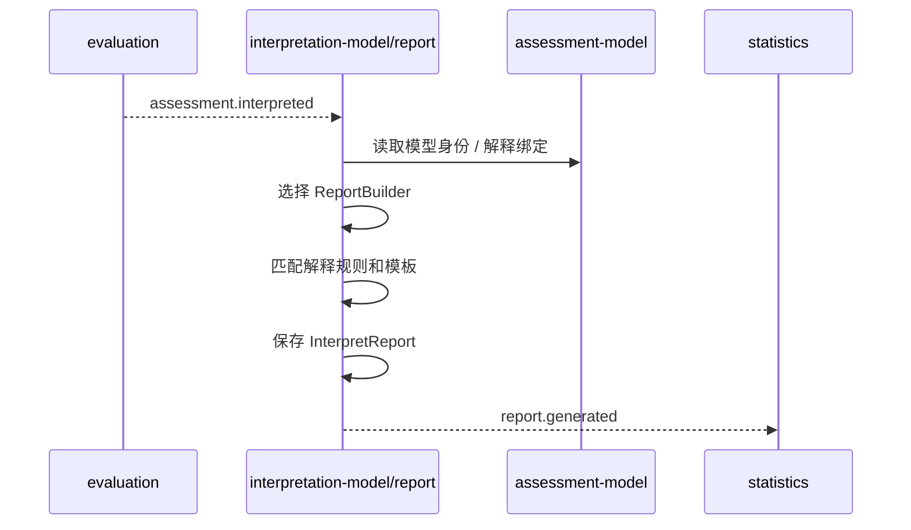

# 报告生成链路

## 1. 业务目标

在 Evaluation 完成后，选择合适的报告 builder 和解释适配器，生成并持久化 `InterpretReport`。

---

## 2. 参与对象

| 对象 | 角色 |
| ---- | ---- |
| `EvaluationResult` | 结构化测评结果 |
| `ModelIdentity` | 报告选择依据 |
| `ReportBuilder` | 报告构建器 |
| `InterpretReport` | 报告实例 |

---

## 3. 前置条件

- Evaluation 已生成结构化结果。
- 能识别模型身份和报告构建器。
- 报告持久化能力可用。

---

## 4. 流程图

---

## 5. 关键规则

- 报告生成不重新执行测评。
- 报告失败不应改写 EvaluationResult。
- 报告事件代表报告实例生成，不代表统计投影完成。
- 报告内容必须能追溯到执行结果和模型身份。

---

## 6. 幂等与异常处理

| 场景 | 处理 |
| ---- | ---- |
| 重复生成同一报告 | 按 EvaluationID / ReportID 保持幂等 |
| Builder 缺失 | 报告生成失败，保留执行结果 |
| 模板错误 | 修复后可重建报告 |
| 统计消费失败 | 不影响报告主事实 |

---

## 7. 产出结果

- `InterpretReport`。
- `report.generated` 事件。
- 查询端可读取的报告状态和内容。
