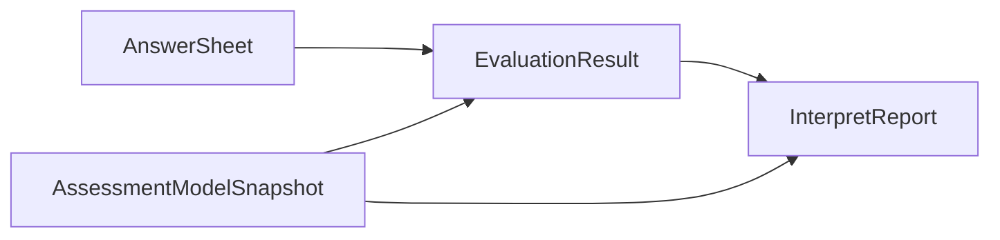

# 报告版本与可追溯性

## 1. 追溯目标

报告需要回答：

- 基于哪一次 Evaluation 生成。
- 使用哪个模型身份和快照。
- 使用哪个 builder / adapter。
- 报告生成时间和内容版本是什么。

---

## 2. 追溯关系

---

## 3. 版本规则

| 场景 | 规则 |
| ---- | ---- |
| 模型规则变更 | 发布新的模型快照 |
| 报告模板变更 | 记录报告生成时的模板 / builder 信息 |
| 历史报告查询 | 返回当时生成的报告实例 |
| 重建报告 | 必须明确是重建而不是静默覆盖 |

---

## 4. 边界

报告版本追溯不等于模型版本管理。模型版本属于 `assessment-model`，报告版本属于 `interpretation-model / report`。
