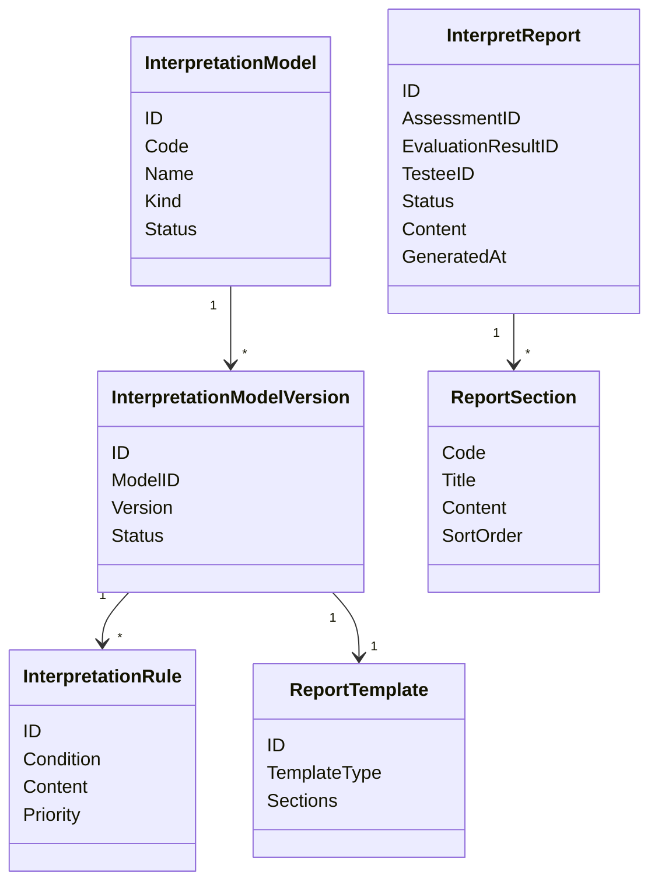

# Interpretation Model 领域模型

## 1. 模块核心概念

本模块区分两类对象：

- `InterpretationModel`：解释规则资产。
- `InterpretReport`：一次测评结果对应的报告实例。

前者可以版本化和复用，后者是生成后的业务事实。

---

## 2. 领域模型图

---

## 3. 聚合根与实体

| 类型 | 对象 | 说明 |
| ---- | ---- | ---- |
| 聚合根 | `InterpretReport` | 一份最终报告实例 |
| 实体 | `ReportSection` | 报告章节 |
| 资产 | `InterpretationModel` | 解释规则资产，当前代码中分散在 report builder / adapter 能力里 |
| 实体 | `InterpretationRule` | 分数、因子、风险等解释规则 |

---

## 4. 值对象

| 值对象 | 说明 |
| ------ | ---- |
| `ModelIdentity` | 报告识别模型来源 |
| `RiskLevel` | 风险或等级展示 |
| `Suggestion` | 建议文案 |
| `ReportContent` | 报告结构化内容 |
| `ReportStatus` | `pending / generating / generated / failed` |
| `Conclusion` / `Suggestion` | 基于评估事实产生的解释和行动建议，属于报告内容而非评分事实 |

---

## 5. 领域服务

| 服务 | 职责 |
| ---- | ---- |
| Builder Registry | 按模型身份选择报告构建器 |
| Score Adapter | 适配分数型测评报告 |
| Personality Adapter | 适配人格测评报告 |
| Suggestion Generator | 生成建议文案 |
| Durable Saver | 持久化报告实例 |

---

## 6. 领域事件

| 事件 | 语义 |
| ---- | ---- |
| `report.generated` | 最终报告已生成 |

---

## 7. 模型边界与反例

| 反例 | 说明 |
| ---- | ---- |
| `InterpretReport` 不是 `EvaluationResult` | 报告是面向阅读的解释聚合 |
| `InterpretationModel` 不是 `AssessmentModel` | 前者管解释文案和报告结构，后者管测评规则资产 |
| `ReportBuilder` 不是执行器 | Builder 不负责计分和状态机 |
| `report.generated` 不是统计完成 | 统计只是后续投影 |
| `InterpretReport` 不拥有 Assessment | Report 只引用 Assessment / EvaluationResult，不修改其状态 |
| Report failed 不等于 Evaluation failed | 评估事实保持有效，报告可以独立重试 |
| `assessment_score.conclusion / suggestion` 不是权威归属 | 当前列是兼容债；目标事实归属在 InterpretReport |
