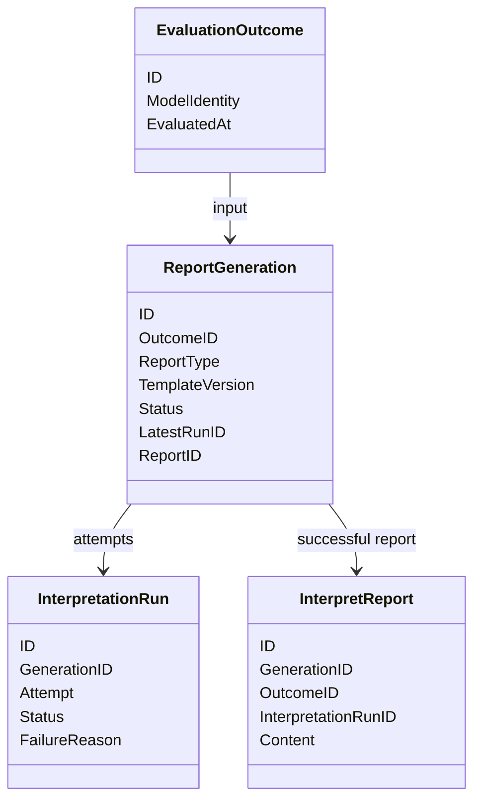
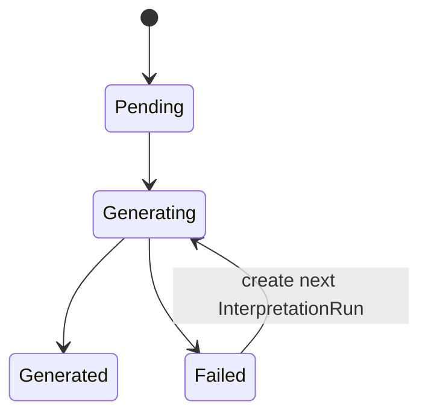

# Interpretation 领域模型

> 本文描述当前已落地的三对象领域模型，也是后续演进必须保持的边界基线。

## 1. 三对象模型

| 对象 | 职责 | 不负责 |
| ---- | ---- | ------ |
| `ReportGeneration` | 报告生成意图、幂等键、总体状态、最新 Run 和成品引用 | 报告内容、评分计算 |
| `InterpretationRun` | 一次实际构建尝试、attempt、运行审计和失败原因 | 修改 Outcome 或 Assessment |
| `InterpretReport` | 已成功生成的不可变报告成品 | `pending/generating/failed` 与重试控制 |

## 2. 幂等与身份

`ReportGeneration` 的业务唯一键为：`OutcomeID + ReportType + TemplateVersion`。

它允许同一 Outcome 以后按不同报告类型、模板或受众生成不同报告；同一键重复请求必须复用同一 Generation。`ReportID` 是独立身份，不再承担 AssessmentID 的隐式别名职责。

## 3. 状态机

`InterpretationRun` 独立记录 `pending -> running -> succeeded / failed`。Generation 的状态表达可查询的业务总体状态；Run 的状态表达某次尝试的审计事实。

## 4. 事件与边界

- 输入：`evaluation.outcome.committed`；它是 Evaluation 已可靠提交事实，不是重新计分命令。
- 成功：`interpretation.report.generated`。
- 失败：`interpretation.report.failed`，携带 `report_id`、`outcome_id`、`attempt` 与失败原因。
- `pending`、`generating` 只作为查询状态，不发 durable outbox 事件。

Interpretation 只读取 `EvaluationOutcome`，绝不修改 `Assessment`、`EvaluationRun`、score 或 Outcome。
