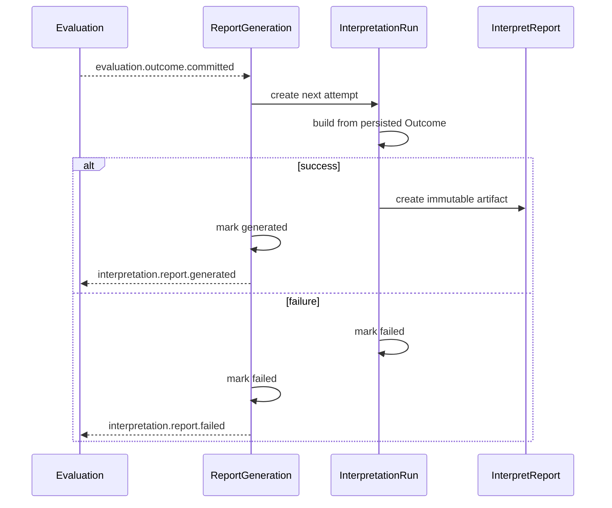

# 报告生成链路

## 1. 目标流程

## 2. 事务边界

| 结果 | 同一事务提交 |
| ---- | ------------ |
| 开始尝试 | `ReportGeneration(generating)` 与新的 `InterpretationRun` |
| 成功 | `InterpretationRun(succeeded)`、`ReportGeneration(generated)`、`InterpretReport`、`interpretation.report.generated` outbox |
| 失败 | `InterpretationRun(failed)`、`ReportGeneration(failed)`、`interpretation.report.failed` outbox |

重试只能为同一个 Generation 创建新的 Run，并只读取持久化 Outcome；不得重新执行 Evaluator。

## 3. 查询语义

- `generated`：读取成品 `InterpretReport`。
- `pending / generating / failed`：读取 `ReportGeneration` 与最新 `InterpretationRun`。
- 客户端 `completed / interpreted`：由 Assessment `evaluated` 与 ReportGeneration `generated` 的读模型组合派生。
