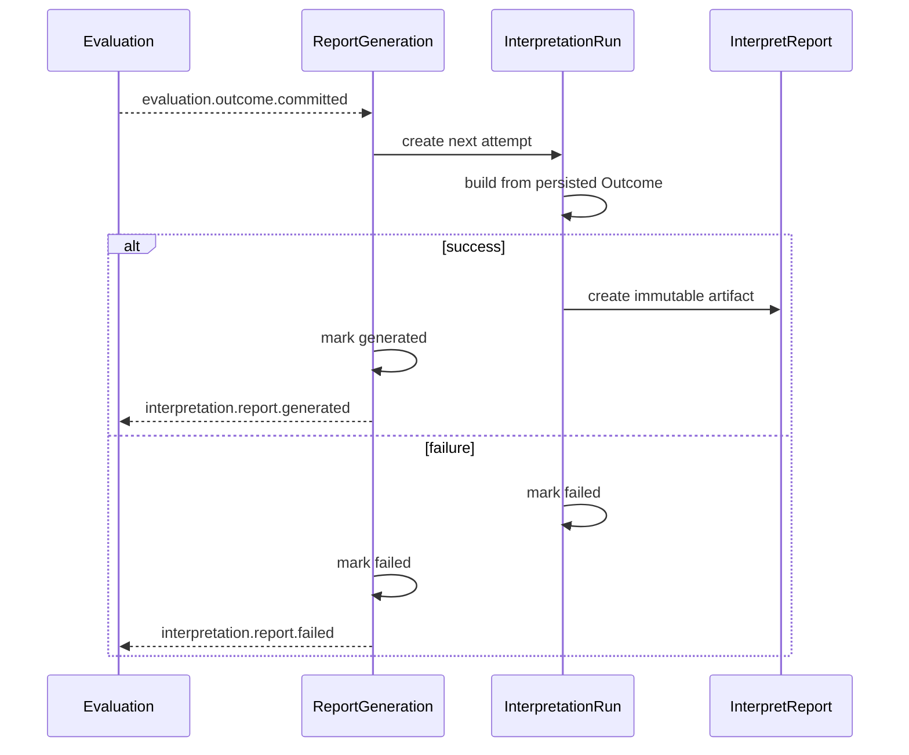

# 报告生成链路

## 1. 目标流程

## 2. 事务边界

| 结果 | 同一事务提交 |
| ---- | ------------ |
| 开始尝试 | `ReportGeneration(generating)` 与新的 `InterpretationRun` |
| 成功 | `InterpretationRun(succeeded)`、`ReportGeneration(generated)`、`InterpretReport`、`interpretation.report.generated` outbox |
| 失败 | `InterpretationRun(failed)`、`ReportGeneration(failed)`、`interpretation.report.failed` outbox |

重试只能为同一个 Generation 创建新的 Run，并只读取持久化 Outcome；不得重新执行 Evaluator。

终态由 `InterpretationCommitter` 可靠提交：Artifact 构造与 Builder 调用仍属于 `Executor`，但 Run/Generation 状态迁移、Artifact 持久化和 outbox 暂存不得分散在多个调用方。

`interpretation.report.generated / failed` 都以 `ReportGeneration` 为 aggregate，使用 `generation_id` 作为 aggregate id。构建器通过包含 `template_version` 的 Registry 键解析；同一机制发布新模板不会改变既有 Generation 重试所使用的 Builder。

## 2.1 Worker、gRPC 与重试

Worker 只消费 `evaluation.outcome.committed`，通过内部 gRPC 按 `outcome_id` 调用 Interpretation。gRPC 成功响应可为 `generated` 或 `processing`，两者均 ACK；响应携带 `generation_id`、`run_id`，生成成功时还携带 `report_id`。

当一次 Run 已持久化为 `failed`，gRPC 返回该 Run 的 `retryable`、`failure_kind`、`failure_code`、`generation_id` 与 `run_id`：

- `retryable = true`：Worker NACK 原始 `evaluation.outcome.committed`，下一次投递通过同一 Generation 创建下一 Run。
- `retryable = false`：Worker ACK；`interpretation.report.failed` 仅供审计，绝不触发新的生成命令。
- 调用超时、连接失败或终态提交前的基础设施错误：没有持久化失败事实，暂按可重试处理并 NACK。

## 2.2 查询切换与历史迁移

新查询以 Artifact/Generation/Run 为准：可按独立 `report_id` 查询 Artifact、按 `outcome_id` 查询全部 Generation、按 `assessment_id` 查询最新 Artifact 或 Generation 生命周期，并列出同一 Assessment 的历史 `template_version` 报告。`assessment_id` 只是关联键，绝不能再被当作 `report_id`。

上线顺序：先创建三对象集合和索引；新写路径只写三对象；完成态查询新优先、旧 `interpret_reports` 仅兜底。离线回填把每条旧 generated 报告映射为 `ReportGeneration(generated)`、`InterpretationRun(succeeded)` 和 Artifact，保留 `legacy-v1` 模板版本。对账确认新旧数量、Assessment 覆盖率和内容摘要一致后，使用 artifact-only 读模型关闭 legacy fallback。

## 3. 查询语义

- `generated`：读取成品 `InterpretReport`。
- `pending / generating / failed`：读取 `ReportGeneration` 与最新 `InterpretationRun`。
- 客户端 `completed / interpreted`：由 Assessment `evaluated` 与 ReportGeneration `generated` 的读模型组合派生。
