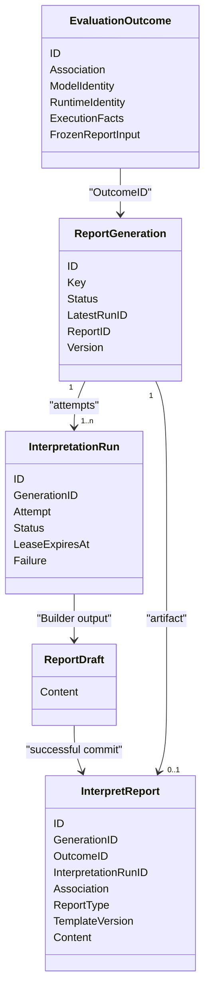
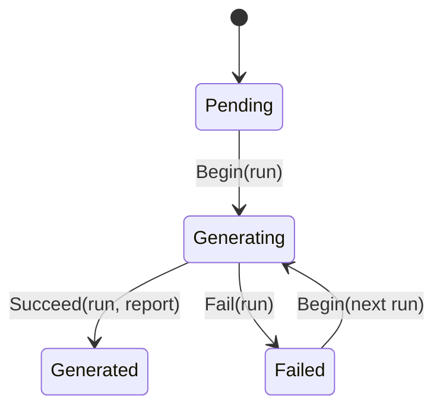
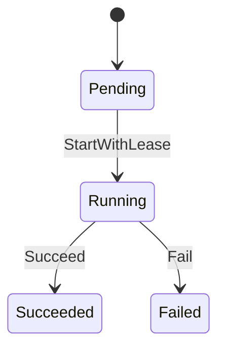

# Interpretation 领域模型

## 1. 本文回答

本文说明 Interpretation 为什么不能只有一个 `Report` 对象，以及 ReportGeneration、InterpretationRun、Draft、InterpretReport 和查询投影各自保护什么语义。

## 2. 30 秒结论

Interpretation 的核心是“报告生成意图”、“执行尝试”和“成功成品”的拆分：

| 对象 | 回答的问题 | 是否可重试 |
| --- | --- | --- |
| `ReportGeneration` | 这份 Outcome 按哪种报告类型和模板版本生成过吗 | 通过新 Run 重试 |
| `InterpretationRun` | 第几次尝试、谁在执行、为什么失败 | 终态不覆盖，新建下一 attempt |
| `Report Draft` | Builder 在本次进程中组装出了什么 | 可丢弃、可重建 |
| `InterpretReport` | 哪次成功 Run 产生了什么不可变报告 | 不可重试或覆盖 |

`report_query_catalog` 只是按 Assessment 选择当前报告正文来源的读模型，不加入领域对象数量。

## 3. 模型关系



## 4. ReportGeneration：幂等生成意图

`ReportGeneration` 是本模块聚合根。它的业务唯一键为：

```text
OutcomeID + ReportType + TemplateVersion
```

这个键同时保护三件事：

1. 同一 Outcome 的重复事件不会创建第二个同版本报告意图。
2. 不同 ReportType 可以共享同一 Outcome，而不互相覆盖。
3. 新 TemplateVersion 会创建新 Generation，不会静默改写历史报告。

当前 `ReportType` 只有 `standard`，当前默认模板版本是 `legacy-v1`。它们已进入身份键，因此后续扩展不需要破坏幂等模型。

Generation 状态机：



| 状态 | 必须引用 | 禁止引用 |
| --- | --- | --- |
| `pending` | 无 | LatestRunID、ReportID |
| `generating` | LatestRunID | ReportID |
| `failed` | LatestRunID | ReportID |
| `generated` | LatestRunID、ReportID | 无 |

Generation 还维护 `Version`，Mongo Repository 使用 expected version 做 CAS，防止两个 worker 同时推进聚合。

## 5. InterpretationRun：一次执行尝试

Run 不保存报告内容，只保存执行事实：

- `GenerationID + Attempt` 确定尝试序号；
- `TraceID` 关联消息、gRPC 和日志；
- `StartedAt / LeaseExpiresAt / FinishedAt` 记录执行窗口；
- `Failure` 只保存可安全暴露的分类事实。



Run 失败分为：

| FailureKind | 当前典型原因 | 当前 Retryable |
| --- | --- | --- |
| `input` | 运行时机制无法从冻结事实确定 | false |
| `template` | 完整机制键无对应 Builder | false |
| `build` | Builder 报错或返回空 Draft | true；无效 Artifact 为 false |
| `timeout` | running Run lease 过期 | true |

Run 终态不会改回 running。可重试失败通过 `Next` 创建 `attempt + 1`，保留旧尝试审计事实。

## 6. Draft 与 InterpretReport：内容与生命周期分离

`Report Draft` 只包含防御性拷贝后的 `Content`，不包含 ID、Run、失败或持久化状态。因此：

- ModelCatalog 预览可以返回 Draft，不制造生产报告身份；
- Builder 可以纯粹关注内容组装；
- 事务失败时，Draft 丢弃即可，不留下半成品。

`InterpretReport` 只能在成功路径创建。它固化：

- Report / Generation / Outcome / 成功 Run 四个身份关系；
- `OrgID / AssessmentID / TesteeID` 查询关联快照；
- `ReportType / TemplateVersion / GeneratedAt`；
- ModelIdentity、PrimaryScore、Level、Conclusion、Dimensions、Suggestions 和 ModelExtra。

`Association` 只授予查询关联能力，不是 Assessment 聚合引用，也不给 Interpretation 任何反向修改权。

## 7. 读模型不是领域对象

`report_query_catalog` 按 AssessmentID 保留一行“当前正文来源”，来源可以是：

- `artifact`：新的 `interpret_report_artifacts`；
- `archive`：历史 `archived_reports`。

它不表达生成意图、尝试或报告内容，只解决列表分页和当前来源选择。当读模型指向不存在正文时，Repository 返回 `CatalogDanglingSourceError`，而不静默忽略数据损坏。

## 8. 领域服务与应用服务

| 能力 | 所在层 | 职责 |
| --- | --- | --- |
| `rendering.Registry` | Domain | 按完整机制键解析 Builder |
| `Builder` / scoring / typology | Domain | 把冻结事实确定性组装为 Draft |
| `presentation.Presenter` | Domain | 判定 audience 对报告 section 的可见性 |
| `automation.Service` | Application | 以可信系统行为人从 OutcomeID 启动或重试生成 |
| `Starter / Executor / Committer` | Application | 争抢 Run、调用 Builder、提交终态 |
| `participant / clinician / administration` | Application | 先授权，再读取并按 audience 投影 |
| `operations.Service` | Application | 以机构范围和 IAM capability 查询 Generation / Run / Report 审计事实 |

Audience 不进入 Generation key。一份标准不可变报告在读取阶段应用 participant / clinician / admin 可见性；当前 `ModelExtra` 对 participant 和 admin 可见，对 clinician 隐藏。

## 9. 终态事件

Interpretation 只发布两个 durable 终态事件：

| 事件 | 聚合身份 | 关键事实 |
| --- | --- | --- |
| `interpretation.report.generated` | ReportGeneration ID | Run / Report / Outcome、attempt、template、builder、结果摘要 |
| `interpretation.report.failed` | ReportGeneration ID | Run / Outcome、attempt、failure kind/code、retryable、safe reason |

`pending / generating` 和尝试开始不是跨模块终态事实，因此不发 durable event。

## 10. 不变量清单

1. Interpretation 只读 EvaluationOutcome，不持有 Assessment Repository。
2. 同一 Generation 只能关联一份成功 InterpretReport。
3. Run 只记执行事实，Report 只记成品内容。
4. 失败不创建 Report，成功 Report 不保存失败原因。
5. 新模板版本创建新 Generation，不覆盖旧 Report。
6. 查询授权发生在读取正文前，报告关联字段本身不构成授权。
7. `interpreted / completed` 只能在 Journey / 状态读模型中派生。

## 11. 代码与验证入口

- Generation：`internal/apiserver/domain/interpretation/generation`
- Run：`internal/apiserver/domain/interpretation/run`
- Draft / Report：`internal/apiserver/domain/interpretation/report`
- 渲染与呈现：`internal/apiserver/domain/interpretation/rendering`、`presentation`
- 行为人用例：`internal/apiserver/application/interpretation`

```bash
go test ./internal/apiserver/domain/interpretation/generation
go test ./internal/apiserver/domain/interpretation/run
go test ./internal/apiserver/domain/interpretation/report
go test ./internal/apiserver/domain/interpretation/rendering ./internal/apiserver/domain/interpretation/presentation
```
